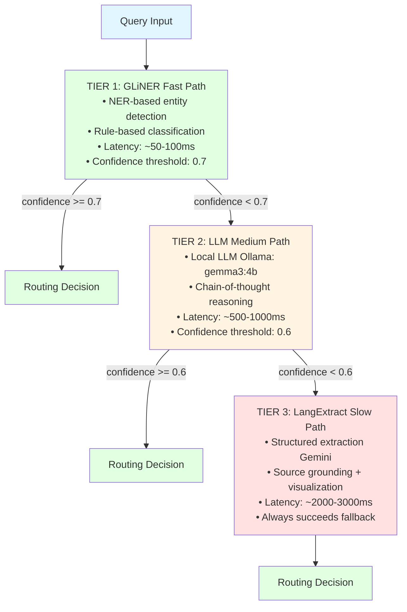
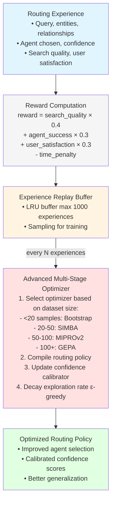
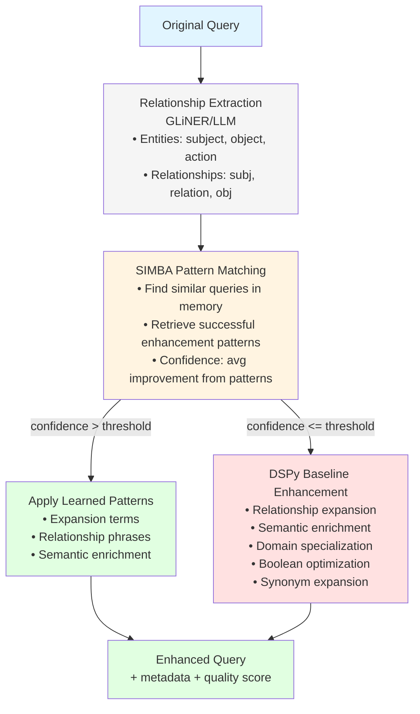

# Routing Module Study Guide

**Package:** `cogniverse_agents` (Implementation Layer)
**Location:** `libs/agents/cogniverse_agents/routing/`
**Last Updated:** 2026-01-25
**Purpose:** Comprehensive guide to intelligent query routing strategies and optimization

---

## Table of Contents
1. [Module Overview](#module-overview)
2. [Architecture](#architecture)
3. [Core Components](#core-components)
4. [Routing Strategies](#routing-strategies)
5. [Optimization Systems](#optimization-systems)
6. [Data Flow](#data-flow)
7. [Usage Examples](#usage-examples)
8. [Production Considerations](#production-considerations)
9. [Testing](#testing)

---

## Module Overview

### Purpose
The Routing Module provides intelligent query routing capabilities with multiple strategies, advanced optimization (GRPO), and production-ready features including caching, cross-modal fusion, and query enhancement.

### Key Features
- **Tiered Routing**: Fast (GLiNER) → Medium (LLM) → Slow (LangExtract) with confidence thresholds
- **Multiple Strategies**: GLiNER NER, LLM-based, Keyword, Hybrid, Ensemble, LangExtract
- **Advanced Optimization**: GRPO (DSPy 3.0) with GEPA, MIPROv2, SIMBA optimizers
- **Query Enhancement**: SIMBA-based learning with relationship extraction
- **Cross-Modal Optimization**: Multi-modal fusion benefit prediction
- **Production Features**: Per-modality caching (LRU), parallel execution, metrics

### Package Structure
```
libs/agents/cogniverse_agents/routing/
├── router.py                           # Comprehensive router (1145 lines)
├── strategies.py                       # Core routing strategies (1292 lines)
├── advanced_optimizer.py               # GRPO optimization (1273 lines)
├── config.py                           # Configuration system (391 lines)
├── query_enhancement_engine.py         # Query enhancement with SIMBA (1037 lines)
├── cross_modal_optimizer.py            # Multi-modal fusion (630 lines)
├── modality_cache.py                   # Per-modality caching (255 lines)
├── parallel_executor.py                # Parallel agent execution
├── modality_evaluator.py               # Modality evaluation
├── phoenix_span_evaluator.py           # Phoenix telemetry integration
└── base.py                             # Base routing classes
```

---

## Architecture

### Tiered Routing Decision Tree



### GRPO Optimization Loop



### Query Enhancement Pipeline



---

## Core Components

### 1. RoutingConfig (config.py:20-391)

**Purpose**: Complete configuration system for routing with environment variable overrides

**Key Attributes**:
```python
@dataclass
class RoutingConfig:
    # Routing mode
    routing_mode: str = "tiered"  # "tiered", "ensemble", "hybrid", "single"

    # Tier configuration
    tier_config: dict = {
        "enable_fast_path": True,
        "fast_path_confidence_threshold": 0.7,
        "slow_path_confidence_threshold": 0.6,
        "max_routing_time_ms": 1000,
    }

    # GLiNER configuration (Tier 1)
    gliner_config: dict = {
        "model": "urchade/gliner_large-v2.1",
        "threshold": 0.3,
        "labels": [...],  # 17 entity types
        "device": "cpu",
    }

    # LLM configuration (Tier 2)
    llm_config: dict = {
        "provider": "local",
        "model": "gemma3:4b",
        "endpoint": "http://localhost:11434",
        "use_chain_of_thought": True,
        "use_think_mode": True,
    }

    # Optimization config
    optimization_config: dict = {
        "enable_auto_optimization": True,
        "optimization_interval_seconds": 3600,
        "dspy_enabled": True,
        "dspy_max_bootstrapped_demos": 10,
    }

    # Performance monitoring
    monitoring_config: dict = {
        "enable_metrics": True,
        "metrics_batch_size": 100,
        "enable_tracing": True,
    }

    # Caching
    cache_config: dict = {
        "enable_caching": True,
        "cache_ttl_seconds": 300,
        "max_cache_size": 1000,
    }
```

**Key Methods**:
```python
def merge_with_env(self):
    """Override config from environment variables"""
    # Format: ROUTING_<SECTION>_<KEY>
    # Example: ROUTING_LLM_MODEL=gemma2:2b

@classmethod
def from_file(cls, filepath: Path) -> "RoutingConfig":
    """Load configuration from JSON/YAML file"""

def save(self, filepath: Path):
    """Save configuration to file"""
```

**Usage**:
```python
# Load from file with env overrides
config = RoutingConfig.from_file("configs/routing_config.yaml")
config.merge_with_env()

# Or use defaults
config = RoutingConfig()

# Save example config
config.save("configs/my_routing.json")
```

---

### 2. GLiNERRoutingStrategy (strategies.py:24-381)

**Purpose**: Fast NER-based routing using GLiNER for entity detection (Tier 1)

**Key Features**:
- Entity detection with 17 label types
- Rule-based classification from entities
- Circuit breaker for fault tolerance
- Performance metrics tracking

**Key Methods**:
```python
async def route_query(
    self,
    query: str,
    context: Optional[Dict[str, Any]] = None,
    return_detailed_metrics: bool = False
) -> RoutingDecision:
    """
    Route query using GLiNER entity detection

    Process:
    1. Extract entities with GLiNER
    2. Classify modality from entity labels
    3. Determine generation type from patterns
    4. Calculate confidence from entity scores

    Returns:
        RoutingDecision with agent, modality, generation_type
    """
```

**Entity Classification Logic**:
```python
# Video indicators
video_entities = ["video_content", "visual_content", "media_content"]

# Text indicators
text_entities = ["document_content", "text_information", "written_content"]

# Summary indicators
summary_entities = ["summary_request", "overview_request"]

# Report indicators
report_entities = ["detailed_analysis", "report_request"]
```

**Performance**:
- Latency: 50-100ms
- Confidence threshold: 0.7
- Success rate: ~85% on clear queries

---

### 3. LLMRoutingStrategy (strategies.py:383-670)

**Purpose**: LLM-based routing with chain-of-thought reasoning (Tier 2)

**Key Features**:
- Uses local Ollama LLMs (gemma3:4b)
- Chain-of-thought prompting
- JSON structured output
- Retry logic with exponential backoff

**Key Methods**:
```python
async def route_query(
    self,
    query: str,
    context: Optional[Dict[str, Any]] = None,
    return_detailed_metrics: bool = False
) -> RoutingDecision:
    """
    Route using LLM with chain-of-thought

    Process:
    1. Format prompt with system instructions
    2. Call LLM with chain-of-thought mode
    3. Parse JSON response
    4. Extract reasoning and confidence
    5. Create RoutingDecision
    """
```

**Prompt Template**:
```python
system_prompt = """You are a precise routing agent for a multi-modal search system.
Analyze the user query and determine:
1. search_modality: "video", "text", or "both"
2. generation_type: "raw_results", "summary", or "detailed_report"
3. Provide reasoning for your decision

Use exact JSON format in your response."""
```

**Performance**:
- Latency: 500-1000ms
- Confidence threshold: 0.6
- Success rate: ~92% on medium complexity queries

---

### 4. AdvancedRoutingOptimizer (advanced_optimizer.py:136-1273)

**Purpose**: GRPO optimization with DSPy 3.0 advanced optimizers

**Key Features**:
- Multi-stage optimization (Bootstrap → SIMBA → MIPROv2 → GEPA)
- Experience replay buffer
- Reward-based learning
- Confidence calibration
- Exploration vs exploitation (ε-greedy)

**Architecture**:
```python
class AdvancedRoutingOptimizer:
    def __init__(
        self,
        config: Optional[AdvancedOptimizerConfig] = None,
        storage_dir: str = "data/optimization"
    ):
        # Experience storage
        self.experiences: List[RoutingExperience] = []
        self.experience_replay: List[RoutingExperience] = []  # LRU buffer

        # Metrics
        self.metrics: OptimizationMetrics = ...

        # GRPO components
        self.advanced_optimizer = None  # Multi-stage optimizer
        self.routing_policy = None      # DSPy module
        self.confidence_calibrator = None

        # Exploration
        self.current_epsilon = 0.1  # ε-greedy
```

**Key Methods**:

```python
async def record_routing_experience(
    self,
    query: str,
    entities: List[Dict[str, Any]],
    relationships: List[Dict[str, Any]],
    enhanced_query: str,
    chosen_agent: str,
    routing_confidence: float,
    search_quality: float,
    agent_success: bool,
    processing_time: float = 0.0,
    user_satisfaction: Optional[float] = None,
) -> float:
    """
    Record routing experience and compute reward

    Reward computation:
    reward = (search_quality × 0.4)
           + (agent_success × 0.3)
           + (user_satisfaction × 0.3)
           - (time_penalty)

    Triggers optimization every N experiences or on performance decline
    """

async def optimize_routing_decision(
    self,
    query: str,
    entities: List[Dict[str, Any]],
    relationships: List[Dict[str, Any]],
    enhanced_query: str,
    baseline_prediction: Dict[str, Any],
) -> Dict[str, Any]:
    """
    Apply GRPO optimization to routing decision

    Process:
    1. Check if optimization ready (min experiences)
    2. Apply exploration vs exploitation (ε-greedy)
    3. Use optimized policy for prediction
    4. Calibrate confidence score
    5. Return optimized decision
    """

def _create_advanced_optimizer(self):
    """
    Create multi-stage optimizer based on dataset size

    Stages:
    - Bootstrap (0-20): Few-shot learning
    - SIMBA (20-50): Similarity-based memory
    - MIPROv2 (50-100): Metric-aware instruction optimization
    - GEPA (100+): Reflective prompt evolution
    """
```

**Optimization Stages**:
```python
# Adaptive optimizer selection
if dataset_size < 20:
    optimizer = BootstrapFewShot(metric=routing_accuracy_metric)
elif dataset_size < 50:
    optimizer = SIMBA(metric=routing_accuracy_metric)
elif dataset_size < 100:
    optimizer = MIPROv2(metric=routing_accuracy_metric)
else:
    optimizer = GEPA(
        metric=routing_accuracy_metric,
        auto="light",
        reflection_lm=current_lm
    )
```

---

### 5. QueryEnhancementPipeline (query_enhancement_engine.py:743-1037)

**Purpose**: Complete query enhancement with SIMBA learning and relationship extraction

**Key Features**:
- Relationship extraction (entities + relationships)
- SIMBA pattern-based enhancement
- DSPy baseline enhancement (fallback)
- Multiple enhancement strategies
- Outcome recording for learning

**Key Methods**:

```python
async def enhance_query_with_relationships(
    self,
    query: str,
    entities: Optional[List[Dict[str, Any]]] = None,
    relationships: Optional[List[Dict[str, Any]]] = None,
    search_context: str = "general",
    entity_labels: Optional[List[str]] = None,
) -> Dict[str, Any]:
    """
    Complete end-to-end query enhancement

    Process:
    1. Extract entities and relationships (if not provided)
    2. Try SIMBA enhancement (pattern matching)
    3. Fallback to DSPy baseline if SIMBA confidence low
    4. Combine results with metadata

    Returns:
        {
            "enhanced_query": str,
            "semantic_expansions": List[str],
            "relationship_phrases": List[str],
            "enhancement_strategy": str,  # "simba" or "dspy_baseline"
            "quality_score": float,
            "simba_applied": bool,
            "simba_patterns_used": int,
            ...
        }
    """

async def record_enhancement_outcome(
    self,
    original_query: str,
    enhanced_query: str,
    entities: List[Dict[str, Any]],
    relationships: List[Dict[str, Any]],
    enhancement_strategy: str,
    search_quality_improvement: float,
    routing_confidence_improvement: float,
    user_satisfaction: Optional[float] = None,
) -> None:
    """
    Record enhancement outcome for SIMBA learning

    SIMBA learns successful patterns and applies them to similar queries
    """
```

**Enhancement Strategies** (QueryRewriter):
```python
# 1. Relationship Expansion
# Expand query using relationship tuples
enhanced = f"{query} ({' OR '.join(relationship_phrases)})"

# 2. Semantic Enrichment
# Add domain-specific semantic terms
enhanced = f"{query} OR {' OR '.join(semantic_terms)}"

# 3. Domain Specialization
# Apply domain knowledge (AI, robotics, sports, etc.)
enhanced = f"{query} ({' OR '.join(domain_terms)})"

# 4. Boolean Optimization
# Optimize AND/OR logic based on entity relationships
enhanced = f"{query} {' '.join(boolean_groups)}"

# 5. Synonym Expansion
# Expand with synonyms and related terms
enhanced = f"{query} OR {' OR '.join(synonyms)}"
```

---

### 6. CrossModalOptimizer (cross_modal_optimizer.py:21-630)

**Purpose**: Optimize multi-modal fusion for queries spanning multiple modalities

**Key Features**:
- Fusion benefit prediction (XGBoost model)
- Modality agreement calculation
- Query ambiguity scoring
- Historical success tracking
- Pattern discovery from Phoenix spans

**Key Methods**:

```python
def predict_fusion_benefit(
    self,
    primary_modality: QueryModality,
    primary_confidence: float,
    secondary_modality: Optional[QueryModality] = None,
    secondary_confidence: float = 0.0,
    query_text: Optional[str] = None,
) -> float:
    """
    Predict benefit of multi-modal fusion

    Features:
    - primary_modality_confidence
    - secondary_modality_confidence
    - modality_agreement (how well modalities align)
    - query_ambiguity_score (low confidence = high ambiguity)
    - historical_fusion_success_rate

    Returns:
        Expected benefit (0-1)
    """

def record_fusion_result(
    self,
    primary_modality: QueryModality,
    secondary_modality: QueryModality,
    fusion_context: Dict[str, float],
    success: bool,
    improvement: float = 0.0,
):
    """
    Record fusion result for learning

    Updates:
    - Fusion history
    - Success rates per modality pair
    - Used for training fusion benefit model
    """

def get_fusion_recommendations(
    self,
    query_text: str,
    detected_modalities: List[Tuple[QueryModality, float]],
    fusion_threshold: float = 0.5,
) -> Dict[str, Any]:
    """
    Get fusion recommendations for a query

    Returns:
        {
            "should_fuse": bool,
            "fusion_benefit": float,
            "primary_modality": str,
            "secondary_modality": str,
            "reason": str
        }
    """
```

**Fusion Benefit Calculation**:
```python
# Modality agreement (high = consistent, low = conflicting)
modality_agreement = 1.0 - (confidence_diff * 0.5)

# Query ambiguity (high = benefits more from fusion)
query_ambiguity = (1.0 - primary_confidence)  # Low confidence = ambiguous

# Historical success (learned from past fusions)
historical_success = fusion_success_rates.get((primary, secondary), 0.7)

# XGBoost model predicts benefit from features
benefit = fusion_model.predict({
    "primary_modality_confidence": primary_conf,
    "secondary_modality_confidence": secondary_conf,
    "modality_agreement": modality_agreement,
    "query_ambiguity_score": query_ambiguity,
    "historical_fusion_success_rate": historical_success
})
```

---

### 7. ModalityCacheManager (modality_cache.py:67-255)

**Purpose**: Per-modality LRU caching with TTL-based expiration

**Key Features**:
- Separate LRU cache per modality (VIDEO, DOCUMENT, IMAGE)
- TTL-based invalidation (default 3600s)
- Hit/miss tracking per modality
- Cache statistics

**Key Methods**:

```python
def get_cached_result(
    self,
    query: str,
    modality: QueryModality,
    ttl_seconds: int = 3600,
) -> Optional[Any]:
    """
    Get cached result if available and fresh

    Process:
    1. Generate cache key (hash of query + modality)
    2. Check if key exists in modality cache
    3. Check TTL (time.time() - timestamp < ttl)
    4. Update hit/miss stats
    5. Return result or None
    """

def cache_result(
    self,
    query: str,
    modality: QueryModality,
    result: Any,
):
    """
    Store result in modality-specific cache

    Features:
    - LRU eviction (oldest first)
    - Timestamp recording
    - Eviction tracking
    """

def get_cache_stats(
    self,
    modality: Optional[QueryModality] = None
) -> Dict[str, Any]:
    """
    Get cache statistics

    Returns:
        {
            "hits": int,
            "misses": int,
            "evictions": int,
            "hit_rate": float,
            "cache_size": int,
            "cache_capacity": int
        }
    """
```

**Performance**:
- Cache hit latency: <1ms
- Cache miss latency: fallthrough to backend
- Typical hit rate: 40-60% for repeated queries

---

## Routing Strategies

### Strategy Comparison

| Strategy | Tier | Latency | Accuracy | Use Case |
|----------|------|---------|----------|----------|
| **GLiNER** | 1 | 50-100ms | ~85% | Clear queries with obvious entities |
| **LLM** | 2 | 500-1000ms | ~92% | Medium complexity, ambiguous queries |
| **Keyword** | 3 | <10ms | ~70% | Simple pattern matching |
| **LangExtract** | 3 | 2-3s | ~95% | Complex queries, structured extraction |
| **Hybrid** | - | Varies | ~88% | Combine multiple strategies |
| **Ensemble** | - | Parallel | ~90% | Voting across strategies |

### Strategy Selection Logic

```python
# Tiered mode (default)
if routing_mode == "tiered":
    # Try Tier 1 (GLiNER)
    result = await gliner_strategy.route_query(query)
    if result.confidence >= 0.7:
        return result

    # Fallback to Tier 2 (LLM)
    result = await llm_strategy.route_query(query)
    if result.confidence >= 0.6:
        return result

    # Fallback to Tier 3 (LangExtract)
    result = await langextract_strategy.route_query(query)
    return result  # Always succeeds

# Ensemble mode
elif routing_mode == "ensemble":
    # Run multiple strategies in parallel
    results = await asyncio.gather(
        gliner_strategy.route_query(query),
        llm_strategy.route_query(query),
        keyword_strategy.route_query(query)
    )

    # Weighted voting
    final_decision = ensemble_vote(results, weights={
        "gliner": 1.5,
        "llm": 2.0,
        "keyword": 0.5
    })

    return final_decision
```

---

## Optimization Systems

### GRPO Optimization Lifecycle

```
1. EXPERIENCE COLLECTION
   ├─ Query + entities + relationships
   ├─ Agent selection + confidence
   ├─ Search quality + processing time
   └─ User satisfaction (optional)

2. REWARD COMPUTATION
   reward = Σ(weighted_outcomes) - time_penalty

3. EXPERIENCE REPLAY
   ├─ Store in LRU buffer (max 1000)
   └─ Sample batch for training

4. OPTIMIZATION TRIGGER
   ├─ Every N experiences (default: 10)
   └─ Or on performance degradation

5. OPTIMIZER SELECTION
   ├─ Bootstrap:  <20 samples
   ├─ SIMBA:      20-50 samples
   ├─ MIPROv2:    50-100 samples
   └─ GEPA:       100+ samples

6. POLICY COMPILATION
   ├─ Train routing policy (DSPy module)
   ├─ Update confidence calibrator
   └─ Decay exploration rate

7. INFERENCE WITH OPTIMIZATION
   ├─ Exploration (ε-greedy): try random agent
   └─ Exploitation: use optimized policy
```

### Confidence Calibration

```python
# Raw confidence from routing model
raw_confidence = 0.75

# Query complexity factors
query_complexity = (
    len(query.split()) / 20.0 +          # Word count
    len(entities) / 10.0 +                 # Entity count
    len(relationships) / 5.0               # Relationship count
) / 3.0

# Historical accuracy for similar queries
historical_accuracy = get_historical_accuracy(query)

# Calibrate using DSPy module
calibrated_confidence = confidence_calibrator(
    raw_confidence=raw_confidence,
    query_complexity=query_complexity,
    historical_accuracy=historical_accuracy
)

# Result: 0.68 (more realistic)
```

### SIMBA Query Enhancement

```python
# Pattern discovery from successful enhancements
successful_patterns = [
    {
        "original": "robot playing soccer",
        "enhanced": "robot playing soccer (robotics OR autonomous system OR sports technology)",
        "improvement": 0.35  # 35% better search quality
    },
    {
        "original": "AI algorithm",
        "enhanced": "AI algorithm (machine learning OR neural network OR computational method)",
        "improvement": 0.28
    }
]

# Pattern application to new query
new_query = "robot learning to play games"

# Find similar patterns (cosine similarity > threshold)
similar = find_similar_patterns(new_query, successful_patterns)

# Apply learned enhancement
if similar and avg_improvement(similar) > 0.2:
    enhanced_query = apply_pattern(new_query, similar[0])
else:
    enhanced_query = dspy_baseline_enhance(new_query)
```

---

## Data Flow

### Complete Routing Flow with Optimization

```
┌─────────────────────────────────────────────────────────┐
│                     USER QUERY                          │
└───────────────────────┬─────────────────────────────────┘
                        │
                        ▼
┌─────────────────────────────────────────────────────────┐
│              QUERY ENHANCEMENT PIPELINE                 │
│  1. Extract entities and relationships (GLiNER)         │
│  2. Try SIMBA pattern matching                          │
│  3. Fallback to DSPy baseline enhancement               │
│                                                          │
│  Output: enhanced_query, expansions, phrases            │
└───────────────────────┬─────────────────────────────────┘
                        │
                        ▼
┌─────────────────────────────────────────────────────────┐
│              MODALITY CACHE CHECK                       │
│  • Generate cache key (hash of query + modality)        │
│  • Check per-modality LRU cache                         │
│  • Verify TTL (default: 3600s)                          │
└───────────────────────┬─────────────────────────────────┘
                        │
                [cache miss]
                        │
                        ▼
┌─────────────────────────────────────────────────────────┐
│              TIERED ROUTING DECISION                    │
│  Tier 1: GLiNER (50-100ms, conf > 0.7)                 │
│     └─ Success? Return decision                         │
│                                                          │
│  Tier 2: LLM (500-1000ms, conf > 0.6)                  │
│     └─ Success? Return decision                         │
│                                                          │
│  Tier 3: LangExtract (2-3s, always succeeds)           │
│     └─ Return decision                                  │
└───────────────────────┬─────────────────────────────────┘
                        │
                        ▼
┌─────────────────────────────────────────────────────────┐
│              GRPO OPTIMIZATION (if enabled)             │
│  • Check if optimization ready (min experiences)        │
│  • Apply ε-greedy exploration vs exploitation           │
│  • Use optimized policy for prediction                  │
│  • Calibrate confidence score                           │
└───────────────────────┬─────────────────────────────────┘
                        │
                        ▼
┌─────────────────────────────────────────────────────────┐
│         CROSS-MODAL FUSION CHECK (if ambiguous)         │
│  • Detect multiple modalities                           │
│  • Predict fusion benefit (XGBoost)                     │
│  • Decide: use fusion or single modality                │
└───────────────────────┬─────────────────────────────────┘
                        │
                        ▼
┌─────────────────────────────────────────────────────────┐
│                 ROUTING DECISION                        │
│  {                                                       │
│    recommended_agent: "video_search_agent",             │
│    search_modality: "video",                            │
│    generation_type: "raw_results",                      │
│    confidence: 0.85,                                    │
│    enhanced_query: "...",                               │
│    reasoning: "...",                                    │
│    optimization_applied: true                           │
│  }                                                       │
└───────────────────────┬─────────────────────────────────┘
                        │
                        ▼
┌─────────────────────────────────────────────────────────┐
│              AGENT EXECUTION                            │
│  • Route to selected agent                              │
│  • Execute with enhanced query                          │
│  • Collect results + quality metrics                    │
└───────────────────────┬─────────────────────────────────┘
                        │
                        ▼
┌─────────────────────────────────────────────────────────┐
│         EXPERIENCE RECORDING (for learning)             │
│  • Record routing experience                            │
│  • Compute reward from outcomes                         │
│  • Trigger optimization if needed                       │
│  • Record enhancement outcome for SIMBA                 │
└─────────────────────────────────────────────────────────┘
```

---

## Usage Examples

### Example 1: Basic Tiered Routing

```python
from cogniverse_agents.routing.config import RoutingConfig
from cogniverse_agents.routing.strategies import GLiNERRoutingStrategy, LLMRoutingStrategy

# Initialize config
config = RoutingConfig(routing_mode="tiered")

# Initialize strategies
gliner = GLiNERRoutingStrategy(config)
llm = LLMRoutingStrategy(config)

# Route a query
query = "Show me videos of robots playing soccer"

# Try Tier 1 (GLiNER)
result = await gliner.route_query(query)
if result.confidence >= 0.7:
    print(f"Tier 1 success: {result.recommended_agent} (conf: {result.confidence})")
else:
    # Fallback to Tier 2 (LLM)
    result = await llm.route_query(query)
    print(f"Tier 2 success: {result.recommended_agent} (conf: {result.confidence})")

# Output:
# Tier 1 success: video_search_agent (conf: 0.87)
```

### Example 2: Query Enhancement with SIMBA

```python
from cogniverse_agents.routing.query_enhancement_engine import QueryEnhancementPipeline

# Initialize pipeline with SIMBA enabled
pipeline = QueryEnhancementPipeline(enable_simba=True)

# Enhance query
query = "AI robot learning to play games"

result = await pipeline.enhance_query_with_relationships(
    query=query,
    search_context="general"
)

print(f"Original: {result['original_query']}")
print(f"Enhanced: {result['enhanced_query']}")
print(f"Strategy: {result['enhancement_strategy']}")
print(f"Quality: {result['quality_score']}")
print(f"SIMBA applied: {result['simba_applied']}")
print(f"Patterns used: {result['simba_patterns_used']}")

# Output:
# Original: AI robot learning to play games
# Enhanced: AI robot learning to play games (machine learning OR reinforcement learning OR game AI) (robotics OR autonomous agent OR intelligent system)
# Strategy: simba
# Quality: 0.82
# SIMBA applied: True
# Patterns used: 3

# Record outcome for learning
await pipeline.record_enhancement_outcome(
    original_query=query,
    enhanced_query=result['enhanced_query'],
    entities=result['extracted_entities'],
    relationships=result['extracted_relationships'],
    enhancement_strategy=result['enhancement_strategy'],
    search_quality_improvement=0.35,  # 35% improvement
    routing_confidence_improvement=0.12,
    user_satisfaction=0.9
)
```

### Example 3: GRPO Optimization

```python
from cogniverse_agents.routing.advanced_optimizer import (
    AdvancedRoutingOptimizer,
    AdvancedOptimizerConfig
)

# Initialize optimizer
config = AdvancedOptimizerConfig(
    optimizer_strategy="adaptive",  # Selects optimizer based on data size
    min_experiences_for_training=50,
    learning_rate=0.001,
    batch_size=32
)

optimizer = AdvancedRoutingOptimizer(config)

# Record routing experience
reward = await optimizer.record_routing_experience(
    query="Show videos of Boston Dynamics robots",
    entities=[{"text": "Boston Dynamics", "label": "ORGANIZATION"}, ...],
    relationships=[("Boston Dynamics", "creates", "robots"), ...],
    enhanced_query="Boston Dynamics robots (robotics OR quadruped OR Atlas robot)",
    chosen_agent="video_search_agent",
    routing_confidence=0.85,
    search_quality=0.92,  # High quality results
    agent_success=True,
    processing_time=0.5,
    user_satisfaction=0.95
)

print(f"Reward: {reward:.3f}")

# Get optimization status
status = optimizer.get_optimization_status()
print(f"Total experiences: {status['total_experiences']}")
print(f"Training step: {status['training_step']}")
print(f"Success rate: {status['metrics']['success_rate']}")
print(f"Avg reward: {status['metrics']['avg_reward']}")

# Get routing recommendations (uses optimized policy)
recommendations = await optimizer.get_routing_recommendations(
    query="Robots in manufacturing",
    entities=[...],
    relationships=[...]
)

print(f"Recommended agent: {recommendations['recommended_agent']}")
print(f"Confidence: {recommendations['confidence']}")
print(f"Reasoning: {recommendations['reasoning']}")
print(f"Optimization ready: {recommendations['optimization_ready']}")
```

### Example 4: Cross-Modal Fusion

```python
from cogniverse_agents.routing.cross_modal_optimizer import CrossModalOptimizer
from cogniverse_agents.search.multi_modal_reranker import QueryModality

# Initialize optimizer
optimizer = CrossModalOptimizer()

# Predict fusion benefit
benefit = optimizer.predict_fusion_benefit(
    primary_modality=QueryModality.VIDEO,
    primary_confidence=0.65,  # Moderate confidence
    secondary_modality=QueryModality.DOCUMENT,
    secondary_confidence=0.58,  # Similar confidence (ambiguous)
    query_text="machine learning tutorial"
)

print(f"Fusion benefit: {benefit:.3f}")

if benefit > 0.5:
    print("Recommendation: Use multi-modal fusion")
else:
    print("Recommendation: Use single modality")

# Get fusion recommendations
recommendations = optimizer.get_fusion_recommendations(
    query_text="machine learning tutorial",
    detected_modalities=[
        (QueryModality.VIDEO, 0.65),
        (QueryModality.DOCUMENT, 0.58)
    ],
    fusion_threshold=0.5
)

print(f"Should fuse: {recommendations['should_fuse']}")
print(f"Fusion benefit: {recommendations['fusion_benefit']:.3f}")
print(f"Primary: {recommendations['primary_modality']}")
print(f"Secondary: {recommendations['secondary_modality']}")

# Record fusion outcome
optimizer.record_fusion_result(
    primary_modality=QueryModality.VIDEO,
    secondary_modality=QueryModality.DOCUMENT,
    fusion_context={...},
    success=True,
    improvement=0.25  # 25% improvement from fusion
)
```

### Example 5: Per-Modality Caching

```python
from cogniverse_agents.routing.modality_cache import ModalityCacheManager
from cogniverse_agents.search.multi_modal_reranker import QueryModality

# Initialize cache manager
cache = ModalityCacheManager(cache_size_per_modality=1000)

query = "machine learning tutorials"
modality = QueryModality.VIDEO

# Check cache
cached_result = cache.get_cached_result(
    query=query,
    modality=modality,
    ttl_seconds=3600  # 1 hour TTL
)

if cached_result:
    print("Cache HIT!")
    results = cached_result
else:
    print("Cache MISS - fetching from backend...")
    results = await backend.search(query, modality)

    # Store in cache
    cache.cache_result(
        query=query,
        modality=modality,
        result=results
    )

# Get cache statistics
stats = cache.get_cache_stats(modality=QueryModality.VIDEO)
print(f"Video cache stats:")
print(f"  Hits: {stats['hits']}")
print(f"  Misses: {stats['misses']}")
print(f"  Hit rate: {stats['hit_rate']:.2%}")
print(f"  Cache size: {stats['cache_size']}/{stats['cache_capacity']}")

# Get stats for all modalities
all_stats = cache.get_cache_stats()
for mod, mod_stats in all_stats.items():
    print(f"{mod}: hit_rate={mod_stats['hit_rate']:.2%}")
```

---

## Production Considerations

### Performance Optimization

**Latency Targets**:
- Tier 1 (GLiNER): <100ms p95
- Tier 2 (LLM): <1000ms p95
- Tier 3 (LangExtract): <3000ms p95
- Cache hit: <1ms
- Overall routing: <150ms p95 (with cache)

**Throughput**:
- GLiNER: ~100 queries/sec (single GPU)
- LLM: ~10 queries/sec (local Ollama)
- Cache: ~10,000 queries/sec

**Optimization Strategies**:
```python
# 1. Enable caching
config.cache_config["enable_caching"] = True
config.cache_config["cache_ttl_seconds"] = 3600

# 2. Use tiered routing (fast path first)
config.routing_mode = "tiered"
config.tier_config["enable_fast_path"] = True

# 3. Tune confidence thresholds
config.tier_config["fast_path_confidence_threshold"] = 0.75  # Higher = more fallbacks
config.tier_config["slow_path_confidence_threshold"] = 0.60

# 4. Enable GRPO optimization (improves over time)
config.optimization_config["enable_auto_optimization"] = True

# 5. Parallel execution for ensemble
config.routing_mode = "ensemble"  # Run strategies in parallel
```

### Scalability

**Horizontal Scaling**:
```python
# Deploy multiple routing instances
# Each instance:
# - Independent GLiNER model
# - Shared LLM endpoint (Ollama cluster)
# - Shared cache (Redis)
# - Shared GRPO storage (S3)

# Load balancing:
# - Round-robin for stateless routing
# - Consistent hashing for cache locality
```

**Vertical Scaling**:
```python
# GLiNER optimization
gliner_config["device"] = "cuda"  # Use GPU
gliner_config["batch_size"] = 64  # Batch requests

# LLM optimization
llm_config["model"] = "gemma3:4b"  # Smaller model for speed
llm_config["max_tokens"] = 100  # Limit output length
```

### Monitoring

**Key Metrics**:
```python
# Routing metrics
- routing_latency_p50, p95, p99
- routing_confidence_distribution
- tier_usage_distribution (Tier 1/2/3 usage %)
- fallback_rate (% queries falling back to Tier 2/3)

# Cache metrics
- cache_hit_rate (per modality)
- cache_eviction_rate
- cache_size_utilization

# Optimization metrics
- grpo_reward_trend (moving average)
- optimization_improvement_rate
- confidence_accuracy (calibration quality)
- simba_pattern_usage

# Performance metrics
- throughput_qps (queries per second)
- error_rate
- circuit_breaker_open_rate
```

**Example Monitoring Setup**:
```python
from cogniverse_core.telemetry.manager import TelemetryManager

telemetry = TelemetryManager()

with telemetry.span(
    name="routing_decision",
    tenant_id="prod",
    attributes={
        "query": query,
        "routing_mode": "tiered",
        "tier": "gliner"
    }
) as span:
    result = await gliner.route_query(query)

    span.set_attribute("recommended_agent", result.recommended_agent)
    span.set_attribute("confidence", result.confidence)
    span.set_attribute("latency_ms", result.latency_ms)

    # Record modality metrics
    telemetry.record_modality_metrics(
        modality=result.search_modality,
        latency_ms=result.latency_ms,
        success=True
    )
```

### Error Handling

**Circuit Breaker Pattern**:
```python
# GLiNER strategy includes circuit breaker
class GLiNERRoutingStrategy:
    def __init__(self, config):
        self.circuit_breaker = CircuitBreaker(
            failure_threshold=5,    # Open after 5 failures
            recovery_timeout=30.0   # Try recovery after 30s
        )

    async def route_query(self, query):
        try:
            return self.circuit_breaker.call(self._route_with_gliner, query)
        except CircuitBreakerOpen:
            # Fallback to next tier
            return await self.fallback_strategy.route_query(query)
```

**Graceful Degradation**:
```python
# Tiered routing provides automatic fallback
try:
    # Try Tier 1 (GLiNER - fast)
    result = await gliner.route_query(query)
    if result.confidence >= 0.7:
        return result
except Exception as e:
    logger.warning(f"Tier 1 failed: {e}")

try:
    # Fallback to Tier 2 (LLM - medium)
    result = await llm.route_query(query)
    if result.confidence >= 0.6:
        return result
except Exception as e:
    logger.warning(f"Tier 2 failed: {e}")

# Fallback to Tier 3 (LangExtract - slow but reliable)
result = await langextract.route_query(query)
return result  # Always succeeds
```

### Configuration Management

**Environment-based Configuration**:
```bash
# Override routing config via env vars
export ROUTING_MODE=tiered
export ROUTING_LLM_MODEL=gemma3:4b
export ROUTING_GLINER_DEVICE=cuda
export ROUTING_CACHE_ENABLE_CACHING=true
export ROUTING_CACHE_TTL_SECONDS=3600
export ROUTING_OPTIMIZATION_ENABLE_AUTO_OPTIMIZATION=true
```

```python
# Load config with env overrides
config = RoutingConfig.from_file("configs/routing_config.yaml")
config.merge_with_env()  # Apply environment overrides
```

**Multi-tenant Configuration**:
```python
# Separate config per tenant
tenant_configs = {
    "acme": RoutingConfig(
        routing_mode="tiered",
        gliner_config={"threshold": 0.4},  # Lower threshold
        cache_config={"cache_ttl_seconds": 7200}  # Longer TTL
    ),
    "startup": RoutingConfig(
        routing_mode="ensemble",  # More accurate but slower
        gliner_config={"threshold": 0.3},
    )
}

config = tenant_configs[tenant_id]
```

---

## Testing

### Unit Tests
Located in: `tests/routing/unit/`

**Key Test Files**:
- `test_tiered_routing.py` - Tiered routing logic
- `test_advanced_routing_optimizer.py` - GRPO optimization
- `test_query_enhancement.py` - Query enhancement strategies
- `test_modality_cache.py` - Cache management

**Example Test**:
```python
# tests/routing/unit/test_tiered_routing.py

import pytest
from cogniverse_agents.routing.strategies import GLiNERRoutingStrategy

@pytest.mark.asyncio
async def test_gliner_routing_high_confidence():
    """Test GLiNER returns decision with high confidence"""
    strategy = GLiNERRoutingStrategy()

    result = await strategy.route_query(
        "Show me videos of robots playing soccer"
    )

    assert result.recommended_agent == "video_search_agent"
    assert result.search_modality == "video"
    assert result.confidence >= 0.7
    assert "robot" in [e["text"] for e in result.extracted_entities]
```

### Integration Tests
Located in: `tests/routing/integration/`

**Key Test Files**:
- `test_tiered_routing.py` - End-to-end tiered routing
- `test_routing_agent_with_advanced_features.py` - Full routing agent
- `test_orchestration_end_to_end.py` - Multi-agent orchestration with routing
- `test_e2e_cache_lazy_metrics.py` - Caching with metrics

**Example Test**:
```python
# tests/routing/integration/test_tiered_routing.py

@pytest.mark.integration
async def test_tiered_routing_fallback():
    """Test tiered routing falls back from GLiNER to LLM"""
    orchestrator = TieredRoutingOrchestrator()

    # Ambiguous query (GLiNER should have low confidence)
    query = "Find information about quantum computing applications"

    result = await orchestrator.route_with_fallback(query)

    # Should fallback to LLM
    assert result.tier_used == "llm"
    assert result.confidence >= 0.6
    assert result.recommended_agent in ["video_search_agent", "text_search_agent"]
    assert result.fallback_from == "gliner"
```

### E2E Tests
Located in: `tests/routing/integration/`

**Example E2E Test**:
```python
@pytest.mark.e2e
async def test_complete_routing_with_optimization():
    """Test complete routing flow with GRPO optimization"""
    # Initialize full stack
    config = RoutingConfig(routing_mode="tiered")
    orchestrator = TieredRoutingOrchestrator(config)
    optimizer = AdvancedRoutingOptimizer()

    query = "Show videos of Boston Dynamics Atlas robot"

    # 1. Route query
    routing_result = await orchestrator.route_with_fallback(query)

    # 2. Execute agent (simulated)
    search_results = await execute_agent(
        routing_result.recommended_agent,
        routing_result.enhanced_query
    )

    # 3. Record experience for optimization
    reward = await optimizer.record_routing_experience(
        query=query,
        entities=routing_result.extracted_entities,
        relationships=routing_result.extracted_relationships,
        enhanced_query=routing_result.enhanced_query,
        chosen_agent=routing_result.recommended_agent,
        routing_confidence=routing_result.confidence,
        search_quality=0.9,
        agent_success=True,
        processing_time=0.5
    )

    # Assertions
    assert routing_result.recommended_agent == "video_search_agent"
    assert reward > 0.7  # Good reward
    assert len(search_results) > 0
```

---

## Next Steps

For detailed information on related modules:
- **Agents Module** (`agents.md`) - Multi-agent orchestration and specialized agents (libs/agents/cogniverse_agents/)
- **Common Module** (`common.md`) - Shared configuration and utilities (libs/core/cogniverse_core/common/)
- **Telemetry Module** (`telemetry.md`) - Multi-tenant observability (libs/core/cogniverse_core/telemetry/)
- **Evaluation Module** (`evaluation.md`) - Experiment tracking and metrics (libs/core/cogniverse_core/evaluation/)

---

**Study Tips**:
1. Start with understanding tiered routing before advanced optimization
2. Experiment with different routing modes (tiered, ensemble, hybrid)
3. Review GRPO optimization metrics to understand learning progress
4. Test query enhancement with real queries to see patterns
5. Monitor cache hit rates to optimize TTL settings
6. Use integration tests to understand end-to-end routing flow

**Key Takeaways**:
- Tiered routing provides the best balance of speed and accuracy
- GRPO optimization improves routing decisions over time (requires 50+ experiences)
- Query enhancement with SIMBA learns from successful patterns
- Cross-modal fusion benefits ambiguous queries with multiple modalities
- Per-modality caching significantly improves latency for repeated queries
- Confidence calibration improves reliability of routing decisions
