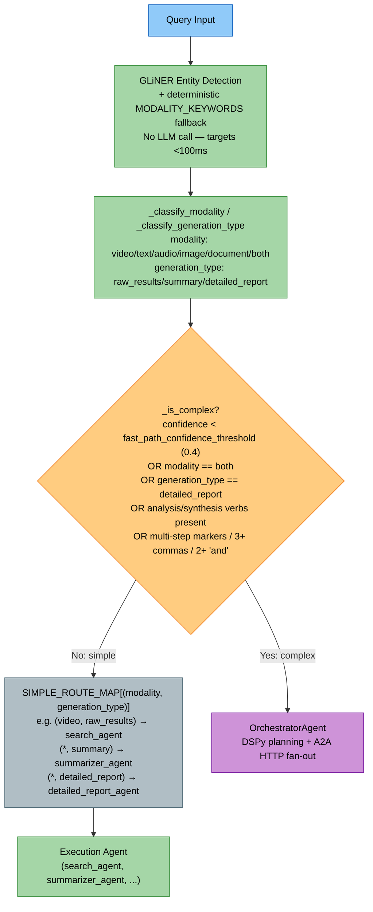
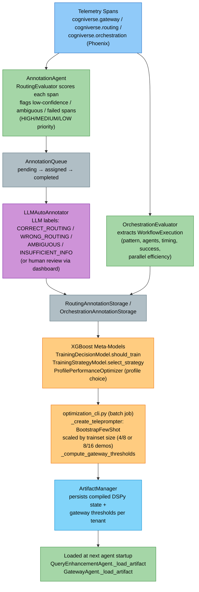
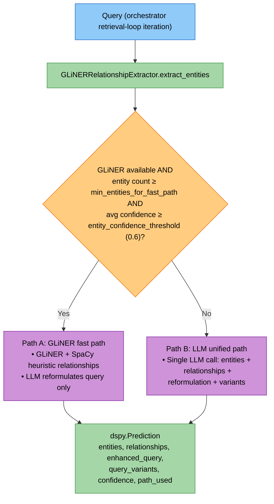
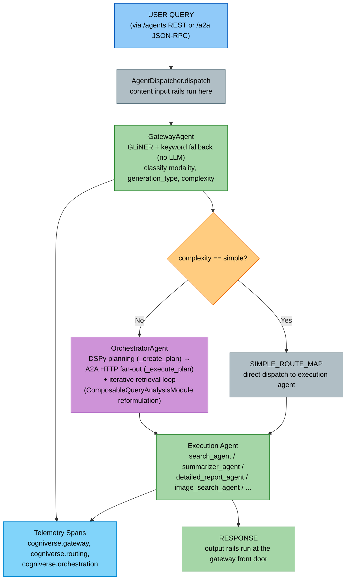

# Routing Module Study Guide

**Package:** `cogniverse_agents` (Implementation Layer)
**Location:** `libs/agents/cogniverse_agents/`

---

## Table of Contents
1. [Module Overview](#module-overview)
2. [Architecture](#architecture)
3. [Core Components](#core-components)
4. [Routing Strategies](#routing-strategies)
5. [Optimization Systems](#optimization-systems)
6. [Data Flow](#data-flow)
7. [Usage Examples](#usage-examples)
8. [Production Considerations](#production-considerations)
9. [Testing](#testing)

---

## Module Overview

### Purpose
The Routing Module provides intelligent query routing via A2A agents: `GatewayAgent` for fast rule-based/GLiNER classification, `OrchestratorAgent` for complex multi-agent coordination, `QueryEnhancementAgent` for query enrichment, `ProfileSelectionAgent` for backend-profile selection, and supporting infrastructure in `routing/` and `orchestrator/` for offline optimization, annotation, and relationship extraction.

### Key Features
- **Gateway Classification**: `GatewayAgent` uses GLiNER zero-shot NER (with a deterministic keyword fallback) to classify modality, generation type, and simple-vs-complex — **no LLM call**, targeting <100ms
- **Orchestrated Routing**: Complex queries hand off to `OrchestratorAgent` (DSPy planner + A2A HTTP fan-out)
- **Query Enhancement**: `QueryEnhancementAgent` enriches queries via a DSPy `ChainOfThought` module with a heuristic fallback
- **Composable Query Analysis**: `OrchestratorAgent`'s iterative retrieval loop uses `ComposableQueryAnalysisModule` (GLiNER fast path / LLM unified path) from `routing/dspy_relationship_router.py` for query reformulation
- **Profile Selection**: `ProfileSelectionAgent` uses DSPy reasoning (with a keyword fallback) to pick the best backend search profile; `ProfilePerformanceOptimizer` learns profile choice from Phoenix evaluation data via XGBoost
- **Offline Optimization**: An annotation-driven feedback loop (`AnnotationAgent`, `LLMAutoAnnotator`, `OrchestrationEvaluator`) plus XGBoost meta-models feed a batch optimization CLI that recompiles DSPy modules (`BootstrapFewShot`) and gateway thresholds as tenant artifacts

### Package Structure
```text
libs/agents/cogniverse_agents/
├── gateway_agent.py                       # GLiNER + keyword-fallback classification (<100ms, no LLM)
├── orchestrator_agent.py                  # A2A orchestrator (DSPy planner + HTTP dispatch, ~2800 LOC)
├── query_enhancement_agent.py             # Query enhancement A2A agent (DSPy ChainOfThought + fallback)
├── profile_selection_agent.py             # Per-query backend profile classifier (DSPy + heuristic fallback)
├── orchestrator/
│   ├── __init__.py
│   └── sufficient_context_signature.py    # SufficientContextSignature (DSPy gate for the iterative retrieval loop)
├── routing/
│   ├── __init__.py
│   ├── annotation_agent.py                # AnnotationAgent (identifies routing spans needing human review)
│   ├── annotation_queue.py                # AnnotationQueue (in-memory pending/assigned/completed queue)
│   ├── annotation_storage.py              # AnnotationStorage (persists per-agent-type annotations; RoutingAnnotationStorage alias)
│   ├── config.py                          # AutomationRulesConfig + annotation/optimization threshold schemas
│   ├── dspy_relationship_router.py        # ComposableQueryAnalysisModule, DSPyBasicRoutingModule, DSPyAdvancedRoutingModule
│   ├── dspy_routing_signatures.py         # DSPy signatures (BasicQueryAnalysis, QueryReformulation, AdvancedRouting, ...)
│   ├── llm_auto_annotator.py              # LLMAutoAnnotator (LLM-based auto-labeling of routing spans)
│   ├── orchestration_annotation_storage.py # OrchestrationAnnotationStorage (persists orchestration-workflow annotations)
│   ├── orchestration_evaluator.py         # OrchestrationEvaluator (extracts WorkflowExecution from telemetry spans)
│   ├── profile_performance_optimizer.py   # ProfilePerformanceOptimizer (XGBoost profile-choice learner)
│   ├── relationship_extraction_tools.py   # GLiNERRelationshipExtractor, SpaCyDependencyAnalyzer, RelationshipExtractorTool
│   └── xgboost_meta_models.py             # TrainingDecisionModel, TrainingStrategyModel, FusionBenefitModel
```

`RoutingConfigUnified` — the tenant routing config dataclass referenced throughout this guide — lives in
**`libs/foundation/cogniverse_foundation/config/unified_config.py`** (Foundation layer), not in `cogniverse_agents`.
`routing/config.py` in this package hosts a *different* schema: `AutomationRulesConfig` and its nested
annotation/optimization/feedback threshold models, consumed by `AnnotationAgent` and the optimization CLI.

---

## Architecture

### Gateway Decision Flow

`GatewayAgent` makes no LLM call. It runs GLiNER zero-shot NER (or a keyword fallback when GLiNER is
unavailable) to detect modality and generation type, then applies a pure rule-based complexity check.


```mermaid
flowchart TB
    QueryInput["<span style='color:#000'>Query Input</span>"] --> GLiNER["<span style='color:#000'>GLiNER Entity Detection<br/>+ deterministic MODALITY_KEYWORDS fallback<br/>No LLM call — targets &lt;100ms</span>"]

    GLiNER --> Classify["<span style='color:#000'>_classify_modality / _classify_generation_type<br/>modality: video/text/audio/image/document/both<br/>generation_type: raw_results/summary/detailed_report</span>"]

    Classify --> IsComplex{"<span style='color:#000'>_is_complex?<br/>confidence &lt; fast_path_confidence_threshold (0.4)<br/>OR modality == both<br/>OR generation_type == detailed_report<br/>OR analysis/synthesis verbs present<br/>OR multi-step markers / 3+ commas / 2+ 'and'</span>"}

    IsComplex -->|No: simple| RouteMap["<span style='color:#000'>SIMPLE_ROUTE_MAP[(modality, generation_type)]<br/>e.g. (video, raw_results) → search_agent<br/>(*, summary) → summarizer_agent<br/>(*, detailed_report) → detailed_report_agent</span>"]

    IsComplex -->|Yes: complex| Orchestrator["<span style='color:#000'>OrchestratorAgent<br/>DSPy planning + A2A HTTP fan-out</span>"]

    RouteMap --> ExecAgent["<span style='color:#000'>Execution Agent<br/>(search_agent, summarizer_agent, ...)</span>"]

    style QueryInput fill:#90caf9,stroke:#1565c0,color:#000
    style GLiNER fill:#a5d6a7,stroke:#388e3c,color:#000
    style Classify fill:#a5d6a7,stroke:#388e3c,color:#000
    style IsComplex fill:#ffcc80,stroke:#ef6c00,color:#000
    style RouteMap fill:#b0bec5,stroke:#546e7a,color:#000
    style Orchestrator fill:#ce93d8,stroke:#7b1fa2,color:#000
    style ExecAgent fill:#a5d6a7,stroke:#388e3c,color:#000
```

`fast_path_confidence_threshold` defaults to **0.4** on `GatewayDeps` (not the `RoutingConfigUnified.fast_path_confidence_threshold`
default of 0.7 — the two are separate config objects for separate components). A query with no modality signal at
all (confidence below the threshold) is always routed to the orchestrator, never guessed.

### Annotation-Driven Optimization Loop

There is no reinforcement-learning ("GRPO") loop in this codebase. Routing/orchestration quality improves
through an offline, telemetry-driven annotation pipeline that feeds DSPy recompilation and XGBoost meta-models.


```mermaid
flowchart TB
    Spans["<span style='color:#000'>Telemetry Spans<br/>cogniverse.gateway / cogniverse.routing /<br/>cogniverse.orchestration (Phoenix)</span>"]

    AnnotationAgent["<span style='color:#000'>AnnotationAgent<br/>RoutingEvaluator scores each span<br/>flags low-confidence / ambiguous / failed spans<br/>(HIGH/MEDIUM/LOW priority)</span>"]

    OrchEvaluator["<span style='color:#000'>OrchestrationEvaluator<br/>extracts WorkflowExecution<br/>(pattern, agents, timing, success,<br/>parallel efficiency)</span>"]

    Queue["<span style='color:#000'>AnnotationQueue<br/>pending → assigned → completed</span>"]

    AutoAnnotator["<span style='color:#000'>LLMAutoAnnotator<br/>LLM labels: CORRECT_ROUTING / WRONG_ROUTING /<br/>AMBIGUOUS / INSUFFICIENT_INFO<br/>(or human review via dashboard)</span>"]

    Storage["<span style='color:#000'>RoutingAnnotationStorage /<br/>OrchestrationAnnotationStorage</span>"]

    Meta["<span style='color:#000'>XGBoost Meta-Models<br/>TrainingDecisionModel.should_train<br/>TrainingStrategyModel.select_strategy<br/>ProfilePerformanceOptimizer (profile choice)</span>"]

    CLI["<span style='color:#000'>optimization_cli.py (batch job)<br/>_create_teleprompter: BootstrapFewShot<br/>scaled by trainset size (4/8 or 8/16 demos)<br/>_compute_gateway_thresholds</span>"]

    Artifact["<span style='color:#000'>ArtifactManager<br/>persists compiled DSPy state +<br/>gateway thresholds per tenant</span>"]

    Loaded["<span style='color:#000'>Loaded at next agent startup<br/>QueryEnhancementAgent._load_artifact<br/>GatewayAgent._load_artifact</span>"]

    Spans --> AnnotationAgent
    Spans --> OrchEvaluator
    AnnotationAgent --> Queue
    Queue --> AutoAnnotator
    AutoAnnotator --> Storage
    OrchEvaluator --> Storage
    Storage --> Meta
    Meta --> CLI
    CLI --> Artifact
    Artifact --> Loaded

    style Spans fill:#90caf9,stroke:#1565c0,color:#000
    style AnnotationAgent fill:#a5d6a7,stroke:#388e3c,color:#000
    style OrchEvaluator fill:#a5d6a7,stroke:#388e3c,color:#000
    style Queue fill:#b0bec5,stroke:#546e7a,color:#000
    style AutoAnnotator fill:#ce93d8,stroke:#7b1fa2,color:#000
    style Storage fill:#b0bec5,stroke:#546e7a,color:#000
    style Meta fill:#ffcc80,stroke:#ef6c00,color:#000
    style CLI fill:#ffcc80,stroke:#ef6c00,color:#000
    style Artifact fill:#81d4fa,stroke:#0288d1,color:#000
    style Loaded fill:#a5d6a7,stroke:#388e3c,color:#000
```

`FusionBenefitModel` (part of the XGBoost meta-models) is implemented and trainable but has **no caller** in the
current codebase outside its own tests — it is not wired into any live fusion decision. Document it as an
available, standalone model, not as an active pipeline stage.

### Composable Query Analysis (used by OrchestratorAgent)

`ComposableQueryAnalysisModule` (in `routing/dspy_relationship_router.py`) is lazily built and cached by
`OrchestratorAgent._get_query_analysis_module()` for reuse across iterations of the orchestrator's iterative
retrieval loop — it is **not** part of `QueryEnhancementAgent`, which uses a separate, simpler DSPy module
(see [QueryEnhancementAgent](#3-queryenhancementagent-query_enhancement_agentpy)).


```mermaid
flowchart TB
    Query["<span style='color:#000'>Query (orchestrator retrieval-loop iteration)</span>"] --> GlinerExtract["<span style='color:#000'>GLiNERRelationshipExtractor.extract_entities</span>"]

    GlinerExtract --> PathDecision{"<span style='color:#000'>GLiNER available AND<br/>entity count ≥ min_entities_for_fast_path AND<br/>avg confidence ≥ entity_confidence_threshold (0.6)?</span>"}

    PathDecision -->|Yes| PathA["<span style='color:#000'>Path A: GLiNER fast path<br/>• GLiNER + SpaCy heuristic relationships<br/>• LLM reformulates query only</span>"]
    PathDecision -->|No| PathB["<span style='color:#000'>Path B: LLM unified path<br/>• Single LLM call: entities +<br/>  relationships + reformulation + variants</span>"]

    PathA --> Prediction["<span style='color:#000'>dspy.Prediction<br/>entities, relationships, enhanced_query,<br/>query_variants, confidence, path_used</span>"]
    PathB --> Prediction

    style Query fill:#90caf9,stroke:#1565c0,color:#000
    style GlinerExtract fill:#a5d6a7,stroke:#388e3c,color:#000
    style PathDecision fill:#ffcc80,stroke:#ef6c00,color:#000
    style PathA fill:#ce93d8,stroke:#7b1fa2,color:#000
    style PathB fill:#ce93d8,stroke:#7b1fa2,color:#000
    style Prediction fill:#a5d6a7,stroke:#388e3c,color:#000
```

Both paths are individually optimizable via DSPy optimizers (SIMBA, MIPROv2, BootstrapFewShot, GEPA — per the
module's own docstring); the batch optimization CLI (`optimization_cli.py`) currently wires up `BootstrapFewShot`
only (see [Optimization Systems](#optimization-systems)).

---

## Core Components

### 1. RoutingConfigUnified (`libs/foundation/cogniverse_foundation/config/unified_config.py:403`)

**Purpose**: Tenant-scoped routing configuration schema. Lives in the Foundation layer, not `cogniverse_agents`.

**Key Attributes**:
```python
@dataclass
class RoutingConfigUnified:
    # tenant_id is REQUIRED — omitting it raises ValueError via __post_init__
    tenant_id: Optional[str] = None  # runtime-required

    # Routing mode. Only "tiered" is meaningful. enable_fast_path is seeded into
    # GatewayDeps by the dispatcher; when False the gateway routes every query
    # through orchestration (skips the fast path).
    routing_mode: str = "tiered"
    enable_fast_path: bool = True

    # fast_path_confidence_threshold IS seeded into GatewayDeps by the dispatcher
    # (default aligned to 0.4 so an untouched tenant is a no-op); the optimization
    # artifact still overrides it when present.
    fast_path_confidence_threshold: float = 0.4

    # GLiNER configuration. gliner_model, gliner_threshold, and gliner_device ARE
    # seeded into GatewayDeps by the dispatcher (_get_or_build_gateway_agent), so
    # the tenant's dashboard settings reach the live gateway; the optimization
    # artifact loaded afterward still overrides gliner_threshold. gliner_device
    # moves a locally-loaded GLiNER onto the given torch device (ignored for the
    # remote gliner sidecar).
    gliner_model: str = "urchade/gliner_large-v2.1"
    gliner_threshold: float = 0.3
    gliner_device: str = "cpu"

    # Optimization settings — consumed by scripts/auto_optimization_trigger.py
    enable_auto_optimization: bool = True
    optimization_interval_seconds: int = 3600
    min_samples_for_optimization: int = 100

    metadata: Dict[str, Any] = field(default_factory=dict)
```

**Key Methods**:
```python
@classmethod
def from_dict(cls, data: dict) -> "RoutingConfigUnified":
    """Create config from a dictionary. Raises if tenant_id is absent."""

def to_dict(self) -> dict:
    """Serialize config to dictionary"""
```

**Usage**:
```python
from cogniverse_foundation.config.unified_config import RoutingConfigUnified

# tenant_id is REQUIRED — a no-arg RoutingConfigUnified() raises ValueError
config = RoutingConfigUnified(tenant_id="acme:production")

# Or load from a dictionary (e.g., parsed from a JSON/YAML file)
import json
with open("configs/routing_config.json") as f:
    data = json.load(f)
config = RoutingConfigUnified.from_dict(data)  # data must include "tenant_id"

# Serialize back to a dictionary
config_dict = config.to_dict()
```

---

### 2. GatewayAgent (`gateway_agent.py`)

**Purpose**: Entry-point A2A agent that classifies queries as simple or complex — no LLM call, GLiNER-only
(with a deterministic keyword fallback).

**Key Features**:

- GLiNER zero-shot entity detection (`gliner_large-v2.1`, sidecar URL or in-process) plus `MODALITY_KEYWORDS`
  deterministic fallback when GLiNER misses or is unavailable
- Rule-based modality (`_classify_modality`) and generation-type (`_classify_generation_type`) classification
- `SIMPLE_ROUTE_MAP[(modality, generation_type)]` direct dispatch for simple queries
- Returns `GatewayOutput` with `complexity`, `modality`, `generation_type`, `routed_to`, `confidence`, `entity_extraction_failed` (True on a GLiNER outage)
- No circuit breaker in this class — GLiNER failures are handled by falling through to the keyword classifier,
  not by a circuit-breaker/retry wrapper

**Key Method**:
```python
async def _process_impl(self, input: GatewayInput) -> GatewayOutput:
    """
    Classify query complexity and target agent

    Process:
    1. Extract entities with GLiNER (or keyword fallback)
    2. Classify modality and generation_type from entity/keyword labels
    3. Determine complexity via _is_complex()
    4. Return routing decision with target agent name (SIMPLE_ROUTE_MAP or "orchestrator_agent")
    """
```

**Complexity Classification Logic** (`_is_complex`, actual code):
```python
# Query classified as complex when ANY holds:
# 1. Combined confidence < GatewayDeps.fast_path_confidence_threshold (default: 0.4)
#    — i.e. neither GLiNER nor the keyword fallback could classify the query
# 2. modality == "both" (entities/keywords span more than one modality)
# 3. generation_type == "detailed_report" (always needs search -> analysis -> report)
# 4. Query contains an analysis/synthesis verb (analyze, compare, summarize, evaluate, ...)
# 5. Query contains a multi-step marker (then, after that, first...next, ...)
# 6. Query has multiple clauses (3+ commas or 2+ "and")
```

**Performance**:

- No LLM call — GLiNER (or keyword fallback) only, targeting <100ms
- `fast_path_confidence_threshold`: 0.4 (on `GatewayDeps`, configurable)
- Simple queries route directly via `SIMPLE_ROUTE_MAP`; complex queries go to `OrchestratorAgent`

**SIMPLE_ROUTE_MAP** (`(modality, generation_type) -> agent name`):

| Modality | raw_results | summary | detailed_report |
|---|---|---|---|
| video | `search_agent` | `summarizer_agent` | `detailed_report_agent` |
| text | `search_agent` | `summarizer_agent` | `detailed_report_agent` |
| audio | `audio_analysis_agent` | `summarizer_agent` | `detailed_report_agent` |
| image | `image_search_agent` | `summarizer_agent` | `detailed_report_agent` |
| document | `document_agent` | `summarizer_agent` | `detailed_report_agent` |

---

### 3. QueryEnhancementAgent (`query_enhancement_agent.py`)

**Purpose**: A2A agent that expands and rewrites a query with synonyms, context, and RRF query variants using a
single DSPy `ChainOfThought` module, with a heuristic fallback. This is a separate, simpler component from the
`ComposableQueryAnalysisModule` used internally by `OrchestratorAgent` (see
[Composable Query Analysis](#composable-query-analysis-used-by-orchestratoragent)).

**Key Features**:

- `QueryEnhancementModule`: `dspy.ChainOfThought(QueryEnhancementSignature)` producing `enhanced_query`,
  `expansion_terms`, `synonyms`, `context`, `confidence`, `reasoning`
- Falls back to a heuristic expander when the LLM call raises, returns empty fields, or **echoes the input
  verbatim** (an echo would otherwise poison the SIMBA training set with identity pairs)
- Folds in upstream `EntityExtractionAgent` output (entities/relationships) as extra prompt context
- Applies per-tenant memory injection (`MemoryAwareMixin`) while preserving the caller's original query in the
  response
- Can load a previously-optimized DSPy module state from the `simba_query_enhancement` artifact blob at startup

**Key Method**:
```python
async def _process_impl(self, input: QueryEnhancementInput) -> QueryEnhancementOutput:
    """
    Enhance a query with synonyms, context, and RRF variants.

    Process:
    1. Build entity/relationship context string from input.entities/relationships
    2. Run the DSPy QueryEnhancementModule (fallback heuristic on failure)
    3. Parse comma-separated expansion_terms/synonyms/context into lists
    4. Generate RRF query_variants (List[str]) via _generate_variants
    """
```

`QueryEnhancementOutput` fields: `original_query`, `enhanced_query`, `expansion_terms: List[str]`,
`synonyms: List[str]`, `context_additions: List[str]`, `query_variants: List[str]`, `confidence: float`,
`reasoning: str`. The orchestrator's `_normalize_query_variants` later converts the raw string variants into
`{"name": ..., "query": ...}` dicts before handing them to `SearchInput.query_variants` for RRF multi-query
fusion (see [Ensemble Composition](../architecture/ensemble-composition.md#multi-query-fusion)).

---

### 4. ProfileSelectionAgent (`profile_selection_agent.py`)

**Purpose**: A2A agent that uses DSPy LLM reasoning to pick the optimal backend search profile for a query, with
a keyword/word-count heuristic fallback.

**Key Features**:

- `ProfileSelectionModule`: `dspy.ChainOfThought(ProfileSelectionSignature)` producing `selected_profile`,
  `confidence`, `reasoning`, `query_intent`, `modality`, `complexity`
- Default candidate profiles (`ProfileSelectionDeps.available_profiles`): `video_colpali_smol500_mv_frame`,
  `video_colqwen_omni_mv_chunk_30s`, `video_videoprism_base_mv_chunk_30s`, `video_videoprism_large_mv_chunk_30s`
- Overrides the LM's `modality` field with the modality encoded in the chosen profile name for consistency
- Generates up to 3 alternative `ProfileCandidate` entries (`profile_name`, `score`, `reasoning`)
- Applies per-tenant memory injection (`MemoryAwareMixin`) to the prompt while preserving the caller's original
  query in the response

**Key Method**:
```python
async def _process_impl(self, input: ProfileSelectionInput) -> ProfileSelectionOutput:
    """Select the best backend search profile for a query, with alternatives."""
```

---

### 5. ComposableQueryAnalysisModule and Routing DSPy Modules (`routing/dspy_relationship_router.py`)

See [Composable Query Analysis](#composable-query-analysis-used-by-orchestratoragent) for the diagram. This
module also defines:

- **`DSPyBasicRoutingModule`**: fast routing for simple queries via keyword + structure heuristics
  (`_analyze_query_characteristics`) — no LLM call
- **`DSPyAdvancedRoutingModule`**: LLM-based routing over `AdvancedRoutingSignature` for more nuanced decisions

`routing/dspy_routing_signatures.py` hosts the DSPy `Signature` classes these modules use, plus
`create_routing_signature(complexity_level)` and `validate_signature_output()` helpers.

---

### 6. XGBoost Meta-Models (`routing/xgboost_meta_models.py`)

**Purpose**: XGBoost-based meta-models for automatic training decisions without hardcoded thresholds

**Classes**:

**TrainingDecisionModel**: Predicts if training will be beneficial

```python
def should_train(self, context: ModelingContext) -> Tuple[bool, float]:
    """
    Predict if training will be beneficial

    Input Features (ModelingContext):
    - modality, real_sample_count, synthetic_sample_count
    - success_rate, avg_confidence
    - days_since_last_training
    - current_performance_score
    - data_quality_score, feature_diversity

    Returns:
        (should_train: bool, expected_improvement: float)
    """
```

**TrainingStrategyModel**: Selects optimal training strategy

```python
class TrainingStrategy(Enum):
    PURE_REAL = "pure_real"    # Train on real data only
    HYBRID = "hybrid"          # Mix real + synthetic
    SYNTHETIC = "synthetic"    # Synthetic only (cold start)
    SKIP = "skip"              # Skip training

def select_strategy(self, context: ModelingContext) -> TrainingStrategy:
    """Select optimal training strategy based on context"""
```

**FusionBenefitModel**: Predicts benefit of multi-modal fusion (implemented and trainable; **no current caller**
outside its own tests — not wired into a live fusion decision)

```python
def predict_benefit(self, fusion_context: Dict[str, float]) -> float:
    """
    Predict fusion benefit from context

    Features:
    - primary_modality_confidence
    - secondary_modality_confidence
    - modality_agreement
    - query_ambiguity_score
    - historical_fusion_success_rate

    Returns:
        Expected benefit (0-1)
    """
```

`quality_monitor.py` (`libs/evaluation/cogniverse_evaluation/`) is the actual runtime consumer of
`TrainingDecisionModel`.

---

### 7. AnnotationAgent (`routing/annotation_agent.py`)

**Purpose**: Identifies routing spans that need human (or LLM-auto) annotation, based on confidence and outcome.

**Key Method**:
```python
async def identify_spans_needing_annotation(
    self,
    lookback_hours: Optional[int] = None,
    agent_type: str = "routing",
) -> List[AnnotationRequest]:
    """
    Query cogniverse.routing spans from the telemetry provider, score each with
    RoutingEvaluator, and return AnnotationRequest objects sorted by priority
    (HIGH/MEDIUM/LOW), capped at max_annotations_per_run (default 50).
    """
```

Constructor: `AnnotationAgent(tenant_id, confidence_threshold=0.6, failure_lookback_hours=24,
max_annotations_per_run=50, automation_rules=None)` — an `AutomationRulesConfig` (from `routing/config.py`)
can override the individual threshold kwargs.

`routing/annotation_queue.py`'s `AnnotationQueue` tracks requests through `pending -> assigned -> completed`
states; `routing/annotation_storage.py`'s `AnnotationStorage` persists completed annotations under a
per-agent-type Phoenix annotation name (`{agent_type}_annotation`; routing keeps `routing_annotation`,
and `RoutingAnnotationStorage` remains as an alias);
`routing/orchestration_annotation_storage.py`'s `OrchestrationAnnotationStorage` does the same for
orchestration-workflow-level annotations.

---

### 8. OrchestrationEvaluator (`routing/orchestration_evaluator.py`)

**Purpose**: Extracts orchestration workflow execution data from `cogniverse.orchestration` telemetry spans and
feeds them to `WorkflowIntelligence` for template-matching and continuous learning.

```python
class OrchestrationEvaluator:
    """
    1. Queries cogniverse.orchestration spans from telemetry
    2. Extracts WorkflowExecution records (pattern, agents, timing, success)
    3. Computes quality metrics (parallel efficiency, agent performance)
    4. Feeds WorkflowExecution records to WorkflowIntelligence
    """

    def __init__(self, workflow_intelligence: WorkflowIntelligence, tenant_id: str): ...
```

Invoked from `libs/runtime/cogniverse_runtime/optimization_cli.py` as part of the batch optimization job.

---

### 9. LLMAutoAnnotator (`routing/llm_auto_annotator.py`)

**Purpose**: Uses an LLM to analyze routing spans and provide initial annotations for training data.

**Annotation Labels**:

| Label | Description |
|-------|-------------|
| CORRECT_ROUTING | Right agent chosen |
| WRONG_ROUTING | Wrong agent chosen |
| AMBIGUOUS | Multiple agents could work |
| INSUFFICIENT_INFO | Cannot determine |

**Key Methods**:

```python
def __init__(
    self,
    llm_config: LLMEndpointConfig,
    max_annotations_per_batch: Optional[int] = None,
):
    """model/api_base/api_key come from the passed-in LLMEndpointConfig —
    there are no ANNOTATION_MODEL/ANNOTATION_API_BASE env vars. The dashboard's
    routing_evaluation tab lets an operator override model/api_base/api_key via
    session state, falling back to the tenant's configured primary LLM.
    max_annotations_per_batch (from AnnotationThresholdsConfig, default 10) caps
    how many requests a single batch_annotate call sends to the LM; None
    processes every request. The dashboard tab passes
    automation_rules.annotation_thresholds.max_annotations_per_batch."""

def annotate(self, annotation_request: AnnotationRequest) -> AutoAnnotation:
    """
    Generate automatic annotation for a routing decision

    Analyzes:
    - Original query and context
    - Routing decision (chosen agent + confidence)
    - Downstream execution results
    - Error messages or failure indicators

    Returns:
        AutoAnnotation {
            span_id: str,
            label: AnnotationLabel,
            confidence: float,
            reasoning: str,
            suggested_correct_agent: Optional[str],
            requires_human_review: bool
        }
    """

def batch_annotate(self, requests: List[AnnotationRequest]) -> List[AutoAnnotation]:
    """
    Annotate a batch of requests via annotate(). If max_annotations_per_batch
    is set and requests exceeds it, the list is truncated to the cap before
    any LM call and the truncation is logged.

    The per-request annotate() calls run concurrently through a bounded thread
    pool; the returned list stays in request order. A transport/outage failure
    (LM endpoint down, timeout, auth) propagates — the batch raises rather than
    returning fabricated INSUFFICIENT_INFO verdicts the optimization loop would
    consume as real signal. Only a well-formed response that fails the JSON
    schema degrades to a per-span review-needed annotation.
    """
```

---

### 10. ProfilePerformanceOptimizer (`routing/profile_performance_optimizer.py`)

**Purpose**: Learns which backend profile works best for different query types using XGBoost

**Query Features** (`QueryFeatures`):

- query_length, word_count
- has_temporal_keywords (when, before, after, timeline, etc.)
- has_spatial_keywords (where, location, near, scene, etc.)
- has_object_keywords (object, person, what, who, etc.)
- avg_word_length

**Key Methods**:

```python
def predict_best_profile(self, query_text: str) -> Tuple[str, float]:
    """
    Predict best profile for query

    Uses Phoenix evaluation data to learn:
    (query_features, profile, ndcg) → best_profile

    Returns:
        (best_profile: str, confidence: float)
    """

async def extract_training_data_from_phoenix(
    self,
    tenant_id: str,
    project_name: str,
    start_time=None,
    end_time=None,
    min_samples: int = 10,
) -> Tuple[np.ndarray, np.ndarray, List[str]]:
    """
    Extract training data from telemetry provider evaluation spans

    Returns:
        Tuple of (features_array, labels_array, profile_names)
    """
```

Used by `libs/dashboard/cogniverse_dashboard/tabs/optimization.py`.

---

### 11. Relationship Extraction Tools (`routing/relationship_extraction_tools.py`)

**Purpose**: Non-LLM entity/relationship extraction used by the GLiNER fast path of
`ComposableQueryAnalysisModule` and by `entity_extraction_agent`'s fast path.

- **`GLiNERRelationshipExtractor`**: `extract_entities(query)` (GLiNER zero-shot NER),
  `infer_relationships_from_entities(query, entities)` (heuristic relation inference)
- **`SpaCyDependencyAnalyzer`**: `analyze_dependencies(text)`, `extract_semantic_relationships(text)`
  (dependency-parse-based relationship extraction, enriches the GLiNER fast path)
- **`RelationshipExtractorTool`**: combines both extractors, deduplicates relationships, and computes an
  overall confidence score

---

### 12. Sufficient Context Gate (`orchestrator/sufficient_context_signature.py`)

`orchestrator/sufficient_context_signature.py`'s `SufficientContextSignature` is the DSPy signature backing
`OrchestratorAgent._run_sufficiency_gate` — the check that decides whether the iterative retrieval loop has
gathered enough evidence to stop.

---

## Routing Strategies

There is no pluggable "strategy" class hierarchy (no `GLiNERStrategy`/`LLMStrategy`/`KeywordStrategy`/
`LangExtractStrategy`, no `ensemble_vote`) in this codebase. The two real routing decisions are:

| Decision | Component | Mechanism | LLM call? |
|---|---|---|---|
| Simple vs. complex query | `GatewayAgent._is_complex` | Rule-based (confidence threshold, modality, generation type, keyword/clause heuristics) | No |
| Simple-query target agent | `SIMPLE_ROUTE_MAP` | Static `(modality, generation_type) -> agent name` lookup | No |
| Backend search profile | `ProfileSelectionAgent` | DSPy `ChainOfThought` with a keyword/word-count heuristic fallback | Yes (fallback: no) |
| Backend search profile (learned) | `ProfilePerformanceOptimizer` | XGBoost model trained on Phoenix evaluation data (query features → best profile by NDCG) | No |
| Query analysis path (orchestrator loop) | `ComposableQueryAnalysisModule` | GLiNER-confidence-gated Path A (GLiNER + LLM reformulation) vs. Path B (single unified LLM call) | Yes (both paths) |

---

## Optimization Systems

### Annotation-Driven Optimization Lifecycle

The sequence behind the diagram above, spelled out step by step:

1. **Span collection** — telemetry spans `cogniverse.gateway`, `cogniverse.routing`, `cogniverse.orchestration`
   (attributes: `gateway.*`, `routing.*`, orchestration-specific).
2. **Span evaluation**
   - `AnnotationAgent.identify_spans_needing_annotation` (`RoutingEvaluator` scoring)
   - `OrchestrationEvaluator` (`WorkflowExecution` extraction + parallel-efficiency scoring)
3. **Annotation**
   - `AnnotationQueue`: pending → assigned → completed
   - `LLMAutoAnnotator.annotate` (LLM auto-label) or human review (dashboard)
   - `RoutingAnnotationStorage` / `OrchestrationAnnotationStorage` (persist)
4. **Meta-model decisions (XGBoost)**
   - `TrainingDecisionModel.should_train` — is training worth it?
   - `TrainingStrategyModel.select_strategy` — pure_real / hybrid / synthetic / skip
   - `ProfilePerformanceOptimizer` — learn profile choice from Phoenix NDCG data
5. **Batch recompilation** (`optimization_cli.py`)
   - `_create_teleprompter(trainset_size)`: `BootstrapFewShot`, scaled by training-set size
     (< 50 examples → 4 bootstrapped / 8 labeled demos, 1 round; ≥ 50 examples → 8 bootstrapped / 16 labeled
     demos, 2 rounds)
   - `_compute_gateway_thresholds(spans_df)` — recalibrates `GatewayAgent` thresholds
6. **Artifact persistence** — `ArtifactManager` stores the compiled DSPy module state (e.g.
   `"simba_query_enhancement"`) and gateway threshold blobs (`"gateway_thresholds"`)
7. **Artifact loading** (next agent startup, per tenant) — `QueryEnhancementAgent._load_artifact` loads compiled
   few-shot demos; `GatewayAgent._load_artifact` loads recalibrated thresholds

`ComposableQueryAnalysisModule`'s two paths are individually optimizable via DSPy optimizers named in its own
docstring (SIMBA, MIPROv2, BootstrapFewShot, GEPA); the batch CLI above currently wires up `BootstrapFewShot`
only, scaled by training-set size — there is no dataset-size-tiered auto-selection across all four optimizers.

### Query Enhancement Fallback

`QueryEnhancementModule.forward` (in `query_enhancement_agent.py`) treats three shapes as LLM failure and falls
through to a heuristic expander: the LLM call raising, output fields coming back empty, or the LLM echoing the
input query verbatim (which would otherwise poison the SIMBA training set with identity pairs — recorded as
`enhanced_query == query`).

---

## Data Flow

### Routing Flow (Gateway → Orchestrator → Execution)


```mermaid
flowchart TB
    UserQuery["<span style='color:#000'>USER QUERY<br/>(via /agents REST or /a2a JSON-RPC)</span>"]

    Dispatcher["<span style='color:#000'>AgentDispatcher.dispatch<br/>content input rails run here</span>"]

    Gateway["<span style='color:#000'>GatewayAgent<br/>GLiNER + keyword fallback (no LLM)<br/>classify modality, generation_type, complexity</span>"]

    Simple{"<span style='color:#000'>complexity == simple?</span>"}

    RouteMap["<span style='color:#000'>SIMPLE_ROUTE_MAP<br/>direct dispatch to execution agent</span>"]

    Orchestrator["<span style='color:#000'>OrchestratorAgent<br/>DSPy planning (_create_plan) →<br/>A2A HTTP fan-out (_execute_plan)<br/>+ iterative retrieval loop<br/>(ComposableQueryAnalysisModule reformulation)</span>"]

    ExecAgent["<span style='color:#000'>Execution Agent<br/>search_agent / summarizer_agent /<br/>detailed_report_agent / image_search_agent / ...</span>"]

    Spans["<span style='color:#000'>Telemetry Spans<br/>cogniverse.gateway, cogniverse.routing,<br/>cogniverse.orchestration</span>"]

    Response["<span style='color:#000'>RESPONSE<br/>output rails run at the gateway front door</span>"]

    UserQuery --> Dispatcher
    Dispatcher --> Gateway
    Gateway --> Simple
    Simple -->|Yes| RouteMap
    Simple -->|No| Orchestrator
    RouteMap --> ExecAgent
    Orchestrator --> ExecAgent
    ExecAgent --> Spans
    Gateway --> Spans
    ExecAgent --> Response

    style UserQuery fill:#90caf9,stroke:#1565c0,color:#000
    style Dispatcher fill:#b0bec5,stroke:#546e7a,color:#000
    style Gateway fill:#a5d6a7,stroke:#388e3c,color:#000
    style Simple fill:#ffcc80,stroke:#ef6c00,color:#000
    style RouteMap fill:#b0bec5,stroke:#546e7a,color:#000
    style Orchestrator fill:#ce93d8,stroke:#7b1fa2,color:#000
    style ExecAgent fill:#a5d6a7,stroke:#388e3c,color:#000
    style Spans fill:#81d4fa,stroke:#0288d1,color:#000
    style Response fill:#a5d6a7,stroke:#388e3c,color:#000
```

Offline, the spans emitted at the bottom of this diagram feed the
[Annotation-Driven Optimization Loop](#annotation-driven-optimization-loop) shown above, on its own schedule
(not per-request).

---

## Usage Examples

### Example 1: Gateway Classification

```python
from cogniverse_agents.gateway_agent import GatewayAgent, GatewayDeps, GatewayInput

deps = GatewayDeps()
gateway = GatewayAgent(deps=deps)

# Classify a query
query = "Show me videos of robots playing soccer"
input_data = GatewayInput(query=query, tenant_id="your_org:production")

result = await gateway._process_impl(input_data)
print(f"Complexity: {result.complexity}")        # "simple" or "complex"
print(f"Modality: {result.modality}")
print(f"Generation type: {result.generation_type}")
print(f"Routed to: {result.routed_to}")
print(f"Confidence: {result.confidence}")

# Simple query output (video, raw_results -> search_agent per SIMPLE_ROUTE_MAP):
# Complexity: simple
# Modality: video
# Generation type: raw_results
# Routed to: search_agent
# Confidence: 0.87
```

### Example 2: Query Enhancement

```python
from cogniverse_agents.query_enhancement_agent import (
    QueryEnhancementAgent,
    QueryEnhancementDeps,
    QueryEnhancementInput,
)

deps = QueryEnhancementDeps()
agent = QueryEnhancementAgent(deps=deps)

# Enhance query
query = "AI robot learning to play games"
input_data = QueryEnhancementInput(query=query, tenant_id="production")

result = await agent._process_impl(input_data)

print(f"Original: {result.original_query}")
print(f"Enhanced: {result.enhanced_query}")
print(f"Expansion: {result.expansion_terms}")
print(f"Variants: {result.query_variants}")
print(f"Confidence: {result.confidence}")

# Output:
# Original: AI robot learning to play games
# Enhanced: AI robot learning to play games (machine learning OR reinforcement learning OR game AI)
# Expansion: ["reinforcement learning", "game AI", "autonomous agent"]
# Variants: ["AI robot learning to play games (machine learning OR reinforcement learning OR game AI)", "AI robot learning to play games reinforcement learning game AI autonomous agent"]
# Confidence: 0.82
```

### Example 3: Profile Selection

```python
from cogniverse_agents.profile_selection_agent import (
    ProfileSelectionAgent,
    ProfileSelectionDeps,
    ProfileSelectionInput,
)

deps = ProfileSelectionDeps()
agent = ProfileSelectionAgent(deps=deps)

input_data = ProfileSelectionInput(
    query="Find scenes with fast camera motion and text overlays",
    tenant_id="production",
)

result = await agent._process_impl(input_data)

print(f"Selected profile: {result.selected_profile}")
print(f"Confidence: {result.confidence}")
print(f"Alternatives: {[c.profile_name for c in result.alternatives]}")

# Output:
# Selected profile: video_colpali_smol500_mv_frame
# Confidence: 0.79
# Alternatives: ['video_colqwen_omni_mv_chunk_30s', 'video_videoprism_base_mv_chunk_30s']
```

---

## Production Considerations

### Configuration Knobs

```python
from cogniverse_foundation.config.unified_config import RoutingConfigUnified

config = RoutingConfigUnified(tenant_id="acme:production")

# fast_path threshold — seeded into GatewayDeps by the dispatcher; the
# optimization artifact overrides it when present.
config.fast_path_confidence_threshold = 0.75

# Auto-optimization trigger (consumed by scripts/auto_optimization_trigger.py)
config.enable_auto_optimization = True
config.optimization_interval_seconds = 3600
config.min_samples_for_optimization = 100

# GLiNER device — seeded into GatewayDeps and applied to a locally-loaded model.
config.gliner_device = "cuda"
```

`enable_fast_path` is editable via the dashboard's config-management tab, round-tripped by
`to_dict`/`from_dict`, and seeded into `GatewayDeps` by the dispatcher: when `False`, `GatewayAgent._is_complex`
returns `True` for every query, so the fast path is skipped and everything is orchestrated.

### Error Handling

**Gateway path has no automatic fallback to the orchestrator on exception.** `AgentDispatcher._execute_gateway_task`
calls `GatewayAgent._process_impl` directly, with no surrounding `try/except` that reroutes to
`OrchestratorAgent` on failure — a `GatewayAgent` exception propagates to the dispatcher's own error handling.
`GatewayAgent` itself has no circuit breaker; a GLiNER failure at the model layer is expected to fall through to
the deterministic keyword classifier inside `_classify_modality`/`_classify_generation_type`, not to trigger a
breaker-open state.

**Graceful degradation that does exist**:
```python
# GatewayAgent classification:
# - No modality signal at all (confidence < fast_path_confidence_threshold) -> complexity=="complex"
# - "both" modality, detailed_report generation_type, or analysis/multi-step language -> complexity=="complex"
# A "complex" classification routes to OrchestratorAgent rather than guessing a target agent.
```

### Monitoring

**Real telemetry span attributes** (emitted by `GatewayAgent._emit_gateway_span` / `_emit_routing_span`):

```python
import time

from cogniverse_foundation.telemetry.config import TelemetryConfig
from cogniverse_foundation.telemetry.manager import TelemetryManager

telemetry_config = TelemetryConfig()
telemetry = TelemetryManager(config=telemetry_config)

start_time = time.time()
result = await gateway._process_impl(input_data)
latency_ms = (time.time() - start_time) * 1000

with telemetry.span(
    "cogniverse.routing",
    tenant_id="prod",
) as span:
    record_span_io(
        span,
        input_value=input_data.query,
        output={
            "chosen_agent": result.routed_to,
            "recommended_agent": result.routed_to,
            "confidence": result.confidence,
            "reasoning": result.reasoning,
            "complexity": result.complexity,
            "modality": result.modality,
            "generation_type": result.generation_type,
        },
        operation="routing",
        modality=result.modality,
    )
    # span auto-closes; GatewayAgent emits this span itself
```

`RoutingEvaluator` and `AnnotationAgent` filter on the `cogniverse.routing` span name and read the
decision from `read_span_io(row)["output"]` (a dict) downstream (see
[Annotation-Driven Optimization Loop](#annotation-driven-optimization-loop)).

### Multi-tenant Configuration

```python
# Separate RoutingConfigUnified per tenant — tenant_id is required for each
tenant_configs = {
    "acme": RoutingConfigUnified(
        tenant_id="acme",
        routing_mode="tiered",
        gliner_threshold=0.4,
        gliner_device="cuda",
    ),
    "startup": RoutingConfigUnified(
        tenant_id="startup",
        routing_mode="tiered",
        gliner_threshold=0.3,
    ),
}

config = tenant_configs[tenant_id]
```

---

## Testing

### Unit Tests
Located in: `tests/routing/unit/`

- `test_annotation_queue.py` - `AnnotationQueue` state-transition tests
- `test_learned_reranker.py` / `test_learned_reranker_integration.py` - learned reranker tests
- `test_multi_modal_reranker.py` - multi-modal reranker tests
- `test_relationship_router_confidence.py` - `ComposableQueryAnalysisModule` path-selection confidence tests
- `test_routing_signatures_shape.py` - DSPy routing signature shape tests
- `test_xgboost_meta_models.py` - XGBoost meta-model tests

### Integration Tests
Located in: `tests/routing/integration/`

- `test_deep_research_integration.py` - deep research flow integration
- `test_feature_integration.py` - feature-level routing integration
- `test_trace_connectivity.py` - A2A trace propagation

---

## Next Steps

For detailed information on related modules:

- **Agents Module** (`agents.md`) - Multi-agent orchestration and the full 23-agent roster (libs/agents/cogniverse_agents/)

- **Common Module** (`common.md`) - Shared configuration and utilities (libs/core/cogniverse_core/common/)

- **Telemetry Module** (`telemetry.md`) - Multi-tenant observability (libs/foundation/cogniverse_foundation/telemetry/)

- **Evaluation Module** (`evaluation.md`) - Experiment tracking and metrics (libs/core/cogniverse_core/evaluation/)

---

**Study Tips**:
1. Start with the Gateway Decision Flow before the optimization loop
2. `GatewayAgent` and `ComposableQueryAnalysisModule` are LLM-free-capable / LLM-optional respectively — trace
   through both branches to see where an LLM call is and isn't made
3. Review the annotation pipeline (`AnnotationAgent` → `LLMAutoAnnotator` → `optimization_cli.py`) to understand
   how routing quality actually improves over time
4. Test query enhancement with real queries to see the DSPy-vs-fallback behavior
5. Use integration tests to understand end-to-end routing flow

**Key Takeaways**:

- `GatewayAgent` never calls an LLM; complexity is decided by rule-based thresholds and keyword heuristics
- `OrchestratorAgent`'s iterative retrieval loop — not `QueryEnhancementAgent` — owns `ComposableQueryAnalysisModule`
- There is no in-process per-modality cache, GRPO loop, or confidence calibrator in this module today
- Routing/orchestration quality improves via an offline annotation + XGBoost + DSPy-recompilation pipeline, not
  online reinforcement learning
- `FusionBenefitModel` exists in the schema but has no live consumer — verify before relying on it
