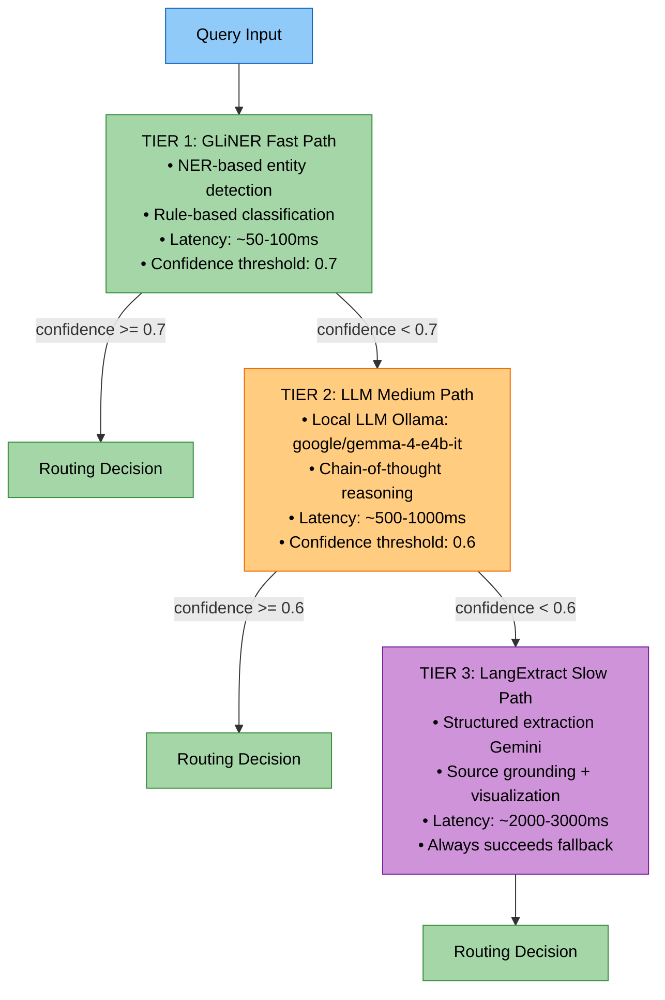
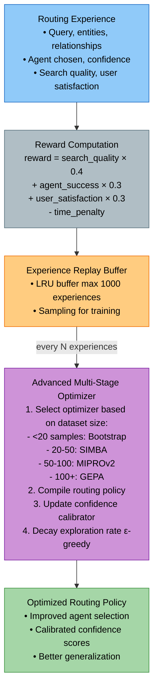
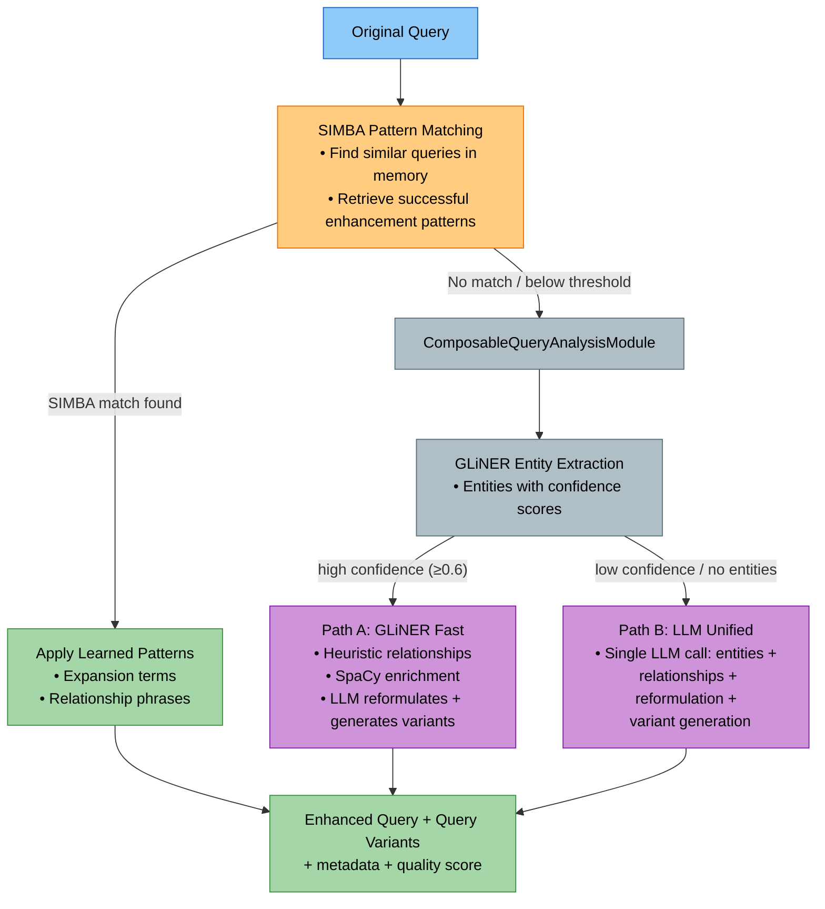

# Routing Module Study Guide

**Package:** `cogniverse_agents` (Implementation Layer)
**Location:** `libs/agents/cogniverse_agents/`

---

## Table of Contents
1. [Module Overview](#module-overview)
2. [Architecture](#architecture)
3. [Core Components](#core-components)
4. [Routing Strategies](#routing-strategies)
5. [Optimization Systems](#optimization-systems)
6. [Data Flow](#data-flow)
7. [Usage Examples](#usage-examples)
8. [Production Considerations](#production-considerations)
9. [Testing](#testing)

---

## Module Overview

### Purpose
The Routing Module provides intelligent query routing via A2A agents: `GatewayAgent` for fast GLiNER classification, `OrchestratorAgent` for complex multi-agent coordination, `QueryEnhancementAgent` for query enrichment, and supporting infrastructure in `routing/` for optimization, caching, and cross-modal fusion.

### Key Features
- **Gateway Classification**: `GatewayAgent` uses GLiNER (<100ms) to classify simple vs complex queries
- **Orchestrated Routing**: Complex queries handed to `OrchestratorAgent` (DSPy planner + A2A HTTP)
- **Query Enhancement**: `QueryEnhancementAgent` enriches queries via `ComposableQueryAnalysisModule`
- **Advanced Optimization**: GRPO (DSPy 3.0) with GEPA, MIPROv2, SIMBA optimizers (batch jobs)
- **Cross-Modal Optimization**: Multi-modal fusion benefit prediction
- **Production Features**: Per-modality caching (LRU), parallel execution, metrics

### Package Structure
```text
libs/agents/cogniverse_agents/
├── gateway_agent.py                    # GLiNER-based query classification (<100ms)
├── orchestrator_agent.py               # A2A orchestrator (DSPy planner + HTTP dispatch)
├── query_enhancement_agent.py          # Query enhancement A2A agent
├── profile_selection_agent.py          # Per-query backend profile classifier
├── routing/
│   ├── dspy_routing_signatures.py      # DSPy routing signatures
│   ├── config.py                       # Configuration system
│   ├── xgboost_meta_models.py          # XGBoost meta-learning
│   └── ... (additional DSPy and utility files)
```

---

## Architecture

### Tiered Routing Decision Tree


```mermaid
flowchart TB
    QueryInput["<span style='color:#000'>Query Input</span>"] --> Tier1["<span style='color:#000'>TIER 1: GLiNER Fast Path<br/>• NER-based entity detection<br/>• Rule-based classification<br/>• Latency: ~50-100ms<br/>• Confidence threshold: 0.7</span>"]

    Tier1 -->|confidence >= 0.7| Decision1["<span style='color:#000'>Routing Decision</span>"]
    Tier1 -->|confidence < 0.7| Tier2["<span style='color:#000'>TIER 2: LLM Medium Path<br/>• Local LLM Ollama: google/gemma-4-e4b-it<br/>• Chain-of-thought reasoning<br/>• Latency: ~500-1000ms<br/>• Confidence threshold: 0.6</span>"]

    Tier2 -->|confidence >= 0.6| Decision2["<span style='color:#000'>Routing Decision</span>"]
    Tier2 -->|confidence < 0.6| Tier3["<span style='color:#000'>TIER 3: LangExtract Slow Path<br/>• Structured extraction Gemini<br/>• Source grounding + visualization<br/>• Latency: ~2000-3000ms<br/>• Always succeeds fallback</span>"]

    Tier3 --> Decision3["<span style='color:#000'>Routing Decision</span>"]

    style QueryInput fill:#90caf9,stroke:#1565c0,color:#000
    style Tier1 fill:#a5d6a7,stroke:#388e3c,color:#000
    style Tier2 fill:#ffcc80,stroke:#ef6c00,color:#000
    style Tier3 fill:#ce93d8,stroke:#7b1fa2,color:#000
    style Decision1 fill:#a5d6a7,stroke:#388e3c,color:#000
    style Decision2 fill:#a5d6a7,stroke:#388e3c,color:#000
    style Decision3 fill:#a5d6a7,stroke:#388e3c,color:#000
```

### GRPO Optimization Loop


```mermaid
flowchart TB
    Experience["<span style='color:#000'>Routing Experience<br/>• Query, entities, relationships<br/>• Agent chosen, confidence<br/>• Search quality, user satisfaction</span>"]

    Experience --> Reward["<span style='color:#000'>Reward Computation<br/>reward = search_quality × 0.4<br/>+ agent_success × 0.3<br/>+ user_satisfaction × 0.3<br/>- time_penalty</span>"]

    Reward --> Buffer["<span style='color:#000'>Experience Replay Buffer<br/>• LRU buffer max 1000 experiences<br/>• Sampling for training</span>"]

    Buffer -->|every N experiences| Optimizer["<span style='color:#000'>Advanced Multi-Stage Optimizer<br/>1. Select optimizer based on dataset size:<br/>- <20 samples: Bootstrap<br/>- 20-50: SIMBA<br/>- 50-100: MIPROv2<br/>- 100+: GEPA<br/>2. Compile routing policy<br/>3. Update confidence calibrator<br/>4. Decay exploration rate ε-greedy</span>"]

    Optimizer --> Policy["<span style='color:#000'>Optimized Routing Policy<br/>• Improved agent selection<br/>• Calibrated confidence scores<br/>• Better generalization</span>"]

    style Experience fill:#90caf9,stroke:#1565c0,color:#000
    style Reward fill:#b0bec5,stroke:#546e7a,color:#000
    style Buffer fill:#ffcc80,stroke:#ef6c00,color:#000
    style Optimizer fill:#ce93d8,stroke:#7b1fa2,color:#000
    style Policy fill:#a5d6a7,stroke:#388e3c,color:#000
```

### Query Enhancement Pipeline


```mermaid
flowchart TB
    OriginalQuery["<span style='color:#000'>Original Query</span>"] --> SimbaCheck["<span style='color:#000'>SIMBA Pattern Matching<br/>• Find similar queries in memory<br/>• Retrieve successful enhancement patterns</span>"]

    SimbaCheck -->|SIMBA match found| SimbaEnhance["<span style='color:#000'>Apply Learned Patterns<br/>• Expansion terms<br/>• Relationship phrases</span>"]
    SimbaCheck -->|No match / below threshold| Composable["<span style='color:#000'>ComposableQueryAnalysisModule</span>"]

    Composable --> GLiNER["<span style='color:#000'>GLiNER Entity Extraction<br/>• Entities with confidence scores</span>"]

    GLiNER -->|"high confidence (≥0.6)"| PathA["<span style='color:#000'>Path A: GLiNER Fast<br/>• Heuristic relationships<br/>• SpaCy enrichment<br/>• LLM reformulates + generates variants</span>"]
    GLiNER -->|"low confidence / no entities"| PathB["<span style='color:#000'>Path B: LLM Unified<br/>• Single LLM call: entities +<br/>  relationships + reformulation +<br/>  variant generation</span>"]

    SimbaEnhance --> Enhanced["<span style='color:#000'>Enhanced Query + Query Variants<br/>+ metadata + quality score</span>"]
    PathA --> Enhanced
    PathB --> Enhanced

    style OriginalQuery fill:#90caf9,stroke:#1565c0,color:#000
    style SimbaCheck fill:#ffcc80,stroke:#ef6c00,color:#000
    style SimbaEnhance fill:#a5d6a7,stroke:#388e3c,color:#000
    style Composable fill:#b0bec5,stroke:#546e7a,color:#000
    style GLiNER fill:#b0bec5,stroke:#546e7a,color:#000
    style PathA fill:#ce93d8,stroke:#7b1fa2,color:#000
    style PathB fill:#ce93d8,stroke:#7b1fa2,color:#000
    style Enhanced fill:#a5d6a7,stroke:#388e3c,color:#000
```

---

## Core Components

### 1. RoutingConfig (config.py:20-390)

**Purpose**: Complete configuration system for routing with environment variable overrides

**Key Attributes**:
```python
@dataclass
class RoutingConfig:
    # Routing mode
    routing_mode: str = "tiered"  # "tiered", "ensemble", "hybrid", "single"

    # Tier configuration
    tier_config: dict = {
        "enable_fast_path": True,
        "fast_path_confidence_threshold": 0.7,
        "slow_path_confidence_threshold": 0.6,
        "max_routing_time_ms": 1000,
    }

    # GLiNER configuration (Tier 1)
    gliner_config: dict = {
        "model": "urchade/gliner_large-v2.1",
        "threshold": 0.3,
        "labels": [...],  # 16 entity types
        "device": "cpu",
    }

    # LLM configuration (Tier 2)
    llm_config: dict = {
        "provider": "local",
        "model": "google/gemma-4-e4b-it",
        "endpoint": "http://localhost:11434",
        "use_chain_of_thought": True,
        "use_think_mode": True,
    }

    # Optimization config
    optimization_config: dict = {
        "enable_auto_optimization": True,
        "optimization_interval_seconds": 3600,
        "dspy_enabled": True,
        "dspy_max_bootstrapped_demos": 10,
    }

    # Performance monitoring
    monitoring_config: dict = {
        "enable_metrics": True,
        "metrics_batch_size": 100,
        "enable_tracing": True,
    }

    # Caching
    cache_config: dict = {
        "enable_caching": True,
        "cache_ttl_seconds": 300,
        "max_cache_size": 1000,
    }

    # Query fusion (ComposableQueryAnalysisModule always generates variants)
    query_fusion_config: dict = {
        "include_original": True,  # Include unmodified query as a variant
        "rrf_k": 60,             # RRF constant for fusing variant results
    }

    # Composable module path selection thresholds
    entity_confidence_threshold: float = 0.6  # GLiNER confidence for Path A vs Path B
    min_entities_for_fast_path: int = 1       # Minimum entities required for Path A
```

**Key Methods**:
```python
@classmethod
def from_file(cls, filepath: Path) -> "RoutingConfig":
    """Load configuration from JSON/YAML file"""

@classmethod
def from_dict(cls, data: dict) -> "RoutingConfig":
    """Create config from a dictionary"""

def to_dict(self) -> dict:
    """Serialize config to dictionary"""

def save(self, filepath: Path):
    """Save configuration to file"""
```

**Usage**:
```python
# Load from file
config = RoutingConfig.from_file("configs/routing_config.yaml")

# Or use defaults
config = RoutingConfig()

# Save example config
config.save("configs/my_routing.json")
```

---

### 2. GatewayAgent (gateway_agent.py)

**Purpose**: Entry-point A2A agent that classifies queries as simple or complex using GLiNER (<100ms)

**Key Features**:

- GLiNER entity detection with configurable label types
- Rule-based modality and complexity classification
- Circuit breaker for fault tolerance
- Returns `GatewayOutput` with `complexity`, `modality`, `routed_to`, `confidence`

**Key Method**:
```python
async def _process_impl(
    self,
    input_data: GatewayInput,
) -> GatewayOutput:
    """
    Classify query complexity and target agent

    Process:
    1. Extract entities with GLiNER
    2. Classify modality from entity labels
    3. Determine complexity (simple vs complex)
    4. Return routing decision with target agent name
    """
```

**Complexity Classification Logic**:
```python
# Query classified as complex when any holds:
# 1. No entities detected by GLiNER
# 2. Classification confidence below fast_path_confidence_threshold (default: 0.7)
# 3. Entities span more than one modality (e.g., video + audio)
```

**Performance**:

- Latency: <100ms (GLiNER, no LLM call)
- Confidence threshold: 0.7 (configurable)
- Simple queries route directly; complex queries go to OrchestratorAgent

---

### 3. QueryEnhancementAgent (query_enhancement_agent.py)

**Purpose**: A2A agent that enriches queries via `ComposableQueryAnalysisModule` — part of the orchestration pipeline for complex queries

**Key Features**:

- ComposableQueryAnalysisModule integration (Path A: GLiNER fast, Path B: LLM unified)
- LLM-generated query variant generation for multi-query fusion
- Invoked by `OrchestratorAgent` during complex query workflows
- SIMBA optimization runs as Argo batch job (not inline)

**Key Method**:

```python
async def _process_impl(
    self,
    input_data: QueryEnhancementInput,
) -> QueryEnhancementOutput:
    """
    Complete end-to-end query enhancement

    Process:
    1. Run ComposableQueryAnalysisModule (Path A or Path B)
    2. Apply include_original flag and build result metadata

    Returns QueryEnhancementOutput with:
        {
            "original_query": str,
            "extracted_entities": List[Dict],
            "extracted_relationships": List[Dict],
            "enhanced_query": str,
            "enhancement_strategy": str,  # "composable_A" or "composable_B"
            "quality_score": float,
            "query_variants": List[Dict[str, str]],  # [{"name": str, "query": str}]
            "processing_metadata": {"enhancement_method": str, "analysis_path": str, ...},
            ...
        }
    """

```

**Composable Query Analysis** (`ComposableQueryAnalysisModule`):

The composable module replaces the former rule-based `QueryRewriter` with a two-path DSPy module
that generates query variants via LLM:

- **Path A (GLiNER fast path):** GLiNER extracts high-confidence entities → heuristic relationship
  inference → LLM reformulates query and generates variants
- **Path B (LLM unified path):** Single LLM call does entity extraction, relationship extraction,
  query reformulation, and variant generation together

Path selection is automatic based on GLiNER entity confidence (threshold: `entity_confidence_threshold`,
default 0.6). Both paths produce identical output: `entities`, `relationships`, `enhanced_query`,
`query_variants`, `confidence`, and `path_used`.

**Multi-Query Variant Generation:**

The composable module always generates query variants. Each variant is searched in parallel and
results are fused with RRF (see [Ensemble Composition](../architecture/ensemble-composition.md#multi-query-fusion)).

```python
# ComposableQueryAnalysisModule.forward() returns:
# prediction.query_variants = [
#   {"name": "entity_focused", "query": "humanoid robots autonomous soccer match"},
#   {"name": "relationship_expanded", "query": "robots playing competitive soccer game"},
#   {"name": "semantic_broadened", "query": "robotic athletes in football competition"},
# ]
```

The `include_original` flag in `query_fusion_config` controls whether the original query is
prepended as a variant. `rrf_k` is passed through to the fusion algorithm.

---

### 6. XGBoost Meta-Models (xgboost_meta_models.py)

**Purpose**: XGBoost-based meta-models for automatic training decisions without hardcoded thresholds

**Classes**:

**TrainingDecisionModel**: Predicts if training will be beneficial

```python
def should_train(self, context: ModelingContext) -> Tuple[bool, float]:
    """
    Predict if training will be beneficial

    Input Features:
    - real_sample_count
    - synthetic_sample_count
    - success_rate, avg_confidence
    - days_since_last_training
    - current_performance_score
    - data_quality_score, feature_diversity

    Returns:
        (should_train: bool, expected_improvement: float)
    """
```

**TrainingStrategyModel**: Selects optimal training strategy

```python
class TrainingStrategy(Enum):
    PURE_REAL = "pure_real"    # Train on real data only
    HYBRID = "hybrid"          # Mix real + synthetic
    SYNTHETIC = "synthetic"    # Synthetic only (cold start)
    SKIP = "skip"              # Skip training

def select_strategy(self, context: ModelingContext) -> TrainingStrategy:
    """Select optimal training strategy based on context"""
```

**FusionBenefitModel**: Predicts benefit of multi-modal fusion

```python
def predict_benefit(self, fusion_context: Dict[str, float]) -> float:
    """
    Predict fusion benefit from context

    Features:
    - primary_modality_confidence
    - secondary_modality_confidence
    - modality_agreement
    - query_ambiguity_score
    - historical_fusion_success_rate

    Returns:
        Expected benefit (0-1)
    """
```

---


**Purpose**: Maintains cross-modal context across queries to improve routing and search quality

**Key Features**:

- Conversation history tracking
- Modality preference learning
- Topic evolution tracking
- Temporal pattern recognition
- Context-aware routing hints

**Key Methods**:

```python
def update_context(
    self,
    query: str,
    detected_modalities: List[str],
    result: Optional[Any] = None,
    result_count: int = 0,
):
    """
    Track user query and update context

    Updates:
    - Conversation history (deque with max size)
    - Modality preferences (count per modality)
    - Topic tracking (keyword extraction)
    - Temporal patterns (hourly distribution)
    """

def get_contextual_hints(self, current_query: str) -> Dict[str, Any]:
    """
    Get context-aware routing hints

    Returns:
        {
            "preferred_modality": str,
            "recent_topics": List[str],
            "session_stats": {...},
            "temporal_context": {...}
        }
    """
```

---

### 13. LLMAutoAnnotator (llm_auto_annotator.py:46-294)

**Purpose**: Uses LLM to analyze routing spans and provide initial annotations for training data

**Annotation Labels**:

| Label | Description |
|-------|-------------|
| CORRECT_ROUTING | Right agent chosen |
| WRONG_ROUTING | Wrong agent chosen |
| AMBIGUOUS | Multiple agents could work |
| INSUFFICIENT_INFO | Cannot determine |

**Key Methods**:

```python
def annotate(self, annotation_request: AnnotationRequest) -> AutoAnnotation:
    """
    Generate automatic annotation for a routing decision

    Analyzes:
    - Original query and context
    - Routing decision (chosen agent + confidence)
    - Downstream execution results
    - Error messages or failure indicators

    Returns:
        AutoAnnotation {
            span_id: str,
            label: AnnotationLabel,
            confidence: float,
            reasoning: str,
            suggested_correct_agent: Optional[str],
            requires_human_review: bool
        }
    """
```

**Model Configuration**:

```python
# Default model: claude-3-5-sonnet-20241022
# Override via environment:
#   ANNOTATION_MODEL=gemini-pro
#   ANNOTATION_API_BASE=http://localhost:11434
```

---

### 14. ProfilePerformanceOptimizer (profile_performance_optimizer.py:51-390)

**Purpose**: Learns which backend profile works best for different query types using XGBoost

**Query Features**:

- query_length, word_count
- has_temporal_keywords (when, before, after, timeline, etc.)
- has_spatial_keywords (where, location, near, scene, etc.)
- has_object_keywords (object, person, what, who, etc.)
- avg_word_length

**Key Methods**:

```python
def predict_best_profile(
    self,
    query_text: str,
) -> Tuple[str, float]:
    """
    Predict best profile for query

    Uses Phoenix evaluation data to learn:
    (query_features, profile, ndcg) → best_profile

    Returns:
        (best_profile: str, confidence: float)
    """

async def extract_training_data_from_phoenix(
    self,
    tenant_id: str,
    project_name: str,
    start_time=None,
    end_time=None,
    min_samples: int = 10,
) -> Tuple[np.ndarray, np.ndarray, List[str]]:
    """
    Extract training data from telemetry provider evaluation spans

    Args:
        tenant_id: Tenant identifier
        project_name: Project name for span query
        start_time: Start time for span query
        end_time: End time for span query
        min_samples: Minimum samples required

    Returns:
        Tuple of (features_array, labels_array, profile_names)
    """
```

---

## Routing Strategies

### Strategy Comparison

| Strategy | Tier | Latency | Accuracy | Use Case |
|----------|------|---------|----------|----------|
| **GLiNER** | 1 | 50-100ms | ~85% | Clear queries with obvious entities |
| **LLM** | 2 | 500-1000ms | ~92% | Medium complexity, ambiguous queries |
| **Keyword** | 3 | <10ms | ~70% | Simple pattern matching |
| **LangExtract** | 3 | 2-3s | ~95% | Complex queries, structured extraction |
| **Hybrid** | - | Varies | ~88% | Combine multiple strategies |
| **Ensemble** | - | Parallel | ~90% | Voting across strategies |

### Strategy Selection Logic

```python
# Tiered mode (default)
if routing_mode == "tiered":
    # Try Tier 1 (GLiNER)
    result = await gliner_strategy.route(query)
    if result.confidence_score >= 0.7:
        return result

    # Fallback to Tier 2 (LLM)
    result = await llm_strategy.route(query)
    if result.confidence_score >= 0.6:
        return result

    # Fallback to Tier 3 (LangExtract)
    result = await langextract_strategy.route(query)
    return result  # Always succeeds

# Ensemble mode
elif routing_mode == "ensemble":
    # Run multiple strategies in parallel
    results = await asyncio.gather(
        gliner_strategy.route(query),
        llm_strategy.route(query),
        keyword_strategy.route(query)
    )

    # Weighted voting
    final_decision = ensemble_vote(results, weights={
        "gliner": 1.5,
        "llm": 2.0,
        "keyword": 0.5
    })

    return final_decision
```

---

## Optimization Systems

### GRPO Optimization Lifecycle

```text
1. EXPERIENCE COLLECTION
   ├─ Query + entities + relationships
   ├─ Agent selection + confidence
   ├─ Search quality + processing time
   └─ User satisfaction (optional)

2. REWARD COMPUTATION
   reward = Σ(weighted_outcomes) - time_penalty

3. EXPERIENCE REPLAY
   ├─ Store in LRU buffer (max 1000)
   └─ Sample batch for training

4. OPTIMIZATION TRIGGER
   ├─ Every N experiences (default: 10)
   └─ Or on performance degradation

5. OPTIMIZER SELECTION
   ├─ Bootstrap:  <20 samples
   ├─ SIMBA:      20-50 samples
   ├─ MIPROv2:    50-100 samples
   └─ GEPA:       100+ samples

6. POLICY COMPILATION
   ├─ Train routing policy (DSPy module)
   ├─ Update confidence calibrator
   └─ Decay exploration rate

7. INFERENCE WITH OPTIMIZATION
   ├─ Exploration (ε-greedy): try random agent
   └─ Exploitation: use optimized policy
```

### Confidence Calibration

```python
# Raw confidence from routing model
raw_confidence = 0.75

# Query complexity factors
query_complexity = (
    len(query.split()) / 20.0 +          # Word count
    len(entities) / 10.0 +                 # Entity count
    len(relationships) / 5.0               # Relationship count
) / 3.0

# Historical accuracy for similar queries
historical_accuracy = get_historical_accuracy(query)

# Calibrate using DSPy module
calibrated_confidence = confidence_calibrator(
    raw_confidence=raw_confidence,
    query_complexity=query_complexity,
    historical_accuracy=historical_accuracy
)

# Result: 0.68 (more realistic)
```

### SIMBA Query Enhancement

```python
# Pattern discovery from successful enhancements
successful_patterns = [
    {
        "original": "robot playing soccer",
        "enhanced": "robot playing soccer (robotics OR autonomous system OR sports technology)",
        "improvement": 0.35  # 35% better search quality
    },
    {
        "original": "AI algorithm",
        "enhanced": "AI algorithm (machine learning OR neural network OR computational method)",
        "improvement": 0.28
    }
]

# Pattern application to new query
new_query = "robot learning to play games"

# Find similar patterns (cosine similarity > threshold)
similar = find_similar_patterns(new_query, successful_patterns)

# Apply learned enhancement
if similar and avg_improvement(similar) > 0.2:
    enhanced_query = apply_pattern(new_query, similar[0])
else:
    enhanced_query = composable_module.forward(new_query).enhanced_query
```

---

## Data Flow

### Complete Routing Flow with Optimization


```mermaid
flowchart TB
    UserQuery["<span style='color:#000'>USER QUERY</span>"]

    Enhancement["<span style='color:#000'>QUERY ENHANCEMENT PIPELINE<br/><br/>1. SIMBA pattern matching (fast shortcut)<br/>2. ComposableQueryAnalysisModule<br/>   Path A: GLiNER → LLM reformulation<br/>   Path B: LLM unified extraction<br/><br/>Output: enhanced_query, query_variants</span>"]

    Cache["<span style='color:#000'>MODALITY CACHE CHECK<br/><br/>• Generate cache key<br/>• Check LRU cache<br/>• Verify TTL (3600s)</span>"]

    Tiered["<span style='color:#000'>TIERED ROUTING DECISION<br/><br/>Tier 1: GLiNER (50-100ms, conf > 0.7)<br/>Tier 2: LLM (500-1000ms, conf > 0.6)<br/>Tier 3: LangExtract (2-3s, always succeeds)</span>"]

    GRPO["<span style='color:#000'>GRPO OPTIMIZATION<br/><br/>• Check optimization ready<br/>• ε-greedy exploration<br/>• Apply optimized policy<br/>• Calibrate confidence</span>"]

    Fusion["<span style='color:#000'>CROSS-MODAL FUSION CHECK<br/><br/>• Detect multiple modalities<br/>• Predict fusion benefit (XGBoost)<br/>• Decide: fusion or single</span>"]

    Decision["<span style='color:#000'>ROUTING DECISION<br/><br/>recommended_agent<br/>search_modality<br/>confidence<br/>enhanced_query</span>"]

    Execution["<span style='color:#000'>AGENT EXECUTION<br/><br/>• Route to selected agent<br/>• Execute with enhanced query<br/>• Collect results + metrics</span>"]

    Recording["<span style='color:#000'>EXPERIENCE RECORDING<br/><br/>• Record routing experience<br/>• Compute reward<br/>• Trigger optimization<br/>• Record SIMBA outcome</span>"]

    UserQuery --> Enhancement
    Enhancement --> Cache
    Cache -->|cache miss| Tiered
    Cache -->|cache hit| Decision
    Tiered --> GRPO
    GRPO --> Fusion
    Fusion --> Decision
    Decision --> Execution
    Execution --> Recording

    style UserQuery fill:#90caf9,stroke:#1565c0,color:#000
    style Enhancement fill:#ffcc80,stroke:#ef6c00,color:#000
    style Cache fill:#ce93d8,stroke:#7b1fa2,color:#000
    style Tiered fill:#ffcc80,stroke:#ef6c00,color:#000
    style GRPO fill:#ffcc80,stroke:#ef6c00,color:#000
    style Fusion fill:#ffcc80,stroke:#ef6c00,color:#000
    style Decision fill:#b0bec5,stroke:#546e7a,color:#000
    style Execution fill:#ffcc80,stroke:#ef6c00,color:#000
    style Recording fill:#ce93d8,stroke:#7b1fa2,color:#000
```

---

## Usage Examples

### Example 1: Gateway Classification

```python
from cogniverse_agents.gateway_agent import GatewayAgent, GatewayDeps, GatewayInput
from cogniverse_foundation.config.utils import create_default_config_manager

config_manager = create_default_config_manager()
deps = GatewayDeps()
gateway = GatewayAgent(deps=deps, config_manager=config_manager)

# Classify a query
query = "Show me videos of robots playing soccer"
input_data = GatewayInput(query=query, tenant_id="your_org:production")

result = await gateway._process_impl(input_data)
print(f"Complexity: {result.complexity}")    # "simple" or "complex"
print(f"Modality: {result.modality}")
print(f"Routed to: {result.routed_to}")
print(f"Confidence: {result.confidence}")

# Simple query output:
# Complexity: simple
# Modality: video
# Routed to: video_agent
# Confidence: 0.87
```

### Example 2: Query Enhancement

```python
from cogniverse_agents.query_enhancement_agent import (
    QueryEnhancementAgent,
    QueryEnhancementDeps,
    QueryEnhancementInput,
)
from cogniverse_foundation.config.utils import create_default_config_manager

config_manager = create_default_config_manager()
deps = QueryEnhancementDeps()
agent = QueryEnhancementAgent(deps=deps, config_manager=config_manager)

# Enhance query
query = "AI robot learning to play games"
input_data = QueryEnhancementInput(query=query, tenant_id="production")

result = await agent._process_impl(input_data)

print(f"Original: {result.original_query}")
print(f"Enhanced: {result.enhanced_query}")
print(f"Expansion: {result.expansion_terms}")
print(f"Variants: {result.query_variants}")
print(f"Confidence: {result.confidence}")

# Output:
# Original: AI robot learning to play games
# Enhanced: AI robot learning to play games (machine learning OR reinforcement learning OR game AI)
# Expansion: ["reinforcement learning", "game AI", "autonomous agent"]
# Variants: ["AI robot game training", "robotic game playing agent"]
# Confidence: 0.82
```

---

## Production Considerations

### Performance Optimization

**Latency Targets**:

- Tier 1 (GLiNER): <100ms p95
- Tier 2 (LLM): <1000ms p95
- Tier 3 (LangExtract): <3000ms p95
- Cache hit: <1ms
- Overall routing: <150ms p95 (with cache)

**Throughput**:

- GLiNER: ~100 queries/sec (single GPU)
- LLM: ~10 queries/sec (local Ollama)
- Cache: ~10,000 queries/sec

**Optimization Strategies**:
```python
# 1. Enable caching
config.cache_config["enable_caching"] = True
config.cache_config["cache_ttl_seconds"] = 3600

# 2. Use tiered routing (fast path first)
config.routing_mode = "tiered"
config.tier_config["enable_fast_path"] = True

# 3. Tune confidence thresholds
config.tier_config["fast_path_confidence_threshold"] = 0.75  # Higher = more fallbacks
config.tier_config["slow_path_confidence_threshold"] = 0.60

# 4. Enable GRPO optimization (improves over time)
config.optimization_config["enable_auto_optimization"] = True

# 5. Parallel execution for ensemble
config.routing_mode = "ensemble"  # Run strategies in parallel
```

### Scalability

**Horizontal Scaling**:
```python
# Deploy multiple routing instances
# Each instance:
# - Independent GLiNER model
# - Shared LLM endpoint (Ollama cluster)
# - Shared cache (Redis)
# - Shared GRPO storage (S3)

# Load balancing:
# - Round-robin for stateless routing
# - Consistent hashing for cache locality
```

**Vertical Scaling**:
```python
# GLiNER optimization
gliner_config["device"] = "cuda"  # Use GPU
gliner_config["batch_size"] = 64  # Batch requests

# LLM optimization
llm_config["model"] = "google/gemma-4-e4b-it"  # Smaller model for speed
llm_config["max_tokens"] = 100  # Limit output length
```

### Monitoring

**Key Metrics**:
```python
# Routing metrics
- routing_latency_p50, p95, p99
- routing_confidence_distribution
- tier_usage_distribution (Tier 1/2/3 usage %)
- fallback_rate (% queries falling back to Tier 2/3)

# Cache metrics
- cache_hit_rate (per modality)
- cache_eviction_rate
- cache_size_utilization

# Optimization metrics
- grpo_reward_trend (moving average)
- optimization_improvement_rate
- confidence_accuracy (calibration quality)
- simba_pattern_usage

# Performance metrics
- throughput_qps (queries per second)
- error_rate
- circuit_breaker_open_rate
```

**Example Monitoring Setup**:
```python
import time
from cogniverse_foundation.telemetry.manager import TelemetryManager
from cogniverse_foundation.telemetry.config import TelemetryConfig

telemetry_config = TelemetryConfig()
telemetry = TelemetryManager(config=telemetry_config)

with telemetry.span(
    name="routing_decision",
    tenant_id="prod",
    attributes={
        "query": query,
        "routing_mode": "tiered",
        "tier": "gliner"
    }
) as span:
    start_time = time.time()
    result = await gliner.route(query)
    latency_ms = (time.time() - start_time) * 1000

    span.set_attribute("primary_agent", result.primary_agent)
    span.set_attribute("confidence_score", result.confidence_score)
    span.set_attribute("search_modality", result.search_modality.value)
    span.set_attribute("routing_method", result.routing_method)
```

### Error Handling

**Circuit Breaker Pattern**:
```python
# GatewayAgent includes circuit breaker for GLiNER calls
# If GLiNER fails (circuit open), query is classified as complex
# and routed to OrchestratorAgent as a safe fallback

# AgentDispatcher handles gateway failures:
try:
    gateway_result = await gateway._process_impl(input_data)
    if gateway_result.complexity == "complex":
        return await orchestrator._process_impl(orchestrator_input)
    return await _execute_downstream_agent(gateway_result)
except Exception as e:
    logger.warning(f"Gateway failed: {e}")
    # Fallback: route to OrchestratorAgent for safe handling
    return await orchestrator._process_impl(orchestrator_input)
```

**Graceful Degradation**:
```python
# GatewayAgent classification provides automatic fallback:
# - If GLiNER confidence < threshold → classify as complex → OrchestratorAgent
# - If GLiNER raises exception → classify as complex → OrchestratorAgent
# OrchestratorAgent always succeeds or raises RuntimeError (no silent fallbacks)
```

### Configuration Management

**Environment-based Configuration**:
```bash
# Override routing config via env vars
export ROUTING_MODE=tiered
export ROUTING_LLM_MODEL=google/gemma-4-e4b-it
export ROUTING_GLINER_DEVICE=cuda
export ROUTING_CACHE_ENABLE_CACHING=true
export ROUTING_CACHE_TTL_SECONDS=3600
export ROUTING_OPTIMIZATION_ENABLE_AUTO_OPTIMIZATION=true
```

```python
# Load config from file
config = RoutingConfig.from_file("configs/routing_config.yaml")
```

**Multi-tenant Configuration**:
```python
# Separate config per tenant
tenant_configs = {
    "acme": RoutingConfig(
        routing_mode="tiered",
        gliner_config={"threshold": 0.4},  # Lower threshold
        cache_config={"cache_ttl_seconds": 7200}  # Longer TTL
    ),
    "startup": RoutingConfig(
        routing_mode="ensemble",  # More accurate but slower
        gliner_config={"threshold": 0.3},
    )
}

config = tenant_configs[tenant_id]
```

---

## Testing

### Unit Tests
Located in: `tests/routing/unit/`

**Key Test Files**:

- `test_xgboost_meta_models.py` - XGBoost meta-model tests
- `test_multi_modal_reranker.py` - Multi-modal reranker tests

### Integration Tests
Located in: `tests/routing/integration/`

**Key Test Files**:

- `test_deep_research_integration.py` - Deep research flow integration
- `test_feature_integration.py` - Feature-level routing integration
- `test_trace_connectivity.py` - A2A trace propagation

---

## Next Steps

For detailed information on related modules:

- **Agents Module** (`agents.md`) - Multi-agent orchestration and specialized agents (libs/agents/cogniverse_agents/)

- **Common Module** (`common.md`) - Shared configuration and utilities (libs/core/cogniverse_core/common/)

- **Telemetry Module** (`telemetry.md`) - Multi-tenant observability (libs/foundation/cogniverse_foundation/telemetry/)

- **Evaluation Module** (`evaluation.md`) - Experiment tracking and metrics (libs/core/cogniverse_core/evaluation/)

---

**Study Tips**:
1. Start with understanding tiered routing before advanced optimization
2. Experiment with different routing modes (tiered, ensemble, hybrid)
3. Review GRPO optimization metrics to understand learning progress
4. Test query enhancement with real queries to see patterns
5. Monitor cache hit rates to optimize TTL settings
6. Use integration tests to understand end-to-end routing flow

**Key Takeaways**:

- Tiered routing provides the best balance of speed and accuracy
- GRPO optimization improves routing decisions over time (requires 50+ experiences)
- Query enhancement with SIMBA learns from successful patterns
- Cross-modal fusion benefits ambiguous queries with multiple modalities
- Per-modality caching significantly improves latency for repeated queries
- Confidence calibration improves reliability of routing decisions
