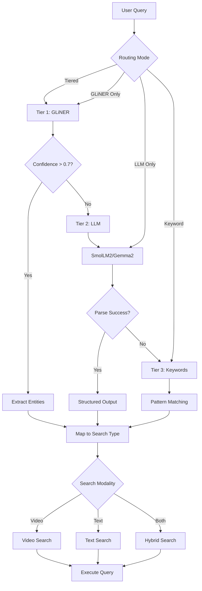

# Query Routing System

The routing system intelligently determines how to process user queries using a tiered architecture that combines GLiNER (fast path), LLMs (slow path), and keyword matching (fallback).

## Architecture

### Three-Tier Routing

```
User Query → Tier 1 (Fast) → Tier 2 (Slow) → Tier 3 (Fallback)
                ↓                ↓                ↓
             GLiNER          SmolLM3/LLM       Keywords
           (CPU, <10ms)     (GPU, ~100ms)    (CPU, <1ms)
```

### Query Routing Decision Flow



### Key Components

- **Routing Strategies** (`strategies.py`): GLiNER, LLM, Keyword, Hybrid, Ensemble
- **Routers** (`router.py`): ComprehensiveRouter, TieredRouter
- **Optimizer** (`optimizer.py`): Auto-tuning optimization
- **Configuration** (`config.py`): Flexible configuration system

## Query Analysis

The system extracts and analyzes:
- **Entities**: Named entities, concepts, numerical values
- **Relationships**: Entity connections
- **Intent**: User goal (purchase, compare, query, complaint)
- **Sentiment**: Emotional tone and intensity
- **Temporal**: Date/time references (ISO 8601)

## Configuration

### Basic Setup (`configs/config.json` under `routing` key)

```json
{
  "routing": {
    "routing_mode": "tiered",
    "tier_config": {
      "enable_fast_path": true,
      "enable_slow_path": true,
      "enable_langextract": true,
      "enable_fallback": true,
      "fast_path_confidence_threshold": 0.7,
      "slow_path_confidence_threshold": 0.6,
      "langextract_confidence_threshold": 0.5,
      "max_routing_time_ms": 5000
    },
    "gliner_config": {
      "gliner_model": "urchade/gliner_multi-v2.1",
      "gliner_threshold": 0.3,
      "gliner_labels": ["video_content", "text_information", "time_reference"]
    },
    "llm_config": {
      "provider": "local",
      "model": "smollm2:1.7b",
      "endpoint": "http://localhost:11434",
      "temperature": 0.1
    }
  }
}
```

### Environment Variables

```bash
export ROUTING_LLM_MODEL=gemma2:2b
export ROUTING_GLINER_THRESHOLD=0.4
export ROUTING_OPTIMIZATION_ENABLE_AUTO_OPTIMIZATION=true
```

## Available Models

### GLiNER Models (Fast Path)
- `gliner_small-v2.1`: Fastest, basic accuracy
- `gliner_medium-v2.1`: Balanced performance
- `gliner_large-v2.1`: Most accurate (recommended)
- `gliner_multi-v2.1`: Multi-lingual support

### LLM Models (Slow Path)
- **SmolLM3-3B**: Optimized for agentic workflows
- **Gemma2:2B**: Lightweight option
- **Custom models**: Via Ollama or Modal

## Usage

### Basic Routing

```python
from src.app.routing import ComprehensiveRouter, RoutingConfig

# Initialize router
config = RoutingConfig()
router = ComprehensiveRouter(config)

# Route query
query = "Show me videos about machine learning from last week"
decision = await router.route(query)

print(f"Search: {decision.search_modality.value}")
print(f"Generation: {decision.generation_type.value}")
print(f"Confidence: {decision.confidence_score:.2f}")
```

### Tiered Router

```python
from src.app.routing import TieredRouter, RoutingConfig

config = RoutingConfig(routing_mode="tiered")
router = TieredRouter(config)

decision = await router.route(query)
print(f"Routing Tier: {decision.metadata.get('tier')}")

# Get statistics
stats = router.get_tier_statistics()
```

## Performance (Estimated)

<!-- TODO: Measure and update with actual performance metrics -->

| Strategy | Latency* | Accuracy* | Cost | Use Case |
|----------|----------|-----------|------|----------|
| GLiNER | <50ms | ~85% | Low | High-volume queries |
| SmolLM2 | ~100ms | ~90% | Medium | Complex reasoning |
| Keyword | <5ms | ~70% | Minimal | Simple patterns |
| Ensemble | ~200ms | ~95% | High | Maximum accuracy |

*Estimates - actual performance depends on hardware and model configuration

## Installation

```bash
# Core dependencies
pip install gliner transformers torch pydantic

# Optional: DSPy for LLM optimization
pip install dspy-ai

# Optional: Ollama for local LLM
curl -fsSL https://ollama.com/install.sh | sh
ollama pull smollm3:3b
```

## Testing

```bash
# Test all routing strategies
python tests/routing/test_combined_routing.py

# Test tiered routing specifically
python tests/routing/integration/test_tiered_routing.py
```

## Decision Framework

**Use GLiNER for:**
- High-throughput, low-latency
- Cost-sensitive production
- Standard query patterns

**Use LLM for:**
- Complex, ambiguous queries
- Maximum flexibility
- Advanced reasoning

**Use Tiered for:**
- Production systems
- Mixed query complexity
- Optimal performance-cost balance

## Troubleshooting

### GLiNER Issues
- Models auto-download on first use
- Check CUDA/MPS for GPU acceleration
- Lower threshold if entities missing

### LLM Issues
- Ensure Ollama running: `ollama serve`
- Verify model: `ollama pull gemma2:2b`
- Increase timeout for slow responses

### Configuration Issues
- Validate JSON syntax
- Check file permissions
- Verify environment variables