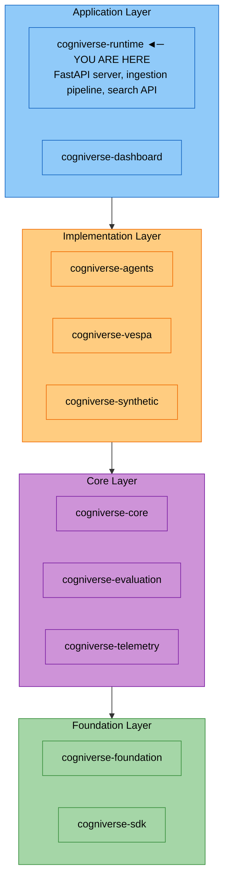

# Runtime Module

**Package:** `cogniverse_runtime`
**Location:** `libs/runtime/cogniverse_runtime/`

---

## Table of Contents

1. [Overview](#overview)
2. [Package Structure](#package-structure)
3. [FastAPI Server](#fastapi-server)
   - [Application Lifecycle](#application-lifecycle)
   - [Router Architecture](#router-architecture)
4. [Ingestion Pipeline](#ingestion-pipeline)
   - [VideoIngestionPipeline](#videoingestionpipeline)
   - [Processing Strategies](#processing-strategies)
   - [Processor Architecture](#processor-architecture)
5. [Search Service](#search-service)
6. [API Reference](#api-reference)
7. [Configuration](#configuration)
8. [Deployment](#deployment)
9. [Testing](#testing)

---

## Overview

The Runtime module provides the **Application Layer** for Cogniverse:

- **FastAPI Server**: Production-ready HTTP server with async support
- **Video Ingestion Pipeline**: Configurable pipeline for video processing (keyframes, chunks, transcription, embeddings)
- **Search API**: Multi-modal search with tenant isolation and session tracking
- **Strategy Pattern**: Pluggable processing strategies for different video analysis approaches
- **Processor Architecture**: Auto-discovery of processors with configuration from YAML

The runtime sits at the top of the package hierarchy, depending on all other modules.

---

## Package Structure

```text
cogniverse_runtime/
├── main.py                          # FastAPI app entry point
├── config_loader.py                 # Dynamic backend/agent loading
├── routers/                         # API routers
│   ├── health.py                    # Health check endpoints
│   ├── search.py                    # Search API endpoints
│   ├── ingestion.py                 # Video ingestion endpoints
│   ├── agents.py                    # Agent orchestration endpoints
│   ├── events.py                    # SSE streaming for real-time notifications
│   └── admin.py                     # Admin/tenant management
├── ingestion/                       # Video processing pipeline
│   ├── pipeline.py                  # VideoIngestionPipeline
│   ├── pipeline_builder.py          # Pipeline builder utilities
│   ├── processor_base.py            # BaseProcessor, BaseStrategy
│   ├── processor_manager.py         # ProcessorManager for auto-discovery
│   ├── strategies.py                # Processing strategy implementations
│   ├── strategy.py                  # Strategy base classes
│   ├── strategy_factory.py          # StrategyFactory for profile-based config
│   ├── processing_strategy_set.py   # Strategy orchestration
│   ├── exceptions.py                # Pipeline-specific exceptions
│   └── processors/                  # Processor implementations
│       ├── keyframe_extractor.py    # Frame extraction (similarity-based)
│       ├── keyframe_extractor_fps.py # Frame extraction (FPS-based)
│       ├── keyframe_processor.py    # Keyframe processing wrapper
│       ├── chunk_processor.py       # Video chunk extraction
│       ├── video_chunk_extractor.py # Chunk extraction utilities
│       ├── audio_transcriber.py     # Whisper transcription
│       ├── audio_processor.py       # Audio processing utilities
│       ├── audio_embedding_generator.py # Audio embedding generation
│       ├── vlm_processor.py         # VLM description generation
│       ├── vlm_descriptor.py        # VLM descriptor implementation
│       ├── single_vector_processor.py # Single-vector embeddings
│       ├── embedding_processor.py   # Generic embedding processor
│       └── embedding_generator/     # Embedding generation subsystem
│           ├── embedding_generator.py # Main generator interface
│           ├── embedding_generator_impl.py # Implementation
│           ├── embedding_generator_factory.py # Generator factory
│           ├── embedding_processors.py # Model-specific processors
│           ├── document_builders.py # Document builders (internal)
│           └── backend_factory.py   # Backend initialization
├── search/                          # Search service
│   ├── service.py                   # SearchService implementation
│   └── base.py                      # Search base classes
├── admin/                           # Admin functionality
│   ├── tenant_manager.py            # Tenant management
│   ├── models.py                    # Admin models
│   └── profile_models.py            # Profile configuration models
├── inference/                       # Inference services
│   └── modal_inference_service.py   # Modal-based inference
└── instrumentation/                 # Monitoring
    └── phoenix.py                   # Phoenix instrumentation
```

---

## FastAPI Server

### Application Lifecycle

The server uses FastAPI's lifespan context manager for startup/shutdown:

```python
from cogniverse_runtime.main import app
import uvicorn

# Run the server
uvicorn.run(app, host="0.0.0.0", port=8000)
```

**Startup Sequence:**

1. Load configuration via `ConfigManager`
2. Initialize `SchemaLoader` for Vespa schemas
3. Set dependencies on routers
4. Initialize `BackendRegistry` and `AgentRegistry`
5. Wire registries and dependencies to routers
6. Load backends and agents from config (agents are validated and registered as endpoints, not instantiated)
7. Initialize telemetry
8. Wire tenant manager to backend
9. Configure DSPy LM and synthetic data service

```python
# From main.py (simplified)
@asynccontextmanager
async def lifespan(app: FastAPI) -> AsyncIterator[None]:
    """Lifecycle manager for FastAPI app."""

    # 1. Load configuration
    config_manager = create_default_config_manager()
    config = get_config(tenant_id="default", config_manager=config_manager)

    # 2. Initialize SchemaLoader
    schema_loader = FilesystemSchemaLoader(Path("configs/schemas"))

    # 3. Set dependencies on routers
    admin.set_config_manager(config_manager)
    admin.set_schema_loader(schema_loader)
    ingestion.set_config_manager(config_manager)
    ingestion.set_schema_loader(schema_loader)

    # 4. Initialize registries
    backend_registry = BackendRegistry(config_manager=config_manager)
    agent_registry = AgentRegistry(config_manager=config_manager)

    # 5. Wire agent registry and dependencies
    agents.set_agent_registry(agent_registry)
    agents.set_agent_dependencies(config_manager, schema_loader)

    # 6. Load from config — agents are validated and registered as endpoints
    config_loader = get_config_loader()
    config_loader.load_backends()
    config_loader.load_agents(agent_registry=agent_registry)

    # ... telemetry, tenant manager, DSPy/synthetic setup ...

    yield
```

### Router Architecture

The server uses modular routers for different functionality:

| Router | Prefix | Purpose |
|--------|--------|---------|
| `health` | `/health` | Health checks, readiness probes |
| `search` | `/search` | Multi-modal search API |
| `ingestion` | `/ingestion` | Video upload and processing |
| `agents` | `/agents` | Agent registry and in-process execution |
| `admin` | `/admin` | Tenant and profile management |
| `events` | `/events` | SSE streaming for real-time notifications |
| `synthetic` | `/synthetic` | Synthetic data generation (from `cogniverse_synthetic`) |

```python
# Router registration in main.py
app.include_router(health.router, tags=["health"])
app.include_router(agents.router, prefix="/agents", tags=["agents"])
app.include_router(search.router, prefix="/search", tags=["search"])
app.include_router(ingestion.router, prefix="/ingestion", tags=["ingestion"])
app.include_router(admin.router, prefix="/admin", tags=["admin"])
app.include_router(events.router, prefix="/events", tags=["events"])
app.include_router(synthetic_router, tags=["synthetic-data"])
```

---

## Ingestion Pipeline

### VideoIngestionPipeline

The central class for video processing:

```python
from cogniverse_runtime.ingestion.pipeline import VideoIngestionPipeline, PipelineConfig
from cogniverse_foundation.config.utils import create_default_config_manager

# Initialize pipeline
config_manager = create_default_config_manager()
pipeline = VideoIngestionPipeline(
    tenant_id="acme",                       # Required - no default
    config=None,                            # Optional PipelineConfig
    app_config=None,                        # Optional application config dict
    config_manager=config_manager,          # Required if config/app_config not provided
    schema_loader=schema_loader,            # Optional for backend operations
    schema_name="video_colpali_mv_frame",   # Processing profile
    debug_mode=True,                        # Enable detailed logging
    event_queue=None,                       # Optional EventQueue for real-time notifications
)

# Process single video
result = await pipeline.process_video_async(Path("video.mp4"))

# Process directory with concurrency
results = pipeline.process_directory(
    video_dir=Path("videos/"),
    max_concurrent=3
)
```

**Key Features:**

- **Profile-based configuration**: Each `schema_name` maps to a processing profile

- **Concurrent processing**: Process multiple videos in parallel

- **Caching**: Optional caching of intermediate results (keyframes, transcripts)

- **Strategy-driven**: Processing steps determined by strategy configuration

**PipelineConfig:**

```python
@dataclass
class PipelineConfig:
    """Configuration for the video processing pipeline."""

    extract_keyframes: bool = True
    transcribe_audio: bool = True
    generate_descriptions: bool = True
    generate_embeddings: bool = True

    # Processing parameters
    keyframe_threshold: float = 0.999
    max_frames_per_video: int = 3000
    vlm_batch_size: int = 500

    # Backend selection
    search_backend: str = "byaldi"  # "byaldi" or "vespa"
```

### Processing Strategies

Strategies define how videos are processed. Each strategy specifies required processors:

**FrameSegmentationStrategy** - Extract individual frames (for ColPali):
```python
from cogniverse_runtime.ingestion.strategies import FrameSegmentationStrategy

strategy = FrameSegmentationStrategy(
    fps=1.0,              # Extract 1 frame per second
    threshold=0.999,       # Similarity threshold for deduplication
    max_frames=3000        # Maximum frames per video
)

# Required processors
strategy.get_required_processors()
# -> {"keyframe": {"fps": 1.0, "threshold": 0.999, "max_frames": 3000}}
```

**ChunkSegmentationStrategy** - Extract video chunks (for ColQwen, VideoPrism):
```python
from cogniverse_runtime.ingestion.strategies import ChunkSegmentationStrategy

strategy = ChunkSegmentationStrategy(
    chunk_duration=30.0,   # 30-second chunks
    chunk_overlap=0.0,     # No overlap
    cache_chunks=True      # Cache extracted chunks
)
```

**SingleVectorSegmentationStrategy** - Single-vector embeddings (for VideoPrism LVT):
```python
from cogniverse_runtime.ingestion.strategies import SingleVectorSegmentationStrategy

strategy = SingleVectorSegmentationStrategy(
    strategy="sliding_window",
    segment_duration=6.0,
    segment_overlap=1.0,
    sampling_fps=2.0,
    max_frames_per_segment=12
)
```

**Embedding Strategies:**
```python
from cogniverse_runtime.ingestion.strategies import (
    MultiVectorEmbeddingStrategy,
    SingleVectorEmbeddingStrategy,
)

# Multi-vector (ColPali, ColQwen)
mv_strategy = MultiVectorEmbeddingStrategy(model_name="vidore/colsmol-500m")

# Single-vector (VideoPrism)
sv_strategy = SingleVectorEmbeddingStrategy(model_name="google/videoprism-base")
```

### Processor Architecture

Processors are pluggable components that perform specific tasks:

**BaseProcessor:**
```python
from cogniverse_runtime.ingestion.processor_base import BaseProcessor
from typing import Any
import logging

class CustomProcessor(BaseProcessor):
    """Custom processor implementation."""

    PROCESSOR_NAME = "custom"  # Required identifier

    def __init__(self, logger: logging.Logger, param1: str = "default"):
        super().__init__(logger, param1=param1)
        self.param1 = param1

    def process(self, *args, **kwargs) -> Any:
        """Process input data."""
        # Implementation here
        pass
```

**ProcessorManager:**

Manages processor lifecycle and auto-discovery:

```python
from cogniverse_runtime.ingestion.processor_manager import ProcessorManager

# Initialize
manager = ProcessorManager(logger)

# Initialize from strategy set
manager.initialize_from_strategies(strategy_set)

# Get processor by name
keyframe_processor = manager.get_processor("keyframe")

# List available processors
manager.list_processors()
```

**Available Processors:**

| Processor | Name | Purpose |
|-----------|------|---------|
| `KeyframeProcessor` | `keyframe` | Extract frames using similarity |
| `ChunkProcessor` | `chunk` | Extract video chunks |
| `AudioProcessor` | `audio` | Audio processing utilities |
| `VLMProcessor` | `vlm` | Generate frame descriptions |
| `SingleVectorProcessor` | `single_vector` | Process for single-vector embeddings |
| `EmbeddingProcessor` | `embedding` | Generate and store embeddings |

---

## Search Service

The search service provides multi-modal search with tenant isolation:

```python
from cogniverse_agents.search.service import SearchService
from cogniverse_foundation.config.utils import get_config, create_default_config_manager
from cogniverse_core.schemas.filesystem_loader import FilesystemSchemaLoader
from pathlib import Path

config_manager = create_default_config_manager()
schema_loader = FilesystemSchemaLoader(Path("configs/schemas"))
config = get_config(tenant_id="acme", config_manager=config_manager)

# Create service - config_manager and schema_loader are REQUIRED
search_service = SearchService(
    config=config,
    config_manager=config_manager,
    schema_loader=schema_loader,
)

# Execute search — profile and tenant_id are per-request
results = search_service.search(
    query="find videos about machine learning",
    profile="video_colpali_mv_frame",
    tenant_id="acme",
    top_k=10,
    ranking_strategy="hybrid",
    filters={"modality": "video"}
)

# Note: The API endpoint uses "strategy" field in SearchRequest,
# but SearchService.search() method uses "ranking_strategy" parameter
```

**Search Strategies:**

| Strategy | Description |
|----------|-------------|
| `semantic` | Pure vector similarity search |
| `bm25` | BM25 keyword-based search |
| `hybrid` | Combines semantic and BM25 |
| `learned` | ML-based reranking |
| `multi_modal` | Multi-modal reranking (text, video, audio) |

---

## API Reference

### Search Endpoints

**POST /search/** - Execute search query
```bash
curl -X POST http://localhost:8000/search/ \
  -H "Content-Type: application/json" \
  -d '{
    "query": "machine learning tutorial",
    "profile": "video_colpali_mv_frame",
    "strategy": "hybrid",
    "top_k": 10,
    "tenant_id": "acme",
    "session_id": "user-session-123"
  }'
```

**GET /search/strategies** - List available strategies
```bash
curl http://localhost:8000/search/strategies
```

**GET /search/profiles** - List available profiles
```bash
curl http://localhost:8000/search/profiles
```

**POST /search/rerank** - Rerank existing results
```bash
curl -X POST http://localhost:8000/search/rerank \
  -H "Content-Type: application/json" \
  -d '{
    "query": "machine learning",
    "results": [...],
    "strategy": "learned"
  }'
```

### Ingestion Endpoints

**POST /ingestion/start** - Start batch video ingestion
```bash
curl -X POST http://localhost:8000/ingestion/start \
  -H "Content-Type: application/json" \
  -d '{
    "video_dir": "/data/videos",
    "profile": "video_colpali_smol500_mv_frame",
    "backend": "vespa",
    "tenant_id": "acme",
    "batch_size": 10
  }'
```

**POST /ingestion/upload** - Upload single video
```bash
curl -X POST http://localhost:8000/ingestion/upload \
  -F "file=@tutorial.mp4" \
  -F "profile=video_colpali_smol500_mv_frame" \
  -F "tenant_id=acme"
```

**GET /ingestion/status/{job_id}** - Check processing status
```bash
curl http://localhost:8000/ingestion/status/job-123
```

### Agents Endpoints

The agents router provides A2A (Agent-to-Agent) registry endpoints for agent discovery and management.

**POST /agents/register** - Register an agent (A2A self-registration pattern)
```bash
curl -X POST http://localhost:8000/agents/register \
  -H "Content-Type: application/json" \
  -d '{
    "name": "video-search-agent",
    "url": "http://localhost:8001",
    "capabilities": ["video_search", "semantic_retrieval"],
    "health_endpoint": "/health",
    "process_endpoint": "/tasks/send",
    "timeout": 30
  }'
```

**GET /agents/** - List all registered agents
```bash
curl http://localhost:8000/agents/
```

**GET /agents/stats** - Get registry statistics including health status
```bash
curl http://localhost:8000/agents/stats
```

**GET /agents/by-capability/{capability}** - Find agents by capability
```bash
curl http://localhost:8000/agents/by-capability/video_search
```

**GET /agents/{agent_name}** - Get agent information
```bash
curl http://localhost:8000/agents/video-search-agent
```

**GET /agents/{agent_name}/card** - Get A2A agent card
```bash
curl http://localhost:8000/agents/video-search-agent/card
```

**DELETE /agents/{agent_name}** - Unregister an agent
```bash
curl -X DELETE http://localhost:8000/agents/video-search-agent
```

**POST /agents/{agent_name}/process** - Process task with agent in-process (search capabilities execute via `SearchService`; text generation/analysis return 501 Not Implemented)

**POST /agents/{agent_name}/upload** - Upload file to agent

### Admin Endpoints

**GET /admin/system/stats** - Get system statistics
**GET /admin/profiles** - List processing profiles
**GET /admin/profiles/{profile_name}** - Get profile details
**POST /admin/profiles** - Create profile
**PUT /admin/profiles/{profile_name}** - Update profile
**DELETE /admin/profiles/{profile_name}** - Delete profile
**POST /admin/profiles/{profile_name}/deploy** - Deploy schema for profile

### Health Endpoints

**GET /health** - Health check
**GET /health/ready** - Readiness probe
**GET /health/live** - Liveness probe

### Events Endpoints (SSE Streaming)

**GET /events/workflows/{workflow_id}** - Subscribe to workflow events
```bash
curl -N "http://localhost:8000/events/workflows/workflow_123"
# Returns Server-Sent Events stream:
# data: {"event_type": "status", "state": "working", "phase": "planning"}
# data: {"event_type": "progress", "current": 1, "total": 3}
# ...
```

**GET /events/ingestion/{job_id}** - Subscribe to ingestion job events
```bash
curl -N "http://localhost:8000/events/ingestion/ingestion_456"
```

**POST /events/workflows/{workflow_id}/cancel** - Cancel a running workflow
```bash
curl -X POST "http://localhost:8000/events/workflows/workflow_123/cancel" \
  -H "Content-Type: application/json" \
  -d '{"reason": "User requested cancellation"}'
```

**POST /events/ingestion/{job_id}/cancel** - Cancel a running ingestion job

**GET /events/queues** - List active event queues (admin)

**GET /events/queues/{task_id}** - Get queue information

See [Events Module](./events.md) for complete documentation.

---

## Configuration

### Profile Configuration

Processing profiles are defined in the backend configuration:

```yaml
backend:
  default_profile: video_colpali_mv_frame
  profiles:
    video_colpali_mv_frame:
      type: multi_vector
      embedding_model: vidore/colsmol-500m
      strategies:
        segmentation:
          class: FrameSegmentationStrategy
          params:
            fps: 1.0
            threshold: 0.999
            max_frames: 3000
        transcription:
          class: AudioTranscriptionStrategy
          params:
            model: whisper-large-v3
        description:
          class: NoDescriptionStrategy
          params: {}
        embedding:
          class: MultiVectorEmbeddingStrategy
          params:
            model_name: vidore/colsmol-500m

    video_videoprism_sv_chunk:
      type: single_vector
      embedding_model: google/videoprism-base
      strategies:
        segmentation:
          class: SingleVectorSegmentationStrategy
          params:
            segment_duration: 6.0
            segment_overlap: 1.0
            sampling_fps: 2.0
        transcription:
          class: AudioTranscriptionStrategy
          params:
            model: whisper-large-v3
        description:
          class: NoDescriptionStrategy
          params: {}
        embedding:
          class: SingleVectorEmbeddingStrategy
          params:
            model_name: google/videoprism-base
```

### Environment Variables

```bash
# Required
export TENANT_ID="acme"
export VESPA_URL="http://localhost:8080"

# Optional
export VESPA_CONFIG_URL="http://localhost:19071"
export PHOENIX_ENDPOINT="http://localhost:6006"
export REDIS_URL="redis://localhost:6379"
export LOG_LEVEL="INFO"
export DEBUG_PIPELINE="false"

# Server configuration
export RUNTIME_HOST="0.0.0.0"
export RUNTIME_PORT="8000"
```

---

## Deployment

### Development

```bash
# Start with auto-reload
uv run uvicorn cogniverse_runtime.main:app --reload --port 8000

# Access API docs
open http://localhost:8000/docs
```

### Production

```bash
# Multiple workers
uv run uvicorn cogniverse_runtime.main:app \
    --host 0.0.0.0 \
    --port 8000 \
    --workers 4 \
    --loop uvloop

# With Gunicorn
uv run gunicorn cogniverse_runtime.main:app \
    -w 4 \
    -k uvicorn.workers.UvicornWorker \
    --bind 0.0.0.0:8000
```

### Docker

```dockerfile
FROM python:3.11-slim

RUN pip install uv
COPY . /app
WORKDIR /app
RUN uv sync

CMD ["uv", "run", "uvicorn", "cogniverse_runtime.main:app", \
     "--host", "0.0.0.0", "--port", "8000"]
```

### Docker Compose

```yaml
version: '3.8'

services:
  runtime:
    build: .
    ports:
      - "8000:8000"
    environment:
      - TENANT_ID=acme
      - VESPA_URL=http://vespa:8080
      - PHOENIX_ENDPOINT=http://phoenix:6006
    depends_on:
      - vespa
      - phoenix

  vespa:
    image: vespaengine/vespa
    ports:
      - "8080:8080"
      - "19071:19071"

  phoenix:
    image: arizephoenix/phoenix:latest
    ports:
      - "6006:6006"
      - "4317:4317"
```

---

## Architecture Position



**Dependencies:**

- `cogniverse-core`: Registries, orchestration, memory

- `cogniverse-agents`: Agent implementations

- `cogniverse-vespa`: Vespa backend operations

- `cogniverse-foundation`: Configuration and telemetry

**Dependents:**

- `cogniverse-dashboard`: Uses runtime APIs

---

## Testing

```bash
# Run all runtime tests (ingestion pipeline tests)
JAX_PLATFORM_NAME=cpu uv run pytest tests/ingestion/ -v

# Run integration tests (requires services)
JAX_PLATFORM_NAME=cpu uv run pytest tests/ingestion/integration/ -v

# Run specific tests
uv run pytest tests/ingestion/unit/ -v

# Test with coverage
uv run pytest tests/ingestion/ --cov=cogniverse_runtime --cov-report=html
```

**Test Categories:**

- `tests/ingestion/unit/` - Unit tests for pipeline, processors, strategies

- `tests/ingestion/integration/` - Integration tests with Vespa, Phoenix

---

## Admin System

The admin system provides multi-tenant organization and profile management.

### TenantManager API

**Location:** `admin/tenant_manager.py`

FastAPI endpoints for organization and tenant CRUD operations:

```python
# Architecture: org:tenant format
# Examples: "acme:production", "startup:dev"

# Create organization
POST /admin/organizations
{
    "org_id": "acme",
    "org_name": "Acme Corp",
    "created_by": "admin"
}

# Create tenant (auto-creates org if needed)
POST /admin/tenants
{
    "tenant_id": "acme:production",
    "created_by": "admin",
    "base_schemas": ["video_colpali_mv_frame"]
}

# List tenants for organization
GET /admin/organizations/acme/tenants

# Delete tenant
DELETE /admin/tenants/acme:production
```

**Key Functions:**

| Function | Purpose |
|----------|---------|
| `validate_org_id(org_id)` | Validate org ID format (alphanumeric + underscore) |
| `validate_tenant_name(tenant_name)` | Validate tenant name format |
| `get_backend()` | Get/create backend for metadata operations |
| `set_schema_loader(schema_loader)` | Inject SchemaLoader during app startup |

### Admin Models

**Location:** `admin/models.py`

Data models for organization and tenant management:

```python
@dataclass
class Organization:
    org_id: str           # e.g., "acme"
    org_name: str         # e.g., "Acme Corporation"
    created_at: int       # Unix timestamp (ms)
    created_by: str       # User/service that created
    status: str = "active"  # active | suspended | deleted
    tenant_count: int = 0
    config: Optional[Dict] = None

@dataclass
class Tenant:
    tenant_full_id: str   # e.g., "acme:production"
    org_id: str           # e.g., "acme"
    tenant_name: str      # e.g., "production"
    created_at: int       # Unix timestamp (ms)
    created_by: str
    status: str = "active"
    schemas_deployed: List[str] = []  # Vespa schemas for this tenant
    config: Optional[Dict] = None
```

### Profile Models

**Location:** `admin/profile_models.py`

Pydantic models for backend profile CRUD operations:

```python
class ProfileCreateRequest(BaseModel):
    profile_name: str          # Unique identifier
    tenant_id: str = "default"
    type: str = "video"        # video, image, audio, text
    description: str = ""
    schema_name: str           # Base schema (must have template)
    embedding_model: str       # e.g., "vidore/colsmol-500m"
    pipeline_config: Dict      # keyframe extraction, transcription, etc.
    strategies: Dict           # segmentation, embedding strategies
    embedding_type: str        # frame_based, video_chunks, direct_video_segment, single_vector
    schema_config: Dict        # dimensions, model_name, patches
    deploy_schema: bool = False  # Deploy to Vespa immediately

class ProfileDetail(BaseModel):
    profile_name: str
    tenant_id: str
    type: str
    description: str
    schema_name: str
    embedding_model: str
    pipeline_config: Dict[str, Any]
    strategies: Dict[str, Any]
    embedding_type: str
    schema_config: Dict[str, Any]
    model_specific: Optional[Dict[str, Any]] = None
    schema_deployed: bool
    tenant_schema_name: Optional[str]
    created_at: str
    version: int
```

---

## Embedding Generator Subsystem

**Location:** `ingestion/processors/embedding_generator/`

The embedding generator subsystem provides backend-agnostic embedding generation.

### EmbeddingGenerator

**Location:** `embedding_generator.py`

Backend-agnostic embedding generator that passes raw embeddings:

```python
from cogniverse_runtime.ingestion.processors.embedding_generator import (
    EmbeddingGenerator,
    EmbeddingResult,
)

generator = EmbeddingGenerator(
    config=config,
    logger=logger,
    profile_config={
        "process_type": "frame_based",
        "embedding_model": "vidore/colsmol-500m"
    },
    backend_client=vespa_backend
)

result = generator.generate_embeddings(
    video_data={"video_id": "vid123", "frames": frames},
    output_dir=Path("outputs/")
)

# EmbeddingResult contains:
# - video_id: str
# - total_documents: int
# - documents_processed: int
# - documents_fed: int
# - processing_time: float
# - errors: list[str]
# - metadata: dict
```

**Processing Types:**

| Type | Method | Use Case |
|------|--------|----------|
| `single_vector` | `_generate_single_vector_embeddings` | VideoPrism LVT |
| `video_chunks` | `_generate_video_chunks_embeddings` | ColQwen, VideoPrism |
| `direct_video` | `_generate_direct_video_embeddings` | Direct video processing |
| `frame_based` | `_generate_frame_based_embeddings` | ColPali frame-by-frame |

### EmbeddingGeneratorFactory

**Location:** `embedding_generator_factory.py`

Factory for creating embedding generators based on backend type:

```python
from cogniverse_runtime.ingestion.processors.embedding_generator import (
    EmbeddingGeneratorFactory,
    create_embedding_generator,
)

# Via factory
generator = EmbeddingGeneratorFactory.create(
    backend="vespa",
    tenant_id="acme",           # REQUIRED
    config=config,
    logger=logger,
    profile_config=profile_config,
    config_manager=config_manager,  # REQUIRED (DI)
    schema_loader=schema_loader,    # REQUIRED (DI)
)

# Via convenience function
generator = create_embedding_generator(
    config=config,
    schema_name="video_colpali_mv_frame",
    tenant_id="acme",
    config_manager=config_manager,
    schema_loader=schema_loader,
)
```

### DocumentBuilder

**Location:** `document_builders.py`

The document builder classes (`DocumentBuilder`, `DocumentBuilderFactory`, `DocumentMetadata`) exist in the codebase but are **not exported** from the embedding_generator package. They are used internally by the backend implementations and are not part of the public API.

**Note:** Document building is now handled internally by backend implementations. Users should not need to create documents manually - the `EmbeddingGenerator` and backend clients handle this automatically.

**Internal Document Fields** (for reference):

| Field | Type | Description |
|-------|------|-------------|
| `video_id` | str | Video identifier |
| `video_title` | str | Video title |
| `creation_timestamp` | int | Unix timestamp |
| `segment_id` | int | Segment index |
| `start_time` | float | Segment start (seconds) |
| `end_time` | float | Segment end (seconds) |
| `embedding` | tensor | Float embeddings |
| `embedding_binary` | tensor | Binary embeddings |
| `audio_transcript` | str | Optional transcription |
| `segment_description` | str | Optional VLM description |

### BackendFactory

**Location:** `backend_factory.py`

Creates backend clients using the backend registry:

```python
from cogniverse_runtime.ingestion.processors.embedding_generator import (
    BackendFactory,
)

backend = BackendFactory.create(
    backend_type="vespa",
    tenant_id="acme",           # REQUIRED
    config=config,
    logger=logger,
    config_manager=config_manager,  # REQUIRED (DI)
    schema_loader=schema_loader,    # REQUIRED (DI)
)

# Returns IngestionBackend instance
```

**Dependency Injection Requirements:**

All factory methods require explicit dependency injection:

- `config_manager`: ConfigManager instance
- `schema_loader`: SchemaLoader instance
- `tenant_id`: Required, no default allowed

---

## Related Documentation

- [Core Module](./core.md) - Agent base classes and registries
- [Foundation Module](./foundation.md) - Configuration and telemetry
- [Agents Module](./agents.md) - Agent implementations
- [Vespa Backend](../backends/vespa.md) - Vespa integration details
- [Configuration System](../CONFIGURATION_SYSTEM.md) - Profile configuration guide

---

**Summary:** The Runtime module provides the FastAPI application layer for Cogniverse. `VideoIngestionPipeline` handles video processing with a strategy pattern for flexible configuration. The search service provides multi-modal search with session tracking. Processing profiles define which strategies and processors to use for different video analysis approaches (frame-based ColPali, chunk-based ColQwen, single-vector VideoPrism).
