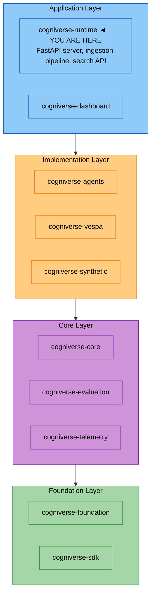

# Runtime Module

**Package:** `cogniverse_runtime`
**Location:** `libs/runtime/cogniverse_runtime/`

---

## Table of Contents

1. [Overview](#overview)
2. [Package Structure](#package-structure)
3. [FastAPI Server](#fastapi-server)
   - [Application Lifecycle](#application-lifecycle)
   - [Router Architecture](#router-architecture)
4. [Ingestion Pipeline](#ingestion-pipeline)
   - [VideoIngestionPipeline](#videoingestionpipeline)
   - [Processing Strategies](#processing-strategies)
   - [Processor Architecture](#processor-architecture)
5. [Search Service](#search-service)
6. [API Reference](#api-reference)
7. [Configuration](#configuration)
8. [Deployment](#deployment)
9. [Architecture Position](#architecture-position)
10. [Testing](#testing)
11. [Admin System](#admin-system)
12. [Embedding Generator Subsystem](#embedding-generator-subsystem)
13. [Sandbox (OpenShell)](#sandbox-openshell)
14. [Optimization CLI](#optimization-cli)
15. [Quality Monitor CLI](#quality-monitor-cli)

---

## Overview

The Runtime module provides the **Application Layer** for Cogniverse:

- **FastAPI Server**: Production-ready HTTP server with async support
- **Video Ingestion Pipeline**: Configurable pipeline for video processing (keyframes, chunks, transcription, embeddings)
- **Search API**: Multi-modal search with tenant isolation and session tracking
- **Strategy Pattern**: Pluggable processing strategies for different video analysis approaches
- **Processor Architecture**: Auto-discovery of processors with configuration from YAML

The runtime sits at the top of the package hierarchy, depending on all other modules.

---

## Package Structure

```text
cogniverse_runtime/
├── main.py                          # FastAPI app entry point + lifespan setup
├── config_loader.py                 # Dynamic backend/agent loading
├── agent_dispatcher.py              # Dispatch agent invocations + egress allow-list
├── job_executor.py                  # Background-job executor
├── a2a_executor.py                  # Agent-to-agent protocol executor
├── memory_init.py                   # Mem0 client + per-tenant memory setup
├── messaging.py                     # In-pod InboundQueueRegistry primitive
├── messaging_redis.py               # Redis-backed cross-pod + durable variant
├── openshell_cert_rotator.py        # mTLS cert rotation for OpenShell sandbox
├── openshell_health.py              # OpenShell gateway health probing
├── optimization_cli.py              # DSPy optimizer entrypoint (compile/serve)
├── quality_monitor_cli.py           # Quality-monitor CLI entry
├── sandbox_http.py                  # Sandbox HTTP transport layer
├── sandbox_manager.py               # SandboxManager + policy enforcement
├── sandbox_pool.py                  # Pool of warm sandbox instances
├── inference_health_check.py        # Startup inference-service probes
├── routers/                         # FastAPI routers (one per API surface)
│   ├── health.py                    # Health + readiness endpoints
│   ├── search.py                    # Search API
│   ├── ingestion.py                 # Ingestion + KG extraction endpoints
│   ├── agents.py                    # Agent orchestration + inbound messaging
│   ├── events.py                    # SSE streaming for real-time updates
│   ├── admin.py                     # Admin / tenant management
│   ├── debug.py                     # Debug + diagnostic endpoints
│   ├── graph.py                     # Graph traversal API
│   ├── knowledge.py                 # Knowledge-graph query API
│   ├── tenant.py                    # Per-tenant admin endpoints
│   └── wiki.py                      # Wiki API endpoints
├── admin/                           # Admin domain models + tenant tooling
│   ├── tenant_manager.py
│   ├── models.py
│   └── profile_models.py
├── ingestion/                       # In-process video-ingestion pipeline
│   ├── pipeline.py                  # VideoIngestionPipeline
│   ├── pipeline_builder.py
│   ├── processor_base.py            # BaseProcessor, BaseStrategy (abstract)
│   ├── processor_manager.py         # Auto-discovery of processors
│   ├── strategies.py                # Concrete strategy implementations
│   ├── strategy.py                  # Strategy base classes
│   ├── strategy_factory.py          # Profile-driven strategy construction
│   ├── processing_strategy_set.py
│   ├── exceptions.py
│   └── processors/                  # Per-processor implementations
│       ├── keyframe_processor.py
│       ├── chunk_processor.py
│       ├── audio_transcriber.py
│       ├── audio_processor.py
│       ├── audio_embedding_generator.py
│       ├── vlm_processor.py
│       ├── vlm_descriptor.py
│       ├── single_vector_processor.py
│       └── embedding_generator/     # Embedding subsystem
│           ├── embedding_generator.py
│           ├── embedding_generator_impl.py
│           ├── embedding_generator_factory.py
│           ├── backend_factory.py
│           └── token_pooling.py     # Post-hoc multi-vector token pooling
├── ingestion_worker/                # Async Redis-Streams ingestion worker
│   ├── worker.py                    # Worker entrypoint + queue consumer
│   ├── queue.py
│   ├── redis_client.py
│   ├── minio_client.py
│   ├── submit_api.py
│   ├── status_api.py
│   ├── backpressure.py
│   └── idempotency.py
└── sidecars/                        # Standalone inference sidecars
    ├── clap_embed.py                # CLAP /embed/audio + /embed/text
    │                                # (joint acoustic space); shipped via
    │                                # deploy/clap_embed/Dockerfile
    └── face_embed.py                # InsightFace /embed FastAPI service;
                                     # shipped alone via deploy/face_embed/
                                     # Dockerfile (no cogniverse imports)
```

LateOn (ColBERT) and DenseOn text embeddings are served by stock vLLM
(`vllm_token_embed` / `vllm_embed` chart engines), not a custom sidecar —
the former `colbert_pylate.py` FastAPI server has been retired. See
`docs/operations/models-and-inference.md` for the serving details.

The face-embed sidecar runs as its own container: `FaceEmbedConfig` is plain
data, `build_app(cfg)` is the app factory, and `main()` is the deployed
entrypoint — the only place the container env (`FACE_EMBED_MODEL`,
`FACE_EMBED_CTX_ID`, `FACE_EMBED_URL_TIMEOUT_S`, `HOST`, `PORT`) is read.
Run locally with `uv run python -m cogniverse_runtime.sidecars.face_embed`;
build the image from the repo root with
`docker build -f deploy/face_embed/Dockerfile .`.

`SearchResult` and `SearchBackend` are imported from `cogniverse_sdk.document` / `cogniverse_sdk.interfaces.backend` — the runtime has no local search ABC any more (the dead duplicates were removed).

---

## FastAPI Server

### Application Lifecycle

The server uses FastAPI's lifespan context manager for startup/shutdown:

```python
from cogniverse_runtime.main import app
import uvicorn

# Run the server
uvicorn.run(app, host="0.0.0.0", port=8000)
```

**Startup Sequence:**

1. Wait (up to 5 minutes) for the backend feed endpoint to be reachable before touching config
2. Load configuration via `ConfigManager`; wire `BackendRegistry` profile add/remove into a `config_manager` profile-change listener
3. Initialize `SchemaLoader` for Vespa schemas; wire `admin`/`tenant` routers and `ingestion`/`search`/`knowledge` FastAPI dependency overrides
4. Initialize `BackendRegistry` (singleton via `get_instance()`) and `AgentRegistry`
5. Initialize `SandboxManager` with a policy resolved from env/config; wire it and the agent registry to the `agents` router
6. Mount the A2A JSON-RPC server at `/a2a` with an `AgentCard` built from the registered agents; tasks are held in a `BoundedInMemoryTaskStore` (LRU-capped at `A2A_MAX_TASKS`, default 10000) rather than the stock unbounded store
7. Load backends and agents from config via `ConfigLoader` (agents are validated and registered as endpoints, not instantiated)
8. Deploy metadata schemas via a system backend; apply deployment env-var overrides to `SystemConfig`
9. Probe Phoenix reachability and validate inference services against configured profiles
10. Wire tenant manager and the wiki/graph manager factories
11. Configure DSPy LM and the synthetic data service
12. Start the `GatewayHealthProbe` and the OpenShell mTLS cert rotator (when sandboxing is enabled)

```python
# From main.py (simplified)
@asynccontextmanager
async def lifespan(app: FastAPI) -> AsyncIterator[None]:
    """Lifecycle manager for FastAPI app."""

    # 1. Wait for the backend to be reachable
    bootstrap = BootstrapConfig.from_environment()
    await _wait_for_backend_ready(f"{bootstrap.backend_url}:{bootstrap.backend_port}")

    # 2. Load configuration
    config_manager = create_default_config_manager()
    config = get_config(tenant_id=SYSTEM_TENANT_ID, config_manager=config_manager)

    # 3. Initialize SchemaLoader
    schema_loader = FilesystemSchemaLoader(Path("configs/schemas"))

    # 3b. Set dependencies on routers
    admin.set_config_manager(config_manager)
    admin.set_schema_loader(schema_loader)
    tenant.set_config_manager(config_manager)
    app.dependency_overrides[ingestion.get_config_manager_dependency] = lambda: config_manager
    app.dependency_overrides[search.get_config_manager_dependency] = lambda: config_manager

    # 4. Initialize registries
    backend_registry = BackendRegistry.get_instance()
    agent_registry = AgentRegistry(tenant_id=SYSTEM_TENANT_ID, config_manager=config_manager)

    # 5. Initialize SandboxManager and wire agent registry + dependencies
    sandbox_manager = SandboxManager(policy=sandbox_policy)
    agents.set_agent_registry(agent_registry)
    agents.set_agent_dependencies(config_manager, schema_loader)
    agents.set_sandbox_manager(sandbox_manager)

    # 6. Mount the A2A protocol server
    app.mount("/a2a", a2a_server.build())

    # 7. Load from config — agents are validated and registered as endpoints
    config_loader = get_config_loader()
    config_loader.load_backends()
    config_loader.load_agents(agent_registry=agent_registry)

    # ... schema deploy, telemetry, tenant manager, DSPy/synthetic setup ...

    yield
```

### Router Architecture

The server uses modular routers for different functionality:

| Router | Prefix | Purpose |
|--------|--------|---------|
| `health` | `/health` | Health checks, readiness probes |
| `search` | `/search` | Multi-modal search API |
| `ingestion` | `/ingestion` | Video upload and processing |
| `agents` | `/agents` | Agent registry and in-process execution |
| `admin` | `/admin` | Tenant and profile management |
| `knowledge` | `/admin` | Direct HTTP routes to knowledge-system agents (audit, citations, KG, federation, synthesis, temporal) |
| `tenant_manager` | `/admin` | Tenant creation and management tooling |
| `events` | `/events` | SSE streaming for real-time notifications |
| `synthetic` | `/synthetic` | Synthetic data generation (from `cogniverse_synthetic`) |
| `wiki` | `/wiki` | Per-tenant wiki knowledge page storage and search |
| `graph` | `/graph` | Knowledge graph upsert, search, neighbors, and path queries |
| `tenant` | `/admin/tenant` | Per-tenant self-service: instructions, memories, scheduled jobs, optimization |
| `debug` | `/admin/debug` | Runtime diagnostics (gated behind `COGNIVERSE_DEBUG_MEM`) |

```python
# Router registration in main.py
app.include_router(health.router, tags=["health"])
app.include_router(agents.router, prefix="/agents", tags=["agents"])
app.include_router(search.router, prefix="/search", tags=["search"])
app.include_router(ingestion.router, prefix="/ingestion", tags=["ingestion"])
app.include_router(admin.router, prefix="/admin", tags=["admin"])
app.include_router(knowledge.router, prefix="/admin", tags=["knowledge-agents"])
app.include_router(tenant_manager.router, prefix="/admin", tags=["tenant-management"])
app.include_router(events.router, prefix="/events", tags=["events"])
app.include_router(synthetic_router, tags=["synthetic-data"])
app.include_router(wiki.router, prefix="/wiki", tags=["wiki"])
app.include_router(graph.router, prefix="/graph", tags=["graph"])
app.include_router(tenant.router, prefix="/admin/tenant", tags=["tenant-extensibility"])
app.include_router(debug.router, prefix="/admin/debug", tags=["debug"])
```

---

## Ingestion Pipeline

### VideoIngestionPipeline

The central class for video processing:

```python
from cogniverse_runtime.ingestion.pipeline import VideoIngestionPipeline, PipelineConfig
from cogniverse_foundation.config.utils import create_default_config_manager

# Initialize pipeline
config_manager = create_default_config_manager()
pipeline = VideoIngestionPipeline(
    tenant_id="acme",                       # Required - no default
    config=None,                            # Optional PipelineConfig
    app_config=None,                        # Optional application config dict
    config_manager=config_manager,          # Required if config/app_config not provided
    schema_loader=schema_loader,            # Optional for backend operations
    schema_name="video_colpali_mv_frame",   # Processing profile
    debug_mode=True,                        # Enable detailed logging
    event_queue=None,                       # Optional EventQueue for real-time notifications
)

# Process single video
result = await pipeline.process_video_async(Path("video.mp4"))

# Process directory with concurrency
results = pipeline.process_directory(
    video_dir=Path("videos/"),
    max_concurrent=3
)
```

**Key Features:**

- **Profile-based configuration**: Each `schema_name` maps to a processing profile

- **Concurrent processing**: Process multiple videos in parallel

- **Caching**: Optional caching of intermediate results (keyframes, transcripts)

- **Strategy-driven**: Processing steps determined by strategy configuration

**PipelineConfig:**

```python
@dataclass
class PipelineConfig:
    """Configuration for the video processing pipeline."""

    extract_keyframes: bool = True
    transcribe_audio: bool = True
    generate_descriptions: bool = True
    generate_embeddings: bool = True

    # Processing parameters
    keyframe_threshold: float = 0.999
    max_frames_per_video: int = 3000
    vlm_batch_size: int = 500

    # Backend selection
    search_backend: str = "byaldi"  # "byaldi" or "vespa"
```

### Processing Strategies

Strategies define how videos are processed. Each strategy specifies required processors:

**FrameSegmentationStrategy** - Extract individual frames (for ColPali):
```python
from cogniverse_runtime.ingestion.strategies import FrameSegmentationStrategy

strategy = FrameSegmentationStrategy(
    fps=1.0,              # Extract 1 frame per second
    threshold=0.999,       # Similarity threshold for deduplication
    max_frames=3000        # Maximum frames per video
)

# Required processors
strategy.get_required_processors()
# -> {"keyframe": {"fps": 1.0, "threshold": 0.999, "max_frames": 3000}}
```

**ChunkSegmentationStrategy** - Extract video chunks (for ColQwen, VideoPrism):
```python
from cogniverse_runtime.ingestion.strategies import ChunkSegmentationStrategy

strategy = ChunkSegmentationStrategy(
    chunk_duration=30.0,   # 30-second chunks
    chunk_overlap=0.0,     # No overlap
    cache_chunks=True      # Cache extracted chunks
)
```

**SingleVectorSegmentationStrategy** - Single-vector embeddings (for VideoPrism LVT):
```python
from cogniverse_runtime.ingestion.strategies import SingleVectorSegmentationStrategy

strategy = SingleVectorSegmentationStrategy(
    strategy="sliding_window",
    segment_duration=6.0,
    segment_overlap=1.0,
    sampling_fps=2.0,
    max_frames_per_segment=12
)
```

**Embedding Strategies:**
```python
from cogniverse_runtime.ingestion.strategies import (
    MultiVectorEmbeddingStrategy,
    SingleVectorEmbeddingStrategy,
)

# Multi-vector (ColPali, ColQwen)
mv_strategy = MultiVectorEmbeddingStrategy(model_name="TomoroAI/tomoro-colqwen3-embed-4b")

# Single-vector (VideoPrism)
sv_strategy = SingleVectorEmbeddingStrategy(model_name="google/videoprism-base")
```

### Processor Architecture

Processors are pluggable components that perform specific tasks:

**BaseProcessor:**
```python
from cogniverse_runtime.ingestion.processor_base import BaseProcessor
from typing import Any
import logging

class CustomProcessor(BaseProcessor):
    """Custom processor implementation."""

    PROCESSOR_NAME = "custom"  # Required identifier

    def __init__(self, logger: logging.Logger, param1: str = "default"):
        super().__init__(logger, param1=param1)
        self.param1 = param1

    def process(self, *args, **kwargs) -> Any:
        """Process input data."""
        # Implementation here
        pass
```

**ProcessorManager:**

Manages processor lifecycle and auto-discovery:

```python
from cogniverse_runtime.ingestion.processor_manager import ProcessorManager

# Initialize
manager = ProcessorManager(logger)

# Initialize from strategy set. service_urls is the {service_name: url}
# map of deployed inference services (from SystemConfig.inference_service_urls);
# pass {} when no remote services are deployed.
manager.initialize_from_strategies(strategy_set, service_urls={})

# Get processor by name
keyframe_processor = manager.get_processor("keyframe")

# List available processors
manager.list_processors()
```

**Available Processors:**

| Processor | Name | Purpose |
|-----------|------|---------|
| `KeyframeProcessor` | `keyframe` | Extract frames using similarity |
| `ChunkProcessor` | `chunk` | Extract video chunks |
| `AudioProcessor` | `audio` | Audio processing utilities |
| `VLMProcessor` | `vlm` | Generate frame descriptions via Modal VLM service |
| `SingleVectorProcessor` | `single_vector` | Process for single-vector embeddings |

`AudioProcessor` and `VLMProcessor` are thin `BaseProcessor` wrappers that delegate to internal helper classes: `AudioTranscriber` (Whisper transcription), `AudioEmbeddingGenerator` (CLAP acoustic/semantic embeddings), and `VLMDescriptor` (Modal VLM service communication). These helpers are not `BaseProcessor` subclasses themselves and are not addressable by name through `ProcessorManager`.

---

## Search Service

The search service provides multi-modal search with tenant isolation:

```python
from cogniverse_agents.search.service import SearchService
from cogniverse_foundation.config.utils import get_config, create_default_config_manager
from cogniverse_core.schemas.filesystem_loader import FilesystemSchemaLoader
from pathlib import Path

config_manager = create_default_config_manager()
schema_loader = FilesystemSchemaLoader(Path("configs/schemas"))
config = get_config(tenant_id="acme", config_manager=config_manager)

# Create service - config_manager and schema_loader are REQUIRED
search_service = SearchService(
    config=config,
    config_manager=config_manager,
    schema_loader=schema_loader,
)

# Execute search — profile and tenant_id are per-request
results = search_service.search(
    query="find videos about machine learning",
    profile="video_colpali_mv_frame",
    tenant_id="acme",
    top_k=10,
    ranking_strategy="hybrid",
    filters={"modality": "video"}
)

# Note: The API endpoint uses "strategy" field in SearchRequest,
# but SearchService.search() method uses "ranking_strategy" parameter
```

**Search Strategies:**

| Strategy | Description |
|----------|-------------|
| `semantic` | Pure vector similarity search |
| `bm25` | BM25 keyword-based search |
| `hybrid` | Combines semantic and BM25 |
| `learned` | ML-based reranking |
| `multi_modal` | Multi-modal reranking (text, video, audio) |

---

## API Reference

### Search Endpoints

**POST /search/** - Execute search query
```bash
curl -X POST http://localhost:8000/search/ \
  -H "Content-Type: application/json" \
  -d '{
    "query": "machine learning tutorial",
    "profile": "video_colpali_mv_frame",
    "strategy": "hybrid",
    "top_k": 10,
    "tenant_id": "acme",
    "session_id": "user-session-123"
  }'
```

**GET /search/strategies** - List the ranking strategies a profile accepts
```bash
curl "http://localhost:8000/search/strategies?tenant_id=acme:acme"
```
Strategies are per-profile (derived from the profile's schema), so `tenant_id`
is required and an optional `profile` defaults to the tenant's active profile.
The returned names can be passed straight to the `strategy` field of `POST /search`.

**GET /search/profiles** - List available profiles
```bash
curl http://localhost:8000/search/profiles
```

**POST /search/rerank** - Rerank existing results
```bash
curl -X POST http://localhost:8000/search/rerank \
  -H "Content-Type: application/json" \
  -d '{
    "query": "machine learning",
    "results": [...],
    "strategy": "learned"
  }'
```

### Ingestion Endpoints

**POST /ingestion/start** - Start batch video ingestion
```bash
curl -X POST http://localhost:8000/ingestion/start \
  -H "Content-Type: application/json" \
  -d '{
    "video_dir": "/data/videos",
    "profile": "video_colpali_smol500_mv_frame",
    "backend": "vespa",
    "tenant_id": "acme",
    "batch_size": 10
  }'
```

**POST /ingestion/upload** - Upload a video to MinIO and enqueue ingestion via Redis
```bash
curl -X POST "http://localhost:8000/ingestion/upload?wait=true&wait_timeout=300&force=false" \
  -F "file=@tutorial.mp4" \
  -F "profile=video_colpali_smol500_mv_frame" \
  -F "backend=vespa" \
  -F "tenant_id=acme"
```
Form fields: `file` (required), `profile` (default `"default"`), `backend` (default `"vespa"`), `tenant_id` (required — 400 if missing), `org_id` (optional). Query params: `wait` (default `false` — returns immediately with just `ingest_id`), `wait_timeout` (seconds, `10`-`900`, default `300`, applies only when `wait=true`), `force` (default `false`, bypasses idempotency and re-enqueues even on a cache hit).

Response always includes `ingest_id`, `sha`, `state` (`queued`|`in_flight`|`complete`|`failed`), `existing` (`true` on an idempotency hit), `filename`, `source_url`. Without `wait=true` the response stops there with `status: "queued"`. When `wait=true` reaches a terminal state, the response additionally includes `video_id`, `chunks_created`, `documents_fed`, `status` (`"success"` or the terminal `state`), and `graph_nodes`/`graph_edges` — the worker's per-segment KG-extraction counts carried through the terminal event (the route surfaces them verbatim rather than re-extracting). 429 on backpressure rejection (`axis`, `current`, `limit`, `message`); 503 if Redis/MinIO aren't configured.

**GET /ingestion/status/{job_id}** - Check processing status
```bash
curl http://localhost:8000/ingestion/status/job-123
```

### Agents Endpoints

The agents router provides A2A (Agent-to-Agent) registry endpoints for agent discovery and management.

**POST /agents/register** - Register an agent (A2A self-registration pattern)
```bash
curl -X POST http://localhost:8000/agents/register \
  -H "Content-Type: application/json" \
  -d '{
    "name": "video-search-agent",
    "url": "http://localhost:8001",
    "capabilities": ["video_search", "semantic_retrieval"],
    "health_endpoint": "/health",
    "process_endpoint": "/tasks/send",
    "timeout": 30
  }'
```

**GET /agents/** - List all registered agents
```bash
curl http://localhost:8000/agents/
```

**GET /agents/stats** - Get registry statistics including health status
```bash
curl http://localhost:8000/agents/stats
```

**GET /agents/annotations/queue** - Annotation-queue statistics and pending items (routing feedback loop)
```bash
curl http://localhost:8000/agents/annotations/queue
```

**POST /agents/annotations/queue/{span_id}/assign** - Assign a pending annotation to a reviewer
```bash
curl -X POST http://localhost:8000/agents/annotations/queue/span-123/assign \
  -H "Content-Type: application/json" \
  -d '{"reviewer": "alice", "sla_hours": 24}'
```

**POST /agents/annotations/queue/{span_id}/complete** - Record a completed annotation label
```bash
curl -X POST http://localhost:8000/agents/annotations/queue/span-123/complete \
  -H "Content-Type: application/json" \
  -d '{"label": "correct"}'
```

**GET /agents/by-capability/{capability}** - Find agents by capability
```bash
curl http://localhost:8000/agents/by-capability/video_search
```

**GET /agents/{agent_name}** - Get agent information
```bash
curl http://localhost:8000/agents/video-search-agent
```

**GET /agents/{agent_name}/card** - Get A2A agent card
```bash
curl http://localhost:8000/agents/video-search-agent/card
```

**DELETE /agents/{agent_name}** - Unregister an agent
```bash
curl -X DELETE http://localhost:8000/agents/video-search-agent
```

**POST /agents/{agent_name}/process** - Process task with agent in-process. Dispatches by capability: `routing` routes through `OrchestratorAgent` (with memory, query enhancement, entity extraction) and executes the recommended downstream agent via `_execute_downstream_agent`; `search`/`video_search`/`retrieval` execute via `SearchService`; `summarization`/`detailed_report`/`text_analysis` instantiate their respective agents; unsupported capabilities raise `ValueError`. Supports multi-turn conversations via `conversation_history` field — a list of `{"role": "user"|"agent", "content": "..."}` dicts. When present, search agents rewrite queries using `ConversationalQueryRewriteModule` to resolve anaphoric references (e.g., "show me more" → "show me more basketball videos"). The response includes `original_query` and `rewritten_query` fields when rewriting occurs.

**POST /agents/{agent_name}/message** - Enqueue an inbound message for a running agent session (202 on success)
```bash
curl -X POST http://localhost:8000/agents/routing_agent/message \
  -H "Content-Type: application/json" \
  -d '{
    "session_id": "sess-123",
    "tenant_id": "acme",
    "role": "user",
    "content": "stop searching, use the last 3 results",
    "tags": ["constraint"]
  }'
```
`agent_name` is accepted for URL symmetry with `/process` but is not used for routing — the registry is keyed by `session_id` alone. Returns 404 when the session isn't active, or when `tenant_id` doesn't match the session's registered tenant (cross-tenant probes can't distinguish "wrong tenant" from "no such session").

**GET /agents/{agent_name}/sessions/{session_id}** - Poll whether a session is active (used by clients and the e2e harness)
```bash
curl "http://localhost:8000/agents/routing_agent/sessions/sess-123?tenant_id=acme"
```

**A2A Streaming** - Agents that support streaming (summarization, text_generation) emit intermediate progress events via the A2A protocol. Use `POST /a2a/tasks/sendSubscribe` with `metadata.stream: true` to receive SSE events. The SummarizerAgent streams phase-by-phase (thinking → visual analysis → summary generation) as `TaskStatusUpdateEvent`s with `state=working` for progress and `state=input_required` for the final result.

#### AgentDispatcher and egress enforcement

`AgentDispatcher` (`agent_dispatcher.py`) is the class behind `/agents/{agent_name}/process` — it holds the per-capability dispatch logic described above. Before dispatching to `search_agent`, `routing_agent`, or `summarizer_agent` it calls `consult_egress_policy(agent_name)` to look up that agent's OpenShell egress allow-list (from `configs/agent_policies/`), then `_verify_*_egress(tenant_id)` to confirm every resolved endpoint (LLM, inference service, etc.) the agent is about to call is within that allow-list. A resolved endpoint outside the allow-list logs an "egress policy DRIFT" warning rather than failing the request — the check is a drift detector for policy authors, not a hard block.

#### Inbound messaging (per-session)

The runtime ships an inbound-messaging primitive in `cogniverse_runtime.messaging` so callers can push messages INTO a running agent session — the inverse of the outbound `EventQueue` pattern. Three primitives:

- `InboundMessage` — frozen dataclass: `session_id`, `role`, `content`, `tags: tuple[str, ...]`, `created_at`, `deadline_ms`. Tags drive agent behaviour: `("stop",)` triggers cooperative cancellation; `("constraint",)` / `("interrupt",)` inject context into the next iteration; `("system",)` is reserved for supervisor messages.
- `InboundQueue` — per-session async FIFO. `enqueue()` is non-blocking; `drain()` returns all buffered messages in submission order AND atomically clears the buffer. Past-deadline messages drop at drain (not at enqueue) so a slow agent that drains rarely still sees fresh messages.
- `InboundQueueRegistry` — registry of `(session_id) -> InboundQueue` shared between the HTTP route and the agent. `get_or_create_queue(session_id, tenant_id)` is idempotent (same instance on re-resolve). `get_queue(session_id)` returns `None` for unknown sessions so the HTTP route can decide between 202 (active) and 404 (not active). `close_queue(session_id)` removes the queue from the registry AND marks the underlying queue closed — subsequent `enqueue()` raises `QueueClosedError`. Cross-tenant session-id collision raises `ValueError`.

Module-level singleton via `get_inbound_queue_registry()`; the HTTP route and the orchestrator both go through the singleton so messages from either side land in the same buffer.

Multi-pod + durability are shipped via `cogniverse_runtime.messaging_redis`. When `REDIS_URL` is set in the runtime env, `routers.agents._resolve_inbound_registry` (and the orchestrator's equivalent resolver) swap in a `RedisInboundQueueRegistry` whose Redis state survives pod restarts AND routes correctly across pods sharing the same Redis. Redis state shape:

- `session:<session_id>:tenant` — string with TTL. Value is the tenant_id. `SET NX` semantics make cross-tenant collision detection atomic.
- `inbound:<tenant_id>:<session_id>` — list. `enqueue` does LPUSH and refreshes an EXPIRE bounded by the active-marker TTL, so an abandoned (never-closed) session self-expires instead of leaking; `drain` runs a server-side Lua script that LRANGE + DEL atomically so concurrent enqueues are never partially observed.

Verified end-to-end against a live cluster with `kubectl delete pod --wait=true` mid-flight: enqueued constraints survive the pod kill and the new pod resumes from Redis state.

### Admin Endpoints

**GET /admin/system/stats** - Get system statistics
**GET /admin/profiles** - List processing profiles
**GET /admin/profiles/{profile_name}** - Get profile details
**POST /admin/profiles** - Create profile
**PUT /admin/profiles/{profile_name}** - Update profile
**DELETE /admin/profiles/{profile_name}** - Delete profile
**POST /admin/profiles/{profile_name}/deploy** - Deploy schema for profile

**Tenant lifecycle** (`libs/runtime/cogniverse_runtime/admin/tenant_manager.py`)

**POST /admin/organizations** - Create organization
**GET /admin/organizations** - List all organizations
**GET /admin/organizations/{org_id}** - Get organization
**DELETE /admin/organizations/{org_id}** - Delete organization (and its tenants)
**GET /admin/organizations/{org_id}/tenants** - List tenants for an organization
**POST /admin/tenants** - Create tenant (writes `tenant_metadata`). Accepts both simple form (`acme`) and colon form (`acme:production`); simple form is normalized to `acme:acme` before storage.
**GET /admin/tenants/{tenant_full_id}** - Get tenant. Path param is canonicalized via `canonical_tenant_id` (see [common.md#canonical_tenant_id](common.md#canonical_tenant_id)), so simple form (`acme`) and colon form (`acme:acme`) resolve identically.
**DELETE /admin/tenants/{tenant_full_id}** - Delete tenant. Path param is canonicalized like GET. Drops registered schemas and all Vespa-side orphans matching the tenant suffix; unresolved Vespa-only orphans encountered during the redeploy are absorbed into the deletion set (logged as warnings) rather than causing a `BackendDeploymentError`.
**POST /admin/reconcile-orphans?dry_run={true|false}** - List Vespa-only schema orphans (no registry record), or drop every orphan tenant in one atomic redeploy. `dry_run=true` (default) returns the diff for operator review; `dry_run=false` calls `delete_tenant_schemas_bulk` so all orphans are removed in a single Vespa redeploy. See [operations/multi-tenant-ops.md#orphan-reconciliation](../operations/multi-tenant-ops.md#orphan-reconciliation) for the operator workflow.

**Messaging gateway and memory admin**

**POST /admin/messaging/invite** — Generate an invite token for messaging-gateway registration. Body: `{"tenant_id": str, "expires_in_hours": int = 24}`. Response: `{token, tenant_id}`; the token is what a user sends to the gateway bot (e.g. `/start <token>`) to link an account to the tenant.

**DELETE /admin/memories/{tenant_id}/{memory_id}** — Delete any memory by id regardless of namespace (tries `_user_memories` then `_strategy_store`). 404 if not found in either.

**DELETE /admin/memories/{tenant_id}?type={preference|strategy|all}** — Clear memories by type (`preference` → `_user_memories`, `strategy` → `_strategy_store`); omitted/`all` clears both namespaces.

**DELETE /admin/tenants/{tenant_id}/sessions/{session_id}** — Hard-delete every `EPHEMERAL_SESSION`-retention memory tagged with `session_id`, schema-driven via `Mem0MemoryManager.drop_session`. Response includes per-kind deletion counts and a total.

**POST /admin/sessions/{session_id}/close** — Fan-out session close: sweeps `drop_session(session_id)` across every warm (in-process-cached) `Mem0MemoryManager` instance, since a session may have written memories under more than one tenant. Tenants already evicted from the warm cache are skipped (best-effort, not a guaranteed sweep — use the per-tenant DELETE endpoint above for a guaranteed one).

**Endpoint guards**

- `/ingestion/upload`, `/ingestion/start`, and every `/graph/*` endpoint require the `tenant_id` to have a `tenant_metadata` document; missing tenant returns 404 (`Tenant '...' not registered`). Pre-fix the runtime auto-deployed schemas for any unknown tenant id, accumulating schema-only orphans. Create the tenant via `POST /admin/tenants` before sending traffic.

**Memory pinning, endorsement, promotion** (admin extensions; same role enum `Pinnable = user | tenant_admin | org_admin`)

**POST /admin/tenants/{tenant_id}/memories/{memory_id}/pin** — Pin a memory so the lifecycle scheduler skips it.
Body: `{"target_kind": str, "pinned_by": "user"|"tenant_admin"|"org_admin", "actor_id": str}`.
Response: `PinRecordResponse { memory_id, target_memory_id, target_kind, pinned_by, pinned_by_actor }`.
403 on authority failure, 429 on quota exhaustion (`PinQuotas.for_tenant(tenant_id)`).

**DELETE /admin/tenants/{tenant_id}/memories/{memory_id}/pin** — Remove pin records.
Body: `{"requester_role": Pinnable, "actor_id": str}`. Response: `{tenant_id, target_memory_id, removed: int}`.
Org admin can unpin anything; tenant admin can unpin tenant_admin+user pins; users can only unpin their own (403 otherwise).

**GET /admin/tenants/{tenant_id}/pins** — List pin records for a tenant. Response: `{tenant_id, pins: [PinRecordResponse, ...]}`.

**GET /admin/tenants/{tenant_id}/pin_quotas** — Read effective per-role pin quotas.
Response: `{tenant_id, quotas: {"user": int, "tenant_admin": int, "org_admin": int}}` (`-1` for org_admin means unlimited).

**PUT /admin/tenants/{tenant_id}/pin_quotas** — Set per-role pin quotas. Body: `{user?, tenant_admin?, org_admin?}` (only non-null fields update). Negative values rejected (400) except `org_admin=-1` (unlimited sentinel). Overrides persist durably as a per-tenant `config/pin_quotas` blob in the artifact store (the same store canary state uses), so they survive a restart and are shared across replicas; a process-local dict caches reads in front of it.

**POST /admin/tenants/{tenant_id}/memories/{memory_id}/endorse** — Bump a memory's trust score.
Body: `EndorseRequest { endorser_role: "user"|"tenant_admin"|"org_admin", actor_id: str }`. Deltas: user `+0.05`, tenant_admin `+0.10`, org_admin `+0.20` (from `cogniverse_core.memory.trust._ENDORSEMENT_DELTA`).
Response: `{memory_id, new_score: float, endorsements: int}`. 422 if no trust record attached (schema-enforcement path never ran on the original write).

**POST /admin/tenants/{tenant_id}/memories/{memory_id}/promote_to_org_trunk** — Copy a memory into the org trunk so every tenant in the same org sees it (federation).
Body: `{"actor_role": "tenant_admin"|"org_admin", "actor_id": str}`. Sensitivity-gated: `tenant_private` kinds always refused; other kinds require `Pinnable` role authority. 403 on `FederationDeniedError`.
Response: `{source_tenant_id, source_memory_id, promoted_memory_id, org_trunk_tenant_id}`.

**POST /admin/tenants/{tenant_id}/memories/{memory_id}/restore** — Clear the `metadata.archived=true` flag set by the soft-delete sweep. Returns 404 once 2*TTL hard-delete has run.

**Tenant self-service memory management** (`libs/runtime/cogniverse_runtime/routers/tenant.py`, mounted at `/admin/tenant` — see [Router Architecture](#router-architecture))

**POST /admin/tenant/{tenant_id}/memories** — Save a user-defined memory. Body: `{text: str, category?: str, kind?: str, metadata?: dict}` (`metadata` merges on top of the derived `category`/`kind` fields). Response: `{status: "saved", id, type: "preference", category, kind}`.

**GET /admin/tenant/{tenant_id}/memories** — List or search a tenant's memories. Query params: `q` (semantic search when set, else list all), `type` (`preference` → `_user_memories`, `strategy` → `_strategy_store`; 400 on unknown), `agent_name` (scope to one agent's mem0 store, i.e. `agent_id=agent_name` — agents store their learned memories under their own name, so this surfaces what a specific agent has remembered), `category` (post-filter on the memory's category tag), `limit` (1–200, default 20). Selection precedence: `agent_name` → `type` → both default namespaces.

**DELETE /admin/tenant/{tenant_id}/memories/{memory_id}** — Delete a single user-owned memory by id. 404 if not found.

**DELETE /admin/tenant/{tenant_id}/memories?category=...** — Clear user-owned memories (system/strategy namespaces are untouched). Omitted `category` clears all user memories and returns `{status: "cleared"}`; a `category` value scopes the delete and the response reports the count: `{status: "cleared", category, deleted}`. The messaging-gateway `/memories clear` command calls this route with `category` — not `agent_name`, which the route does not accept.

**GET /admin/tenants/{tenant_id}/signature_variants** — List per-agent variant selections for a tenant. Response: `{tenant_id, selections: {agent_type: variant_id}}`.

**PUT /admin/tenants/{tenant_id}/signature_variants/{agent_type}** — Pick a variant id for an agent. Body: `{"variant_id": str}`. Selections persist in a process-local dict (see optimization.md `Signature Variants`).

**POST /admin/tenants/{tenant_id}/canary/{agent_type}/promote** — Promote a versioned artefact to canary at a traffic percentage.
Body: `{"version": int, "traffic_pct": int = 10}` (range `[1, 100]`; 400 otherwise).
Response: `{tenant_id, agent_type, state: {active, canary, retired}}`. Backed by `ArtifactManager.promote_to_canary`.

**POST /admin/tenants/{tenant_id}/canary/{agent_type}/retire?reason=...** — Drop the current canary back to retired (active untouched). Default `reason="admin_retire"`. Response: same shape as promote.

### Knowledge Endpoints

Direct HTTP routes to the knowledge-system agents (`libs/runtime/cogniverse_runtime/routers/knowledge.py`). The orchestrator's planner can only fill a generic 5-field input on dispatch; these routes accept each agent's richer native input shape so admin tools, audit/compliance UIs, and operator scripts can call them without going through routing. All routes mount under `/admin/tenants/{tenant_id}/knowledge/`.

**POST /admin/tenants/{tenant_id}/knowledge/audit/explain** — Explain why a system answer was produced (read-only).
Body: `AuditExplainRequest { answer_memory_id: str, include_trust: bool = true, include_contradictions: bool = true, max_chain_depth: int = 10 (1-25), max_chain_nodes: int = 100 (1-500) }`. Response: `AuditExplanationOutput` (chain, trust deltas, contradictions, endorsements).

**POST /admin/tenants/{tenant_id}/knowledge/citations/trace** — Walk the provenance chain back to primary sources (read-only).
Body: `CitationTraceRequest { memory_id: str, max_depth: int = 10 (1-25), max_nodes: int = 100 (1-500) }`. Response: `CitationTracingOutput` (`ProvenanceWalker` graph).

**POST /admin/tenants/{tenant_id}/knowledge/summarize** — Distill a subject slice into a structured summary.
Body: `KnowledgeSummarizeRequest { subject_keys: [str], kinds?: [str], agent_name_filter?: str, title: str = "Subject summary", actor_role: str = "user", actor_id: str = "admin", promote: bool = false }`. `promote=true` writes the summary into the org trunk via FederationService.

**POST /admin/tenants/{tenant_id}/knowledge/contradictions/reconcile** — Apply schema policy to a conflict set (write-capable).
Body: `ContradictionReconcileRequest { target_kind: str, conflict_member_ids: [str], policy_override?: "latest_wins"|"trust_ranked"|"preserve_both" }`. Default policy comes from the kind's schema descriptor; `policy_override` forces a specific strategy.

**POST /admin/tenants/{tenant_id}/knowledge/synthesis/multi_doc** — Synthesise an answer across N documents with citations.
Body: `MultiDocSynthesizeRequest { query: str, documents: [Dict], actor_role: str = "user", actor_id: str = "admin", rlm?: Dict }`. When `rlm.enabled=true` (or `rlm.auto_detect=true` past threshold), runs through `RLMInference`; otherwise the `dspy.Predict` fast path.

**POST /admin/tenants/{tenant_id}/knowledge/kg/traverse** — Walk the entity / KG graph from a starting subject (read-only).
Body: `KGTraverseRequest { start_subject_key: str, relation_filter?: [str], max_depth: int = 3 (1-10), max_nodes: int = 50 (1-500) }`. Public field `relation_filter` maps to the agent's `relation_allowlist`, `max_nodes` maps to `max_edges`.

**POST /admin/tenants/{tenant_id}/knowledge/cross_tenant/compare** — Compare knowledge across org tenants for a subject (admin).
Body: `CrossTenantCompareRequest { subject_key: str, tenant_ids: [str] (min 2), actor_role: "tenant_admin"|"org_admin" = "tenant_admin", actor_id: str = "admin", agent_name_filter?: str }`. Cross-org calls return 403 (`ACLRejected`); default `agent_name_filter` is `_promoted` (matches federation writes).

**POST /admin/tenants/{tenant_id}/knowledge/federated/query** — Issue a single query against multiple tenants (admin, read-only).
Body: `FederatedQueryRequest { query: str, tenant_ids: [str], actor_role: str = "tenant_admin", actor_id: str = "admin", top_k: int = 10 (1-200), agent_name_filter?: str }`. Public `top_k` maps to the agent's `top_k_per_tenant`. 403 on cross-org.

**POST /admin/tenants/{tenant_id}/knowledge/temporal/reason** — Compare knowledge of a subject across time windows (read-only).
Body: `TemporalReasonRequest { subject_key: str, windows: [Dict] (min 2), agent_name_filter?: str }`. The 2-window floor matches `TemporalReasoningInput` — single-window calls are rejected at validation.

### Wiki Endpoints

Per-tenant wiki knowledge pages (`libs/runtime/cogniverse_runtime/routers/wiki.py`). Each request resolves a `WikiManager` bound to the request's `tenant_id` via a factory installed by `main.py` at startup; a missing factory returns 503.

**POST /wiki/save** — Persist an agent interaction as a wiki page. Body: `{query, response: dict, entities: [str] = [], agent_name: str = "summarizer_agent", tenant_id: str}`. Response: `{status, doc_id, title, slug}`.

**POST /wiki/search** — Full-text search over wiki pages. Body: `{query, tenant_id, top_k: int = 5}`. Response: `{results, count}`.

**GET /wiki/topic/{slug}?tenant_id=...** — Retrieve a topic page by slug. 404 if not found.

**GET /wiki/index?tenant_id=...** — Return the rendered wiki index for the tenant.

**GET /wiki/lint?tenant_id=...** — Run lint checks and return a quality report.

**DELETE /wiki/topic/{slug}?tenant_id=...** — Delete a topic page by slug.

### Graph Endpoints

Knowledge-graph upsert, search, and traversal (`libs/runtime/cogniverse_runtime/routers/graph.py`), tenant-scoped via a `GraphManager` factory injected at startup (same pattern as the wiki router). Every route canonicalizes `tenant_id` via `canonical_tenant_id` and calls `assert_tenant_exists` before touching graph state.

**POST /graph/upsert** — Upsert a batch of nodes and edges for a tenant. Response model `UpsertResponse` (per-kind counts).

**GET /graph/search?tenant_id=...&q=...&top_k=10** — Semantic search over graph nodes (`top_k` 1-100).

**GET /graph/neighbors?tenant_id=...&node=...&depth=1** — Direct neighbors (out and in) of a node by name (`depth` 1-3).

**GET /graph/path?tenant_id=...&source=...&target=...&max_depth=4** — Shortest path between two nodes by name (`max_depth` 1-6).

**GET /graph/stats?tenant_id=...** — Node/edge counts and top-degree nodes.

### Debug Endpoints

Runtime diagnostics gated behind `COGNIVERSE_DEBUG_MEM` (`libs/runtime/cogniverse_runtime/routers/debug.py`); zero startup cost when the env var is unset.

**POST /admin/debug/memsnap?top_n=25&mode=lineno** — Take a `tracemalloc` snapshot, diff it against the previous one held in memory, and return the top allocation sites by retained-size growth.

**POST /admin/debug/memreset** — Stop `tracemalloc` tracing and drop the stored snapshot, so the next `memsnap` call starts a fresh trace. Response: `{was_tracing: bool}`.

### Health Endpoints

**GET /health** - Health check. 503 `unhealthy` when the system status cannot be assembled OR the configured backend is unreachable (pings `/ApplicationStatus`); 200 `healthy` otherwise.
**GET /health/ready** - Readiness probe. 503 `not_ready` until a backend is registered AND its container node answers `/ApplicationStatus` — registration alone is not enough because the Vespa backend class self-registers at import. Gates k8s traffic on real backend connectivity.
**GET /health/live** - Liveness probe. Always 200 while the process runs; never pings the backend, so a backend outage does not trigger a pod restart.

### Events Endpoints (SSE Streaming)

**GET /events/workflows/{workflow_id}** - Subscribe to workflow events
```bash
curl -N "http://localhost:8000/events/workflows/workflow_123"
# Returns Server-Sent Events stream:
# data: {"event_type": "status", "state": "working", "phase": "planning"}
# data: {"event_type": "progress", "current": 1, "total": 3}
# ...
```

**GET /events/ingestion/{job_id}** - Subscribe to ingestion job events
```bash
curl -N "http://localhost:8000/events/ingestion/ingestion_456"
```

**POST /events/workflows/{workflow_id}/cancel** - Cancel a running workflow
```bash
curl -X POST "http://localhost:8000/events/workflows/workflow_123/cancel" \
  -H "Content-Type: application/json" \
  -d '{"reason": "User requested cancellation"}'
```

**POST /events/ingestion/{job_id}/cancel** - Cancel a running ingestion job

**GET /events/queues** - List active event queues (admin)

**GET /events/queues/{task_id}** - Get queue information

See [Events Module](./events.md) for complete documentation.

---

## Configuration

### Profile Configuration

Processing profiles are defined in the backend configuration:

```yaml
backend:
  default_profile: video_colpali_mv_frame
  profiles:
    video_colpali_mv_frame:
      type: multi_vector
      embedding_model: TomoroAI/tomoro-colqwen3-embed-4b
      strategies:
        segmentation:
          class: FrameSegmentationStrategy
          params:
            fps: 1.0
            threshold: 0.999
            max_frames: 3000
        transcription:
          class: AudioTranscriptionStrategy
          params:
            model: whisper-large-v3
        description:
          class: NoDescriptionStrategy
          params: {}
        embedding:
          class: MultiVectorEmbeddingStrategy
          params:
            model_name: TomoroAI/tomoro-colqwen3-embed-4b

    video_videoprism_sv_chunk:
      type: single_vector
      embedding_model: google/videoprism-base
      strategies:
        segmentation:
          class: SingleVectorSegmentationStrategy
          params:
            segment_duration: 6.0
            segment_overlap: 1.0
            sampling_fps: 2.0
        transcription:
          class: AudioTranscriptionStrategy
          params:
            model: whisper-large-v3
        description:
          class: NoDescriptionStrategy
          params: {}
        embedding:
          class: SingleVectorEmbeddingStrategy
          params:
            model_name: google/videoprism-base
```

### Environment Variables

```bash
# Required — backend bootstrap (chicken-and-egg: ConfigStore needs a
# connection before it can load anything else from config.json)
export BACKEND_URL="http://localhost"
export BACKEND_PORT="8080"

# Deployment overrides applied to SystemConfig at startup (all optional;
# absent env leaves the config.json value in place)
export LLM_ENDPOINT="http://llm-service:11434"
export LLM_ENGINE="ollama"
export LLM_MODEL="qwen2.5:7b"                    # bare model id; provider prefix attached automatically
export TELEMETRY_HTTP_ENDPOINT="http://phoenix:6006"
export TELEMETRY_OTLP_ENDPOINT="http://phoenix:4317"
export TELEMETRY_REQUIRED="false"                # "true" fails startup if Phoenix is unreachable
export RUNTIME_URL="http://cogniverse-runtime:8000"
export COLPALI_INFERENCE_URL="http://colpali-inference:8000"
export INFERENCE_SERVICE_URLS='{"general": "http://vllm-inference:8000"}'
export REDIS_URL="redis://localhost:6379"        # cross-pod inbound messaging + queue-driven ingestion
export MINIO_ENDPOINT="http://minio:9000"        # object store for /ingestion/upload
export COGNIVERSE_ADAPTER_CACHE="/data/adapters" # local cache dir for finetuning adapters

# Orchestrator iterative-retrieval knobs
export ITER_RETRIEVAL_MAX_ITER="5"
export ITER_RETRIEVAL_TOKEN_BUDGET="8000"
export ITER_RETRIEVAL_WALL_CLOCK_MS="30000"

# Semantic router (in-cluster query router)
export SEMANTIC_ROUTER_ENABLED="true"
export SEMANTIC_ROUTER_URL="http://cogniverse-router:8090"

# Startup inference-service validation
export SKIP_INFERENCE_VALIDATION="0"                        # "1" skips the boot-time probe
export INFERENCE_HEALTH_BOOT_DEADLINE_SECONDS="120"

# OpenShell sandbox
export COGNIVERSE_SANDBOX_POLICY="optional"                 # required | optional | disabled
export COGNIVERSE_SANDBOX_PROBE_INTERVAL="30"                # GatewayHealthProbe cadence (seconds)
export COGNIVERSE_SANDBOX_CERT_ROTATION_INTERVAL="300"        # mTLS cert-watch poll interval (seconds)
export COGNIVERSE_SANDBOX_CERT_ROTATION_DISABLED="false"      # "true"/"1"/"yes" disables the cert rotator

# A2A task store
export A2A_MAX_TASKS="10000"                                # LRU cap on the in-memory A2A task store

# Debug router (routers/debug.py — dark unless set)
export COGNIVERSE_DEBUG_MEM="0"

# Workflow engine (Argo Workflows)
export WORKFLOW_API_URL="https://argo.example.com"       # Argo API URL; unset disables cron/optimization submission
export WORKFLOW_NAMESPACE="cogniverse"                   # k8s namespace (default: cogniverse)
export RUNTIME_SERVICE_ACCOUNT="default"                 # service account for job pods (default: default)
export JOB_WORKFLOW_TEMPLATE="tenant-cron-job"           # WorkflowTemplate name for tenant cron jobs
export OPTIMIZATION_WORKFLOW_TEMPLATE="optimization-job" # WorkflowTemplate name for optimization runs
```

Workflow settings are read once at startup via `get_workflow_settings()` (returns a cached `WorkflowSettings` dataclass). The tenant router uses these to submit cron and optimization jobs via Argo `workflowTemplateRef`; no pod spec or image is owned by the runtime.

Host/port for `uvicorn` itself (`RUNTIME_HOST`/`RUNTIME_PORT`-style vars) are **not** read by the runtime — they're passed as `uvicorn` CLI flags (`--host`, `--port`), see [Deployment](#deployment) below.

---

## Deployment

### Development

```bash
# Start with auto-reload
uv run uvicorn cogniverse_runtime.main:app --reload --port 8000

# Access API docs
open http://localhost:8000/docs
```

### Production

```bash
# Multiple workers
uv run uvicorn cogniverse_runtime.main:app \
    --host 0.0.0.0 \
    --port 8000 \
    --workers 4 \
    --loop uvloop

# With Gunicorn
uv run gunicorn cogniverse_runtime.main:app \
    -w 4 \
    -k uvicorn.workers.UvicornWorker \
    --bind 0.0.0.0:8000
```

### Docker

```dockerfile
FROM python:3.11-slim

RUN pip install uv
COPY . /app
WORKDIR /app
RUN uv sync

CMD ["uv", "run", "uvicorn", "cogniverse_runtime.main:app", \
     "--host", "0.0.0.0", "--port", "8000"]
```

### Docker Compose

```yaml
version: '3.8'

services:
  runtime:
    build: .
    ports:
      - "8000:8000"
    environment:
      - BACKEND_URL=http://vespa
      - BACKEND_PORT=8080
      - TELEMETRY_HTTP_ENDPOINT=http://phoenix:6006
      - TELEMETRY_OTLP_ENDPOINT=http://phoenix:4317
    depends_on:
      - vespa
      - phoenix

  vespa:
    image: vespaengine/vespa
    ports:
      - "8080:8080"
      - "19071:19071"

  phoenix:
    image: arizephoenix/phoenix:latest
    ports:
      - "6006:6006"
      - "4317:4317"
```

---

## Architecture Position


```mermaid
flowchart TB
    subgraph AppLayer["<span style='color:#000'>Application Layer</span>"]
        Runtime["<span style='color:#000'>cogniverse-runtime ◄─ YOU ARE HERE<br/>FastAPI server, ingestion pipeline, search API</span>"]
        Dashboard["<span style='color:#000'>cogniverse-dashboard</span>"]
    end

    subgraph ImplLayer["<span style='color:#000'>Implementation Layer</span>"]
        Agents["<span style='color:#000'>cogniverse-agents</span>"]
        Vespa["<span style='color:#000'>cogniverse-vespa</span>"]
        Synthetic["<span style='color:#000'>cogniverse-synthetic</span>"]
    end

    subgraph CoreLayer["<span style='color:#000'>Core Layer</span>"]
        Core["<span style='color:#000'>cogniverse-core</span>"]
        Evaluation["<span style='color:#000'>cogniverse-evaluation</span>"]
        Telemetry["<span style='color:#000'>cogniverse-telemetry</span>"]
    end

    subgraph FoundationLayer["<span style='color:#000'>Foundation Layer</span>"]
        Foundation["<span style='color:#000'>cogniverse-foundation</span>"]
        SDK["<span style='color:#000'>cogniverse-sdk</span>"]
    end

    AppLayer --> ImplLayer
    ImplLayer --> CoreLayer
    CoreLayer --> FoundationLayer

    style AppLayer fill:#90caf9,stroke:#1565c0,color:#000
    style Runtime fill:#90caf9,stroke:#1565c0,color:#000
    style Dashboard fill:#90caf9,stroke:#1565c0,color:#000
    style ImplLayer fill:#ffcc80,stroke:#ef6c00,color:#000
    style Agents fill:#ffcc80,stroke:#ef6c00,color:#000
    style Vespa fill:#ffcc80,stroke:#ef6c00,color:#000
    style Synthetic fill:#ffcc80,stroke:#ef6c00,color:#000
    style CoreLayer fill:#ce93d8,stroke:#7b1fa2,color:#000
    style Core fill:#ce93d8,stroke:#7b1fa2,color:#000
    style Evaluation fill:#ce93d8,stroke:#7b1fa2,color:#000
    style Telemetry fill:#ce93d8,stroke:#7b1fa2,color:#000
    style FoundationLayer fill:#a5d6a7,stroke:#388e3c,color:#000
    style Foundation fill:#a5d6a7,stroke:#388e3c,color:#000
    style SDK fill:#a5d6a7,stroke:#388e3c,color:#000
```

**Dependencies:**

- `cogniverse-core`: Registries, orchestration, memory

- `cogniverse-agents`: Agent implementations

- `cogniverse-vespa`: Vespa backend operations

- `cogniverse-foundation`: Configuration and telemetry

**Dependents:**

- `cogniverse-dashboard`: Uses runtime APIs

---

## Testing

```bash
# Run ingestion pipeline tests
JAX_PLATFORM_NAME=cpu uv run pytest tests/ingestion/ -v

# Run integration tests (requires services)
JAX_PLATFORM_NAME=cpu uv run pytest tests/ingestion/integration/ -v

# Run specific tests
uv run pytest tests/ingestion/unit/ -v

# Test with coverage
uv run pytest tests/ingestion/ --cov=cogniverse_runtime --cov-report=html

# Run FastAPI server/router tests (main.py, routers/, admin/, messaging, sandbox)
uv run pytest tests/runtime/ -v
uv run pytest tests/runtime/unit/ -v
uv run pytest tests/runtime/integration/ -v
```

**Test Categories:**

- `tests/ingestion/unit/` - Unit tests for pipeline, processors, strategies

- `tests/ingestion/integration/` - Integration tests with Vespa, Phoenix

- `tests/runtime/unit/` - Unit tests for routers, agent dispatch, sandbox, messaging, health checks (e.g. `test_agent_endpoints.py`, `test_health_endpoints.py`, `test_debug_routes.py`, `test_a2a_server.py`)

- `tests/runtime/integration/` - Integration tests exercising the FastAPI app against real backends (Vespa, Redis, Argo)

---

## Admin System

The admin system provides multi-tenant organization and profile management.

### TenantManager API

**Location:** `admin/tenant_manager.py`

FastAPI endpoints for organization and tenant CRUD operations:

```python
# Architecture: org:tenant format
# Examples: "acme:production", "startup:dev"

# Create organization
POST /admin/organizations
{
    "org_id": "acme",
    "org_name": "Acme Corp",
    "created_by": "admin"
}

# Create tenant (auto-creates org if needed)
POST /admin/tenants
{
    "tenant_id": "acme:production",
    "created_by": "admin",
    "base_schemas": ["video_colpali_mv_frame"]
}

# List tenants for organization
GET /admin/organizations/acme/tenants

# Delete tenant
DELETE /admin/tenants/acme:production
```

**Key Functions:**

| Function | Purpose |
|----------|---------|
| `validate_org_id(org_id)` | Validate org ID format (alphanumeric + underscore) |
| `validate_tenant_name(tenant_name)` | Validate tenant name format |
| `get_backend()` | Get/create backend for metadata operations |
| `set_schema_loader(schema_loader)` | Inject SchemaLoader during app startup |

### Admin Models

**Location:** `admin/models.py`

Data models for organization and tenant management:

```python
@dataclass
class Organization:
    org_id: str           # e.g., "acme"
    org_name: str         # e.g., "Acme Corporation"
    created_at: int       # Unix timestamp (ms)
    created_by: str       # User/service that created
    status: str = "active"  # active | suspended | deleted
    tenant_count: int = 0
    config: Optional[Dict] = field(default_factory=dict)

@dataclass
class Tenant:
    tenant_full_id: str   # e.g., "acme:production"
    org_id: str           # e.g., "acme"
    tenant_name: str      # e.g., "production"
    created_at: int       # Unix timestamp (ms)
    created_by: str
    status: str = "active"
    schemas_deployed: List[str] = field(default_factory=list)  # Vespa schemas for this tenant
    config: Optional[Dict] = field(default_factory=dict)
```

### Profile Models

**Location:** `admin/profile_models.py`

Pydantic models for backend profile CRUD operations:

```python
class ProfileCreateRequest(BaseModel):
    profile_name: str          # Unique identifier
    tenant_id: str              # Required: tenant identifier for isolation
    type: str = "video"        # video, image, audio, document, code
    description: str = ""
    schema_name: str           # Base schema (must have template)
    embedding_model: str       # e.g., "TomoroAI/tomoro-colqwen3-embed-4b"
    pipeline_config: Dict      # keyframe extraction, transcription, etc.
    strategies: Dict           # segmentation, embedding strategies
    embedding_type: str        # frame_based, video_chunks, direct_video_segment, single_vector
    schema_config: Dict        # dimensions, model_name, patches
    deploy_schema: bool = False  # Deploy to Vespa immediately

class ProfileDetail(BaseModel):
    profile_name: str
    tenant_id: str
    type: str
    description: str
    schema_name: str
    embedding_model: str
    pipeline_config: Dict[str, Any]
    strategies: Dict[str, Any]
    embedding_type: str
    schema_config: Dict[str, Any]
    model_specific: Optional[Dict[str, Any]] = None
    schema_deployed: bool
    tenant_schema_name: Optional[str]
    created_at: str
    version: int
```

---

## Embedding Generator Subsystem

**Location:** `ingestion/processors/embedding_generator/`

The embedding generator subsystem provides backend-agnostic embedding generation.

### BaseEmbeddingGenerator / EmbeddingResult

**Location:** `embedding_generator.py`

`BaseEmbeddingGenerator` is the abstract base for embedding generators; it
defines the `generate_embeddings(video_data, output_dir) -> EmbeddingResult`
contract. `EmbeddingResult` is the dataclass returned by every generator:

```python
@dataclass
class EmbeddingResult:
    video_id: str
    total_documents: int
    documents_processed: int
    documents_fed: int
    processing_time: float
    errors: list[str]
    metadata: dict
```

### EmbeddingGeneratorImpl

**Location:** `embedding_generator_impl.py`

`EmbeddingGeneratorImpl` is the concrete `BaseEmbeddingGenerator` used in
production. It processes all segment types (frames, chunks, sliding windows)
uniformly and feeds documents to the backend client. Construct it through
`EmbeddingGeneratorFactory` / `create_embedding_generator` (below) rather than
directly:

```python
from cogniverse_runtime.ingestion.processors.embedding_generator import (
    EmbeddingGeneratorImpl,
    EmbeddingResult,
)

result: EmbeddingResult = generator.generate_embeddings(
    video_data={"video_id": "vid123", "frames": frames},
    output_dir=Path("outputs/"),
)
```

### EmbeddingGeneratorFactory

**Location:** `embedding_generator_factory.py`

Factory for creating embedding generators based on backend type:

```python
from cogniverse_runtime.ingestion.processors.embedding_generator import (
    EmbeddingGeneratorFactory,
    create_embedding_generator,
)

# Via factory
generator = EmbeddingGeneratorFactory.create(
    backend="vespa",
    tenant_id="acme",           # REQUIRED
    config=config,
    logger=logger,
    profile_config=profile_config,
    config_manager=config_manager,  # REQUIRED (DI)
    schema_loader=schema_loader,    # REQUIRED (DI)
)

# Via convenience function
generator = create_embedding_generator(
    config=config,
    schema_name="video_colpali_mv_frame",
    tenant_id="acme",
    config_manager=config_manager,
    schema_loader=schema_loader,
)
```

### DocumentBuilder

Document building is handled internally by backend implementations. Users should not need to create documents manually — the `EmbeddingGeneratorImpl` and backend clients handle this automatically.

**Internal Document Fields** (for reference):

| Field | Type | Description |
|-------|------|-------------|
| `video_id` | str | Video identifier |
| `video_title` | str | Video title |
| `creation_timestamp` | int | Unix timestamp |
| `segment_id` | int | Segment index |
| `start_time` | float | Segment start (seconds) |
| `end_time` | float | Segment end (seconds) |
| `embedding` | tensor | Float embeddings |
| `embedding_binary` | tensor | Binary embeddings |
| `audio_transcript` | str | Optional transcription |
| `segment_description` | str | Optional VLM description |

### BackendFactory

**Location:** `backend_factory.py`

Creates backend clients using the backend registry:

```python
from cogniverse_runtime.ingestion.processors.embedding_generator import (
    BackendFactory,
)

backend = BackendFactory.create(
    backend_type="vespa",
    tenant_id="acme",           # REQUIRED
    config=config,
    logger=logger,
    config_manager=config_manager,  # REQUIRED (DI)
    schema_loader=schema_loader,    # REQUIRED (DI)
)

# Returns IngestionBackend instance
```

**Dependency Injection Requirements:**

All factory methods require explicit dependency injection:

- `config_manager`: ConfigManager instance
- `schema_loader`: SchemaLoader instance
- `tenant_id`: Required, no default allowed

---

## Sandbox (OpenShell)

**Location:** `libs/runtime/cogniverse_runtime/sandbox_manager.py`

`SandboxManager` wraps the OpenShell SDK to create and manage per-agent execution sandboxes. Each agent type runs inside an OpenShell sandbox pod with a YAML policy (under `configs/agent_policies/`) controlling network egress, filesystem access, and process constraints.

> **Full architecture, deployment, and glossary:** see
> [Coding-Agent Sandbox](../architecture/coding-sandbox.md) — the end-to-end
> in-cluster flow (runtime → gateway → Sandbox CR → agent-sandbox operator →
> pod), the chart pieces that deploy it, the `--sandbox in-cluster|external|off`
> modes, and a plain-language glossary of every term (CRD, operator, mTLS,
> DaemonSet, …).

### SandboxPolicy knob

`SandboxPolicy` (enum in `sandbox_manager.py`) controls behaviour when the gateway is unreachable at boot:

| Value | Effect |
|---|---|
| `REQUIRED` | Refuse to start (`SandboxGatewayUnavailableError`). Use for production compliance. |
| `OPTIONAL` | Log a warning and continue without sandbox enforcement. Default for dev. |
| `DISABLED` | Skip entirely; `SandboxManager.available` is permanently False. |

Resolution order: `COGNIVERSE_SANDBOX_POLICY` env var → `config["sandbox"]["policy"]` → default `optional`.

### Multi-agent policy wiring

`SandboxManager` is used by both `coding_agent.py` (code execution) and `orchestrator_agent.py` (A2A sub-agent calls via `make_http_client("orchestrator_agent")`). Each agent's policy file lives at `configs/agent_policies/<agent_name>.yaml`.

### Sandbox telemetry

Every `exec_in_sandbox` call emits a `sandbox.exec_in_sandbox` OpenTelemetry span with child spans for each lifecycle phase (`sandbox.create_session`, `sandbox.wait_ready`, `sandbox.exec`, `sandbox.delete`). Key span attributes: `openshell.agent_type`, `openshell.exit_code`, `openshell.wall_ms`, `openshell.oom`, `openshell.policy_denied`.

### Gateway health probe

**Location:** `libs/runtime/cogniverse_runtime/openshell_health.py`

`GatewayHealthProbe` runs as a background asyncio task calling `SandboxClient.health()` every 30 s (configurable via `COGNIVERSE_SANDBOX_PROBE_INTERVAL`). Each probe emits an `openshell.gateway_health` span with `openshell.gateway_available` (0/1) and `openshell.gateway_latency_ms`. The Phoenix dashboard reads these spans for the gateway-status tile.

```python
from cogniverse_runtime.openshell_health import GatewayHealthProbe

probe = GatewayHealthProbe(sandbox_manager=mgr, interval_seconds=30)
probe.start()
# on shutdown:
await probe.stop()
```

---

## Optimization CLI

**Location:** `libs/runtime/cogniverse_runtime/optimization_cli.py`

CLI entry point invoked by Argo CronWorkflows for batch per-agent optimization. Reads production spans from Phoenix, builds DSPy training examples, compiles optimized modules, and saves artifacts via `ArtifactManager`.

**Modes:** the full `--mode` choice set is `cleanup`, `triggered`, `simba`, `workflow`, `gateway-thresholds`, `online-routing-eval`, `profile`, `entity-extraction`, `synthetic`, `rollback`, `ab-compare`, `egress-netpol`, `monthly-reports`. `--tenant-id` is required for every mode except `cleanup` and `monthly-reports`, which run globally.

```bash
python -m cogniverse_runtime.optimization_cli --mode simba --tenant-id acme:production
python -m cogniverse_runtime.optimization_cli --mode workflow --tenant-id acme:production
python -m cogniverse_runtime.optimization_cli --mode gateway-thresholds --tenant-id acme:production
python -m cogniverse_runtime.optimization_cli --mode profile --tenant-id acme:production
python -m cogniverse_runtime.optimization_cli --mode entity-extraction --tenant-id acme:production
python -m cogniverse_runtime.optimization_cli --mode cleanup --log-retention-days 7
python -m cogniverse_runtime.optimization_cli --mode triggered \
    --tenant-id acme:production --agents search,summary \
    --trigger-dataset optimization-trigger-acme-production-20260403_040000
# Rollback: restore a previously active artefact version
python -m cogniverse_runtime.optimization_cli --mode rollback \
    --tenant-id acme:production --agent search_agent --prompts-version 2
# Score recent routing spans (routing_outcome + confidence_calibration) for drift
python -m cogniverse_runtime.optimization_cli --mode online-routing-eval \
    --tenant-id acme:production --lookback-hours 24
# Generate synthetic training examples for the given optimizer types
python -m cogniverse_runtime.optimization_cli --mode synthetic \
    --tenant-id acme:production --agents simba,profile,workflow
# A/B-compare two arms over a Phoenix (query, context) dataset via RLM
python -m cogniverse_runtime.optimization_cli --mode ab-compare \
    --tenant-id acme:production --queries-dataset golden_eval_v1 \
    --judge-substring "Paris"
# Generate k8s NetworkPolicy CRDs from configs/agent_policies/ YAMLs
python -m cogniverse_runtime.optimization_cli --mode egress-netpol \
    --policy-dir configs/agent_policies --output-dir charts/cogniverse/templates/networkpolicies \
    --service-map vespa=cogniverse/vespa-service:8080
# Global monthly usage + performance report (no --tenant-id)
python -m cogniverse_runtime.optimization_cli --mode monthly-reports --reports-output-dir ./reports
```

Hot reload: agents call `_load_artifact` per-request (the dispatcher runs it after telemetry/tenant injection), so a promoted or rolled-back artefact lands without a process restart.

See [Evaluation & Optimization Loop](../architecture/evaluation-optimization-loop.md) for the full `ArtifactManager.promote_if_better`, canary state machine, and rollback details.

---

## Quality Monitor CLI

**Location:** `libs/runtime/cogniverse_runtime/quality_monitor_cli.py`

CLI entry point for the quality-monitor sidecar: a continuous loop that runs golden-set and live-traffic evaluations against a running runtime, scores agents via an LLM judge, and auto-submits Argo optimization workflows when quality degrades.

```bash
python -m cogniverse_runtime.quality_monitor_cli \
    --tenant-id acme:production \
    --runtime-url http://cogniverse-runtime:28000 \
    --phoenix-url http://cogniverse-phoenix:6006 \
    --llm-base-url http://localhost:11434 \
    --llm-model qwen2.5:7b \
    --argo-url http://argo-server:2746 --argo-namespace cogniverse \
    --golden-interval 7200 --live-interval 14400 --live-sample-count 20
```

`--tenant-id` and `--llm-model` are required; `--argo-url` defaults to `None`, which disables auto-submission of optimization workflows (the monitor still evaluates and logs, it just won't trigger retraining). `--once` runs a single forced optimization cycle and exits (bypassing the quality-threshold check), for Argo CronWorkflows doing scheduled distillation, instead of looping.

---

## Related Documentation

- [Core Module](./core.md) - Agent base classes and registries
- [Foundation Module](./foundation.md) - Configuration and telemetry
- [Agents Module](./agents.md) - Agent implementations
- [Backends Module](./backends.md) - Vespa integration details
- [Configuration System](../CONFIGURATION_SYSTEM.md) - Profile configuration guide
- [Coding Agent CLI](../user/coding-agent-cli.md) - Sandbox deployment modes and policy details
- [Evaluation & Optimization Loop](../architecture/evaluation-optimization-loop.md) - Optimizer artifacts, canary promotion, rollback

---

**Summary:** The Runtime module provides the FastAPI application layer for Cogniverse. `VideoIngestionPipeline` handles video processing with a strategy pattern for flexible configuration. The search service provides multi-modal search with session tracking. `SandboxManager` enforces per-agent execution isolation via OpenShell with configurable `SandboxPolicy`. The optimization CLI drives batch DSPy recompilation from Argo CronWorkflows with hot-reload artifact promotion and rollback.
