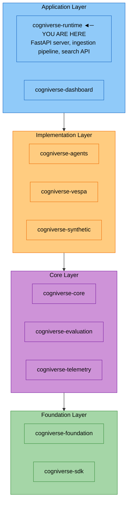

# Runtime Module

**Package:** `cogniverse_runtime`
**Location:** `libs/runtime/cogniverse_runtime/`

---

## Table of Contents

1. [Overview](#overview)
2. [Package Structure](#package-structure)
3. [FastAPI Server](#fastapi-server)
   - [Application Lifecycle](#application-lifecycle)
   - [Router Architecture](#router-architecture)
4. [Ingestion Pipeline](#ingestion-pipeline)
   - [VideoIngestionPipeline](#videoingestionpipeline)
   - [Processing Strategies](#processing-strategies)
   - [Processor Architecture](#processor-architecture)
5. [Search Service](#search-service)
6. [API Reference](#api-reference)
7. [Configuration](#configuration)
8. [Deployment](#deployment)
9. [Architecture Position](#architecture-position)
10. [Testing](#testing)
11. [Admin System](#admin-system)
12. [Embedding Generator Subsystem](#embedding-generator-subsystem)
13. [Sandbox (OpenShell)](#sandbox-openshell)
14. [Optimization CLI](#optimization-cli)
15. [Quality Monitor CLI](#quality-monitor-cli)

---

## Overview

The Runtime module provides the **Application Layer** for Cogniverse:

- **FastAPI Server**: Production-ready HTTP server with async support
- **Video Ingestion Pipeline**: Configurable pipeline for video processing (keyframes, chunks, transcription, embeddings)
- **Search API**: Multi-modal search with tenant isolation and session tracking
- **Strategy Pattern**: Pluggable processing strategies for different video analysis approaches
- **Processor Architecture**: Auto-discovery of processors with configuration from YAML

The runtime sits at the top of the package hierarchy, depending on all other modules.

---

## Package Structure

The runtime entry surfaces are `cogniverse_runtime/main.py`,
`cogniverse_runtime/runtime_cli.py` (the image's command),
`cogniverse_runtime/agent_dispatcher.py`,
`cogniverse_runtime/inference_services.py`,
`cogniverse_runtime/startup_wait.py`,
`cogniverse_runtime/provision_tenant.py`, and
`cogniverse_runtime/synthetic_config.py`.

```text
cogniverse_runtime/
├── main.py                          # FastAPI app + lifespan setup
├── backend_startup.py               # Backend probes and metadata bootstrap
├── runtime_cli.py                   # Backend wait, then uvicorn and its workers
├── cluster_events.py                # Admin events every worker process acts on, acknowledged
├── provision_tenant.py              # Tenant schemas, memory, telemetry, tier
├── config_loader.py                 # Dynamic backend/agent loading
├── agent_dispatcher.py              # Dispatch agent invocations + egress allow-list
├── harness_turn.py                  # Answer text, request seed, tool-call shape for a turn
├── harness_keys.py                  # Hashed harness credentials and revocations
├── llm_dependency.py                # HTTP answer for a request that failed on the chat LLM
├── job_executor.py                  # Background-job executor
├── a2a_executor.py                  # Agent-to-agent protocol executor
├── a2a_task_store.py                # Redis store of A2A tasks, leases and event relays
├── shared_state.py                  # The one Redis client + pool every state store uses
├── agent_registry_store.py          # Redis store of agent registrations
├── ingestion_jobs.py                # /ingestion/start job status, owner leases
├── memory_init.py                   # Mem0 client + per-tenant memory setup
├── messaging.py                     # In-pod InboundQueueRegistry primitive
├── messaging_redis.py               # Redis-backed cross-pod + durable variant
├── openshell_cert_rotator.py        # mTLS cert rotation for OpenShell sandbox
├── openshell_health.py              # OpenShell gateway health probing
├── optimization_cli.py              # DSPy optimizer entrypoint (compile/serve)
├── quality_monitor_cli.py           # Quality-monitor CLI entry
├── sandbox_http.py                  # Sandbox HTTP transport layer
├── sandbox_manager.py               # SandboxManager + policy enforcement
├── sandbox_pool.py                  # Capacity-bounded per-task sandbox leases
├── session_state.py                 # Conversation ledger + /v1 continuation store in Redis
├── task_events.py                   # Workflow + ingestion task events, cancellation, active index in Redis
├── inference_health_check.py        # Startup inference-service probes
├── inference_services.py            # Validated external inference endpoints
├── startup_wait.py                  # Dependency-readiness command + in-process startup wait
├── synthetic_config.py              # Synthetic-service runtime configuration
├── routers/                         # FastAPI routers (one per API surface)
│   ├── health.py                    # Health + readiness endpoints
│   ├── search.py                    # Search API
│   ├── ingestion.py                 # Ingestion + KG extraction endpoints
│   ├── agents.py                    # Agent orchestration + inbound messaging
│   ├── events.py                    # SSE streaming for real-time updates
│   ├── admin.py                     # Admin / tenant management
│   ├── ag_ui.py                     # AG-UI /ag-ui surface for web clients
│   ├── debug.py                     # Debug + diagnostic endpoints
│   ├── graph.py                     # Graph traversal API
│   ├── knowledge.py                 # Knowledge-graph query API
│   ├── openai_compat.py             # OpenAI-dialect /v1 surface for harness clients
│   ├── routing_decisions.py         # A tenant's routing decisions, their quality and review
│   ├── telemetry_metrics.py         # Per-tenant span metrics for the operations views
│   ├── optimization_framework.py    # Search annotations, golden datasets, synthetic results, datasets, profile recommender
│   ├── tenant.py                    # Per-tenant admin endpoints
│   └── wiki.py                      # Wiki API endpoints
├── admin/                           # Admin domain models + tenant tooling
│   ├── tenant_manager.py
│   ├── models.py
│   └── profile_models.py
├── ingestion/                       # In-process video-ingestion pipeline
│   ├── pipeline.py                  # VideoIngestionPipeline
│   ├── pipeline_builder.py
│   ├── processor_base.py            # BaseProcessor, BaseStrategy (abstract)
│   ├── processor_manager.py         # Auto-discovery of processors
│   ├── strategies.py                # Concrete strategy implementations
│   ├── strategy.py                  # Strategy base classes
│   ├── strategy_factory.py          # Profile-driven strategy construction
│   ├── processing_strategy_set.py
│   ├── exceptions.py
│   └── processors/                  # Per-processor implementations
│       ├── keyframe_processor.py
│       ├── chunk_processor.py
│       ├── audio_transcriber.py
│       ├── audio_processor.py
│       ├── audio_embedding_generator.py
│       ├── vlm_processor.py
│       ├── vlm_descriptor.py
│       ├── single_vector_processor.py
│       └── embedding_generator/     # Embedding subsystem
│           ├── embedding_generator.py
│           ├── embedding_generator_impl.py
│           ├── embedding_generator_factory.py
│           ├── backend_factory.py
│           └── token_pooling.py     # Post-hoc multi-vector token pooling
├── ingestion_worker/                # Async Redis-Streams ingestion worker
│   ├── worker.py                    # Worker entrypoint + queue consumer
│   ├── queue.py
│   ├── redis_client.py
│   ├── minio_client.py
│   ├── submit_api.py
│   ├── status_api.py
│   ├── backpressure.py
│   └── idempotency.py
```

LateOn (ColBERT) text embeddings are served by the PyLate sidecar
(`pylate` chart engine, canonical server in
`cogniverse_cli/modal_inference/servers/pylate.py`) because LateOn needs
PyLate's exact query expansion, which stock vLLM's `/pooling` cannot
reproduce (no attention-mask input). DenseOn dense embeddings stay on
stock vLLM (`vllm_embed` engine). See
`docs/operations/models-and-inference.md` for the serving details.

The face-embed sidecar runs as its own container: `FaceEmbedConfig` is plain
data, `build_app(cfg)` is the app factory, and `main()` is the deployed
entrypoint — the only place the container env (`FACE_EMBED_MODEL`,
`FACE_EMBED_MODEL_REVISION`, `FACE_EMBED_MODEL_ROOT`, `FACE_EMBED_CTX_ID`,
`FACE_EMBED_INTRA_OP_THREADS`, `FACE_EMBED_URL_TIMEOUT_S`, `HOST`, `PORT`) is
read.
`POST /embed` returns `n` and a `faces` list. Every face record contains a
four-coordinate `bbox`, an L2-normalized 512-value ArcFace `vec`, and
`det_score`, the RetinaFace detection confidence in `[0, 1]`.
`GET /health` loads the pinned model before returning
`{"status":"ready","model":"buffalo_l",`
`"model_revision":"80ffe37d8a5940d59a7384c201a2a38d4741f2f3c51eef46ebb28218a7b0ca2f"}`.
A load failure returns HTTP 503 with
`{"detail":"face_embed: model buffalo_l load failed (<ExceptionType>): <cause>"}`.
The canonical application is
`cogniverse_cli.modal_inference.servers.face`. Run it locally with
`uv run python -m cogniverse_cli.modal_inference.servers.face`;
build the image from the repo root with
`docker build -f deploy/face_embed/Dockerfile .`.

The CLI Modal-inference package also owns the production CLAP server at
`cogniverse_cli.modal_inference.servers.clap`.
`CLAP_EMBED_MODEL_REVISION` must identify the immutable Hugging Face revision;
`CLAP_EMBED_DEVICE` selects the device used for both model placement and request
tensors. The defaults pin `laion/clap-htsat-unfused` at revision
`8fa0f1c6d0433df6e97c127f64b2a1d6c0dcda8a` on `cpu`. Its `GET /health`
loads the pinned model and returns exactly
`{"status":"ready","model":"laion/clap-htsat-unfused",`
`"model_revision":"8fa0f1c6d0433df6e97c127f64b2a1d6c0dcda8a"}`. The Modal CLAP wrapper
passes the same service definition into the container environment, production
app, and authenticated `/v1/models` wrapper. A load failure returns HTTP 503
whose `detail` matches
`clap_embed: model laion/clap-htsat-unfused load failed (<ExceptionType>): <cause>`.
Run the sidecar locally with
`uv run python -m cogniverse_cli.modal_inference.servers.clap`.

Temporal video embeddings come from the video-embed sidecar at
`cogniverse_cli.modal_inference.servers.video_embed`. It serves one joint
video-text space: `POST /embed/video` takes `{"video_b64": "..."}` (a segment's
raw bytes), samples `VIDEO_EMBED_NUM_FRAMES` frames evenly across the clip and
encodes them with cross-frame attention, so the vector describes motion rather
than a single frame; `POST /embed/text` returns a directly comparable vector
for the same space, which is what makes text-to-video search possible. The
model is named only in configuration: `VIDEO_EMBED_MODEL` and
`VIDEO_EMBED_MODEL_REVISION` pin it, `VIDEO_EMBED_DIM` states the width every
response is checked against, and `VIDEO_EMBED_DEVICE` selects the device. The
defaults pin `microsoft/xclip-large-patch14` at revision
`a9dd1429a16cf305df2aaea232d5e8dceba1c675` on `cpu`, 8 frames, 768 dims. A
response of any other width returns HTTP 500 rather than reaching Vespa, whose
own rejection would name neither the model nor the endpoint. Run it locally
with `uv run python -m cogniverse_cli.modal_inference.servers.video_embed`.

For both sidecars, the Helm readiness probe calls the model-backed `/health`
route. Their liveness probe checks only the TCP serving socket, so a model load
failure removes the pod from service without creating a restart loop.

### Modal inference serving

The installed modules under `cogniverse_cli.modal_inference` expose each stateless
inference model as an independently scalable Modal App. `serving.py` wraps an
existing production FastAPI application without changing its request or
response schemas. Every route requires
`Authorization: Bearer <COGNIVERSE_INFERENCE_API_KEY>`; the wrapper removes the
credential before delegation and owns `/v1/models`, which reports exactly one
pinned model identifier and immutable revision. Owning that route keeps
discovery off a scale-to-zero GPU, so it also carries the service's
`context_window` as `max_model_len` — the only place a client can read the
window the container was launched with.

`vllm.py` builds the OpenAI-compatible vLLM services from the canonical service
definitions. It mounts a persistent `cogniverse-huggingface-cache` Volume,
starts one loopback vLLM process per cold container under concurrent requests,
and streams the production response unchanged. A process that exits or cannot
accept a request produces a contextual HTTP 503 response. A startup timeout
terminates the unreachable child before a retry, and a request failure retires
only the process generation that handled that request; concurrent retries then
single-flight one replacement. The public Modal function is named `Inference`,
starts at zero containers, and uses the service's ordered GPU candidates and
scaledown window.

When the teacher is routed to a Modal `externalUrl`, the runtime first resolves
the shared `COGNIVERSE_INFERENCE_API_KEY` bearer onto the teacher endpoint and
then retries the probe through that authenticated session up to the service
spec's pre-measurement `boot_deadline_seconds`; in-cluster teachers keep the
no-auth placeholder and the existing one-shot failure path.

Create the Modal Secret `cogniverse-inference-api-key` with the key
`COGNIVERSE_INFERENCE_API_KEY` before deployment. The gated Gemma service also
requires the `hf-token` Secret with the key `HF_TOKEN`. The public API key is
stripped from the loopback child process, while `HF_TOKEN` remains in that
process's environment so vLLM can access the gated model. Neither credential is
included in vLLM command arguments or returned in an error response.

Integration sessions resolve and warm stateless inference before the final E2E
run. An explicit endpoint is authoritative. Generic integration selection then
checks the `cogniverse-e2e` cluster, then the `cogniverse` development cluster,
and fails naming the service when neither serves it; nothing is started on the
test host, and the presence of Modal credentials never changes that order or
allocates a paid container. The chat services resolve from Modal only. Tests marked
`requires_modal_inference("<service>")` select Modal only for that named
service, and a Modal authentication, deployment, warm-up, health, or identity
failure ends setup. Non-Modal custom services validate their exact model
identifier and immutable revision through `/health`. vLLM services and every
Modal candidate validate identity through `/v1/models`; Modal warm-up also
probes `/health` for readiness. Teardown returns warmed Modal services to
scale-to-zero. Discovered k3d workloads are
borrowed and their replicas are never mutated by the fixture.

Before the shared E2E stack starts, the session fixture reaps dead owner-pid
containers and refuses to start while a container outside the cluster holds a
GPU device. It then reads `/sys/class/drm/card1/device/mem_info_gtt_used`
and aborts when more than 2 GiB remains pinned, naming the live test-owned
containers if any are still visible. That keeps the final E2E run from
starting while test-owned GPU residency is still present.

The API runtime and ingestion worker share the same strict
`INFERENCE_SERVICE_URLS` startup parser. The value must be a duplicate-free JSON
object whose keys are non-empty service names and whose values are root HTTP(S)
URLs without credentials, paths, queries, or fragments. Invalid configuration
raises before either process installs graph or ingestion dependencies; an
absent value clears stale in-memory endpoints.

Only the final E2E run scales the stateful application stack (Vespa, Phoenix,
Redis, MinIO, runtime, dashboard, and workers). The stack is intentionally left
available across focused E2E invocations so a multi-session run can reuse its
state. After the focused run has finished, shut it down explicitly:

```bash
k3d cluster stop cogniverse-e2e
# After a deployment-lifecycle run:
k3d cluster stop cogniverse-deploy-test
```

Use `k3d cluster delete` only when the next run must start from a new cluster;
test teardown does not delete either cluster automatically. If an existing E2E
cluster is unhealthy or its deployed-content fingerprint is stale, the fixture
also leaves it untouched and fails with a diagnostic. Inspect it first, then set
`E2E_FRESH=1` on the next focused run to authorize replacement.

`SearchResult` and `SearchBackend` are imported from `cogniverse_sdk.document` / `cogniverse_sdk.interfaces.backend` — the runtime has no local search ABC any more (the dead duplicates were removed).

### Worker startup through a config-store outage

The worker's first config read (`_wait_for_startup_config`, before it touches
Redis) runs through `startup_wait.wait_for_startup_dependency`, the helper the
quality monitor's `_wait_for_telemetry_manager` also uses. Transport errors and
`ConfigStoreUnavailableError` are retried every 2s: a WARNING per failed attempt
inside the `INGEST_STARTUP_GRACE_SECONDS` window (default 300), one ERROR at
the boundary, then a WARNING per retry until the store answers. A SIGTERM
during the wait raises `DependencyWaitAborted` on the next retry and the worker
exits cleanly. The store's own read budget (five 30s visits) bounds each
attempt, so a paused Vespa costs ~154s per attempt, never a restart.

### Queued ingestion transaction

The ingestion worker treats content feed and knowledge-graph extraction as one
durable transaction. Immediately after content is fed, and before entering the
graph boundary, it writes `ingest:graph-pending:<message_id>` in Redis. A graph
exception, partial write, cancellation, or
`INGEST_GRAPH_DEADLINE_SECONDS` timeout publishes a nonterminal `retrying`
event while retaining the in-flight marker, tenant concurrency slot, and Redis
Streams pending entry, and records the failure time and cause in
`ingest:graph-redrive:<message_id>`. The reaper never dead-letters a marked
entry, whatever its delivery count; it re-drives once the hold since the last
recorded failure has elapsed — `INGEST_REAPER_MIN_IDLE_MS` doubled per re-drive
so far, clamped at `reaper.GRAPH_REDRIVE_HOLD_CAP_MS` (6h) — and each re-drive
logs its number, the last cause and the next hold. Stable content
and graph document ids make the replay idempotent. Only a run that completes
the graph stage clears the graph marker, marks the ingest done, releases the
tenant slot, and acknowledges the queue entry.

---

## FastAPI Server

### Application Lifecycle

The server uses FastAPI's lifespan context manager for startup/shutdown:

```python
from cogniverse_runtime.main import app
import uvicorn

# Run the server
uvicorn.run(app, host="0.0.0.0", port=8000)
```

**Startup Sequence:**

1. Before uvicorn starts, `python -m cogniverse_runtime.runtime_cli` polls the Vespa data plane and config server through `startup_wait.wait_for_startup_dependency`. `BACKEND_STARTUP_WAIT_BUDGET_S` is a logging grace (64 minutes by default, overridable with `RUNTIME_STARTUP_GRACE_SECONDS`): expiry logs one ERROR and the process keeps retrying. SIGTERM sets the helper's abort flag and exits with code 0 and a named abort log. Each attempt probes with `BACKEND_STARTUP_PROBE_TIMEOUT_S`; failed attempts sleep for `BACKEND_STARTUP_RETRY_INTERVAL_S`. A fresh backend receives metadata schemas and then waits for its feed endpoint. The chart's startupProbe owns restart timing and exceeds the grace plus probe and fresh-install allowances. Uvicorn starts once the feed endpoint is ready, so the wait and any metadata bootstrap run once per pod; the lifespan then initializes the application in every worker (see [Deployment](#deployment)).
2. Load configuration via `ConfigManager`
3. Initialize `SchemaLoader` for Vespa schemas; wire `admin`/`tenant` routers and `ingestion`/`search`/`knowledge` FastAPI dependency overrides
4. Initialize `BackendRegistry` (singleton via `get_instance()`) and `AgentRegistry`
5. Initialize `SandboxManager` with a policy resolved from env/config; wire it and the agent registry to the `agents` router
6. Load backends and agents from config via `ConfigLoader` (agents are validated and registered as endpoints, not instantiated)
7. Apply deployment env-var overrides to `SystemConfig`; validate the A2A settings and connect to Redis at the resolved `SystemConfig.redis_url`, so a pod that cannot use Redis fails before any deploy, probe or background loop; open the process's one shared-state client and connection pool on that Redis (`connect_shared_state_redis`, `SHARED_STATE_REDIS_MAX_CONNECTIONS` = 128, its connections named `cogniverse-runtime-state:<host>:<pid>:<suffix>` in `CLIENT LIST`) and give it to every store of shared and session state: the agent registry (`RedisAgentRegistryStore`), the `agents` router (`AnnotationQueue`, the `ConversationLedger`), the `ingestion` router (`IngestionJobStore`), `/v1` (`ContinuationStore`) and the task event store (`TaskEventStore`, whose poller starts here) the `events`, `agents` and `ingestion` routers report workflows and jobs to; each store still raises its own typed error and its routes their own 503; shutdown closes the client once, after every store is released; deploy metadata schemas via a system backend unless every live metadata schema already equals this build's, where a deploy that finds the deployment lease held is retried in the background every 30 s instead of failing startup; then store the overridden `SystemConfig` through `write_startup_config`. That write reads the key's latest version by visiting its stored versions, so it never depends on search coverage, and waits out a config store that does not answer (`ConfigStoreUnavailableError`, after the read's own attempts, or a transport error on the write) for `STARTUP_CONFIG_WRITE_BUDGET_S` (60 s), retrying every `STARTUP_CONFIG_WRITE_RETRY_INTERVAL_S` with a WARNING per attempt; a store still unavailable after it fails the worker's startup with a `RuntimeError` naming the write and the last failure
8. Probe Phoenix reachability and validate inference services against configured profiles
9. Wire tenant manager and the wiki/graph manager factories; affirm the system's wiki and memory backend profiles through the same `write_startup_config` wait, where a failure after it is logged as a WARNING rather than failing startup
10. Configure DSPy LM and the synthetic data service; then import, on a worker thread, the modules a worker's first LM call would otherwise import mid-request (`preload_lm_client_modules`: LiteLLM, which DSPy loads lazily, and the OpenAI client's resource modules). They build hundreds of pydantic models, about 1.5 s per worker; done during a request, the serving loop waited for the interpreter at every socket read and write, and liveness and every other request on the worker stalled with it. The same step imports the telemetry provider's span-export stack (`TelemetryManager.preload_span_export`: Phoenix's OTel registration and the gRPC exporter), which a tenant's first span otherwise imported on the loop, holding it for about 0.3 s
11. Start the `GatewayHealthProbe` and the OpenShell mTLS cert rotator (when sandboxing is enabled)
12. Subscribe this worker to the cluster-events channel on the same Redis (`cogniverse_runtime.cluster_events.ClusterEvents`, worker id `host:pid:suffix`): tenant deletes, tier sets, profile changes and session closes are published there, every worker process and replica runs its handler for the event and acknowledges it, and the publisher waits for every acknowledgement. Startup fails when the channel cannot be subscribed. Build the shared Redis A2A task store (`cogniverse_runtime/a2a_task_store.py`) on that Redis, then mount the JSON-RPC server at `/a2a` with an `AgentCard` built from the loaded agents. Startup fails rather than falling back to process-local task storage, and refuses a Redis older than 7.4, which lacks the hash-field expiry (`HPEXPIRE`) the store's lease bookkeeping needs, as well as a read-only replica or a Redis user not permitted `HPEXPIRE`. The store retains at most `A2A_MAX_TASKS` (default 10000), evicts the least-recently-used inactive task that no live lease holds, and refuses admission when every retained task is active or leased. Per-task renewable leases serialize continuations before their snapshot read, and a generation drawn from one monotonic sequence is the fencing token: a write is rejected once a newer owner has taken a later generation or the task was evicted or deleted, so the last write of a finished execution still lands after its lease is released; a save never replaces a stored terminal state with a different one. Cancelling an executing task is delivered to the owning replica and acknowledged through Redis; an idle non-terminal task — every turn paused in `input_required` — has no owner and is cancelled locally, as the stock handler does. Owner liveness on the cancel path is judged against Redis' own clock (`has_live_owner`), never the replica's wall clock, so a pod whose clock runs ahead cannot declare a live owner expired. A lease record whose interruption the store declines is not an interruption: the task is treated as the idle task it is and cancelled locally rather than routed to a replica that will never acknowledge. A cancel that loses the ownership race answers with the same retryable conflict `message/send` reports, not a generic internal error; so does any other cancel that could not run — a store outage, a routed cancel the owner does not acknowledge or refuses, or one a shutdown cuts short. Active resubscriptions consume the owner's bounded Redis event relay. Only the generation that owns the task publishes to, marks gaps on or closes that relay, each checked in the script that writes it, so a replica that lost the task keeps its events on its local queue and the new owner's resubscribers keep reading; a superseded close still gives the relay its drain window once no live lease remains, and a publish keeps an expiring relay only for a live owner of an unfinished task. A send on a task that has ended is refused without taking a generation. While a cancel takes its generation the relay holds at most 1000 producer events, and a producer emitting more waits for the cancel to commit or abort. If releasing held events after an aborted cancel fails to publish, the rest reach local consumers only and the relay records how many were missed, so a resubscription reading past the gap fails instead of skipping them. Evicting or deleting a task drops its lease, generation and event relay with it. Every Redis command, connect and wait for one of at most `A2A_REDIS_MAX_CONNECTIONS` pooled connections is bounded by `A2A_REDIS_TIMEOUT_SECONDS`, with TCP keepalive and a health check on idle connections; blocking reads wait at most one second at a time, so a Redis that stops answering fails the call as a store outage instead of hanging it. A replica serves at most `A2A_MAX_CONCURRENT_RESUBSCRIPTIONS` resubscriptions at once and refuses more with a retryable conflict; startup refuses a pool smaller than that cap plus two and a Redis timeout of one second or less. A lease renewal Redis cannot complete is retried until the lease would expire; the execution is cancelled only then, or when another owner took the task, and its local consumers get a final `failed` event, so a blocking `message/send` ends instead of waiting on its client; saving that event is fenced like any write, so a replica that lost the task records nothing and the send answers with the error. Shutdown gives served executions and running cancels `A2A_DRAIN_TIMEOUT_SECONDS` to finish, cancels what outlives it and gives that at most as long again to stop, so it ends within twice the budget, and then closes the Redis client it owns; an execution cancelled at its deadline is saved `failed` (interrupted) through the fenced save while this replica still owns it, unless it had already emitted its final event, and its lease is released, so `tasks/get` reads it terminal right after shutdown and a blocking send on it answers with that task; a task another owner took meanwhile is left to it. `tasks/get` reads a task and its owner's liveness in one round trip; one still recorded executing under an expired lease, as after a crash, records the same interruption a peer's `message/send` or `tasks/cancel` does, atomically and once however many readers race; a task whose owner holds or renews its lease is never touched. The chart derives the runtime's `terminationGracePeriodSeconds` from `runtime.shutdown`: uvicorn's graceful shutdown (`uvicornGracefulSeconds`, rendered as `UVICORN_TIMEOUT_GRACEFUL_SHUTDOWN`, 15 s), the 40 s conversation-save drain, twice `a2aDrainSeconds` (rendered as `A2A_DRAIN_TIMEOUT_SECONDS`, 30 s), the 30 s background memory-write drain and `teardownSeconds` (15 s): 160 s by default. Setting either variable through `runtime.env` fails the render.
13. Build every included router's routes (`build_included_routes`), which fastapi otherwise builds on the first request that matches
14. Collect and freeze the heap startup built (`freeze_startup_heap`: `gc.collect()` then `gc.freeze()`). A worker holds about half a million long-lived objects; a full collection that scanned them held the interpreter for 0.3 to 0.5 s, stalling the serving loop whichever thread's allocation triggered it. Later full collections scan only objects made after startup
15. Once startup completes, a background task redeploys every tenant schema whose registered definition differs from the one `configs/schemas/` ships (`SchemaRegistry.redeploy_drifted_schemas`, see [Schema drift migration](core.md#schema-drift-migration)): one package per drifted tenant, under the deployment lease from the decision through the registration, so runtimes starting together redeploy each tenant once. A run that does not complete — the deployment lease held by a peer for the whole wait, the config server or config store unreachable, a peer's registration racing a redeploy — is logged at WARNING and run again every `SCHEMA_MIGRATION_RETRY_SECONDS` (30 s) until one does; it never fails startup. A change Vespa refuses without a validation override (a field type or indexing change that needs a refeed) is never applied: the schema keeps its live and registered definition and its documents, is logged at ERROR by tenant and schema with Vespa's reason, and is listed with that reason by `GET /admin/schemas/drift`. A tenant marked deleted whose delete has not completed is not redeployed; its drifted schemas are logged and left as they are. A run that completes removes every recorded refusal whose schema has since migrated or been deleted. Shutdown stops it before its next run or tenant and before the drains; a tenant redeploy already running finishes. A pod still running the previous release redeploys its own shipped definition when a request first ensures a schema, so each new pod's startup runs the migration again; a run that finds nothing drifted deploys nothing.

Synthetic startup requires non-empty top-level `backend`, `synthetic`, and
`agents` objects from the active tenant configuration. A single strict parser
hydrates `BackendConfig` and `SyntheticGeneratorConfig`, injects the requested
tenant, selects only agents explicitly marked `enabled: true`, and validates
every profile modality against an enabled, loaded agent with the declared
modality and capability. Missing sections, unknown keys, obsolete object shapes,
unloaded agents, and incomplete mappings fail before any backend lookup. The
parser retains validated `backend.default_profiles` selections and requires each
selection to reference a declared profile. Selection and agent objects accept
only their documented canonical keys, so misspellings cannot be hidden in an
extras object. Profile objects require `type` and `schema_name` and type-check
every canonical key they declare; any further key passes through to
`BackendProfileConfig.extra_config`, which is how runtime-registered profiles
such as `agent_memories` carry the `encoder` and `strategy` values the Vespa
search backend reads back by name. The validated enabled-agent object is passed
unchanged to `SyntheticDataService`; there is no embedded mapping, empty-object
default, or configuration fallback. `SyntheticGeneratorConfig` also carries the
shared `synthetic_generation_timeout_seconds` budget that synthetic generator
callbacks use instead of the normal per-agent request timeout.
Routing and entity-extraction example labels use the registered production
`entity_extraction_agent`: the runtime adapter calls `AgentDispatcher.dispatch`
with the source text and request tenant, preserving the dispatcher result for
the synthetic generator. A dispatch error includes the tenant and exact source
text and stops generation.

```text
# From main.py (simplified)
@asynccontextmanager
async def lifespan(app: FastAPI) -> AsyncIterator[None]:
    """Lifecycle manager for FastAPI app."""

    # 2. Load configuration
    config_manager = create_default_config_manager()
    config = get_config(tenant_id=SYSTEM_TENANT_ID, config_manager=config_manager)

    # 3. Initialize SchemaLoader
    schema_loader = FilesystemSchemaLoader(Path("configs/schemas"))

    # 3b. Set dependencies on routers
    admin.set_config_manager(config_manager)
    admin.set_schema_loader(schema_loader)
    tenant.set_config_manager(config_manager)
    app.dependency_overrides[ingestion.get_config_manager_dependency] = lambda: config_manager
    app.dependency_overrides[search.get_config_manager_dependency] = lambda: config_manager

    # 4. Initialize registries
    backend_registry = BackendRegistry.get_instance()
    agent_registry = AgentRegistry(tenant_id=SYSTEM_TENANT_ID, config_manager=config_manager)

    # 5. Initialize SandboxManager and wire agent registry + dependencies
    sandbox_manager = SandboxManager(policy=sandbox_policy)
    agents.set_agent_registry(agent_registry)
    agents.set_agent_dependencies(config_manager, schema_loader)
    agents.set_sandbox_manager(sandbox_manager)

    # 6. Load from config — agents are validated and registered as endpoints
    config_loader = get_config_loader()
    config_loader.load_backends()
    config_loader.load_agents(agent_registry=agent_registry)

    # Validate every synthetic dependency before touching the backend registry
    synthetic_config = parse_synthetic_runtime_config(
        config,
        tenant_id=SYSTEM_TENANT_ID,
        loaded_agent_names=set(agent_registry.list_agents()),
    )
    synthetic_backend = backend_registry.get_search_backend(
        name=synthetic_config.backend_config.backend_type,
        config_manager=config_manager,
        schema_loader=schema_loader,
    )
    configure_synthetic(
        backend=synthetic_backend,
        backend_config=synthetic_config.backend_config,
        generator_config=synthetic_config.generator_config,
        agents_config=synthetic_config.agents_config,
        entity_extractor=_dispatcher_entity_extractor(agents.get_dispatcher()),
    )

    # 12. The shared A2A protocol on the Redis validated in step 7
    a2a_protocol = await _build_shared_a2a_protocol(
        agent_registry=agent_registry,
        dispatcher=agents.get_dispatcher(),
        redis_url=redis_url,
        replica_id=replica_id,
        **_a2a_settings_from_env(os.environ),
    )
    app.mount("/a2a", a2a_protocol.app)

    yield

    await a2a_protocol.close()
```

### Router Architecture

The server uses modular routers for different functionality:

| Router | Prefix | Purpose |
|--------|--------|---------|
| `health` | `/health` | Health checks, readiness probes |
| `search` | `/search` | Multi-modal search API |
| `ingestion` | `/ingestion` | Video upload and processing |
| `agents` | `/agents` | Agent registry and in-process execution |
| `admin` | `/admin` | Tenant and profile management |
| `knowledge` | `/admin` | Direct HTTP routes to knowledge-system agents (audit, citations, KG, federation, synthesis, temporal) |
| `tenant_manager` | `/admin` | Tenant creation, deletion, and router-tier administration |
| `events` | `/events` | Workflow and ingestion progress (SSE), cancellation and the active-task listing, from the shared task event store |
| `synthetic` | `/synthetic` | Synthetic data generation (from `cogniverse_synthetic`) |
| `wiki` | `/wiki` | Per-tenant wiki knowledge page storage and search |
| `graph` | `/graph` | Knowledge graph upsert, search, neighbors, and path queries |
| `tenant` | `/admin/tenant` | Per-tenant self-service: instructions, memories, scheduled jobs, optimization |
| `approvals` | `/admin/tenant` | Human review of a tenant's synthetic examples |
| `training_examples` | `/admin/tenant` | Operator-written training examples approved into a tenant's training dataset |
| `optimization_report` | `/admin/tenant` | A tenant's optimization report streamed from `detailed_report_agent` |
| `orchestration_annotations` | `/admin/tenant` | Human review of a tenant's orchestration workflows |
| `telemetry_metrics` | `/admin/tenant` | Trace analytics, profile-selection and RLM A/B metrics over a tenant's spans, and its searches scored against its golden set |
| `optimization_framework` | `/admin/tenant` | Search-quality annotation, golden datasets, synthetic run results, training datasets, the XGBoost profile recommender and optimization metrics |
| `routing_decisions` | `/admin/tenant` | A tenant's routing decisions with their outcomes, labels and per-agent quality; approving and correcting their labels |
| `debug` | `/admin/debug` | Runtime diagnostics (gated behind `COGNIVERSE_DEBUG_MEM`) |

### Tenant administration

`tenant_manager` owns the tenant registry (`tenant_metadata` documents) and the
tenant's semantic-router tier.

| Route | Effect |
|---|---|
| `POST /admin/tenants` | Create a tenant, auto-creating its organization and deploying its base schemas: the `base_schemas` named, else `TENANT_BASE_SCHEMAS` |
| `GET /admin/base-schemas` | `{schemas, default}`: the shipped schemas a tenant can be given (every shipped schema but the deployment-wide metadata ones) and `TENANT_BASE_SCHEMAS`; 503 `base_schemas_unavailable` when the backend does not answer |
| `GET /admin/tenants/{tenant_id}` | Tenant registry row |
| `DELETE /admin/tenants/{tenant_id}` | Delete the tenant, its schemas and its data |
| `GET /admin/tenants/{tenant_id}/tier` | The tenant's semantic-router tier |
| `PUT /admin/tenants/{tenant_id}/tier` | Set it |
| `GET /admin/router-tiers` | The tiers a tenant can be set to, and the default |

**Router tier.** The tier rides on the semantic router's group header and
selects which routing decisions a tenant's LLM calls can match. It is a
per-tenant attribute stored in the configuration store under
`ConfigScope.ROUTING` / service `semantic_router` / key `tenant_tier`, keyed by
canonical tenant id. A tenant with no stored tier is `default`; nothing has to
be written for a tenant to be routable.

The vocabulary is `ROUTER_TIERS`
(`cogniverse_foundation.config.unified_config`), currently `default`, `free`
and `pro`, and each value names a Group the router's chart binds. `PUT`
refuses anything outside it with 422 and the valid set in the message; an
unknown tenant is 404; a registry or store outage is 503. After storing the
tier, `PUT` publishes a `tenant_tier_set` cluster event and answers once every
worker process and replica has dropped the tier it held for the tenant
(`release_tenant_tier`), so the tenant's next request on any of them is routed
on the stored tier. A worker that does not confirm within
`TENANT_TIER_ACK_TIMEOUT_S` (15 s), or a Redis that cannot carry the event,
answers 503 naming the stored tier; the tier stays stored and the set can be
retried.

Requests read the tier through `resolve_tenant_tier`, whose per-manager reader
holds it per canonical tenant in a `RefreshingCache`. A held tier answers with
no store read for `TENANT_TIER_REFRESH_S` (15 s); until
`TENANT_TIER_MAX_STALENESS_S` (30 s) it still answers while one background
thread (`router-tier-refresh`) re-reads it, so a request never waits on that
read. Only a tenant with nothing held, or a tier 30 s old, is read on the
request thread. A tier written to the store other than through `PUT` (the
provisioning script's tier step) drops the tenant only in the writing
process, so 30 s bounds how long a runtime worker keeps serving the tier it
read before that write, and a tenant served continuously sees it after about
15 s plus one read. A failed background read is logged at ERROR and the held
tier answers until 30 s. A store failure on the request thread routes the
tenant as `default` and logs a WARNING naming the tenant and the error: a
routing downgrade serves the request where raising would fail it.


```text
# Router registration in main.py
app.include_router(health.router, tags=["health"])
app.include_router(agents.router, prefix="/agents", tags=["agents"])
app.include_router(search.router, prefix="/search", tags=["search"])
app.include_router(ingestion.router, prefix="/ingestion", tags=["ingestion"])
app.include_router(admin.router, prefix="/admin", tags=["admin"])
app.include_router(knowledge.router, prefix="/admin", tags=["knowledge-agents"])
app.include_router(tenant_manager.router, prefix="/admin", tags=["tenant-management"])
app.include_router(events.router, prefix="/events", tags=["events"])
app.include_router(synthetic_router, tags=["synthetic-data"])
app.include_router(wiki.router, prefix="/wiki", tags=["wiki"])
app.include_router(graph.router, prefix="/graph", tags=["graph"])
app.include_router(tenant.router, prefix="/admin/tenant", tags=["tenant-extensibility"])
app.include_router(openai_compat.router, prefix="/v1", tags=["openai-compat"])
app.include_router(ag_ui.router, prefix="/ag-ui", tags=["ag-ui"])
app.include_router(debug.router, prefix="/admin/debug", tags=["debug"])
```

---

## Ingestion Pipeline

### VideoIngestionPipeline

The central class for video processing:

```text
from cogniverse_runtime.ingestion.pipeline import VideoIngestionPipeline, PipelineConfig
from cogniverse_foundation.config.utils import create_default_config_manager

# Initialize pipeline
config_manager = create_default_config_manager()
pipeline = VideoIngestionPipeline(
    tenant_id="acme",                       # Required - no default
    config=None,                            # Optional PipelineConfig
    app_config=None,                        # Optional application config dict
    config_manager=config_manager,          # Required if config/app_config not provided
    schema_loader=schema_loader,            # Optional for backend operations
    schema_name="video_colpali_mv_frame",   # Processing profile
    debug_mode=True,                        # Enable detailed logging
    event_queue=None,                       # Optional EventQueue for real-time notifications
)

# Process single video
result = await pipeline.process_video_async(Path("video.mp4"))

# Process directory with concurrency
results = pipeline.process_directory(
    video_dir=Path("videos/"),
    max_concurrent=3
)
```

**Key Features:**

- **Profile-based configuration**: Each `schema_name` maps to a processing profile

- **Concurrent processing**: Process multiple videos in parallel

- **Caching**: Optional caching of intermediate results (keyframes, transcripts)

- **Strategy-driven**: Processing steps determined by strategy configuration

**PipelineConfig:**

```python
from dataclasses import dataclass

@dataclass
class PipelineConfig:
    """Configuration for the video processing pipeline."""

    extract_keyframes: bool = True
    transcribe_audio: bool = True
    generate_descriptions: bool = True
    generate_embeddings: bool = True

    # Processing parameters
    keyframe_threshold: float = 0.999
    max_frames_per_video: int = 3000
    vlm_batch_size: int = 500

    # Backend selection
    search_backend: str = "byaldi"  # "byaldi" or "vespa"
```

### Processing Strategies

Strategies define how videos are processed. Each strategy specifies required processors:

**FrameSegmentationStrategy** - Extract individual frames (for ColPali):
```python
from cogniverse_runtime.ingestion.strategies import FrameSegmentationStrategy

strategy = FrameSegmentationStrategy(
    fps=0.5,               # Extract 1 frame every 2 seconds (default)
    threshold=0.999,       # Similarity threshold for deduplication
    max_frames=3000        # Maximum frames per video
)

# Required processors
strategy.get_required_processors()
# -> {"keyframe": {"fps": 0.5, "threshold": 0.999, "max_frames": 3000}}
```

**ChunkSegmentationStrategy** - Extract video chunks (for ColQwen, X-CLIP):
```python
from cogniverse_runtime.ingestion.strategies import ChunkSegmentationStrategy

strategy = ChunkSegmentationStrategy(
    chunk_duration=30.0,   # 30-second chunks
    chunk_overlap=0.0,     # No overlap
    cache_chunks=True      # Cache extracted chunks
)
```

**SingleVectorSegmentationStrategy** - Single-vector embeddings (for X-CLIP):
```python
from cogniverse_runtime.ingestion.strategies import SingleVectorSegmentationStrategy

strategy = SingleVectorSegmentationStrategy(
    strategy="sliding_window",
    segment_duration=6.0,
    segment_overlap=1.0,
    sampling_fps=2.0,
    max_frames_per_segment=12
)
```

**Embedding Strategies:**
```python
from cogniverse_runtime.ingestion.strategies import (
    MultiVectorEmbeddingStrategy,
    SingleVectorEmbeddingStrategy,
)

# Multi-vector (ColPali, ColQwen)
mv_strategy = MultiVectorEmbeddingStrategy(model_name="TomoroAI/tomoro-colqwen3-embed-4b")

# Single-vector (X-CLIP)
sv_strategy = SingleVectorEmbeddingStrategy(model_name="microsoft/xclip-large-patch14")
```

### Processor Architecture

Processors are pluggable components that perform specific tasks:

**BaseProcessor:**
```python
from cogniverse_runtime.ingestion.processor_base import BaseProcessor
from typing import Any
import logging

class CustomProcessor(BaseProcessor):
    """Custom processor implementation."""

    PROCESSOR_NAME = "custom"  # Required identifier

    def __init__(self, logger: logging.Logger, param1: str = "default"):
        super().__init__(logger, param1=param1)
        self.param1 = param1

    def process(self, *args, **kwargs) -> Any:
        """Process input data."""
        # Implementation here
        pass
```

**ProcessorManager:**

Manages processor lifecycle and auto-discovery:

```text
from cogniverse_runtime.ingestion.processor_manager import ProcessorManager

# Initialize
manager = ProcessorManager(logger)

# Initialize from strategy set. service_urls is the {service_name: url}
# map of deployed inference services (from SystemConfig.inference_service_urls);
# pass {} when no remote services are deployed.
manager.initialize_from_strategies(strategy_set, service_urls={})

# Get processor by name
keyframe_processor = manager.get_processor("keyframe")

# List available processors
manager.list_processors()
```

**Available Processors:**

| Processor | Name | Purpose |
|-----------|------|---------|
| `KeyframeProcessor` | `keyframe` | Extract frames using similarity |
| `ChunkProcessor` | `chunk` | Extract video chunks |
| `AudioProcessor` | `audio` | Audio processing utilities |
| `VLMProcessor` | `vlm` | Generate frame descriptions via an OpenAI-compatible `/v1` VLM endpoint |
| `SingleVectorProcessor` | `single_vector` | Process for single-vector embeddings |

`AudioProcessor` and `VLMProcessor` are thin `BaseProcessor` wrappers that delegate to internal helper classes: `AudioTranscriber` (Whisper transcription), `AudioEmbeddingGenerator` (CLAP acoustic/semantic embeddings), and `VLMDescriptor` (OpenAI-compatible `/v1` VLM endpoint client). These helpers are not `BaseProcessor` subclasses themselves and are not addressable by name through `ProcessorManager`.

---

## Search Service

The search service provides multi-modal search with tenant isolation:

```python
from cogniverse_agents.search.service import SearchService
from cogniverse_foundation.config.utils import get_config, create_default_config_manager
from cogniverse_core.schemas.filesystem_loader import FilesystemSchemaLoader
from pathlib import Path

config_manager = create_default_config_manager()
schema_loader = FilesystemSchemaLoader(Path("configs/schemas"))
config = get_config(tenant_id="acme", config_manager=config_manager)

# Create service - config_manager and schema_loader are REQUIRED
search_service = SearchService(
    config=config,
    config_manager=config_manager,
    schema_loader=schema_loader,
)

# Execute search — profile and tenant_id are per-request
results = search_service.search(
    query="find videos about machine learning",
    profile="video_colpali_mv_frame",
    tenant_id="acme",
    top_k=10,
    ranking_strategy="hybrid",
    result_granularity="source",
    filters={"modality": "video"}
)

# Note: The API endpoint uses "strategy" field in SearchRequest,
# but SearchService.search() method uses "ranking_strategy" parameter
```

`result_granularity` controls how hits are returned per profile. `source`
returns one `SearchResult` per source content item, using the best-ranked
document for that source, for the best `top_k` sources by their best segment's
score. Each source result includes `matched_segments` with that source's best
segments (the profile's `source_collapse_oversample`, default 4, at most 64) in
relevance order and `segments_in_window` with the source's number of matched
segments. A `source` search that would need more than 10000 grouping rows
(`top_k * (1 + source_collapse_oversample)`) is refused with 400.
The response also carries `source_search_incomplete`: `true` when a `source`
search returned fewer than `top_k` sources because its nearest-neighbor
candidate budget was full, so more matching sources may exist; `false`
otherwise.
`segment` returns every matching document and omits those fields. Video
profiles default to `source`; non-video profiles default to `segment` unless
their profile config says otherwise. A tenant's stored profile (for example
one created through `POST /admin/profiles`) is merged over the shipped profile
of the same name, so a key it does not set, such as `result_granularity`,
keeps the shipped value; a failed read of the tenant's stored profile raises.

**Search Strategies:**

| Strategy | Description |
|----------|-------------|
| `semantic` | Pure vector similarity search |
| `bm25` | BM25 keyword-based search |
| `hybrid` | Combines semantic and BM25 |
| `learned` | ML-based reranking |
| `multi_modal` | Multi-modal reranking (text, video, audio) |

---

## API Reference

### Failure Bodies

A failed request never carries an exception's text, which can name backend
URLs, credentials or file paths. Server-side failures (5xx) across the
runtime routers answer with a `detail` built by `cogniverse_runtime/http_errors.py`:
`{error, message, failure, ...fields}` — a stable `error` code, a `message`
built from values the route owns (tenant, profile, job and workflow names),
`failure` (the exception's type name) and route-specific fields such as
`tenant_id`, `profile_name` or `store`. `record_failure` writes the cause,
with its traceback, to the runtime log and records it on the active span.
An upstream that answered with an error status (Argo) is reported by
`upstream_rejection` as `{error, message, upstream_status, ...fields}`; its
response body goes to the log only. Health probes report `reason` without the
backend URL, plus `failure` when an exception caused it.

Codes by router: search `search_failed`, `search_degraded`,
`invalid_search_request`, `invalid_tenant_id`, `query_encoder_not_configured`,
`query_encoder_unavailable`, `rerank_failed`; agents `search_degraded`,
`inference_service_unavailable`, `no_execution_path`,
`agent_registry_unavailable`, `annotation_queue_unavailable`,
`session_state_unavailable`; admin
`stats_unavailable`, `profile_create_failed`, `profile_list_failed`,
`profile_read_failed`, `profile_update_failed`, `profile_delete_failed`,
`schema_deploy_failed`, `registration_unavailable`, `resolve_unavailable`,
`memory_unavailable`, `store_unavailable`, `harness_key_store_unavailable`,
`schema_drift_unavailable`, `tenant_deleted` (410), `session_close_incomplete`;
tenant management `organization_create_failed`, `organization_list_failed`,
`organization_delete_failed`, `tenant_create_failed`, `tenant_list_failed`,
`tenant_delete_failed`, `tenant_delete_marker_unavailable`,
`tenant_delete_incomplete`, `tenant_operation_in_progress`,
`tenant_operation_unavailable`, `reconcile_unavailable`; ingestion
`ingestion_start_failed`, `upload_profile_unavailable`,
`upload_profile_unusable`, `object_store_unconfigured`,
`object_store_unavailable`, `ingest_queue_unavailable`,
`ingest_status_unknown`, `ingest_status_store_unavailable`,
`ingestion_job_store_unavailable`; tenant jobs and
optimization `argo_unavailable`, `argo_rejected`, `argo_no_workflow_name`;
wiki `wiki_delete_failed`; synthetic `profile_selection_timeout`.

### Search Endpoints

**POST /search/** - Execute search query
```bash
curl -X POST http://localhost:8000/search/ \
  -H "Content-Type: application/json" \
  -d '{
    "query": "machine learning tutorial",
    "profile": "video_colpali_mv_frame",
    "strategy": "hybrid",
    "result_granularity": "source",
    "top_k": 10,
    "tenant_id": "acme",
    "session_id": "user-session-123"
  }'
```

The same `result_granularity` rules apply here: `source` returns the best
`top_k` sources, each collapsed to its best-ranked document with
`matched_segments` (its best `source_collapse_oversample` segments, default 4,
at most 64)
and `segments_in_window` (its number of matched segments); the response, and
the streamed `final` event's `data`, carry `source_search_incomplete`.
`segment` keeps every hit and omits those fields. Video profiles default to
`source`; other profiles keep `segment` unless their config opts into a
different default.

The profile's query encoder is built only when the resolved strategy needs
query embeddings, so a text-only strategy (`bm25_only`) answers whether or not
the profile's encoder service is configured or reachable. An encoder failure
answers with a `detail` built from typed fields, never the exception text
(which names the sidecar URL):

- configuration gap (`EncoderNotConfiguredError`: no model, or an inference
  service with no configured URL) — 500, `{error: "query_encoder_not_configured",
  dependency: "query_encoder", profile, strategy, message}`;
- unavailable encoder service (`EncoderUnavailableError`) — 503 with
  `Retry-After: 15` (the inference endpoint breaker's reset window),
  `{error: "query_encoder_unavailable", dependency: "query_encoder", profile,
  strategy, service, failure, retry_after_s, message}`, where `failure` names
  the underlying error type.

Any other failure is typed the same way (see Failure Bodies): Vespa's
degraded coverage is a 503 `search_degraded`, request input the profile or
schema cannot serve (an unknown profile or strategy) a 400
`invalid_search_request`, a missing tenant a 400 `invalid_tenant_id`, and
anything else a 500 `search_failed`; each carries `profile` and `strategy`.
A streamed search reports any failure as its `error` event, with the message
under `error`, the exception type under `error_type` and the body under
`detail`.

**GET /search/strategies** - List the ranking strategies a profile accepts
```bash
curl "http://localhost:8000/search/strategies?tenant_id=acme:acme"
```
Strategies are per-profile (derived from the profile's schema), so `tenant_id`
is required and an optional `profile` defaults to the tenant's active profile.
With no `profile` and no default video profile from `resolve_default_profile`, `POST /search` and `GET /search/strategies` return 400 `No profile specified on the request and tenant '<tenant>' has no configured default video profile.` `POST /ingestion/upload` answers the same 400, and the dispatcher (A2A, `/v1`, `/agents`) and `SearchAgent` refuse with the same message.
The returned names can be passed straight to the `strategy` field of `POST /search`.

**GET /search/profiles** - List the profiles this tenant can be served
```bash
curl "http://localhost:8000/search/profiles?tenant_id=acme:acme"
```
`tenant_id` is required. A profile is advertised only when its embedding
inference service resolves to a URL AND this tenant's schema for it is
deployed; one without a deployed schema is left out rather than advertised into
a search that answers nothing.

**POST /search/rerank** - Rerank existing results
```bash
curl -X POST http://localhost:8000/search/rerank \
  -H "Content-Type: application/json" \
  -d '{
    "query": "machine learning",
    "results": [...],
    "strategy": "learned"
  }'
```

### Ingestion Endpoints

**POST /ingestion/start** - Start batch content ingestion. Files in `video_dir`
are discovered by the profile's content type (video/document/audio/image);
pass `content_type` to override the profile-derived default.
```bash
curl -X POST http://localhost:8000/ingestion/start \
  -H "Content-Type: application/json" \
  -d '{
    "video_dir": "/data/videos",
    "profile": "video_colpali_smol500_mv_frame",
    "backend": "vespa",
    "tenant_id": "acme",
    "batch_size": 10
  }'
```
Body fields mirror `IngestionRequest`: `video_dir`, `profile`, `backend` (default `"vespa"`), `tenant_id` (required), `org_id` (optional), `content_type`, `max_videos`, `batch_size` (default `10`). An `org_id` supplied alongside a simple `tenant_id` (no colon) is combined into the canonical `org:tenant` form for both the backend resolution and the background pipeline, matching `/ingestion/upload` and the search route.

Before it answers, the route opens the job's ingestion task on the shared task event store (its status stream `ingest:status:<job_id>`), so the job is streamed (`/events/ingestion/{job_id}` or `/ingestion/{job_id}/events`), listed and cancelled from any process; the pipeline reports to it, a cancellation stops the pipeline before its next video, and the task ends with `complete`, `failed` or `cancelled` once the job's outcome is recorded. A task store that does not answer is a 503 `task_events_unavailable` with `job_id`, and nothing starts; a job store that does not answer after the task opened ends the task `failed`.

**POST /ingestion/upload** - Upload a file to MinIO and enqueue ingestion via Redis
```bash
curl -X POST "http://localhost:8000/ingestion/upload?wait=true&wait_timeout=300&force=false" \
  -F "file=@tutorial.mp4" \
  -F "profile=video_colpali_smol500_mv_frame" \
  -F "backend=vespa" \
  -F "tenant_id=acme"
```
Form fields: `file` (required), `profile` (optional), `backend` (default `"vespa"`), `tenant_id` (required — 400 if missing), `org_id` (optional). An omitted profile resolves from the canonical tenant's `backend.default_profiles.video.profile`, then `active_video_profile` — through `cogniverse_foundation.config.utils.resolve_default_profile`, the single resolver `POST /search`, `GET /search/strategies` and the dispatcher's grounding plan also call, so a tenant that named no profile ingests into the corpus it queries. The selected profile must exist in that tenant's merged profile catalog and provide processing strategies; an explicitly named profile may be of any modality, while an omitted one resolves to the tenant's default video profile. An invalid explicit profile returns 422; an empty `profile` field is dropped as an omitted form value and resolves the tenant default, while a whitespace-only one is an invalid explicit profile; an omitted profile with no default video profile returns the same 400 as `POST /search`, and other missing or unavailable profile configuration returns 503, before the file is read, stored, or queued. The profile's segmentation strategy decides which files its pipeline reads (`cogniverse_runtime.ingestion.strategies.ingested_files`): video segmentation reads `.avi`, `.mkv`, `.mov`, `.mp4`, `.webm`; document text `.doc`, `.docx`, `.md`, `.pdf`, `.rtf`, `.txt`; document pages `.pdf`; audio, image and code segmentation their own suffixes. A file whose suffix (case-insensitive) is not one of them is refused with 400 before it is stored or queued, e.g. `zephyr_kangaroo.txt is a .txt file; profile 'video_colpali_smol500_mv_frame' ingests video files (.avi, .mkv, .mov, .mp4, .webm).`; a profile with no segmentation strategy is 422 when named, 503 when it is the tenant default. Query params: `wait` (default `false` — returns immediately with just `ingest_id`), `wait_timeout` (seconds, `10`-`900`, default `300`, applies only when `wait=true`), `force` (default `false`, bypasses idempotency and re-enqueues even on a cache hit).

Response always includes `ingest_id`, `sha`, `state` (the status stream's newest event: `queued`|`in_flight`|`running`|`retrying`|`complete`|`failed`|`cancelled`), `existing` (`true` on an idempotency hit, where `state` reports the existing run and its status stream is re-seeded if it has been reclaimed, so the returned `ingest_id` always resolves through `GET /ingestion/{id}/status`), `filename`, `source_url`, `wait_timed_out`. The object key is the content hash; the name the file was uploaded under travels as `filename` on the job's first status event (`queued`, or the re-seeded snapshot), so a client following the ingest by its id shows that name. The `error` of a `failed` or `retrying` event names files by their file name only: the worker reduces every absolute path in it to its last component. Without `wait=true` the response stops there with `status: "queued"`. When `wait=true` reaches a terminal state, the response (200) additionally includes `video_id`, `chunks_created`, `documents_fed`, `status` (`"success"` or the terminal `state`), and `graph_nodes`/`graph_edges` — the worker's per-segment KG-extraction counts carried through the terminal event (the route surfaces them verbatim rather than re-extracting). A `failed` terminal additionally carries the worker's `error` and `error_type`. When `wait_timeout` lapses first, the response is **202** with `status: "wait_timeout"`, `wait_timed_out: true`, `state` as the stream last showed it, and the `error`/`error_type` of a `retrying` job; poll `GET /ingestion/{id}/status` for the terminal. 429 on backpressure rejection (`axis`, `current`, `limit`, `message`); 503 if Redis/MinIO aren't configured, or if the job's status stream yielded no event at all during the wait (its state is unknown, never rendered as `queued`).

**GET /ingestion/profiles?tenant_id=...** - What an upload can go to
```bash
curl "http://localhost:8000/ingestion/profiles?tenant_id=acme:production"
```
Answers `{tenant_id, backend, default_profile, profiles: [{name, type, kind, extensions}]}`: the backend uploads ingest to, every profile of the tenant whose segmentation reads one uploaded file with the kind of file (`video`, `document`, `PDF`, `audio`, `image`, `source`) and its suffixes (the same `ingested_files` mapping the upload route refuses by), sorted by name, and the profile an upload naming none goes to (`null` when the tenant's default cannot take uploads). A malformed tenant is 400, an unregistered one 404, a tenant without a usable profile catalog 503, and a config store that does not answer 503 `upload_profile_unavailable`.

**GET /ingestion/status/{job_id}** - Check processing status
```bash
curl http://localhost:8000/ingestion/status/job-123
```
The job runs in the runtime process that accepted `POST /ingestion/start`; its status record lives in Redis (`IngestionJobStore`, `cogniverse_runtime/ingestion_jobs.py`), written before `/ingestion/start` answers, so every process and replica answers this route for it. The record is `{job_id, status, videos_processed, videos_total, errors}`; `status` moves from `started` to `processing` to a finished value (`completed`, `completed_with_errors`, `cancelled`, `failed`), after which no write changes it. While the job runs its process renews a 30-second lease every 10 seconds; a job still `started` or `processing` whose lease lapsed reads as `failed`, with `the runtime process running this job stopped before it finished` appended to `errors`. A record expires 24 hours after its last write or lease renewal; 404 for an unknown or expired job. When the job store's Redis cannot be reached, `/ingestion/start` answers 503 without starting the job and this route answers 503, both `ingestion_job_store_unavailable` with `job_id`.

### Agents Endpoints

The agents router provides A2A (Agent-to-Agent) registry endpoints for agent discovery and management.

Configured agents are registered in every runtime process at startup. Registrations and unregistrations made over these routes are kept in Redis (`RedisAgentRegistryStore`, `cogniverse_runtime/agent_registry_store.py`), and every request that reads the registry — these routes, `/agents/{name}/process`, A2A, `/v1/chat/completions` and `/health` — first applies the store's current contents, so a change made through any process or replica is served by the next request on all of them. A registration under a configured agent's name replaces it; unregistering a configured agent hides it until it is registered again. When the store cannot be reached, these routes and `/agents/{name}/process` answer 503 `agent_registry_unavailable` (see Failure Bodies), `/v1/chat/completions` answers 503 naming the agent registry, `/health` answers 503 `unhealthy`, and an A2A task (`cogniverse_runtime/a2a_executor.py`) fails with `error_type` `AgentRegistryUnavailableError`. The A2A agent card lists the configured agents.

**POST /agents/register** - Register an agent (A2A self-registration pattern)
```bash
curl -X POST http://localhost:8000/agents/register \
  -H "Content-Type: application/json" \
  -d '{
    "name": "video-search-agent",
    "url": "http://localhost:8001",
    "capabilities": ["video_search", "semantic_retrieval"],
    "health_endpoint": "/health",
    "process_endpoint": "/tasks/send",
    "timeout": 30
  }'
```

**GET /agents/** - List all registered agents
```bash
curl http://localhost:8000/agents/
```

**GET /agents/stats** - Get registry statistics including health status
```bash
curl http://localhost:8000/agents/stats
```

The annotation queue lives in Redis (`AnnotationQueue`, `cogniverse_agents/routing/annotation_queue.py`), so every runtime process and replica serves the same requests; when that Redis cannot be reached every queue route answers 503 `annotation_queue_unavailable`, with `span_id` on the routes for one request.

**GET /agents/annotations/queue** - Annotation-queue statistics and the first 50 requests of each list (routing feedback loop): `pending` by priority then timestamp, `assigned` by SLA deadline, `expired` most recently expired first. Assigned requests past their deadline turn `expired` on this read; completed and expired requests are removed seven days after they finished.
```bash
curl http://localhost:8000/agents/annotations/queue
```

**POST /agents/annotations/queue/enqueue** - Add a batch of requests in `AnnotationRequest.to_dict` shape; answers `{enqueued, skipped, queue_total}`, skipping spans already queued. A batch that would take the pending and assigned requests past 10,000 is refused whole with 429.

**GET /agents/annotations/queue/{span_id}** - One annotation request by span id (404 when absent)
```bash
curl http://localhost:8000/agents/annotations/queue/span-123
```

**POST /agents/annotations/queue/{span_id}/assign** - Assign a pending annotation to a reviewer
```bash
curl -X POST http://localhost:8000/agents/annotations/queue/span-123/assign \
  -H "Content-Type: application/json" \
  -d '{"reviewer": "alice", "sla_hours": 24}'
```

**POST /agents/annotations/queue/{span_id}/complete** - Record a completed annotation label
```bash
curl -X POST http://localhost:8000/agents/annotations/queue/span-123/complete \
  -H "Content-Type: application/json" \
  -d '{"label": "correct"}'
```
The request is claimed before its label is written to telemetry, so of concurrent completions on any processes exactly one writes the label; the others answer 409. A failed telemetry write releases the claim and answers 502 with the request still open. When the queue's Redis fails after the label is written, the route answers 503 and the request stays claimed; a claim lapses after 300 seconds, and a completion after that writes the label again, replacing the span's annotation of the same name.

**GET /agents/annotations/labels** - The labels a reviewer completes an annotation with, from `llm_auto_annotator.REVIEW_LABELS`: `{"labels": ["correct", "wrong", "ambiguous", "insufficient_info"]}`. The `correct_routing`/`wrong_routing` values are read from stored annotations but not offered.

**GET /agents/by-capability/{capability}** - Find agents by capability
```bash
curl http://localhost:8000/agents/by-capability/video_search
```

**GET /agents/{agent_name}** - Get agent information
```bash
curl http://localhost:8000/agents/video-search-agent
```

**GET /agents/{agent_name}/card** - Get A2A agent card
```bash
curl http://localhost:8000/agents/video-search-agent/card
```

**DELETE /agents/{agent_name}** - Unregister an agent
```bash
curl -X DELETE http://localhost:8000/agents/video-search-agent
```

**POST /agents/{agent_name}/process** - Process task with agent in-process. Dispatches by capability: `routing` routes through `OrchestratorAgent` (with memory, query enhancement, entity extraction) and executes the recommended downstream agent via `_execute_downstream_agent`; `search`/`video_search`/`retrieval` execute via `SearchService`; `summarization`/`detailed_report`/`text_analysis` instantiate their respective agents; unsupported capabilities raise `ValueError`. Supports multi-turn conversations via `conversation_history` field — a list of `{"role": "user"|"agent", "content": "..."}` dicts. When present, search agents rewrite queries using `ConversationalQueryRewriteModule` to resolve anaphoric references (e.g., "show me more" → "show me more basketball videos"). The response includes `original_query` and `rewritten_query` fields when rewriting occurs.

`context.max_output_tokens`, when set, caps the completion every LM call of the dispatch may produce; the endpoint's configured `max_tokens` still applies when smaller. A value that is not a positive integer returns 400 before any generation.

Error mapping: `VespaSearchDegraded` returns 503 `search_degraded`; `InferenceServiceUnavailableError` returns 503 `inference_service_unavailable` with `service` and `module` — either an unconfigured service missing its in-process backend (an audio query with no `clap_embed` sidecar) or a configured sidecar that is unreachable (ColBERT pooling when the `colbert-pylate` pod is down); both bodies carry `agent` and `request_id` (see Failure Bodies). A query encoder failure answers like `POST /search`: `EncoderNotConfiguredError` a 500 `query_encoder_not_configured`, `EncoderUnavailableError` a 503 `query_encoder_unavailable` with `Retry-After`, each with `agent` and `request_id`. `ValueError` returns 404 or 400 by message, and 501 `no_execution_path` for a capability with no execution path. A failure on the chat LLM (`llm_dependency_failure` in `cogniverse_runtime/llm_dependency.py`: a `RoutedLMCallFailed`, an `LMEndpointNotServing` or a litellm provider error, the raised exception itself or its `__cause__` chain) returns 503 when the LLM is unavailable — nothing deployed (`UpstreamNotServing`, `LMEndpointNotServing`), not answering, overloaded, rate-limited — and 502 when it rejected the request (`UpstreamAuthRejected`, `RouterDecodeFailed`, another 4xx). Its `detail` is `{error: "llm_unavailable" | "llm_request_rejected", dependency: "llm", agent, failure, upstream_status, model, retry_after_s, request_id, message}`, built from the failure's typed fields; a not-serving endpoint also answers `Retry-After` with the seconds until it is rechecked. A complex query whose orchestrator cannot plan because the LLM is undeployed therefore gets a 503 within milliseconds once the first 404 has been seen. Any other failure returns 500 with a JSON `detail` naming the agent, the exception type and the `request_id` — the traceback and the exception text stay in the runtime log, since backend URLs there can carry credentials.

**POST /agents/{agent_name}/message** - Enqueue an inbound message for a running agent session (202 on success)
```bash
curl -X POST http://localhost:8000/agents/routing_agent/message \
  -H "Content-Type: application/json" \
  -d '{
    "session_id": "sess-123",
    "tenant_id": "acme",
    "role": "user",
    "content": "stop searching, use the last 3 results",
    "tags": ["constraint"]
  }'
```
`agent_name` is accepted for URL symmetry with `/process` but is not used for routing — the registry is keyed by `session_id` alone. Returns 404 when the session isn't active, or when `tenant_id` doesn't match the session's registered tenant (cross-tenant probes can't distinguish "wrong tenant" from "no such session").

**GET /agents/{agent_name}/sessions/{session_id}** - Poll whether a session is active (used by clients and the e2e harness)
```bash
curl "http://localhost:8000/agents/routing_agent/sessions/sess-123?tenant_id=acme"
```

**A2A Streaming** - Agents that support streaming (summarization, text_generation) emit intermediate progress events via the A2A protocol. Use `POST /a2a/tasks/sendSubscribe` with `metadata.stream: true` to receive SSE events. The SummarizerAgent streams phase-by-phase (thinking → visual analysis → summary generation) as `TaskStatusUpdateEvent`s with `state=working` for progress and `state=input_required` for the final result.

#### AgentDispatcher and egress enforcement

`AgentDispatcher` (`agent_dispatcher.py`) is the class behind `/agents/{agent_name}/process` — it holds the per-capability dispatch logic described above. Before dispatching to `search_agent`, `routing_agent`, `summarizer_agent`, `coding_agent`, or `orchestrator_agent` it calls `consult_egress_policy(agent_name)` to look up that agent's OpenShell egress allow-list (from `configs/agent_policies/`), then `_verify_egress(agent_name, tenant_id)` to confirm every resolved endpoint (LLM, inference service, etc.) the agent is about to call is within that allow-list. Both run on a worker thread (`asyncio.to_thread`): `_verify_egress` reads the system and tenant config, from the store when the process holds no copy within its staleness bound. Which endpoint kinds an agent may reach is derived from the capabilities it is registered with: every agent reaches the LM, and a retrieval or coding capability adds Vespa (`egress_endpoint_kinds()` returns the map). A resolved endpoint outside the allow-list logs an "egress policy DRIFT" warning rather than failing the request — the check is a drift detector for policy authors, not a hard block. An address with no explicit port resolves to its scheme's default (443 for `https`, 80 for `http`), and a bare host with no scheme to the service's own default port. An unreadable system config or an address that does not parse logs the skip and drops that endpoint from the check, so the pre-flight never turns a dispatch into an error. The runtime response's `gateway` block carries `complexity`, `modality`, `generation_type`, `routed_to`, `confidence`, `fast_path_confidence_threshold`, and `gliner_threshold`.

Each dispatch binds the canonical request tenant through
`cogniverse_foundation.telemetry.tenant_context.tenant_span_context`, so DSPy
spans reach that tenant's project. The enclosing tenant is restored when the
call returns or raises; concurrent dispatches keep their own context.
If a pro LM call uses the student after a teacher outage, the dispatch response
also carries `tier_degraded: pro_model_unavailable`, `upstream_status`, and
`upstream_exception_type`. These fields come from that request's LM calls,
including those executed on worker threads.

#### Answer grounding

A summary, detailed report or deep-research answer is grounded in search hits.
The dispatcher uses the hits a caller threaded through
`context["search_results"]` when present; otherwise it runs a grounding search
over the tenant's own servable profiles — the set `GET /search/profiles`
advertises, each of which resolves an embedding service AND has this tenant's
schema deployed; the built-in profile whose schema registration deployed is
one of them — restricted to the profiles whose declared type carries the
routed modality (`MODALITY_PROFILE_TYPES` in `gateway_agent.py`; `document` and `wiki`
profiles both carry the document and text modalities). The modality is the
router's own decision, read from `context["detected_modalities"]` when the
request came through the gateway, otherwise the model-independent branch of
that same classifier. Several matching profiles are searched together and
merged by the SearchAgent's RRF ensemble.

The summarizer, detailed report and deep research agents run with the
runtime's telemetry manager, so every run — dispatched or streamed — is traced
in its `SummarizerAgent.process`, `DetailedReportAgent.process` or
`DeepResearchAgent.process` span in the tenant's project; the summarizer's
dispatched `summarize` runs inside `AgentBase.process_span`.

Each hit reaches the answer agent with `title` (the schema's title field; a code chunk's `file_path:chunk_name`), `content_type` (from its `video_id`, `audio_id`, `code_id`, `image_id` or `document_id`) and `description` / `text_content`: every text field it carries — `segment_description`, `audio_transcript`, `full_text`, `image_description`, `source_code` — joined by newlines in that order. The summary and the detailed report hand each hit to the LM as `- title (content_type, relevance|score: N.NN): content`.

Every answer envelope carries a `grounding` block — `state`, `modalities`,
`profiles`, `degraded_profiles`, `degraded_query_rewrite`,
`undeployed_profiles`, `result_count` — with one of these states:

| state | meaning |
|---|---|
| `threaded_results` | grounded in hits the caller supplied |
| `searched_servable_profiles` | the listed profiles were searched |
| `searched_servable_profiles_degraded` | some legs were searched and the rest are named under `degraded_profiles`, or the query rewrite degraded and is named under `degraded_query_rewrite` |
| `tenant_default_profile` | the tenant has no servable profile; the tenant default profile (`backend.default_profiles.video.profile`, then `active_video_profile`) was searched as a last resort |
| `no_servable_profile_for_modality` | the tenant serves nothing for this modality |
| `no_deployed_schema_for_profile` | the tenant configures profiles for this request but has deployed no schema for them; they are named under `undeployed_profiles` |
| `no_servable_profile` | the tenant has no servable profile and no configured default |

A failed retrieval is not one of these states. When the profile plan, the
budget read or the search itself fails, or the search exceeds its budget, the
turn raises `AnswerGroundingUnavailable` naming the tenant, the resolved
profiles and the reason, and the transport reports the failure (a 5xx on `/v1`
and `/agents/{name}/process`, a `failed` A2A task). An answer written from the
query alone is not returned as a successful answer.

A detailed report also fails when its answer-model call fails. Direct dispatch
raises the model-client exception, and the gateway leaves that exception
unchanged. The A2A executor emits one terminal `failed` status whose text part
is an error object naming `detailed_report_agent` and the leaf exception type.
Only unreadable optional attachments may degrade a successful text-grounded
report; their reasons remain in the report metadata.

`undeployed_profiles` names the profiles this request would have searched had
their schema been deployed for this tenant. They are reported rather than
searched: a search against an undeployed schema reads an application that does
not carry those documents, and its empty answer is indistinguishable from a
corpus with no match. A direct search against one raises `SchemaNotDeployedError`
naming the tenant and the schema. `undeployed_profiles` is independent of the
state and is carried on every outcome: when some profiles awaited a schema and
a search still ran, the state reports that search
(`searched_servable_profiles`, or `searched_servable_profiles_degraded` when a
leg or the query rewrite also degraded) and `undeployed_profiles` names what it
left out. `no_deployed_schema_for_profile` is the state only when no profile
was left to search.

`profiles` names the profiles whose search ran. A fan-out leg that could not
encode its query or whose search raised is listed in `degraded_profiles` as
`{"profile": ..., "reason": "encode_failed" | "search_failed"}` and the state
becomes `searched_servable_profiles_degraded`, so a partial grounding is
reported as partial rather than as a complete one. The same per-leg outcome is
on `SearchOutput.degraded_profiles`, and `SearchOutput.profiles` likewise names
only the legs that ran. Every leg failing is an outage and raises.

The three nothing-to-search states short-circuit when the request carries no
attachments: the envelope states that the tenant serves no content of that
modality, has no servable profile, or has no deployed schema for the profiles
it configures, and the answer model is not invoked, so an empty corpus never
reads as a confident summary of nothing. Streamed and non-streamed turns decide
this in one place (`_nothing_to_search_reply`). A streamed turn builds no agent:
`create_streaming_agent` raises `NothingToSearch` carrying the envelope, and
`stream_agent_events` ends the stream on it as the `final` event, so `/v1`
streams the same text the non-streamed turn returns and an A2A stream ends in
its `input-required` terminal event. A dependency outage is different in kind —
the result is unknown rather than empty — and fails the turn.

The grounding search is bounded by `answer_grounding_search_timeout_seconds`
(seconds, `configs/config.json` and the chart's copy). Exceeding it raises
`AnswerGroundingUnavailable`, so a leg whose encoder never answers cannot hold
an answer open. A config the budget cannot be read from fails the same way; a
config that does not declare it raises `ValueError`, rather than searching
unbounded. The
fan-out is paid in parallel: profiles sharing an embedding model share one
encode, and every profile's query runs concurrently, so a stalled leg costs its
own stall rather than the stall plus the healthy legs' work.

The grounding search rewrites the query once, through the tenant's LM, inside
that same budget: the ceiling less `GROUNDING_SEARCH_RESERVE_S` (2.0s) bounds
the rewrite and leaves the retrieval it feeds that reserve, so the rewrite runs
for one profile and for a fan-out alike and a rewrite that never answers cannot
consume the search's time. A rewrite that fails or overruns its share searches
the original query; `degraded_query_rewrite` then names it
(`query_rewrite_failed` / `query_rewrite_timed_out` /
`query_rewrite_lm_not_serving`) and the state becomes
`searched_servable_profiles_degraded`, so a degraded rewrite still returns hits
and is never treated as a failed retrieval.

A dispatched search's envelope carries `status`, `agent`, `message`,
`results_count`, `results`, `profile`, `profiles`, `degraded_profiles`,
`search_mode` and `query_rewrite`. The rewrite reports under `query_rewrite`
and nowhere else: `enhanced_query` is the query the search ran (`null` when no
rewrite applied) and `degraded` names why one did not (`query_rewrite_failed` /
`query_rewrite_timed_out` / `query_rewrite_lm_not_serving`, `null` otherwise). The gateway surfaces the
downstream agent's envelope as its own response, so the enhancement stays
nested there rather than being a top-level field of the routing response.

Completed dispatch envelopes carry `answer`: the human-facing text of the turn, produced by `harness_turn.extract_answer_text` and read by the wiki auto-file hook and the harness transports. `harness_turn` derives that text from the agent's own output — nested under `result` / `orchestration_result`, or flat for the generic path — falling back to the envelope's message and hits. An error envelope raises `NoAnswerError` and is left without an `answer`, so a failure is never rendered as a reply. A generation the adapter cannot turn into the signature's outputs (any `AdapterParseError`) ends the turn as one of those error envelopes, naming the request id and — for `LMOutputIncomplete` — the fields the LM never filled, rather than an answer assembled from placeholder values. The module also holds `derive_request_seed` (the canary/variant bucket for a conversation, anchored on its first user message) and `to_openai_tool_calls`.

**Server-managed conversation history.** When a dispatch carries a `context_id` and no `conversation_history` of its own (the messaging gateway), the dispatcher loads that context's recent turns from Mem0 before the agent runs and persists the user + assistant turns after. Turn order and the saves still landing live in the shared `ConversationLedger` (`cogniverse_runtime/session_state.py`) on the runtime's Redis, so every worker and replica serves any turn of any context: when a turn's answer is ready, before the reply returns, the ledger gives it a position from Redis' clock (two per turn: the user row takes the position, the reply the next) and marks it pending; the save stores the rows with those positions as their `seq`, and settles the turn when it lands or fails. A load first waits for the context's pending turns, on whichever process accepted them, bounded by `CONVERSATION_SAVE_TIMEOUT_S`, so the next turn reads the previous one; a pending turn whose process died stops holding the context at its lease, `CONVERSATION_SAVE_LEASE_S`. Rows read back in position order, so turns answered by different processes stay in the order their replies were accepted whichever save lands first. Redis is not optional on this path: an unconfigured ledger or a Redis that does not answer within `SHARED_STATE_REDIS_TIMEOUT_SECONDS` raises `SessionStateUnavailable` — before the agent runs on the load, or instead of the reply when the answer cannot be given its position — and `POST /agents/{name}/process` answers 503 `session_state_unavailable` with `agent`, `context_id` and `request_id`; nothing falls back to process memory. The Mem0 read is on the reply path and bounded by `CONVERSATION_LOAD_TIMEOUT_S` (5s; a real read measures ~0.02s) — a hung Mem0 degrades to no history and the agent still answers, and the degrade is reported: the envelope carries a `conversation` block `{"state", "turn_count", "reason"}` whose state is `loaded`, `unavailable` (the read failed; `reason` is the repr of the failure) or `incomplete` (earlier turns were still saving when the wait budget ran out; `reason` counts them), so a context with no prior turns is distinguishable from one whose turns were not read. The save is **not** on the reply path: it runs through `_spawn_background`, and separate contexts save concurrently. The assistant turn is `result["answer"]`, the rendered answer the caller was handed; an envelope with no answer persists the user turn alone. The save appends the user turn and then the assistant turn, and each append is retried on its own: `CONVERSATION_SAVE_ATTEMPTS` (4) attempts, `CONVERSATION_SAVE_RETRY_BACKOFF_S` (0.25s) doubling per retry, stopping early when the remaining budget cannot hold the next attempt plus `CONVERSATION_SAVE_STEP_RESERVE_S`. Only a failure the write never got a verdict for is retried (transport, timeout, a retryable status — `cogniverse_core.conversation.is_transient_turn_write_error`); a document the backend refused is not. An append that landed is never repeated, and the store build is not retried because a failed build leaves nothing half-written. When the assistant append is given up on, the user turn stays and a durable `assistant_missing` marker row records the failure type in the reply's place — never fabricated assistant text — so a half-turn is findable after a restart through `ConversationStore.get_missing_assistant_markers`, while the loaded history shows an unanswered user message. A save that fails or exceeds `CONVERSATION_SAVE_TIMEOUT_S` (20s; a fresh process's first save measures ~7.2s, later saves ~0.1s) records the loss in the ledger with the exception's type (its message stays in the log, since it can quote the turn): `await conversation_persist_status()` reports `{"pending": N, "failed": [(tenant_id, context_id), …]}` — `pending` this process's saves still running, `failed` every context's unrecovered loss, oldest first — and `await conversation_persist_failure(tenant_id, context_id)` returns a `ConversationPersistFailed` naming the tenant, context, `error_type` and `position`, so a lost turn is readable from any process rather than silent. A loss is recovered once a later turn of the same context lands, whichever outcome reaches Redis first; the record holds the newest `CONVERSATION_PERSIST_FAILURE_CAPACITY` contexts, evicting oldest-first, and a context's ledger state expires `CONVERSATION_STATE_RETENTION_S` (7 days) after its last turn. `drain_conversation_saves()` lands this process's in-flight saves within `CONVERSATION_SHUTDOWN_DRAIN_TIMEOUT_S`; the runtime's shutdown calls it through `routers.agents.drain_conversation_saves()`. A caller that sends its own history saves its turns through the same ledger with `await record_conversation_turn(tenant_id, context_id, query, result)` (the AG-UI surface, under `ag-ui:{threadId}`), and `await read_conversation(tenant_id, context_id)` returns every stored turn of a context as a `ConversationHistory` once its pending saves land — `incomplete` while a save is pending past the budget or a lost turn is unrecovered — raising when the ledger or the store cannot be read, or `ConversationMemoryUnavailable` when the tenant has no conversation memory.


A dispatch's artefact resolution builds the tenant's `ArtifactManager` (and its telemetry provider, whose client the first build imports and constructs) on a worker thread; later dispatches of the tenant reuse the cached manager.

`dispatch_stream(agent_name, query, context)` checks egress in a worker and
shares `stream_agent_events` with the A2A executor: history rewriting, memory
and graph setup, prompt overlays, and the agent LM context. Closing the stream
cancels the underlying agent task and waits for its cleanup.
`supports_token_stream(agent_name)` reads the registry's `streams_answer_tokens`.
Generic streaming constructors receive `search_fn` and `config_manager` when
declared; typed inputs retain declared request fields, including attachments
and research iteration/RLM settings.

Coding suspension returns `status="input_required"` with top-level
`pending_tool_calls` and `continuation_state`. Suspended turns have no `answer`
and are not saved as completed conversation turns or filed to the wiki.
A failed workspace step returns `status="error"` with its error text.
Summary, report, and research requests carry attachments into their answer
modules; the tenant's visual-disable setting rejects them explicitly.

#### Inbound messaging (per-session)

The runtime ships an inbound-messaging primitive in `cogniverse_runtime.messaging` so callers can push messages INTO a running agent session — the inverse of the outbound `EventQueue` pattern. Three primitives:

- `InboundMessage` — frozen dataclass: `session_id`, `role`, `content`, `tags: tuple[str, ...]`, `created_at`, `deadline_ms`. Tags drive agent behaviour: `("stop",)` triggers cooperative cancellation; `("constraint",)` / `("interrupt",)` inject context into the next iteration; `("system",)` is reserved for supervisor messages.
- `InboundQueue` — per-session async FIFO. `enqueue()` is non-blocking; `drain()` returns all buffered messages in submission order AND atomically clears the buffer. Past-deadline messages drop at drain (not at enqueue) so a slow agent that drains rarely still sees fresh messages.
- `InboundQueueRegistry` — registry of `(session_id) -> InboundQueue` shared between the HTTP route and the agent. `get_or_create_queue(session_id, tenant_id)` is idempotent (same instance on re-resolve). `get_queue(session_id)` returns `None` for unknown sessions so the HTTP route can decide between 202 (active) and 404 (not active). `close_queue(session_id)` removes the queue from the registry AND marks the underlying queue closed — subsequent `enqueue()` raises `QueueClosedError`. Cross-tenant session-id collision raises `ValueError`.

Module-level singleton via `get_inbound_queue_registry()`; the HTTP route and the orchestrator both go through the singleton so messages from either side land in the same buffer.

Multi-pod + durability are shipped via `cogniverse_runtime.messaging_redis`. When `REDIS_URL` is set in the runtime env, `routers.agents._resolve_inbound_registry` (and the orchestrator's equivalent resolver) swap in a `RedisInboundQueueRegistry` whose Redis state survives pod restarts AND routes correctly across pods sharing the same Redis. Redis state shape:

- `session:<session_id>:tenant` — string with TTL. Value is the tenant_id. `SET NX` semantics make cross-tenant collision detection atomic.
- `inbound:<tenant_id>:<session_id>` — list. `enqueue` does LPUSH and refreshes an EXPIRE bounded by the active-marker TTL, so an abandoned (never-closed) session self-expires instead of leaking; `drain` runs a server-side Lua script that LRANGE + DEL atomically so concurrent enqueues are never partially observed.

Verified end-to-end against a live cluster with `kubectl delete pod --wait=true` mid-flight: enqueued constraints survive the pod kill and the new pod resumes from Redis state.

#### Outbound messaging (delivery)

The inverse path — the runtime hands job-completion notifications to the gateway for delivery — ships alongside the inbound primitive in `cogniverse_runtime.messaging`:

- `OutboundMessage` — frozen dataclass: `tenant_id`, `chat_id`, `text`, `created_at`, `platform="telegram"`.
- `OutboundQueue` — process-wide async FIFO. `enqueue()` appends under a lock; `drain()` returns every buffered message AND atomically clears the buffer, so a concurrent enqueue racing a drain is never lost or duplicated. Module-level singleton via `get_outbound_queue()`.

`POST /admin/messaging/send` resolves the tenant's linked chats — reversing the user↔tenant mapping the gateway wrote into the SYSTEM mem0 partition (`agent_name=_messaging_gateway`) — and enqueues one `OutboundMessage` per chat. The runtime owns the mapping read; the gateway owns the bot token and drains `GET /admin/messaging/outbound/drain` to deliver. A backend outage while resolving chats surfaces as 503, never read as "no linked chats".

Multi-pod delivery is Redis-backed like the inbound queue: when `SystemConfig.redis_url` is set, `admin._resolve_outbound_queue` selects `messaging_redis.RedisOutboundQueue` (one shared `outbound:pending` list; LPUSH enqueue + the same atomic Lua drain), so a message the runtime enqueues on any pod is drained once by the gateway. Empty `redis_url` → the in-pod singleton.

### Admin Endpoints

**GET /admin/system/stats** - Get system statistics
**GET /admin/profile-templates** - The shipped profiles a tenant's new profile can start from, each with its whole configuration; a shipped name the tenant created its own profile under is left out. `profile_types`, `embedding_types`, `model_loaders` and `process_types` list the values a new profile's choice fields take
**GET /admin/profiles** - List processing profiles
**GET /admin/profiles/{profile_name}** - Get profile details
**POST /admin/profiles** - Create profile; `model_loader`, `process_type` and `extra_config` carry the keys ingestion reads beside the named fields; `version` is the tenant's backend config version the create produced. With `deploy_schema`, a deploy that fails after the profile is stored answers 201 with `schema_deployed: false` and `schema_deploy_error` naming the schema and the failure
**PUT /admin/profiles/{profile_name}** - Update profile; `version` is the backend config version the update produced, even when other writes land right after it
**DELETE /admin/profiles/{profile_name}** - Delete profile

A profile create, update or delete publishes a `backend_profiles_changed`
event on the config events channel once the store holds it and answers only
when every runtime worker process, every replica and every ingestion worker
has dropped the backend config it held for the tenant
(`release_backend_profiles`), so the tenant's next search, grounding,
profile selection or ingest on any of them reads the change. A worker that does not
confirm within `PROFILE_CHANGE_ACK_TIMEOUT_S` (15 s), or a Redis that cannot
carry the event, answers 503 `profile_change_not_propagated`: the write is
stored, and those workers read it within the config manager's staleness bound
(60 s). A route with no channel wired refuses before storing anything.
**POST /admin/profiles/{profile_name}/deploy** - Deploy schema for profile; 410 `tenant_deleted` when the tenant has been deleted. Without `force`, `already_deployed` is answered only when the tenant's stored registry row says the schema is deployed, read on this request, so a schema another process dropped is deployed again.

Every profile route looks the profile up in the tenant's stored backend config,
not the process's held copy, so a profile another worker or replica created,
updated or deleted a moment ago is listed, read, found or answered 404 at once.
The get reads the stored row once, so the profile it answers and its `version`
and `created_at` come from the same write. The list's and get's schema lookups
run off the serving loop. A profile deleted between the update's or delete's
read and its write answers 404.
**GET /admin/schemas/drift** - Tenant schemas registered with a definition other than the one this runtime ships, from `drifted_schemas`: `{"drifted": [{tenant_id, base_schema_name, schema_name, refusal}]}`, ordered by tenant and schema. `refusal` is `{error, refused_at}` when the startup migration's redeploy to this definition was refused by Vespa, and `null` when the migration has not redeployed the schema yet. A refusal is removed once its schema no longer drifts or is deleted (see [Schema drift migration](core.md#schema-drift-migration)). 503 `schema_drift_unavailable` when the registry or the recorded refusals cannot be read; `failure` is `SchemaRegistryInitializationError` for the registry and `RegistryStorageError` for the refusals.

**Configuration** (`libs/runtime/cogniverse_runtime/routers/config_entries.py`)

The editable configs are the sections of `cogniverse_foundation.config.sections`
(see [Foundation Module](./foundation.md)): `system`, and per tenant `routing`,
`telemetry`, `agent` (one per agent, named by `service`) and
`durable_execution`. A tenant id is canonicalized; system configs are stored
under the tenant `_system` and take no `tenant_id`. A history read without a
`tenant_id` reads the `_system` configs, never a tenant's system-scope rows
such as its instructions.

**GET /admin/config/sections** - Each section's `name`, `title`, `tenant_scoped`, fixed `service` (null for `agent`) and `schema`: its dataclass's JSON schema without the fields the location sets (`tenant_id`), secrets marked `writeOnly`, the fields that take one of a fixed set given their `enum` and `backend_port` its `minimum` and `maximum`
**GET /admin/config/sections/{section}?tenant_id=&service=** - The stored config as its form edits it: `value`, `version` (0 with the section's defaults when nothing is stored), `updated_at`, and `secrets` saying which secrets hold a value; a secret's value is always null. 400 when a tenant section has no `tenant_id`, a system one has one, or `agent` has no `service`; 404 for an unknown section
**PUT /admin/config/sections/{section}** - `{tenant_id, service, value, version}`: applies `value`'s fields to the `version` the editor read and stores the result as the next version. A field left out keeps its stored value; a secret left null keeps its value and `""` clears it. 409 `config_version_conflict` with `current_version` when another write replaced that version (nothing written); 422 `config_value_invalid` with `errors` naming each unknown field, each value the dataclass refuses, and each changed value outside its field's choices or range (a stored value outside them is kept when a save leaves it unchanged)
**GET /admin/config/entries?tenant_id=** - The tenant's (absent: the system's) stored configs, latest versions, with the `section` that edits each (null for configs edited elsewhere, such as backend profiles); schema rows are left out
**GET /admin/config/history?scope=&service=&config_key=&tenant_id=** - A config's versions, newest first, at most 100, each with `created_at` and `updated_at`; values of a section are shown through its form, secrets withheld. 404 when the config has no versions
**POST /admin/config/rollback** - `{tenant_id, scope, service, config_key, version, expected_version}`: stores version `version`'s value as the next version when `expected_version` is still the latest. 409 when it is not; 404 when `version` is no longer kept
**GET /admin/config/export?tenant_id=&include_history=** - The tenant's configs as the store exports them, secrets included: a backup that the import restores whole
**POST /admin/config/import** - `{tenant_id, configs}`: writes an export into the tenant, whole or not at all, ignoring tenant ids inside it; 400 `config_import_refused` for schema-scope rows
**GET /admin/config/stats** - The store's `total_configs`, `total_versions`, `total_tenants` and `configs_per_scope`
**GET /admin/config/health** - `{store, healthy}`: the store's implementation and whether it answered a query now

A store that does not answer gives 503 `config_store_unavailable` on every
route but the health check, never defaults or an empty list. A save, restore
or import publishes a `configs_changed` event on the config events channel
once the store holds it and answers only when every runtime worker process,
every replica and every ingestion worker has dropped what its config managers
held for the tenant (`release_held_configs`, which runs
`forget_held_tenant_configs`; for `_system`, the system config), so the next
read anywhere is the write. A worker that does not confirm within
`CONFIG_CHANGE_ACK_TIMEOUT_S` (15 s), or a Redis that cannot carry the event,
answers 503 `config_change_not_propagated`: the write is stored, and those
workers read it within the config manager's staleness bound (60 s). A route
with no channel wired refuses before storing anything.

**Cluster events** (`libs/runtime/cogniverse_runtime/cluster_events.py`)

Admin events every worker process and replica acts on. Each worker's lifespan subscribes a `ClusterEvents` to the Redis channel `cogniverse:runtime:events` with handlers by event kind (`tenant_deleted`, `tenant_tier_set`, `session_closed`), and a second one to `CONFIG_EVENT_CHANNEL` (`cogniverse:config:events`) with `CONFIG_EVENT_HANDLERS` (`configs_changed` → `release_held_configs`, `backend_profiles_changed` → `release_backend_profiles`), which every ingestion worker subscribes to as well. `publish(kind, payload, timeout_s=...)` publishes the event; every subscribed worker runs its handler on a thread and pushes an acknowledgement onto the event's reply list, and the publisher returns each worker's result only once every receiver acknowledged success. Redis unreachable, no subscribed worker, a handler that raised and a worker that did not answer within the timeout raise `ClusterEventUnavailable` or `ClusterEventIncomplete` (both `ClusterEventError`), naming what is missing. A worker whose subscription is down when an event is published is not one of its receivers; it logs the loss and resubscribes with backoff.

**Tenant lifecycle** (`libs/runtime/cogniverse_runtime/admin/tenant_manager.py`)

**POST /admin/organizations** - Create organization
**GET /admin/organizations** - List all organizations
**GET /admin/organizations/{org_id}** - Get organization
**DELETE /admin/organizations/{org_id}** - Delete organization and its tenants. A failed child deletion returns 503 with `deleted_tenant_ids` and `failed_tenant_ids`, retaining the organization for retry. The parent record is removed only after all child deletions succeed; an unconfirmed parent deletion returns 502 while its record remains.
**GET /admin/organizations/{org_id}/tenants** - List tenants for an organization
**POST /admin/tenants** - Create tenant (writes `tenant_metadata`). The `base_schemas` list deploys in one application activation and one convergence wait. Metadata is written after schema registration. A failed convergence or registration preserves pending schema intents for recovery and is not retried as a transport failure. Accepts both simple form (`acme`) and colon form (`acme:production`); simple form is normalized to `acme:acme` before storage. A tenant whose delete did not complete (`tenant_delete_pending`) has that delete finished first, every step of `DELETE /admin/tenants/{tenant_full_id}` run again so every worker releases it and its schemas and record go; then its marker is cleared and the tenant is created. A step of that delete that fails answers 503 `tenant_delete_incomplete` naming the step's `failure`, and the tenant stays marked; a retried create or delete finishes it. The marker a completed delete leaves is cleared without reaching the workers again. 409 when the tenant exists and no delete of it is pending.
**GET /admin/tenants/{tenant_full_id}** - Get tenant. Path param is canonicalized via `canonical_tenant_id` (see [common.md#canonical_tenant_id](common.md#canonical_tenant_id)), so simple form (`acme`) and colon form (`acme:acme`) resolve identically.
**DELETE /admin/tenants/{tenant_full_id}** - Delete tenant. Path param is canonicalized like GET. Drops registered schemas — including `agent_memories_<tenant>` and `provenance_<tenant>`, which the memory path deploys on first use — and the tenant's own Vespa-side orphans matching its suffix; if the redeploy would still leave a Vespa-only schema with no registry record (a peer tenant's data it cannot confirm is an orphan), it **refuses** with a `BackendDeploymentError` rather than dropping it. Data and schema go first and the tenant record last, so any failed step leaves the record present and the delete retryable; the tenant record has no intermediate `deleting` status. A `tenant_metadata` delete that reports no confirmation re-reads the record and only 502s while it is still present. Creates and deletes of one tenant run one at a time on every process and replica: each holds the tenant's lease in the config store (`_tenant_operation`, service `tenant_operation_lease`, keyed by the canonical tenant id) for its whole run. A delete removes the tenant it found when it arrived: one whose tenant was deleted while it waited for the lease — and maybe created again — answers `deleted` with an empty `deleted_schemas` and `workers_released` and leaves the tenant as it is, so of concurrent deletes exactly one drops the schemas. A lease another create or delete holds for `TENANT_OPERATION_WAIT_S` (600 s) answers 503 `tenant_operation_in_progress`, and a config store that cannot take the lease 503 `tenant_operation_unavailable`, both with nothing changed. Once the schemas are dropped, every config-store row of the tenant is deleted (`_delete_tenant_state`): its own rows in every scope — registry tombstones, backend profiles, pin quotas, signature variants and other overrides — its schema deployment intents, its provenance write lease and the drift migration's recorded refusals of its schemas (`delete_tenant_refusals`). Kept are the deletion marker until a create, the tenant's operation lease, through which creates and deletes of it contend, and its revoked harness keys, which are immutable. A row that cannot be deleted is logged at ERROR naming the tenant and the row, and the delete still answers `deleted` but stays pending: its retry, which then answers `deleted` with nothing dropped, or the next create of the tenant deletes the rest; a refusal left behind is also removed by the next migration run. With its rows go its telemetry projects (`_delete_tenant_projects`): every project `TelemetryConfig.is_tenant_project` names its own — `cogniverse-<tenant>` and each `cogniverse-<tenant>-<service>`, from the configured templates — with their spans, through the telemetry provider's `list_projects` / `delete_project`; then the CronWorkflows of its scheduled jobs (`routers.tenant.delete_tenant_cron_workflows`): every CronWorkflow labelled `app=cogniverse,tenant=<sanitized tenant>` whose `tenant-id` run argument is the tenant, so none fires again; and then its Argo Workflows (`routers.tenant.delete_tenant_workflows`): every Workflow whose `tenant-id` argument is the tenant, run on demand or spawned by a schedule — one not yet `Succeeded`, `Failed` or `Error` is first terminated as `POST .../optimize/runs/{name}/cancel` does, and every one is then deleted. Schedules go before Workflows are listed, so a run a schedule spawns while the delete reaches it is stopped too. Another tenant's schedules and runs are never touched, even when they share the tenant's sanitized label. A deployment with telemetry disabled or without Argo (`WORKFLOW_API_URL` unset) has none to delete and completes without them. A Phoenix or Argo that cannot be listed, or a project, CronWorkflow or Workflow it refuses to delete or stop, is logged at ERROR naming the tenant, what was not removed and why (`Cannot list the telemetry projects of deleted tenant <id>`, `Cannot delete telemetry project <name> of deleted tenant <id>`, `Cannot list the CronWorkflows of deleted tenant <id>`, `Cannot delete CronWorkflow <name> of deleted tenant <id>`, `Cannot list the workflows of deleted tenant <id>`, `Cannot stop workflow <name> of deleted tenant <id>`, `Cannot delete workflow <name> of deleted tenant <id>`), and the delete stays pending like a row that could not be deleted; a Workflow Argo would not stop is not deleted until the retry stops it. Before anything is dropped the tenant is marked deleted in the config store (`mark_tenant_deleted`, see [common.md](common.md)), so from then on every runtime process refuses its schema deploys and memory writes; then a `tenant_deleted` cluster event makes every worker process and replica release the tenant (`release_deleted_tenant`): its existence-cache entry, its cached per-tenant state — gateway agent, generic A2A agents, orchestrator agent, `GraphManager`, `ArtifactManager` — in every registered `TenantLRUCache` via `evict_tenant_from_registered_caches` (see [Foundation Module](./foundation.md#tenant-scoped-caching)), its warm `Mem0MemoryManager` and its queued background memory writes. The delete waits for every worker's acknowledgement before the schemas go and answers with `workers_released`. It then cancels the tenant's running and queued tasks wherever they run (`TaskEventStore.cancel_tenant`, see [events.md](events.md), with the reason `tenant <id> was deleted`): a workflow stops at its next phase, an ingestion run before its next video, and a queued ingestion job settles `cancelled` without running. A task event store that does not answer is logged at ERROR naming the tenant and the delete stays pending, so its retry or the next create of the tenant cancels them. A marker the store cannot write answers 503 `tenant_delete_marker_unavailable` with nothing changed; a worker that does not confirm within `TENANT_DELETE_ACK_TIMEOUT_S` (15 s), or a Redis that cannot carry the event, answers 503 `tenant_delete_incomplete` with the tenant marked and nothing dropped, and a retry completes the delete. The delete is recorded pending with its marker and complete once every step has run (`complete_tenant_delete`); the marker stays until `POST /admin/tenants` creates the tenant again, which first finishes a delete still pending.
**POST /admin/graph/merge-article-nodes?dry_run={true|false}&tenant_id=...&exclude=...** - Merge KG nodes whose id is `the_<id>`, `a_<id>` or `an_<id>` into the same tenant's `<id>` node (`cogniverse_agents.graph.article_node_migration`). `dry_run=true` (default) reports per tenant; no `tenant_id` runs every tenant with a deployed graph; `exclude` (repeatable or comma-separated article ids such as `the_who`) is never merged and is reported as `excluded`, 400 when an entry is not an article node id; 404 when the tenant has none. A graph read Vespa answers degraded (`root.errors`, or a hit without `doc_id`, as a node or edge deleted between match and summary fill comes back) raises `VespaSearchDegraded` before any write.

**POST /admin/reconcile-orphans?dry_run={true|false}&remove_tenant_orphans={true|false}** - Report two orphan classes and optionally drop each.

*Registry-orphans* are deployed in Vespa with no registry record (`orphan_schemas`, `orphan_tenants`, `unrecovered_schemas`). *Tenant-orphans* are deployed **and** registered, but their registry row names a tenant with no `tenant_metadata` document (`tenant_orphan_schemas`, `tenant_orphan_tenants`): the registry diff cannot see them, so they ride along in every application package. Their owner comes from the registry row, never from stripping the schema name. `remove_tenant_orphans=true` (with `dry_run=false`) drops them through `delete_tenant_schemas_bulk` in one redeploy, then reads the deployed set back — 409 on an empty selection, 502 when a target is still deployed after the redeploy. A dry run reports them and logs a warning naming each one. `include_document_counts=true` adds `orphan_details`, sorted by schema, with the registry owner, `tenant_exists`, and an exact Vespa document count for each tenant orphan; a failed count returns 503. Registry-orphans are dropped first: they are unreconstructable survivors, and a redeploy forced to carry them refuses. `_live_tenant_ids` raises 503 when the tenant registry is unreachable or its page is saturated, since either would mark live tenants as orphans; a registry that reads successfully but holds no tenants is a real state and is reported, not refused.

The registry-orphan half: A schema whose activation is in flight in another process — live in Vespa with a pending deployment intent (`SchemaRegistry.reserved_schemas`), which is every schema for the length of its convergence wait — is never an orphan: it is kept out of the diff, refused as a delete target, and rebuilt into the redeployed package from the intent's exact definition. `dry_run=true` (default) returns the diff for operator review; `dry_run=false` calls `delete_orphan_schemas` on every orphan found, attributed to a tenant or not, which matches only genuine orphans (never a registered peer sharing a suffix) and **refuses** if an unconfirmable survivor would be dropped. The route answers 503 when the registry reads empty while Vespa has deployed schemas, except for a document type named after the application: pyvespa added it to a package deployed with no schemas, nothing registers it, and while it is live every deploy is refused, so it is removed like any orphan. The enumeration and the redeploy run off the event loop (`asyncio.to_thread`), so a multi-second Vespa redeploy never stalls the runtime's other requests. 503 when the deployment-intent journal cannot be read — a mid-deploy schema would then be indistinguishable from an orphan. See [operations/multi-tenant-ops.md#orphan-reconciliation](../operations/multi-tenant-ops.md#orphan-reconciliation) for the operator workflow.

**Messaging gateway and memory admin**

**POST /admin/messaging/invite** — Generate an invite token for messaging-gateway registration. Body: `{"tenant_id": str, "expires_in_hours": int = 24}`. Response: `{token, tenant_id}`; the token is what a user sends to the gateway bot (e.g. `/start <token>`) to link an account to the tenant.

**POST /admin/messaging/send** — Enqueue a message for delivery to a tenant's linked messaging chats. Body: `{"tenant_id": str, "message": str}`. Resolves the tenant's linked telegram chats from the SYSTEM mem0 mapping and enqueues one `OutboundMessage` per chat; response `{"enqueued": N}` (0 when the tenant has no linked chats). A backend outage while resolving surfaces as 503.

**GET /admin/messaging/outbound/drain** — Return and clear the pending outbound messages for the gateway to deliver (it polls this). Response `{"messages": [{tenant_id, chat_id, text, platform, created_at}, ...]}`.

The `tenant_id` on every memory, pin, endorse, promote, and restore route below is canonicalized via `canonical_tenant_id` at route entry — mem0 partitions rows by the exact tenant string, so simple form (`acme`) and colon form (`acme:acme`) address the same partition.

**DELETE /admin/memories/{tenant_id}/{memory_id}** — Delete any memory by id regardless of namespace (tries `_user_memories` then `_strategy_store`). 404 if not found in either.

**DELETE /admin/memories/{tenant_id}?type={preference|strategy|all}** — Clear memories by type (`preference` → `_user_memories`, `strategy` → `_strategy_store`); omitted/`all` clears both namespaces.

**DELETE /admin/tenants/{tenant_id}/sessions/{session_id}** — Hard-delete every `EPHEMERAL_SESSION`-retention memory tagged with `session_id`, schema-driven via `Mem0MemoryManager.drop_session`. Response includes per-kind deletion counts and a total.

**POST /admin/sessions/{session_id}/close** — Fan-out session close: a `session_closed` cluster event makes every runtime worker process and replica sweep `drop_session(session_id)` across its warm (in-process-cached) `Mem0MemoryManager` instances, since a session may have written memories under more than one tenant on any worker. The answer waits for every worker and sums their sweeps: `{status, session_id, per_tenant, total_deleted, skipped_tenants, workers}`. A worker that does not confirm within `SESSION_CLOSE_ACK_TIMEOUT_S` (60 s), or a Redis that cannot carry the event, answers 503 `session_close_incomplete` and the close can be retried. Tenants warm on no worker are skipped (best-effort, not a guaranteed sweep — use the per-tenant DELETE endpoint above for a guaranteed one).

For every memory-aware dispatch, the runtime initializes the agent's
request-local session scope before invoking it and clears the scope afterward.
This includes requests without a `session_id`, which explicitly clear any
stale value before the agent runs. If a present `set_session_id` hook fails
during setup or cleanup, dispatch raises with the agent and session context;
the request never continues with an unverified session scope. Agents without
that capability continue without session-memory wiring.

**Endpoint guards**

- `/ingestion/upload`, `/ingestion/start`, and every `/graph/*` endpoint require the `tenant_id` to have a `tenant_metadata` document; missing tenant returns 404 (`Tenant '...' not registered`). Pre-fix the runtime auto-deployed schemas for any unknown tenant id, accumulating schema-only orphans. Create the tenant via `POST /admin/tenants` before sending traffic.

**Memory pinning, endorsement, promotion** (admin extensions; same role enum `Pinnable = user | tenant_admin | org_admin`)

**POST /admin/tenants/{tenant_id}/memories/{memory_id}/pin** — Pin a memory so the lifecycle scheduler skips it.
Body: `{"target_kind": str, "pinned_by": "user"|"tenant_admin"|"org_admin", "actor_id": str}`.
Response: `PinRecordResponse { memory_id, target_memory_id, target_kind, pinned_by, pinned_by_actor }`.
403 on authority failure, 429 on quota exhaustion (`PinQuotas.for_tenant(tenant_id)`).

**DELETE /admin/tenants/{tenant_id}/memories/{memory_id}/pin** — Remove pin records.
Body: `{"requester_role": Pinnable, "actor_id": str}`. Response: `{tenant_id, target_memory_id, removed: int}`.
Org admin can unpin anything; tenant admin can unpin tenant_admin+user pins; users can only unpin their own (403 otherwise).

**GET /admin/tenants/{tenant_id}/pins** — List pin records for a tenant. Response: `{tenant_id, pins: [PinRecordResponse, ...]}`.

**GET /admin/tenants/{tenant_id}/pin_quotas** — Read effective per-role pin quotas.
Response: `{tenant_id, quotas: {"user": int, "tenant_admin": int, "org_admin": int}}` (`-1` for org_admin means unlimited). Read from the config store on every call. A store outage answers 503 (both GET and PUT) — never an opaque 500, and never the defaults masquerading as the stored values.

**PUT /admin/tenants/{tenant_id}/pin_quotas** — Set per-role pin quotas. Body: `{user?, tenant_admin?, org_admin?}` (only non-null fields update). Negative values rejected (400) except `org_admin=-1` (unlimited sentinel). Quotas are a per-tenant config-store record (`ConfigScope.SYSTEM`, service `admin_overrides`, key `pin_quotas`, under the canonical tenant id); the PUT is in the store before it is answered, and pin enforcement on every process and replica reads the record per operation. `PinQuotas.for_tenant` canonicalizes the tenant id before consulting the override, so a bare id (`acme`) resolves the same record the endpoint wrote under the canonical form (`acme:acme`).

**PUT /admin/tenants/{tenant_id}/profile_selection_ground_truth** — Upload tenant profile-selection ground truth. Body: a JSON array of rows with `query` and `expected_videos`. `query` must be non-empty after trimming, and `expected_videos` must normalize to at least one non-empty video title. The upload is canonicalized and stored as the tenant's versioned `config/profile_selection_ground_truth` blob, then activated in the artifact store. Response: `{tenant_id, row_count, version, active}`. Validation failures return 400; store failures return 503.

**PUT /admin/tenants/{tenant_id}/golden_set_ground_truth** — Upload tenant golden-set ground truth. Body: a JSON array of rows with `query` and `expected_videos`. `query` must be non-empty after trimming, and `expected_videos` must normalize to at least one non-empty video title. The upload is canonicalized and stored as the tenant's versioned `config/golden_set_ground_truth` blob, then activated in the artifact store. Response: `{tenant_id, row_count, version, active}`. Validation failures return 400 with the row index and reason; store failures return 503.

**PUT /admin/tenants/{tenant_id}/entity_extraction_ground_truth** — Upload tenant entity-extraction ground truth. Body: a JSON array of rows with `query` and `entities`, where each entity has `text` and `type`. `query` must be non-empty after trimming; `entities` must be a non-empty array; each entity `text` and `type` must be non-empty after trimming; `type` must be in `ENTITY_TYPES`; each entity `text` must casefold-match a substring of the row query; duplicate queries across rows and duplicate casefolded `text`/`type` pairs within a row are rejected. The upload is canonicalized and stored as the tenant's versioned `config/entity_extraction_ground_truth` blob, then activated in the artifact store. Response: `{tenant_id, row_count, version, active}`. Validation failures return 400; store failures return 503.

**POST /admin/tenants/{tenant_id}/memories/{memory_id}/endorse** — Bump a memory's trust score.
Body: `EndorseRequest { endorser_role: "user"|"tenant_admin"|"org_admin", actor_id: str }`. Deltas: user `+0.05`, tenant_admin `+0.10`, org_admin `+0.20` (from `cogniverse_core.memory.trust._ENDORSEMENT_DELTA`).
Response: `{memory_id, new_score: float, endorsements: int}`. The target is resolved by document point-get (read-your-writes), so an endorsement immediately after the write succeeds. 404 when the id is absent from the tenant's partition, 422 if no trust record attached (schema-enforcement path never ran on the original write), 503 when the backend read fails.

**POST /admin/tenants/{tenant_id}/memories/{memory_id}/promote_to_org_trunk** — Copy a memory into the org trunk so every tenant in the same org sees it (federation).
Body: `{"actor_role": "tenant_admin"|"org_admin", "actor_id": str}`. Sensitivity-gated: `tenant_private` kinds always refused; other kinds require `Pinnable` role authority. 403 on `FederationDeniedError`.
Response: `{source_tenant_id, source_memory_id, promoted_memory_id, org_trunk_tenant_id}`.

**POST /admin/tenants/{tenant_id}/memories/{memory_id}/restore** — Clear the `metadata.archived=true` flag set by the soft-delete sweep. Returns 404 once 2*TTL hard-delete has run.

**Tenant self-service memory management** (`libs/runtime/cogniverse_runtime/routers/tenant.py`, mounted at `/admin/tenant` — see [Router Architecture](#router-architecture)). The `tenant_id` path param on the memory routes is canonicalized at route entry, so simple and colon forms address the same mem0 partition.

The tenant memory routes below change only writable namespaces: `_user_memories` and an agent's own (its name, the mem0 `agent_id`). Other `_`-prefixed namespaces (`_strategy_store`, `_conversation`, `_pinning`, …) belong to the runtime and answer 403; the `/admin/memories` routes above manage them.

**POST /admin/tenant/{tenant_id}/memories** — Save a memory. Body: `{text: str, category?: str, kind?: str, metadata?: dict, agent_name?: str}` (`metadata` merges on top of the derived `category`/`kind` fields; `agent_name` defaults to `_user_memories`). Response: `{status: "saved", id, type, agent_name, category, kind}`, `type` being `preference`, `strategy` or `interaction` by namespace.

**GET /admin/tenant/{tenant_id}/memories** — List or search a tenant's memories. Query params: `q` (semantic search when set, else list all), `type` (`preference` → `_user_memories`, `strategy` → `_strategy_store`; 400 on unknown), `agent_name` (scope to one agent's mem0 store, i.e. `agent_id=agent_name` — agents store their learned memories under their own name, so this surfaces what a specific agent has remembered), `category` (post-filter on the memory's category tag), `limit` (1–200, default 20). Selection precedence: `agent_name` → `type` → both default namespaces. Each memory carries `id`, `memory`, `type`, `owned`, `category`, `metadata`, `created_at`, `updated_at` and `score`, the similarity to `q` (null when listing). A read the store does not answer is 503 `memory_unavailable`, never an empty list.

**GET /admin/tenant/{tenant_id}/memories/stats?agent_name=...** — Count a namespace (default `_user_memories`) over its whole partition: `{agent_name, user_id, total, archived, writable}`, `user_id` being the tenant partition counted and `total` counting live rows. A read the store does not answer is 503 `memory_unavailable`, never a zero count.

**GET /admin/tenant/{tenant_id}/memories/health?agent_name=...** — `{tenant_id, agent_name, healthy, problem}`: whether the tenant's memory manager starts and its store answers a one-row read of the namespace. An unhealthy answer is still 200; `problem` names the step that failed and the failure type.

**DELETE /admin/tenant/{tenant_id}/memories/{memory_id}?agent_name=...** — Delete one memory of a writable namespace (default `_user_memories`). 404 unless the memory is this tenant's and in that namespace.

**DELETE /admin/tenant/{tenant_id}/memories?category=...&agent_name=...** — Clear a writable namespace (default `_user_memories`). Omitted `category` clears the namespace and returns `{status: "cleared", agent_name}`; a `category` value scopes the delete and the response reports the count: `{status: "cleared", agent_name, category, deleted}`. Both branches walk the whole partition, archived rows included. The messaging-gateway `/memories clear` command calls this route with `category` only.

**GET /admin/tenants/{tenant_id}/signature_variants** — List per-agent variant selections for a tenant, read from the config store. Response: `{tenant_id, selections: {agent_type: variant_id}}`.

**PUT /admin/tenants/{tenant_id}/signature_variants/{agent_type}** — Pick a variant id for an agent. Body: `{"variant_id": str}`. Selections are a per-tenant config-store record (service `admin_overrides`, key `signature_variants`; see optimization.md `Signature Variants`). The dispatcher serves each tenant's selections from process memory: a PUT is served at once by the process that answered it, and by every other process and replica within `SIGNATURE_VARIANT_REFRESH_S` (5 s) for a tenant dispatched continuously and never later than `SIGNATURE_VARIANT_MAX_STALENESS_S` (30 s). Past that bound a store that cannot answer serves the `default` variant with `variant_lookup_status: store_unavailable`.

Pin-quota and signature-selection PUTs are compare-and-set read-modify-writes of the stored record (`ConfigStore.update_config`): the requested fields are merged onto the record as stored, and a PUT whose write loses to a concurrent one re-reads and merges again, so concurrent PUTs on any process or replica each keep the fields they changed. A PUT that loses every attempt answers 409 with nothing written; a store outage on either route answers 503.

**POST /admin/tenants/{tenant_id}/canary/{agent_type}/promote** — Promote a versioned artefact to canary at a traffic percentage.
Body: `{"version": int, "traffic_pct": int = 10}` (range `[1, 100]`; 400 otherwise).
Response: `{tenant_id, agent_type, state: {active, canary, retired}}`. Backed by `ArtifactManager.promote_to_canary`.

**POST /admin/tenants/{tenant_id}/canary/{agent_type}/retire?reason=...** — Drop the current canary back to retired (active untouched). Default `reason="admin_retire"`. Response: same shape as promote.

### Tenant Optimization Runs

**GET /admin/tenant/optimize-modes** — The modes `POST /admin/tenant/{tenant_id}/optimize` accepts and the optimizer types its `synthetic` mode generates training data for, sorted: `{modes: [...], synthetic_optimizers: [...]}`.

**POST /admin/tenant/{tenant_id}/optimize** — `{mode, lookback_hours, optimizers, options}` submits a one-off Workflow running `optimization_cli --mode <mode>` for the tenant. `lookback_hours` (above 0, at most 8760, default 48) is the run's `lookback-hours`. `optimizers` is required for `synthetic`, whose generated examples are submitted for review (at or above the auto-approval threshold they are approved at once), and becomes its `agents` argument; it is refused for every other mode. `options` are the run options of the `synthetic` (`SyntheticRunOptions`: `count`, `vespa_sample_size`, `strategy`, `max_profiles`, `human_review`) and the `routing`, `workflow` and `unified` modes (`ModuleRunOptions`: `max_iterations`, `use_synthetic_data`, `dataset_name`, a dataset named `<name>-<tenant>`), both in `cogniverse_runtime.optimization_options`; validated there (422 naming the field), passed to the run as its `options` argument (the CLI's `--options`) and refused for every other mode (400). `routing` runs `gateway-thresholds`, `entity-extraction` and `profile` in one pod; `unified` runs those, then `workflow`. 400 for an unknown mode or optimizer.

**GET /admin/tenant/{tenant_id}/optimize/runs** — List the tenant's optimization Workflows from Argo, newest first. Query param `limit` (1–100, default 20) caps the response. Response: `{runs: [{workflow_name, mode, trigger, phase, started_at, finished_at}, ...]}`.

Two label selectors feed it, because Argo does not copy a CronWorkflow's labels onto the Workflows it spawns: on-demand runs from `POST /admin/tenant/{tenant_id}/optimize` carry `cogniverse.ai/tenant`, and scheduled runs are found by the `workflows.argoproj.io/cron-workflow` label the controller stamps. Both lists are then narrowed to Workflows whose raw `tenant-id` argument is this tenant and whose spec references the optimization `WorkflowTemplate` — scheduled tenant *jobs* carry a `tenant-id` argument too, so the tenant tag alone cannot tell them apart.

`trigger` is `manual` for a dashboard submit and `scheduled` for a CronWorkflow-spawned run. `mode` is the `cogniverse.ai/mode` label on a manual run; a scheduled pipeline run passes a mode per step rather than per Workflow, so its `mode` is `null`. An Argo outage — unreachable, or any non-200 — answers **503** with the reason; it never answers an empty list, which would read as "this tenant has never optimized". Argo not configured on the deployment also answers 503.

The dashboard's Optimization Overview reads this route for its run-count tile, its last-run tile and its Recent Optimization History table.

**POST /admin/tenant/{tenant_id}/optimize/report** — Asks `detailed_report_agent` for the tenant's optimization performance report and streams the agent's events (`status`, `partial`, `final`, `error`) as server-sent events, one JSON event per `data` frame. A failure inside the stream ends it on an `error` event naming the exception type. **404** when `detailed_report_agent` is not registered; **503** `agent_registry_unavailable` when the registry cannot be read.

### Tenant Training Examples

**GET /admin/tenant/training-example-templates** — Per optimizer type, its example schema: `{templates: {optimizer: {schema, fields, required, example}}, max_examples}`.

**POST /admin/tenant/{tenant_id}/training-examples** — Body `{optimizer, reviewer, source?, examples}`. Every example is validated against the optimizer's schema first; any invalid one answers **400** with `{message, errors}` naming each, and nothing is stored. The examples are saved as an approval batch (`context.source` `upload`, `context.source_file` the `source` file name) and approved by `reviewer` into the tenant's approved training dataset, which the optimizer's runs (`simba`, `profile`, `entity-extraction`) read; `routing` examples feed fine-tuning. Response: `{batch_id, optimizer, dataset, item_ids}`. A failure after the batch is saved answers **502** `training_examples_incomplete` with how many examples were approved; the rest await review in the approval queue. A store that fails before that answers **502** `training_examples_not_stored`; a store the system config cannot build answers **503** `approval_store_unavailable`.

### Tenant Approvals

Generated examples the confidence extractor did not auto-approve wait in the tenant's approval store (`ApprovalStorageImpl.from_system_config`: Phoenix spans and annotations, Redis electing each decision).

**GET /admin/tenant/{tenant_id}/approvals** — The items awaiting review (`pending_review` or `regenerated`). Response: `{items: [{item_id, batch_id, status, confidence, data, metadata, created_at, schema_name, correction_template, corrections_required, reasoning}, ...]}`. `schema_name` and `correction_template` (the correctable fields with their current values) are `null` for data no synthetic example schema describes; such an item can be approved or rejected but not corrected. A store read failure answers **502** `approval_store_unavailable`; a store the system config cannot build answers **503** with the same code.

**POST /admin/tenant/{tenant_id}/approvals/{batch_id}/{item_id}** — Body `{approved, reviewer, feedback?, corrections?}`. Response: `{status, item}`.

- An approval appends the item to the tenant's approved training dataset and answers `approved`.
- A rejection of an item of a synthetic example schema regenerates it with the tenant's primary LM, which needs `feedback` (**400** otherwise), and answers `regenerated` with the replacement awaiting review; any other item answers `rejected`, with or without feedback. No LM for the tenant answers **503** `regeneration_unavailable`.
- `corrections` must name fields the item's schema lets a reviewer change (**400** with the field names otherwise). An item with `corrections_required` (a `WorkflowExecutionSchema` record) is not regenerated: its rejection merges the corrections into a replacement, so a rejection without one answers **400**.
- An item that is not awaiting review answers **404**. A reviewer who loses the election to another reviewer's decision on the same item answers **409** `approval_decision_conflict`; nothing is written for the losing decision.
- A store or LM failure answers **502** `approval_decision_failed`; a decision still running after 900 seconds answers **504** `approval_decision_timed_out`.

**GET /admin/tenant/{tenant_id}/approvals/history** — Every approved and rejected item, most recently reviewed first. Response: `{approved: [...], rejected: [...]}`, each entry `{item_id, batch_id, status, confidence, query, data, created_at, reviewed_at, schema_name, reviewer, feedback, corrections, replacement_id, replacement_status}`. `approved` holds `approved` (by a reviewer) and `auto_approved` (by the confidence threshold) items. A rejected item that was regenerated carries the decision its replacement records and the replacement's ID and status. A store read failure answers **502** `approval_store_unavailable`.

**GET /admin/tenant/{tenant_id}/approvals/stats** — `{total, pending, auto_approved, approved, rejected, approval_rate, average_confidence}` over every item of the tenant: `pending` counts `pending_review` and `regenerated` items, `approval_rate` is `(approved + auto_approved) / total`, and `average_confidence` maps each of the four groups that holds items to its mean confidence. A store read failure answers **502** `approval_store_unavailable`.

**POST /admin/tenant/{tenant_id}/approvals/{batch_id}/{item_id}/regenerate** — Regenerates a rejected item that nothing replaced, from its recorded rejection (its feedback, corrections and reviewer), and answers `{status: "regenerated", item}` with the replacement awaiting review. Redis elects one replacement when two requests run at once. **404** for an unknown item; **409** for an item that is not rejected, was already regenerated, or has no recorded rejection; **400** for an item no schema describes, or whose rejection lacks the feedback (or, for a `WorkflowExecutionSchema` record, the corrections) regeneration needs.

### Tenant Orchestration Reviews

The orchestrator records each workflow as a `cogniverse.orchestration` span in the tenant's project: the query in `input.value`, the workflow in `output.value`. A review is stored as the span's `orchestration_quality` annotation.

**GET /admin/tenant/{tenant_id}/orchestration-workflows** — Workflows of the last `lookback_hours` (1–720, default 24), newest first, at most `limit` (1–500, default 50). Response: `{workflows: [{span_id, start_time, query, workflow_id, pattern, agent_sequence, execution_order, execution_time, tasks_completed, success, error_summary, review}, ...]}`, where `review` is the latest `{annotator, label, score, annotation_source, pattern_is_optimal, agents_are_correct, execution_order_is_optimal, improvement_notes}` or `null`. A telemetry read failure answers **502** `telemetry_unavailable`.

**POST /admin/tenant/{tenant_id}/orchestration-workflows/{span_id}/annotation** — Body: `start_time` (the listed value, with its timezone), `annotator`, `quality_label` (`failed`, `poor`, `acceptable`, `good`, `excellent`), `quality_score` (0–1), `pattern_is_optimal`, `agents_are_correct`, `execution_order_is_optimal`, and optionally `suggested_pattern` (`parallel`, `sequential`, `conditional`, `mixed`), `pattern_feedback`, `missing_agents`, `unnecessary_agents`, `suggested_execution_order`, `execution_order_feedback`, `what_went_well`, `what_went_wrong`, `improvement_notes`. The workflow's recorded values are read from its span, not from the request; suggested agents are its agent sequence plus `missing_agents` minus `unnecessary_agents`. Response: the workflow with its new `review`. A span not found at `start_time` answers **404**; a failed annotation write answers **502** `annotation_not_stored`.

**Telemetry metrics** (`libs/runtime/cogniverse_runtime/routers/telemetry_metrics.py`). Each route reads every span of one name (or every root span) in the tenant's telemetry project over the last `lookback_hours` (1–720, default 24, except where noted), not a first page of them, and aggregates with `cogniverse_foundation.telemetry.span_metrics`. A telemetry read failure answers **502** `telemetry_unavailable`, a read that does not finish within `SPAN_READ_BUDGET_S` (60 s) **504** `telemetry_slow` ("slow, not empty"), and a tenant no telemetry provider can be built for **503** `telemetry_unconfigured`; none reads as an empty window.

**GET /admin/tenant/{tenant_id}/telemetry/profile-selection** — Per modality of the `cogniverse.profile_selection` spans, most selections first: `{project, spans, modalities: [{modality, count, p50_ms, p95_ms, p99_ms, success_rate}, ...]}`, where `project` is the telemetry project read and `spans` counts every selection span in the window, including those without a modality. A span counts as failed only when its status is `ERROR`.

**GET /admin/tenant/{tenant_id}/telemetry/rlm-ab** — Over a `lookback_hours` of 0.1–720 (fractional, default 24), the `rlm.ab_compare` spans `cogniverse-optim --mode ab-compare` records: `{rows, avg_latency_delta_ms, avg_tokens_delta, avg_judge_delta, fallback_rate, per_dataset: [{queries_dataset, rows, avg_latency_delta_ms, avg_tokens_delta, avg_judge_delta}, ...], comparisons: [{ab_id, query, queries_dataset, latency_delta_ms, tokens_delta, judge_delta, with_rlm_was_fallback, start_time}, ...]}`, comparisons newest first. Averages are `null` when no row carries the value.

**GET /admin/tenant/{tenant_id}/telemetry/traces** — The tenant's traces (its root spans), newest first: `{facets: {operations, profiles, strategies}, statistics: {requests, succeeded, failed, success_rate, latency_ms: {mean, min, p50, p75, p90, p95, p99, max}, outlier_bounds_ms: {lower, upper}, by_operation: [{operation, count, mean_ms, p95_ms, error_rate}, ...]}, traces: [{trace_id, span_id, start_time, duration_ms, operation, succeeded, profile, strategy, error}, ...]}`. `start` and `end` (ISO 8601 with a timezone, both or neither, at most 30 days apart) replace `lookback_hours`; anything else is **422** naming the problem. `operation` is a regular expression a trace's name must match somewhere (any case; an invalid one is **422**); repeatable `profile` and `strategy` keep traces with one of the given values; statistics cover the kept traces and `facets` the whole window. A trace's profile is its `profile` or `metadata.profile` attribute, its strategy its `strategy`, `ranking_strategy` or `metadata.strategy`. Outlier bounds are Tukey's fences (`Q1 - 1.5 IQR`, `Q3 + 1.5 IQR`), `null` below four traces; latency figures are `null` without traces.

**GET /admin/tenant/{tenant_id}/telemetry/root-causes** — `cogniverse_evaluation.analysis.root_cause_analysis.RootCauseAnalyzer` over the traces `/telemetry/traces` keeps for the same window (`lookback_hours`, or `start` and `end`), `operation`, `profile` and `strategy`: the failed ones, and with `include_slow` (default true) the successful ones slower than `slow_percentile` (50–99, default 95) of the successful durations. `{traces, failed, slow, failure_rate, slow_threshold_ms, root_causes: [{hypothesis, confidence, category, evidence, affected_traces, suggested_action}], recommendations: [{priority, category, recommendation, details, affected_components}], failure_analysis, performance_analysis}`, hypotheses most confident first; `slow_threshold_ms` is null when no slow trace was sought or found. `failure_analysis` (null when nothing failed) is `{error_types, operations, profiles, strategies: [{value, count}], hours: [{hour, requests, failed, failure_rate}], bursts: [{start_time, end_time, failures, duration_minutes, trace_ids}]}`: the failed traces' error kinds (the analyzer's known-issue classes, else `unknown`), operations, profiles and strategies, each most frequent first; the UTC hours whose failure rate is above 10%; and every run of at least three failures within five minutes. `performance_analysis` (null when no trace was slow) is `{percentile, threshold_ms, operations: [{operation, count, mean_ms, min_ms, max_ms, sample_ms}], profiles, strategies, latency: {slow_mean_ms, slow_std_ms, normal_mean_ms, normal_std_ms, slowdown_factor}}`: where the slow traces sit and how much slower they are than the other successful ones. A telemetry outage answers **502** `telemetry_unavailable`.

**GET /admin/tenant/{tenant_id}/telemetry/phoenix** — Where a browser opens the tenant's traces in Phoenix: `{phoenix_url, project, project_url}`. `phoenix_url` is the runtime's `PHOENIX_UI_URL` (chart value `phoenix.uiUrl`; the Phoenix UI address browsers reach, read per request by `telemetry_metrics.phoenix_ui_url`); `project` the tenant's telemetry project and `project_url` its page in Phoenix (`{phoenix_url}/projects/{id}`, the id from `PhoenixProvider.project_id`). Both URLs are null without `PHOENIX_UI_URL`, and `project_url` while Phoenix has no project for the tenant. A Phoenix that fails the lookup answers **502** `telemetry_unavailable`.

**GET /admin/tenant/{tenant_id}/evaluation/golden** — The tenant's `search_service.search` spans over the last `lookback_hours` (1–2160, default 168), scored against the tenant's golden set (the blob `PUT /admin/tenants/{tenant_id}/golden_set_ground_truth` stores) by `cogniverse_evaluation.recorded_searches.score_recorded_searches`: `{golden_queries, strategies: [{profile, strategy, queries, mrr, ndcg, recall_at_1, recall_at_5, precision_at_5, success_rate}, ...], queries: [{profile, strategy, query, expected, retrieved, searched_at, trace_id, mrr, ndcg, recall_at_1, recall_at_5, precision_at_5}, ...], unsearched_queries, failed_searches, unscored_searches}`. The latest successful search per profile, strategy and query is scored. A tenant without a golden set answers **404** `golden_set_missing` naming the upload route; a golden set that cannot be canonicalized **409** `golden_set_invalid`; a store that does not answer **502** `golden_set_store_unavailable`.

**GET /admin/tenant/{tenant_id}/evaluation/datasets** — The evaluation datasets the tenant owns (`DatasetStore.describe_datasets` filtered by owner; other tenants' and unowned datasets are never listed), newest first: `{phoenix_url, datasets: [{id, name, example_count, created_at, description}, ...]}`. `phoenix_url` is the runtime's `PHOENIX_UI_URL` (chart value `phoenix.uiUrl`), the address a browser opens the Phoenix UI at, or `null` when unset. **502** `dataset_store_unavailable` when the store cannot list; **503** `telemetry_unconfigured` when no provider can be built.

**GET /admin/tenant/{tenant_id}/evaluation/dataset?dataset_id=&lookback_hours=** — The tenant's `search_service.search` spans over the last `lookback_hours` (1–2160, default 168), scored against the expected sources of its dataset `dataset_id` (`recorded_searches.dataset_golden_rows`) as `/evaluation/golden` scores them, plus `dataset: {id, name, example_count, created_at, description}`. **404** when the tenant owns no such dataset; **502** `dataset_store_unavailable` or `telemetry_unavailable` when a read fails.

**Optimization framework** (`libs/runtime/cogniverse_runtime/routers/optimization_framework.py`). Reads cover the tenant's telemetry project; a failed read answers **502** `telemetry_unavailable`, one not answered within 60 s **504** `telemetry_timeout` (the store is slow, not empty).

**GET /admin/tenant/{tenant_id}/search-annotations?lookback_hours=** (1–168, default 24) — The tenant's `search_service.search` spans, newest first: `{searches: [{span_id, trace_id, start_time, query, results (top 5 source titles), profile, strategy, latency_ms, annotation: {label, score, annotation_type, notes} | null}]}`.

**POST /admin/tenant/{tenant_id}/search-annotations/{span_id}** — `{kind: thumbs|stars|relevance, value, notes}` records the search's `search_quality_annotation` (thumbs 0/1, stars 1–5 scored `value/5`, relevance 0–1; label `positive` from 0.6, `negative` up to 0.4, else `neutral`). **400** for a value outside its scale, **404** for a span that is not one of the tenant's searches.

**GET /admin/tenant/{tenant_id}/search-annotations/count?lookback_days=** (1–90, default 30) — `{lookback_days, annotated_searches}`.

**POST /admin/tenant/{tenant_id}/golden-dataset** — `{min_rating (0–1, default 0.8), lookback_days (1–90, default 30)}`: every annotated search whose mean score reaches `min_rating` contributes its query and its top five results keyed by `result_source_title_key`, each scored by reciprocal rank: `{dataset: {query: {expected_videos, relevance_scores, avg_relevance, profile, timestamp}}, untitled_results}`.

**GET /admin/tenant/{tenant_id}/synthetic/settings** — `{confidence_threshold, sampling_strategies, optimizers: [{name, description, schema_name, agent_type, backend_query_strategy}]}`.

**GET /admin/tenant/{tenant_id}/optimize/runs/{workflow_name}/synthetic** — A synthetic run's results: `{workflow_name, phase, settled, status, parameters, outcomes: [{optimizer, status, error, batch_id, schema_name, selected_profiles, profile_selection_reasoning, generation_time_ms, examples_generated, auto_approved, pending_review, avg_confidence, items: [{item_id, status, confidence, query, reasoning, entities, schema_name, retry_count, generation_metadata, data}]}]}`. The outcome is the document the run's optimizer pod printed (Argo's `outputs.result`); its batches are read from the approval store. **400** for a run of another mode; **502** for a settled run without an outcome, a batch the store does not hold, or an unreachable store (`approval_store_unavailable`).

**GET /admin/tenant/{tenant_id}/datasets** — The tenant's telemetry datasets (named `<name>-<tenant>`), newest first: `{datasets: [{name, examples, created_at, description}]}`. **POST** the same path with multipart `name` and a CSV `file` (`query`, comma-separated `expected_videos`, optional `category`) creates `<name>-<tenant>`: `{name, dataset_id, examples}`; **400** for a CSV that cannot become one.

**GET /admin/tenant/{tenant_id}/profile-selection/analysis?lookback_days=** — Search spans (name contains `search`) of the window: `{lookback_days, search_spans, columns, profile_usage, quality, profile_quality}`. **POST .../profile-selection/train** `{lookback_days}` trains `ProfilePerformanceOptimizer` (XGBoost) on them and stores the model in the tenant's artifact store (`model/profile_performance_xgboost`, XGBoost JSON): `{train_accuracy, test_accuracy, samples, features, profiles, feature_importance}`; **422** when the spans cannot train it. **GET .../profile-selection/model** — `{trained, profiles}`. **POST .../profile-selection/predict** `{query}` — `{profile, confidence, features}`; **404** without a stored model.

**GET /admin/tenant/{tenant_id}/optimization-metrics?lookback_days=** (1–90, default 7) — `{lookback_days, spans, routing: {accuracy, total_decisions, avg_latency_ms, confidence_calibration, per_agent: [{agent, precision, recall, f1}]} | null, evaluation: {spans, queries}, training: [{date, runs}]}`, from `RoutingEvaluator` and the spans whose names match `eval|ndcg` and `train|optim`.

**GET /admin/tenant/{tenant_id}/embeddings/atlas?profile=&limit=** — A 2D map of up to `limit` (1–2000, default 500) of the tenant's documents under `profile`, in Vespa's visit order (`routers/embedding_atlas.py`): each document's stored embedding (the schema's first float tensor field; a multi-vector one pooled to the mean of its vectors) placed on the set's first two principal axes, each axis oriented so its largest loading is positive. `{tenant_id, profile, schema_name, embedding_field, dimensions, explained_variance: [across, up], without_embedding, points: [{id, x, y, title, text}]}`, with `text` cut to 280 characters. **404** for an unknown profile or a schema not deployed for the tenant; **422** for a schema with no float embedding field; **502** `embedding_export_failed` when Vespa cannot be read and `embedding_unreadable` for a tensor the route does not read.

**POST /admin/tenant/{tenant_id}/embeddings/atlas/umap** — Body `{profile, limit (4–2000, default 500), queries (at most 10)}`. The same documents and pooled embeddings laid out with UMAP (`libs/runtime/cogniverse_runtime/atlas_projection.py`: 2 components, `n_neighbors` min(15, n−1), seed 42), grouped into automatic clusters (HDBSCAN over the layout, each named by its three most distinctive TF-IDF terms, read with file extensions cut off, words split at `_`, `-` and `.`, and pieces holding a digit (ids, frame numbers) left out; a name an earlier cluster already has takes the cluster's next terms, failing that its number, so names are unique on a map), and each query — encoded with the profile's query encoder and pooled — placed on the fitted layout with its three most similar documents by cosine similarity of pooled vectors: `{tenant_id, profile, schema_name, embedding_field, dimensions, without_embedding, computed_at, generation, points: [{id, x, y, title, text, cluster}], clusters: [{id, label, size}], queries: [{label, text, x, y, similar: [{id, title, similarity}]}]}`, `cluster` −1 for a document in none. The layout is cached per tenant, profile and limit (at most 8 in a process) while the tenant and profile's generation in the shared-state Redis is unchanged; concurrent reads share one build and a failed build is not kept. **404**/**502** as for `/embeddings/atlas`; **422** for fewer than 4 documents with an embedding or queries encoding to another length than the documents; **502** `query_encoding_failed` when the encoder fails; **503** `atlas_cache_unavailable` when Redis cannot be read.

**DELETE /admin/tenant/{tenant_id}/embeddings/atlas/umap?profile=** — Advances the tenant and profile's generation, so every replica lays the documents out again on its next read: `{tenant_id, profile, generation}`. **503** `atlas_cache_unavailable` when Redis cannot be written.

**Routing decisions** (`libs/runtime/cogniverse_runtime/routers/routing_decisions.py`). A decision is a `cogniverse.routing` span in the tenant's telemetry project; its label is the span's `routing_annotation`.

**GET /admin/tenant/{tenant_id}/routing-decisions** — Every routing decision of the last `lookback_hours` (1–720, default 24), summarized by `cogniverse_evaluation.evaluators.routing_evaluator.summarize_routing_decisions`, with the telemetry `project` it was read from, each decision carrying its latest `label` (`{label, confidence, reasoning, suggested_agent, annotator, human_reviewed, requires_review, approved_by}`, or `null`). A telemetry read failure answers **502** `telemetry_unavailable` with `transient`: `true`, and a message saying the store did not answer, when a timeout, a connection or transport failure, or an HTTP 502/503/504 caused it; otherwise `false`, and a message saying the store refused the query and its configuration needs checking. Every routing-decision route answers a telemetry read failure this way.

**GET /admin/tenant/{tenant_id}/routing-decisions/annotation-candidates** — The decisions of the last `lookback_hours` (1–720, default 24) that `AnnotationAgent` says need a reviewer with `confidence_threshold` (0–1, default 0.6): failures, very low or below-threshold confidence, ambiguous outcomes and near-boundary successes. Highest priority first, then oldest, at most `max_annotations` (1–100, default 20). Response: `{candidates: [{span_id, start_time, query, chosen_agent, confidence, outcome, priority (high | medium | low), reason}, ...]}`.

**GET /admin/tenant/{tenant_id}/routing-decisions/label-statistics** — `AnnotationStorage.get_annotation_statistics` for the tenant: `{total, human_reviewed, pending_review, by_label}` over the routing labels stored in the last 30 days.

**POST /admin/tenant/{tenant_id}/routing-decisions/{span_id}/approve** — Body `{start_time, reviewer}`, where `start_time` is the decision's start time as the list serves it (with a timezone, else **422**). Approves the LLM's label of the decision (`AnnotationStorage.approve_llm_annotation`) and answers the decision with it. **404** when the tenant has no such decision at that time or it has no LLM label; **409** when a reviewer labelled it; **502** `telemetry_unavailable` when it cannot be read and `annotation_not_stored` when the label is not written.

**PUT /admin/tenant/{tenant_id}/routing-decisions/{span_id}/label** — Body `{start_time, reviewer, label (correct | wrong | ambiguous | insufficient_info), reasoning, suggested_agent}`. Stores the reviewer's label, replacing any LLM label, and answers the decision with it; the same 404, 422 and 502 answers.

### Knowledge Endpoints

Direct HTTP routes to the knowledge-system agents (`libs/runtime/cogniverse_runtime/routers/knowledge.py`). Dispatch builds each agent's declared input from the request context (`typed_input_from_context`); these routes additionally accept each agent's native input shape directly so admin tools, audit/compliance UIs, and operator scripts can call them without going through routing. All routes mount under `/admin/tenants/{tenant_id}/knowledge/`. The `tenant_id` path param — and the `tenant_ids` lists on the cross-tenant and federated routes — are canonicalized via `canonical_tenant_id` at route entry, so simple form (`acme`) and colon form (`acme:acme`) resolve to the same mem0 partition and graph namespace.

**POST /admin/tenants/{tenant_id}/knowledge/audit/explain** — Explain why a system answer was produced (read-only).
Body: `AuditExplainRequest { answer_memory_id: str, include_trust: bool = true, include_contradictions: bool = true, max_chain_depth: int = 10 (1-25), max_chain_nodes: int = 100 (1-500) }`. Response: `AuditExplanationOutput` (chain, trust deltas, contradictions, endorsements).

**POST /admin/tenants/{tenant_id}/knowledge/citations/trace** — Walk the provenance chain back to primary sources (read-only).
Body: `CitationTraceRequest { memory_id: str, max_depth: int = 10 (1-25), max_nodes: int = 100 (1-500) }`. Response: `CitationTracingOutput` (`ProvenanceWalker` graph).

**POST /admin/tenants/{tenant_id}/knowledge/summarize** — Distill a subject slice into a structured summary.
Body: `KnowledgeSummarizeRequest { subject_keys: [str], kinds?: [str], agent_name_filter?: str, title: str = "Subject summary", actor_role: str = "user", actor_id: str = "admin", promote: bool = false }`. `promote=true` writes the summary into the org trunk via FederationService.

**POST /admin/tenants/{tenant_id}/knowledge/contradictions/reconcile** — Apply schema policy to a conflict set (write-capable).
Body: `ContradictionReconcileRequest { target_kind: str, conflict_member_ids: [str], policy_override?: "latest_wins"|"trust_ranked"|"preserve_both" }`. Default policy comes from the kind's schema descriptor; `policy_override` forces a specific strategy.

**POST /admin/tenants/{tenant_id}/knowledge/synthesis/multi_doc** — Synthesise an answer across N documents with citations.
Body: `MultiDocSynthesizeRequest { query: str, documents: [Dict], actor_role: str = "user", actor_id: str = "admin", rlm?: Dict }`. When `rlm.enabled=true` (or `rlm.auto_detect=true` past threshold), runs through `RLMInference`; otherwise the `dspy.Predict` fast path.

**POST /admin/tenants/{tenant_id}/knowledge/kg/traverse** — Walk the entity / KG graph from a starting subject (read-only).
Body: `KGTraverseRequest { start_subject_key: str, relation_filter?: [str], max_depth: int = 3 (1-10), max_nodes: int = 50 (1-500) }`. Public field `relation_filter` maps to the agent's `relation_allowlist`, `max_nodes` maps to `max_edges`.

**POST /admin/tenants/{tenant_id}/knowledge/cross_tenant/compare** — Compare knowledge across org tenants for a subject (admin).
Body: `CrossTenantCompareRequest { subject_key: str, tenant_ids: [str] (min 2), actor_role: "tenant_admin"|"org_admin" = "tenant_admin", actor_id: str = "admin", agent_name_filter?: str }`. Cross-org calls return 403 (`ACLRejected`); default `agent_name_filter` is `_promoted` (matches federation writes).

**POST /admin/tenants/{tenant_id}/knowledge/federated/query** — Issue a single query against multiple tenants (admin, read-only).
Body: `FederatedQueryRequest { query: str, tenant_ids: [str], actor_role: str = "tenant_admin", actor_id: str = "admin", top_k: int = 10 (1-200), agent_name_filter?: str }`. Public `top_k` maps to the agent's `top_k_per_tenant`. 403 on cross-org.

**POST /admin/tenants/{tenant_id}/knowledge/temporal/reason** — Compare knowledge of a subject across time windows (read-only).
Body: `TemporalReasonRequest { subject_key: str, windows: [Dict] (min 2), agent_name_filter?: str }`. The 2-window floor matches `TemporalReasoningInput` — single-window calls are rejected at validation.

### Wiki Endpoints

Per-tenant wiki knowledge pages (`libs/runtime/cogniverse_runtime/routers/wiki.py`). Each request resolves a `WikiManager` bound to the request's `tenant_id` via a factory installed by `main.py` at startup; a missing factory returns 503.

**POST /wiki/save** — Persist an agent interaction as a wiki page. Body: `{query, response: dict, entities: [str] = [], agent_name: str = "summarizer_agent", tenant_id: str}`. Response: `{status, doc_id, title, slug}`.

**POST /wiki/search** — Full-text search over wiki pages. Body: `{query, tenant_id, top_k: int = 5}`. Response: `{results, count}`.

**GET /wiki/topic/{slug}?tenant_id=...** — Retrieve a topic page by slug. 404 if not found.

**GET /wiki/index?tenant_id=...** — Return the rendered wiki index for the tenant.

**GET /wiki/lint?tenant_id=...** — Return orphan, stale, empty, and malformed
page lists plus `total_pages` and `issues_found`.

**DELETE /wiki/topic/{slug}?tenant_id=...** — Delete a topic page by slug.

### Graph Endpoints

Knowledge-graph upsert, search, and traversal (`libs/runtime/cogniverse_runtime/routers/graph.py`), tenant-scoped via a `GraphManager` factory injected at startup (same pattern as the wiki router). Every route canonicalizes `tenant_id` via `canonical_tenant_id` and calls `assert_tenant_exists` before touching graph state.

**POST /graph/upsert** — Upsert a batch of nodes and edges for a tenant. Response model `UpsertResponse` (per-kind counts plus `failed_ids`; `status` is `partially_upserted` when some feeds fail). A batch where every feed fails returns 502 rather than a 200 with zero counts.

**GET /graph/search?tenant_id=...&q=...&top_k=10** — Semantic search over graph nodes (`top_k` 1-100).

**GET /graph/neighbors?tenant_id=...&node=...&depth=1** — Direct neighbors (out and in) of a node by name (`depth` 1-3).

**GET /graph/path?tenant_id=...&source=...&target=...&max_depth=4** — Shortest path between two nodes by name (`max_depth` 1-6).

**GET /graph/stats?tenant_id=...** — Node/edge counts and top-degree nodes.

### Debug Endpoints

Runtime diagnostics gated behind `COGNIVERSE_DEBUG_MEM` (`libs/runtime/cogniverse_runtime/routers/debug.py`); zero startup cost when the env var is unset.

**POST /admin/debug/memsnap?top_n=25&mode=lineno** — Take a `tracemalloc` snapshot, diff it against the previous one held in memory, and return the top allocation sites by retained-size growth.

**POST /admin/debug/memreset** — Stop `tracemalloc` tracing and drop the stored snapshot, so the next `memsnap` call starts a fresh trace. Response: `{was_tracing: bool}`.

### Health Endpoints

**GET /health** - Health check. 503 `unhealthy` when the system status cannot be assembled OR the configured backend is unreachable (pings `/ApplicationStatus`); otherwise 200 with `healthy`, or `degraded` when the chat LLM is `not_serving` or `failing` — search still serves without it. `dependencies.llm` (`routers/health.py`, `llm_dependency_status()`) carries `status` — `not_called` until this worker process has made an LM call, else `not_serving` / `failing` / `serving`, worst first — and `endpoints`, the `lm_endpoint_availability` snapshot: per endpoint (router address, routed model, tier) its `state`, `upstream_status`, `failure`, `reason`, `observed_at` and `recheck_in_s`. It is observed from the calls requests made, never probed: a probe would boot a scaled-to-zero Modal GPU container. Each uvicorn worker reports its own observations.
**GET /health/ready** - Readiness probe. 503 `not_ready` until a backend is registered AND its container node answers `/ApplicationStatus` — registration alone is not enough because the Vespa backend class self-registers at import. Gates k8s traffic on real backend connectivity. The chat LLM is never consulted: an undeployed LLM leaves the pod ready, so search keeps serving. The backend probe result is cached for a short TTL (one upstream ping serves every `/health*` hit in the window), and after a successful probe readiness keeps reporting ready (with `backend_degraded: true`) through a 30s grace window — a backend tail-latency blip must not fail readiness on every replica at once and empty the Service; a genuine outage outlasts the grace and flips the pod not-ready. Cold starts get no grace, and `/health` stays strict (goes red immediately) for monitoring.
**GET /health/live** - Liveness probe. Always 200 while the process runs; never pings the backend, so a backend outage does not trigger a pod restart.

### OpenAI-Compatible Endpoints (`/v1`)

`routers/openai_compat.py` serves the OpenAI chat dialect so any client
speaking it — Pi's `openai-completions` provider — drives cogniverse agents as
its "model". `configs/config.json` `harness.models` maps model names to agent
names and `harness.api_keys` maps bearer keys to tenants, a `"$VAR"` key
resolving from the environment in `main.py`'s lifespan; runtime-minted
`HarnessKeyStore` credentials are the second key source.

**POST /v1/chat/completions** — one self-contained turn. The last user message
is the query, everything before it is `conversation_history`, and an assistant
`tool_calls` message plus its `role: "tool"` results after it resume a
suspended turn. `temperature`, `max_tokens` and `max_completion_tokens` travel
on the dispatch context. `stream: true` returns the finished answer as SSE
deltas whose concatenation is the answer.

**GET /v1/models** — the configured model map in OpenAI list form.

Every failure the caller did not cause — a 500 from the turn, a 503 from an
unreachable dependency, an SSE error frame — carries `agent` and `error_type`
alongside the OpenAI `message`/`type`/`code`, and a server-authored message.
The raising exception's own text stays in the log: it is written by whatever
failed and carries the backend URL it was talking to. Request-shape errors
(400, 404) keep the three OpenAI keys and their own text, which describes the
caller's request.

A non-streamed turn that failed on the chat LLM answers as the agents route
does (`llm_dependency_failure`): 503 with `error.code="llm_unavailable"` when
the LLM is unavailable, 502 with `"llm_request_rejected"` when it rejected the
request, `error_type` naming the failure and `Retry-After` for a not-serving
endpoint. A raised detailed-report model failure (a 503, a reset, a timeout
from the report LM) is a 503 `llm_unavailable`; it is not the 502
`upstream_no_answer` branch, which is reserved for a returned envelope from
which no answer can be extracted. In a live-token response, the same report
failure is one SSE error frame with `code="internal_error"`, followed by
`[DONE]`, and no answer or stop chunk.

A streamed turn carries `usage` only when the request sends
`stream_options: {"include_usage": true}`: one last chunk before `[DONE]`
whose `choices` is empty. `include_usage` must be a boolean (400 otherwise).

`stream: true` on an agent whose endpoint declares `streams_answer_tokens`
streams live tokens through `dispatch_stream`. Agents emit one token event per
output field; the router forwards only the field that carries answer text
(`harness_turn.is_answer_field`) and locks onto the first such field, so a
research agent's decomposition and gap list never reach the client. At the
final event the streamed text is reconciled against `extract_answer_text` of
the finished payload: a supporting field (a report's findings) arrives as one
closing delta, and a stream the final answer does not begin with ends in an
error frame rather than a mangled reply. The deltas of a streamed turn
therefore concatenate to the body of the same turn served non-streamed. A
summarizer stream stops at the last whole word inside `max_summary_length`, and
the closing delta carries the `…` the finished summary ends with. An LM
failure mid-turn ends in one error frame naming the agent and the failure
type, plus the LM's status for a 4xx, then `[DONE]`. Every
other agent, and any turn resuming a tool exchange, streams the finished
answer in 256-character deltas.

`tool_choice` accepts `"auto"` (the default) and `"none"`; `"none"` withholds
the tool definitions and turns a tool request from the agent into 502
`tool_choice_violation`. A forcing choice — `"required"` or a named function —
is 400, since nothing here can compel an agent to call one.

A cancelled stream — a client hang-up or a rolling restart — writes an error
frame with code `stream_cancelled` and `[DONE]` before the connection goes,
and the turn behind it is cancelled with it.

Status contract: an unknown or revoked key is 401; a key-store outage is 503
carrying the cause; an unknown model is 404; a malformed transcript is 400
naming the message and part index, the unmatched tool-call ids, or the
out-of-range sampling parameter; an unwired or failing dispatcher provider is
503; a client that hangs up mid-turn is 499 and the turn is cancelled with it.

The bearer key resolves to a canonical `org:tenant` id once, at the router, and
the suspended-turn store is keyed by that tenant, the agent, the conversation
seed and the round's tool-call ids. A suspended turn's `continuation_state` is
kept in the shared `session_state.ContinuationStore` on the runtime's Redis for
`CONTINUATION_TTL_SECONDS` (600 s), so the replay carrying its tool results
resumes on whichever worker or replica receives it; the resume takes the state
atomically, once. A miss — expired, already resumed, another tenant —
re-derives from the replayed transcript. A store that does not answer fails
the turn: 503 with `error.code="service_unavailable"` and
`error_type="SessionStateUnavailable"`, or an SSE error frame with the same
code.

### AG-UI Endpoints (`/ag-ui`)

`routers/ag_ui.py` serves the [AG-UI](https://docs.ag-ui.com) protocol so a
web client (CopilotKit's `HttpAgent`) runs cogniverse agents directly. It uses
the `/v1` surface's bearer keys, dispatcher and continuation store, so one key
serves both surfaces for the same tenant.

**POST /ag-ui/{agent_name}** — one run of a registered agent. The body is an
AG-UI `RunAgentInput`; the client holds the conversation and sends all of it,
so a run is a self-contained turn exactly as a `/v1` request is. Messages map
onto the `/v1` transcript: developer messages become system messages, image
parts (a URL or base64 data) become attachments, and activity and reasoning
messages are left out. The run's `tools` reach the agent as its external
tools. Per-run parameters travel in `forwardedProps.cogniverse` (the rest of
`forwardedProps` is the client framework's and is not read): `top_k`, an
integer 1-100, is how many hits a searching agent returns (the dispatch's
`top_k`); `search_results`, 1-50 hit objects, grounds an answer agent such as
the summarizer in hits the client already shows instead of a new search
(`context["search_results"]`). Both are also placed on the dispatch context,
where an agent input field of the same name reads them. Any other key, or a
value of the wrong type or range, is 400 `forwardedProps.cogniverse is
invalid: <field>: <problem>`. The run's `state` and `context` are not read.
The response is SSE, one AG-UI event per `data:` line:

| Event | When |
|---|---|
| `RUN_STARTED` | first, with the client's `threadId` and `runId` |
| `STEP_STARTED` / `STEP_FINISHED` | around each phase: first `starting`, sent before the agent runs, then each phase the agent reports |
| `CUSTOM` `cogniverse.status` | each phase's message, `value: {phase, message}`, plus `themes` (strings) and `summary` when the agent reported them as a partial result (`openai_compat.progress_details`); `starting` carries `Running <agent_name>` |
| `TEXT_MESSAGE_START` / `_CONTENT` / `_END` | the reply, one message per run |
| `TOOL_CALL_START` / `_ARGS` / `_END` | one sequence per frontend tool the agent suspends on |
| `STATE_SNAPSHOT` | the final payload, `snapshot: {agent, tenant_id, result}`; `tenant_id` is the tenant the key resolved to |
| `RUN_FINISHED` | last; `outcome.pendingToolCallIds` lists a suspended run's calls |
| `RUN_ERROR` | last, in place of `RUN_FINISHED`, when the turn failed or its reply could not be saved to the thread |

Token streaming, the answer-field filter and the reconciliation with the final
payload are the `/v1` live-token path (`openai_compat.answer_token_events`); an
agent without `streams_answer_tokens`, or a run resuming a tool exchange, runs
on the dispatch path. There the turn runs inside `collect_progress()`
(`cogniverse_core.agents.base`), so every `emit_progress` / `report_phase` the
agent makes, from the loop or a worker thread, streams as a step while the
turn runs; its reply arrives when the turn completes, in 256-character content
events. A suspended
run stores its `continuation_state` in the shared store; the client runs the
tools and starts a new run with the tool messages appended, which resumes the
turn on whichever replica receives it.

Status contract: an unknown key is 401, a key-store outage 503, an unregistered
agent 404, a body that is not a `RunAgentInput` or a content part other than
text or an image 400 naming the field or the message and part index, an unwired
dispatcher or an unreachable agent registry 503. A failure inside the run ends
it on `RUN_ERROR` with a server-authored message naming the agent and the
exception type (`code` `internal_error`, `service_unavailable` for an
unanswering continuation store, `run_cancelled` for a cancelled run). A client
that hangs up cancels the turn behind its run.

Each finished run saves its turn to the tenant's conversation store under the
context `ag-ui:{threadId}`, through the dispatcher's conversation ledger
(`AgentDispatcher.record_conversation_turn`): the user message and the reply
as delivered, or the user message alone when the run failed. A suspended run
saves nothing until the run that resumes it answers, and a cancelled run saves
nothing. The turn takes its place in the thread before `RUN_FINISHED`; the
write lands in the background. A ledger that cannot place the turn ends an
answered run on `RUN_ERROR` `conversation_not_saved` after its text.

**GET /ag-ui/threads/{thread_id}** — the saved turns of one of the key's
tenant's threads, oldest first: `{thread_id, state, reason, turns: [{role,
content}]}`. It waits for the thread's saves still landing, as a dispatch
does (`AgentDispatcher.read_conversation`). `state` is `loaded`, or
`incomplete` with a `reason` when a save is still pending after the save
budget or a turn of the thread was lost; a thread with no saved turns answers
`turns: []`. An unknown key is 401, a key-store outage 503, and an unreachable
conversation ledger or store, or a tenant without conversation memory, 503
naming it.

A search run's `result` carries `span_id`, the id of the search's
`SearchAgent.process` span — for a document search its `DocumentAgent.process`
span — which records the query, the modality and the results (`null` when
telemetry is off).

**POST /ag-ui/results/relevance** — stores a reviewer's rating of one result
of a search as a `result_relevance` annotation on its span, in the key's
tenant. Body `{span_id, result_id, relevance}`: `span_id` is 16 hex digits,
`result_id` the id the span records the result under, `relevance` one of
`Highly Relevant` (score 1.0), `Somewhat Relevant` (0.5) or `Not Relevant`
(0.0). Each result keeps its own rating, and rating it again replaces it. The
answer is `{span_id, result_id, relevance, score}`. An unknown key is 401, a
key-store outage 503, an invalid body 400 naming the field, a span that is not
in the tenant's telemetry project 404 `span_not_found`, and a telemetry
backend that fails the read or the write 502 `annotation_not_stored`. The
triplet miner (`TripletExtractor`) counts a `Highly Relevant` result as a
positive for the search's query.

**POST /ag-ui/threads/{thread_id}/evaluation** — stores a reviewer's verdict
on a whole conversation as a `session_evaluation` annotation (the name the
trajectory converter reads) on each search span of it, in the key's tenant.
Body `{outcome, score, span_ids}`: `outcome` one of `success`, `partial`,
`failure` (the annotation's label), `score` 0-1, `span_ids` 1-200 span ids
of the conversation's searches. Every span is read back from the tenant's
project before any is written; the annotation's metadata carries
`session_id` (the thread) and `num_spans`, and evaluating the thread again
replaces its verdict on each span. The answer is `{thread_id, outcome, score,
span_ids}` with the spans sorted. An unknown key is 401, a key-store outage
503, an invalid body or a malformed span id 400, a span not in the tenant's
project 404 `span_not_found` naming it (nothing is written), and a telemetry
backend that fails a read or write 502 `annotation_not_stored`
(`span_contract.persist_session_evaluation`).

The browser UI in `clients/web` drives this surface through a CopilotKit
runtime that acts for the tenant each browser chose, with a harness key it mints
for that tenant through `POST /admin/harness/keys`; see its
[README](../../clients/web/README.md).

### Events Endpoints (SSE Streaming)

Every worker process and replica serves every task: events, cancellations and
the active-task index live in the shared Redis task event store
(`cogniverse_runtime.task_events`). An orchestration or deep-research run is a
workflow task, named by the dispatch context's `workflow_id` or a new
`workflow_<hex>`; an ingestion job's task is its job id.

**GET /events/workflows/{workflow_id}** - Subscribe to workflow events
```bash
curl -N "http://localhost:8000/events/workflows/workflow_123"
# Returns Server-Sent Events stream:
# data: {"type": "connected", "task_id": "workflow_123", "offset": 0, ...}
# data: {"event_type": "status", "state": "working", "phase": "started", ...}
# data: {"event_type": "status", "state": "working", "phase": "planning", ...}
# ...
# data: {"event_type": "complete", "result": {"status": "success"}, ...}
```

**GET /events/ingestion/{job_id}** - Subscribe to ingestion job events, read
from the job's ingestion status stream
```bash
curl -N "http://localhost:8000/events/ingestion/<job_id>?from_offset=0"
```

**POST /events/workflows/{workflow_id}/cancel** - Cancel a running workflow:
the worker running it stops at its next phase boundary
```bash
curl -X POST "http://localhost:8000/events/workflows/workflow_123/cancel" \
  -H "Content-Type: application/json" \
  -d '{"reason": "User requested cancellation"}'
```

**POST /events/ingestion/{job_id}/cancel** - Cancel a running or queued ingestion job

**GET /events/queues?tenant_id=** - A tenant's active tasks

**GET /events/queues/{task_id}** - A task's state

**GET /events/queues/{task_id}/offset** - The offset the task's next event takes

A stream ends once its task has ended. Cancel answers 404 for no task of that
kind and 409 for one that finished or stopped reporting; every route answers
503 `task_events_unavailable` when the store does not answer. See
[Events Module](./events.md) for complete documentation.

---

## Configuration

### Profile Configuration

Processing profiles are defined in the backend configuration:

```yaml
backend:
  default_profile: video_colpali_mv_frame
  profiles:
    video_colpali_mv_frame:
      type: multi_vector
      embedding_model: TomoroAI/tomoro-colqwen3-embed-4b
      strategies:
        segmentation:
          class: FrameSegmentationStrategy
          params:
            fps: 0.5
            threshold: 0.999
            max_frames: 3000
        transcription:
          class: AudioTranscriptionStrategy
          params:
            model: whisper-large-v3
        description:
          class: NoDescriptionStrategy
          params: {}
        embedding:
          class: MultiVectorEmbeddingStrategy
          params:
            model_name: TomoroAI/tomoro-colqwen3-embed-4b

    video_xclip_sv_chunk:
      type: single_vector
      embedding_model: microsoft/xclip-large-patch14
      strategies:
        segmentation:
          class: SingleVectorSegmentationStrategy
          params:
            segment_duration: 6.0
            segment_overlap: 1.0
            sampling_fps: 2.0
        transcription:
          class: AudioTranscriptionStrategy
          params:
            model: whisper-large-v3
        description:
          class: NoDescriptionStrategy
          params: {}
        embedding:
          class: SingleVectorEmbeddingStrategy
          params:
            model_name: microsoft/xclip-large-patch14
```

### Agent Configuration

Each `agents.<name>` entry declares `url`, `enabled` and `capabilities`, and
optionally `modalities`, `timeout` and `streams_answer_tokens`. `ConfigLoader`
copies them onto the registered `AgentEndpoint`. `streams_answer_tokens: true`
marks an agent whose answer is produced token by token, so a streaming consumer
forwards tokens instead of one final chunk; `summarizer_agent`,
`detailed_report_agent` and `deep_research_agent` declare it. The strict
synthetic parser rejects any other key and a non-boolean
`streams_answer_tokens`.

### Environment Variables

```bash
# Required — backend bootstrap (chicken-and-egg: ConfigStore needs a
# connection before it can load anything else from config.json)
export BACKEND_URL="http://localhost"
export BACKEND_PORT="8080"

# Deployment overrides applied to SystemConfig at startup (all optional;
# absent env leaves the config.json value in place)
export LLM_ENDPOINT="http://llm-service:11434"
export LLM_ENGINE="ollama"
export LLM_MODEL="qwen2.5:7b"                    # bare model id; provider prefix attached automatically
export TELEMETRY_HTTP_ENDPOINT="http://phoenix:6006"
export TELEMETRY_OTLP_ENDPOINT="http://phoenix:4317"
export TELEMETRY_REQUIRED="false"                # "true" fails startup if Phoenix is unreachable
export PHOENIX_UI_URL="https://phoenix.example.com"   # Phoenix UI address browsers reach; unset turns off the trace and dataset links
export RUNTIME_URL="http://cogniverse-runtime:8000"
export COLPALI_INFERENCE_URL="http://colpali-inference:8000"
export INFERENCE_SERVICE_URLS='{"general": "http://vllm-inference:8000"}'
export REDIS_URL="redis://localhost:6379"        # cross-pod inbound messaging + queue-driven ingestion
export MINIO_ENDPOINT="http://minio:9000"        # object store for /ingestion/upload
export COGNIVERSE_ADAPTER_CACHE="/data/adapters" # local cache dir for finetuning adapters
export LOG_LEVEL="INFO"                          # root logging level for the server process (a logging level name)

# Orchestrator iterative-retrieval knobs
export ITER_RETRIEVAL_MAX_ITER="5"
export ITER_RETRIEVAL_TOKEN_BUDGET="8000"
export ITER_RETRIEVAL_WALL_CLOCK_MS="30000"

# Semantic router (in-cluster query router)
export SEMANTIC_ROUTER_ENABLED="true"
export SEMANTIC_ROUTER_URL="http://cogniverse-router:8090"

# Startup inference-service validation
export SKIP_INFERENCE_VALIDATION="0"                        # "1" skips the boot-time probe
export INFERENCE_HEALTH_BOOT_DEADLINE_SECONDS="120"

# OpenShell sandbox
export COGNIVERSE_SANDBOX_POLICY="optional"                 # required | optional | disabled
export COGNIVERSE_SANDBOX_PROBE_INTERVAL="30"                # GatewayHealthProbe cadence (seconds)
export COGNIVERSE_SANDBOX_CERT_ROTATION_INTERVAL="300"        # mTLS cert-watch poll interval (seconds)
export COGNIVERSE_SANDBOX_CERT_ROTATION_DISABLED="false"      # "true"/"1"/"yes" disables the cert rotator

# A2A task store
export A2A_MAX_TASKS="10000"                                # Shared Redis task-history cap
export A2A_TASK_LEASE_SECONDS="30"                          # Active execution lease and renewal basis
export A2A_CANCEL_TIMEOUT_SECONDS="10"                      # Requester waits this long for a routed cancel; the owner abandons it at half
export A2A_DRAIN_TIMEOUT_SECONDS="30"                       # Shutdown drain budget; cleanup of what it cancels gets as long again
export A2A_MAX_CONCURRENT_CANCELS="16"                      # Cancels one replica runs at once; more are refused, not queued
export A2A_MAX_CONCURRENT_RESUBSCRIPTIONS="64"              # Resubscriptions one replica serves at once; more are refused
export A2A_REDIS_TIMEOUT_SECONDS="5"                        # Bound on one Redis command, connect or pooled-connection wait
export A2A_REDIS_MAX_CONNECTIONS="128"                      # Pooled Redis connections per replica
# Fixed in cogniverse_runtime.a2a_task_store: _RELAY_MAXLEN=1000 (approximate events kept per task relay),
# _EVENT_STREAM_DRAIN_SECONDS=60 (closed or orphaned relay expiry), _CANCEL_REPLY_TTL_SECONDS=30
# (uncollected cancel acknowledgement expiry), _CANCEL_CONTROL_MIN_TTL_SECONDS=30 (cancel command
# list expiry floor; otherwise twice the cancel timeout).
# Every emitted A2A event is published to Redis, so A2A streaming is available exactly when Redis is.

# Debug router (routers/debug.py — dark unless set)
export COGNIVERSE_DEBUG_MEM="0"

# Workflow engine (Argo Workflows)
export WORKFLOW_API_URL="https://argo.example.com"       # Argo API URL; unset disables cron/optimization submission
export WORKFLOW_NAMESPACE="cogniverse"                   # k8s namespace (default: cogniverse)
export RUNTIME_SERVICE_ACCOUNT="default"                 # service account for job pods (default: default)
export JOB_WORKFLOW_TEMPLATE="tenant-cron-job"           # WorkflowTemplate name for tenant cron jobs
export OPTIMIZATION_WORKFLOW_TEMPLATE="optimization-job" # WorkflowTemplate name for optimization runs
```

Deployment commands can be gated with
`python -m cogniverse_runtime.startup_wait`. `--http URL` requires HTTP 200,
`--http-status URL 200,404` accepts exactly the listed statuses, and
`--tcp HOST:PORT` requires a successful socket connection. Options may be repeated;
all dependencies share the `--timeout-seconds` deadline. Invalid URLs, ports,
status lists, or a missing child command fail during argument parsing. After
every dependency is ready, the wrapper replaces itself with the command after
`--`; a timeout exits nonzero without starting that command.

The same module's `wait_for_startup_dependency(build, *, dependency, process,
timeout_seconds, poll_interval_seconds, retry_forever, abort=None, log=None)`
is the in-process wait: it calls `build` until it returns, retrying
`httpr.TransportError`, `requests.RequestException` and
`ConfigStoreUnavailableError`. `timeout_seconds` is a grace window — WARNING
per failure inside it; at its end a `retry_forever` process logs one ERROR
("…; keeping the {process} alive and retrying") and keeps going, while a
one-shot caller raises `RuntimeError` chained to the last error. `abort` is
polled after each failure and raises `DependencyWaitAborted`.

Workflow settings are read once at startup via `get_workflow_settings()` (returns a cached `WorkflowSettings` dataclass). The tenant router uses these to submit cron and optimization jobs via Argo `workflowTemplateRef`; no pod spec or image is owned by the runtime.

Host/port for `uvicorn` itself (`RUNTIME_HOST`/`RUNTIME_PORT`-style vars) are **not** read by the runtime — they're passed as `uvicorn` CLI flags (`--host`, `--port`), see [Deployment](#deployment) below.

---

## Deployment

### Development

```bash
# Start with auto-reload
uv run python -m cogniverse_runtime.runtime_cli --reload --port 8000

# Access API docs
open http://localhost:8000/docs
```

### Production

```bash
# The image's command; UVICORN_WORKERS sets the worker-process count
UVICORN_WORKERS=4 uv run python -m cogniverse_runtime.runtime_cli \
    --host 0.0.0.0 \
    --port 8000
```

`runtime_cli` takes uvicorn's own flags and `UVICORN_*` variables
(`uvicorn_config`). The chart renders `UVICORN_WORKERS` from
`runtime.workers` (default 1, a whole number of at least 1; `values.k3s.yaml`
sets 4); setting `UVICORN_WORKERS` or `WEB_CONCURRENCY` through `runtime.env`
fails the render.
One worker, or `--reload`, runs uvicorn as its command line does. More workers
run under `RuntimeWorkerSupervisor`:

- each worker runs the full lifespan and opens its own `SO_REUSEPORT` listener
  on `--host`/`--port` once started, so connections spread across workers and
  the port accepts only while a worker serves; `--uds` and `--fd` are refused;
- SIGUSR1 to the `runtime_cli` process reaches every worker's hot-reload;
  SIGTERM stops every worker through its lifespan in parallel, so the
  pod's termination grace period covers them as it covers one process;
- a worker that exits, including one whose lifespan fails, stops the runtime
  with status 1 after the other workers shut down, so the container restarts.

Each worker is a separate process with its own memory and in-process state:
caches. A follow-up request that reaches another worker does not see them.
Agent registrations, annotation requests, `/ingestion/start` job status,
server-managed conversation order, `/v1` continuations and workflow and
ingestion task events are kept in Redis through one bounded client and
connection pool per process (`cogniverse_runtime/shared_state.py`,
five-second command timeout), so every worker and replica serves the same
ones, a follow-up turn may reach any worker, and a task is streamed or
cancelled from any worker.

### Docker

```dockerfile
FROM python:3.11-slim

RUN pip install uv
COPY . /app
WORKDIR /app
RUN uv sync

CMD ["python", "-m", "cogniverse_runtime.runtime_cli", \
     "--host", "0.0.0.0", "--port", "8000"]
```

The shipped `libs/runtime/Dockerfile` runs `uv sync --package cogniverse-runtime --extra all --no-dev --frozen`, then `uv sync --only-group runtime-models --inexact --frozen` to install the pinned `en_core_web_sm` spaCy model from the lock.

The runtime and dashboard images set `LITELLM_LOCAL_MODEL_COST_MAP=True`, so litellm loads its bundled model cost map instead of fetching it from raw.githubusercontent.com on a process's first LM call. Every chart workload that runs cogniverse code (runtime, ingestor, quality monitor, dashboard and the Argo workflow steps) runs one of these two images and leaves the value as the image sets it.

The runtime image also sets `MALLOC_ARENA_MAX=2`. With glibc's default of one malloc arena per thread, the memory a thread frees stays resident in its arena, and the long-lived ingestion worker grew by about 140 MiB with every 1280x720 frame-profile job until it reached its 2 GiB limit. No chart workload overrides it.

### Docker Compose

```yaml
version: '3.8'

services:
  runtime:
    build: .
    ports:
      - "8000:8000"
    environment:
      - BACKEND_URL=http://vespa
      - BACKEND_PORT=8080
      - TELEMETRY_HTTP_ENDPOINT=http://phoenix:6006
      - TELEMETRY_OTLP_ENDPOINT=http://phoenix:4317
    depends_on:
      - vespa
      - phoenix

  vespa:
    image: vespaengine/vespa
    ports:
      - "8080:8080"
      - "19071:19071"

  phoenix:
    image: arizephoenix/phoenix:latest
    ports:
      - "6006:6006"
      - "4317:4317"
```

---

## Architecture Position


```mermaid
flowchart TB
    subgraph AppLayer["<span style='color:#000'>Application Layer</span>"]
        Runtime["<span style='color:#000'>cogniverse-runtime ◄─ YOU ARE HERE<br/>FastAPI server, ingestion pipeline, search API</span>"]
        Dashboard["<span style='color:#000'>cogniverse-dashboard</span>"]
    end

    subgraph ImplLayer["<span style='color:#000'>Implementation Layer</span>"]
        Agents["<span style='color:#000'>cogniverse-agents</span>"]
        Vespa["<span style='color:#000'>cogniverse-vespa</span>"]
        Synthetic["<span style='color:#000'>cogniverse-synthetic</span>"]
    end

    subgraph CoreLayer["<span style='color:#000'>Core Layer</span>"]
        Core["<span style='color:#000'>cogniverse-core</span>"]
        Evaluation["<span style='color:#000'>cogniverse-evaluation</span>"]
        Telemetry["<span style='color:#000'>cogniverse-telemetry</span>"]
    end

    subgraph FoundationLayer["<span style='color:#000'>Foundation Layer</span>"]
        Foundation["<span style='color:#000'>cogniverse-foundation</span>"]
        SDK["<span style='color:#000'>cogniverse-sdk</span>"]
    end

    AppLayer --> ImplLayer
    ImplLayer --> CoreLayer
    CoreLayer --> FoundationLayer

    style AppLayer fill:#90caf9,stroke:#1565c0,color:#000
    style Runtime fill:#90caf9,stroke:#1565c0,color:#000
    style Dashboard fill:#90caf9,stroke:#1565c0,color:#000
    style ImplLayer fill:#ffcc80,stroke:#ef6c00,color:#000
    style Agents fill:#ffcc80,stroke:#ef6c00,color:#000
    style Vespa fill:#ffcc80,stroke:#ef6c00,color:#000
    style Synthetic fill:#ffcc80,stroke:#ef6c00,color:#000
    style CoreLayer fill:#ce93d8,stroke:#7b1fa2,color:#000
    style Core fill:#ce93d8,stroke:#7b1fa2,color:#000
    style Evaluation fill:#ce93d8,stroke:#7b1fa2,color:#000
    style Telemetry fill:#ce93d8,stroke:#7b1fa2,color:#000
    style FoundationLayer fill:#a5d6a7,stroke:#388e3c,color:#000
    style Foundation fill:#a5d6a7,stroke:#388e3c,color:#000
    style SDK fill:#a5d6a7,stroke:#388e3c,color:#000
```

**Dependencies:**

- `cogniverse-core`: Registries, orchestration, memory

- `cogniverse-agents`: Agent implementations

- `cogniverse-vespa`: Vespa backend operations

- `cogniverse-foundation`: Configuration and telemetry

- `cogniverse-synthetic`: Synthetic data generation

- `cogniverse-telemetry-phoenix`: Phoenix provider for admin canary routes and the optimization and quality-monitor CLIs

**Dependents:**

- `cogniverse-dashboard`: Uses runtime APIs

---

## Testing

```bash
# Run ingestion pipeline tests
JAX_PLATFORM_NAME=cpu uv run pytest tests/ingestion/ -v

# Run integration tests (requires services)
JAX_PLATFORM_NAME=cpu uv run pytest tests/ingestion/integration/ -v

# Run specific tests
uv run pytest tests/ingestion/unit/ -v

# Test with coverage
uv run pytest tests/ingestion/ --cov=cogniverse_runtime --cov-report=html

# Run FastAPI server/router tests (main.py, routers/, admin/, messaging, sandbox)
uv run pytest tests/runtime/ -v
uv run pytest tests/runtime/unit/ -v
uv run pytest tests/runtime/integration/ -v
```

**Test Categories:**

- `tests/ingestion/unit/` - Unit tests for pipeline, processors, strategies

- `tests/ingestion/integration/` - Integration tests with Vespa, Phoenix

- `tests/runtime/unit/` - Unit tests for routers, agent dispatch, sandbox, messaging, health checks (e.g. `test_agent_endpoints.py`, `test_health_endpoints.py`, `test_debug_routes.py`, `test_a2a_server.py`)

- `tests/runtime/integration/` - Integration tests exercising the FastAPI app against real backends (Vespa, Redis, Argo)

---

## Admin System

The admin system provides multi-tenant organization and profile management.

### TenantManager API

**Location:** `admin/tenant_manager.py`

FastAPI endpoints for organization and tenant CRUD operations:

```http
# Architecture: org:tenant format
# Examples: "acme:production", "startup:dev"

# Create organization
POST /admin/organizations
{
    "org_id": "acme",
    "org_name": "Acme Corp",
    "created_by": "admin"
}

# Create tenant (auto-creates org if needed)
POST /admin/tenants
{
    "tenant_id": "acme:production",
    "created_by": "admin",
    "base_schemas": ["video_colpali_mv_frame"]
}

# List tenants for organization
GET /admin/organizations/acme/tenants

# Delete tenant
DELETE /admin/tenants/acme:production
```

**Key Functions:**

| Function | Purpose |
|----------|---------|
| `validate_org_id(org_id)` | Validate org ID format (alphanumeric + underscore) |
| `validate_tenant_name(tenant_name)` | Validate tenant name format |
| `get_backend()` | Resolve the metadata backend from the registry (per call) |
| `metadata_backend()` | Context manager: resolve + hold the backend for one operation |
| `set_schema_loader(schema_loader)` | Inject SchemaLoader during app startup |
| `set_backend(backend)` | Inject the metadata backend; `None` restores registry resolution |

**Backend resolution.** `BackendRegistry` owns the lifetime of every backend
it hands out and closes the instance on eviction, on an overwriting `set` and
on `clear_instances()`. tenant_manager therefore keeps no handle: `get_backend()`
resolves through the registry on every call — a warm resolve is a SystemConfig
read plus a lookup in the registry's LRU, measured at ~415us median — and each
operation runs inside `metadata_backend()`, which holds a checkout so eviction
cannot close the instance mid-operation. The checkout also covers the multi-step
tenant create, whose rollback path uses the same backend. A backend injected
with `set_backend()` is returned as-is: the registry does not hold it, so
nothing checks it out or closes it.

### Admin Models

**Location:** `admin/models.py`

Data models for organization and tenant management:

```python
from dataclasses import dataclass, field
from typing import Dict, List, Optional

@dataclass
class Organization:
    org_id: str           # e.g., "acme"
    org_name: str         # e.g., "Acme Corporation"
    created_at: int       # Unix timestamp (ms)
    created_by: str       # User/service that created
    status: str = "active"  # active | suspended | deleted
    tenant_count: int = 0
    config: Optional[Dict] = field(default_factory=dict)

@dataclass
class Tenant:
    tenant_full_id: str   # e.g., "acme:production"
    org_id: str           # e.g., "acme"
    tenant_name: str      # e.g., "production"
    created_at: int       # Unix timestamp (ms)
    created_by: str
    status: str = "active"
    schemas_deployed: List[str] = field(default_factory=list)  # Vespa schemas for this tenant
    config: Optional[Dict] = field(default_factory=dict)
```

### Profile Models

**Location:** `admin/profile_models.py`

Pydantic models for backend profile CRUD operations:

```python
from typing import Any, Dict, Optional

from pydantic import BaseModel

class ProfileCreateRequest(BaseModel):
    profile_name: str          # Unique identifier
    tenant_id: str              # Required: tenant identifier for isolation
    type: str = "video"        # video, image, audio, document, code
    description: str = ""
    schema_name: str           # Base schema (must have template)
    embedding_model: str       # e.g., "TomoroAI/tomoro-colqwen3-embed-4b"
    pipeline_config: Dict      # keyframe extraction, transcription, etc.
    strategies: Dict           # segmentation, embedding strategies
    embedding_type: str        # frame_based, video_chunks, direct_video_segment, single_vector
    schema_config: Dict        # dimensions, model_name, patches
    deploy_schema: bool = False  # Deploy to Vespa immediately

class ProfileDetail(BaseModel):
    profile_name: str
    tenant_id: str
    type: str
    description: str
    schema_name: str
    embedding_model: str
    pipeline_config: Dict[str, Any]
    strategies: Dict[str, Any]
    embedding_type: str
    schema_config: Dict[str, Any]
    model_specific: Optional[Dict[str, Any]] = None
    schema_deployed: bool
    tenant_schema_name: Optional[str]
    created_at: str
    version: int
```

---

## Embedding Generator Subsystem

**Location:** `ingestion/processors/embedding_generator/`

The embedding generator subsystem provides backend-agnostic embedding generation.

### BaseEmbeddingGenerator / EmbeddingResult

**Location:** `embedding_generator.py`

`BaseEmbeddingGenerator` is the abstract base for embedding generators; it
defines the `generate_embeddings(video_data, output_dir) -> EmbeddingResult`
contract. `EmbeddingResult` is the dataclass returned by every generator:

```python
from dataclasses import dataclass

@dataclass
class EmbeddingResult:
    video_id: str
    total_documents: int
    documents_processed: int
    documents_fed: int
    processing_time: float
    errors: list[str]
    metadata: dict
```

### EmbeddingGeneratorImpl

**Location:** `embedding_generator_impl.py`

`EmbeddingGeneratorImpl` is the concrete `BaseEmbeddingGenerator` used in
production. It processes all segment types (frames, chunks, sliding windows)
uniformly and feeds documents to the backend client. Construct it through
`EmbeddingGeneratorFactory` / `create_embedding_generator` (below) rather than
directly:

```text
from cogniverse_runtime.ingestion.processors.embedding_generator import (
    EmbeddingGeneratorImpl,
    EmbeddingResult,
)

result: EmbeddingResult = generator.generate_embeddings(
    video_data={"video_id": "vid123", "frames": frames},
    output_dir=Path("outputs/"),
)
```

### EmbeddingGeneratorFactory

**Location:** `embedding_generator_factory.py`

Factory for creating embedding generators based on backend type:

```text
from cogniverse_runtime.ingestion.processors.embedding_generator import (
    EmbeddingGeneratorFactory,
    create_embedding_generator,
)

# Via factory
generator = EmbeddingGeneratorFactory.create(
    backend="vespa",
    tenant_id="acme",           # REQUIRED
    config=config,
    logger=logger,
    profile_config=profile_config,
    config_manager=config_manager,  # REQUIRED (DI)
    schema_loader=schema_loader,    # REQUIRED (DI)
)

# Via convenience function
generator = create_embedding_generator(
    config=config,
    schema_name="video_colpali_mv_frame",
    tenant_id="acme",
    config_manager=config_manager,
    schema_loader=schema_loader,
)
```

### DocumentBuilder

Document building is handled internally by backend implementations. Users should not need to create documents manually — the `EmbeddingGeneratorImpl` and backend clients handle this automatically.

**Internal Document Fields** (for reference):

| Field | Type | Description |
|-------|------|-------------|
| `video_id` | str | Video identifier |
| `video_title` | str | Video title |
| `creation_timestamp` | int | Unix timestamp |
| `segment_id` | int | Segment index |
| `start_time` | float | Segment start (seconds) |
| `end_time` | float | Segment end (seconds) |
| `embedding` | tensor | Float embeddings |
| `embedding_binary` | tensor | Binary embeddings |
| `audio_transcript` | str | Optional transcription |
| `segment_description` | str | Optional VLM description |

### BackendFactory

**Location:** `backend_factory.py`

Creates backend clients using the backend registry:

```text
from cogniverse_runtime.ingestion.processors.embedding_generator import (
    BackendFactory,
)

backend = BackendFactory.create(
    backend_type="vespa",
    tenant_id="acme",           # REQUIRED
    config=config,
    logger=logger,
    config_manager=config_manager,  # REQUIRED (DI)
    schema_loader=schema_loader,    # REQUIRED (DI)
)

# Returns IngestionBackend instance
```

**Dependency Injection Requirements:**

All factory methods require explicit dependency injection:

- `config_manager`: ConfigManager instance
- `schema_loader`: SchemaLoader instance
- `tenant_id`: Required, no default allowed

---

## Sandbox (OpenShell)

**Location:** `libs/runtime/cogniverse_runtime/sandbox_manager.py`

`SandboxManager` wraps the OpenShell SDK to create and manage per-agent execution sandboxes. Each agent type runs inside an OpenShell sandbox pod with a YAML policy (under `configs/agent_policies/`) controlling network egress, filesystem access, and process constraints.

> **Full architecture, deployment, and glossary:** see
> [Coding-Agent Sandbox](../architecture/coding-sandbox.md) — the end-to-end
> in-cluster flow (runtime → gateway → Sandbox CR → agent-sandbox operator →
> pod), the chart pieces that deploy it, the `--sandbox in-cluster|external|off`
> modes, and a plain-language glossary of every term (CRD, operator, mTLS,
> DaemonSet, …).

### SandboxPolicy knob

`SandboxPolicy` (enum in `sandbox_manager.py`) controls behaviour when the gateway is unreachable at boot:

| Value | Effect |
|---|---|
| `REQUIRED` | Refuse to start (`SandboxGatewayUnavailableError`). Use for production compliance. |
| `OPTIONAL` | Log a warning and continue without sandbox enforcement. Default for dev. |
| `DISABLED` | Skip entirely; `SandboxManager.available` is permanently False. |

Resolution order: `COGNIVERSE_SANDBOX_POLICY` env var → `config["sandbox"]["policy"]` → default `optional`.

### Multi-agent policy wiring

`SandboxManager` is used by both `coding_agent.py` (code execution) and `orchestrator_agent.py` (A2A sub-agent calls via `make_http_client("orchestrator_agent", endpoint_bindings=...)`). Each agent's policy file lives at `configs/agent_policies/<agent_name>.yaml`.

Policy rules name services at their `SystemConfig` default addresses (`localhost:8000` for the runtime, `localhost:8080` for Vespa). The dispatcher passes `sandbox_http.deployed_endpoint_bindings(system_config)`, which maps each default address to the deployed one (`agent_registry_url`, `backend_url:backend_port`), so a rule also admits its service's deployed address — `http://cogniverse-runtime:8000` in the chart — and nothing else.

### Sandbox telemetry

Taking a task lease emits `sandbox.create_session` and `sandbox.wait_ready` OpenTelemetry spans; releasing it emits `sandbox.delete`. Each `SandboxTaskSession.exec` emits a `sandbox.task_exec` span with a child `sandbox.exec` span. Key span attributes: `openshell.agent_type`, `openshell.tenant_id`, `openshell.session_name`, `openshell.exit_code`, `openshell.wall_ms`, `openshell.oom`, `openshell.policy_denied`.

### Gateway health probe

**Location:** `libs/runtime/cogniverse_runtime/openshell_health.py`

`GatewayHealthProbe` runs as a background asyncio task calling `SandboxClient.health()` every 30 s (configurable via `COGNIVERSE_SANDBOX_PROBE_INTERVAL`). Each probe emits an `openshell.gateway_health` span with `openshell.gateway_available` (0/1) and `openshell.gateway_latency_ms`. Availability reads the `HealthResponse.status` field, not merely whether `health()` raised: `SERVICE_STATUS_HEALTHY`, an empty response left at `SERVICE_STATUS_UNSPECIFIED`, or a response with no `status` attribute at all count as available, while `SERVICE_STATUS_UNHEALTHY`/`SERVICE_STATUS_DEGRADED` records `available=0` with the status name in `openshell.gateway_error`. A raised exception (including a probe timeout) is also recorded as `available=0`, with the exception's class name in `openshell.gateway_error`. The Phoenix dashboard reads these spans for the gateway-status tile.

```text
from cogniverse_runtime.openshell_health import GatewayHealthProbe

probe = GatewayHealthProbe(sandbox_manager=mgr, interval_seconds=30)
probe.start()
# on shutdown:
await probe.stop()
```

---

## Optimization CLI

**Location:** `libs/runtime/cogniverse_runtime/optimization_cli.py`

CLI entry point invoked by Argo CronWorkflows for batch per-agent optimization. Reads production spans from Phoenix, builds DSPy training examples, compiles optimized modules, and saves artifacts via `ArtifactManager`.

The `synthetic` mode uses the same strict `backend`/`synthetic`/`agents` parser
as runtime startup. Invalid configuration is returned for every requested
optimizer before the CLI constructs an LM, schema loader, backend registry, or
service. Backend failures include the tenant and hydrated backend type. The
exact parsed backend, generator, and enabled-agent objects reach
`SyntheticDataService`, including when separate tenant jobs run concurrently.
When `routing` or `entity_extraction` is requested, the CLI requires the
configured `gliner` URL from `SystemConfig.inference_service_urls`, constructs
`EntityExtractionAgent` with that endpoint, loads the tenant's active artifact,
and labels each source through `EntityExtractionAgent.process` with a typed
`EntityExtractionInput`. It does not synthesize labels heuristically. Agent
startup and processing failures retain the tenant, endpoint or source text, and
the original exception as their cause.

The mode writes generated examples as pending `ApprovalBatch` records in
Phoenix, where the dashboard can review them; it does not create a second
demonstrations dataset. The `simba`, `profile`, and `entity-extraction` modes
merge synthetic examples from the `approved_synthetic_data` dataset written
when `HumanApprovalAgent` applies approval. Rows are selected only when their
persisted status is `approved` and `context.optimizer` matches the running
optimizer. Every row is first verified against its canonical approval JSON,
record digest, decision digest, and timezone-aware decision timestamp, even
when the optimizer or status would later filter it out. Generated list and
object fields must remain native JSON values; stringified Python containers are
invalid. The original approval order and generated data fields are retained
while approval bookkeeping is removed. Regenerated items first use Redis to
select one canonical replacement, then enter this dataset only after a reviewer
approves that replacement. A missing dataset means that no synthetic examples
have been approved yet. Phoenix read failures stop optimization with tenant and
optimizer context instead of being treated as an empty dataset.

Cleanup requires `LOG_DIR` and `TEMP_DIR` to name existing dedicated directories.
`CleanupRootError` names `log_dir` or `temp_dir` when a root is unset, empty,
`/`, `/tmp`, `/var/tmp`, the user's home, missing, or contains the running
interpreter or repository checkout. Validation resolves symlinks and checks both
roots before any cleanup. Omitted required Python arguments raise `TypeError`.
The CLI resolves cleanup environment values once: `LOG_RETENTION_DAYS` (7),
`MEMORY_RETENTION_DAYS` (30), `TEMP_RETENTION_DAYS` (1),
`COGNIVERSE_SCHEMAS_DIR` (`configs/schemas`), and `CONFIG_KEEP_VERSIONS` (10).
`--log-retention-days` and `--memory-retention-days` override their environment
values. `run_cleanup` receives the roots, all three retention ages, schema path,
and config version count explicitly; its file reports include the resolved root,
scanned and deleted counts, and deletion errors. Memory retention follows each
registered kind's schema TTL.

**Modes:** the full `--mode` choice set is `cleanup`, `triggered`, `simba`, `workflow`, `gateway-thresholds`, `online-routing-eval`, `llm-annotate`, `online-eval`, `profile`, `entity-extraction`, `synthetic`, `rollback`, `ab-compare`, `egress-netpol`, `monthly-reports`. `--tenant-id` is required for every mode except `cleanup`, `egress-netpol`, and `monthly-reports`, which run globally.

```bash
python -m cogniverse_runtime.optimization_cli --mode simba --tenant-id acme:production
python -m cogniverse_runtime.optimization_cli --mode workflow --tenant-id acme:production
python -m cogniverse_runtime.optimization_cli --mode gateway-thresholds --tenant-id acme:production
python -m cogniverse_runtime.optimization_cli --mode profile --tenant-id acme:production
python -m cogniverse_runtime.optimization_cli --mode entity-extraction --tenant-id acme:production
LOG_DIR=/logs TEMP_DIR=/tmp/cogniverse-cleanup \
    python -m cogniverse_runtime.optimization_cli --mode cleanup --log-retention-days 7
python -m cogniverse_runtime.optimization_cli --mode triggered \
    --tenant-id acme:production --agents search,summary \
    --trigger-dataset optimization-trigger-acme-production-20260403_040000
# Rollback: restore a previously active artefact version
python -m cogniverse_runtime.optimization_cli --mode rollback \
    --tenant-id acme:production --agent search_agent --prompts-version 2
# Label the routing decisions that need review with the LLM (see routing.md)
python -m cogniverse_runtime.optimization_cli --mode llm-annotate \
    --tenant-id acme:production --lookback-hours 24
# Score recent routing spans (routing_outcome + confidence_calibration) for drift
python -m cogniverse_runtime.optimization_cli --mode online-routing-eval \
    --tenant-id acme:production --lookback-hours 24
# Generate synthetic training examples for the given optimizer types
python -m cogniverse_runtime.optimization_cli --mode synthetic \
    --tenant-id acme:production \
    --agents query_enhancement,profile,routing,entity_extraction
# A/B-compare two arms over a Phoenix (query, context) dataset via RLM
python -m cogniverse_runtime.optimization_cli --mode ab-compare \
    --tenant-id acme:production --queries-dataset golden_eval_v1 \
    --judge-substring "Paris"
# Generate k8s NetworkPolicy CRDs from configs/agent_policies/ YAMLs
python -m cogniverse_runtime.optimization_cli --mode egress-netpol \
    --policy-dir configs/agent_policies --output-dir charts/cogniverse/templates/networkpolicies \
    --service-map vespa=cogniverse/vespa-service:8080
# Global monthly usage + performance report (no --tenant-id)
python -m cogniverse_runtime.optimization_cli --mode monthly-reports --reports-output-dir ./reports
```

Monthly reports stream Phoenix spans page-by-page through `TraceStore.iter_spans`
and spill each page to disk before fetching the next one, so the report stays
bounded and linear instead of splitting time windows.

Hot reload: the dispatcher re-reads `_load_artifact` on a TTL cadence for cached agents — the gateway agent, the generic A2A agents (`entity_extraction`, `query_enhancement`, `profile_selection`, etc.), and the `orchestrator_agent`, each cached per `(tenant[, agent_name])` and reloaded every `GATEWAY_ARTIFACT_TTL_S`/`GENERIC_AGENT_TTL_S`/`ORCHESTRATOR_ARTIFACT_TTL_S` (5 minutes). The orchestrator resolves through the same per-tenant cache for both the dispatch and the streaming path, so a warm pod reads the workflow corpus once per TTL instead of on every complex query (and streaming loads the workflow templates it previously ran without). The answer/media agents that are still rebuilt fresh per request re-read on every dispatch (their heavy deps — encoder, search backend, mem0 — are shared-cached), so a promoted or rolled-back artefact lands without a process restart — within one TTL window at worst. See [Evaluation & Optimization Loop § Hot reload note](../architecture/evaluation-optimization-loop.md) for the full cache/TTL/eviction details.

See [Evaluation & Optimization Loop](../architecture/evaluation-optimization-loop.md) for the full `ArtifactManager.promote_if_better`, canary state machine, and rollback details.

---

## Quality Monitor CLI

**Location:** `libs/runtime/cogniverse_runtime/quality_monitor_cli.py`

CLI entry point for the quality-monitor Deployment: a continuous loop that runs golden-set and live-traffic evaluations against a running runtime, scores agents via an LLM judge, and auto-submits Argo optimization workflows when quality degrades.

```bash
python -m cogniverse_runtime.quality_monitor_cli \
    --tenant-id acme:production \
    --runtime-url http://cogniverse-runtime:28000 \
    --phoenix-url http://cogniverse-phoenix:6006 \
    --llm-base-url http://localhost:11434 \
    --llm-model qwen2.5:7b \
    --argo-url http://argo-server:2746 --argo-namespace cogniverse \
    --golden-interval 7200 --live-interval 14400 --live-sample-count 20
```

`--tenant-id` and `--llm-model` are required. Phoenix is named by `TELEMETRY_OTLP_ENDPOINT` and by `TELEMETRY_HTTP_ENDPOINT` (or `--phoenix-url` when that variable is unset); the process exits 2 naming whichever is missing, after the telemetry configuration store is ready. `--argo-url` defaults to `None`, which disables auto-submission of optimization workflows (the monitor still evaluates and logs, it just won't trigger retraining). `--once` runs a single forced optimization cycle and exits (bypassing the quality-threshold check), for Argo CronWorkflows doing scheduled distillation, instead of looping.

Startup blocks until its dependencies are ready instead of crash-looping on boot ordering: it retries the telemetry configuration store through `startup_wait.wait_for_startup_dependency` while it raises transport errors (`httpr.TransportError` / `requests.RequestException`) or `ConfigStoreUnavailableError`, and, for the monitor loop and `--once` (not the annotation modes), posts the first golden-dataset query to the runtime's `/search/` route until it returns HTTP 200 with a results list. The serving loop itself also retries forever if `monitor.run()` raises or returns unexpectedly, so a broken monitor stays observable in logs without taking the pod out of service. `--startup-timeout` and `--startup-poll-interval` act as grace-window logging for both waits; once that window elapses, each helper keeps retrying until the dependency is ready.

---

## Related Documentation

- [Core Module](./core.md) - Agent base classes and registries
- [Foundation Module](./foundation.md) - Configuration and telemetry
- [Agents Module](./agents.md) - Agent implementations
- [Backends Module](./backends.md) - Vespa integration details
- [Configuration System](../CONFIGURATION_SYSTEM.md) - Profile configuration guide
- [Coding Agent CLI](../user/coding-agent-cli.md) - Sandbox deployment modes and policy details
- [Evaluation & Optimization Loop](../architecture/evaluation-optimization-loop.md) - Optimizer artifacts, canary promotion, rollback

---

**Summary:** The Runtime module provides the FastAPI application layer for Cogniverse. `VideoIngestionPipeline` handles video processing with a strategy pattern for flexible configuration. The search service provides multi-modal search with session tracking. `SandboxManager` enforces per-agent execution isolation via OpenShell with configurable `SandboxPolicy`. The optimization CLI drives batch DSPy recompilation from Argo CronWorkflows with hot-reload artifact promotion and rollback.


`cogniverse_runtime/harness_keys.py` stores SHA-256 credential hashes and immutable
revocations through `ImmutableConfigStore` in `cogniverse_sdk/interfaces`, implemented
by `cogniverse_vespa/config`. The `cogniverse_runtime/routers` admin endpoints
`POST /admin/harness/keys`, `GET /admin/harness/keys`, and
`DELETE /admin/harness/keys/{key_hash}` create, page through, and revoke credentials.
Only creation returns plaintext; listings include a 12-character hash prefix and
revocation state. List pages accept `page_size` (1–1000) and an opaque `continuation`,
which must be followed even on an empty page. A page holds at most `page_size` keys,
and following the continuation to its end returns each key exactly once; a cursor the
store did not issue is refused with 422. Store outages return 503 with their
cause. Tenant deletion in `cogniverse_runtime/admin` revokes credentials before
removing tenant metadata.

## ACP stdio process

The package lazily exports `ACPServer`, `ACPError`, `ClientConnection`,
`handle_message` and `serve` from `server.py`. `ACPServer` handles initialization
and session creation, prompts and cancellation; `ClientConnection` exchanges
requests, replies and notifications with the editor. `handle_message` routes
requests, `serve` owns the read loop, and `ACPError` carries protocol errors.
`tools.py` provides `advertised_tools`, `tool_kind`, `permission_options`,
`outcome_allows` and `execute_tool_call` for editor tools and permission handling.

`cogniverse_runtime/acp` implements Agent Client Protocol version 1 as a separate
process. Run `uv run python -m cogniverse_runtime.acp` with
`COGNIVERSE_ACP_TENANT` set. Each stdin line carries a JSON-RPC 2.0 message;
stdout carries protocol replies and `session/update` notifications. Application
output and root logs go to stderr at `LOG_LEVEL` (default `INFO`).

The entrypoint reads `COGNIVERSE_CONFIG` (default `configs/config.json`) and
requires a valid `harness.models` map. Its `cogniverse` and `cogniverse/coding`
entries select the answer and workspace agents; `COGNIVERSE_ACP_AGENT` and
`COGNIVERSE_ACP_CODING_AGENT` override those selections. Invalid configuration
exits with status 2. Dispatcher construction is lazy and locked across concurrent
first prompts. The shared `entrypoint_env` resolver reads `MINIO_ENDPOINT`,
`MINIO_ACCESS_KEY`, `MINIO_SECRET_KEY`, `TELEMETRY_OTLP_ENDPOINT`,
`TELEMETRY_HTTP_ENDPOINT`, `COGNIVERSE_SEMANTIC_EMBED_URL`,
`COGNIVERSE_SEMANTIC_EMBED_MODEL`, `COGNIVERSE_TENANT_CACHE_CAPACITY`,
`COGNIVERSE_ORCH_RLM_PROMOTION`, `COGNIVERSE_ORCH_RLM_PROMOTION_FRACTION`,
and `COGNIVERSE_RLM_SKIP_DENO_CHECK` once at startup. The semantic embedder
URL falls back to the `denseon` entry of `INFERENCE_SERVICE_URLS`, and
`configure_runtime_library_defaults` sets it as the embedder default in every
entrypoint that calls it: the runtime, the ingestion worker, the quality
monitor, the optimization CLI, tenant provisioning and ACP.
The runtime and the ingestion worker hand both telemetry endpoints to the
telemetry manager at startup (`configure_telemetry_endpoints`): spans export to
`TELEMETRY_OTLP_ENDPOINT`, and the provider's reads (projects, spans, a tenant
delete's project listing) go to `TELEMETRY_HTTP_ENDPOINT`. Every job the worker
runs exports there, the reaper's re-drive of a job orphaned by a killed pod
included: after a restart that re-drive is the first job the process runs.

`initialize` advertises text, image and embedded text-resource prompts.
`session/new` requires an existing absolute `cwd`, which roots file tools.
An editor advertising filesystem or terminal tools selects the coding agent's
workspace loop. File paths resolve inside `cwd`, including symlink resolution;
outside paths fail. Mutating tools request permission using the exact offered
option IDs. Terminal commands run in `cwd`; terminal release has a reported
0.1-second deadline. The transport imports `WORKSPACE_MAX_ROUNDS` from
`cogniverse_agents.coding_agent` and supplies that same eight-round budget to
agent dispatch and the editor tool loop.

Each session allows one active prompt. A concurrent prompt returns `session_busy`
(code -32002); `session/cancel` cancels the running turn. Completed turns append
ordered user/assistant history. Image blocks reach dispatch as data-URL attachments.
Agents declaring answer-token streaming emit only their answer field; other
agents emit chunks of the canonical final answer through the shared `/v1` helper.

Non-object JSON lines, including batch arrays, receive Invalid Request (-32600)
and leave the connection serving. Late and unknown editor replies are logged and
ignored. Input lines may contain at most 67,108,864 bytes before the newline;
an oversized line receives an error naming that limit and exits with status 1.

EOF cancels and joins active handlers, closes pending editor calls, and aborts
blocked stdout writes. A partial agent stream without a final answer is an error.
