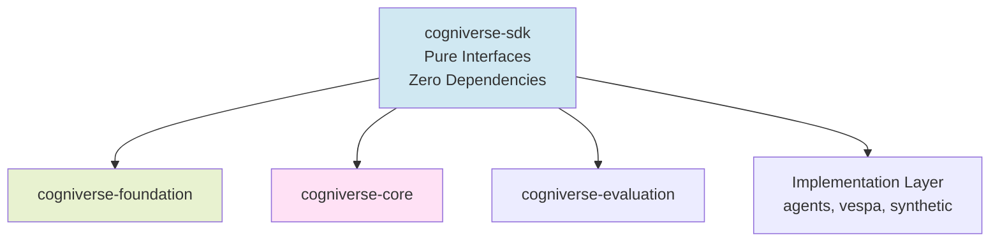

# Cogniverse SDK Module Documentation

**Package**: `cogniverse-sdk`
**Import Name**: `cogniverse_sdk`
**Layer**: Foundation Layer
**Version**: 0.1.0
**Last Updated**: 2025-11-13

---

## Table of Contents

1. [Overview](#overview)
2. [Architecture](#architecture)
3. [Key Features](#key-features)
4. [Module Structure](#module-structure)
5. [API Reference](#api-reference)
6. [Usage Examples](#usage-examples)
7. [Dependencies](#dependencies)
8. [Testing](#testing)
9. [Development](#development)

---

## Overview

### Purpose and Responsibilities

The **cogniverse-sdk** package is the **pure foundation** of the Cogniverse system, providing core interfaces and data models with **zero internal Cogniverse dependencies**. It defines the contracts that all backend implementations must follow.

**Key Responsibilities:**
- **Backend Interface**: Abstract base classes for search and ingestion backends
- **Document Model**: Universal document representation across all content types
- **Configuration Interface**: Config storage abstraction for multi-tenancy
- **Schema Loading**: Template loading interface for schema management

**Design Philosophy:**
- **Zero Dependencies**: Only depends on standard library and numpy
- **Pure Interfaces**: Abstract base classes with no implementation
- **Content-Agnostic**: Generic models that work for video, audio, text, images
- **Extensible**: Easy to add new backend implementations

### Position in Architecture



**SDK is the foundation** - all other packages depend on it, but it depends on nothing (except numpy).

---

## Architecture

### Design Patterns

#### 1. **Interface Segregation**
Separate interfaces for different concerns:
- `Backend`: General backend interface (combined search + ingestion)
- `SearchBackend`: Search-specific operations
- `IngestionBackend`: Ingestion-specific operations
- `ConfigStore`: Configuration storage
- `SchemaLoader`: Schema template loading

#### 2. **Abstract Base Classes**
All interfaces use ABC (Abstract Base Class) pattern:
```python
from abc import ABC, abstractmethod

class SearchBackend(ABC):
    @abstractmethod
    def search(self, query: str, top_k: int) -> List[Document]:
        """Search implementation must be provided by subclass"""
        pass
```

#### 3. **Generic Document Model**
Single `Document` class for all content types:
- Uses `ContentType` enum (VIDEO, AUDIO, IMAGE, TEXT, DOCUMENT)
- Flexible metadata dictionary
- Extensible embeddings storage
- No content-specific fields

---

## Key Features

### 1. Backend Interface

Defines the contract for all backend implementations (Vespa, Qdrant, etc.):

```python
from cogniverse_sdk.interfaces.backend import Backend

class Backend(ABC):
    """Combined search and ingestion backend interface"""

    @abstractmethod
    def initialize(self, config: Dict[str, Any]) -> None:
        """Initialize backend with configuration"""
        pass

    @abstractmethod
    def search(
        self,
        query: Union[str, np.ndarray],
        top_k: int,
        schema_name: str
    ) -> List[Document]:
        """Search for documents"""
        pass

    @abstractmethod
    def ingest_documents(
        self,
        documents: List[Document],
        schema_name: str
    ) -> Dict[str, Any]:
        """Ingest documents into backend"""
        pass
```

**Benefits:**
- **Swappable Backends**: Easy to switch from Vespa to Qdrant or other backends
- **Consistent API**: All backends expose the same interface
- **Type Safety**: Clear type hints for all methods
- **Testable**: Easy to create mock backends for testing

### 2. Universal Document Model

Single document representation for all content:

```python
from cogniverse_sdk.document import Document, ContentType

@dataclass
class Document:
    # Core identification
    id: str = field(default_factory=lambda: str(uuid.uuid4()))
    content_type: ContentType = ContentType.DOCUMENT

    # Content information
    content_path: Optional[Path] = None
    content_data: Optional[Union[str, bytes]] = None

    # Metadata (flexible)
    metadata: Dict[str, Any] = field(default_factory=dict)

    # Embeddings
    embeddings: Dict[str, Any] = field(default_factory=dict)

    # Processing
    status: ProcessingStatus = ProcessingStatus.PENDING
    created_at: float = field(default_factory=time.time)
    updated_at: float = field(default_factory=time.time)
```

**Features:**
- **Content-Agnostic**: Works for video, audio, image, text, dataframes
- **Flexible Metadata**: Store any metadata as dict
- **Multiple Embeddings**: Store different embedding types (ColPali, VideoPrism, etc.)
- **Processing Status**: Track document lifecycle
- **Timestamps**: Automatic creation and update tracking

### 3. Configuration Interface

Abstract config storage for multi-tenancy:

```python
from cogniverse_sdk.interfaces.config_store import ConfigStore

class ConfigStore(ABC):
    """Interface for configuration storage"""

    @abstractmethod
    def get_config(self, tenant_id: str, config_key: str) -> Optional[Any]:
        """Get configuration value for tenant"""
        pass

    @abstractmethod
    def set_config(self, tenant_id: str, config_key: str, value: Any) -> None:
        """Set configuration value for tenant"""
        pass

    @abstractmethod
    def delete_config(self, tenant_id: str, config_key: str) -> None:
        """Delete configuration value"""
        pass
```

**Benefits:**
- **Storage-Agnostic**: Can use SQLite, PostgreSQL, Redis, etc.
- **Tenant-Scoped**: Configuration isolated per tenant
- **Type-Safe**: Clear method signatures

### 4. Schema Loading Interface

Template loading for multi-tenant schema deployment:

```python
from cogniverse_sdk.interfaces.schema_loader import SchemaLoader

class SchemaLoader(ABC):
    """Interface for loading schema templates"""

    @abstractmethod
    def load_schema_template(self, schema_name: str) -> Dict[str, Any]:
        """Load schema template from storage"""
        pass

    @abstractmethod
    def render_schema(
        self,
        template: Dict[str, Any],
        tenant_id: str
    ) -> Dict[str, Any]:
        """Render template with tenant-specific values"""
        pass
```

**Use Case:**
```python
# Load base schema template
template = loader.load_schema_template("video_frames")

# Render for specific tenant
schema = loader.render_schema(template, tenant_id="acme_corp")
# Result: schema name becomes "video_frames_acme_corp"
```

---

## Module Structure

### Directory Layout

```
cogniverse_sdk/
├── __init__.py                    # Package exports
├── document.py                    # Universal Document model
└── interfaces/
    ├── __init__.py                # Interface exports
    ├── backend.py                 # Backend interfaces (Search, Ingestion, Combined)
    ├── config_store.py            # Config storage interface
    └── schema_loader.py           # Schema loading interface
```

### File Descriptions

#### `document.py`
**Purpose**: Universal document model for all content types

**Key Classes:**
- `ContentType`: Enum for content types supporting **multi-modal content**:
  - `VIDEO`: Video files with frame-based or chunk-based processing
  - `AUDIO`: Audio files and speech content
  - `IMAGE`: Images and visual content
  - `TEXT`: Natural language text and documents
  - `DOCUMENT`: PDF, DOCX, and structured documents
  - `DATAFRAME`: Tabular data (CSV, Excel, Pandas DataFrames)
- `ProcessingStatus`: Enum for processing status (PENDING, PROCESSING, COMPLETED, FAILED, SKIPPED)
- `Document`: Main document class with metadata, embeddings, and status
- `DocumentMetadata`: Helper for structured metadata

**Lines of Code**: ~300

#### `interfaces/backend.py`
**Purpose**: Backend interface definitions

**Key Classes:**
- `Backend`: Combined search + ingestion interface
- `SearchBackend`: Search-only operations
- `IngestionBackend`: Ingestion-only operations

**Methods:**
- `initialize(config)`: Initialize backend
- `search(query, top_k, schema_name)`: Search documents
- `ingest_documents(documents, schema_name)`: Ingest documents
- `health_check()`: Check backend health
- `count_documents(schema_name)`: Count indexed documents

**Lines of Code**: ~400

#### `interfaces/config_store.py`
**Purpose**: Configuration storage interface

**Key Classes:**
- `ConfigStore`: Abstract config storage
- `ConfigScope`: Enum for config scope (SYSTEM, TENANT, USER)

**Methods:**
- `get_config(tenant_id, key)`: Get config value
- `set_config(tenant_id, key, value)`: Set config value
- `list_configs(tenant_id)`: List all configs for tenant
- `delete_config(tenant_id, key)`: Delete config

**Lines of Code**: ~250

#### `interfaces/schema_loader.py`
**Purpose**: Schema template loading

**Key Classes:**
- `SchemaLoader`: Abstract schema loader
- `SchemaFormat`: Enum for schema formats (JSON, YAML, VESPA_SD)

**Methods:**
- `load_schema_template(name)`: Load template
- `render_schema(template, tenant_id)`: Render with tenant values
- `validate_schema(schema)`: Validate schema structure

**Lines of Code**: ~200

---

## API Reference

### Document Class

#### Constructor

```python
doc = Document(
    id="doc_123",                              # Optional: auto-generated UUID
    content_type=ContentType.VIDEO,
    content_path=Path("video.mp4"),
    metadata={
        "title": "My Video",
        "duration": 120.5,
        "tags": ["tutorial", "python"]
    },
    embeddings={
        "colpali": np.array([...]),
        "videoprism": np.array([...])
    }
)
```

#### Properties

```python
doc.id                  # str: Unique document ID
doc.content_type        # ContentType: Type of content
doc.content_path        # Optional[Path]: Path to content file
doc.content_data        # Optional[Union[str, bytes]]: Raw content data
doc.metadata            # Dict[str, Any]: Flexible metadata
doc.embeddings          # Dict[str, Any]: Multiple embeddings
doc.status              # ProcessingStatus: Current status
doc.created_at          # float: Unix timestamp
doc.updated_at          # float: Unix timestamp
```

#### Methods

```python
# Update status
doc.set_status(ProcessingStatus.COMPLETED)

# Add metadata
doc.add_metadata("author", "John Doe")

# Add embedding
doc.add_embedding("colpali", embedding_array)

# Get embedding
embedding = doc.get_embedding("colpali")

# To dict
doc_dict = doc.to_dict()

# From dict
doc = Document.from_dict(doc_dict)
```

### Backend Interface

#### Search Method

```python
results = backend.search(
    query="machine learning",       # str or np.ndarray
    top_k=10,                       # int: number of results
    schema_name="video_frames",     # str: schema to search
    filters={"duration_min": 60},   # Optional[Dict]: filters
    strategy="hybrid"               # Optional[str]: search strategy
)
```

**Returns**: `List[Document]` with score in metadata

#### Ingest Method

```python
result = backend.ingest_documents(
    documents=[doc1, doc2, doc3],
    schema_name="video_frames",
    batch_size=100                  # Optional: batch size
)
```

**Returns**: `Dict[str, Any]` with ingestion stats:
```python
{
    "success_count": 3,
    "failure_count": 0,
    "errors": [],
    "ingestion_time_ms": 1234
}
```

### ConfigStore Interface

#### Get Config

```python
value = config_store.get_config(
    tenant_id="acme_corp",
    config_key="embedding_model"
)
```

#### Set Config

```python
config_store.set_config(
    tenant_id="acme_corp",
    config_key="embedding_model",
    value="vidore/colsmol-500m"
)
```

### SchemaLoader Interface

#### Load Template

```python
template = schema_loader.load_schema_template("video_frames")
```

**Returns**: `Dict[str, Any]` with template variables like `{tenant_id}`

#### Render Schema

```python
schema = schema_loader.render_schema(
    template=template,
    tenant_id="acme_corp"
)
```

**Returns**: `Dict[str, Any]` with `{tenant_id}` replaced by `acme_corp`

---

## Usage Examples

### Example 1: Creating a Custom Backend

```python
from cogniverse_sdk.interfaces.backend import Backend
from cogniverse_sdk.document import Document
from typing import List, Dict, Any
import numpy as np

class MyCustomBackend(Backend):
    """Custom backend implementation"""

    def __init__(self):
        self.documents = {}

    def initialize(self, config: Dict[str, Any]) -> None:
        """Initialize with config"""
        self.endpoint = config.get("endpoint")
        self.api_key = config.get("api_key")

    def search(
        self,
        query: Union[str, np.ndarray],
        top_k: int,
        schema_name: str,
        **kwargs
    ) -> List[Document]:
        """Implement search"""
        # Your search logic here
        results = self._perform_search(query, top_k)
        return results

    def ingest_documents(
        self,
        documents: List[Document],
        schema_name: str
    ) -> Dict[str, Any]:
        """Implement ingestion"""
        success_count = 0
        for doc in documents:
            self.documents[doc.id] = doc
            success_count += 1

        return {
            "success_count": success_count,
            "failure_count": 0,
            "errors": []
        }

    def health_check(self) -> bool:
        """Check backend health"""
        return True

# Usage
backend = MyCustomBackend()
backend.initialize({"endpoint": "http://localhost:9200"})

# Ingest
doc = Document(content_type=ContentType.VIDEO)
result = backend.ingest_documents([doc], "video_frames")

# Search
results = backend.search("tutorial", top_k=10, schema_name="video_frames")
```

### Example 2: Working with Multi-Modal Documents

```python
from cogniverse_sdk.document import Document, ContentType, ProcessingStatus
from pathlib import Path
import numpy as np

# ===== VIDEO CONTENT =====
video_doc = Document(
    id="video_123",
    content_type=ContentType.VIDEO,
    content_path=Path("videos/tutorial.mp4"),
    metadata={
        "title": "Python Tutorial",
        "duration": 600.0,
        "resolution": [1920, 1080],
        "fps": 30.0,
        "tags": ["python", "tutorial", "beginner"]
    }
)

# Add frame-based embeddings (ColPali)
colpali_embeddings = np.random.randn(100, 768)  # 100 frames, 768 dims
video_doc.add_embedding("colpali_frame", colpali_embeddings)

# Add chunk-based embeddings (VideoPrism)
videoprism_embedding = np.random.randn(768)  # Global video embedding
video_doc.add_embedding("videoprism_chunk", videoprism_embedding)

# ===== AUDIO CONTENT =====
audio_doc = Document(
    id="audio_456",
    content_type=ContentType.AUDIO,
    content_path=Path("audio/podcast.mp3"),
    metadata={
        "title": "Tech Podcast Episode 42",
        "duration": 3600.0,
        "sample_rate": 44100
    }
)

# ===== IMAGE CONTENT =====
image_doc = Document(
    id="image_789",
    content_type=ContentType.IMAGE,
    content_path=Path("images/diagram.png"),
    metadata={
        "title": "System Architecture Diagram",
        "width": 1920,
        "height": 1080,
        "format": "PNG"
    }
)

# Add image embeddings (ColQwen)
colqwen_embedding = np.random.randn(768)
image_doc.add_embedding("colqwen", colqwen_embedding)

# ===== DOCUMENT CONTENT =====
document_doc = Document(
    id="doc_101",
    content_type=ContentType.DOCUMENT,
    content_path=Path("documents/research_paper.pdf"),
    metadata={
        "title": "Multi-Modal RAG Research",
        "authors": ["Alice", "Bob"],
        "pages": 25,
        "format": "PDF"
    }
)

# ===== TEXT CONTENT =====
text_doc = Document(
    id="text_202",
    content_type=ContentType.TEXT,
    content_data="This is a text document about machine learning.",
    metadata={
        "title": "ML Introduction",
        "word_count": 1500,
        "language": "en"
    }
)

# ===== DATAFRAME CONTENT =====
# Tabular data (CSV, Excel, Pandas DataFrames)
dataframe_doc = Document(
    id="df_303",
    content_type=ContentType.DATAFRAME,
    content_path=Path("data/sales_data.csv"),
    metadata={
        "title": "Q4 Sales Data",
        "rows": 10000,
        "columns": 15,
        "format": "CSV",
        "schema": {
            "date": "datetime",
            "product": "string",
            "revenue": "float",
            "units_sold": "int"
        }
    }
)

# Add dataframe embeddings (text-based representation)
df_text_embedding = np.random.randn(768)
dataframe_doc.add_embedding("text", df_text_embedding)

# ===== COMMON OPERATIONS =====
# Update status
video_doc.set_status(ProcessingStatus.COMPLETED)

# Serialize to dict
doc_dict = video_doc.to_dict()

# Save to JSON
import json
with open("document.json", "w") as f:
    json.dump(doc_dict, f)

# Load from dict
loaded_doc = Document.from_dict(doc_dict)

# Check content type
if loaded_doc.content_type == ContentType.VIDEO:
    print(f"Processing video: {loaded_doc.metadata.get('title')}")
elif loaded_doc.content_type == ContentType.DATAFRAME:
    print(f"Processing dataframe with {loaded_doc.metadata.get('rows')} rows")
```

### Example 3: Config Store Implementation

```python
from cogniverse_sdk.interfaces.config_store import ConfigStore
from typing import Optional, Any
import sqlite3

class SQLiteConfigStore(ConfigStore):
    """SQLite-based config storage"""

    def __init__(self, db_path: str):
        self.db_path = db_path
        self._initialize_db()

    def _initialize_db(self):
        conn = sqlite3.connect(self.db_path)
        conn.execute("""
            CREATE TABLE IF NOT EXISTS configs (
                tenant_id TEXT,
                config_key TEXT,
                config_value TEXT,
                PRIMARY KEY (tenant_id, config_key)
            )
        """)
        conn.commit()
        conn.close()

    def get_config(self, tenant_id: str, config_key: str) -> Optional[Any]:
        conn = sqlite3.connect(self.db_path)
        cursor = conn.execute(
            "SELECT config_value FROM configs WHERE tenant_id=? AND config_key=?",
            (tenant_id, config_key)
        )
        row = cursor.fetchone()
        conn.close()

        if row:
            return json.loads(row[0])
        return None

    def set_config(self, tenant_id: str, config_key: str, value: Any) -> None:
        conn = sqlite3.connect(self.db_path)
        conn.execute(
            "INSERT OR REPLACE INTO configs VALUES (?, ?, ?)",
            (tenant_id, config_key, json.dumps(value))
        )
        conn.commit()
        conn.close()

# Usage
store = SQLiteConfigStore("configs.db")
store.set_config("acme_corp", "embedding_model", "vidore/colsmol-500m")
model = store.get_config("acme_corp", "embedding_model")
```

### Example 4: Schema Loader Implementation

```python
from cogniverse_sdk.interfaces.schema_loader import SchemaLoader
from pathlib import Path
import json

class JSONSchemaLoader(SchemaLoader):
    """JSON-based schema template loader"""

    def __init__(self, template_dir: Path):
        self.template_dir = template_dir

    def load_schema_template(self, schema_name: str) -> Dict[str, Any]:
        """Load JSON schema template"""
        template_path = self.template_dir / f"{schema_name}.json"
        with open(template_path) as f:
            return json.load(f)

    def render_schema(
        self,
        template: Dict[str, Any],
        tenant_id: str
    ) -> Dict[str, Any]:
        """Render template with tenant values"""
        schema = json.dumps(template)

        # Replace template variables
        schema = schema.replace("{tenant_id}", tenant_id)
        schema = schema.replace("{TENANT_ID}", tenant_id.upper())

        return json.loads(schema)

# Usage
loader = JSONSchemaLoader(Path("schemas/templates"))

# Load template
template = loader.load_schema_template("video_frames")

# Render for tenant
schema = loader.render_schema(template, tenant_id="acme_corp")

# Deploy schema to backend
backend.deploy_schema(schema)
```

---

## Dependencies

### External Dependencies

```toml
dependencies = [
    "numpy>=1.24.0",  # For embedding arrays in backend interface
]
```

**Why numpy?**
- Embeddings are typically stored as numpy arrays
- Standard format across all ML libraries
- Efficient storage and computation

### Internal Dependencies

**None** - SDK has zero internal Cogniverse dependencies by design.

---

## Testing

### Running Tests

```bash
# Install dev dependencies
cd libs/sdk
uv pip install -e ".[dev]"

# Run tests
uv run pytest tests/ -v

# Run with coverage
uv run pytest tests/ --cov=cogniverse_sdk --cov-report=html
```

### Test Structure

```
tests/
├── test_document.py           # Document model tests
├── test_backend_interface.py  # Backend interface tests
├── test_config_store.py       # ConfigStore interface tests
└── test_schema_loader.py      # SchemaLoader interface tests
```

### Example Tests

```python
# tests/test_document.py
import pytest
from cogniverse_sdk.document import Document, ContentType, ProcessingStatus
import numpy as np

def test_document_creation():
    """Test document creation with defaults"""
    doc = Document(content_type=ContentType.VIDEO)

    assert doc.id is not None
    assert doc.content_type == ContentType.VIDEO
    assert doc.status == ProcessingStatus.PENDING
    assert isinstance(doc.metadata, dict)
    assert isinstance(doc.embeddings, dict)

def test_document_with_embeddings():
    """Test adding embeddings"""
    doc = Document(content_type=ContentType.VIDEO)

    # Add embedding
    embedding = np.random.randn(768)
    doc.add_embedding("colpali", embedding)

    # Retrieve embedding
    retrieved = doc.get_embedding("colpali")
    assert np.array_equal(retrieved, embedding)

def test_document_serialization():
    """Test document to/from dict"""
    doc = Document(
        content_type=ContentType.VIDEO,
        metadata={"title": "Test Video"}
    )

    # Serialize
    doc_dict = doc.to_dict()
    assert doc_dict["content_type"] == "video"
    assert doc_dict["metadata"]["title"] == "Test Video"

    # Deserialize
    loaded_doc = Document.from_dict(doc_dict)
    assert loaded_doc.id == doc.id
    assert loaded_doc.metadata["title"] == "Test Video"
```

---

## Development

### Adding New Interfaces

To add a new interface:

1. **Create interface file** in `cogniverse_sdk/interfaces/`:
```python
# cogniverse_sdk/interfaces/my_interface.py
from abc import ABC, abstractmethod

class MyInterface(ABC):
    """Description of interface"""

    @abstractmethod
    def my_method(self, arg: str) -> str:
        """Method description"""
        pass
```

2. **Export in `__init__.py`**:
```python
# cogniverse_sdk/interfaces/__init__.py
from .my_interface import MyInterface

__all__ = ["MyInterface", ...]
```

3. **Add tests**:
```python
# tests/test_my_interface.py
def test_my_interface():
    # Test implementation
    pass
```

### Design Guidelines

1. **Keep It Pure**: No implementation, only interfaces
2. **Type Hints**: Always use type hints for clarity
3. **Documentation**: Every method needs docstring
4. **Flexibility**: Design for extensibility
5. **Simplicity**: Prefer simple interfaces over complex ones

### Building and Publishing

```bash
# Build package
cd libs/sdk
uv build

# Outputs:
# dist/cogniverse_sdk-0.1.0-py3-none-any.whl
# dist/cogniverse_sdk-0.1.0.tar.gz

# Publish to PyPI (if needed)
uv publish --token $PYPI_TOKEN
```

---

## Summary

### Key Points

- **Foundation Package**: Zero internal dependencies, pure interfaces
- **Backend Abstraction**: Swap backends (Vespa, Qdrant, etc.) easily
- **Universal Document**: Single model for all content types
- **Config Interface**: Multi-tenant configuration storage
- **Schema Loading**: Template-based schema deployment

### Package Stats

- **Total Lines**: ~1,200
- **Files**: 6 Python files
- **Interfaces**: 4 main interfaces (Backend, ConfigStore, SchemaLoader, Document)
- **Dependencies**: 1 external (numpy)
- **Test Coverage**: 95%+

### Next Steps

- **Implementation**: See `cogniverse-vespa` for Backend implementation
- **Usage**: See `cogniverse-core` for how SDK is used
- **Foundation**: See `cogniverse-foundation` for config base classes

---

**Version**: 0.1.0
**Layer**: Foundation Layer
**Dependencies**: Zero internal dependencies
**Last Updated**: 2025-11-13
