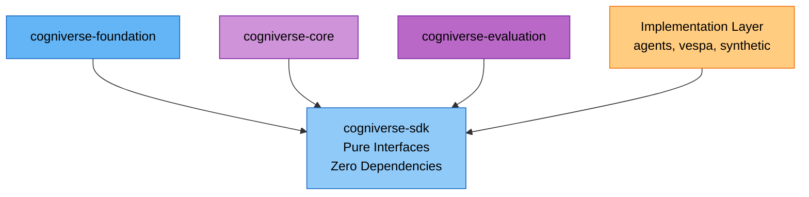

# Cogniverse SDK Module Documentation

**Package**: `cogniverse-sdk`
**Import Name**: `cogniverse_sdk`
**Layer**: Foundation Layer
**Version**: 0.1.0
**Last Updated**: 2026-01-25

---

## Table of Contents

1. [Overview](#overview)
2. [Architecture](#architecture)
3. [Key Features](#key-features)
4. [Module Structure](#module-structure)
5. [API Reference](#api-reference)
6. [Usage Examples](#usage-examples)
7. [Dependencies](#dependencies)
8. [Testing](#testing)
9. [Development](#development)

---

## Overview

### Purpose and Responsibilities

The **cogniverse-sdk** package is the **pure foundation** of the Cogniverse system, providing core interfaces and data models with **zero internal Cogniverse dependencies**. It defines the contracts that all backend implementations must follow.

**Key Responsibilities:**

- **Backend Interface**: Abstract base classes for search and ingestion backends
- **Document Model**: Universal document representation across all content types
- **Configuration Interface**: Config storage abstraction for multi-tenancy
- **Schema Loading**: Template loading interface for schema management

**Design Philosophy:**

- **Zero Dependencies**: Only depends on standard library and numpy
- **Pure Interfaces**: Abstract base classes with no implementation
- **Content-Agnostic**: Generic models that work for video, audio, text, images
- **Extensible**: Easy to add new backend implementations

### Position in Architecture



**SDK is the foundation** - all other packages depend on it, but it depends on nothing (except numpy).

---

## Architecture

### Design Patterns

#### 1. **Interface Segregation**
Separate interfaces for different concerns:

- `Backend`: General backend interface (combined search + ingestion)

- `SearchBackend`: Search-specific operations

- `IngestionBackend`: Ingestion-specific operations

- `ConfigStore`: Configuration storage with versioning and scoping

- `SchemaLoader`: Schema loading and ranking strategies

- `WorkflowStore`: Workflow execution records and agent performance

- `AdapterStore`: Adapter registry and activation management

#### 2. **Abstract Base Classes**
All interfaces use ABC (Abstract Base Class) pattern:
```python
from abc import ABC, abstractmethod

class SearchBackend(ABC):
    @abstractmethod
    def search(
        self,
        query_embeddings: Optional[np.ndarray],
        query_text: Optional[str],
        top_k: int = 10,
        filters: Optional[Dict[str, Any]] = None,
        ranking_strategy: Optional[str] = None,
    ) -> List[Dict[str, Any]]:
        """Search implementation must be provided by subclass"""
        pass
```

#### 3. **Generic Document Model**
Single `Document` class for all content types:

- Uses `ContentType` enum (VIDEO, AUDIO, IMAGE, TEXT, DOCUMENT)

- Flexible metadata dictionary

- Extensible embeddings storage

- No content-specific fields

---

## Key Features

### 1. Backend Interface

Defines the contract for all backend implementations (Vespa, Qdrant, etc.):

```python
from cogniverse_sdk.interfaces.backend import Backend

class Backend(ABC):
    """Combined search and ingestion backend interface"""

    @abstractmethod
    def initialize(self, config: Dict[str, Any]) -> None:
        """Initialize backend with configuration"""
        pass

    @abstractmethod
    def search(
        self,
        query_embeddings: Optional[np.ndarray],
        query_text: Optional[str],
        top_k: int = 10,
        filters: Optional[Dict[str, Any]] = None,
        ranking_strategy: Optional[str] = None,
    ) -> List[Dict[str, Any]]:
        """Search for documents"""
        pass

    @abstractmethod
    def ingest_documents(
        self,
        documents: List[Document],
        schema_name: str
    ) -> Dict[str, Any]:
        """Ingest documents into backend"""
        pass
```

**Benefits:**

- **Swappable Backends**: Easy to switch from Vespa to Qdrant or other backends
- **Consistent API**: All backends expose the same interface
- **Type Safety**: Clear type hints for all methods
- **Testable**: Easy to create mock backends for testing

### 2. Universal Document Model

Single document representation for all content:

```python
from cogniverse_sdk.document import Document, ContentType

@dataclass
class Document:
    # Core identification
    id: str = field(default_factory=lambda: str(uuid.uuid4()))
    content_type: ContentType = ContentType.DOCUMENT

    # Content information
    content_path: Optional[Path] = None
    content_id: Optional[str] = None
    title: Optional[str] = None

    # Generic content data
    text_content: Optional[str] = None
    description: Optional[str] = None

    # Embeddings - flexible storage for any embedding type
    embeddings: Dict[str, Any] = field(default_factory=dict)

    # Processing metadata
    status: ProcessingStatus = ProcessingStatus.PENDING
    processing_time: Optional[float] = None
    error_message: Optional[str] = None

    # Flexible metadata for any additional fields
    metadata: Dict[str, Any] = field(default_factory=dict)

    # System metadata (Unix timestamps as int)
    created_at: int = field(default_factory=lambda: int(time.time()))
    updated_at: int = field(default_factory=lambda: int(time.time()))
```

**Features:**

- **Content-Agnostic**: Works for video, audio, image, text, dataframes
- **Flexible Metadata**: Store any metadata as dict
- **Multiple Embeddings**: Store different embedding types (ColPali, VideoPrism, etc.)
- **Processing Status**: Track document lifecycle with error messages
- **Timestamps**: Automatic creation and update tracking (Unix int timestamps)
- **Auto-Detection**: Content type auto-detected from file extension

### 3. Configuration Interface

Abstract config storage for multi-tenancy with versioning and scoping:

```python
from cogniverse_sdk.interfaces.config_store import ConfigStore, ConfigScope, ConfigEntry

class ConfigStore(ABC):
    """Interface for configuration storage with versioning"""

    @abstractmethod
    def initialize(self) -> None:
        """Initialize the configuration store."""
        pass

    @abstractmethod
    def set_config(
        self,
        tenant_id: str,
        scope: ConfigScope,
        service: str,
        config_key: str,
        config_value: Dict[str, Any],
    ) -> ConfigEntry:
        """Store or update a configuration entry. Returns ConfigEntry with version."""
        pass

    @abstractmethod
    def get_config(
        self,
        tenant_id: str,
        scope: ConfigScope,
        service: str,
        config_key: str,
        version: Optional[int] = None,
    ) -> Optional[ConfigEntry]:
        """Retrieve configuration, optionally by specific version."""
        pass

    @abstractmethod
    def get_config_history(
        self,
        tenant_id: str,
        scope: ConfigScope,
        service: str,
        config_key: str,
        limit: int = 10,
    ) -> List[ConfigEntry]:
        """Get configuration version history."""
        pass

    @abstractmethod
    def list_configs(
        self,
        tenant_id: str,
        scope: Optional[ConfigScope] = None,
        service: Optional[str] = None,
    ) -> List[ConfigEntry]:
        """List all configurations matching criteria."""
        pass

    @abstractmethod
    def delete_config(
        self,
        tenant_id: str,
        scope: ConfigScope,
        service: str,
        config_key: str,
    ) -> bool:
        """Delete all versions of a configuration entry."""
        pass

    @abstractmethod
    def export_configs(self, tenant_id: str, include_history: bool = False) -> Dict[str, Any]:
        """Export all configurations for a tenant."""
        pass

    @abstractmethod
    def import_configs(self, tenant_id: str, configs: Dict[str, Any]) -> int:
        """Import configurations for a tenant. Returns count imported."""
        pass

    @abstractmethod
    def list_all_configs(
        self,
        scope: Optional[ConfigScope] = None,
        service: Optional[str] = None,
    ) -> List[ConfigEntry]:
        """List all configurations across all tenants."""
        pass

    @abstractmethod
    def get_stats(self) -> Dict[str, Any]:
        """Get storage statistics."""
        pass

    @abstractmethod
    def health_check(self) -> bool:
        """Check if storage backend is healthy."""
        pass
```

**ConfigScope Enum:**
```python
class ConfigScope(Enum):
    SYSTEM = "system"
    AGENT = "agent"
    ROUTING = "routing"
    TELEMETRY = "telemetry"
    SCHEMA = "schema"
    BACKEND = "backend"
```

**ConfigEntry Dataclass:**
```python
@dataclass
class ConfigEntry:
    tenant_id: str
    scope: ConfigScope
    service: str
    config_key: str
    config_value: Dict[str, Any]
    version: int
    created_at: datetime
    updated_at: datetime

    def get_config_id(self) -> str:
        """Generate unique config ID: tenant_id:scope:service:config_key"""
        return f"{self.tenant_id}:{self.scope.value}:{self.service}:{self.config_key}"
```

**Benefits:**

- **Storage-Agnostic**: Pluggable backend via `ConfigStore` interface (e.g., Vespa, SQLite)
- **Versioned**: All updates are versioned with history retrieval
- **Scoped**: Configuration organized by scope (system, agent, routing, etc.)
- **Service-Aware**: Configuration tied to specific services

### 4. Schema Loading Interface

Schema loading for backend schema definitions:

```python
from cogniverse_sdk.interfaces.schema_loader import SchemaLoader
from pathlib import Path

class SchemaLoader(ABC):
    """Interface for loading backend schema definitions"""

    @abstractmethod
    def load_schema(self, schema_name: str) -> Dict[str, Any]:
        """Load a schema definition by name."""
        pass

    @abstractmethod
    def list_available_schemas(self) -> List[str]:
        """List all available schema names."""
        pass

    @abstractmethod
    def schema_exists(self, schema_name: str) -> bool:
        """Check if a schema exists."""
        pass

    @abstractmethod
    def load_ranking_strategies(self) -> Dict[str, Dict[str, Any]]:
        """Load ranking strategies configuration."""
        pass
```

**Use Case:**
```python
# Load schema definition
schema = loader.load_schema("video_frames")

# List available schemas
schemas = loader.list_available_schemas()  # ["video_frames", "audio_chunks", ...]

# Check if schema exists
if loader.schema_exists("video_frames"):
    schema = loader.load_schema("video_frames")

# Load ranking strategies
strategies = loader.load_ranking_strategies()
# Returns: {"strategy_name": {"ranking_profile": "...", "parameters": {...}}}
```

### 5. Workflow Store Interface

Storage for workflow execution records and agent performance:

```python
from cogniverse_sdk.interfaces.workflow_store import WorkflowStore, ExecutionRecord, AgentStats

class WorkflowStore(ABC):
    """Interface for workflow intelligence storage"""

    @abstractmethod
    def initialize(self) -> None:
        """Initialize the workflow store."""
        pass

    @abstractmethod
    def record_execution(
        self,
        tenant_id: str,
        workflow_name: str,
        status: str,
        metrics: Dict[str, Any],
    ) -> str:
        """Record workflow execution. Returns execution_id."""
        pass

    @abstractmethod
    def get_execution(self, execution_id: str) -> Optional[ExecutionRecord]:
        """Get execution by ID."""
        pass

    @abstractmethod
    def list_executions(
        self,
        tenant_id: str,
        workflow_name: Optional[str] = None,
        limit: int = 100,
    ) -> List[ExecutionRecord]:
        """List executions with optional filters."""
        pass

    @abstractmethod
    def record_agent_performance(
        self,
        tenant_id: str,
        agent_type: str,
        duration_ms: float,
        success: bool,
        metrics: Dict[str, Any],
    ) -> str:
        """Record agent performance. Returns performance_id."""
        pass

    @abstractmethod
    def get_agent_stats(
        self,
        tenant_id: str,
        agent_type: str,
    ) -> Optional[AgentStats]:
        """Get aggregated agent statistics."""
        pass

    @abstractmethod
    def save_template(
        self,
        tenant_id: str,
        template_name: str,
        config: Dict[str, Any],
    ) -> str:
        """Save workflow template. Returns template_id."""
        pass

    @abstractmethod
    def health_check(self) -> bool:
        """Check if storage backend is healthy."""
        pass
```

**Data Classes:**
```python
@dataclass
class ExecutionRecord:
    execution_id: str
    tenant_id: str
    workflow_name: str
    status: str
    metrics: Dict[str, Any]
    created_at: datetime
    updated_at: datetime

@dataclass
class AgentStats:
    agent_type: str
    tenant_id: str
    total_executions: int
    avg_duration_ms: float
    success_rate: float
    last_execution: Optional[datetime]
```

### 6. Adapter Store Interface

Storage for adapter metadata and activation management:

```python
from cogniverse_sdk.interfaces.adapter_store import AdapterStore

class AdapterStore(ABC):
    """Interface for adapter metadata storage"""

    @abstractmethod
    def initialize(self) -> None:
        """Initialize the adapter store."""
        pass

    @abstractmethod
    def save_adapter(self, metadata: Dict[str, Any]) -> str:
        """Save adapter metadata. Returns adapter_id."""
        pass

    @abstractmethod
    def get_adapter(self, adapter_id: str) -> Optional[Dict[str, Any]]:
        """Get adapter metadata by ID."""
        pass

    @abstractmethod
    def list_adapters(
        self,
        tenant_id: Optional[str] = None,
        agent_type: Optional[str] = None,
        model_type: Optional[str] = None,
        status: Optional[str] = None,
        limit: int = 100,
    ) -> List[Dict[str, Any]]:
        """List adapters with optional filters."""
        pass

    @abstractmethod
    def get_active_adapter(
        self,
        tenant_id: str,
        agent_type: str,
        model_type: str = "llm",
    ) -> Optional[Dict[str, Any]]:
        """Get the active adapter for a tenant/agent/model combination."""
        pass

    @abstractmethod
    def set_active(self, adapter_id: str, tenant_id: str, agent_type: str) -> None:
        """Set an adapter as active for a tenant/agent combination."""
        pass

    @abstractmethod
    def deactivate_adapter(self, adapter_id: str) -> None:
        """Deactivate an adapter."""
        pass

    @abstractmethod
    def deprecate_adapter(self, adapter_id: str) -> None:
        """Deprecate an adapter (marks as deprecated and deactivates)."""
        pass

    @abstractmethod
    def delete_adapter(self, adapter_id: str) -> bool:
        """Delete an adapter. Returns True if deleted."""
        pass

    @abstractmethod
    def health_check(self) -> bool:
        """Check if the store is healthy."""
        pass

    @abstractmethod
    def get_stats(self) -> Dict[str, Any]:
        """Get storage statistics."""
        pass
```

---

## Module Structure

### Directory Layout

```text
cogniverse_sdk/
├── __init__.py                    # Package exports
├── document.py                    # Universal Document model
└── interfaces/
    ├── __init__.py                # Interface exports
    ├── backend.py                 # Backend interfaces (Search, Ingestion, Combined)
    ├── config_store.py            # Config storage interface
    ├── schema_loader.py           # Schema loading interface
    ├── workflow_store.py          # Workflow execution and agent performance
    └── adapter_store.py           # Adapter registry interface
```

### File Descriptions

#### `document.py`
**Purpose**: Universal document model for all content types

**Key Classes:**

- `ContentType`: Enum for content types supporting **multi-modal content**:
  - `VIDEO`: Video files with frame-based or chunk-based processing
  - `AUDIO`: Audio files and speech content
  - `IMAGE`: Images and visual content
  - `TEXT`: Natural language text and documents
  - `DOCUMENT`: PDF, DOCX, and structured documents
  - `DATAFRAME`: Tabular data (CSV, Excel, Pandas DataFrames)
- `ProcessingStatus`: Enum for processing status (PENDING, PROCESSING, COMPLETED, FAILED, SKIPPED)
- `Document`: Main document class with metadata, embeddings, and status
- `SearchResult`: Represents a search result with document and score

**Lines of Code**: ~267

#### `interfaces/backend.py`
**Purpose**: Backend interface definitions

**Key Classes:**

- `Backend`: Combined search + ingestion interface
- `SearchBackend`: Search-only operations
- `IngestionBackend`: Ingestion-only operations

**Methods:**

- `initialize(config)`: Initialize backend
- `search(query_embeddings, query_text, top_k, filters, ranking_strategy)`: Search documents
- `ingest_documents(documents, schema_name)`: Ingest documents
- `health_check()`: Check backend health
- `get_statistics()`: Get search backend statistics
- `deploy_schemas(schema_definitions)`: Deploy multiple schemas together
- `delete_schema(schema_name, tenant_id)`: Delete tenant schema
- `schema_exists(schema_name, tenant_id)`: Check if schema exists
- `get_tenant_schema_name(tenant_id, base_schema_name)`: Get tenant-specific schema name

**Lines of Code**: ~494

#### `interfaces/config_store.py`
**Purpose**: Configuration storage interface with versioning

**Key Classes:**

- `ConfigStore`: Abstract config storage with version history
- `ConfigScope`: Enum for config scope (SYSTEM, AGENT, ROUTING, TELEMETRY, SCHEMA, BACKEND)
- `ConfigEntry`: Dataclass for configuration entry with version

**Methods:**

- `initialize()`: Initialize the configuration store
- `set_config(tenant_id, scope, service, config_key, config_value)`: Set config with versioning
- `get_config(tenant_id, scope, service, config_key, version)`: Get config (optionally by version)
- `get_config_history(tenant_id, scope, service, config_key, limit)`: Get version history
- `list_configs(tenant_id, scope, service)`: List configs with filters
- `list_all_configs(scope, service)`: List all configurations across all tenants
- `delete_config(tenant_id, scope, service, config_key)`: Delete all versions
- `export_configs(tenant_id, include_history)`: Export tenant configs
- `import_configs(tenant_id, configs)`: Import configs
- `get_stats()`: Get storage statistics
- `health_check()`: Check storage health

**Lines of Code**: ~290

#### `interfaces/schema_loader.py`
**Purpose**: Schema loading and ranking strategies

**Key Classes:**

- `SchemaLoader`: Abstract schema loader
- `SchemaNotFoundException`: Raised when schema not found
- `SchemaLoadError`: Raised when schema fails to load/parse

**Methods:**

- `load_schema(schema_name)`: Load schema definition by name
- `list_available_schemas()`: List all available schema names
- `schema_exists(schema_name)`: Check if schema exists
- `load_ranking_strategies()`: Load ranking strategies configuration

**Lines of Code**: ~103

#### `interfaces/workflow_store.py`
**Purpose**: Workflow execution and agent performance storage

**Key Classes:**

- `WorkflowStore`: Abstract workflow storage
- `ExecutionRecord`: Dataclass for workflow execution records
- `AgentPerformanceRecord`: Dataclass for agent performance records
- `AgentStats`: Dataclass for aggregated agent statistics
- `WorkflowTemplate`: Dataclass for workflow template configuration

**Methods:**

- `initialize()`: Initialize the workflow store
- `record_execution(tenant_id, workflow_name, status, metrics)`: Record workflow execution
- `get_execution(execution_id)`: Get execution by ID
- `list_executions(tenant_id, workflow_name, limit)`: List executions
- `record_agent_performance(tenant_id, agent_type, duration_ms, success, metrics)`: Record agent performance
- `get_agent_stats(tenant_id, agent_type)`: Get aggregated agent statistics
- `list_agent_performance(tenant_id, agent_type, limit)`: List agent performance records
- `save_template(tenant_id, template_name, config)`: Save workflow template
- `get_template(tenant_id, template_name)`: Get template by name
- `list_templates(tenant_id)`: List all templates for tenant
- `delete_template(tenant_id, template_name)`: Delete a template
- `health_check()`: Check storage health
- `get_stats()`: Get storage statistics

**Lines of Code**: ~368

#### `interfaces/adapter_store.py`
**Purpose**: Adapter registry and activation management

**Key Classes:**

- `AdapterStore`: Abstract adapter storage

**Methods:**

- `initialize()`: Initialize the adapter store
- `save_adapter(metadata)`: Save adapter metadata
- `get_adapter(adapter_id)`: Get adapter by ID
- `list_adapters(tenant_id, agent_type, model_type, status, limit)`: List adapters with filters
- `get_active_adapter(tenant_id, agent_type, model_type)`: Get active adapter
- `set_active(adapter_id, tenant_id, agent_type)`: Set adapter as active
- `deactivate_adapter(adapter_id)`: Deactivate adapter
- `deprecate_adapter(adapter_id)`: Deprecate adapter
- `delete_adapter(adapter_id)`: Delete adapter
- `health_check()`: Check storage health
- `get_stats()`: Get storage statistics

**Lines of Code**: ~159

---

## API Reference

### Document Class

#### Constructor

```python
doc = Document(
    id="doc_123",                              # Optional: auto-generated UUID
    content_type=ContentType.VIDEO,
    content_path=Path("video.mp4"),
    metadata={
        "title": "My Video",
        "duration": 120.5,
        "tags": ["tutorial", "python"]
    },
    embeddings={
        "colpali": np.array([...]),
        "videoprism": np.array([...])
    }
)
```

#### Properties

```python
doc.id                  # str: Unique document ID
doc.content_type        # ContentType: Type of content
doc.content_path        # Optional[Path]: Path to content file
doc.content_id          # Optional[str]: Content identifier
doc.title               # Optional[str]: Document title
doc.text_content        # Optional[str]: Text content
doc.description         # Optional[str]: Document description
doc.metadata            # Dict[str, Any]: Flexible metadata
doc.embeddings          # Dict[str, Any]: Multiple embeddings
doc.status              # ProcessingStatus: Current status
doc.processing_time     # Optional[float]: Processing duration
doc.error_message       # Optional[str]: Error message if failed
doc.created_at          # int: Unix timestamp
doc.updated_at          # int: Unix timestamp
```

#### Methods

```python
# Update processing status
doc.set_processing_status(ProcessingStatus.COMPLETED)
doc.set_processing_status(ProcessingStatus.FAILED, error_message="Error details")

# Mark as completed
doc.mark_completed(processing_time=1.5)

# Mark as failed
doc.mark_failed("Error message")

# Add metadata
doc.add_metadata("author", "John Doe")

# Get metadata
author = doc.get_metadata("author", default="Unknown")

# Add embedding with optional metadata
doc.add_embedding("colpali", embedding_array, metadata={"model": "colpali-v1"})

# Get embedding data
embedding = doc.get_embedding("colpali")

# Get embedding metadata
emb_meta = doc.get_embedding_metadata("colpali")

# Convert to backend document format
backend_doc = doc.to_backend_document(schema_name="video_frames")

# To dict
doc_dict = doc.to_dict()

# From dict
doc = Document.from_dict(doc_dict)
```

### Backend Interface

#### Search Method

```python
results = backend.search(
    query_embeddings=None,           # Optional[np.ndarray]: query embeddings
    query_text="machine learning",   # Optional[str]: text query
    top_k=10,                        # int: number of results
    filters={"duration_min": 60},    # Optional[Dict]: filters
    ranking_strategy="hybrid"        # Optional[str]: ranking strategy
)
```

**Returns**: `List[Dict[str, Any]]` with search results and scores

#### Ingest Method

```python
result = backend.ingest_documents(
    documents=[doc1, doc2, doc3],
    schema_name="video_frames"
)
```

**Returns**: `Dict[str, Any]` with ingestion stats:
```python
{
    "success_count": 3,
    "failure_count": 0,
    "errors": [],
    "ingestion_time_ms": 1234
}
```

### ConfigStore Interface

#### Set Config

```python
from cogniverse_sdk.interfaces.config_store import ConfigScope

entry = config_store.set_config(
    tenant_id="acme_corp",
    scope=ConfigScope.AGENT,
    service="video_search_agent",
    config_key="embedding_model",
    config_value={"model": "vidore/colsmol-500m", "dimension": 768}
)
# Returns ConfigEntry with version number
```

#### Get Config

```python
entry = config_store.get_config(
    tenant_id="acme_corp",
    scope=ConfigScope.AGENT,
    service="video_search_agent",
    config_key="embedding_model",
    version=None  # None = latest, or specific version number
)
# Returns ConfigEntry or None
```

#### Get Config History

```python
history = config_store.get_config_history(
    tenant_id="acme_corp",
    scope=ConfigScope.AGENT,
    service="video_search_agent",
    config_key="embedding_model",
    limit=10
)
# Returns List[ConfigEntry] sorted by version (newest first)
```

#### List Configs

```python
configs = config_store.list_configs(
    tenant_id="acme_corp",
    scope=ConfigScope.AGENT,  # Optional filter
    service="video_search_agent"  # Optional filter
)
# Returns List[ConfigEntry] (latest versions only)
```

### SchemaLoader Interface

#### Load Schema

```python
schema = schema_loader.load_schema("video_frames")
```

**Returns**: `Dict[str, Any]` containing the complete schema definition

**Raises**: `SchemaNotFoundException` if schema doesn't exist, `SchemaLoadError` on parse error

#### List Available Schemas

```python
schemas = schema_loader.list_available_schemas()
# Returns: ["video_frames", "audio_chunks", "text_documents", ...]
```

#### Check Schema Exists

```python
if schema_loader.schema_exists("video_frames"):
    schema = schema_loader.load_schema("video_frames")
```

#### Load Ranking Strategies

```python
strategies = schema_loader.load_ranking_strategies()
# Returns: {
#     "hybrid_search": {"ranking_profile": "hybrid", "parameters": {...}},
#     "semantic_only": {"ranking_profile": "semantic", "parameters": {...}}
# }
```

---

## Usage Examples

### Example 1: Creating a Custom Backend

```python
from cogniverse_sdk.interfaces.backend import SearchBackend
from cogniverse_sdk.document import Document, ContentType
from typing import List, Dict, Any, Optional
import numpy as np

class MyCustomSearchBackend(SearchBackend):
    """Custom search backend implementation (simplified example)"""

    def __init__(self):
        self.documents = {}
        self.endpoint = None

    def initialize(self, config: Dict[str, Any]) -> None:
        """Initialize with config"""
        self.endpoint = config.get("endpoint")
        self.api_key = config.get("api_key")

    def search(
        self,
        query_embeddings: Optional[np.ndarray],
        query_text: Optional[str],
        top_k: int = 10,
        filters: Optional[Dict[str, Any]] = None,
        ranking_strategy: Optional[str] = None,
    ) -> List[Dict[str, Any]]:
        """Implement search"""
        # Simple keyword search example
        results = []
        if query_text:
            for doc_id, doc in list(self.documents.items())[:top_k]:
                results.append({
                    "id": doc_id,
                    "score": 0.5,
                    "fields": {"title": doc.title}
                })
        return results

    def get_document(self, document_id: str) -> Optional[Document]:
        """Get document by ID"""
        return self.documents.get(document_id)

    def batch_get_documents(self, document_ids: List[str]) -> List[Optional[Document]]:
        """Get multiple documents by IDs"""
        return [self.documents.get(doc_id) for doc_id in document_ids]

    def get_statistics(self) -> Dict[str, Any]:
        """Get backend statistics"""
        return {"document_count": len(self.documents)}

    def health_check(self) -> bool:
        """Check backend health"""
        return self.endpoint is not None

    def get_embedding_requirements(self, schema_name: str) -> Dict[str, Any]:
        """Get embedding requirements for schema"""
        return {"dimension": 768, "type": "float"}

# Usage
backend = MyCustomSearchBackend()
backend.initialize({"endpoint": "http://localhost:9200"})

# Add a document to the in-memory store
doc = Document(content_type=ContentType.VIDEO, title="Tutorial Video")
backend.documents[doc.id] = doc

# Search
results = backend.search(query_embeddings=None, query_text="tutorial", top_k=10)
```

### Example 2: Working with Multi-Modal Documents

```python
from cogniverse_sdk.document import Document, ContentType, ProcessingStatus
from pathlib import Path
import numpy as np

# ===== VIDEO CONTENT =====
video_doc = Document(
    id="video_123",
    content_type=ContentType.VIDEO,
    content_path=Path("videos/tutorial.mp4"),
    metadata={
        "title": "Python Tutorial",
        "duration": 600.0,
        "resolution": [1920, 1080],
        "fps": 30.0,
        "tags": ["python", "tutorial", "beginner"]
    }
)

# Add frame-based embeddings (ColPali)
colpali_embeddings = np.random.randn(100, 768)  # 100 frames, 768 dims
video_doc.add_embedding("colpali_frame", colpali_embeddings)

# Add global embeddings (VideoPrism)
videoprism_embedding = np.random.randn(768)  # Global video embedding
video_doc.add_embedding("videoprism_global", videoprism_embedding)

# ===== AUDIO CONTENT =====
audio_doc = Document(
    id="audio_456",
    content_type=ContentType.AUDIO,
    content_path=Path("audio/podcast.mp3"),
    metadata={
        "title": "Tech Podcast Episode 42",
        "duration": 3600.0,
        "sample_rate": 44100
    }
)

# ===== IMAGE CONTENT =====
image_doc = Document(
    id="image_789",
    content_type=ContentType.IMAGE,
    content_path=Path("images/diagram.png"),
    metadata={
        "title": "System Architecture Diagram",
        "width": 1920,
        "height": 1080,
        "format": "PNG"
    }
)

# Add image embeddings (ColQwen)
colqwen_embedding = np.random.randn(768)
image_doc.add_embedding("colqwen", colqwen_embedding)

# ===== DOCUMENT CONTENT =====
document_doc = Document(
    id="doc_101",
    content_type=ContentType.DOCUMENT,
    content_path=Path("documents/research_paper.pdf"),
    metadata={
        "title": "Multi-Modal RAG Research",
        "authors": ["Alice", "Bob"],
        "pages": 25,
        "format": "PDF"
    }
)

# ===== TEXT CONTENT =====
text_doc = Document(
    id="text_202",
    content_type=ContentType.TEXT,
    text_content="This is a text document about machine learning.",
    metadata={
        "title": "ML Introduction",
        "word_count": 1500,
        "language": "en"
    }
)

# ===== DATAFRAME CONTENT =====
# Tabular data (CSV, Excel, Pandas DataFrames)
dataframe_doc = Document(
    id="df_303",
    content_type=ContentType.DATAFRAME,
    content_path=Path("data/sales_data.csv"),
    metadata={
        "title": "Q4 Sales Data",
        "rows": 10000,
        "columns": 15,
        "format": "CSV",
        "schema": {
            "date": "datetime",
            "product": "string",
            "revenue": "float",
            "units_sold": "int"
        }
    }
)

# Add dataframe embeddings (text-based representation)
df_text_embedding = np.random.randn(768)
dataframe_doc.add_embedding("text", df_text_embedding)

# ===== COMMON OPERATIONS =====
# Update status
video_doc.set_processing_status(ProcessingStatus.COMPLETED)

# Serialize to dict
doc_dict = video_doc.to_dict()

# Save to JSON
import json
with open("document.json", "w") as f:
    json.dump(doc_dict, f)

# Load from dict
loaded_doc = Document.from_dict(doc_dict)

# Check content type
if loaded_doc.content_type == ContentType.VIDEO:
    print(f"Processing video: {loaded_doc.metadata.get('title')}")
elif loaded_doc.content_type == ContentType.DATAFRAME:
    print(f"Processing dataframe with {loaded_doc.metadata.get('rows')} rows")
```

### Example 3: Config Store Interface

The `ConfigStore` interface defines the contract for configuration persistence. The default implementation uses Vespa via `VespaConfigStore`.

**Interface (cogniverse_sdk):**
```python
from cogniverse_sdk.interfaces.config_store import ConfigStore, ConfigScope, ConfigEntry
from abc import ABC, abstractmethod
from typing import Optional, List, Dict, Any

class ConfigStore(ABC):
    """Abstract interface for configuration storage."""

    @abstractmethod
    def initialize(self) -> None:
        """Initialize the config store."""
        pass

    @abstractmethod
    def set_config(
        self,
        tenant_id: str,
        scope: ConfigScope,
        service: str,
        config_key: str,
        config_value: Dict[str, Any],
    ) -> ConfigEntry:
        """Store configuration with versioning."""
        pass

    @abstractmethod
    def get_config(
        self,
        tenant_id: str,
        scope: ConfigScope,
        service: str,
        config_key: str,
        version: Optional[int] = None,
    ) -> Optional[ConfigEntry]:
        """Retrieve configuration, optionally by version."""
        pass

    @abstractmethod
    def get_config_history(
        self,
        tenant_id: str,
        scope: ConfigScope,
        service: str,
        config_key: str,
        limit: int = 10,
    ) -> List[ConfigEntry]:
        """Get version history for a configuration."""
        pass
```

**Example Implementation (VespaConfigStore):**
```python
from cogniverse_vespa.config.config_store import VespaConfigStore

# VespaConfigStore implements ConfigStore using Vespa's config_metadata schema
store = VespaConfigStore(
    vespa_url="http://localhost",
    vespa_port=8080,
    schema_name="config_metadata"
)
store.initialize()

# For typical usage, use the factory function:
from cogniverse_foundation.config.utils import create_default_config_manager
config_manager = create_default_config_manager()
```

### Example 4: Schema Loader Implementation

```python
from cogniverse_sdk.interfaces.schema_loader import (
    SchemaLoader,
    SchemaNotFoundException,
    SchemaLoadError
)
from pathlib import Path
import json
from typing import Any, Dict, List

class FilesystemSchemaLoader(SchemaLoader):
    """Filesystem-based schema loader"""

    def __init__(self, schema_dir: Path):
        self.schema_dir = schema_dir

    def load_schema(self, schema_name: str) -> Dict[str, Any]:
        """Load schema definition by name"""
        schema_path = self.schema_dir / f"{schema_name}_schema.json"
        if not schema_path.exists():
            raise SchemaNotFoundException(f"Schema not found: {schema_name}")
        try:
            with open(schema_path) as f:
                return json.load(f)
        except json.JSONDecodeError as e:
            raise SchemaLoadError(f"Failed to parse schema: {e}")

    def list_available_schemas(self) -> List[str]:
        """List all available schema names"""
        schemas = []
        for path in self.schema_dir.glob("*_schema.json"):
            name = path.stem.replace("_schema", "")
            schemas.append(name)
        return schemas

    def schema_exists(self, schema_name: str) -> bool:
        """Check if schema exists"""
        schema_path = self.schema_dir / f"{schema_name}_schema.json"
        return schema_path.exists()

    def load_ranking_strategies(self) -> Dict[str, Dict[str, Any]]:
        """Load ranking strategies configuration"""
        strategies_path = self.schema_dir / "ranking_strategies.json"
        if not strategies_path.exists():
            return {}
        with open(strategies_path) as f:
            return json.load(f)

# Usage
loader = FilesystemSchemaLoader(Path("schemas/"))

# List available schemas
available = loader.list_available_schemas()
print(f"Available schemas: {available}")

# Check and load schema
if loader.schema_exists("video_frames"):
    schema = loader.load_schema("video_frames")
    print(f"Loaded schema with {len(schema.get('fields', []))} fields")

# Load ranking strategies
strategies = loader.load_ranking_strategies()
for name, config in strategies.items():
    print(f"Strategy '{name}': profile={config['ranking_profile']}")
```

---

## Dependencies

### External Dependencies

```toml
dependencies = [
    "numpy>=1.24.0",  # For embedding arrays in backend interface
]
```

**Why numpy?**
- Embeddings are typically stored as numpy arrays
- Standard format across all ML libraries
- Efficient storage and computation

### Internal Dependencies

**None** - SDK has zero internal Cogniverse dependencies by design.

---

## Testing

### Running Tests

The SDK package contains only interface definitions and has no dedicated test suite. Interface implementations and their integration with the SDK are tested in their respective packages:

```bash
# Test Vespa backend implementation (implements Backend, ConfigStore, etc.)
cd libs/vespa
uv run pytest tests/ -v

# Test core functionality (implements SchemaLoader, etc.)
cd libs/core
uv run pytest tests/ -v

# Test foundation functionality (Document usage, etc.)
cd libs/foundation
uv run pytest tests/ -v
```

### Test Structure

Note: The SDK package currently does not have a dedicated test suite, as it only defines interfaces. Interface implementations are tested in their respective packages (e.g., cogniverse-vespa, cogniverse-core).

### Example Tests

The SDK package defines interfaces only. Testing examples can be found in implementation packages:

- **Document tests**: See `libs/foundation/tests/` for Document model tests
- **Backend interface tests**: See `libs/vespa/tests/` for VespaBackend implementation tests
- **ConfigStore tests**: See `libs/vespa/tests/` for VespaConfigStore tests
- **SchemaLoader tests**: See `libs/core/tests/` for FilesystemSchemaLoader tests

---

## Development

### Adding New Interfaces

To add a new interface:

1. **Create interface file** in `cogniverse_sdk/interfaces/`:
```python
# cogniverse_sdk/interfaces/my_interface.py
from abc import ABC, abstractmethod

class MyInterface(ABC):
    """Description of interface"""

    @abstractmethod
    def my_method(self, arg: str) -> str:
        """Method description"""
        pass
```

2. **Export in `__init__.py`**:
```python
# cogniverse_sdk/interfaces/__init__.py
from .my_interface import MyInterface

__all__ = ["MyInterface", ...]
```

3. **Add tests**:
```python
# tests/test_my_interface.py
def test_my_interface():
    # Test implementation
    pass
```

### Design Guidelines

1. **Keep It Pure**: No implementation, only interfaces
2. **Type Hints**: Always use type hints for clarity
3. **Documentation**: Every method needs docstring
4. **Flexibility**: Design for extensibility
5. **Simplicity**: Prefer simple interfaces over complex ones

### Building and Publishing

```bash
# Build package
cd libs/sdk
uv build

# Outputs:
# dist/cogniverse_sdk-0.1.0-py3-none-any.whl
# dist/cogniverse_sdk-0.1.0.tar.gz

# Publish to PyPI (if needed)
uv publish --token $PYPI_TOKEN
```

---

## Summary

### Key Points

- **Foundation Package**: Zero internal dependencies, pure interfaces
- **Backend Abstraction**: Swap backends (Vespa, Qdrant, etc.) easily
- **Universal Document**: Single model for all content types
- **Config Interface**: Multi-tenant configuration storage
- **Schema Loading**: Template-based schema deployment

### Package Stats

- **Total Lines**: ~1,729
- **Files**: 8 Python files
- **Interfaces**: 6 main interfaces (Backend, ConfigStore, SchemaLoader, WorkflowStore, AdapterStore, Document)
- **Dependencies**: 1 external (numpy)

### Next Steps

- **Implementation**: See `cogniverse-vespa` for Backend implementation
- **Usage**: See `cogniverse-core` for how SDK is used
- **Foundation**: See `cogniverse-foundation` for config base classes

