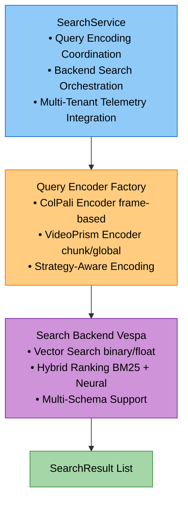
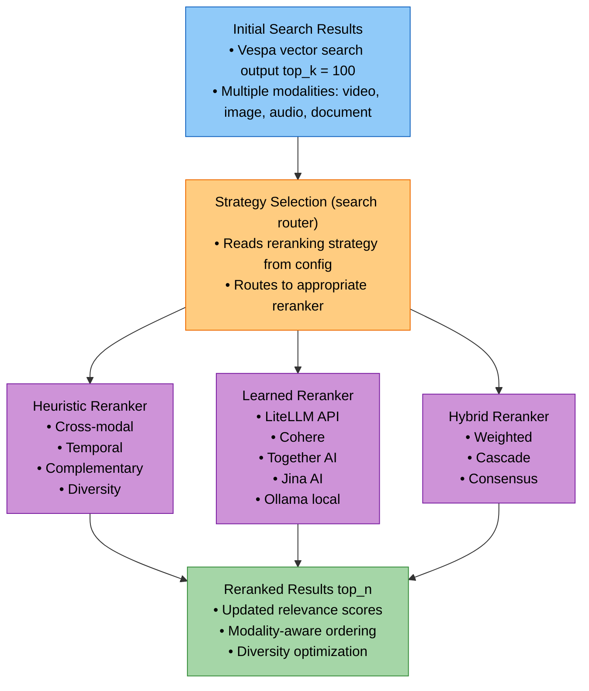

# Search & Reranking Module Study Guide

**Package:** `cogniverse_agents` (Implementation Layer)
**Module Location:** `libs/agents/cogniverse_agents/search/`

---

## Table of Contents
1. [Module Overview](#module-overview)
2. [Architecture](#architecture)
3. [Core Components](#core-components)
4. [Reranking Strategies](#reranking-strategies)
5. [Usage Examples](#usage-examples)
6. [Production Considerations](#production-considerations)
7. [Testing](#testing)

---

## Module Overview

### Purpose
The Search & Reranking Module provides intelligent post-retrieval result optimization for multi-modal video search. It combines heuristic multi-modal analysis with learned neural reranking to improve result quality and relevance.

### Key Features
- **Multi-Modal Reranking**: Cross-modal relevance, temporal alignment, complementarity analysis
- **Learned Reranking**: LiteLLM-based neural rerankers (Cohere, Jina, Together AI, Ollama)
- **Hybrid Fusion**: Weighted ensemble, cascade, and consensus strategies
- **Configurable Backend**: Pure heuristic, pure learned, or hybrid approaches
- **Search Service**: Unified search orchestration with query encoding and backend integration

## Package Structure

```text
libs/agents/cogniverse_agents/search/
├── __init__.py
├── service.py                 # Unified search service
├── multi_modal_reranker.py    # Heuristic multi-modal reranking (MultiModalReranker)
├── learned_reranker.py        # LiteLLM neural reranking
├── hybrid_reranker.py         # Hybrid fusion strategies
├── rerank_service.py          # Strategy selection + dict<->result conversion
├── temporal_query.py          # Query temporal-range extraction (extract_time_range)
├── types.py                   # Shared types (QueryModality, RerankerSearchResult)
└── rerankers/                 # Reserved for future reranker implementations
    └── __init__.py
```

`SearchResult` and `SearchBackend` are **not** defined in this package — `__init__.py`
re-exports them from `cogniverse_sdk` (the canonical home). Earlier byte-identical
duplicates in `cogniverse_agents.search.base` and `cogniverse_runtime.search.base`
have been removed.

---

## Architecture

### Search Service Architecture


```mermaid
flowchart TB
    SearchService["<span style='color:#000'>SearchService<br/>• Query Encoding Coordination<br/>• Backend Search Orchestration<br/>• Multi-Tenant Telemetry Integration</span>"]

    SearchService --> EncoderFactory["<span style='color:#000'>Query Encoder Factory<br/>• ColPali Encoder frame-based<br/>• VideoPrism Encoder chunk/global<br/>• Strategy-Aware Encoding</span>"]

    EncoderFactory --> Backend["<span style='color:#000'>Search Backend Vespa<br/>• Vector Search binary/float<br/>• Hybrid Ranking BM25 + Neural<br/>• Multi-Schema Support</span>"]

    Backend --> Results["<span style='color:#000'>SearchResult List</span>"]

    style SearchService fill:#90caf9,stroke:#1565c0,color:#000
    style EncoderFactory fill:#ffcc80,stroke:#ef6c00,color:#000
    style Backend fill:#ce93d8,stroke:#7b1fa2,color:#000
    style Results fill:#a5d6a7,stroke:#388e3c,color:#000
```

### Reranking Pipeline Architecture


```mermaid
flowchart TB
    InitialResults["<span style='color:#000'>Initial Search Results<br/>• Vespa vector search output top_k = 100<br/>• Multiple modalities: video, image, audio, document</span>"]

    InitialResults --> Strategy["<span style='color:#000'>Strategy Selection (search router)<br/>• Reads reranking strategy from config<br/>• Routes to appropriate reranker</span>"]

    Strategy --> Heuristic["<span style='color:#000'>Heuristic Reranker<br/>• Cross-modal<br/>• Temporal<br/>• Complementary<br/>• Diversity</span>"]
    Strategy --> Learned["<span style='color:#000'>Learned Reranker<br/>• LiteLLM API<br/>• Cohere<br/>• Together AI<br/>• Jina AI<br/>• Ollama local</span>"]
    Strategy --> Hybrid["<span style='color:#000'>Hybrid Reranker<br/>• Weighted<br/>• Cascade<br/>• Consensus</span>"]

    Heuristic --> Reranked["<span style='color:#000'>Reranked Results top_n<br/>• Updated relevance scores<br/>• Modality-aware ordering<br/>• Diversity optimization</span>"]
    Learned --> Reranked
    Hybrid --> Reranked

    style InitialResults fill:#90caf9,stroke:#1565c0,color:#000
    style Strategy fill:#ffcc80,stroke:#ef6c00,color:#000
    style Heuristic fill:#ce93d8,stroke:#7b1fa2,color:#000
    style Learned fill:#ce93d8,stroke:#7b1fa2,color:#000
    style Hybrid fill:#ce93d8,stroke:#7b1fa2,color:#000
    style Reranked fill:#a5d6a7,stroke:#388e3c,color:#000
```

### Hybrid Reranking Strategies


```mermaid
flowchart TB
    subgraph Strategy1["<span style='color:#000'>Strategy: Weighted Ensemble</span>"]
        Heur1["<span style='color:#000'>Heuristic Reranker<br/>score: 0.85<br/>× weight 0.3<br/>= 0.255</span>"]
        Learn1["<span style='color:#000'>Learned Reranker<br/>score: 0.92<br/>× weight 0.7<br/>= 0.644</span>"]
        Heur1 --> Final1["<span style='color:#000'>Final Score<br/>0.255 + 0.644<br/>= 0.899</span>"]
        Learn1 --> Final1
    end

    subgraph Strategy2["<span style='color:#000'>Strategy: Cascade</span>"]
        Step1["<span style='color:#000'>Step 1: Heuristic Filter<br/>100 results<br/>Filter Fast</span>"]
        Step2["<span style='color:#000'>Step 2: Learned Rerank<br/>10 results<br/>Neural Rerank slow</span>"]
        Step1 -->|Top 50%| Step2
        Info1["<span style='color:#000'>Efficient: Reduces expensive<br/>learned model calls</span>"]
    end

    subgraph Strategy3["<span style='color:#000'>Strategy: Consensus</span>"]
        Ranks["<span style='color:#000'>Heuristic Ranks: 1, 5, 3, 10, 2<br/>Learned Ranks: 2, 3, 1, 8, 4</span>"]
        Borda["<span style='color:#000'>Borda Count Scoring<br/>geometric mean</span>"]
        Consensus["<span style='color:#000'>Consensus: Requires agreement from BOTH methods<br/>Result must rank highly in heuristic AND learned</span>"]
        Ranks --> Borda
        Borda --> Consensus
    end

    style Strategy1 fill:#90caf9,stroke:#1565c0,color:#000
    style Heur1 fill:#ffcc80,stroke:#ef6c00,color:#000
    style Learn1 fill:#ffcc80,stroke:#ef6c00,color:#000
    style Final1 fill:#a5d6a7,stroke:#388e3c,color:#000
    style Strategy2 fill:#ce93d8,stroke:#7b1fa2,color:#000
    style Step1 fill:#b0bec5,stroke:#546e7a,color:#000
    style Step2 fill:#b0bec5,stroke:#546e7a,color:#000
    style Info1 fill:#b0bec5,stroke:#546e7a,color:#000
    style Strategy3 fill:#ffcc80,stroke:#ef6c00,color:#000
    style Ranks fill:#b0bec5,stroke:#546e7a,color:#000
    style Borda fill:#b0bec5,stroke:#546e7a,color:#000
    style Consensus fill:#a5d6a7,stroke:#388e3c,color:#000
```

---

## Core Components

### 1. SearchResult (cogniverse_sdk/document.py:229)

```python
class SearchResult:
    """Represents a search result with document and score"""

    def __init__(
        self,
        document: Document,
        score: float,
        highlights: Optional[Dict[str, Any]] = None
    ):
        """
        Initialize search result

        Args:
            document: Document object containing content
            score: Relevance score (0.0-1.0)
            highlights: Optional highlighted snippets
        """
```

**Key Methods:**

- `to_dict() -> Dict[str, Any]`: Convert to API response format with temporal info

**Attributes:**

- `document`: Document object with id, metadata, content

- `score`: Original search score from backend

- `highlights`: Highlighted text snippets for display

---

### 2. SearchBackend (cogniverse_sdk/interfaces/backend.py:109)

```python
class SearchBackend(ABC):
    """Abstract base class for search backends"""

    @abstractmethod
    def initialize(self, config: Dict[str, Any]) -> None:
        """Initialize the search backend with configuration."""

    @abstractmethod
    def search(
        self,
        query_embeddings: Optional[np.ndarray],
        query_text: Optional[str],
        top_k: int = 10,
        filters: Optional[Dict[str, Any]] = None,
        ranking_strategy: Optional[str] = None
    ) -> List[Dict[str, Any]]:
        """
        Execute a search query.

        Args:
            query_embeddings: Optional query embeddings for vector search
            query_text: Optional text query for keyword search
            top_k: Number of results to return
            filters: Optional filters to apply
            ranking_strategy: Optional ranking strategy to use

        Returns:
            List of search results with scores and metadata
        """
```

**Key Methods:**

- `initialize(config: Dict[str, Any]) -> None`: Initialize the backend with configuration

- `get_document(document_id: str) -> Optional[Document]`: Retrieve a specific document

- `batch_get_documents(document_ids: List[str]) -> List[Optional[Document]]`: Retrieve multiple documents by ID

- `get_statistics() -> Dict[str, Any]`: Backend statistics (document count, index size, etc.)

---

### 3. Shared Types (types.py)

```python
class QueryModality(Enum):
    """Content-modality taxonomy for queries and search results."""

    VIDEO = "video"
    IMAGE = "image"
    AUDIO = "audio"
    DOCUMENT = "document"
    TEXT = "text"
    MIXED = "mixed"


@dataclass
class RerankerSearchResult:
    """Search result shape consumed by rerankers for scoring and comparison.

    Distinct from `cogniverse_sdk.document.SearchResult` (Document-object based,
    used for API responses) — this dataclass is the reranker's internal view:
    flat fields for fast access during scoring loops.
    """

    id: str
    title: str
    content: str
    modality: str
    score: float
    metadata: Dict[str, Any]
    timestamp: Optional[datetime] = None
```

`QueryModality` is a closed taxonomy shared with the offline routing/optimization
pipeline (`routing/modality_*` modules, `routing/xgboost_meta_models.py`, dashboards,
`evaluation/quality_monitor.py`) — it doubles as a dict key for per-modality
analytics buckets and XGBoost feature schemas, so adding or removing a value is a
training-contract change for the offline optimization pipeline, not a local edit.

---

### 4. SearchService (service.py:18-280)

```python
class SearchService:
    """Unified search service for video retrieval"""

    def __init__(
        self,
        config: Dict[str, Any],
        config_manager=None,
        schema_loader=None,
    ):
        """
        Initialize search service (profile-agnostic).

        Args:
            config: Configuration dictionary (full config.json content)
            config_manager: ConfigManager instance (REQUIRED - raises ValueError if None)
            schema_loader: SchemaLoader instance (REQUIRED - raises ValueError if None)
        """
        if config_manager is None:
            raise ValueError("config_manager is required")
        if schema_loader is None:
            raise ValueError("schema_loader is required")

        self.config = config
        self.config_manager = config_manager
        self.schema_loader = schema_loader
```

**Key Methods:**

```python
def search(
    self,
    query: str,
    profile: str,
    tenant_id: str,
    top_k: int = 10,
    filters: Optional[Dict[str, Any]] = None,
    ranking_strategy: Optional[str] = None,
) -> List[SearchResult]:
    """
    Search for videos matching the query.

    Args:
        query: Text query
        profile: Backend profile to use (e.g. "video_colpali_smol500_mv_frame")
        tenant_id: Tenant identifier
        top_k: Number of results to return
        filters: Optional filters (date range, etc.)
        ranking_strategy: Optional ranking strategy override

    Returns:
        List of SearchResult objects
    """

def get_document(
    self, document_id: str, tenant_id: str, profile: str
) -> Optional[Dict[str, Any]]:
    """
    Retrieve a specific document by ID.

    Returns a plain dict (document_id, source_id, content_type, metadata,
    temporal_info) rather than a Document/SearchResult object, or None if
    the backend has no matching document.
    """
```

**Integration Points:**

- **Telemetry**: `SearchService.search()` opens `search_span` (whole request) and
  `backend_search_span` (backend call) for multi-tenant tracking.
  Query encoding is delegated to the backend, which opens its own `encode_span`
  only when the resolved ranking strategy actually needs embeddings — encoding
  is no longer performed eagerly in `SearchService` itself.

- **Query Encoder**: `QueryEncoderFactory` for strategy-aware encoding

- **Backend Registry**: `get_backend_registry()` for Vespa backend instantiation

---

### 5. MultiModalReranker (multi_modal_reranker.py:21-383)

```python
class MultiModalReranker:
    """
    Heuristic reranker considering multiple modalities

    Scoring Components:
    - Cross-modal relevance (0.3 weight)
    - Temporal alignment (0.2 weight)
    - Result complementarity (0.2 weight)
    - Diversity bonus (0.15 weight)
    - Original score (0.15 weight)
    """

    def __init__(
        self,
        cross_modal_weight: float = 0.3,
        temporal_weight: float = 0.2,
        complementarity_weight: float = 0.2,
        diversity_weight: float = 0.15,
        original_score_weight: float = 0.15
    ):
        """Weights must sum to 1.0"""
```

**Key Methods:**

```python
async def rerank(
    self,
    query: str,
    results: List[RerankerSearchResult],
    modalities: Optional[List[QueryModality]] = None,
    context: Optional[Dict] = None,
) -> List[RerankerSearchResult]:
    """Uniform reranker entry point shared by all rerankers (MultiModalReranker,
    LearnedReranker, HybridReranker all expose this same signature). Delegates
    to `rerank_results`, defaulting modalities to []. This is what
    `rerank_service.build_reranker(...).rerank(...)` calls regardless of strategy.
    """

async def rerank_results(
    self,
    results: List[RerankerSearchResult],
    query: str,
    modalities: List[QueryModality],
    context: Optional[Dict] = None
) -> List[RerankerSearchResult]:
    """
    Rerank using heuristic multi-modal scoring

    Calculates:
    - Cross-modal alignment (modality compatibility matrix)
    - Temporal alignment (time range matching)
    - Complementarity (unique information contribution)
    - Diversity (modality distribution balance)

    Returns results with updated metadata:
    - reranking_score
    - score_components (breakdown)
    """
```

**Other Methods:**

- `get_modality_distribution(results) -> Dict[str, int]`: Count of results per modality
- `analyze_ranking_quality(results) -> Dict[str, Any]`: Diversity entropy, average score, temporal coverage

**Scoring Logic:**

1. **Cross-Modal Score** (multi_modal_reranker.py:145-186):
   - Direct modality match: 1.0
   - Compatible modalities (video↔image): 0.7
   - Mixed query accepts all: 0.8
   - Unrelated modalities: 0.3

2. **Temporal Score** (multi_modal_reranker.py:188-236):
   - Inside time range (centered): 0.7-1.0
   - <30 days outside: 0.5
   - 30-90 days: 0.3
   - >365 days: 0.1
   - The time range is supplied by `rerank_service` via `temporal_query.extract_time_range(query)`, which returns a `(start, end)` UTC window only for queries matching one of its recognized patterns: `last/past/previous N day(s)/week(s)/month(s)/year(s)`, `last/past/previous day/week/month/year`, `this week/month/year`, `yesterday`, `today`, or `in/from/since/during <YYYY>`. Non-temporal queries get no range, so the score stays neutral (0.5).

3. **Complementarity Score** (multi_modal_reranker.py:238-277):
   - Keyword overlap analysis
   - Low overlap = high complementarity
   - Score = 1.0 - avg_overlap

4. **Diversity Score** (multi_modal_reranker.py:279-312):
   - First result from modality: 1.0
   - Second: 0.8, Third: 0.6, Fourth: 0.4, Fifth+: 0.2

---

### 6. LearnedReranker (learned_reranker.py:28-245)

```python
class LearnedReranker:
    """
    Unified learned reranker using LiteLLM

    Supported Models:
    - Cohere: rerank-english-v3.0
    - Together AI: Llama-Rank (ColBERT-style)
    - Jina AI: jina-reranker-v2-base-multilingual
    - Ollama: bge-reranker-v2-m3, mxbai-rerank-large-v2
    - Any LiteLLM-supported reranker
    """

    def __init__(
        self,
        model: Optional[str] = None,
        tenant_id: str = None,
        config_manager: "ConfigManager" = None
    ):
        """
        Initialize from config.json "reranking" section

        Args:
            model: Model name (e.g., "cohere/rerank-english-v3.0")
                   If None, loads from config.json
            tenant_id: Tenant identifier for config scoping
            config_manager: ConfigManager instance (required)

        Config structure:
        {
          "reranking": {
            "model": "cohere",
            "supported_models": {
              "cohere": "cohere/rerank-english-v3.0",
              "ollama_bge": "openai/bge-reranker-v2-m3"
            },
            "api_base": "http://localhost:11434/v1"  # For Ollama (OpenAI-compat endpoint)
          }
        }
        """
```

**Key Methods:**

```python
async def rerank(
    self,
    query: str,
    results: List[RerankerSearchResult],
    top_n: Optional[int] = None
) -> List[RerankerSearchResult]:
    """
    Rerank using LiteLLM neural model

    Process:
    1. Limit to max_results_to_rerank (default 100)
    2. Prepare documents as "title content" strings
    3. Call LiteLLM arerank API
    4. Map relevance scores back to RerankerSearchResult
    5. Add metadata: reranking_score, reranker_model, original_rank

    Returns:
        Reranked results with neural scores
    """
```

**Other Methods:**

- `rerank_sync(query, results, top_n=None) -> List[RerankerSearchResult]`: Synchronous variant that calls LiteLLM's `rerank` instead of `arerank`
- `get_model_info() -> Dict[str, Any]`: Returns `{"model", "max_results_to_rerank", "default_top_n"}`

**LiteLLM Integration:**

- Unified API for all reranking models

- For Ollama: uses OpenAI-compatible endpoint with custom `api_base`

- On failure, `rerank`/`rerank_sync` log the error and **re-raise** — they do not
  silently fall back to the original order. Callers that want a heuristic
  fallback must catch the exception themselves (see Error Handling below).

---

### 7. HybridReranker (hybrid_reranker.py:26-286)

```python
class HybridReranker:
    """
    Combines heuristic and learned reranking

    Strategies:
    - weighted_ensemble: Parallel scoring with weighted combination
    - cascade: Heuristic filter → learned rerank (efficient)
    - consensus: Borda count requiring agreement from both
    """

    def __init__(
        self,
        heuristic_reranker: Optional[MultiModalReranker] = None,
        learned_reranker: Optional[LearnedReranker] = None,
        strategy: Optional[str] = None,
        learned_weight: Optional[float] = None,
        heuristic_weight: Optional[float] = None
    ):
        """
        Loads from config.json if parameters are None

        Config example:
        {
          "reranking": {
            "hybrid_strategy": "weighted_ensemble",
            "learned_weight": 0.7,
            "heuristic_weight": 0.3
          }
        }
        """
```

**Key Methods:**

```python
async def rerank(
    self,
    query: str,
    results: List[RerankerSearchResult],
    modalities: Optional[List[QueryModality]] = None,
    context: Optional[Dict] = None,
) -> List[RerankerSearchResult]:
    """Uniform reranker entry point shared by all rerankers.

    Delegates to `rerank_hybrid`; callers without modality detection pass
    none and the heuristic/learned scoring degrades gracefully.
    """
```

**Strategy Implementations** (all reached via `rerank_hybrid`, hybrid_reranker.py:129-158):

1. **Weighted Ensemble** (hybrid_reranker.py:160-205):
```python
# Both rerankers run in parallel
heuristic_results = await self.heuristic_reranker.rerank_results(...)
learned_results = await self.learned_reranker.rerank(...)

# Combine scores
final_score = (
    h_score * self.heuristic_weight +
    l_score * self.learned_weight
)

# Metadata includes: heuristic_score, learned_score, fusion_strategy
```

2. **Cascade** (hybrid_reranker.py:207-234):
```python
# Step 1: Heuristic filtering (top 50% or min 10)
heuristic_results = await self.heuristic_reranker.rerank_results(...)
top_k = max(10, len(results) // 2)
filtered = heuristic_results[:top_k]

# Step 2: Learned reranking on filtered set (more efficient)
final_results = await self.learned_reranker.rerank(query, filtered)
```

3. **Consensus** (hybrid_reranker.py:236-286):
```python
# Get both rankings
heuristic_results = await self.heuristic_reranker.rerank_results(...)
learned_results = await self.learned_reranker.rerank(...)

# Create rank maps
heuristic_ranks = {r.id: idx for idx, r in enumerate(heuristic_results)}
learned_ranks = {r.id: idx for idx, r in enumerate(learned_results)}

# Borda count with geometric mean (emphasizes agreement)
h_score = len(results) - h_rank
l_score = len(results) - l_rank
consensus_score = (h_score * l_score) ** 0.5
```

---

### 8. Strategy Selection (search router)

Strategy routing is performed by `rerank_service.py`, which exposes two
functions: `build_reranker()` constructs the live reranker for a named
strategy, and `rerank_result_dicts()` is the async entry point the search
router calls. There is no separate facade class.

```python
# libs/agents/cogniverse_agents/search/rerank_service.py

def build_reranker(strategy: str, tenant_id: str, config_manager=None):
    if strategy == "learned":
        return LearnedReranker(tenant_id=tenant_id, config_manager=config_manager)
    if strategy == "hybrid":
        return HybridReranker(tenant_id=tenant_id, config_manager=config_manager)
    if strategy == "multi_modal":
        return MultiModalReranker()  # heuristic, no config required
    raise ValueError(f"Unknown strategy: {strategy}")

# The search router calls rerank_result_dicts(); ValueError from
# build_reranker surfaces as a 400 response.
reranked_dicts = await rerank_result_dicts(
    query=query, results=result_dicts, strategy=strategy,
    tenant_id=tenant_id, config_manager=config_manager
)
```

**Routing logic:**
- `learned` → `LearnedReranker` (LiteLLM neural reranking)
- `hybrid` → `HybridReranker` (weighted/cascade/consensus fusion)
- `multi_modal` → `MultiModalReranker` (heuristic, no config required)

---

### 9. Evaluation Bridge (cogniverse_evaluation/core/reranking.py)

**Package:** `cogniverse_evaluation` (Core Layer)

The evaluation harness reranks each trace's retrieved results with the same
live reranker the search path ships, via the shared `rerank_result_dicts`
service — so offline metrics measure what production actually does, not a
separate eval-only reranking implementation.

```python
async def apply_reranking_to_traces(
    traces: List[Dict[str, Any]],
    strategy: str,
    config: Optional[Dict[str, Any]] = None,
) -> List[Dict[str, Any]]:
    """Rerank each trace's ``results`` with the live ``strategy`` reranker.

    Args:
        traces: trace dicts, each with a ``query`` and a ``results`` list of dicts.
        strategy: live reranker name ("learned" / "hybrid" / "multi_modal").
        config: optional; reads ``tenant_id`` and ``config_manager`` (needed by
            the learned/hybrid rerankers to load their tenant-scoped settings).

    Returns:
        The same traces, with each ``results`` reordered by the reranker. A
        per-trace failure is logged and leaves that trace's results unchanged
        rather than crashing the whole evaluation run.
    """
```

---

## Reranking Strategies

### Strategy Comparison

Speed figures below are indicative order-of-magnitude estimates for the
underlying call pattern (in-process scoring vs. a network round-trip to a
reranking API/model) — the repo has no pinned latency benchmark for these
numbers.

| Strategy | Speed | Quality | Use Case |
|----------|-------|---------|----------|
| **Pure Heuristic** | ⚡⚡⚡ Fast (5ms) | 🎯 Good | No API costs, interpretable |
| **Pure Learned** | 🐌 Slow (200ms) | 🎯🎯🎯 Excellent | Best quality, API costs |
| **Weighted Ensemble** | 🐌 Slow (200ms) | 🎯🎯🎯 Excellent | Balanced, robust |
| **Cascade** | ⚡⚡ Medium (50ms) | 🎯🎯 Very Good | Efficient learned |
| **Consensus** | 🐌 Slow (200ms) | 🎯🎯 Very Good | High precision |

### Configuration Examples

**Pure Heuristic (No API costs)**:
```json
{
  "reranking": {
    "enabled": true,
    "model": "heuristic",
    "use_hybrid": false
  }
}
```

**Pure Learned (Cohere)**:
```json
{
  "reranking": {
    "enabled": true,
    "model": "cohere",
    "supported_models": {
      "cohere": "cohere/rerank-english-v3.0"
    },
    "top_n": 10,
    "max_results_to_rerank": 100,
    "use_hybrid": false
  }
}
```

**Pure Learned (Ollama Local)**:
```json
{
  "reranking": {
    "enabled": true,
    "model": "ollama_bge",
    "supported_models": {
      "ollama_bge": "openai/bge-reranker-v2-m3"
    },
    "api_base": "http://localhost:11434/v1",
    "use_hybrid": false
  }
}
```

**Hybrid Weighted Ensemble**:
```json
{
  "reranking": {
    "enabled": true,
    "model": "cohere",
    "use_hybrid": true,
    "hybrid_strategy": "weighted_ensemble",
    "learned_weight": 0.7,
    "heuristic_weight": 0.3
  }
}
```

**Hybrid Cascade (Efficient)**:
```json
{
  "reranking": {
    "enabled": true,
    "model": "ollama_bge",
    "supported_models": {
      "ollama_bge": "openai/bge-reranker-v2-m3"
    },
    "api_base": "http://localhost:11434/v1",
    "use_hybrid": true,
    "hybrid_strategy": "cascade"
  }
}
```

---

## Usage Examples

### Example 1: Basic Search with SearchService

```python
from pathlib import Path

from cogniverse_agents.search.service import SearchService
from cogniverse_core.schemas.filesystem_loader import FilesystemSchemaLoader
from cogniverse_foundation.config.utils import create_default_config_manager

# `config` is the full config.json content; SearchService reads `search_backend`
# and `config["backend"]` directly, but profile/URL/port resolution happens
# through `config_manager` at query time (see _get_profile_config/_get_backend),
# so a minimal dict is enough here.
config = {"search_backend": "vespa"}
config_manager = create_default_config_manager()
# SchemaLoader is an abstract interface (cogniverse_sdk.interfaces.schema_loader);
# pass a concrete implementation.
schema_loader = FilesystemSchemaLoader(Path("configs/schemas"))

service = SearchService(
    config,
    config_manager=config_manager,
    schema_loader=schema_loader
)

# Perform search
results = service.search(
    query="Show me videos about quantum computing",
    profile="video_colpali_smol500_mv_frame",
    tenant_id="user_123",
    top_k=10,
)

# Access results
for result in results:
    print(f"Document: {result.document.id}")
    print(f"Score: {result.score}")
    print(f"Metadata: {result.document.metadata}")
```

### Example 2: Heuristic Multi-Modal Reranking

```python
from datetime import datetime
from cogniverse_agents.search.multi_modal_reranker import MultiModalReranker
from cogniverse_agents.search.types import QueryModality

# Initialize reranker
reranker = MultiModalReranker(
    cross_modal_weight=0.3,
    temporal_weight=0.2,
    complementarity_weight=0.2,
    diversity_weight=0.15,
    original_score_weight=0.15
)

# Detect query modalities
modalities = [QueryModality.VIDEO, QueryModality.TEXT]

# Add temporal context
context = {
    "temporal": {
        "time_range": (
            datetime(2024, 1, 1),
            datetime(2024, 12, 31)
        )
    }
}

# Rerank results
reranked = await reranker.rerank_results(
    results=search_results,
    query="quantum computing experiments",
    modalities=modalities,
    context=context
)

# Analyze score breakdown
for result in reranked[:5]:
    print(f"Final Score: {result.metadata['reranking_score']:.3f}")
    print(f"Components: {result.metadata['score_components']}")
```

### Example 3: Learned Reranking with Cohere

```python
from cogniverse_agents.search.learned_reranker import LearnedReranker
from cogniverse_foundation.config.utils import create_default_config_manager

# Initialize with Cohere model
config_manager = create_default_config_manager()
# Option 1: Load model from config.json
reranker = LearnedReranker(
    config_manager=config_manager,
    tenant_id="your_org:production"
)

# Option 2: Override with specific model
reranker = LearnedReranker(
    model="cohere/rerank-english-v3.0",
    config_manager=config_manager,
    tenant_id="your_org:production"
)

# Rerank with neural model
reranked = await reranker.rerank(
    query="quantum computing breakthroughs",
    results=search_results,
    top_n=10
)

# Check model info
info = reranker.get_model_info()  # Returns Dict[str, Any]
print(f"Model: {info['model']}")
print(f"Max rerank: {info['max_results_to_rerank']}")
```

### Example 4: Hybrid Weighted Ensemble

```python
from cogniverse_agents.search.hybrid_reranker import HybridReranker
from cogniverse_agents.search.multi_modal_reranker import MultiModalReranker
from cogniverse_agents.search.learned_reranker import LearnedReranker
from cogniverse_agents.search.types import QueryModality
from cogniverse_foundation.config.utils import create_default_config_manager

# Initialize hybrid reranker
config_manager = create_default_config_manager()
hybrid = HybridReranker(
    heuristic_reranker=MultiModalReranker(),
    learned_reranker=LearnedReranker(
        config_manager=config_manager,
        tenant_id="your_org:production"
    ),
    strategy="weighted_ensemble",
    learned_weight=0.7,
    heuristic_weight=0.3,
    tenant_id="your_org:production",
    config_manager=config_manager
)

# Rerank with hybrid approach
reranked = await hybrid.rerank_hybrid(
    query="machine learning tutorials",
    results=search_results,
    modalities=[QueryModality.VIDEO],
    context={}
)

# Examine fusion details
for result in reranked[:3]:
    metadata = result.metadata
    print(f"Final: {metadata['reranking_score']:.3f}")
    print(f"  Heuristic: {metadata['heuristic_score']:.3f}")
    print(f"  Learned: {metadata['learned_score']:.3f}")
    print(f"  Strategy: {metadata['fusion_strategy']}")
```

### Example 5: Strategy Selection (Production)

```python
import asyncio

from cogniverse_foundation.config.utils import create_default_config_manager

# Initialize config manager (REQUIRED for learned/hybrid)
config_manager = create_default_config_manager()
tenant_id = "your_org:production"

# Mirror the search router: pick the reranker for the configured strategy
strategy = "hybrid"  # one of: "multi_modal", "learned", "hybrid"

if strategy == "learned":
    from cogniverse_agents.search.learned_reranker import LearnedReranker

    reranker = LearnedReranker(tenant_id=tenant_id, config_manager=config_manager)
elif strategy == "hybrid":
    from cogniverse_agents.search.hybrid_reranker import HybridReranker

    reranker = HybridReranker(tenant_id=tenant_id, config_manager=config_manager)
else:  # "multi_modal" — heuristic base, no config needed
    from cogniverse_agents.search.multi_modal_reranker import MultiModalReranker

    reranker = MultiModalReranker()

# rerank() is async and has the same signature on all three reranker classes
reranked = asyncio.run(
    reranker.rerank(query="deep learning frameworks", results=search_results)
)
```

### Example 6: Cascade Strategy for Efficiency

```python
from cogniverse_agents.search.hybrid_reranker import HybridReranker
from cogniverse_agents.search.types import QueryModality
from cogniverse_foundation.config.utils import create_default_config_manager

# Cascade: Fast heuristic filter → Expensive learned rerank
config_manager = create_default_config_manager()
hybrid = HybridReranker(
    strategy="cascade",
    tenant_id="your_org:production",
    config_manager=config_manager
)

# This processes 100 results → filters to 50 → reranks 50
# Much faster than reranking all 100 with learned model
reranked = await hybrid.rerank_hybrid(
    query="neural networks",
    results=large_result_set,  # 100 results
    modalities=[QueryModality.TEXT],
    context={}
)

# Only top 50 were sent to expensive learned model
print(f"Reranked {len(reranked)} results efficiently")
```

---

## Production Considerations

### Performance Characteristics

The figures below are indicative estimates for the call pattern involved (pure
in-process scoring vs. a network round-trip to an external API or local model
server) — the repo has no pinned latency benchmark for reranking, so treat
these as starting points to validate against your own deployment.

**Heuristic Reranking**:

- Latency: 5-10ms for 100 results
- Memory: Minimal (<10MB)
- CPU: Low overhead
- Cost: Free (no API calls)

**Learned Reranking (Cohere)**:

- Latency: 200-500ms for 100 results
- Memory: Minimal (API call)
- Cost: ~$0.002 per 1000 docs
- Rate limits: API-dependent

**Learned Reranking (Ollama Local)**:

- Latency: 100-300ms for 100 results
- Memory: 2-4GB (model loaded)
- CPU/GPU: Medium-High
- Cost: Free (local inference)

**Hybrid Cascade**:

- Latency: 50-150ms for 100→50 results
- Best balance of speed and quality
- Reduces learned model calls by 50%

### Scalability Strategies

1. **Result Limiting**:
```python
# Only rerank top N from initial search
reranker.max_results_to_rerank = 100  # Don't rerank 1000s
```

2. **Cascade for Efficiency**:
```python
# Use cascade to reduce expensive calls
hybrid_reranker.strategy = "cascade"  # Fast filter → learned rerank
```

3. **Async Batch Processing**:
```python
# Rerank multiple queries concurrently
tasks = [
    reranker.rerank(query, results)
    for query, results in query_result_pairs
]
reranked_batches = await asyncio.gather(*tasks)
```

4. **Caching Reranking Results**:
```python
# Cache reranked results for frequent queries
cache_key = f"rerank:{query_hash}:{result_ids_hash}"
cached = await cache.get(cache_key)
if cached:
    return cached
reranked = await reranker.rerank(query, results)
await cache.set(cache_key, reranked, ttl=3600)
```

### Monitoring and Metrics

```python
# Track reranking performance using search_span
from cogniverse_foundation.telemetry.context import search_span

with search_span(
    tenant_id="user_123",
    query=query,
    top_k=100,
    ranking_strategy="hybrid_weighted"
) as span:
    reranked = await reranker.rerank(query, results, modalities, context)

    # Add metrics to span
    span.set_attribute("reranked_count", len(reranked))
    span.set_attribute("top_score", reranked[0].metadata['reranking_score'])
```

### Error Handling

```python
try:
    reranked = await learned_reranker.rerank(query, results)
except Exception as e:
    logger.error(f"Learned reranking failed: {e}")
    # Fallback to heuristic
    reranked = await heuristic_reranker.rerank_results(
        results, query, modalities, context
    )
```

### Configuration Best Practices

1. **Start with Heuristic**: No costs, good baseline
2. **Add Learned for Critical Queries**: Use cascade to manage costs
3. **Monitor Quality**: Track click-through rates, user satisfaction
4. **A/B Test Strategies**: Compare weighted_ensemble vs cascade vs consensus
5. **Tune Weights**: Adjust `learned_weight` based on quality metrics

---

## Testing

### Unit Tests

**Location**: `tests/routing/unit/` and `tests/evaluation/unit/`

**Key Test Files**:

- `tests/routing/unit/test_multi_modal_reranker.py`: Heuristic scoring logic (`TestMultiModalReranker`, `TestRankingDiversity`)
- `tests/routing/unit/test_learned_reranker.py`: `LearnedReranker` config loading, `rerank`/`rerank_sync`/`get_model_info` (mocked LiteLLM)
- `tests/routing/unit/test_learned_reranker_integration.py`: End-to-end learned + hybrid reranking scenarios (`TestLearnedRerankingIntegration`, `TestHybridRerankingIntegration`, `TestRerankingOAICompat`, `TestRerankingCorrectsRetrievalOrder`) — named "integration" but lives in `unit/` and mocks LiteLLM
- `tests/evaluation/unit/test_reranking.py`: `apply_reranking_to_traces` evaluation bridge (reorders trace results, no-op on unknown strategy, timestamp parsing)

**Example Test** (adapted from `tests/routing/unit/test_multi_modal_reranker.py::test_cross_modal_score`):
```python
from cogniverse_agents.search.multi_modal_reranker import MultiModalReranker
from cogniverse_agents.search.types import QueryModality, RerankerSearchResult

# Note: There are TWO distinct result classes:
# 1. cogniverse_sdk.document.SearchResult (Document-object based, for API
#    responses; re-exported from cogniverse_agents.search)
# 2. cogniverse_agents.search.types.RerankerSearchResult (dataclass, for reranking)

def test_cross_modal_score():
    """Test cross-modal scoring logic (see tests/routing/unit/test_multi_modal_reranker.py)"""
    reranker = MultiModalReranker()

    # Create test result using RerankerSearchResult dataclass
    result = RerankerSearchResult(
        id="v1",
        title="Test",
        content="Content",
        modality="video",
        score=0.8,
        metadata={}
    )

    # Direct modality match
    score = reranker._calculate_cross_modal_score(
        result, "query", [QueryModality.VIDEO]
    )
    assert score == 1.0

    # Compatible match (image for video query)
    score = reranker._calculate_cross_modal_score(
        result, "query", [QueryModality.IMAGE]
    )
    assert score == 0.7
```

### Integration Tests

**Location**: `tests/routing/unit/test_learned_reranker_integration.py` and
`tests/evaluation/unit/test_reranking.py` (there is no `tests/routing/integration/`
suite dedicated to reranking; that directory covers deep-research, feature, and
trace-connectivity integration instead).

**Test Scenarios** (`test_learned_reranker_integration.py`):
1. Learned reranker against a mocked LiteLLM response, and against a local OAI-compatible model (`TestLearnedRerankingIntegration`)
2. Hybrid weighted-ensemble, cascade, and consensus strategies end-to-end (`TestHybridRerankingIntegration`)
3. OpenAI-compatible local reranker endpoint (`TestRerankingOAICompat`)
4. Reranker promotes the correct answer over a misleading top hit from initial retrieval (`TestRerankingCorrectsRetrievalOrder`)

**Example** (adapted from `TestHybridRerankingIntegration.test_hybrid_weighted_ensemble`):
```python
@pytest.mark.asyncio
async def test_hybrid_weighted_ensemble(sample_results, mock_config_manager):
    hybrid_reranker = HybridReranker(
        strategy="weighted_ensemble",
        tenant_id="test:unit",
        config_manager=mock_config_manager,
    )

    reranked = await hybrid_reranker.rerank_hybrid(
        query="quantum computing",
        results=sample_results,
        modalities=[QueryModality.VIDEO],
        context={}
    )

    # Verify
    assert len(reranked) == len(sample_results)
    assert all("reranking_score" in r.metadata for r in reranked)
    assert all("fusion_strategy" in r.metadata for r in reranked)

    # Check score monotonicity
    scores = [r.metadata['reranking_score'] for r in reranked]
    assert scores == sorted(scores, reverse=True)
```

### Performance Tests

There is no pinned latency benchmark in the repo for reranking; the snippet
below illustrates how you'd measure it locally (`results`, `query`, and
`modalities` are assumed to come from a prior search call, and
`config_manager`/`tenant_id` follow the same dependency-injection contract as
every other reranker constructor):

```python
import asyncio
import timeit

# Heuristic reranking benchmark
def bench_heuristic():
    reranker = MultiModalReranker()
    asyncio.run(reranker.rerank_results(results, query, modalities, {}))

time = timeit.timeit(bench_heuristic, number=100) / 100
print(f"Heuristic: {time*1000:.1f}ms")

# Learned reranking benchmark
def bench_learned():
    reranker = LearnedReranker(tenant_id=tenant_id, config_manager=config_manager)
    asyncio.run(reranker.rerank(query, results))

time = timeit.timeit(bench_learned, number=10) / 10
print(f"Learned: {time*1000:.1f}ms")  # dominated by the network round-trip to the reranking API/model
```

---

## Related Modules

- **[runtime.md](runtime.md)**: `routers/search.py` (the `/search` route) and `agent_dispatcher.py` construct `SearchService` directly — `SearchAgent` (`cogniverse_agents/search_agent.py`) does its own encoding/backend calls and does not go through `SearchService`
- **[routing.md](routing.md)**: Routes queries to search and selects the reranking strategy
- **[backends.md](backends.md)**: Vespa `SearchBackend` implementation provides the initial search results this module reranks
- **[cache.md](cache.md)**: General-purpose caching infrastructure (filesystem/S3/MinIO backends) that can be used to cache reranked results, as shown in Scalability Strategies above — reranking has no dedicated built-in cache
- **[telemetry.md](telemetry.md)**: `search_span`, `encode_span`, and `backend_search_span` instrument the search/rerank path
- **[evaluation.md](evaluation.md)**: `apply_reranking_to_traces` reruns the live reranker over evaluation traces (see Evaluation Bridge above); `core/solvers.py` also constructs `SearchService` directly to run fresh searches

---

**Study Tips:**

1. Start with `SearchService` to understand end-to-end search flow

2. Experiment with `MultiModalReranker` to understand heuristic scoring

3. Try `LearnedReranker` with Ollama for local neural reranking

4. Compare `HybridReranker` strategies with A/B tests

5. Monitor production performance with telemetry spans

---

**Total Lines:** ~1260
