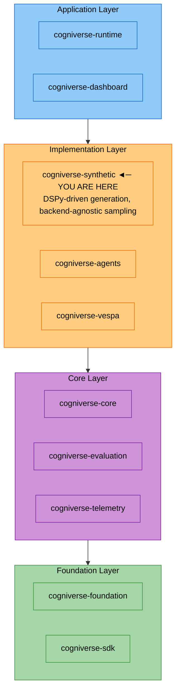

# Synthetic Module

**Package:** `cogniverse_synthetic`
**Location:** `libs/synthetic/cogniverse_synthetic/`

---

## Overview

The Synthetic module provides **training data generation** for DSPy optimizers:

- **DSPy-Driven Generation**: Uses DSPy signatures and modules for LLM-driven query generation
- **Backend-Agnostic Sampling**: Works with any backend implementing the Backend interface
- **Optimizer Support**: Generates data for Modality, CrossModal, Routing, and Workflow optimizers
- **REST API**: FastAPI router for HTTP endpoints

---

## Quick Start

```python
from cogniverse_synthetic import SyntheticDataService
from cogniverse_synthetic.schemas import SyntheticDataRequest
from cogniverse_foundation.config.unified_config import BackendConfig, SyntheticGeneratorConfig

# Initialize service (backend=None uses mock data)
service = SyntheticDataService(
    backend=None,
    backend_config=BackendConfig(backend_type="vespa", profiles={}),
    generator_config=SyntheticGeneratorConfig()
)

# Generate training data
request = SyntheticDataRequest(
    optimizer="modality",
    count=100,
    vespa_sample_size=200,
    strategies=["diverse"]
)
response = await service.generate(request)
print(f"Generated {response.count} examples")
```

---

## Generators

Four generator types are available. See source at `libs/synthetic/cogniverse_synthetic/generators/`.

### ModalityGenerator

```python
from cogniverse_synthetic.generators.modality import ModalityGenerator
from cogniverse_foundation.config.unified_config import OptimizerGenerationConfig

optimizer_config = OptimizerGenerationConfig(optimizer_type="modality")
generator = ModalityGenerator(optimizer_config=optimizer_config)

examples = await generator.generate(
    sampled_content=documents,
    target_count=100,
    modality="VIDEO"
)
# Returns List[ModalityExampleSchema]
```

### RoutingGenerator

```python
from cogniverse_synthetic.generators.routing import RoutingGenerator
from cogniverse_foundation.config.unified_config import OptimizerGenerationConfig

optimizer_config = OptimizerGenerationConfig(optimizer_type="routing")
generator = RoutingGenerator(optimizer_config=optimizer_config)

examples = await generator.generate(sampled_content=documents, target_count=75)
# Returns List[RoutingExperienceSchema]
```

### CrossModalGenerator & WorkflowGenerator

```python
from cogniverse_synthetic.generators.cross_modal import CrossModalGenerator
from cogniverse_synthetic.generators.workflow import WorkflowGenerator

# These use default configs
cross_modal = CrossModalGenerator()
workflow = WorkflowGenerator()

examples = await cross_modal.generate(sampled_content=documents, target_count=50)
```

---

## REST API

Include the router in your FastAPI app:

```python
from fastapi import FastAPI
from cogniverse_synthetic.api import router

app = FastAPI()
app.include_router(router, tags=["synthetic"])
```

**Endpoints:**

| Endpoint | Method | Description |
|----------|--------|-------------|
| `/synthetic/generate` | POST | Generate training data |
| `/synthetic/batch/generate` | POST | Batch generation |
| `/synthetic/optimizers` | GET | List available optimizers |
| `/synthetic/optimizers/{optimizer_name}` | GET | Get optimizer config |
| `/synthetic/health` | GET | Health check |

**Example:**

```bash
curl -X POST http://localhost:8000/synthetic/generate \
  -H "Content-Type: application/json" \
  -d '{"optimizer": "modality", "count": 100, "strategies": ["diverse"]}'
```

---

## Configuration

### Environment Variables

```bash
export OPENAI_API_KEY="sk-..."
export LLM_MODEL="gpt-4"
```

### With Real Backend

Requires `BACKEND_URL` and `BACKEND_PORT` environment variables.

```python
from cogniverse_vespa import VespaBackend
from cogniverse_synthetic import SyntheticDataService
from cogniverse_foundation.config.unified_config import BackendConfig, SyntheticGeneratorConfig
from cogniverse_foundation.config.utils import create_default_config_manager
from cogniverse_core.schemas.filesystem_loader import FilesystemSchemaLoader
from pathlib import Path

# Required dependencies
config_manager = create_default_config_manager()
schema_loader = FilesystemSchemaLoader(Path("configs/schemas"))
backend_config = BackendConfig(backend_type="vespa", profiles={})

# Initialize backend with all required params
backend = VespaBackend(
    backend_config=backend_config,
    schema_loader=schema_loader,
    config_manager=config_manager
)

service = SyntheticDataService(
    backend=backend,
    backend_config=backend_config,
    generator_config=SyntheticGeneratorConfig()
)
```

---

## Testing

```bash
# Run synthetic tests
JAX_PLATFORM_NAME=cpu uv run pytest tests/routing/unit/synthetic/ -v

# With coverage
uv run pytest tests/routing/unit/synthetic/ --cov=cogniverse_synthetic
```

---

## Package Structure

```text
cogniverse_synthetic/
├── service.py              # Main SyntheticDataService
├── api.py                  # FastAPI router
├── schemas.py              # Pydantic schemas
├── backend_querier.py      # Backend-agnostic content sampling
├── dspy_signatures.py      # DSPy signatures for LLM generation
├── dspy_modules.py         # Validated DSPy modules
├── registry.py             # Generator registry
├── profile_selector.py     # Profile selection logic
├── generators/
│   ├── base.py             # BaseGenerator abstract class
│   ├── modality.py         # ModalityGenerator
│   ├── cross_modal.py      # CrossModalGenerator
│   ├── routing.py          # RoutingGenerator
│   └── workflow.py         # WorkflowGenerator
├── utils/                  # Utility modules
└── approval/               # HITL approval utilities
```

---

## Architecture Position



**Dependencies:** `cogniverse-sdk`, `cogniverse-foundation`, `dspy-ai`, `pydantic`, `fastapi`

**Dependents:** `cogniverse-runtime`, `cogniverse-agents`

---

## Related

- [Foundation Module](./foundation.md) - Configuration classes
- [Agents Module](./agents.md) - Uses synthetic data for training
- [DSPy Documentation](https://dspy-docs.vercel.app/)
