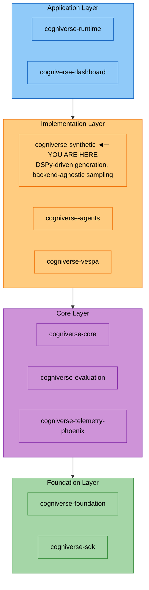

# Synthetic Module

**Package:** `cogniverse_synthetic`
**Location:** `libs/synthetic/cogniverse_synthetic/`

---

## Overview

The Synthetic module provides **training data generation** for DSPy optimizers:

- **DSPy-Driven Generation**: Uses DSPy signatures and modules for LLM-driven query generation
- **Backend-Agnostic Sampling**: Works with any backend implementing the Backend interface
- **Optimizer Support**: Generates data for all seven registered optimizers — `query_enhancement`, `entity_extraction`, `profile`, `routing`, `workflow`, `unified`, and `cross_modal`
- **REST API**: FastAPI router for HTTP endpoints
- **HITL Approval**: Confidence scoring and rejection-feedback regeneration for human-in-the-loop review

---

## Quick Start

```python
from cogniverse_synthetic import SyntheticDataService
from cogniverse_synthetic.schemas import SyntheticDataRequest
from cogniverse_foundation.config.unified_config import BackendConfig, SyntheticGeneratorConfig

# Initialize service (backend=None uses mock data). tenant_id is required on
# both BackendConfig and SyntheticGeneratorConfig — __post_init__ raises via
# require_tenant_id() if it's omitted.
service = SyntheticDataService(
    backend=None,
    backend_config=BackendConfig(tenant_id="acme:production", backend_type="vespa", profiles={}),
    generator_config=SyntheticGeneratorConfig(tenant_id="acme:production")
)

# Generate training data (tenant_id is required on the request too)
request = SyntheticDataRequest(
    optimizer="profile",
    count=100,
    vespa_sample_size=200,
    strategies=["diverse"],
    tenant_id="acme:production"
)
response = await service.generate(request)
print(f"Generated {response.count} examples")
```

### Public API

Everything below is importable directly from `cogniverse_synthetic` (see `__init__.py`):

| Export | What it is |
|--------|------------|
| `SyntheticDataService` | Main orchestrator (`service.py`) |
| `router` | FastAPI `APIRouter`, prefix `/synthetic` (`api.py`) |
| `configure_service(backend, backend_config, generator_config, llm_client)` | Replaces the router's module-level service singleton |
| `OPTIMIZER_REGISTRY`, `OptimizerConfig` | Optimizer-to-generator/schema mapping (`registry.py`) |
| `SyntheticDataRequest`, `SyntheticDataResponse` | API request/response schemas |
| `ProfileSelectionExampleSchema`, `RoutingExperienceSchema`, `WorkflowExecutionSchema` | Per-optimizer training-example schemas |

`QueryEnhancementExampleSchema` and `EntityExtractionExampleSchema` are defined
in `schemas.py` but are not re-exported from `cogniverse_synthetic/__init__.py`;
import them from `cogniverse_synthetic.schemas` (as the generator examples below do).

`SyntheticDataService` also exposes `get_optimizer_info(optimizer_name)` and
`list_all_optimizers()`, which back the `/synthetic/optimizers` endpoints.

---

## Generators

Five generator classes back all seven registered optimizers (see `OPTIMIZER_REGISTRY` in
`registry.py`). `unified` reuses `WorkflowGenerator` and `cross_modal` reuses
`ProfileGenerator` — `SyntheticDataService._get_generator()` maps them explicitly.
See source at `libs/synthetic/cogniverse_synthetic/generators/`.

| Optimizer | Generator | Schema |
|-----------|-----------|--------|
| `query_enhancement` | `QueryEnhancementGenerator` | `QueryEnhancementExampleSchema` |
| `entity_extraction` | `EntityExtractionGenerator` | `EntityExtractionExampleSchema` |
| `profile` | `ProfileGenerator` | `ProfileSelectionExampleSchema` |
| `cross_modal` | `ProfileGenerator` | `ProfileSelectionExampleSchema` |
| `routing` | `RoutingGenerator` | `RoutingExperienceSchema` |
| `workflow` | `WorkflowGenerator` | `WorkflowExecutionSchema` |
| `unified` | `WorkflowGenerator` | `WorkflowExecutionSchema` |

### EntityExtractionGenerator

Pattern-based (no LM). Extracts typed entities from sampled-content text with a
capitalization heuristic (`text` + `type` per entity, plus optional
`relationships`), so the `entity_extraction` optimizer learns to extract
entities. The entity shape matches what the finetuning evaluator
(`adapter_evaluator._check_entity_prediction`) scores.

```python
from cogniverse_synthetic.generators.entity_extraction import (
    EntityExtractionGenerator,
)

generator = EntityExtractionGenerator()
examples = await generator.generate(sampled_content=documents, target_count=100)
# Returns List[EntityExtractionExampleSchema]; each entity has text + type
```

### QueryEnhancementGenerator

Pattern-based (no LM). Builds a base query from a sampled-content topic and an
enhanced query that appends expansion terms drawn from the same content, so the
`query_enhancement` optimizer (`run_simba_optimization`) learns to broaden
queries. The consumer merges each approved demo as a `(query -> enhanced_query)`
`dspy.Example`.

```python
from cogniverse_synthetic.generators.query_enhancement import (
    QueryEnhancementGenerator,
)

generator = QueryEnhancementGenerator()
examples = await generator.generate(sampled_content=documents, target_count=100)
# Returns List[QueryEnhancementExampleSchema]; enhanced_query != query
```

### ProfileGenerator

```python
from cogniverse_synthetic.generators.profile import ProfileGenerator

generator = ProfileGenerator()

examples = await generator.generate(
    sampled_content=documents,
    target_count=100
)
# Returns List[ProfileSelectionExampleSchema]
```

### RoutingGenerator

`RoutingGenerator` requires an `OptimizerGenerationConfig` with a `query_generator`
entry in `dspy_modules` — `generate()` raises `ValueError` without one, since it
uses `ValidatedEntityQueryGenerator` (see `dspy_modules.py`) for entity-rich query
generation and has no fallback config.

```python
from cogniverse_synthetic.generators.routing import RoutingGenerator
from cogniverse_foundation.config.unified_config import (
    DSPyModuleConfig,
    OptimizerGenerationConfig,
)

optimizer_config = OptimizerGenerationConfig(
    optimizer_type="routing",
    dspy_modules={
        "query_generator": DSPyModuleConfig(
            signature_class="cogniverse_synthetic.dspy_signatures.GenerateEntityQuery",
            module_type="Predict",
        )
    },
)
generator = RoutingGenerator(optimizer_config=optimizer_config)

examples = await generator.generate(sampled_content=documents, target_count=75)
# Returns List[RoutingExperienceSchema]
```

### WorkflowGenerator

```python
from cogniverse_synthetic.generators.workflow import WorkflowGenerator

workflow = WorkflowGenerator()

examples = await workflow.generate(sampled_content=documents, target_count=50)
```

---

## REST API

Include the router in your FastAPI app:

```python
from fastapi import FastAPI
from cogniverse_synthetic.api import router

app = FastAPI()
app.include_router(router, tags=["synthetic"])
```

**Endpoints:**

| Endpoint | Method | Description |
|----------|--------|-------------|
| `/synthetic/generate` | POST | Generate training data |
| `/synthetic/batch/generate` | POST | Batch generation |
| `/synthetic/optimizers` | GET | List available optimizers |
| `/synthetic/optimizers/{optimizer_name}` | GET | Get optimizer config |
| `/synthetic/health` | GET | Health check |

**Example:**

```bash
curl -X POST http://localhost:8000/synthetic/generate \
  -H "Content-Type: application/json" \
  -d '{"optimizer": "profile", "count": 100, "strategies": ["diverse"], "tenant_id": "acme:production"}'
```

`/synthetic/batch/generate` takes its parameters as query params, not a JSON
body, and also requires `tenant_id`:

```bash
curl -X POST "http://localhost:8000/synthetic/batch/generate?optimizer=profile&count_per_batch=100&num_batches=5&tenant_id=acme:production"
```

---

## Configuration

### Environment Variables

`cogniverse_synthetic` itself never reads these directly — `RoutingGenerator`
calls `dspy.ChainOfThought`/`dspy.Predict` against whatever LM the caller
configured via `dspy.configure(lm=...)` (e.g. `optimization_cli.py` building an
LM from `create_dspy_lm()`). These are the env vars that flow into that LM:

```bash
export ROUTER_OPTIMIZER_TEACHER_KEY="your-api-key"  # Works with any LiteLLM-supported provider
export LLM_MODEL="claude-3-5-sonnet-20241022"
```

### With Real Backend

Requires `BACKEND_URL` and `BACKEND_PORT` environment variables.

```python
from cogniverse_vespa import VespaBackend
from cogniverse_synthetic import SyntheticDataService
from cogniverse_foundation.config.unified_config import BackendConfig, SyntheticGeneratorConfig
from cogniverse_foundation.config.utils import create_default_config_manager
from cogniverse_core.schemas.filesystem_loader import FilesystemSchemaLoader
from pathlib import Path

# Required dependencies
config_manager = create_default_config_manager()
schema_loader = FilesystemSchemaLoader(Path("configs/schemas"))
backend_config = BackendConfig(tenant_id="acme:production", backend_type="vespa", profiles={})

# Initialize backend with all required params
backend = VespaBackend(
    backend_config=backend_config,
    schema_loader=schema_loader,
    config_manager=config_manager
)

service = SyntheticDataService(
    backend=backend,
    backend_config=backend_config,
    generator_config=SyntheticGeneratorConfig(tenant_id="acme:production")
)
```

---

## Testing

Tests live in two directories: `tests/routing/unit/synthetic/` (generator, registry,
schema, and approval unit tests) and `tests/synthetic/` (unit + real-boundary
integration tests for the API and service).

```bash
# Run synthetic tests
JAX_PLATFORM_NAME=cpu uv run pytest tests/routing/unit/synthetic/ tests/synthetic/ -v

# With coverage
uv run pytest tests/routing/unit/synthetic/ tests/synthetic/ --cov=cogniverse_synthetic
```

---

## Optimizer Registry

`registry.py` maps each optimizer name to its `OptimizerConfig` (schema class,
generator class name, backend query strategy, sample/generation-count defaults):

```python
from cogniverse_synthetic import OPTIMIZER_REGISTRY, OptimizerConfig
from cogniverse_synthetic.registry import (
    get_optimizer_config,
    get_optimizer_schema,
    list_optimizers,
    validate_optimizer_exists,
)

list_optimizers()  # {"entity_extraction": "...", "query_enhancement": "...", "routing": "...", "workflow": "...", "profile": "...", "unified": "...", "cross_modal": "..."}
get_optimizer_config("profile")  # OptimizerConfig(name='profile', schema=ProfileSelectionExampleSchema, strategy='diverse')
```

## Profile Selection and Backend Sampling

`ProfileSelector` (`profile_selector.py`) picks which backend profiles to sample
from for a given optimizer — via LLM reasoning when `llm_client` is supplied to
`SyntheticDataService`, otherwise via rule-based scoring keyed on optimizer name
and profile characteristics (`_score_with_default_rules`, or configured
`ProfileScoringRule`s from `SyntheticGeneratorConfig`).

`BackendQuerier` (`backend_querier.py`) samples content from the configured
`Backend` using `query_metadata_documents`, building strategy-specific YQL
(`diverse`, `temporal_recent`, `entity_rich`, `multi_modal_sequences`) and
normalizing results through `FieldMappingConfig`. When `backend=None`, it
generates mock documents instead of querying.

## Approval (`approval/`)

Domain-specific implementations of the HITL approval interfaces from
`cogniverse_core.approval.interfaces`:

- **`SyntheticDataConfidenceExtractor`** (`confidence_extractor.py`) — scores a
  generated example 0-1 from DSPy retry count, entity presence in the query,
  query length, and reasoning presence.
- **`SyntheticDataFeedbackHandler`** (`feedback_handler.py`) — on human
  rejection, reruns `ValidatedEntityQueryGenerator` with corrected
  entities/topics from the reviewer's feedback and returns a regenerated
  `ReviewItem`.

```python
from cogniverse_synthetic.approval import (
    SyntheticDataConfidenceExtractor,
    SyntheticDataFeedbackHandler,
)

confidence = SyntheticDataConfidenceExtractor().extract(example_dict)
```

## Utilities (`utils/`)

- **`PatternExtractor`** (`pattern_extraction.py`) — extracts topics (bigrams/
  trigrams), entities (capitalized/technical terms), temporal patterns, and
  content-type keywords from sampled content, using `FieldMappingConfig` to
  stay schema-agnostic.
- **`AgentInferrer`** (`agent_inference.py`) — infers routing agents from
  modality or content characteristics. Loads its agent roster from the
  `agents` section of `configs/config.json` rather than hardcoding names.

---

## Package Structure

```text
cogniverse_synthetic/
├── service.py              # Main SyntheticDataService
├── api.py                  # FastAPI router + configure_service()
├── schemas.py              # Pydantic schemas (request/response + per-optimizer examples)
├── backend_querier.py      # Backend-agnostic content sampling (BackendQuerier)
├── dspy_signatures.py      # DSPy signatures (GenerateModalityQuery, GenerateEntityQuery, InferAgentFromModality)
├── dspy_modules.py         # ValidatedEntityQueryGenerator (retry-validated DSPy module)
├── registry.py             # OPTIMIZER_REGISTRY, OptimizerConfig
├── profile_selector.py     # ProfileSelector (LLM or rule-based profile scoring)
├── generators/
│   ├── base.py                # BaseGenerator abstract class
│   ├── entity_extraction.py   # EntityExtractionGenerator
│   ├── profile.py             # ProfileGenerator
│   ├── query_enhancement.py   # QueryEnhancementGenerator
│   ├── routing.py             # RoutingGenerator
│   └── workflow.py            # WorkflowGenerator
├── utils/
│   ├── pattern_extraction.py  # PatternExtractor
│   └── agent_inference.py     # AgentInferrer
└── approval/
    ├── confidence_extractor.py  # SyntheticDataConfidenceExtractor
    └── feedback_handler.py      # SyntheticDataFeedbackHandler
```

---

## Architecture Position


```mermaid
flowchart TB
    subgraph AppLayer["<span style='color:#000'>Application Layer</span>"]
        Runtime["<span style='color:#000'>cogniverse-runtime</span>"]
        Dashboard["<span style='color:#000'>cogniverse-dashboard</span>"]
    end

    subgraph ImplLayer["<span style='color:#000'>Implementation Layer</span>"]
        Synthetic["<span style='color:#000'>cogniverse-synthetic ◄─ YOU ARE HERE<br/>DSPy-driven generation, backend-agnostic sampling</span>"]
        Agents["<span style='color:#000'>cogniverse-agents</span>"]
        Vespa["<span style='color:#000'>cogniverse-vespa</span>"]
    end

    subgraph CoreLayer["<span style='color:#000'>Core Layer</span>"]
        Core["<span style='color:#000'>cogniverse-core</span>"]
        Evaluation["<span style='color:#000'>cogniverse-evaluation</span>"]
        Telemetry["<span style='color:#000'>cogniverse-telemetry-phoenix</span>"]
    end

    subgraph FoundationLayer["<span style='color:#000'>Foundation Layer</span>"]
        Foundation["<span style='color:#000'>cogniverse-foundation</span>"]
        SDK["<span style='color:#000'>cogniverse-sdk</span>"]
    end

    AppLayer --> ImplLayer
    ImplLayer --> CoreLayer
    CoreLayer --> FoundationLayer

    style AppLayer fill:#90caf9,stroke:#1565c0,color:#000
    style Runtime fill:#90caf9,stroke:#1565c0,color:#000
    style Dashboard fill:#90caf9,stroke:#1565c0,color:#000
    style ImplLayer fill:#ffcc80,stroke:#ef6c00,color:#000
    style Synthetic fill:#ffcc80,stroke:#ef6c00,color:#000
    style Agents fill:#ffcc80,stroke:#ef6c00,color:#000
    style Vespa fill:#ffcc80,stroke:#ef6c00,color:#000
    style CoreLayer fill:#ce93d8,stroke:#7b1fa2,color:#000
    style Core fill:#ce93d8,stroke:#7b1fa2,color:#000
    style Evaluation fill:#ce93d8,stroke:#7b1fa2,color:#000
    style Telemetry fill:#ce93d8,stroke:#7b1fa2,color:#000
    style FoundationLayer fill:#a5d6a7,stroke:#388e3c,color:#000
    style Foundation fill:#a5d6a7,stroke:#388e3c,color:#000
    style SDK fill:#a5d6a7,stroke:#388e3c,color:#000
```

**Dependencies:** `cogniverse-sdk`, `cogniverse-foundation`, `cogniverse-core`, `dspy-ai`, `pydantic`, `httpx`, `fastapi`

**Dependents:** `cogniverse-runtime`, `cogniverse-agents`, `cogniverse-finetuning` (declared workspace dependencies); `cogniverse-dashboard` also imports it directly at runtime for the optimization and approval-queue tabs

---

## Related

- [Foundation Module](./foundation.md) - Configuration classes
- [Agents Module](./agents.md) - Uses synthetic data for training
- [DSPy Documentation](https://dspy-docs.vercel.app/)
