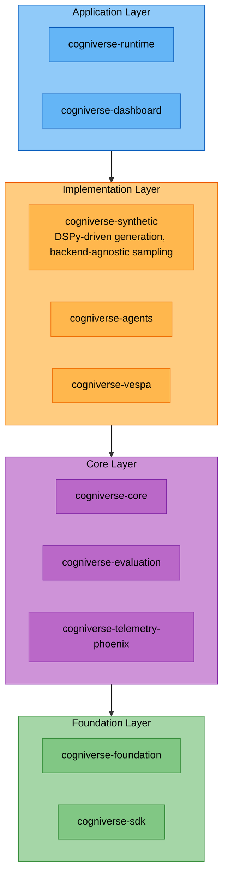

# Synthetic Module

**Package:** `cogniverse_synthetic`
**Location:** `libs/synthetic/cogniverse_synthetic/`

---

## Overview

The Synthetic module provides **training data generation** for DSPy optimizers:

- **Validated Generation**: Uses production agent outputs for entity extraction,
  query enhancement, profile selection, and routing, plus source-grounded local
  workflow plans
- **Backend-Agnostic Sampling**: Works with any backend implementing the Backend interface
- **Optimizer Support**: Generates data for all seven registered optimizers — `query_enhancement`, `entity_extraction`, `profile`, `routing`, `workflow`, `unified`, and `cross_modal`
- **REST API**: FastAPI router for HTTP endpoints
- **HITL Approval**: Confidence scoring and rejection-feedback regeneration for human-in-the-loop review

---

## Quick Start

```python
import json
from pathlib import Path

from cogniverse_synthetic import SyntheticDataService
from cogniverse_synthetic.schemas import SyntheticDataRequest
from cogniverse_foundation.config.unified_config import (
    BackendConfig,
    BackendProfileConfig,
    SyntheticGeneratorConfig,
)


async def generate_training_data(
    backend,
    agents_config: dict,
    profile_labeler,
) -> None:
    raw_config = json.loads(Path("configs/config.json").read_text())
    service = SyntheticDataService(
        backend=backend,
        backend_config=BackendConfig(
            tenant_id="acme:production",
            backend_type="vespa",
            profiles={
                "video_frames": BackendProfileConfig(
                    profile_name="video_frames",
                    type="video",
                    schema_name="video_segments",
                    embedding_type="multi_vector",
                    pipeline_config={"extract_keyframes": True},
                )
            },
        ),
        generator_config=SyntheticGeneratorConfig.from_dict(
            {
                "tenant_id": "acme:production",
                **raw_config["synthetic"],
            }
        ),
        agents_config=agents_config,
        profile_labeler=profile_labeler,
    )
    request = SyntheticDataRequest(
        optimizer="profile",
        count=100,
        vespa_sample_size=200,
        strategy="diverse",
        tenant_id="acme:production",
    )
    response = await service.generate(request)
    print(f"Generated {response.count} examples")
```

`backend` is the initialized search `Backend` for the deployment. The
service rejects a missing backend or an empty profile map; it never fabricates
sampling data.

The `modality` optimizer's `agent_mappings` list is the routing authority.
Every configured backend-profile modality must have one mapping before the
service can access the backend. Mapping targets must exist in `agents_config`,
be explicitly enabled, declare the mapped modality, and provide its canonical
capability: `video_search`, `document_analysis`, `image_search`, or
`audio_analysis`; code requires `coding`, while wiki uses the document agent's
`document_analysis` capability.

`SyntheticDataRequest` canonicalizes a simple tenant such as `acme` to
`acme:acme` and rejects empty, reserved, or schema-unsafe identifiers. Its
strategy must be one of `diverse`, `temporal_recent`, `entity_rich`, or
`multi_modal_sequences`. The obsolete multi-value `strategies` field is
rejected rather than partially executed. These rules are implemented by its
`validate_and_canonicalize_tenant_id()` and `validate_strategy()` Pydantic
validators.

### Public API

Everything below is importable directly from `cogniverse_synthetic` (see `__init__.py`):

| Export | What it is |
|--------|------------|
| `SyntheticDataService` | Main orchestrator (`service.py`) |
| `router` | FastAPI `APIRouter`, prefix `/synthetic` (`api.py`) |
| `configure_service(backend, backend_config, generator_config, agents_config, entity_extractor, routing_decider, query_enhancer, profile_labeler, llm_client)` | Replaces the router's module-level service singleton and binds production labeling boundaries; `query_enhancer` receives `(query, tenant_id, source_text)` |
| `OPTIMIZER_REGISTRY`, `OptimizerConfig` | Optimizer-to-generator/schema mapping (`registry.py`) |
| `SyntheticDataRequest`, `SyntheticDataResponse` | API request/response schemas |
| `ProfileSelectionExampleSchema`, `RoutingExperienceSchema`, `WorkflowExecutionSchema` | Per-optimizer training-example schemas |

`QueryEnhancementExampleSchema` and `EntityExtractionExampleSchema` are defined
in `schemas.py` but are not re-exported from `cogniverse_synthetic/__init__.py`;
import them from `cogniverse_synthetic.schemas` (as the generator examples below do).

`SyntheticDataService.get_optimizer_info(optimizer_name)` backs the optimizer
detail route. The list route reads `registry.list_optimizers()` directly;
`SyntheticDataService.list_all_optimizers()` provides the equivalent mapping to
non-HTTP callers.

---

## Generators

Five generator classes back all seven registered optimizers (see `OPTIMIZER_REGISTRY` in
`registry.py`). `unified` reuses `WorkflowGenerator` and `cross_modal` reuses
`ProfileGenerator` — `SyntheticDataService._get_generator()` maps them explicitly.
See source at `libs/synthetic/cogniverse_synthetic/generators/`.

| Optimizer | Generator | Schema |
|-----------|-----------|--------|
| `query_enhancement` | `QueryEnhancementGenerator` | `QueryEnhancementExampleSchema` |
| `entity_extraction` | `EntityExtractionGenerator` | `EntityExtractionExampleSchema` |
| `profile` | `ProfileGenerator` | `ProfileSelectionExampleSchema` |
| `cross_modal` | `ProfileGenerator` | `ProfileSelectionExampleSchema` |
| `routing` | `RoutingGenerator` | `RoutingExperienceSchema` |
| `workflow` | `WorkflowGenerator` | `WorkflowExecutionSchema` |
| `unified` | `WorkflowGenerator` | `WorkflowExecutionSchema` |

### BaseGenerator

`BaseGenerator` defines the async `generate()` contract implemented by every
generator, accepting sampled content, a target count, and generator-specific
keyword arguments. Its shared `validate_inputs()` requires a positive integer
count and a non-empty list containing only mapping records. The shared exact
count check, `require_exact_target_count()`, lets grounded generators reject
partial training sets with source context. `get_generator_info()` reports the
concrete generator name and whether pattern extraction or agent inference
helpers were supplied.

Direct construction of routing, profile-selection, and query-enhancement
generators exposes a positive, finite `production_label_timeout_seconds`
setting. Direct entity-extraction construction uses the equivalent
`extraction_timeout_seconds` setting. `SyntheticDataService` does not use those
constructor defaults for synthetic generation: it retains the validated active
`agents_config` for normal agent requests, but wires the shared
`synthetic_generation_timeout_seconds` deadline below when each synthetic
generator is first requested.

| Config source | Bounded work |
|--------------|--------------|
| `synthetic_generation_timeout_seconds` | Routing decision callback and synchronous DSPy query generation |
| `synthetic_generation_timeout_seconds` | Direct entity generation and routing's nested entity generation |
| `synthetic_generation_timeout_seconds` | Query-enhancement callback |
| `synthetic_generation_timeout_seconds` | Profile and cross-modal selection callbacks |

A missing, non-numeric, non-finite, boolean, or non-positive synthetic
generation timeout fails before the generator is published to the service
cache. Each production callback runs under that shared deadline. A hung
callback raises with its operation and source context; callback exceptions
retain their original cause. No path returns a default label or partial
dataset after a callback failure.

### EntityExtractionGenerator

Labels sampled-content text through the configured production entity-extraction
agent. The generator retains the agent's exact `text` and normalized `type`
pairs, converts its relationships to the training schema, and rejects malformed
or mismatched agent output. Every entity text must occur with identical casing
as a complete source-text span; partial tokens, embedded substrings, and altered
casing are invalid, while punctuation inside an exact span such as
`Washington, D.C.` is preserved. Each agent call is bounded by the generator's
positive, finite `extraction_timeout_seconds` value (300 seconds by default),
and an outage or timeout aborts the request without returning partial labels.
If fewer unique source texts contain entities than the requested count, the
generator reports the exact shortfall and returns no partial dataset.
This keeps generated labels identical to the behaviour being optimized instead
of inferring types from capitalization. The entity shape matches what the
finetuning evaluator (`adapter_evaluator._check_entity_prediction`) scores.

```python
from cogniverse_agents.entity_extraction_agent import (
    EntityExtractionAgent,
    EntityExtractionDeps,
    EntityExtractionInput,
)
from cogniverse_synthetic.generators.entity_extraction import (
    EntityExtractionGenerator,
)

agent = EntityExtractionAgent(deps=EntityExtractionDeps())


async def extract_entities(text: str, tenant_id: str):
    return await agent.process(
        EntityExtractionInput(query=text, tenant_id=tenant_id)
    )


generator = EntityExtractionGenerator(entity_extractor=extract_entities)


async def generate_examples(documents: list[dict]):
    return await generator.generate(
        sampled_content=documents,
        target_count=100,
        tenant_id="acme:production",
    )
```

### QueryEnhancementGenerator

Builds unique source-grounded queries from sampled content, then invokes the
production query-enhancement agent for each query. The generated label copies
the agent's changed `enhanced_query`, expansion terms, synonyms, and reasoning;
it rejects a mismatched original query or malformed output. The
`query_enhancement` optimizer (`run_simba_optimization`) consumes each approved
demo as a `(query -> enhanced_query)` `dspy.Example`.

```python
from cogniverse_synthetic.generators.query_enhancement import (
    QueryEnhancementGenerator,
)


async def generate_examples(documents: list[dict], query_enhancer):
    generator = QueryEnhancementGenerator(
        query_enhancer=query_enhancer,
        production_label_timeout_seconds=300.0,
    )
    return await generator.generate(
        sampled_content=documents,
        target_count=100,
        tenant_id="acme:production",
    )
```

Query-enhancement examples deliberately omit `confidence` because it is not a
training target. The approval extractor assigns the review sentinel `0.0` and
requires human review. The generator preserves the production agent's synonyms
instead of inventing them from source text. Expansion terms are different: each
one must be a literal term drawn from the sampled source text for that example.
A production response containing an unrelated expansion term raises with the
tenant and query instead of creating self-fulfilling training data.

### ProfileGenerator

```python
from cogniverse_synthetic.generators.profile import ProfileGenerator

profile_configs = {
    "audio_semantic": {
        "type": "audio",
        "schema_name": "audio_segments",
        "embedding_type": "multi_vector",
        "pipeline_config": {"transcribe_audio": True},
    }
}


async def generate_examples(documents: list[dict], profile_labeler):
    generator = ProfileGenerator(
        profile_labeler=profile_labeler,
        production_label_timeout_seconds=300.0,
    )
    return await generator.generate(
        sampled_content=documents,
        target_count=100,
        profile_configs=profile_configs,
        tenant_id="acme:production",
    )
```

Configured backend profiles form the candidate universe. With a live backend,
the service checks each base schema with
`schema_exists(base_schema, tenant_id=...)` and uses only that tenant's deployed
profiles for selection, sampling, and generated `available_profiles` values.
Every explicit profile must contain a non-empty string `schema_name`; an absent,
blank, or non-string value raises with the profile identifier before any backend
operation. The service never substitutes `profile_name` for invalid configuration.
Generation also requires a canonical profile `type`: `audio`, `code`,
`document`, `image`, `text`, `video`, or `wiki`. The production
profile-selection agent supplies the selected profile, reasoning, query intent,
modality, and complexity. The generator validates those categorical fields
centrally and requires the returned modality to equal the selected profile's
configured type; it never infers a training label from a profile name or
substitutes video traits. An empty profile universe is invalid.
Each grounded query is built from a single sampled document. The topic is that
document's own `description` or `transcript` when present, falling back to
`topic`, `title`, then `video_title`, truncated to 20 words, and rendered
through the query template for the source profile's type (a video source yields
`find a video frame showing {topic}`). Distinct segments of one source are
therefore distinct grounded examples. A sampled document carrying a
`schema_name` selects its own profile's template; without one, generation
requires exactly one configured profile.
Profile-selection examples omit `confidence` because it is not a training
target. The approval extractor therefore assigns `0.0` and requires human
review.

`cross_modal` uses the same output schema but a distinct generation path. Every
query combines literal topics from sampled content belonging to two different
configured schemas. The production selector still chooses one backend profile,
so the example records that profile's single configured modality and the
selector's exact query intent rather than inventing combined categorical
values. The service selects at most one profile per modality before sampling,
even when two higher-scoring profiles share a modality. Generation fails when
either the configured profiles or the sampled source content contains fewer
than two modalities.
Generator instances are initialized once per service even when concurrent
requests arrive during a cold start; a constructor failure is not cached, so a
later request can retry.

### RoutingGenerator

`RoutingGenerator` requires production entity-extraction and routing-decision
callbacks plus an `OptimizerGenerationConfig`; its constructor raises
`ValueError` when any is absent. Generation also requires a `query_generator`
entry in `dspy_modules` and raises `ValueError` when the entry is absent. It uses
`ValidatedEntityQueryGenerator` (see `dspy_modules.py`) for entity-rich query
generation and has no fallback config.

```python
from cogniverse_synthetic.generators.routing import RoutingGenerator
from cogniverse_synthetic.utils import PatternExtractor
from cogniverse_foundation.config.unified_config import (
    DSPyModuleConfig,
    OptimizerGenerationConfig,
)


async def generate_examples(documents: list[dict], entity_extractor, routing_decider):
    optimizer_config = OptimizerGenerationConfig(
        optimizer_type="routing",
        dspy_modules={
            "query_generator": DSPyModuleConfig(
                signature_class=(
                    "cogniverse_synthetic.dspy_signatures.GenerateEntityQuery"
                ),
                module_type="Predict",
            )
        },
    )
    generator = RoutingGenerator(
        entity_extractor=entity_extractor,
        routing_decider=routing_decider,
        pattern_extractor=PatternExtractor(),
        optimizer_config=optimizer_config,
        production_label_timeout_seconds=300.0,
        entity_extraction_timeout_seconds=300.0,
    )
    return await generator.generate(
        sampled_content=documents,
        target_count=75,
        tenant_id="acme:production",
    )
```

Each routing example is grounded in one sampled item. Generation walks through
the sampled items in their returned order, gets typed entities and relationships
from the production entity agent for only the current item, then generates its
query and executes the production routing decision. A document item therefore
cannot receive entities from a video item or a video route, and the same
invariant holds for every supported modality. Reusing a source is permitted
only when it produces a distinct `(query, entities, chosen_agent)` label; an
exact repeated label fails the request instead of padding the dataset.

Both validation and enhanced query annotation require complete
case-insensitive entity tokens, so an entity such as `Go` does not match
`Google`. Routing passes ordered entity-text and entity-type sequences without
flattening them; only the DSPy signature boundary receives their JSON-array
serialization. A punctuated entity such as `Washington, D.C.` therefore remains
one identity. The synchronous DSPy call runs outside the event-loop thread and
is bounded by the routing production-label deadline. The nested production
entity call uses its separate entity-extraction deadline. Concurrent requests
retain their own entity inputs.
If every generated query fails validation, `ValidatedEntityQueryGenerator`
raises with the retry limit and attempted entities; `RoutingGenerator` wraps
that boundary error with the attempted entities and retains the validation
error as its cause. It never fabricates a template query. LM execution failures
use the same wrapper and exception chaining. An empty entity list is invalid.
Successful output records only `retry_count`, `max_retries`, and `reasoning`
inside `metadata._generation_metadata`; there is no fallback marker. Entity
records contain only the production extractor's source-derived text and type,
never an invented confidence. Because generation does not execute a search or
target agent,
`user_satisfaction` and `reward` remain `None`. `routing_confidence` is the exact
finite confidence observed on the production gateway decision. The
schema-required `search_quality=0.0`, `agent_success=false`, and
`processing_time=0.0` values remain unobserved sentinels.
`metadata._outcome_metadata` records this mixed field-level contract, and the
approval extractor consumes the observed gateway confidence without treating
the other fields as observed outcomes.
If reviewer-driven regeneration changes the query without running the gateway,
the replacement resets routing confidence to the explicit unobserved sentinel;
the confidence extractor consequently keeps that replacement in human review.
Concurrent cold requests share one atomically published validated DSPy query
generator; request-specific entities and entity types remain isolated at the
DSPy boundary.

### DSPy Primitives

`dspy_signatures.py` exposes four reusable DSPy signatures:

- `GenerateModalityQuery` maps `modality`, `topics`, and `context` inputs to a
  natural-language `query`.
- `GenerateEntityQuery` maps `topics`, `entities`, and `entity_types` inputs to
  `reasoning` and a query containing every supplied entity as a complete span.
- `InferAgentFromModality` maps `modality`, `query`, and `available_agents` to
  `agent_name` and `reasoning` outputs.
- `RegenerateSyntheticExample` maps a complete source record, reviewer
  feedback, structured corrections, and the exact output JSON Schema to
  `updates_json`, a strict JSON patch containing only fields that must change.

`ValidatedEntityQueryGenerator.forward(topics, entities, entity_types)` uses
the configured DSPy signature, module type, LM settings, and retry limit.
`entities` and `entity_types` are ordered string sequences with equal lengths;
the module serializes them as JSON arrays for the LM. It accepts only a query
containing every complete case-insensitive entity span.
`ValidatedSyntheticExampleRegenerator.forward(...)` retries malformed model
outputs and returns a `dspy.Prediction` carrying the parsed `updates` patch,
reasoning, and retry metadata. `SyntheticDataFeedbackHandler` applies that patch
to the rejected record, verifies exact reviewer corrections, and validates the
merged record against the supplied Pydantic schema and approved training
contract.

### WorkflowGenerator

```python
from cogniverse_foundation.config.unified_config import AgentMappingRule
from cogniverse_synthetic.generators.workflow import WorkflowGenerator
from cogniverse_synthetic.utils import AgentInferrer


async def generate_examples(documents: list[dict], agents_config: dict):
    workflow = WorkflowGenerator(
        agent_inferrer=AgentInferrer(
            agents_config=agents_config,
            agent_mappings=[
                AgentMappingRule(modality="VIDEO", agent_name="search_agent"),
                AgentMappingRule(modality="DOCUMENT", agent_name="document_agent"),
                AgentMappingRule(modality="IMAGE", agent_name="image_search_agent"),
                AgentMappingRule(modality="AUDIO", agent_name="audio_analysis_agent"),
                AgentMappingRule(modality="CODE", agent_name="coding_agent"),
                AgentMappingRule(modality="WIKI", agent_name="document_agent"),
            ],
        )
    )
    return await workflow.generate(sampled_content=documents, target_count=50)
```

Every sampled document must carry the backend querier's canonical lowercase
`profile_type` and uppercase `modality`, and the two values must match exactly.
The supported pairs are `video`/`VIDEO`, `document`/`DOCUMENT`, `image`/`IMAGE`,
`audio`/`AUDIO`, `code`/`CODE`, and `wiki`/`WIKI`. Schema names and embedding
types are opaque storage identifiers and never participate in modality
inference. Agent sequences use only enabled agent IDs from configuration;
missing, malformed, mismatched, unsupported, or unmapped modalities raise.
Each sample also requires a non-empty topic or title.
Each source yields at most three unique plans: search, summarize, and analyze.
Requests above the unique source-plan capacity fail instead of duplicating a
query with a different workflow identifier.

Workflow examples use a 32-character random suffix in `workflow_id`, making
collisions negligibly likely across repeated or concurrent generation. They are
plans, not execution records: `user_satisfaction` and `error_details` remain
`None`, while the schema-required `execution_time`, `parallel_efficiency`, and
`confidence_score` fields use `0.0` and `success` uses `false` as unobserved
sentinels. `metadata._outcome_metadata.observed` is `false` and documents each
sentinel. `WorkflowIntelligence.record_execution()` rejects these plans before
they can enter execution history, statistics, or learned query patterns; it
also validates the complete required-field semantics before mutating history.
For observed records, the canonical semantics are `observed_duration_seconds`,
`observed_execution_outcome`, `observed_parallel_efficiency`, and
`observed_confidence_score`. Missing, extra, or altered semantic entries are
invalid for either observed state. Historical executions loaded from storage
pass through the same validation and recording path, so persisted synthetic
plans cannot later enter statistics as measured executions.

---

## REST API

Include the router in your FastAPI app:

```python
from fastapi import FastAPI
from cogniverse_synthetic.api import router

app = FastAPI()
app.include_router(router, tags=["synthetic"])
```

**Endpoints:**

| Endpoint | Method | Description |
|----------|--------|-------------|
| `/synthetic/generate` | POST | Generate training data |
| `/synthetic/batch/generate` | POST | Batch generation |
| `/synthetic/optimizers` | GET | List available optimizers |
| `/synthetic/optimizers/{optimizer_name}` | GET | Get optimizer config |
| `/synthetic/health` | GET | Health check |

The corresponding handler functions in `api.py` are
`generate_synthetic_data()`, `generate_batch_synthetic_data()`,
`list_available_optimizers()`, `get_optimizer_details()`, and `health_check()`.
Startup must call `configure_service(...)` with the live backend, non-empty
profile configuration, and an async callback to the production
entity-extraction agent before a handler calls `get_service()`. Optimizers that
label routing, query enhancement, or profile selection also require their
corresponding production callbacks.

The router replaces its configured service under a lock, so concurrent readers
observe one fully constructed instance. Unexpected server exceptions are
logged with their traceback but the HTTP response contains only
`{"detail": "Internal server error"}`. A timeout from the production
profile-selection callback returns HTTP `504` with a
`profile_selection timeout:` detail instead of a bare `500`.

**Example:**

```bash
curl -X POST http://localhost:8000/synthetic/generate \
  -H "Content-Type: application/json" \
  -d '{"optimizer": "profile", "count": 100, "strategy": "diverse", "tenant_id": "acme:production"}'
```

`/synthetic/batch/generate` takes its parameters as query params, not a JSON
body, and also requires `tenant_id`. Every declared query field may occur only
once; repeated values are rejected before optimizer lookup or generation. A
batch request generates one pool of `count_per_batch * num_batches` examples in
one service call, validates query uniqueness across the complete pool, and then
reports deterministic contiguous batch partitions. The total is limited to
10,000 examples. Repeated queries are rejected even when identifiers,
timestamps, or metadata differ; conflicting stable outputs for one query are
also rejected.

```bash
curl -X POST "http://localhost:8000/synthetic/batch/generate?optimizer=profile&count_per_batch=100&num_batches=5&tenant_id=acme:production"
```

---

## Configuration

### Environment Variables

`cogniverse_synthetic` does not read LM environment variables. Configure DSPy's
LM in the caller before routing generation; the runtime optimization CLI builds
that LM from the tenant's resolved configuration. Pass `llm_client` to
`SyntheticDataService` only when choosing which backend profiles to sample
should use LM reasoning instead of rule-based scoring. Generated profile
training labels still come from `profile_labeler`.

### With Real Backend

The `create_default_config_manager()` setup below requires `BACKEND_URL`.
`BACKEND_PORT` is optional and defaults to `8080`.

```python
import json
from pathlib import Path

from cogniverse_vespa import VespaBackend
from cogniverse_synthetic import SyntheticDataService
from cogniverse_foundation.config.unified_config import SyntheticGeneratorConfig
from cogniverse_foundation.config.utils import create_default_config_manager
from cogniverse_core.schemas.filesystem_loader import FilesystemSchemaLoader

# Required dependencies
config_manager = create_default_config_manager()
schema_loader = FilesystemSchemaLoader(Path("configs/schemas"))
backend_config = config_manager.get_backend_config(tenant_id="acme:production")
raw_config = json.loads(Path("configs/config.json").read_text())
agents_config = raw_config["agents"]
generator_config = SyntheticGeneratorConfig.from_dict(
    {"tenant_id": "acme:production", **raw_config["synthetic"]}
)

# Initialize backend with all required params
backend = VespaBackend(
    backend_config=backend_config,
    schema_loader=schema_loader,
    config_manager=config_manager,
)

service = SyntheticDataService(
    backend=backend,
    backend_config=backend_config,
    generator_config=generator_config,
    agents_config=agents_config,
)
```

---

## Testing

Tests live in `tests/routing/unit/synthetic/` and `tests/synthetic/`. Real-service
coverage also lives with the owning boundaries:
`tests/agents/integration/test_replacement_record_store_real_redis.py` exercises
canonical replacement selection in Redis, while
`tests/runtime/integration/test_backend_querier_real_vespa.py` exercises tenant
schema resolution, canonical profile type and modality propagation into
workflow generation, the 90-day temporal cutoff, and exact newest-first
ordering in Vespa.

```bash
# Run synthetic tests
JAX_PLATFORM_NAME=cpu uv run pytest tests/routing/unit/synthetic/ tests/synthetic/ -v --tb=long

# Run the storage-boundary coverage
JAX_PLATFORM_NAME=cpu uv run pytest \
    tests/agents/integration/test_replacement_record_store_real_redis.py \
    tests/runtime/integration/test_backend_querier_real_vespa.py \
    -v --tb=long

# With coverage
uv run pytest tests/routing/unit/synthetic/ tests/synthetic/ --cov=cogniverse_synthetic -v --tb=long
```

---

## Optimizer Registry

`registry.py` maps each optimizer name to its `OptimizerConfig` (schema class,
generator class name, backend query strategy, sample/generation-count defaults):

```python
from cogniverse_synthetic import OPTIMIZER_REGISTRY, OptimizerConfig
from cogniverse_synthetic.registry import (
    get_optimizer_config,
    get_optimizer_schema,
    list_optimizers,
    validate_optimizer_exists,
)

optimizer_config = get_optimizer_config("profile")
assert isinstance(optimizer_config, OptimizerConfig)
assert OPTIMIZER_REGISTRY["profile"] is optimizer_config
assert get_optimizer_schema("profile") is optimizer_config.schema_class
assert validate_optimizer_exists("profile") is True
assert set(list_optimizers()) == set(OPTIMIZER_REGISTRY)
```

## Profile Selection and Backend Sampling

`ProfileSelector.select_profiles()` (`profile_selector.py`) picks which backend
profiles to sample from for a given optimizer — via LM reasoning when
`llm_client` is supplied to `SyntheticDataService`, otherwise via rule-based
scoring keyed on optimizer name and profile characteristics through the
configured `ProfileScoringRule`s in `SyntheticGeneratorConfig`. Rule selection
takes the highest-scoring member of each model family before filling remaining
slots; `cross_modal` first prefers profiles with an explicit
`schema_config.embedding_dim` and then keeps one profile per modality before
backfilling the remaining slots.
`profile_name_contains` and `_model_family` match delimiter-bounded tokens, so
`colpali` does not match `colpaliish`.
When an LM is explicitly configured, a transport failure or malformed response
raises with optimizer context; it does not silently switch algorithms. The
selected list must contain only available profile names, contain no duplicates,
and stay within `max_profiles`. Any violation rejects the entire response rather
than repairing or truncating it.

`BackendQuerier.query_profiles()` (`backend_querier.py`) samples content from
the configured `Backend` using `query_metadata_documents`, building
strategy-specific YQL
(`diverse`, `temporal_recent`, `entity_rich`, `multi_modal_sequences`) and
normalizing results through `FieldMappingConfig`. Profile configuration stores
the required non-empty base schema name. For every read, the querier calls
`Backend.get_tenant_schema_name(tenant_id, base_schema_name)` and uses the
returned concrete schema in both the query argument and the YQL source. The
service first checks each configured base schema with
`Backend.schema_exists(schema_name, tenant_id)` and offers only deployed
profiles to both profile selection and example generation. The requested sample
count is split exactly across the selected profiles; a failed schema lookup,
schema resolution, or profile read fails the request instead of returning an
incomplete dataset. Synchronous backend clients run outside the event-loop
thread. `temporal_recent` filters to the last 90 days and sorts
the epoch-millisecond `creation_timestamp` descending, so the newest matching
document is first. `diverse` requests five times the sample count and
round-robins the results across distinct sources, so adjacent segments of one
source cannot fill the sample.

For `entity_rich`, the backend query remains schema-safe and the returned
documents are filtered by text fields that the selected profile's pipeline
produces: the configured description field when description generation is
enabled and the configured transcript field when transcription is enabled.
Each enabled field must contain non-empty text. A missing required field mapping
fails before a live backend call; a profile that produces neither field is
invalid for an `entity_rich` query.

`PatternExtractor` consumes both normalized semantic fields (`topic`,
`description`, `transcript`) and configured backend field names. Numeric
timestamps accept seconds, milliseconds, microseconds, or nanoseconds and are
normalized to UTC before recency classification. Text and `datetime` values
must carry an explicit timezone offset; naive values are rejected rather than
being treated as UTC. A supplied timestamp that cannot be parsed raises
`ValueError` with the rejected value instead of silently producing default
temporal patterns.

`BackendQuerier.query_by_modality()` accepts only `VIDEO`, `DOCUMENT`, `IMAGE`,
or `AUDIO`, requires an explicit tenant ID, canonicalizes simple IDs, and
queries only configured profiles of that type from the live backend.
Lowercase or mixed-case modalities and modalities without a configured profile
raise before sampling. `query_profiles()` separately rejects unknown sampling
strategies; modality queries use `diverse`. Neither method issues a
tenant-ambiguous wildcard-schema read.

## Approval (`approval/`)

Domain-specific implementations of the HITL approval interfaces from
`cogniverse_core.approval.interfaces`:

- **`SyntheticDataConfidenceExtractor`** (`confidence_extractor.py`) — accepts
  only an exact canonical synthetic-item schema. Initial routing examples carry
  an observed gateway decision and return their native `routing_confidence`;
  observed workflow executions return their native `confidence_score`.
  Profile-selection, query-enhancement, and entity-extraction items have no
  native confidence field, so their explicit review confidence is `0.0` and
  they require human review at every positive threshold. Reviewer-regenerated
  routing items reset gateway confidence to the unobserved `0.0` sentinel, and
  unobserved workflows require their canonical zero/false sentinels; both remain
  in human review. Routing and workflow items must contain the exact canonical
  `metadata._outcome_metadata` contract; missing, malformed, or inconsistent
  outcome metadata raises a contextual `ValueError`.
  `get_confidence_breakdown()` reports the matched schema, native field, exact
  confidence, whether the outcome was observed, and whether review is required.
- **`SyntheticDataFeedbackHandler`** (`feedback_handler.py`) — on human
  rejection, `process_rejection()` passes the complete original record, the
  reviewer's freeform instruction, structured corrections, and the exact
  Pydantic JSON Schema to `ValidatedSyntheticExampleRegenerator`. Entity,
  routing, profile-selection, and query-enhancement records are regenerated by
  the configured DSPy LM outside the event-loop thread; workflow records apply
  only explicit observed-value corrections. Every LM call uses the primary
  model's configured request deadline. Generated values must copy structured
  corrections exactly, validate against the advertised schema and approved
  training contract, and materially change at least one training value.
  Unchanged, invalid, timed-out, and exhausted generations raise with item and
  schema context. Regenerated metadata preserves the generator's
  `retry_count`/`max_retries` separately from
  `regeneration_attempt`/`max_regeneration_attempts`, and routing
  `enhanced_query` uses the same entity annotation as initial generation.

```python
from cogniverse_synthetic.approval import SyntheticDataConfidenceExtractor
from cogniverse_synthetic.schemas import ProfileSelectionExampleSchema

example_dict = ProfileSelectionExampleSchema(
    query="Find a TensorFlow deployment tutorial",
    available_profiles="document_text",
    selected_profile="document_text",
    reasoning="The query requests searchable document text.",
    query_intent="document_search",
    modality="document",
    complexity="simple",
).model_dump()
confidence = SyntheticDataConfidenceExtractor().extract(example_dict)
assert confidence == 0.0
assert SyntheticDataConfidenceExtractor().get_confidence_breakdown(example_dict)[
    "requires_human_review"
] is True
```

## Utilities (`utils/`)

The `cogniverse_synthetic/utils` subpackage contains the content-normalization
and agent-selection helpers used by routing generation.

- **`PatternExtractor`** (`pattern_extraction.py`) — extracts topics (bigrams/
  trigrams), entities (capitalized/technical terms), temporal patterns, and
  content-type keywords from sampled content, using `FieldMappingConfig` to
  stay schema-agnostic. `extract()` returns all four pattern groups;
  `extract_topics()`, `extract_entities()`, `extract_temporal_patterns()`,
  `extract_content_types()`, and `extract_relationships()` expose the
  individual operations.
- **`AgentInferrer`** (`agent_inference.py`) — infers routing agents from
  modality, content characteristics, workflow shape, or task text through
  `infer_from_modality()`, `infer_from_characteristics()`,
  `infer_workflow_sequence()`, and `get_agent_for_task()`.
  `get_compatible_agents()` lists enabled agents declaring the modality and
  `validate_agent_sequence()` checks a proposed workflow. `require_mappings()`
  verifies that every modality the service may sample has an explicit route.
  Agent names come from the explicitly injected top-level `agents_config`
  mapping and the `synthetic.optimizer_configs.modality.agent_mappings` list.
  Dictionary order never selects a route. The package never searches for or
  loads a configuration file. Only entries with `enabled: true` participate.
  Mapping modalities must be unique canonical uppercase `VIDEO`, `DOCUMENT`,
  `IMAGE`, `AUDIO`, `CODE`, or `WIKI` values; their targets must declare both that
  modality and its canonical capability. Duplicate, conflicting, missing,
  disabled, or undeclared targets raise during service construction before
  backend access.
  Workflow roles use explicit roles or semantic capabilities. Content and
  search-task inference require exactly one recognizable source modality.
  Missing or conflicting source modalities raise instead of assuming video,
  and a recognized but unconfigured modality also raises. With the shipped
  configuration, the canonical workflow identifiers are `search_agent`,
  `summarizer_agent`, and `detailed_report_agent`. Validation rejects unknown
  agents and requires any sequence containing a secondary role to begin with a
  configured modality/search agent.

---

## Package Structure

The package's primary implementation paths are
`cogniverse_synthetic/service.py`, `cogniverse_synthetic/schemas.py`,
`cogniverse_synthetic/registry.py`, `cogniverse_synthetic/profile_selector.py`,
`cogniverse_synthetic/backend_querier.py`,
`cogniverse_synthetic/dspy_modules.py`, and
`cogniverse_synthetic/dspy_signatures.py`.

```text
cogniverse_synthetic/
├── __init__.py             # Public package exports
├── service.py              # Main SyntheticDataService
├── api.py                  # FastAPI router + configure_service()
├── schemas.py              # Pydantic schemas (request/response + per-optimizer examples)
├── backend_querier.py      # Backend-agnostic content sampling (BackendQuerier)
├── dspy_signatures.py      # Query, routing, and schema-aware regeneration signatures
├── dspy_modules.py         # Retry-validated query and regeneration modules
├── registry.py             # OPTIMIZER_REGISTRY, OptimizerConfig
├── profile_selector.py     # ProfileSelector (LLM or rule-based profile scoring)
├── generators/
│   ├── __init__.py            # Generator exports
│   ├── base.py                # BaseGenerator abstract class
│   ├── entity_extraction.py   # EntityExtractionGenerator
│   ├── profile.py             # ProfileGenerator
│   ├── query_enhancement.py   # QueryEnhancementGenerator
│   ├── routing.py             # RoutingGenerator
│   └── workflow.py            # WorkflowGenerator
├── utils/
│   ├── __init__.py            # Utility exports
│   ├── pattern_extraction.py  # PatternExtractor
│   └── agent_inference.py     # AgentInferrer
└── approval/
    ├── __init__.py              # Approval exports
    ├── confidence_extractor.py  # SyntheticDataConfidenceExtractor
    └── feedback_handler.py      # SyntheticDataFeedbackHandler
```

---

## Architecture Position


```mermaid
flowchart TB
    subgraph AppLayer["<span style='color:#000'>Application Layer</span>"]
        Runtime["<span style='color:#000'>cogniverse-runtime</span>"]
        Dashboard["<span style='color:#000'>cogniverse-dashboard</span>"]
    end

    subgraph ImplLayer["<span style='color:#000'>Implementation Layer</span>"]
        Synthetic["<span style='color:#000'>cogniverse-synthetic<br/>DSPy-driven generation, backend-agnostic sampling</span>"]
        Agents["<span style='color:#000'>cogniverse-agents</span>"]
        Vespa["<span style='color:#000'>cogniverse-vespa</span>"]
    end

    subgraph CoreLayer["<span style='color:#000'>Core Layer</span>"]
        Core["<span style='color:#000'>cogniverse-core</span>"]
        Evaluation["<span style='color:#000'>cogniverse-evaluation</span>"]
        Telemetry["<span style='color:#000'>cogniverse-telemetry-phoenix</span>"]
    end

    subgraph FoundationLayer["<span style='color:#000'>Foundation Layer</span>"]
        Foundation["<span style='color:#000'>cogniverse-foundation</span>"]
        SDK["<span style='color:#000'>cogniverse-sdk</span>"]
    end

    AppLayer --> ImplLayer
    ImplLayer --> CoreLayer
    CoreLayer --> FoundationLayer

    style AppLayer fill:#90caf9,stroke:#1565c0,color:#000
    style Runtime fill:#64b5f6,stroke:#1565c0,color:#000
    style Dashboard fill:#64b5f6,stroke:#1565c0,color:#000
    style ImplLayer fill:#ffcc80,stroke:#ef6c00,color:#000
    style Synthetic fill:#ffb74d,stroke:#ef6c00,color:#000
    style Agents fill:#ffb74d,stroke:#ef6c00,color:#000
    style Vespa fill:#ffb74d,stroke:#ef6c00,color:#000
    style CoreLayer fill:#ce93d8,stroke:#7b1fa2,color:#000
    style Core fill:#ba68c8,stroke:#7b1fa2,color:#000
    style Evaluation fill:#ba68c8,stroke:#7b1fa2,color:#000
    style Telemetry fill:#ba68c8,stroke:#7b1fa2,color:#000
    style FoundationLayer fill:#a5d6a7,stroke:#388e3c,color:#000
    style Foundation fill:#81c784,stroke:#388e3c,color:#000
    style SDK fill:#81c784,stroke:#388e3c,color:#000
```

**Dependencies:** `cogniverse-sdk`, `cogniverse-foundation`, `cogniverse-core`, `dspy-ai`, `pydantic`, `httpx`, `fastapi`

**Dependents:** `cogniverse-runtime`, `cogniverse-agents`, `cogniverse-finetuning` (declared workspace dependencies); `cogniverse-dashboard` also imports it directly at runtime for the optimization and approval-queue tabs

---

## Related

- [Foundation Module](./foundation.md) - Configuration classes
- [Agents Module](./agents.md) - Uses synthetic data for training
- [DSPy Documentation](https://dspy.ai/)
