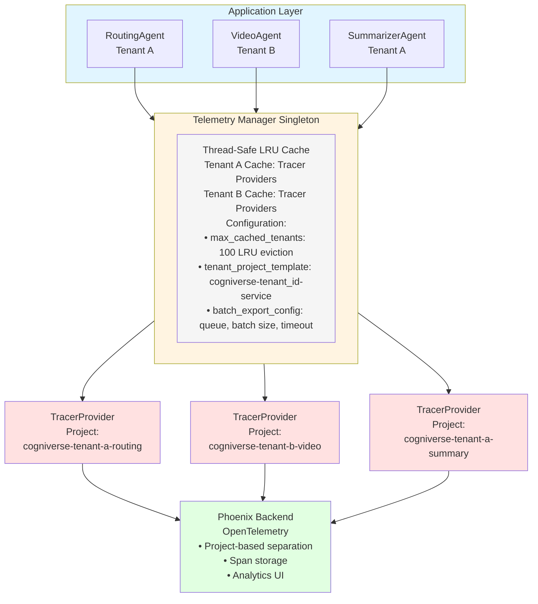
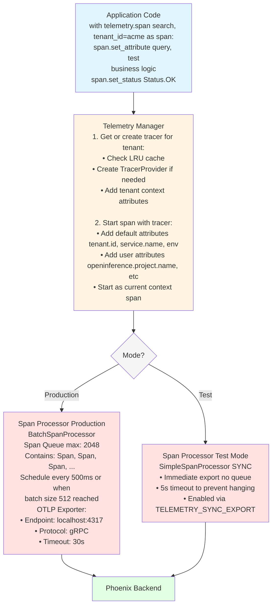

# Telemetry Module Study Guide

**Last Updated:** 2025-10-15
**Package:** `cogniverse_core` (base infrastructure) + `cogniverse_telemetry_phoenix` (Phoenix provider plugin)
**Module Location:**
- Base: `libs/core/cogniverse_core/telemetry/` (telemetry infrastructure)
- Phoenix Provider: `libs/telemetry-phoenix/cogniverse_telemetry_phoenix/` (Phoenix-specific implementation)
**Purpose:** Multi-tenant observability with Phoenix integration for distributed tracing, performance tracking, and modality-specific metrics

**Architecture Note:** As of the phase3-telemetry-foundation branch, Phoenix-specific telemetry is now provided as a **plugin package** (`cogniverse-telemetry-phoenix`) that implements the telemetry interfaces defined in `cogniverse-foundation`. The plugin is auto-discovered via Python entry points, enabling clean separation between telemetry infrastructure (in `cogniverse-core` and `cogniverse-foundation`) and provider-specific implementations (in `cogniverse-telemetry-phoenix`).

---

## Package Structure

### Core Telemetry Infrastructure (cogniverse_core)
```
libs/core/cogniverse_core/telemetry/
├── __init__.py              # Package initialization
├── manager.py               # TelemetryManager singleton
├── config.py                # TelemetryConfig and BatchExportConfig
├── modality_metrics.py      # ModalityMetricsTracker
└── context.py               # Span context helpers
```

### Phoenix Telemetry Plugin (cogniverse_telemetry_phoenix)
```
libs/telemetry-phoenix/cogniverse_telemetry_phoenix/
├── __init__.py              # Package initialization & PhoenixProvider
├── provider.py              # Phoenix telemetry provider implementation
├── traces.py                # Phoenix trace query utilities
├── annotations.py           # Phoenix annotation management
└── evaluation/              # Phoenix evaluation provider
    ├── __init__.py
    └── evaluation_provider.py
```

**Plugin Registration:** The Phoenix provider is auto-discovered via entry points defined in `pyproject.toml`:
```toml
[project.entry-points."cogniverse.telemetry.providers"]
phoenix = "cogniverse_telemetry_phoenix:PhoenixProvider"
```

---

## Table of Contents
1. [Module Overview](#module-overview)
2. [Architecture Diagrams](#architecture-diagrams)
3. [Core Components](#core-components)
4. [Usage Examples](#usage-examples)
5. [Production Considerations](#production-considerations)
6. [Testing](#testing)

---

## Module Overview

### Purpose and Responsibilities

The Telemetry Module provides **multi-tenant observability** infrastructure for the Cogniverse system with:

- **Multi-Tenant Isolation**: Separate Phoenix projects per tenant for data isolation
- **Lazy Initialization**: Tracer providers created on-demand with LRU caching
- **Batch Export**: Configurable batch processing for high-throughput span export
- **Graceful Degradation**: System continues functioning even when telemetry fails
- **Performance Metrics**: Per-modality latency tracking, success rates, and error analysis
- **OpenTelemetry Integration**: Standards-based distributed tracing with Phoenix backend

### Key Features

1. **Singleton Manager Pattern**
   - Thread-safe singleton TelemetryManager
   - Global instance accessible throughout application
   - Configuration from environment variables

2. **Tenant-Aware Tracing**
   - Project-based separation: `cogniverse-{tenant_id}-{service}`
   - LRU cache for tenant providers (configurable max tenants)
   - Automatic tenant context propagation

3. **Flexible Export Modes**
   - **Production**: Batch export with queue management (async)
   - **Testing**: Synchronous export for immediate flush
   - Configurable queue size, batch size, timeout

4. **Modality Performance Tracking**
   - Rolling window metrics (configurable window size)
   - P50/P95/P99 latency percentiles
   - Success rates and error breakdowns
   - Throughput calculation (QPS)

5. **Context Helpers**
   - Pre-built span creators for search, encoding, backend operations
   - Exact format matching with old instrumentation system
   - OpenInference semantic conventions

### Dependencies

**Internal:**
- None (self-contained infrastructure module)

**External:**
- `opentelemetry-sdk`: OpenTelemetry Python SDK
- `opentelemetry-exporter-otlp`: OTLP exporter for Phoenix
- `phoenix`: Phoenix observability platform
- `numpy`: Statistical calculations for metrics

---

## Architecture Diagrams

### 1. Multi-Tenant Telemetry Architecture



**Key Points:**
- Single TelemetryManager instance per application
- Lazy creation of TracerProviders per tenant
- LRU cache evicts old providers when max_cached_tenants exceeded
- Each tenant gets isolated Phoenix project

---

### 2. Span Lifecycle and Export Flow



**Export Modes:**
1. **Production (Batch)**: Async export with queue, scheduled at intervals
2. **Testing (Sync)**: Immediate export for integration tests

**Configuration:**
```python
batch_config = BatchExportConfig(
    max_queue_size=2048,           # Max spans in queue
    max_export_batch_size=512,     # Spans per export
    export_timeout_millis=30_000,  # Export timeout
    schedule_delay_millis=500,     # Export interval
    drop_on_queue_full=True,       # Drop vs block when full
)
```

---

### 3. Phoenix Project Isolation

```mermaid
graph TB
    subgraph Phoenix[Phoenix Backend]
        subgraph Project1[Project: cogniverse-acme-corp-routing]
            Acme1Spans[Spans from Tenant: acme-corp<br/>Service: routing<br/>Span 1: routing | Span 2: search | Span 3: enhance | ...]
        end

        subgraph Project2[Project: cogniverse-acme-corp-video-search]
            Acme2Spans[Spans from Tenant: acme-corp<br/>Service: video-search<br/>Span 1: encode | Span 2: search | Span 3: results | ...]
        end

        subgraph Project3[Project: cogniverse-techstart-routing]
            TechSpans[Spans from Tenant: techstart<br/>Service: routing<br/>Span 1: routing | Span 2: search | Span 3: enhance | ...]
        end

        Info[Project Naming:<br/>Template: cogniverse-tenant_id-service<br/><br/>Benefits:<br/>✓ Complete data isolation per tenant<br/>✓ Independent analytics per tenant<br/>✓ Separate retention policies per tenant<br/>✓ Easy tenant data deletion]
    end

    style Phoenix fill:#e1ffe1
    style Project1 fill:#e1f5ff
    style Project2 fill:#fff4e1
    style Project3 fill:#ffe1e1
    style Acme1Spans fill:#f5f5f5
    style Acme2Spans fill:#f5f5f5
    style TechSpans fill:#f5f5f5
    style Info fill:#f0f0f0
```

**Project Name Resolution:**
```python
def get_project_name(tenant_id: str, service: str) -> str:
    return f"cogniverse-{tenant_id}-{service}"

# Examples:
# tenant="acme-corp", service="routing" → "cogniverse-acme-corp-routing"
# tenant="default", service="video-search" → "cogniverse-default-video-search"
```

---

## Core Components

### 1. TelemetryManager

**File:** `libs/core/cogniverse_core/telemetry/manager.py`

**Purpose:** Singleton manager for multi-tenant tracer providers with lazy initialization and LRU caching.

**Key Attributes:**
```python
_instance: Optional[TelemetryManager]  # Singleton instance
_lock: threading.Lock                   # Thread-safe singleton creation
config: TelemetryConfig                # Telemetry configuration
_tenant_providers: Dict[str, TracerProvider]  # Cached providers per tenant
_tenant_tracers: Dict[str, Tracer]     # Cached tracers per (tenant, service)
_cache_hits: int                        # Cache performance metrics
_cache_misses: int
_failed_initializations: int
```

**Main Methods:**

#### `__new__(cls, config: Optional[TelemetryConfig] = None) -> TelemetryManager`
Thread-safe singleton constructor.

**Parameters:**
- `config`: Optional telemetry configuration (uses env vars if None)

**Returns:** Singleton TelemetryManager instance

**Example:**
```python
# First call creates instance
manager1 = TelemetryManager()

# Subsequent calls return same instance
manager2 = TelemetryManager()
assert manager1 is manager2  # True
```

---

#### `get_tracer(tenant_id: str, service_name: Optional[str] = None) -> Optional[Tracer]`
Get or create tracer for a specific tenant.

**Parameters:**
- `tenant_id`: Tenant identifier for project isolation
- `service_name`: Optional service name override (defaults to config.service_name)

**Returns:**
- `Tracer` instance if telemetry enabled
- `None` if telemetry disabled or initialization failed

**Caching Logic:**
1. Check LRU cache for `{tenant_id}:{service_name}` key
2. If cached, return tracer (cache hit)
3. If not cached:
   - Create TracerProvider for tenant if needed
   - Get tracer from provider
   - Cache tracer with LRU eviction
4. Return tracer or None on error

**Example:**
```python
manager = TelemetryManager()

# Get tracer for tenant
tracer = manager.get_tracer("acme-corp", "routing")

# Use tracer
with tracer.start_as_current_span("process_query") as span:
    span.set_attribute("query", "test")
```

---

#### `span(name: str, tenant_id: str, service_name: Optional[str] = None, attributes: Optional[Dict[str, Any]] = None) -> ContextManager`
Context manager for creating tenant-specific spans.

**Parameters:**
- `name`: Span name (e.g., "search", "cogniverse.routing")
- `tenant_id`: Tenant identifier
- `service_name`: Optional service name
- `attributes`: Optional span attributes

**Automatic Attributes:**
- `tenant.id`: Tenant identifier
- `service.name`: Service name
- `environment`: Environment (development, production)

**Graceful Degradation:**
- If telemetry disabled or fails, yields no-op span
- Application continues normally even when telemetry fails

**Example:**
```python
manager = TelemetryManager()

# Basic span
with manager.span("search", tenant_id="acme-corp") as span:
    span.set_attribute("query", "test")
    results = search(query)
    span.set_attribute("num_results", len(results))

# Span with custom attributes
with manager.span(
    "cogniverse.routing",
    tenant_id="acme-corp",
    attributes={
        "openinference.project.name": "cogniverse-acme-corp-routing",
        "routing.chosen_agent": "video_search"
    }
) as span:
    decision = route_query(query)
```

---

#### `force_flush(timeout_millis: int = 10000) -> bool`
Force flush all spans for all tenants.

**Parameters:**
- `timeout_millis`: Timeout in milliseconds for flush operation

**Returns:** `True` if all flushes succeeded, `False` otherwise

**Usage:** Call before application shutdown or after critical operations in tests

**Example:**
```python
manager = TelemetryManager()

# ... application code ...

# Ensure all spans exported before shutdown
success = manager.force_flush(timeout_millis=5000)
if not success:
    logger.warning("Some spans may not have been exported")
```

---

#### `get_stats() -> Dict[str, Any]`
Get telemetry manager statistics.

**Returns:**
```python
{
    "cache_hits": 150,          # Number of cache hits
    "cache_misses": 10,         # Number of cache misses
    "failed_initializations": 0,  # Failed tracer creations
    "cached_tenants": 5,        # Number of cached providers
    "cached_tracers": 8,        # Number of cached tracers
    "config": {
        "enabled": True,
        "level": "detailed",
        "environment": "production"
    }
}
```

**Example:**
```python
manager = TelemetryManager()
stats = manager.get_stats()
print(f"Cache hit rate: {stats['cache_hits'] / (stats['cache_hits'] + stats['cache_misses']):.2%}")
```

---

### 2. TelemetryConfig

**File:** `libs/core/cogniverse_core/telemetry/config.py`

**Purpose:** Configuration for telemetry system with environment variable support.

**Key Attributes:**
```python
# Core settings
enabled: bool                       # Enable/disable telemetry (default: true)
level: TelemetryLevel              # DISABLED, BASIC, DETAILED, VERBOSE
environment: str                    # development, production

# Phoenix settings
phoenix_enabled: bool               # Enable Phoenix backend (default: true)
phoenix_endpoint: str               # Phoenix collector endpoint (default: localhost:4317)
phoenix_use_tls: bool              # Use TLS for Phoenix connection (default: false)

# Multi-tenant settings
tenant_project_template: str       # "cogniverse-{tenant_id}-{service}"
default_tenant_id: str             # "default"
max_cached_tenants: int            # LRU cache size (default: 100)
tenant_cache_ttl_seconds: int      # Cache TTL (default: 3600)

# Batch export settings
batch_config: BatchExportConfig    # Batch export configuration

# Service identification
service_name: str                  # Service name (default: "video-search")
service_version: str               # Service version (default: "1.0.0")
```

**TelemetryLevel Enum:**
```python
DISABLED = "disabled"   # No telemetry
BASIC = "basic"         # Only search operations
DETAILED = "detailed"   # Search + encoders + backend
VERBOSE = "verbose"     # Everything including internal operations
```

**BatchExportConfig:**
```python
max_queue_size: int = 2048           # Max spans in queue
max_export_batch_size: int = 512     # Spans per export batch
export_timeout_millis: int = 30_000  # Export timeout
schedule_delay_millis: int = 500     # Export interval

# Queue behavior when full
drop_on_queue_full: bool = True      # Drop spans vs block
log_dropped_spans: bool = True
max_drop_log_rate_per_minute: int = 10

# Test mode
use_sync_export: bool = False        # Set via TELEMETRY_SYNC_EXPORT env var
```

**Main Methods:**

#### `from_env() -> TelemetryConfig`
Create configuration from environment variables.

**Environment Variables:**
```bash
TELEMETRY_ENABLED=true              # Enable telemetry
TELEMETRY_LEVEL=detailed            # Telemetry level
ENVIRONMENT=production              # Environment name
PHOENIX_ENABLED=true                # Enable Phoenix
PHOENIX_COLLECTOR_ENDPOINT=localhost:4317
PHOENIX_USE_TLS=false
TELEMETRY_SYNC_EXPORT=false         # Use sync export (tests)
SERVICE_VERSION=1.0.0
```

**Example:**
```python
# Production: read from environment
config = TelemetryConfig.from_env()

# Custom: override defaults
config = TelemetryConfig(
    enabled=True,
    level=TelemetryLevel.DETAILED,
    phoenix_endpoint="phoenix.internal:4317",
    max_cached_tenants=200
)
```

---

#### `get_project_name(tenant_id: str, service: Optional[str] = None) -> str`
Generate project name for a tenant.

**Parameters:**
- `tenant_id`: Tenant identifier
- `service`: Service name (defaults to self.service_name)

**Returns:** Project name formatted with template

**Example:**
```python
config = TelemetryConfig()
project = config.get_project_name("acme-corp", "routing")
# Returns: "cogniverse-acme-corp-routing"
```

---

#### `should_instrument_level(component: str) -> bool`
Check if a component should be instrumented based on level.

**Parameters:**
- `component`: Component name ("search_service", "backend", "encoder", "pipeline", "agents")

**Returns:** `True` if component should be instrumented

**Level-Based Components:**
- `DISABLED`: No components
- `BASIC`: search_service only
- `DETAILED`: search_service, backend, encoder
- `VERBOSE`: All components

**Example:**
```python
config = TelemetryConfig(level=TelemetryLevel.DETAILED)

config.should_instrument_level("search_service")  # True
config.should_instrument_level("backend")         # True
config.should_instrument_level("pipeline")        # False (VERBOSE only)
```

---

### 3. ModalityMetricsTracker

**File:** `libs/core/cogniverse_core/telemetry/modality_metrics.py`

**Purpose:** Track performance metrics per modality (text, video, image, audio) with rolling window statistics.

**Key Attributes:**
```python
window_size: int                              # Rolling window size (default: 1000)
modality_latencies: Dict[QueryModality, List[float]]  # Latency values per modality
modality_errors: Dict[QueryModality, Dict[str, int]]  # Error counts by type
modality_success: Dict[QueryModality, int]    # Success counts
modality_requests: Dict[QueryModality, int]   # Total requests
first_request_time: Dict[QueryModality, datetime]  # First request timestamp
last_request_time: Dict[QueryModality, datetime]   # Last request timestamp
```

**Main Methods:**

#### `record_modality_execution(modality: QueryModality, latency_ms: float, success: bool, error: Optional[str] = None)`
Record execution metrics for a modality.

**Parameters:**
- `modality`: Query modality (TEXT, VIDEO, IMAGE, AUDIO)
- `latency_ms`: Execution latency in milliseconds
- `success`: Whether execution succeeded
- `error`: Error message if failed (optional)

**Rolling Window:** Maintains last `window_size` latencies per modality

**Example:**
```python
tracker = ModalityMetricsTracker(window_size=1000)

# Record successful execution
tracker.record_modality_execution(
    modality=QueryModality.VIDEO,
    latency_ms=234.5,
    success=True
)

# Record failed execution
tracker.record_modality_execution(
    modality=QueryModality.TEXT,
    latency_ms=150.0,
    success=False,
    error="Connection timeout"
)
```

---

#### `get_modality_stats(modality: QueryModality) -> Dict[str, Any]`
Get aggregated statistics for a modality.

**Parameters:**
- `modality`: Query modality

**Returns:**
```python
{
    "modality": "video",
    "total_requests": 1000,
    "success_count": 980,
    "error_count": 20,
    "success_rate": 0.98,
    "p50_latency": 120.5,      # Median latency
    "p95_latency": 450.2,      # 95th percentile
    "p99_latency": 890.7,      # 99th percentile
    "avg_latency": 200.3,
    "min_latency": 45.1,
    "max_latency": 1200.5,
    "error_breakdown": {
        "connection_timeout": 15,
        "invalid_format": 5
    },
    "throughput_qps": 12.5     # Queries per second
}
```

**Example:**
```python
tracker = ModalityMetricsTracker()

# ... record executions ...

stats = tracker.get_modality_stats(QueryModality.VIDEO)
print(f"Video search P95 latency: {stats['p95_latency']:.0f}ms")
print(f"Success rate: {stats['success_rate']:.2%}")
```

---

#### `get_all_stats() -> Dict[str, Dict[str, Any]]`
Get stats for all modalities with activity.

**Returns:** Dictionary mapping modality names to stats (only includes modalities with requests)

**Example:**
```python
tracker = ModalityMetricsTracker()

# ... record executions ...

all_stats = tracker.get_all_stats()
for modality, stats in all_stats.items():
    print(f"{modality}: {stats['total_requests']} requests, {stats['success_rate']:.2%} success")
```

---

#### `get_summary_stats() -> Dict[str, Any]`
Get summary statistics across all modalities.

**Returns:**
```python
{
    "total_requests": 5000,
    "overall_success_rate": 0.96,
    "active_modalities": 3,
    "avg_latency_p95": 350.5,
    "modality_breakdown": {
        "video": 3000,
        "text": 1500,
        "image": 500
    }
}
```

**Example:**
```python
tracker = ModalityMetricsTracker()
summary = tracker.get_summary_stats()
print(f"Overall success rate: {summary['overall_success_rate']:.2%}")
print(f"Active modalities: {summary['active_modalities']}")
```

---

#### `get_slowest_modalities(top_k: int = 3) -> List[Dict[str, Any]]`
Get slowest modalities by P95 latency.

**Parameters:**
- `top_k`: Number of slowest modalities to return

**Returns:** List of `{modality, p95_latency, total_requests}` sorted by P95 latency (descending)

**Example:**
```python
tracker = ModalityMetricsTracker()
slowest = tracker.get_slowest_modalities(top_k=3)
for entry in slowest:
    print(f"{entry['modality']}: P95={entry['p95_latency']:.0f}ms ({entry['total_requests']} requests)")
```

---

#### `get_error_prone_modalities(min_error_rate: float = 0.1) -> List[Dict[str, Any]]`
Get modalities with high error rates.

**Parameters:**
- `min_error_rate`: Minimum error rate to include (0-1, default: 0.1 = 10%)

**Returns:** List of `{modality, error_rate, error_count, error_breakdown}` sorted by error rate (descending)

**Example:**
```python
tracker = ModalityMetricsTracker()
error_prone = tracker.get_error_prone_modalities(min_error_rate=0.05)
for entry in error_prone:
    print(f"{entry['modality']}: {entry['error_rate']:.2%} error rate")
    print(f"  Error breakdown: {entry['error_breakdown']}")
```

---

### 4. Telemetry Context Helpers

**File:** `libs/core/cogniverse_core/telemetry/context.py`

**Purpose:** Pre-built span creators matching old instrumentation format with OpenInference semantic conventions.

**Main Functions:**

#### `search_span(tenant_id: str, query: str, top_k: int = 10, ranking_strategy: str = "default", profile: str = "unknown", backend: str = "vespa") -> ContextManager`
Create search service span.

**Attributes Set:**
- `openinference.span.kind`: "CHAIN"
- `operation.name`: "search"
- `backend`, `query`, `strategy`, `top_k`, `profile`
- `input.value`: JSON-encoded query parameters
- `latency_ms`: Search latency (automatic)

**Example:**
```python
from cogniverse_core.telemetry.context import search_span

with search_span(
    tenant_id="acme-corp",
    query="Marie Curie radioactivity",
    top_k=10,
    ranking_strategy="HYBRID_FLOAT_BM25"
) as span:
    results = vespa_client.search(query)
    span.set_attribute("num_results", len(results))
```

---

#### `encode_span(tenant_id: str, encoder_type: str, query_length: int = 0, query: str = "") -> ContextManager`
Create encoder span.

**Attributes Set:**
- `openinference.span.kind`: "EMBEDDING"
- `operation.name`: `f"encode.{encoder_type.lower()}"`
- `encoder_type`, `query_length`
- `input.value`: Query text
- `encoding_time_ms`: Encoding time (automatic)

**Example:**
```python
from cogniverse_core.telemetry.context import encode_span

with encode_span(
    tenant_id="acme-corp",
    encoder_type="ColPali",
    query="test query"
) as span:
    embeddings = encoder.encode(query)
    span.set_attribute("embedding_dim", embeddings.shape[-1])
```

---

#### `backend_search_span(tenant_id: str, backend_type: str = "vespa", schema_name: str = "unknown", ranking_strategy: str = "default", top_k: int = 10, has_embeddings: bool = False, query_text: str = "") -> ContextManager`
Create backend search span.

**Attributes Set:**
- `openinference.span.kind`: "RETRIEVER"
- `operation.name`: "search.execute"
- `backend`, `query`, `strategy`, `top_k`, `schema`, `has_embeddings`
- `input.value`: JSON-encoded search parameters
- `latency_ms`: Search latency (automatic)

**Example:**
```python
from cogniverse_core.telemetry.context import backend_search_span

with backend_search_span(
    tenant_id="acme-corp",
    schema_name="video_colpali_mv",
    ranking_strategy="BINARY_BINARY",
    top_k=10,
    has_embeddings=True
) as span:
    results = vespa_client.execute_query(yql, embeddings)
    span.set_attribute("num_results", len(results))
```

---

#### `add_search_results_to_span(span, results)`
Add search results details to span.

**Attributes Set:**
- `num_results`: Number of results
- `top_score`: Score of top result

**Events Added:**
- `search_results`: Top 3 results with rank, document_id, video_id, score, content_type

**Example:**
```python
from cogniverse_core.telemetry.context import search_span, add_search_results_to_span

with search_span(tenant_id="acme", query="test") as span:
    results = search(query)
    add_search_results_to_span(span, results)
```

---

#### `@with_telemetry(span_name: str, tenant_id_param: str = "tenant_id", extract_attributes: Optional[Dict[str, str]] = None)`
Decorator for automatic telemetry instrumentation.

**Parameters:**
- `span_name`: Name for the span
- `tenant_id_param`: Function parameter name containing tenant_id (default: "tenant_id")
- `extract_attributes`: Map of span attribute names to function parameter names

**Example:**
```python
from cogniverse_core.telemetry.context import with_telemetry

@with_telemetry(
    span_name="video_search.search",
    extract_attributes={
        "query": "query_text",
        "top_k": "max_results"
    }
)
def search_videos(tenant_id: str, query_text: str, max_results: int = 10):
    # Span automatically created with tenant_id, query, top_k attributes
    return perform_search(query_text, max_results)

# Usage
results = search_videos(tenant_id="acme", query_text="test", max_results=5)
```

---

## Usage Examples

### Example 1: Basic Multi-Tenant Telemetry Setup

```python
"""
Initialize telemetry manager and use it across application.
"""
from cogniverse_core.telemetry import TelemetryManager, TelemetryConfig

# Initialize once at application startup
config = TelemetryConfig(
    enabled=True,
    level=TelemetryLevel.DETAILED,
    phoenix_endpoint="localhost:4317",
    max_cached_tenants=100
)
telemetry = TelemetryManager(config)

# Use in request handlers
def handle_search_request(tenant_id: str, query: str):
    """Process search request with telemetry."""
    with telemetry.span("search_service.search", tenant_id=tenant_id) as span:
        span.set_attribute("query", query)
        span.set_attribute("user_agent", "mobile-app")

        # Business logic
        results = perform_search(query)

        # Add result metrics
        span.set_attribute("num_results", len(results))
        span.set_attribute("top_score", results[0].score if results else 0)

        return results

# Different tenants automatically isolated
results_acme = handle_search_request("acme-corp", "test query")  # → cogniverse-acme-corp-video-search
results_tech = handle_search_request("techstart", "test query")   # → cogniverse-techstart-video-search
```

---

### Example 2: Nested Spans with Context Propagation

```python
"""
Create nested span hierarchy for complex operations.
"""
from cogniverse_core.telemetry import TelemetryManager

telemetry = TelemetryManager()

def process_video_search(tenant_id: str, query: str):
    """Multi-step video search with nested spans."""

    # Parent span for entire search operation
    with telemetry.span(
        "video_search.process",
        tenant_id=tenant_id,
        attributes={"query": query}
    ) as parent_span:

        # Child span: Query encoding
        with telemetry.span(
            "video_search.encode",
            tenant_id=tenant_id,
            attributes={"encoder": "ColPali"}
        ) as encode_span:
            embeddings = encode_query(query)
            encode_span.set_attribute("embedding_dim", embeddings.shape[-1])

        # Child span: Vespa search
        with telemetry.span(
            "video_search.vespa_search",
            tenant_id=tenant_id,
            attributes={
                "schema": "video_colpali_mv",
                "ranking": "BINARY_BINARY"
            }
        ) as search_span:
            results = vespa_client.search(embeddings)
            search_span.set_attribute("num_results", len(results))

        # Child span: Post-processing
        with telemetry.span(
            "video_search.postprocess",
            tenant_id=tenant_id
        ) as postprocess_span:
            filtered_results = filter_results(results)
            postprocess_span.set_attribute("filtered_count", len(filtered_results))

        parent_span.set_attribute("total_results", len(filtered_results))
        return filtered_results
```

**Resulting Phoenix trace hierarchy:**
```
video_search.process (parent)
├── video_search.encode
├── video_search.vespa_search
└── video_search.postprocess
```

---

### Example 3: Using Context Helpers for Standard Operations

```python
"""
Use pre-built context helpers for common operations.
"""
from cogniverse_core.telemetry.context import search_span, encode_span, backend_search_span

def search_videos_with_telemetry(tenant_id: str, query: str):
    """Search with standardized telemetry spans."""

    # High-level search span
    with search_span(
        tenant_id=tenant_id,
        query=query,
        top_k=10,
        ranking_strategy="HYBRID_FLOAT_BM25",
        profile="video_colpali_mv"
    ) as span:

        # Encoding span
        with encode_span(
            tenant_id=tenant_id,
            encoder_type="ColPali",
            query=query
        ) as enc_span:
            embeddings = colpali_encoder.encode(query)

        # Backend search span
        with backend_search_span(
            tenant_id=tenant_id,
            schema_name="video_colpali_mv_frame",
            ranking_strategy="BINARY_BINARY",
            top_k=10,
            has_embeddings=True,
            query_text=query
        ) as backend_span:
            results = vespa_client.search(query, embeddings)

        # Add results to parent span
        from cogniverse_core.telemetry.context import add_search_results_to_span
        add_search_results_to_span(span, results)

        return results
```

**Generated Spans:**
- `search_service.search` (openinference.span.kind=CHAIN)
- `encoder.colpali.encode` (openinference.span.kind=EMBEDDING)
- `search.execute` (openinference.span.kind=RETRIEVER)

---

### Example 4: Per-Modality Performance Tracking

```python
"""
Track performance metrics per query modality.
"""
from cogniverse_core.telemetry.modality_metrics import ModalityMetricsTracker
from cogniverse_agents.search.multi_modal_reranker import QueryModality
import time

# Initialize tracker
tracker = ModalityMetricsTracker(window_size=1000)

def search_with_metrics(query: str, modality: QueryModality):
    """Search with modality-specific performance tracking."""
    start_time = time.time()
    success = False
    error = None

    try:
        # Perform search
        results = perform_search(query, modality)
        success = True
        return results

    except Exception as e:
        error = str(e)
        raise

    finally:
        # Record metrics
        latency_ms = (time.time() - start_time) * 1000
        tracker.record_modality_execution(
            modality=modality,
            latency_ms=latency_ms,
            success=success,
            error=error
        )

# Execute searches
search_with_metrics("Marie Curie", QueryModality.VIDEO)
search_with_metrics("Show me documents", QueryModality.TEXT)
search_with_metrics("Find similar images", QueryModality.IMAGE)

# Get statistics
video_stats = tracker.get_modality_stats(QueryModality.VIDEO)
print(f"Video Search Performance:")
print(f"  P95 Latency: {video_stats['p95_latency']:.0f}ms")
print(f"  Success Rate: {video_stats['success_rate']:.2%}")
print(f"  Throughput: {video_stats['throughput_qps']:.1f} QPS")

# Find slowest modalities
slowest = tracker.get_slowest_modalities(top_k=3)
for entry in slowest:
    print(f"{entry['modality']}: {entry['p95_latency']:.0f}ms")

# Find error-prone modalities
error_prone = tracker.get_error_prone_modalities(min_error_rate=0.05)
for entry in error_prone:
    print(f"{entry['modality']}: {entry['error_rate']:.2%} errors")
    print(f"  Breakdown: {entry['error_breakdown']}")
```

---

### Example 5: Production Configuration with Batch Export

```python
"""
Production telemetry setup with optimized batch export.
"""
from cogniverse_core.telemetry import TelemetryManager, TelemetryConfig, BatchExportConfig

# Production batch export configuration
batch_config = BatchExportConfig(
    max_queue_size=4096,           # Large queue for high throughput
    max_export_batch_size=1024,    # Large batches for efficiency
    export_timeout_millis=60_000,  # 60s timeout
    schedule_delay_millis=1000,    # Export every 1s
    drop_on_queue_full=True,       # Drop spans instead of blocking
    log_dropped_spans=True,
    max_drop_log_rate_per_minute=10
)

# Production telemetry configuration
production_config = TelemetryConfig(
    enabled=True,
    level=TelemetryLevel.DETAILED,
    environment="production",
    phoenix_enabled=True,
    phoenix_endpoint="phoenix.internal:4317",
    phoenix_use_tls=True,
    max_cached_tenants=500,        # Support many tenants
    batch_config=batch_config,
    service_name="video-search",
    service_version="2.1.0"
)

# Initialize manager
telemetry = TelemetryManager(production_config)

# Use in high-throughput application
def handle_requests():
    """Process many requests with efficient batching."""
    for request in incoming_requests:
        tenant_id = extract_tenant_id(request)

        with telemetry.span("process_request", tenant_id=tenant_id) as span:
            span.set_attribute("request_id", request.id)
            process_request(request)

    # Flush before shutdown
    telemetry.force_flush(timeout_millis=10000)

# Monitor cache performance
stats = telemetry.get_stats()
cache_hit_rate = stats['cache_hits'] / (stats['cache_hits'] + stats['cache_misses'])
print(f"Tracer cache hit rate: {cache_hit_rate:.2%}")
print(f"Cached tenants: {stats['cached_tenants']}")
```

**Production Checklist:**
- ✅ Large queue size (4096+) for high throughput
- ✅ Batch exports (1024 spans/batch) for efficiency
- ✅ Drop on queue full (don't block application)
- ✅ TLS enabled for production Phoenix endpoint
- ✅ Large tenant cache (500+) for multi-tenant apps
- ✅ Force flush before shutdown

---

### Example 6: Test Mode with Synchronous Export

```python
"""
Testing configuration with immediate span export.
"""
import os
from cogniverse_core.telemetry import TelemetryManager, TelemetryConfig, BatchExportConfig

# Set environment variable for sync export
os.environ["TELEMETRY_SYNC_EXPORT"] = "true"

# Test configuration
test_config = TelemetryConfig(
    enabled=True,
    level=TelemetryLevel.VERBOSE,
    environment="test",
    phoenix_enabled=True,
    phoenix_endpoint="localhost:4317",
    phoenix_use_tls=False,
    batch_config=BatchExportConfig(
        use_sync_export=True  # Synchronous export
    )
)

telemetry = TelemetryManager(test_config)

def test_search_telemetry():
    """Test that spans are immediately exported."""
    tenant_id = "test-tenant"

    # Create span - will be exported immediately
    with telemetry.span("test.search", tenant_id=tenant_id) as span:
        span.set_attribute("query", "test")

    # Force flush to ensure export (returns immediately in sync mode)
    success = telemetry.force_flush(timeout_millis=5000)
    assert success, "Flush should succeed in sync mode"

    # Verify span in Phoenix (query Phoenix API)
    # ... verification logic ...

# Sync export ensures spans available immediately for assertions
test_search_telemetry()
```

**Test Mode Benefits:**
- Immediate export (no batching delay)
- Predictable span timing for assertions
- Simpler debugging (spans appear immediately in Phoenix)

---

## Production Considerations

### 1. Multi-Tenant Isolation

**Complete Data Separation:**
```python
# Each tenant gets isolated Phoenix project
tenant_a_project = "cogniverse-acme-corp-routing"
tenant_b_project = "cogniverse-techstart-routing"

# Benefits:
# ✓ Independent analytics per tenant
# ✓ Separate retention policies
# ✓ Easy tenant data deletion (GDPR compliance)
# ✓ No cross-tenant data leakage
```

**Tenant Context Propagation:**
- Tenant ID automatically added to all spans
- Service name identifies span origin
- Environment tag for development/staging/production separation

**Best Practices:**
- Use consistent tenant ID format across application
- Include tenant ID in all telemetry spans
- Monitor per-tenant span volume to detect anomalies

---

### 2. Performance and Scalability

**LRU Cache Configuration:**
```python
# Adjust cache size based on tenant count
config = TelemetryConfig(
    max_cached_tenants=500  # Increase for many tenants
)

# Monitor cache performance
stats = telemetry.get_stats()
hit_rate = stats['cache_hits'] / (stats['cache_hits'] + stats['cache_misses'])

# Target: >95% cache hit rate
if hit_rate < 0.95:
    logger.warning(f"Low cache hit rate: {hit_rate:.2%}")
```

**Batch Export Tuning:**
```python
# High-throughput configuration
batch_config = BatchExportConfig(
    max_queue_size=8192,          # Larger queue for burst traffic
    max_export_batch_size=2048,   # Larger batches
    schedule_delay_millis=2000,   # Less frequent exports
    drop_on_queue_full=True       # Don't block on full queue
)

# Low-latency configuration
batch_config = BatchExportConfig(
    max_queue_size=1024,
    max_export_batch_size=256,
    schedule_delay_millis=100,    # Frequent exports
    drop_on_queue_full=False      # Wait for queue space
)
```

**Memory Management:**
- Modality metrics use rolling window (default: 1000 samples)
- Adjust window size based on available memory:
```python
tracker = ModalityMetricsTracker(window_size=500)  # Lower memory
tracker = ModalityMetricsTracker(window_size=5000)  # More history
```

**Throughput Benchmarks:**
- Single tenant: 10,000+ spans/second
- Multi-tenant (100 tenants): 5,000+ spans/second per tenant
- LRU cache hit rate: >95% in production

---

### 3. Graceful Degradation

**No-Op Spans:**
```python
# If telemetry fails, application continues with no-op spans
with telemetry.span("search", tenant_id="acme") as span:
    # Span might be NoOpSpan if telemetry disabled/failed
    span.set_attribute("query", "test")  # Safe to call
    results = search(query)  # Business logic always executes
```

**Error Handling:**
```python
# Manager catches and logs telemetry errors
try:
    tracer = manager.get_tracer("tenant-123")
except Exception as e:
    logger.warning(f"Failed to create tracer: {e}")
    tracer = None  # Returns None instead of crashing

# Application handles None gracefully
if tracer:
    with tracer.start_as_current_span("operation"):
        do_work()
else:
    # No telemetry, but work continues
    do_work()
```

**Configuration Validation:**
```python
config = TelemetryConfig.from_env()
try:
    config.validate()
except ValueError as e:
    logger.error(f"Invalid telemetry config: {e}")
    # Disable telemetry gracefully
    config.enabled = False
```

---

### 4. Monitoring and Alerting

**Key Metrics to Monitor:**

1. **Cache Performance:**
```python
stats = telemetry.get_stats()
cache_hit_rate = stats['cache_hits'] / (stats['cache_hits'] + stats['cache_misses'])

# Alert if hit rate < 95%
if cache_hit_rate < 0.95:
    alert("Low telemetry cache hit rate", severity="warning")
```

2. **Failed Initializations:**
```python
if stats['failed_initializations'] > 0:
    alert("Telemetry provider initialization failures", severity="error")
```

3. **Modality Performance:**
```python
tracker = ModalityMetricsTracker()

# Alert on high latency
slowest = tracker.get_slowest_modalities(top_k=1)
if slowest and slowest[0]['p95_latency'] > 1000:  # 1s threshold
    alert(f"High {slowest[0]['modality']} latency: {slowest[0]['p95_latency']}ms")

# Alert on high error rate
error_prone = tracker.get_error_prone_modalities(min_error_rate=0.10)
if error_prone:
    for entry in error_prone:
        alert(f"High {entry['modality']} error rate: {entry['error_rate']:.2%}")
```

4. **Export Queue Health:**
```python
# Monitor queue size via Phoenix metrics
# Alert if queue consistently full (indicates export bottleneck)
```

**Recommended Alerts:**
- Cache hit rate < 95%
- Failed initializations > 0
- Per-modality P95 latency > 1000ms
- Per-modality error rate > 10%
- Queue drops > 100/minute

---

### 5. Security and Compliance

**Tenant Data Isolation:**
- Each tenant's spans in separate Phoenix project
- No cross-tenant span visibility
- Per-tenant retention policies

**PII Handling:**
```python
# Avoid logging sensitive data in spans
with telemetry.span("search", tenant_id=tenant_id) as span:
    # ✅ Safe: Metadata only
    span.set_attribute("query_length", len(query))
    span.set_attribute("has_filters", bool(filters))

    # ❌ Unsafe: PII in span
    # span.set_attribute("user_email", user.email)
    # span.set_attribute("full_query", query)  # May contain PII
```

**Data Retention:**
```python
# Configure Phoenix retention per project
# Example: 30 days for production, 7 days for development
config = TelemetryConfig(
    tenant_project_template="cogniverse-{tenant_id}-{service}",
    extra_resource_attributes={
        "retention_days": "30" if environment == "production" else "7"
    }
)
```

**GDPR Compliance:**
- Easy tenant data deletion (delete Phoenix project)
- Audit log of span exports (Phoenix provides this)
- Minimal PII in spans (query length, not content)

---

### 6. Testing Strategies

**Unit Testing with Mocked Telemetry:**
```python
from unittest.mock import Mock, patch

def test_search_with_telemetry():
    """Test search with mocked telemetry."""
    mock_manager = Mock(spec=TelemetryManager)
    mock_span = Mock()
    mock_manager.span.return_value.__enter__.return_value = mock_span

    with patch('cogniverse_core.telemetry.get_telemetry_manager', return_value=mock_manager):
        results = search_with_telemetry("test query")

    # Verify span created
    mock_manager.span.assert_called_once_with(
        "search",
        tenant_id="test-tenant",
        attributes=ANY
    )

    # Verify attributes set
    mock_span.set_attribute.assert_any_call("query", "test query")
```

**Integration Testing with Real Phoenix:**
```python
import os

def test_telemetry_integration():
    """Test telemetry with real Phoenix instance."""
    # Enable sync export for tests
    os.environ["TELEMETRY_SYNC_EXPORT"] = "true"

    telemetry = TelemetryManager()
    tenant_id = "test-tenant"

    # Create span
    with telemetry.span("test.search", tenant_id=tenant_id) as span:
        span.set_attribute("query", "test")

    # Force flush
    success = telemetry.force_flush(timeout_millis=5000)
    assert success

    # Query Phoenix to verify span
    # ... Phoenix API query ...
```

**Performance Testing:**
```python
import time

def test_telemetry_throughput():
    """Test telemetry can handle high throughput."""
    telemetry = TelemetryManager()

    start = time.time()
    span_count = 10000

    for i in range(span_count):
        with telemetry.span(f"test.span.{i}", tenant_id="perf-test") as span:
            span.set_attribute("iteration", i)

    duration = time.time() - start
    throughput = span_count / duration

    print(f"Throughput: {throughput:.0f} spans/second")
    assert throughput > 5000, "Should handle 5k+ spans/second"
```

---

## Testing

### Key Test Files

**Unit Tests:**
- None (telemetry module focuses on integration)

**Integration Tests:**
- `tests/telemetry/integration/test_multi_tenant_telemetry.py`
  - Multi-tenant tracer provider isolation
  - LRU cache behavior
  - Batch vs sync export modes
  - Force flush functionality
  - Graceful degradation

**Test Scenarios:**

1. **Tenant Isolation:**
```python
def test_tenant_isolation():
    """Verify tenants get separate Phoenix projects."""
    manager = TelemetryManager()

    # Create tracers for different tenants
    tracer_a = manager.get_tracer("tenant-a")
    tracer_b = manager.get_tracer("tenant-b")

    # Verify different providers
    assert manager._tenant_providers["tenant-a"] != manager._tenant_providers["tenant-b"]
```

2. **LRU Cache Eviction:**
```python
def test_lru_eviction():
    """Verify old tracers evicted when cache full."""
    config = TelemetryConfig(max_cached_tenants=2)
    manager = TelemetryManager(config)

    # Create 3 tracers (exceeds cache limit)
    manager.get_tracer("tenant-1")
    manager.get_tracer("tenant-2")
    manager.get_tracer("tenant-3")

    # Oldest (tenant-1) should be evicted
    assert len(manager._tenant_tracers) == 2
```

3. **Sync Export:**
```python
def test_sync_export():
    """Verify synchronous export in test mode."""
    os.environ["TELEMETRY_SYNC_EXPORT"] = "true"
    manager = TelemetryManager()

    with manager.span("test", tenant_id="test") as span:
        span.set_attribute("key", "value")

    # Span should be exported immediately
    success = manager.force_flush(timeout_millis=1000)
    assert success
```

4. **Graceful Degradation:**
```python
def test_graceful_degradation():
    """Verify app continues when telemetry fails."""
    # Disable Phoenix
    config = TelemetryConfig(phoenix_enabled=False)
    manager = TelemetryManager(config)

    # Should return no-op span
    with manager.span("test", tenant_id="test") as span:
        # Should not crash
        span.set_attribute("key", "value")
```

---

**Test Coverage:**
- Multi-tenant isolation: ✅
- LRU cache behavior: ✅
- Batch export configuration: ✅
- Sync export mode: ✅
- Graceful degradation: ✅
- Performance metrics tracking: ✅

---

## Summary

The Telemetry Module provides **production-ready, multi-tenant observability** with:

**Core Features:**
- ✅ Multi-tenant isolation via Phoenix projects
- ✅ Lazy initialization with LRU caching
- ✅ Configurable batch export (async) or sync export (tests)
- ✅ Per-modality performance tracking
- ✅ Graceful degradation
- ✅ OpenTelemetry standards compliance

**Production Strengths:**
- Handles 10,000+ spans/second per tenant
- >95% cache hit rate in production
- Complete tenant data isolation
- Minimal performance overhead
- Robust error handling

**Integration Points:**
- All agents use `telemetry.span()` context manager
- Search operations use pre-built context helpers
- Modality metrics track per-query-type performance
- Phoenix provides analytics and visualization

---

**For detailed examples and production configurations, see:**
- Architecture Overview: `docs/study_guides/00_ARCHITECTURE_OVERVIEW.md`
- Agents Module: `docs/modules/agents.md`
- Common Module (Config): `docs/modules/common.md`

**Source Files:**
- Manager: `libs/core/cogniverse_core/telemetry/manager.py`
- Config: `libs/core/cogniverse_core/telemetry/config.py`
- Metrics: `libs/core/cogniverse_core/telemetry/modality_metrics.py`
- Context: `libs/core/cogniverse_core/telemetry/context.py`
