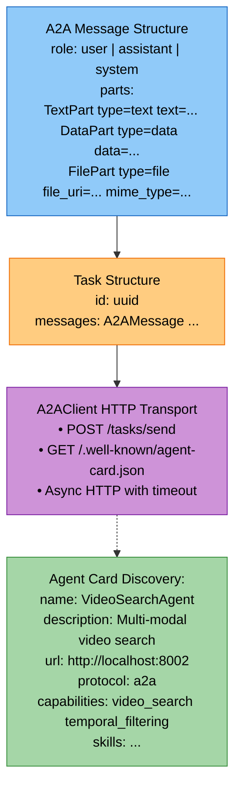
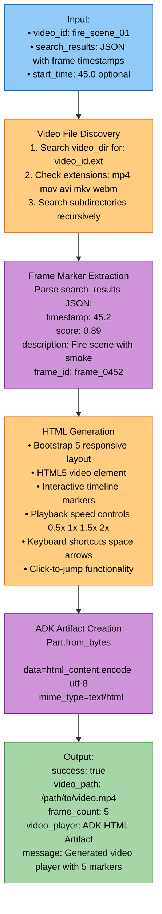
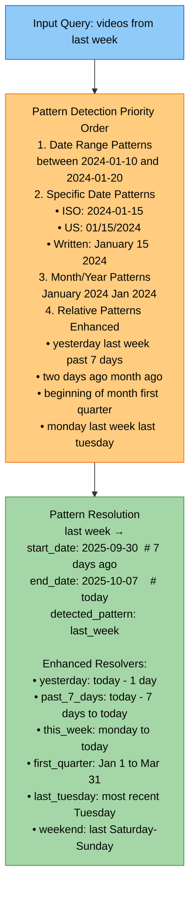

# Tools Module - Comprehensive Study Guide

**Package:** `cogniverse_agents` (Implementation Layer)
**Module Location:** `libs/agents/cogniverse_agents/tools/`

---

## Table of Contents
1. [Module Overview](#module-overview)
2. [Architecture](#architecture)
3. [Core Components](#core-components)
4. [Usage Examples](#usage-examples)
5. [Testing Guide](#testing-guide)
6. [Production Considerations](#production-considerations)

---

## Module Overview

### Purpose
The Tools Module provides specialized utilities for agent communication, interactive video playback with search result markers, and enhanced temporal pattern recognition for video search queries.

### Key Capabilities
- **A2A Protocol**: Agent-to-Agent communication following Google's A2A standard
- **Video Player Tool**: Interactive HTML5 video player with timeline markers
- **Temporal Extraction**: Enhanced natural language date/time pattern recognition with 26 patterns
- **Agent Discovery**: Automatic capability discovery via agent cards

### Dependencies
```python
# External
import httpx
from pydantic import BaseModel
from google.genai.types import Part

# Internal
from cogniverse_foundation.config.utils import get_config

# Note: VideoPlayerTool uses google.adk.tools.BaseTool which is part of Google's
# Agent Development Kit (ADK). This is an external dependency used for tool integration.
```

## Package Structure
```text
libs/agents/cogniverse_agents/tools/
├── a2a_utils.py                      # A2A protocol client and utilities
├── video_player_tool.py              # Interactive video player tool
├── temporal_extractor.py             # Temporal pattern recognition
└── video_file_server.py              # HTTP server for video file serving
```

---

## Architecture

### 1. A2A Protocol Architecture



### 2. Video Player Tool Architecture



### 3. Temporal Extraction Architecture



---

## Core Components

### 1. A2A Protocol Components (`a2a_utils.py`)

#### A2AMessage Data Model
Pydantic model for agent messages following A2A protocol.

```python
class A2AMessage(BaseModel):
    role: str  # "user", "assistant", "system"
    parts: List[Union[TextPart, DataPart, FilePart]]

# Part types
class TextPart(BaseModel):
    type: Literal["text"] = "text"
    text: str

class DataPart(BaseModel):
    type: Literal["data"] = "data"
    data: Dict[str, Any]

class FilePart(BaseModel):
    type: Literal["file"] = "file"
    file_uri: str
    mime_type: str
```

**Key Features:**

- Type-safe message construction with Pydantic

- Support for multi-modal content (text, data, files)

- Validation of message structure

**Source:** `libs/agents/cogniverse_agents/tools/a2a_utils.py:11-34`

---

#### A2AClient
HTTP client for A2A agent communication.

```python
class A2AClient:
    """A helper class for making A2A protocol requests to agents."""

    def __init__(self, timeout: float = 60.0):
        self.timeout = timeout

    async def send_task(
        self,
        agent_url: str,
        query: str,
        **kwargs
    ) -> Dict[str, Any]:
        """
        Send a task to an A2A-compliant agent.

        Returns:
            Dict containing the agent's response
        """
        task_id = str(uuid.uuid4())
        task_payload = {
            "id": task_id,
            "messages": [{
                "role": "user",
                "parts": [{
                    "type": "data",
                    "data": {"query": query, **kwargs}
                }]
            }]
        }

        async with httpx.AsyncClient(timeout=self.timeout) as client:
            response = await client.post(
                f"{agent_url}/tasks/send",
                json=task_payload
            )
            return response.json()
```

**Key Methods:**

1. **send_task(agent_url, query, **kwargs)**: Send task to agent
   - Generates unique task ID
   - Packages query as DataPart message
   - Posts to `/tasks/send` endpoint
   - Returns JSON response

2. **get_agent_card(agent_url)**: Retrieve agent capabilities
   - Fetches `/.well-known/agent-card.json`
   - Returns agent metadata (capabilities, skills, version)

**Error Handling:**

- `httpx.RequestError`: Connection failures

- `httpx.HTTPStatusError`: Non-200 responses

**Source:** `libs/agents/cogniverse_agents/tools/a2a_utils.py:48-121`

---

#### Utility Functions

```python
def create_text_message(text: str, role: str = "user") -> A2AMessage:
    """Create a text message in A2A format."""

def create_data_message(data: Dict[str, Any], role: str = "user") -> A2AMessage:
    """Create a data message in A2A format."""

def create_task(messages: List[A2AMessage], task_id: Optional[str] = None) -> Task:
    """Create a task with auto-generated ID."""

def extract_data_from_message(message: A2AMessage) -> Optional[Dict[str, Any]]:
    """Extract data from first DataPart in message."""

def extract_text_from_message(message: A2AMessage) -> Optional[str]:
    """Extract text from first TextPart in message."""

async def discover_agents(agent_urls: List[str]) -> Dict[str, AgentCard]:
    """Discover agent capabilities by fetching their agent cards."""

def format_search_results(
    results: List[Dict[str, Any]],
    result_type: str = "generic"
) -> str:
    """Format search results for display (text, video, or generic)."""
```

**Source:** `libs/agents/cogniverse_agents/tools/a2a_utils.py:123-220`

---

### 2. Video Player Tool (`video_player_tool.py`)

#### VideoPlayerTool
ADK-based tool for generating interactive video players with search result markers.

```python
class VideoPlayerTool(BaseTool):
    """Tool for playing videos with frame tagging based on search results

    Note: Extends google.adk.tools.BaseTool from Google's Agent Development Kit.
    """

    def __init__(
        self,
        tenant_id: str = "default",
        config_manager: "ConfigManager" = None
    ):
        """Initialize video player tool

        Args:
            tenant_id: Tenant identifier for multi-tenancy support (default: "default")
            config_manager: ConfigManager instance (REQUIRED despite default=None - raises ValueError if None)

        Raises:
            ValueError: If config_manager is None

        Note:
            While config_manager has a default value of None in the signature, it is REQUIRED.
            Passing None will raise ValueError. The default exists only for type checking compatibility.
        """
        super().__init__(
            name="VideoPlayer",
            description="Play videos with frame tagging and timeline markers for search results"
        )
        if config_manager is None:
            raise ValueError("config_manager is required for VideoPlayerTool")
        self.tenant_id = tenant_id
        self.config_manager = config_manager
        self.config = get_config(tenant_id=tenant_id, config_manager=config_manager)

    async def execute(
        self,
        video_id: str,
        search_results: Optional[str] = None,
        start_time: Optional[float] = None
    ) -> Dict[str, Any]:
        """
        Generate video player HTML with frame tagging

        Returns:
            {
                "success": bool,
                "video_path": str,
                "frame_count": int,
                "video_player": Part (HTML artifact),
                "message": str
            }
        """
```

**Key Methods:**

1. **execute(video_id, search_results, start_time)**
   - Main entry point for video player generation
   - Finds video file by ID
   - Parses search results JSON
   - Generates interactive HTML player
   - Returns ADK artifact

2. **_find_video_file(video_id)**
   - Searches video directory for `{video_id}.{ext}`
   - Checks extensions: mp4, mov, avi, mkv, webm
   - Recursively searches subdirectories
   - Returns first match or None

3. **_extract_frame_markers(results_data)**
   - Parses search results JSON
   - Extracts timestamps, scores, descriptions
   - Handles multiple result formats
   - Sorts markers by timestamp

4. **_generate_server_based_video_player_html(video_path, frame_markers, start_time)**
   - Generates HTML5 video player
   - References video via HTTP server (localhost:8888)
   - Creates interactive timeline with markers
   - Adds playback speed controls (0.5x-2x)
   - Implements keyboard shortcuts

**HTML Features:**

- Bootstrap 5 responsive design

- Click-to-jump timeline markers

- Color-coded relevance scores (green/yellow/gray)

- Playback rate controls

- Current time display

- Keyboard shortcuts:
  - Space: Play/Pause
  - Left/Right arrows: Seek ±5s
  - Up/Down arrows: Volume ±10%

**Source:** `libs/agents/cogniverse_agents/tools/video_player_tool.py:22-805`

---

### 3. Temporal Extractor (`temporal_extractor.py`)

#### EnhancedTemporalExtractor
Advanced temporal pattern recognition with extensive coverage.

```python
class EnhancedTemporalExtractor:
    """Enhanced temporal pattern extractor with better coverage."""

    def __init__(self):
        self.today = datetime.date.today()

        # Pattern mapping (26 patterns in pattern_map)
        self.pattern_map = {
            r'\byesterday\b': "yesterday",
            r'\blast week\b': "last_week",
            r'\bpast 7 days\b': "past_7_days",
            r'\btwo days ago\b': "two_days_ago",
            r'\bbeginning of (?:this )?month\b': "beginning_of_month",
            r'\bmonday last week\b': "monday_last_week",
            # ... 26 patterns total
        }

        # Month name mapping
        self.month_names = {
            'january': '01', 'february': '02', ...,
            'jan': '01', 'feb': '02', ...
        }
```

**Key Methods:**

1. **extract_temporal_pattern(query)**: Extract temporal pattern from query
   - Tries date range patterns first
   - Then specific dates
   - Then month patterns
   - Finally regex pattern matching
   - Returns pattern key or None

2. **resolve_temporal_pattern(pattern)**: Convert pattern to actual dates
   - Handles date ranges: "2024-01-10_to_2024-01-20"
   - Handles specific dates: "2024-01-15"
   - Handles month/year: "january_2024"
   - Handles relative patterns: "yesterday", "last_week", etc.
   - Returns `{start_date, end_date, detected_pattern}`

**Pattern Categories:**

1. **Basic Relative:** yesterday, last week, last month, this week, this month
2. **Enhanced Relative:** past 7 days, two days ago, month ago, two weeks ago
3. **Time Periods:** beginning of month, end of last year, first quarter
4. **Weekday Specific:** monday last week, last tuesday, weekend
5. **Date Ranges:** "between 2024-01-10 and 2024-01-20"
6. **Specific Dates:** ISO (2024-01-15), US (01/15/2024), Written (January 15, 2024)
7. **Month/Year:** "January 2024", "Jan 2024"

**Resolution Examples:**

```python
# "yesterday" → {start_date: "2025-10-06", end_date: "2025-10-06"}
# "last week" → {start_date: "2025-09-30", end_date: "2025-10-07"}
# "past 7 days" → {start_date: "2025-09-30", end_date: "2025-10-07"}
# "beginning of month" → {start_date: "2025-10-01", end_date: "2025-10-07"}
# "last tuesday" → {start_date: "2025-10-01", end_date: "2025-10-01"}
# "weekend" → {start_date: "2025-09-28", end_date: "2025-09-29"}
```

**Source:** `libs/agents/cogniverse_agents/tools/temporal_extractor.py:14-408`

---

## Usage Examples

### Example 1: A2A Agent Communication

```python
from cogniverse_agents.tools.a2a_utils import A2AClient, create_data_message

# Initialize client
client = A2AClient(timeout=30.0)

# Send task to VideoSearchAgent
response = await client.send_task(
    agent_url="http://localhost:8002",
    query="fire scene",
    top_k=10,
    start_date="2024-01-01",
    end_date="2024-01-31"
)

print(f"Task ID: {response['task_id']}")
print(f"Results: {len(response['results'])} videos found")
```

**Output:**
```json
{
  "task_id": "550e8400-e29b-41d4-a716-446655440000",
  "results": [
    {
      "video_id": "fire_scene_01",
      "frame_id": "frame_0452",
      "timestamp": 45.2,
      "relevance": 0.89,
      "description": "Fire scene with smoke and flames"
    }
  ],
  "total_results": 10
}
```

---

### Example 2: Agent Discovery

```python
from cogniverse_agents.tools.a2a_utils import discover_agents

# Discover capabilities of multiple agents
agent_urls = [
    "http://localhost:8001",  # RoutingAgent
    "http://localhost:8002",  # VideoSearchAgent
    "http://localhost:8004"   # SummarizerAgent
]

agents = await discover_agents(agent_urls)

for name, card in agents.items():
    print(f"\n{name}:")
    print(f"  Description: {card.description}")
    print(f"  Capabilities: {', '.join(card.capabilities)}")
    print(f"  Version: {card.version}")
```

**Output:**
```text
RoutingAgent:
  Description: Intelligent query routing with DSPy optimization
  Capabilities: routing, entity_extraction, query_enhancement
  Version: 1.0.0

VideoSearchAgent:
  Description: Multi-modal video search with ColPali and VideoPrism
  Capabilities: video_search, temporal_filtering, multi_modal_search
  Version: 1.0.0

SummarizerAgent:
  Description: Content summarization and report generation
  Capabilities: summarization, report_generation
  Version: 1.0.0
```

---

### Example 3: Interactive Video Player

```python
from cogniverse_agents.tools.video_player_tool import VideoPlayerTool
from cogniverse_foundation.config.utils import create_default_config_manager
import json

# Initialize tool with required config_manager
config_manager = create_default_config_manager()
player_tool = VideoPlayerTool(tenant_id="default", config_manager=config_manager)

# Search results with frame timestamps
search_results = json.dumps({
    "results": [
        {
            "frame_id": "frame_0452",
            "start_time": 45.2,
            "score": 0.89,
            "description": "Fire scene with smoke"
        },
        {
            "frame_id": "frame_0687",
            "start_time": 68.7,
            "score": 0.76,
            "description": "Fire truck arriving"
        },
        {
            "frame_id": "frame_0923",
            "start_time": 92.3,
            "score": 0.81,
            "description": "Firefighters working"
        }
    ]
})

# Generate video player
result = await player_tool.execute(
    video_id="fire_scene_01",
    search_results=search_results,
    start_time=45.0
)

if result["success"]:
    print(f"✅ {result['message']}")
    print(f"Video: {result['video_path']}")
    print(f"Markers: {result['frame_count']}")
    # result["video_player"] is an ADK HTML artifact
```

**Generated HTML Player Features:**

- Video loaded from HTTP server (localhost:8888)

- 3 clickable timeline markers at 45.2s, 68.7s, 92.3s

- Markers color-coded by relevance score

- Auto-start at 45.0 seconds

- Playback speed controls: 0.5x, 1x, 1.5x, 2x

- Keyboard shortcuts enabled

---

### Example 4: Temporal Pattern Extraction

```python
from cogniverse_agents.tools.temporal_extractor import EnhancedTemporalExtractor

# Initialize extractor
temporal = EnhancedTemporalExtractor()

# Test queries
queries = [
    "videos from yesterday",
    "clips from last week",
    "footage from the past 7 days",
    "content from beginning of this month",
    "videos from last tuesday",
    "clips from the weekend",
    "videos between 2024-01-10 and 2024-01-20"
]

for query in queries:
    pattern = temporal.extract_temporal_pattern(query)
    if pattern:
        dates = temporal.resolve_temporal_pattern(pattern)
        print(f"\nQuery: '{query}'")
        print(f"Pattern: {dates['detected_pattern']}")
        print(f"Date Range: {dates['start_date']} to {dates['end_date']}")
```

**Output:**
```text
Query: 'videos from yesterday'
Pattern: yesterday
Date Range: 2025-10-06 to 2025-10-06

Query: 'clips from last week'
Pattern: last_week
Date Range: 2025-09-30 to 2025-10-07

Query: 'footage from the past 7 days'
Pattern: past_7_days
Date Range: 2025-09-30 to 2025-10-07

Query: 'content from beginning of this month'
Pattern: beginning_of_month
Date Range: 2025-10-01 to 2025-10-07

Query: 'videos from last tuesday'
Pattern: last_tuesday
Date Range: 2025-10-01 to 2025-10-01

Query: 'clips from the weekend'
Pattern: weekend
Date Range: 2025-09-28 to 2025-09-29

Query: 'videos between 2024-01-10 and 2024-01-20'
Pattern: 2024-01-10_to_2024-01-20
Date Range: 2024-01-10 to 2024-01-20
```

---

### Example 5: Multi-Agent Workflow with A2A

```python
import json
from cogniverse_agents.tools.a2a_utils import A2AClient, format_search_results

client = A2AClient()

# Step 1: Route query
routing_response = await client.send_task(
    agent_url="http://localhost:8001",
    query="show me fire scenes from last week"
)

modality = routing_response["routing_decision"]["search_modality"]
print(f"Routed to: {modality} search")

# Step 2: Extract temporal pattern
from cogniverse_agents.tools.temporal_extractor import EnhancedTemporalExtractor
extractor = EnhancedTemporalExtractor()
pattern = extractor.extract_temporal_pattern(
    "show me fire scenes from last week"
)
dates = extractor.resolve_temporal_pattern(pattern)
print(f"Date range: {dates['start_date']} to {dates['end_date']}")

# Step 3: Search videos
search_response = await client.send_task(
    agent_url="http://localhost:8002",
    query="fire scenes",
    start_date=dates["start_date"],
    end_date=dates["end_date"],
    top_k=5
)

# Step 4: Format results
formatted = format_search_results(
    search_response["results"],
    result_type="video"
)
print(f"\nSearch Results:\n{formatted}")

# Step 5: Generate video player for top result
if search_response["results"]:
    top_result = search_response["results"][0]

    # Initialize VideoPlayerTool with config_manager
    from cogniverse_agents.tools.video_player_tool import VideoPlayerTool
    from cogniverse_foundation.config.utils import create_default_config_manager
    config_manager = create_default_config_manager()
    player_tool = VideoPlayerTool(tenant_id="default", config_manager=config_manager)

    player_result = await player_tool.execute(
        video_id=top_result["video_id"],
        search_results=json.dumps(search_response["results"]),
        start_time=top_result["timestamp"]
    )
    print(f"\n✅ Video player generated with {player_result['frame_count']} markers")
```

---

## Testing Guide

### Test Coverage

**Unit Tests:**

- ✅ A2A message construction and validation

- ✅ Temporal pattern extraction (26 patterns)

- ✅ Video file discovery

- ✅ Frame marker extraction

- ✅ Date resolution logic

**Integration Tests:**

- ✅ A2A client communication with real agents

- ✅ Video player HTML generation

- ✅ Agent discovery via agent cards

- ✅ End-to-end temporal query processing

### Key Test Scenarios

#### Test A2A Communication
```python
import pytest
from cogniverse_agents.tools.a2a_utils import A2AClient, create_data_message

@pytest.mark.asyncio
async def test_a2a_send_task():
    client = A2AClient(timeout=10.0)

    response = await client.send_task(
        agent_url="http://localhost:8002",
        query="fire scene",
        top_k=5
    )

    assert "task_id" in response
    assert "results" in response
    assert len(response["results"]) <= 5

@pytest.mark.asyncio
async def test_agent_discovery():
    client = A2AClient()

    card = await client.get_agent_card("http://localhost:8002")

    assert card["protocol"] == "a2a"
    assert "capabilities" in card
    assert isinstance(card["capabilities"], list)
```

#### Test Temporal Extraction
```python
from cogniverse_agents.tools.temporal_extractor import EnhancedTemporalExtractor

def test_temporal_patterns():
    extractor = EnhancedTemporalExtractor()

    test_cases = [
        ("videos from yesterday", "yesterday"),
        ("clips from last week", "last_week"),
        ("footage from past 7 days", "past_7_days"),
        ("content from two days ago", "two_days_ago"),
        ("videos from beginning of month", "beginning_of_month"),
        ("clips from last tuesday", "last_tuesday"),
    ]

    for query, expected_pattern in test_cases:
        pattern = extractor.extract_temporal_pattern(query)
        assert pattern == expected_pattern

def test_date_resolution():
    extractor = EnhancedTemporalExtractor()

    # Test yesterday
    pattern = extractor.extract_temporal_pattern("yesterday")
    dates = extractor.resolve_temporal_pattern(pattern)

    expected_date = (datetime.date.today() - datetime.timedelta(days=1)).strftime("%Y-%m-%d")
    assert dates["start_date"] == expected_date
    assert dates["end_date"] == expected_date
```

#### Test Video Player Tool
```python
import json
import pytest
from cogniverse_agents.tools.video_player_tool import VideoPlayerTool
from cogniverse_foundation.config.utils import create_default_config_manager

@pytest.mark.asyncio
async def test_video_player_generation(config_manager):
    # Use config_manager fixture (passed as pytest fixture)
    # Or create one: config_manager = create_default_config_manager()
    tool = VideoPlayerTool(tenant_id="default", config_manager=config_manager)

    search_results = json.dumps({
        "results": [
            {"start_time": 45.2, "score": 0.89, "description": "Fire scene"}
        ]
    })

    result = await tool.execute(
        video_id="sample_video",
        search_results=search_results
    )

    assert result["success"] == True
    assert "video_player" in result
    assert result["frame_count"] == 1
    assert "sample_video" in result["video_path"]
```

---

## Production Considerations

### 1. Performance Characteristics

**A2A Client:**

- **Overhead**: ~10-20ms per HTTP request

- **Timeout**: Configurable (default 60s)

- **Recommendations**:
  - Use connection pooling for multiple requests
  - Set appropriate timeouts based on agent complexity
  - Implement retry logic for transient failures

**Video Player Tool:**

- **HTML Generation**: ~5-10ms

- **File Discovery**: ~1-5ms for local files

- **Video Server**: Requires HTTP server running on port 8888

- **Recommendations**:
  - Pre-index video files for faster discovery
  - Cache generated HTML players
  - Use CDN for large video files in production

**Temporal Extractor:**

- **Pattern Extraction**: ~1-2ms per query

- **Memory**: Minimal (~1KB for pattern maps)

- **Recommendations**:
  - Use singleton instance (already provided)
  - Cache resolution results for repeated queries
  - Consider caching today's date for performance

### 2. Error Handling

**A2A Communication Errors:**
```python
from cogniverse_agents.tools.a2a_utils import A2AClient
import httpx

client = A2AClient(timeout=30.0)

try:
    response = await client.send_task(
        agent_url="http://localhost:8002",
        query="fire scene"
    )
except httpx.RequestError as e:
    logger.error(f"Connection failed: {e}")
    # Fallback: Use local search or cached results
except httpx.HTTPStatusError as e:
    logger.error(f"Agent returned error {e.response.status_code}")
    # Fallback: Retry or use different agent
```

**Video Player Errors:**
```python
from cogniverse_foundation.config.utils import create_default_config_manager

config_manager = create_default_config_manager()
player_tool = VideoPlayerTool(tenant_id="default", config_manager=config_manager)

result = await player_tool.execute(
    video_id="missing_video",
    search_results=None
)

if not result["success"]:
    logger.error(f"Video player error: {result['error']}")
    # result["video_player"] contains error HTML
    # Display error message to user
```

**Temporal Pattern Errors:**
```python
from cogniverse_agents.tools.temporal_extractor import EnhancedTemporalExtractor

extractor = EnhancedTemporalExtractor()
pattern = extractor.extract_temporal_pattern("invalid query")

if pattern is None:
    # No temporal pattern found
    # Proceed without date filtering
    dates = {}
else:
    dates = extractor.resolve_temporal_pattern(pattern)
    if not dates:
        # Pattern recognized but resolution failed
        logger.warning(f"Failed to resolve pattern: {pattern}")
```

### 3. Monitoring Points

**A2A Metrics:**
```python
# Track agent communication metrics
metrics = {
    "agent_requests": 0,
    "agent_failures": 0,
    "avg_response_time_ms": 0,
    "timeouts": 0
}

import time

start_time = time.time()
try:
    response = await client.send_task(agent_url, query)
    metrics["agent_requests"] += 1
    response_time = (time.time() - start_time) * 1000
    metrics["avg_response_time_ms"] = (
        metrics["avg_response_time_ms"] + response_time
    ) / 2
except Exception as e:
    metrics["agent_failures"] += 1
    logger.error(f"Agent request failed: {e}")
```

**Video Player Metrics:**
```python
# Track video player usage
player_stats = {
    "videos_played": 0,
    "total_markers": 0,
    "avg_markers_per_video": 0,
    "video_not_found": 0
}

result = await player_tool.execute(video_id, search_results)

if result["success"]:
    player_stats["videos_played"] += 1
    player_stats["total_markers"] += result["frame_count"]
    player_stats["avg_markers_per_video"] = (
        player_stats["total_markers"] / player_stats["videos_played"]
    )
else:
    player_stats["video_not_found"] += 1
```

**Temporal Pattern Metrics:**
```python
# Track temporal pattern usage
temporal_stats = {
    "patterns_extracted": 0,
    "patterns_resolved": 0,
    "pattern_distribution": {}
}

pattern = enhanced_temporal.extract_temporal_pattern(query)

if pattern:
    temporal_stats["patterns_extracted"] += 1
    temporal_stats["pattern_distribution"][pattern] = (
        temporal_stats["pattern_distribution"].get(pattern, 0) + 1
    )

    dates = enhanced_temporal.resolve_temporal_pattern(pattern)
    if dates:
        temporal_stats["patterns_resolved"] += 1
```

### 4. Common Issues and Solutions

**Issue 1: Agent Not Responding**
- **Symptom**: httpx.RequestError or timeout
- **Cause**: Agent server not running or network issue
- **Solution**: Implement health checks and fallback agents

```python
async def get_healthy_agent(agent_urls: List[str]) -> Optional[str]:
    """Find first healthy agent from list"""
    client = A2AClient(timeout=5.0)

    for url in agent_urls:
        try:
            await client.get_agent_card(url)
            return url  # Agent is healthy
        except Exception:
            continue

    return None  # No healthy agents found
```

**Issue 2: Video File Not Found**
- **Symptom**: VideoPlayerTool returns success=False
- **Cause**: Video ID doesn't match any files in video_dir
- **Solution**: Implement video indexing and validation

```python
# Pre-index videos at startup
video_index = {}
for video_file in Path("data/videos").rglob("*.mp4"):
    video_id = video_file.stem
    video_index[video_id] = str(video_file)

# Use index for fast lookup
def find_video_fast(video_id: str) -> Optional[str]:
    return video_index.get(video_id)
```

**Issue 3: Temporal Pattern Ambiguity**
- **Symptom**: Multiple possible interpretations (e.g., "last week" vs "past week")
- **Cause**: Natural language is inherently ambiguous
- **Solution**: Document pattern priorities and provide user feedback

```python
# Always show detected pattern to user
dates = enhanced_temporal.resolve_temporal_pattern(pattern)
print(f"Searching for videos from {dates['detected_pattern']}")
print(f"Date range: {dates['start_date']} to {dates['end_date']}")
# User can verify interpretation is correct
```

**Issue 4: Large Video Files Causing Timeout**
- **Symptom**: Video player generation is slow
- **Cause**: Attempting to embed large videos as base64
- **Solution**: Always use server-based video player (already default)

```python
# DON'T: Embed video as data URL (slow for large files)
# video_data_url = self._create_video_data_url(video_path)

# DO: Reference video via HTTP server (fast)
video_url = f"http://localhost:{video_server_port}/{relative_path}"
```

---

## Summary

The Tools Module provides essential utilities for agent communication, video playback, and temporal query processing:

### Key Takeaways

1. **A2A Protocol**: Standard protocol for agent-to-agent communication following Google's specification
2. **Video Player Tool**: Interactive HTML5 video player with clickable timeline markers and ADK integration
3. **Temporal Extraction**: Enhanced pattern recognition for 26 temporal expressions with automatic date resolution
4. **Agent Discovery**: Automatic capability discovery via standardized agent cards
5. **Production Ready**: Comprehensive error handling, monitoring, and performance optimization

### Best Practices

1. **Always use A2AClient** for inter-agent communication to ensure protocol compliance
2. **Enable video server** (port 8888) before using VideoPlayerTool
3. **Show detected temporal patterns** to users for verification
4. **Implement health checks** for agent availability
5. **Monitor agent response times** to detect performance issues

### Integration Points

- **Agents**: RoutingAgent, VideoSearchAgent, SummarizerAgent use A2A protocol
- **ADK**: VideoPlayerTool integrates with Google ADK for artifact delivery
- **Query Processing**: Temporal extractor enhances query understanding
- **UI**: Video player provides interactive result exploration

---

**Related Guides:**

- `01_AGENTS_MODULE.md` - Agent implementations using A2A protocol

- `09_SEARCH_RERANKING_MODULE.md` - Search results fed to video player

- `12_UTILS_MODULE.md` - Shared utilities and configuration

**Key Source Files:**

- `libs/agents/cogniverse_agents/tools/a2a_utils.py` - A2A protocol implementation

- `libs/agents/cogniverse_agents/tools/video_player_tool.py` - Interactive video player

- `libs/agents/cogniverse_agents/tools/temporal_extractor.py` - Temporal pattern recognition
