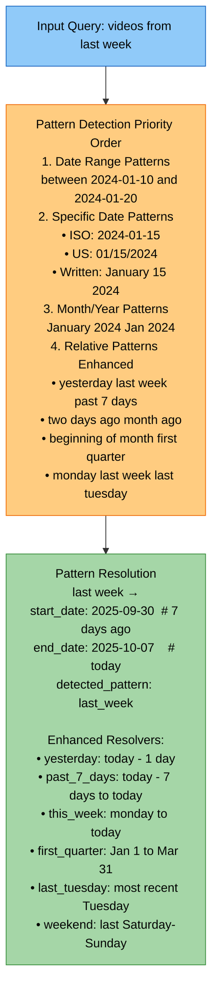

# Tools Module - Comprehensive Study Guide

**Package:** `cogniverse_agents` (Implementation Layer)
**Module Location:** `libs/agents/cogniverse_agents/tools/`

---

## Table of Contents
1. [Module Overview](#module-overview)
2. [Architecture](#architecture)
3. [Core Components](#core-components)
4. [Usage Examples](#usage-examples)
5. [Testing Guide](#testing-guide)
6. [Production Considerations](#production-considerations)

---

## Module Overview

### Purpose
The Tools Module provides specialized utilities for serving video files over HTTP and enhanced temporal pattern recognition for video search queries.

### Key Capabilities
- **Video File Server**: HTTP server for serving video files to clients
- **Temporal Extraction**: Enhanced natural language date/time pattern recognition with 26 patterns

### Dependencies
```python
# External
from google.genai.types import Part

# Internal
from cogniverse_foundation.config.utils import get_config
```

## Package Structure
```text
libs/agents/cogniverse_agents/tools/
├── temporal_extractor.py             # Temporal pattern recognition
└── video_file_server.py              # HTTP server for video file serving
```

---

## Architecture

### 1. Temporal Extraction Architecture


```mermaid
flowchart TB
    INPUT["<span style='color:#000'>Input Query: videos from last week</span>"]

    DETECT["<span style='color:#000'>Pattern Detection Priority Order<br/>1. Date Range Patterns<br/>   between 2024-01-10 and 2024-01-20<br/>2. Specific Date Patterns<br/>   • ISO: 2024-01-15<br/>   • US: 01/15/2024<br/>   • Written: January 15 2024<br/>3. Month/Year Patterns<br/>   January 2024 Jan 2024<br/>4. Relative Patterns Enhanced<br/>   • yesterday last week past 7 days<br/>   • two days ago month ago<br/>   • beginning of month first quarter<br/>   • monday last week last tuesday</span>"]

    RESOLVE["<span style='color:#000'>Pattern Resolution<br/>last week →<br/>start_date: 2025-09-30  # 7 days ago<br/>end_date: 2025-10-07    # today<br/>detected_pattern: last_week<br/><br/>Enhanced Resolvers:<br/>• yesterday: today - 1 day<br/>• past_7_days: today - 7 days to today<br/>• this_week: monday to today<br/>• first_quarter: Jan 1 to Mar 31<br/>• last_tuesday: most recent Tuesday<br/>• weekend: last Saturday-Sunday</span>"]

    INPUT --> DETECT
    DETECT --> RESOLVE

    style INPUT fill:#90caf9,stroke:#1565c0,color:#000
    style DETECT fill:#ffcc80,stroke:#ef6c00,color:#000
    style RESOLVE fill:#a5d6a7,stroke:#388e3c,color:#000
```

---

## Core Components

### 1. Temporal Extractor (`temporal_extractor.py`)

#### EnhancedTemporalExtractor
Advanced temporal pattern recognition with extensive coverage.

```python
class EnhancedTemporalExtractor:
    """Enhanced temporal pattern extractor with better coverage."""

    def __init__(self):
        self.today = datetime.date.today()

        # Pattern mapping (26 patterns in pattern_map)
        self.pattern_map = {
            r'\byesterday\b': "yesterday",
            r'\blast week\b': "last_week",
            r'\bpast 7 days\b': "past_7_days",
            r'\btwo days ago\b': "two_days_ago",
            r'\bbeginning of (?:this )?month\b': "beginning_of_month",
            r'\bmonday last week\b': "monday_last_week",
            # ... 26 patterns total
        }

        # Month name mapping
        self.month_names = {
            'january': '01', 'february': '02', ...,
            'jan': '01', 'feb': '02', ...
        }
```

**Key Methods:**

1. **extract_temporal_pattern(query)**: Extract temporal pattern from query
   - Tries date range patterns first
   - Then specific dates
   - Then month patterns
   - Finally regex pattern matching
   - Returns pattern key or None

2. **resolve_temporal_pattern(pattern)**: Convert pattern to actual dates
   - Handles date ranges: "2024-01-10_to_2024-01-20"
   - Handles specific dates: "2024-01-15"
   - Handles month/year: "january_2024"
   - Handles relative patterns: "yesterday", "last_week", etc.
   - Returns `{start_date, end_date, detected_pattern}`

**Pattern Categories:**

1. **Basic Relative:** yesterday, last week, last month, this week, this month
2. **Enhanced Relative:** past 7 days, two days ago, month ago, two weeks ago
3. **Time Periods:** beginning of month, end of last year, first quarter
4. **Weekday Specific:** monday last week, last tuesday, weekend
5. **Date Ranges:** "between 2024-01-10 and 2024-01-20"
6. **Specific Dates:** ISO (2024-01-15), US (01/15/2024), Written (January 15, 2024)
7. **Month/Year:** "January 2024", "Jan 2024"

**Resolution Examples:**

```python
# "yesterday" → {start_date: "2025-10-06", end_date: "2025-10-06"}
# "last week" → {start_date: "2025-09-30", end_date: "2025-10-07"}
# "past 7 days" → {start_date: "2025-09-30", end_date: "2025-10-07"}
# "beginning of month" → {start_date: "2025-10-01", end_date: "2025-10-07"}
# "last tuesday" → {start_date: "2025-10-01", end_date: "2025-10-01"}
# "weekend" → {start_date: "2025-09-28", end_date: "2025-09-29"}
```

**Source:** `libs/agents/cogniverse_agents/tools/temporal_extractor.py:14-408`

---

## Usage Examples

### Example 1: Temporal Pattern Extraction

```python
from cogniverse_agents.tools.temporal_extractor import EnhancedTemporalExtractor

# Initialize extractor
temporal = EnhancedTemporalExtractor()

# Test queries
queries = [
    "videos from yesterday",
    "clips from last week",
    "footage from the past 7 days",
    "content from beginning of this month",
    "videos from last tuesday",
    "clips from the weekend",
    "videos between 2024-01-10 and 2024-01-20"
]

for query in queries:
    pattern = temporal.extract_temporal_pattern(query)
    if pattern:
        dates = temporal.resolve_temporal_pattern(pattern)
        print(f"\nQuery: '{query}'")
        print(f"Pattern: {dates['detected_pattern']}")
        print(f"Date Range: {dates['start_date']} to {dates['end_date']}")
```

**Output:**
```text
Query: 'videos from yesterday'
Pattern: yesterday
Date Range: 2025-10-06 to 2025-10-06

Query: 'clips from last week'
Pattern: last_week
Date Range: 2025-09-30 to 2025-10-07

Query: 'footage from the past 7 days'
Pattern: past_7_days
Date Range: 2025-09-30 to 2025-10-07

Query: 'content from beginning of this month'
Pattern: beginning_of_month
Date Range: 2025-10-01 to 2025-10-07

Query: 'videos from last tuesday'
Pattern: last_tuesday
Date Range: 2025-10-01 to 2025-10-01

Query: 'clips from the weekend'
Pattern: weekend
Date Range: 2025-09-28 to 2025-09-29

Query: 'videos between 2024-01-10 and 2024-01-20'
Pattern: 2024-01-10_to_2024-01-20
Date Range: 2024-01-10 to 2024-01-20
```

---

## Testing Guide

### Test Coverage

**Unit Tests:**

- ✅ Temporal pattern extraction (26 patterns)

- ✅ Date resolution logic

**Integration Tests:**

- ✅ End-to-end temporal query processing

### Key Test Scenarios

#### Test Temporal Extraction
```python
from cogniverse_agents.tools.temporal_extractor import EnhancedTemporalExtractor

def test_temporal_patterns():
    extractor = EnhancedTemporalExtractor()

    test_cases = [
        ("videos from yesterday", "yesterday"),
        ("clips from last week", "last_week"),
        ("footage from past 7 days", "past_7_days"),
        ("content from two days ago", "two_days_ago"),
        ("videos from beginning of month", "beginning_of_month"),
        ("clips from last tuesday", "last_tuesday"),
    ]

    for query, expected_pattern in test_cases:
        pattern = extractor.extract_temporal_pattern(query)
        assert pattern == expected_pattern

def test_date_resolution():
    extractor = EnhancedTemporalExtractor()

    # Test yesterday
    pattern = extractor.extract_temporal_pattern("yesterday")
    dates = extractor.resolve_temporal_pattern(pattern)

    expected_date = (datetime.date.today() - datetime.timedelta(days=1)).strftime("%Y-%m-%d")
    assert dates["start_date"] == expected_date
    assert dates["end_date"] == expected_date
```

---

## Production Considerations

### 1. Performance Characteristics

**Temporal Extractor:**

- **Pattern Extraction**: ~1-2ms per query

- **Memory**: Minimal (~1KB for pattern maps)

- **Recommendations**:
  - Use singleton instance (already provided)
  - Cache resolution results for repeated queries
  - Consider caching today's date for performance

### 2. Error Handling

**Temporal Pattern Errors:**
```python
from cogniverse_agents.tools.temporal_extractor import EnhancedTemporalExtractor

extractor = EnhancedTemporalExtractor()
pattern = extractor.extract_temporal_pattern("invalid query")

if pattern is None:
    # No temporal pattern found
    # Proceed without date filtering
    dates = {}
else:
    dates = extractor.resolve_temporal_pattern(pattern)
    if not dates:
        # Pattern recognized but resolution failed
        logger.warning(f"Failed to resolve pattern: {pattern}")
```

### 3. Monitoring Points

**Temporal Pattern Metrics:**
```python
# Track temporal pattern usage
temporal_stats = {
    "patterns_extracted": 0,
    "patterns_resolved": 0,
    "pattern_distribution": {}
}

pattern = enhanced_temporal.extract_temporal_pattern(query)

if pattern:
    temporal_stats["patterns_extracted"] += 1
    temporal_stats["pattern_distribution"][pattern] = (
        temporal_stats["pattern_distribution"].get(pattern, 0) + 1
    )

    dates = enhanced_temporal.resolve_temporal_pattern(pattern)
    if dates:
        temporal_stats["patterns_resolved"] += 1
```

### 4. Common Issues and Solutions

**Issue 1: Temporal Pattern Ambiguity**
- **Symptom**: Multiple possible interpretations (e.g., "last week" vs "past week")
- **Cause**: Natural language is inherently ambiguous
- **Solution**: Document pattern priorities and provide user feedback

```python
# Always show detected pattern to user
dates = enhanced_temporal.resolve_temporal_pattern(pattern)
print(f"Searching for videos from {dates['detected_pattern']}")
print(f"Date range: {dates['start_date']} to {dates['end_date']}")
# User can verify interpretation is correct
```

---

## Summary

The Tools Module provides utilities for video file serving and temporal query processing:

### Key Takeaways

1. **Video File Server**: HTTP server for serving video files to clients
2. **Temporal Extraction**: Enhanced pattern recognition for 26 temporal expressions with automatic date resolution
3. **Production Ready**: Comprehensive error handling, monitoring, and performance optimization

### Best Practices

1. **Show detected temporal patterns** to users for verification

### Integration Points

- **Query Processing**: Temporal extractor enhances query understanding

---

**Related Guides:**

- `09_SEARCH_RERANKING_MODULE.md` - Search results processing

- `12_UTILS_MODULE.md` - Shared utilities and configuration

**Key Source Files:**

- `libs/agents/cogniverse_agents/tools/temporal_extractor.py` - Temporal pattern recognition
- `libs/agents/cogniverse_agents/tools/video_file_server.py` - HTTP video file serving

- `libs/agents/cogniverse_agents/tools/temporal_extractor.py` - Temporal pattern recognition
