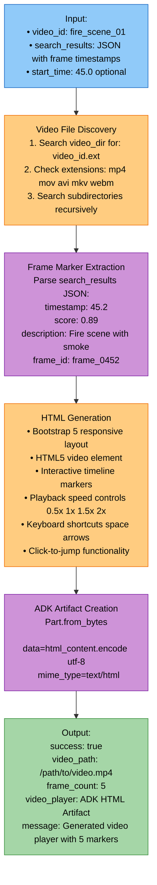
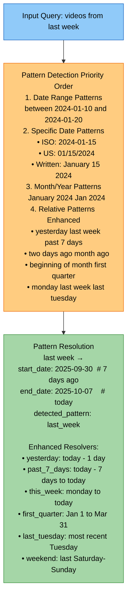

# Tools Module - Comprehensive Study Guide

**Package:** `cogniverse_agents` (Implementation Layer)
**Module Location:** `libs/agents/cogniverse_agents/tools/`

---

## Table of Contents
1. [Module Overview](#module-overview)
2. [Architecture](#architecture)
3. [Core Components](#core-components)
4. [Usage Examples](#usage-examples)
5. [Testing Guide](#testing-guide)
6. [Production Considerations](#production-considerations)

---

## Module Overview

### Purpose
The Tools Module provides specialized utilities for interactive video playback with search result markers and enhanced temporal pattern recognition for video search queries.

### Key Capabilities
- **Video Player Tool**: Interactive HTML5 video player with timeline markers
- **Temporal Extraction**: Enhanced natural language date/time pattern recognition with 26 patterns

### Dependencies
```python
# External
from google.genai.types import Part

# Internal
from cogniverse_foundation.config.utils import get_config

# Note: VideoPlayerTool uses google.adk.tools.BaseTool which is part of Google's
# Agent Development Kit (ADK). This is an external dependency used for tool integration.
```

## Package Structure
```text
libs/agents/cogniverse_agents/tools/
├── video_player_tool.py              # Interactive video player tool
├── temporal_extractor.py             # Temporal pattern recognition
└── video_file_server.py              # HTTP server for video file serving
```

---

## Architecture

### 1. Video Player Tool Architecture


```mermaid
flowchart TB
    INPUT["<span style='color:#000'>Input:<br/>• video_id: fire_scene_01<br/>• search_results: JSON with frame timestamps<br/>• start_time: 45.0 optional</span>"]

    DISC["<span style='color:#000'>Video File Discovery<br/>1. Search video_dir for: video_id.ext<br/>2. Check extensions: mp4 mov avi mkv webm<br/>3. Search subdirectories recursively</span>"]

    MARKER["<span style='color:#000'>Frame Marker Extraction<br/>Parse search_results JSON:<br/>timestamp: 45.2<br/>score: 0.89<br/>description: Fire scene with smoke<br/>frame_id: frame_0452</span>"]

    HTML["<span style='color:#000'>HTML Generation<br/>• Bootstrap 5 responsive layout<br/>• HTML5 video element<br/>• Interactive timeline markers<br/>• Playback speed controls 0.5x 1x 1.5x 2x<br/>• Keyboard shortcuts space arrows<br/>• Click-to-jump functionality</span>"]

    ADK["<span style='color:#000'>ADK Artifact Creation<br/>Part.from_bytes<br/>  data=html_content.encode utf-8<br/>  mime_type=text/html</span>"]

    OUTPUT["<span style='color:#000'>Output:<br/>success: true<br/>video_path: /path/to/video.mp4<br/>frame_count: 5<br/>video_player: ADK HTML Artifact<br/>message: Generated video player with 5 markers</span>"]

    INPUT --> DISC
    DISC --> MARKER
    MARKER --> HTML
    HTML --> ADK
    ADK --> OUTPUT

    style INPUT fill:#90caf9,stroke:#1565c0,color:#000
    style DISC fill:#ffcc80,stroke:#ef6c00,color:#000
    style MARKER fill:#ce93d8,stroke:#7b1fa2,color:#000
    style HTML fill:#ffcc80,stroke:#ef6c00,color:#000
    style ADK fill:#ce93d8,stroke:#7b1fa2,color:#000
    style OUTPUT fill:#a5d6a7,stroke:#388e3c,color:#000
```

### 2. Temporal Extraction Architecture


```mermaid
flowchart TB
    INPUT["<span style='color:#000'>Input Query: videos from last week</span>"]

    DETECT["<span style='color:#000'>Pattern Detection Priority Order<br/>1. Date Range Patterns<br/>   between 2024-01-10 and 2024-01-20<br/>2. Specific Date Patterns<br/>   • ISO: 2024-01-15<br/>   • US: 01/15/2024<br/>   • Written: January 15 2024<br/>3. Month/Year Patterns<br/>   January 2024 Jan 2024<br/>4. Relative Patterns Enhanced<br/>   • yesterday last week past 7 days<br/>   • two days ago month ago<br/>   • beginning of month first quarter<br/>   • monday last week last tuesday</span>"]

    RESOLVE["<span style='color:#000'>Pattern Resolution<br/>last week →<br/>start_date: 2025-09-30  # 7 days ago<br/>end_date: 2025-10-07    # today<br/>detected_pattern: last_week<br/><br/>Enhanced Resolvers:<br/>• yesterday: today - 1 day<br/>• past_7_days: today - 7 days to today<br/>• this_week: monday to today<br/>• first_quarter: Jan 1 to Mar 31<br/>• last_tuesday: most recent Tuesday<br/>• weekend: last Saturday-Sunday</span>"]

    INPUT --> DETECT
    DETECT --> RESOLVE

    style INPUT fill:#90caf9,stroke:#1565c0,color:#000
    style DETECT fill:#ffcc80,stroke:#ef6c00,color:#000
    style RESOLVE fill:#a5d6a7,stroke:#388e3c,color:#000
```

---

## Core Components

### 1. Video Player Tool (`video_player_tool.py`)

#### VideoPlayerTool
ADK-based tool for generating interactive video players with search result markers.

```python
class VideoPlayerTool(BaseTool):
    """Tool for playing videos with frame tagging based on search results

    Note: Extends google.adk.tools.BaseTool from Google's Agent Development Kit.
    """

    def __init__(
        self,
        tenant_id: str = "default",
        config_manager: "ConfigManager" = None
    ):
        """Initialize video player tool

        Args:
            tenant_id: Tenant identifier for multi-tenancy support (default: "default")
            config_manager: ConfigManager instance (REQUIRED despite default=None - raises ValueError if None)

        Raises:
            ValueError: If config_manager is None

        Note:
            While config_manager has a default value of None in the signature, it is REQUIRED.
            Passing None will raise ValueError. The default exists only for type checking compatibility.
        """
        super().__init__(
            name="VideoPlayer",
            description="Play videos with frame tagging and timeline markers for search results"
        )
        if config_manager is None:
            raise ValueError("config_manager is required for VideoPlayerTool")
        self.tenant_id = tenant_id
        self.config_manager = config_manager
        self.config = get_config(tenant_id=tenant_id, config_manager=config_manager)

    async def execute(
        self,
        video_id: str,
        search_results: Optional[str] = None,
        start_time: Optional[float] = None
    ) -> Dict[str, Any]:
        """
        Generate video player HTML with frame tagging

        Returns:
            {
                "success": bool,
                "video_path": str,
                "frame_count": int,
                "video_player": Part (HTML artifact),
                "message": str
            }
        """
```

**Key Methods:**

1. **execute(video_id, search_results, start_time)**
   - Main entry point for video player generation
   - Finds video file by ID
   - Parses search results JSON
   - Generates interactive HTML player
   - Returns ADK artifact

2. **_find_video_file(video_id)**
   - Searches video directory for `{video_id}.{ext}`
   - Checks extensions: mp4, mov, avi, mkv, webm
   - Recursively searches subdirectories
   - Returns first match or None

3. **_extract_frame_markers(results_data)**
   - Parses search results JSON
   - Extracts timestamps, scores, descriptions
   - Handles multiple result formats
   - Sorts markers by timestamp

4. **_generate_server_based_video_player_html(video_path, frame_markers, start_time)**
   - Generates HTML5 video player
   - References video via HTTP server (localhost:8888)
   - Creates interactive timeline with markers
   - Adds playback speed controls (0.5x-2x)
   - Implements keyboard shortcuts

**HTML Features:**

- Bootstrap 5 responsive design

- Click-to-jump timeline markers

- Color-coded relevance scores (green/yellow/gray)

- Playback rate controls

- Current time display

- Keyboard shortcuts:
  - Space: Play/Pause
  - Left/Right arrows: Seek ±5s
  - Up/Down arrows: Volume ±10%

**Source:** `libs/agents/cogniverse_agents/tools/video_player_tool.py:22-805`

---

### 2. Temporal Extractor (`temporal_extractor.py`)

#### EnhancedTemporalExtractor
Advanced temporal pattern recognition with extensive coverage.

```python
class EnhancedTemporalExtractor:
    """Enhanced temporal pattern extractor with better coverage."""

    def __init__(self):
        self.today = datetime.date.today()

        # Pattern mapping (26 patterns in pattern_map)
        self.pattern_map = {
            r'\byesterday\b': "yesterday",
            r'\blast week\b': "last_week",
            r'\bpast 7 days\b': "past_7_days",
            r'\btwo days ago\b': "two_days_ago",
            r'\bbeginning of (?:this )?month\b': "beginning_of_month",
            r'\bmonday last week\b': "monday_last_week",
            # ... 26 patterns total
        }

        # Month name mapping
        self.month_names = {
            'january': '01', 'february': '02', ...,
            'jan': '01', 'feb': '02', ...
        }
```

**Key Methods:**

1. **extract_temporal_pattern(query)**: Extract temporal pattern from query
   - Tries date range patterns first
   - Then specific dates
   - Then month patterns
   - Finally regex pattern matching
   - Returns pattern key or None

2. **resolve_temporal_pattern(pattern)**: Convert pattern to actual dates
   - Handles date ranges: "2024-01-10_to_2024-01-20"
   - Handles specific dates: "2024-01-15"
   - Handles month/year: "january_2024"
   - Handles relative patterns: "yesterday", "last_week", etc.
   - Returns `{start_date, end_date, detected_pattern}`

**Pattern Categories:**

1. **Basic Relative:** yesterday, last week, last month, this week, this month
2. **Enhanced Relative:** past 7 days, two days ago, month ago, two weeks ago
3. **Time Periods:** beginning of month, end of last year, first quarter
4. **Weekday Specific:** monday last week, last tuesday, weekend
5. **Date Ranges:** "between 2024-01-10 and 2024-01-20"
6. **Specific Dates:** ISO (2024-01-15), US (01/15/2024), Written (January 15, 2024)
7. **Month/Year:** "January 2024", "Jan 2024"

**Resolution Examples:**

```python
# "yesterday" → {start_date: "2025-10-06", end_date: "2025-10-06"}
# "last week" → {start_date: "2025-09-30", end_date: "2025-10-07"}
# "past 7 days" → {start_date: "2025-09-30", end_date: "2025-10-07"}
# "beginning of month" → {start_date: "2025-10-01", end_date: "2025-10-07"}
# "last tuesday" → {start_date: "2025-10-01", end_date: "2025-10-01"}
# "weekend" → {start_date: "2025-09-28", end_date: "2025-09-29"}
```

**Source:** `libs/agents/cogniverse_agents/tools/temporal_extractor.py:14-408`

---

## Usage Examples

### Example 1: Interactive Video Player

```python
from cogniverse_agents.tools.video_player_tool import VideoPlayerTool
from cogniverse_foundation.config.utils import create_default_config_manager
import json

# Initialize tool with required config_manager
config_manager = create_default_config_manager()
player_tool = VideoPlayerTool(tenant_id="your_org:production", config_manager=config_manager)

# Search results with frame timestamps
search_results = json.dumps({
    "results": [
        {
            "frame_id": "frame_0452",
            "start_time": 45.2,
            "score": 0.89,
            "description": "Fire scene with smoke"
        },
        {
            "frame_id": "frame_0687",
            "start_time": 68.7,
            "score": 0.76,
            "description": "Fire truck arriving"
        },
        {
            "frame_id": "frame_0923",
            "start_time": 92.3,
            "score": 0.81,
            "description": "Firefighters working"
        }
    ]
})

# Generate video player
result = await player_tool.execute(
    video_id="fire_scene_01",
    search_results=search_results,
    start_time=45.0
)

if result["success"]:
    print(f"✅ {result['message']}")
    print(f"Video: {result['video_path']}")
    print(f"Markers: {result['frame_count']}")
    # result["video_player"] is an ADK HTML artifact
```

**Generated HTML Player Features:**

- Video loaded from HTTP server (localhost:8888)

- 3 clickable timeline markers at 45.2s, 68.7s, 92.3s

- Markers color-coded by relevance score

- Auto-start at 45.0 seconds

- Playback speed controls: 0.5x, 1x, 1.5x, 2x

- Keyboard shortcuts enabled

---

### Example 2: Temporal Pattern Extraction

```python
from cogniverse_agents.tools.temporal_extractor import EnhancedTemporalExtractor

# Initialize extractor
temporal = EnhancedTemporalExtractor()

# Test queries
queries = [
    "videos from yesterday",
    "clips from last week",
    "footage from the past 7 days",
    "content from beginning of this month",
    "videos from last tuesday",
    "clips from the weekend",
    "videos between 2024-01-10 and 2024-01-20"
]

for query in queries:
    pattern = temporal.extract_temporal_pattern(query)
    if pattern:
        dates = temporal.resolve_temporal_pattern(pattern)
        print(f"\nQuery: '{query}'")
        print(f"Pattern: {dates['detected_pattern']}")
        print(f"Date Range: {dates['start_date']} to {dates['end_date']}")
```

**Output:**
```text
Query: 'videos from yesterday'
Pattern: yesterday
Date Range: 2025-10-06 to 2025-10-06

Query: 'clips from last week'
Pattern: last_week
Date Range: 2025-09-30 to 2025-10-07

Query: 'footage from the past 7 days'
Pattern: past_7_days
Date Range: 2025-09-30 to 2025-10-07

Query: 'content from beginning of this month'
Pattern: beginning_of_month
Date Range: 2025-10-01 to 2025-10-07

Query: 'videos from last tuesday'
Pattern: last_tuesday
Date Range: 2025-10-01 to 2025-10-01

Query: 'clips from the weekend'
Pattern: weekend
Date Range: 2025-09-28 to 2025-09-29

Query: 'videos between 2024-01-10 and 2024-01-20'
Pattern: 2024-01-10_to_2024-01-20
Date Range: 2024-01-10 to 2024-01-20
```

---

## Testing Guide

### Test Coverage

**Unit Tests:**

- ✅ Temporal pattern extraction (26 patterns)

- ✅ Video file discovery

- ✅ Frame marker extraction

- ✅ Date resolution logic

**Integration Tests:**

- ✅ Video player HTML generation

- ✅ End-to-end temporal query processing

### Key Test Scenarios

#### Test Temporal Extraction
```python
from cogniverse_agents.tools.temporal_extractor import EnhancedTemporalExtractor

def test_temporal_patterns():
    extractor = EnhancedTemporalExtractor()

    test_cases = [
        ("videos from yesterday", "yesterday"),
        ("clips from last week", "last_week"),
        ("footage from past 7 days", "past_7_days"),
        ("content from two days ago", "two_days_ago"),
        ("videos from beginning of month", "beginning_of_month"),
        ("clips from last tuesday", "last_tuesday"),
    ]

    for query, expected_pattern in test_cases:
        pattern = extractor.extract_temporal_pattern(query)
        assert pattern == expected_pattern

def test_date_resolution():
    extractor = EnhancedTemporalExtractor()

    # Test yesterday
    pattern = extractor.extract_temporal_pattern("yesterday")
    dates = extractor.resolve_temporal_pattern(pattern)

    expected_date = (datetime.date.today() - datetime.timedelta(days=1)).strftime("%Y-%m-%d")
    assert dates["start_date"] == expected_date
    assert dates["end_date"] == expected_date
```

#### Test Video Player Tool
```python
import json
import pytest
from cogniverse_agents.tools.video_player_tool import VideoPlayerTool
from cogniverse_foundation.config.utils import create_default_config_manager

@pytest.mark.asyncio
async def test_video_player_generation(config_manager):
    # Use config_manager fixture (passed as pytest fixture)
    # Or create one: config_manager = create_default_config_manager()
    tool = VideoPlayerTool(tenant_id="your_org:production", config_manager=config_manager)

    search_results = json.dumps({
        "results": [
            {"start_time": 45.2, "score": 0.89, "description": "Fire scene"}
        ]
    })

    result = await tool.execute(
        video_id="sample_video",
        search_results=search_results
    )

    assert result["success"] == True
    assert "video_player" in result
    assert result["frame_count"] == 1
    assert "sample_video" in result["video_path"]
```

---

## Production Considerations

### 1. Performance Characteristics

**Video Player Tool:**

- **HTML Generation**: ~5-10ms

- **File Discovery**: ~1-5ms for local files

- **Video Server**: Requires HTTP server running on port 8888

- **Recommendations**:
  - Pre-index video files for faster discovery
  - Cache generated HTML players
  - Use CDN for large video files in production

**Temporal Extractor:**

- **Pattern Extraction**: ~1-2ms per query

- **Memory**: Minimal (~1KB for pattern maps)

- **Recommendations**:
  - Use singleton instance (already provided)
  - Cache resolution results for repeated queries
  - Consider caching today's date for performance

### 2. Error Handling

**Video Player Errors:**
```python
from cogniverse_foundation.config.utils import create_default_config_manager

config_manager = create_default_config_manager()
player_tool = VideoPlayerTool(tenant_id="your_org:production", config_manager=config_manager)

result = await player_tool.execute(
    video_id="missing_video",
    search_results=None
)

if not result["success"]:
    logger.error(f"Video player error: {result['error']}")
    # result["video_player"] contains error HTML
    # Display error message to user
```

**Temporal Pattern Errors:**
```python
from cogniverse_agents.tools.temporal_extractor import EnhancedTemporalExtractor

extractor = EnhancedTemporalExtractor()
pattern = extractor.extract_temporal_pattern("invalid query")

if pattern is None:
    # No temporal pattern found
    # Proceed without date filtering
    dates = {}
else:
    dates = extractor.resolve_temporal_pattern(pattern)
    if not dates:
        # Pattern recognized but resolution failed
        logger.warning(f"Failed to resolve pattern: {pattern}")
```

### 3. Monitoring Points

**Video Player Metrics:**
```python
# Track video player usage
player_stats = {
    "videos_played": 0,
    "total_markers": 0,
    "avg_markers_per_video": 0,
    "video_not_found": 0
}

result = await player_tool.execute(video_id, search_results)

if result["success"]:
    player_stats["videos_played"] += 1
    player_stats["total_markers"] += result["frame_count"]
    player_stats["avg_markers_per_video"] = (
        player_stats["total_markers"] / player_stats["videos_played"]
    )
else:
    player_stats["video_not_found"] += 1
```

**Temporal Pattern Metrics:**
```python
# Track temporal pattern usage
temporal_stats = {
    "patterns_extracted": 0,
    "patterns_resolved": 0,
    "pattern_distribution": {}
}

pattern = enhanced_temporal.extract_temporal_pattern(query)

if pattern:
    temporal_stats["patterns_extracted"] += 1
    temporal_stats["pattern_distribution"][pattern] = (
        temporal_stats["pattern_distribution"].get(pattern, 0) + 1
    )

    dates = enhanced_temporal.resolve_temporal_pattern(pattern)
    if dates:
        temporal_stats["patterns_resolved"] += 1
```

### 4. Common Issues and Solutions

**Issue 1: Video File Not Found**
- **Symptom**: VideoPlayerTool returns success=False
- **Cause**: Video ID doesn't match any files in video_dir
- **Solution**: Implement video indexing and validation

```python
# Pre-index videos at startup
video_index = {}
for video_file in Path("data/videos").rglob("*.mp4"):
    video_id = video_file.stem
    video_index[video_id] = str(video_file)

# Use index for fast lookup
def find_video_fast(video_id: str) -> Optional[str]:
    return video_index.get(video_id)
```

**Issue 2: Temporal Pattern Ambiguity**
- **Symptom**: Multiple possible interpretations (e.g., "last week" vs "past week")
- **Cause**: Natural language is inherently ambiguous
- **Solution**: Document pattern priorities and provide user feedback

```python
# Always show detected pattern to user
dates = enhanced_temporal.resolve_temporal_pattern(pattern)
print(f"Searching for videos from {dates['detected_pattern']}")
print(f"Date range: {dates['start_date']} to {dates['end_date']}")
# User can verify interpretation is correct
```

**Issue 3: Large Video Files Causing Timeout**
- **Symptom**: Video player generation is slow
- **Cause**: Attempting to embed large videos as base64
- **Solution**: Always use server-based video player (already default)

```python
# DON'T: Embed video as data URL (slow for large files)
# video_data_url = self._create_video_data_url(video_path)

# DO: Reference video via HTTP server (fast)
video_url = f"http://localhost:{video_server_port}/{relative_path}"
```

---

## Summary

The Tools Module provides utilities for video playback and temporal query processing:

### Key Takeaways

1. **Video Player Tool**: Interactive HTML5 video player with clickable timeline markers and ADK integration
2. **Temporal Extraction**: Enhanced pattern recognition for 26 temporal expressions with automatic date resolution
3. **Production Ready**: Comprehensive error handling, monitoring, and performance optimization

### Best Practices

1. **Enable video server** (port 8888) before using VideoPlayerTool
2. **Show detected temporal patterns** to users for verification

### Integration Points

- **ADK**: VideoPlayerTool integrates with Google ADK for artifact delivery
- **Query Processing**: Temporal extractor enhances query understanding
- **UI**: Video player provides interactive result exploration

---

**Related Guides:**

- `09_SEARCH_RERANKING_MODULE.md` - Search results fed to video player

- `12_UTILS_MODULE.md` - Shared utilities and configuration

**Key Source Files:**

- `libs/agents/cogniverse_agents/tools/video_player_tool.py` - Interactive video player

- `libs/agents/cogniverse_agents/tools/temporal_extractor.py` - Temporal pattern recognition
