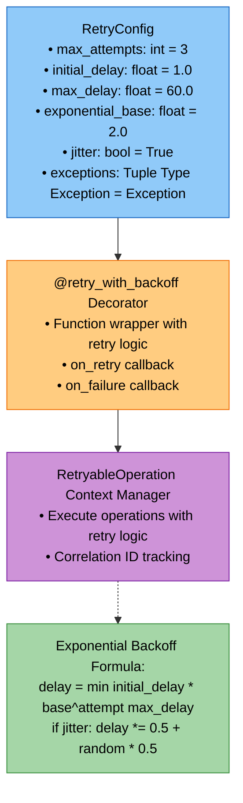
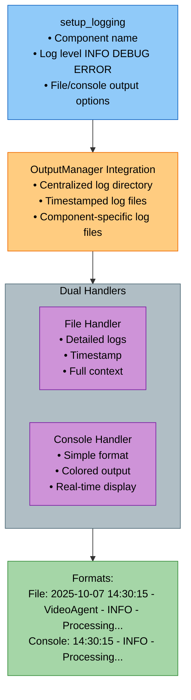
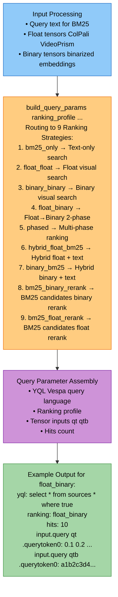

# Utils Module - Comprehensive Study Guide

**Package:** `cogniverse_core` (Core Layer)
**Module Location:** `libs/core/cogniverse_core/common/utils/`

---

## Table of Contents
1. [Module Overview](#module-overview)
2. [Architecture](#architecture)
3. [Core Components](#core-components)
4. [Usage Examples](#usage-examples)
5. [Testing Guide](#testing-guide)
6. [Production Considerations](#production-considerations)

---

## Module Overview

### Purpose
The Utils Module provides production-ready utilities that support the entire Cogniverse system with robust error handling, structured logging, query processing, and prompt management.

### Key Capabilities
- **Retry Logic**: Exponential backoff with jitter for transient failure handling
- **Logging Configuration**: Structured, multi-level logging with file and console output
- **Query Utilities**: Comprehensive query building for all 9 Vespa ranking strategies
- **Prompt Management**: Template management with artifact loading and variable substitution
- **Profile Resolution**: Strategy profile to ranking strategy mapping
- **Output Management**: Centralized directory structure for all output files

### Dependencies
```python
# External (used across utils modules)
import logging
import time
import random
from functools import wraps
from pathlib import Path
import numpy as np
import torch

# Internal (prompt_manager.py only)
from cogniverse_foundation.config.utils import get_config, create_default_config_manager
from typing import TYPE_CHECKING
if TYPE_CHECKING:
    from cogniverse_foundation.config.manager import ConfigManager
```

## Package Structure
```text
libs/core/cogniverse_core/common/utils/
├── async_polling.py                   # Production async polling utilities
├── comprehensive_query_utils.py       # Query building for all ranking strategies
├── logging_config.py                  # Centralized logging configuration
├── output_manager.py                  # Output directory management
├── profile_utils.py                   # Profile to strategy mapping
├── prompt_manager.py                  # Prompt template management
├── retry.py                           # Retry utilities with exponential backoff
└── vespa_query_utils.py              # Vespa-specific query construction
```

---

## Architecture

### 1. Retry System Architecture



### 2. Logging System Architecture



### 3. Query Building Architecture



---

## Core Components

### 1. Retry Utilities (`retry.py`)

#### RetryConfig
Configures retry behavior with exponential backoff.

```python
@dataclass
class RetryConfig:
    max_attempts: int = 3              # Maximum retry attempts
    initial_delay: float = 1.0         # Initial delay in seconds
    max_delay: float = 60.0            # Maximum delay cap
    exponential_base: float = 2.0      # Exponential growth factor
    jitter: bool = True                # Add random jitter
    exceptions: Tuple[Type[Exception], ...] = (Exception,)

    def should_retry(self, exception: Exception) -> bool:
        """Check if exception is retryable"""
        return isinstance(exception, self.exceptions)

    def get_delay(self, attempt: int) -> float:
        """Calculate delay with exponential backoff + jitter"""
        delay = min(
            self.initial_delay * (self.exponential_base ** (attempt - 1)),
            self.max_delay
        )
        if self.jitter:
            delay = delay * (0.5 + random.random() * 0.5)
        return delay
```

**Key Features:**

- Exponential backoff prevents thundering herd

- Jitter adds randomness to avoid synchronized retries

- Configurable exception types for selective retrying

- Delay capping prevents excessive wait times

**Source:** `libs/core/cogniverse_core/common/utils/retry.py:19-45`

---

#### @retry_with_backoff Decorator
Function decorator for automatic retry with backoff.

```python
def retry_with_backoff(
    func: Optional[Callable[..., T]] = None,
    *,
    config: Optional[RetryConfig] = None,
    on_retry: Optional[Callable[[Exception, int], None]] = None,
    on_failure: Optional[Callable[[Exception], None]] = None
) -> Union[Callable[..., T], Callable[[Callable[..., T]], Callable[..., T]]]:
    """
    Decorator for retrying functions with exponential backoff

    Usage:
        @retry_with_backoff(config=RetryConfig(max_attempts=5))
        def fetch_data():
            return requests.get(url)
    """
```

**Key Features:**

- Wraps any function with retry logic

- Optional callbacks for retry and failure events

- Preserves function signature with @wraps

- Supports both parameterized and non-parameterized usage

**Source:** `libs/core/cogniverse_core/common/utils/retry.py:48-122`

---

#### RetryableOperation Context Manager
Context manager for retry logic with correlation tracking.

```python
class RetryableOperation:
    """
    Context manager for retryable operations

    Example:
        with RetryableOperation(config=RetryConfig(max_attempts=3)) as retry:
            result = retry.execute(lambda: api.call())
    """

    def execute(self, operation: Callable[[], T]) -> T:
        """Execute operation with retry logic"""
```

**Key Features:**

- Context manager interface for retry operations

- Correlation ID for tracking retries across logs

- Automatic cleanup on exit

- Lambda-friendly execution interface

**Source:** `libs/core/cogniverse_core/common/utils/retry.py:125-180`

---

### 2. Logging Configuration (`logging_config.py`)

#### setup_logging()
Centralized logging configuration for components.

```python
def setup_logging(
    name: str,
    log_level: int = logging.INFO,
    log_to_file: bool = True,
    log_to_console: bool = True
) -> logging.Logger:
    """
    Setup logging configuration for a component

    Args:
        name: Logger name (e.g., "VideoAgent", "OrchestratorAgent")
        log_level: Logging level (default: INFO)
        log_to_file: Whether to log to file (default: True)
        log_to_console: Whether to log to console (default: True)

    Returns:
        Configured logger instance
    """
```

**Key Features:**

- Dual output (file + console) with different formats

- Integration with OutputManager for centralized log directory

- Timestamped log files per component

- Prevents duplicate handlers

**File Output Format:**
```text
2025-10-07 14:30:15 - VideoAgent - INFO - Processing query: "fire scene"
2025-10-07 14:30:16 - VideoAgent - DEBUG - Encoded query with 2 tokens
```

**Console Output Format:**
```text
14:30:15 - INFO - Processing query: "fire scene"
14:30:16 - DEBUG - Encoded query with 2 tokens
```

**Source:** `libs/core/cogniverse_core/common/utils/logging_config.py:9-69`

---

### 3. Comprehensive Query Utilities (`comprehensive_query_utils.py`)

#### binarize_token_vectors_hex()
Convert float vectors to binary hex format for Vespa.

```python
def binarize_token_vectors_hex(vectors: torch.Tensor) -> Dict[str, str]:
    """
    Convert float token vectors to binary hex format for Vespa queries.

    Args:
        vectors: Token vectors (num_tokens, 128)

    Returns:
        Dictionary mapping token indices to hex-encoded binary strings
    """
    binarized = np.packbits(np.where(vectors > 0, 1, 0), axis=1).astype(np.int8)
    vespa_token_feed = dict()
    for index in range(len(binarized)):
        vespa_token_feed[index] = str(hexlify(binarized[index].tobytes()), 'utf-8')
    return vespa_token_feed
```

**Binarization Process:**

1. Threshold at 0: `vectors > 0` → {0, 1}

2. Pack bits: 8 binary values → 1 byte

3. Convert to hex string for Vespa

**Source:** `libs/core/cogniverse_core/common/utils/comprehensive_query_utils.py:11-22`

---

#### build_query_params()
Build Vespa query parameters for any ranking strategy.

```python
def build_query_params(
    ranking_profile: str,
    float_tensors: Dict[str, List[float]] = None,
    binary_tensors: Dict[str, str] = None,
    text_query: str = "",
    hits: int = 10
) -> Dict[str, Any]:
    """
    Build query parameters for any of the 9 ranking strategies.

    Ranking Profiles:
    - bm25_only: Pure text search
    - float_float: Float visual search
    - binary_binary: Binary visual search
    - float_binary: Float→Binary 2-phase
    - phased: Multi-phase ranking
    - hybrid_float_bm25: Hybrid float + text
    - binary_bm25: Hybrid binary + text
    - bm25_binary_rerank: BM25 candidates, binary rerank
    - bm25_float_rerank: BM25 candidates, float rerank
    """
```

**Strategy-Specific Logic:**

- **Text-only (bm25_only)**: Uses YQL text search on `video_title`, `frame_description`, `audio_transcript`

- **Visual-only (float_float, binary_binary)**: Uses tensor inputs, YQL "where true"

- **Hybrid**: Combines text filtering with visual ranking

- **Rerank**: BM25 candidates, then neural reranking

**Source:** `libs/core/cogniverse_core/common/utils/comprehensive_query_utils.py:32-115`

---

#### benchmark_all_strategies()
Benchmark all 9 ranking strategies with a single query.

```python
def benchmark_all_strategies(
    query_text: str = "",
    num_tokens: int = 2,
    hits: int = 5,
    vespa_url: str = "http://localhost:8080"
) -> Dict[str, Any]:
    """
    Benchmark all 9 ranking strategies with a single query.

    Returns:
        Results from all ranking strategies with timing and hit counts
    """
```

**Output Example:**
```python
{
  "float_float": {
    "status": "success",
    "hits_count": 5,
    "query_time_ms": 45.2,
    "sample_scores": [0.892, 0.761, 0.643]
  },
  "binary_binary": {
    "status": "success",
    "hits_count": 5,
    "query_time_ms": 12.8,
    "sample_scores": [0.854, 0.732, 0.621]
  }
}
```

**Source:** `libs/core/cogniverse_core/common/utils/comprehensive_query_utils.py:117-209`

---

### 4. Vespa Query Utilities (`vespa_query_utils.py`)

#### build_binary_query_params()
Build 2-phase ColPali query: binary candidates + float reranking.

```python
def build_binary_query_params(
    binary_query_tensors: Dict[str, str],
    float_query_tensors: Dict[str, List[float]],
    target_hits: int = 100
) -> Dict[str, Any]:
    """
    Build query parameters for 2-phase ColPali search:
    1. Binary nearestNeighbor for candidate retrieval
    2. Float reranking for final results

    Returns:
        {
          "yql": "select * from sources * where (nearestNeighbor...)",
          "ranking": "colpali_binary_float",
          "input.query(binary_vector_0)": "a1b2c3...",
          "input.query(qt).querytoken0": "[0.1, 0.2, ...]"
        }
    """
```

**2-Phase Strategy:**

1. **Phase 1 (Binary)**: Fast candidate retrieval using binary embeddings

2. **Phase 2 (Float)**: Accurate reranking using float embeddings

**Source:** `libs/core/cogniverse_core/common/utils/vespa_query_utils.py:48-93`

---

#### build_hybrid_query_params()
Build hybrid (text + visual) search query.

```python
def build_hybrid_query_params(
    float_query_tensors: Dict[str, List[float]],
    text_query: str = "",
    hits: int = 10
) -> Dict[str, Any]:
    """
    Build query parameters for hybrid (text + visual) search.

    Combines:
    - Text search on video_title, frame_description, audio_transcript
    - Visual search using float embeddings
    - Hybrid ranking profile with weighted fusion
    """
```

**Source:** `libs/core/cogniverse_core/common/utils/vespa_query_utils.py:140-178`

---

### 5. Prompt Manager (`prompt_manager.py`)

#### PromptManager
Manages optimized prompts and few-shot examples with artifact loading.

```python
class PromptManager:
    """Manages routing prompts and few-shot examples"""

    def __init__(self,
                 artifacts_path: Optional[str] = None,
                 config_manager: "ConfigManager" = None,
                 tenant_id: str = "default"):
        """
        Initialize with optional optimization artifacts.

        Args:
            artifacts_path: Optional path to optimization artifacts
            config_manager: ConfigManager instance for dependency injection (required)
            tenant_id: Tenant identifier for config retrieval

        Priority order for artifact loading:
        1. Provided artifacts_path
        2. Path from config
        3. Modal volume mount point (/artifacts/)
        4. Local optimization results
        5. None (use defaults)
        """
```

**Key Methods:**

1. **get_routing_prompt(user_query, conversation_history)**: Build complete routing prompt
2. **get_model_config()**: Get model configuration from artifacts or defaults
3. **reload_artifacts()**: Hot-reload artifacts from disk
4. **get_status()**: Get current status (artifacts loaded, num examples, etc.)

**Artifact Format:**
```json
{
  "system_prompt": "You are a precise routing agent...",
  "few_shot_examples": [
    {
      "conversation_history": "",
      "user_query": "Show me cooking videos",
      "routing_decision": {
        "search_modality": "video",
        "generation_type": "raw_results"
      }
    }
  ],
  "model_config": {
    "temperature": 0.1,
    "max_tokens": 100,
    "model": "google/gemma-3-1b-it"
  }
}
```

**Source:** `libs/core/cogniverse_core/common/utils/prompt_manager.py:18-244`

---

### 6. Profile Utilities (`profile_utils.py`)

#### get_supported_ranking_strategies()
Map video processing profile to supported ranking strategies.

```python
def get_supported_ranking_strategies(profile: str) -> list:
    """
    Get the ranking strategies supported by each profile.

    Profile Support Matrix:
    - frame_based_colpali: ALL strategies (text data + visual embeddings)
    - direct_video_frame*: Visual + Hybrid strategies (video_title field)
    - colqwen profiles: Visual-only strategies (no text fields)
    """
```

**Profile → Strategy Mapping:**

| Profile | Text-Only | Visual-Only | Hybrid (with text fields) |
|---------|-----------|-------------|---------------------------|
| `frame_based_colpali` | ✅ bm25_only, bm25_no_description | ✅ float_float, binary_binary, float_binary, phased | ✅ hybrid_float_bm25, hybrid_binary_bm25, hybrid_bm25_binary, hybrid_bm25_float (all with optional no_description variants) |
| `direct_video_frame*` | ✅ bm25_only | ✅ float_float, binary_binary, float_binary, phased | ✅ hybrid_float_bm25, hybrid_binary_bm25, hybrid_bm25_binary, hybrid_bm25_float |
| `colqwen profiles` | ❌ | ✅ float_float, binary_binary, float_binary, phased | ❌ |

**Source:** `libs/core/cogniverse_core/common/utils/profile_utils.py:6-62`

---

### 7. Output Manager (`output_manager.py`)

#### OutputManager
Centralized directory management for all output files.

```python
class OutputManager:
    """Manages output directories for different components"""

    def __init__(self, base_dir: Optional[str] = None):
        """Initialize with base directory (default: outputs/)"""
        self.base_dir = Path(base_dir or "outputs")

        # Subdirectories
        self.subdirs = {
            "logs": "logs",
            "test_results": "test_results",
            "optimization": "optimization",
            "processing": "processing",
            "agents": "agents",
            "vespa": "vespa",
            "exports": "exports",
            "temp": "temp"
        }
```

**Key Methods:**

1. **get_path(component, filename)**: Get path for specific component
2. **get_logs_dir()**: Get logs directory
3. **get_processing_dir(subtype=None)**: Get processing directory (embeddings, transcripts, etc.)
4. **clean_temp()**: Clean temporary directory
5. **print_structure()**: Print directory structure

**Directory Structure:**
```text
outputs/
├── logs/                    # All log files
├── test_results/           # Test outputs
├── optimization/           # DSPy/GRPO artifacts
├── processing/            # Video processing artifacts (profiles create subdirs)
├── agents/                # Agent-specific outputs
├── vespa/                 # Vespa deployment artifacts
├── exports/               # User-facing exports
└── temp/                  # Temporary files
```

**Singleton Pattern:**
```python
def get_output_manager() -> OutputManager:
    """Get the singleton output manager instance"""
    global _output_manager
    if _output_manager is None:
        _output_manager = OutputManager()
    return _output_manager
```

**Source:** `libs/core/cogniverse_core/common/utils/output_manager.py:10-125`

---

## Usage Examples

### Example 1: Retry Logic for API Calls

```python
from cogniverse_core.common.utils.retry import retry_with_backoff, RetryConfig
import requests

# Configure retry for HTTP errors
http_retry_config = RetryConfig(
    max_attempts=5,
    initial_delay=1.0,
    max_delay=30.0,
    exceptions=(requests.RequestException,)
)

@retry_with_backoff(config=http_retry_config)
def fetch_embedding(video_id: str) -> np.ndarray:
    """Fetch embedding from remote service with retry"""
    response = requests.get(f"https://api.example.com/embeddings/{video_id}")
    response.raise_for_status()
    return np.array(response.json()["embedding"])

# Usage
try:
    embedding = fetch_embedding("video_123")
    print(f"Successfully fetched embedding: {embedding.shape}")
except requests.RequestException as e:
    print(f"Failed after 5 retries: {e}")
```

**Retry Timeline:**

- Attempt 1: Immediate

- Attempt 2: ~1.0s delay (1.0 * 2^0 = 1.0)

- Attempt 3: ~2.0s delay (1.0 * 2^1 = 2.0)

- Attempt 4: ~4.0s delay (1.0 * 2^2 = 4.0)

- Attempt 5: ~8.0s delay (1.0 * 2^3 = 8.0)

Total time: ~15 seconds with jitter

---

### Example 2: Structured Logging for Agents

```python
from cogniverse_core.common.utils.logging_config import setup_logging
import logging

# Setup agent logging
logger = setup_logging(
    name="VideoSearchAgent",
    log_level=logging.DEBUG,
    log_to_file=True,
    log_to_console=True
)

# Use throughout agent lifecycle
logger.info("Agent initialized")
logger.debug(f"Processing query: {query}")
logger.warning("ColPali model not found, using fallback")
logger.error("Vespa connection failed", exc_info=True)

# Log output locations:
# File: outputs/logs/VideoSearchAgent_1704672015.log
# Console: Real-time stream with colored output
```

**Log File Contents:**
```text
2025-10-07 14:30:15 - VideoSearchAgent - INFO - Agent initialized
2025-10-07 14:30:16 - VideoSearchAgent - DEBUG - Processing query: fire scene
2025-10-07 14:30:17 - VideoSearchAgent - WARNING - ColPali model not found, using fallback
2025-10-07 14:30:18 - VideoSearchAgent - ERROR - Vespa connection failed
Traceback (most recent call last):
  File "agent.py", line 42, in search
    response = vespa_client.query(params)
ConnectionError: Connection refused
```

---

### Example 3: Building Queries for All Ranking Strategies

```python
from cogniverse_core.common.utils.comprehensive_query_utils import (
    build_query_params,
    binarize_token_vectors_hex,
    float_query_token_vectors
)
import torch

# Encode query with ColPali
query_embeddings = model.encode("fire scene")  # (2, 128)

# Prepare tensors
float_tensors = float_query_token_vectors(query_embeddings)
binary_tensors = binarize_token_vectors_hex(query_embeddings)

# Build queries for different strategies
strategies = [
    "float_float",      # Pure visual search (float)
    "binary_binary",    # Pure visual search (binary)
    "float_binary",     # Float→Binary 2-phase
    "hybrid_float_bm25" # Hybrid text + visual
]

for strategy in strategies:
    query_params = build_query_params(
        ranking_profile=strategy,
        float_tensors=float_tensors,
        binary_tensors=binary_tensors,
        text_query="fire scene",
        hits=10
    )

    print(f"\n{strategy}:")
    print(f"  YQL: {query_params['yql'][:50]}...")
    print(f"  Ranking: {query_params['ranking']}")
    print(f"  Tensor inputs: {len([k for k in query_params if 'query' in k])}")
```

**Output:**
```text
float_float:
  YQL: select * from sources * where true...
  Ranking: float_float
  Tensor inputs: 2

binary_binary:
  YQL: select * from sources * where true...
  Ranking: binary_binary
  Tensor inputs: 2

float_binary:
  YQL: select * from sources * where true...
  Ranking: float_binary
  Tensor inputs: 4  # Both float and binary

hybrid_float_bm25:
  YQL: select * from sources * where (video_title contains...
  Ranking: hybrid_float_bm25
  Tensor inputs: 2
```

---

### Example 4: Prompt Management with Artifacts

```python
from cogniverse_core.common.utils.prompt_manager import PromptManager
from cogniverse_foundation.config.manager import ConfigManager
from cogniverse_vespa.config.config_store import VespaConfigStore

# Initialize with required config_manager and store
store = VespaConfigStore(vespa_url="http://localhost", vespa_port=8080)
config_manager = ConfigManager(store=store)
pm = PromptManager(config_manager=config_manager, tenant_id="default")

# Check status
status = pm.get_status()
print(f"Artifacts loaded: {status['artifacts_loaded']}")
print(f"Using {status['num_examples']} few-shot examples")
print(f"Model: {status['model_config']['model']}")

# Build routing prompt
prompt = pm.get_routing_prompt(
    user_query="Show me cooking videos",
    conversation_history="User previously searched for recipes"
)

print("\nGenerated Prompt:")
print(prompt)

# Reload artifacts after optimization
if pm.reload_artifacts("/artifacts/new_optimized_prompts.json"):
    print("✅ Reloaded new artifacts")
else:
    print("⚠️ Failed to reload, using existing artifacts")
```

**Generated Prompt Example:**
```text
You are a precise and efficient routing agent. Analyze the query and output a JSON object...

Examples:

Conversation History:
User Query: Show me how to cook pasta
Output: {"search_modality": "video", "generation_type": "raw_results"}

Conversation History: User previously searched for recipes
User Query: Show me cooking videos
Output:
```

---

### Example 5: Output Directory Management

```python
from cogniverse_core.common.utils.output_manager import get_output_manager

# Get singleton instance
output_mgr = get_output_manager()

# Print directory structure
output_mgr.print_structure()

# Get component-specific paths
log_file = output_mgr.get_path("logs", "agent_run_123.log")
processing_dir = output_mgr.get_processing_dir()
optimization_results = output_mgr.get_path("optimization", "grpo_checkpoint.pt")

# Write to centralized location
with open(log_file, "w") as f:
    f.write("Agent execution log...")

# Clean temporary files
output_mgr.clean_temp()

print(f"\nLog file: {log_file}")
print(f"Processing dir: {processing_dir}")
print(f"Optimization results: {optimization_results}")
```

**Output:**
```text
Output Directory Structure:
Base: /Users/amjain/source/hobby/cogniverse/outputs
  agents: /Users/amjain/source/hobby/cogniverse/outputs/agents
  exports: /Users/amjain/source/hobby/cogniverse/outputs/exports
  logs: /Users/amjain/source/hobby/cogniverse/outputs/logs
  optimization: /Users/amjain/source/hobby/cogniverse/outputs/optimization
  processing: /Users/amjain/source/hobby/cogniverse/outputs/processing
  temp: /Users/amjain/source/hobby/cogniverse/outputs/temp
  test_results: /Users/amjain/source/hobby/cogniverse/outputs/test_results
  vespa: /Users/amjain/source/hobby/cogniverse/outputs/vespa

Log file: outputs/logs/agent_run_123.log
Processing dir: outputs/processing
Optimization results: outputs/optimization/grpo_checkpoint.pt
```

---

## Testing Guide

### Test Coverage

**Unit Tests:**

- ✅ Retry logic: Exponential backoff calculation, jitter, exception filtering

- ✅ Query building: All 9 ranking strategies, tensor format conversion

- ✅ Prompt management: Artifact loading, fallback to defaults

- ✅ Output management: Directory creation, path resolution

**Integration Tests:**

- ✅ Logging: File and console output verification

- ✅ Vespa queries: End-to-end query execution for all strategies

- ✅ Retry with real services: HTTP retry behavior

- ✅ Prompt optimization: Artifact hot-reload

### Key Test Files

```python
# Common module tests - currently focused on config and profile utilities
tests/common/unit/test_agent_config.py
tests/common/unit/test_config_api_mixin.py
tests/common/unit/test_profile_validator.py
tests/common/unit/test_vespa_config_store.py

tests/common/integration/test_config_persistence.py
tests/common/integration/test_dynamic_config_integration.py

# Note: Dedicated utils tests (retry, logging, query, prompt, output)
# are tested indirectly through agent and integration tests
```

### Manual Testing

#### Test Retry Logic
```bash
# Create test script
cat > test_retry.py << 'EOF'
from cogniverse_core.common.utils.retry import retry_with_backoff, RetryConfig
import time

attempts = []

@retry_with_backoff(
    config=RetryConfig(max_attempts=3, initial_delay=0.5),
    on_retry=lambda e, a: attempts.append(a)
)
def flaky_function():
    print(f"Attempt {len(attempts) + 1}")
    if len(attempts) < 2:
        raise ValueError("Transient error")
    return "Success!"

result = flaky_function()
print(f"Result: {result}, Attempts: {len(attempts) + 1}")
EOF

python test_retry.py
# Expected: 3 attempts with exponential delays
```

#### Test Query Building
```bash
# Run comprehensive benchmark
python -c "
from cogniverse_core.common.utils.comprehensive_query_utils import (
    benchmark_all_strategies,
    print_benchmark_results
)

results = benchmark_all_strategies(
    query_text='fire',
    num_tokens=2,
    hits=5,
    vespa_url='http://localhost:8080'
)

print_benchmark_results(results)
"

# Expected: Benchmark results for all 9 strategies
```

---

## Production Considerations

### 1. Performance Characteristics

**Retry System:**

- **Overhead**: Minimal (microseconds for config)

- **Memory**: ~1KB per RetryableOperation instance

- **Latency**: Adds exponential backoff delays (configurable)

- **Recommendations**:
  - Use selective exception filtering to avoid retrying non-transient errors
  - Set `max_delay` to prevent excessive wait times
  - Enable jitter for distributed systems

**Query Building:**

- **Overhead**: ~1-2ms for query parameter assembly

- **Memory**: ~100KB for tensor storage (depends on num_tokens)

- **Recommendations**:
  - Cache query parameters for repeated queries
  - Use binary tensors for faster candidate retrieval
  - Batch multiple queries when possible

**Logging:**

- **File I/O**: ~5-10ms per log write (buffered)

- **Disk usage**: Grows unbounded without log rotation

- **Recommendations**:
  - Use `logging.handlers.RotatingFileHandler` for production
  - Set appropriate log levels (INFO for prod, DEBUG for dev)
  - Use console logging only for critical errors in production

### 2. Error Handling

**Retry Exhaustion:**
```python
# Handle final failure gracefully
@retry_with_backoff(
    config=RetryConfig(max_attempts=3),
    on_failure=lambda e: logger.error(f"Final failure: {e}")
)
def critical_operation():
    return api.call()

try:
    result = critical_operation()
except Exception as e:
    # Fallback logic
    result = fallback_handler(e)
```

**Query Building Errors:**
```python
# Validate inputs before building query
try:
    query_params = build_query_params(
        ranking_profile=strategy,
        float_tensors=float_tensors,
        text_query=text_query
    )
except KeyError as e:
    logger.error(f"Invalid ranking profile: {strategy}")
    # Fallback to default strategy
    query_params = build_query_params("float_float", float_tensors=float_tensors)
```

**Prompt Manager Fallback:**
```python
# Always have a fallback when artifacts fail to load
pm = PromptManager(artifacts_path="/path/to/optimized/artifacts.json")

if not pm.artifacts:
    logger.warning("Failed to load artifacts, using defaults")
    # System will automatically use default prompts from config
```

### 3. Monitoring Points

**Retry Metrics:**
```python
# Track retry statistics
retry_stats = {
    "total_retries": 0,
    "successful_retries": 0,
    "final_failures": 0
}

def on_retry_callback(exception, attempt):
    retry_stats["total_retries"] += 1
    logger.info(f"Retry {attempt}: {exception}")

def on_failure_callback(exception):
    retry_stats["final_failures"] += 1
    logger.error(f"Final failure: {exception}")

@retry_with_backoff(
    on_retry=on_retry_callback,
    on_failure=on_failure_callback
)
def monitored_operation():
    return api.call()
```

**Query Performance:**
```python
# Monitor query building and execution time
import time

def benchmark_query_strategy(strategy: str):
    start_time = time.time()

    # Build query
    build_start = time.time()
    query_params = build_query_params(ranking_profile=strategy, ...)
    build_time = time.time() - build_start

    # Execute query
    exec_start = time.time()
    response = vespa_client.query(query_params)
    exec_time = time.time() - exec_start

    total_time = time.time() - start_time

    logger.info(f"{strategy}: build={build_time*1000:.1f}ms, "
                f"exec={exec_time*1000:.1f}ms, total={total_time*1000:.1f}ms")
```

**Log File Monitoring:**
```bash
# Set up log rotation
from logging.handlers import RotatingFileHandler

handler = RotatingFileHandler(
    filename='outputs/logs/agent.log',
    maxBytes=10_000_000,  # 10MB
    backupCount=5          # Keep 5 old log files
)
logger.addHandler(handler)

# Monitor disk usage
du -sh outputs/logs/
```

### 4. Common Issues and Solutions

**Issue 1: Retry Loops Never Succeed**
- **Symptom**: All retry attempts fail, final exception raised
- **Cause**: Non-transient error being retried (e.g., 404 Not Found)
- **Solution**: Configure selective exception filtering

```python
# Only retry on transient network errors
from requests.exceptions import ConnectionError, Timeout

retry_config = RetryConfig(
    max_attempts=3,
    exceptions=(ConnectionError, Timeout)  # Don't retry 4xx errors
)
```

**Issue 2: Log Files Growing Too Large**
- **Symptom**: Disk space exhausted by large log files
- **Cause**: No log rotation configured
- **Solution**: Use RotatingFileHandler or external log rotation

```python
from logging.handlers import RotatingFileHandler

handler = RotatingFileHandler(
    'outputs/logs/agent.log',
    maxBytes=10_000_000,  # 10MB per file
    backupCount=5          # Keep 5 old files
)
```

**Issue 3: Query Parameters Malformed**
- **Symptom**: Vespa returns 400 Bad Request
- **Cause**: Missing tensors for ranking profile
- **Solution**: Validate inputs before building query

```python
def validate_query_inputs(ranking_profile, float_tensors, binary_tensors):
    if ranking_profile in ["float_float", "hybrid_float_bm25"]:
        assert float_tensors is not None, "Float tensors required"

    if ranking_profile in ["binary_binary", "float_binary"]:
        assert binary_tensors is not None, "Binary tensors required"

    # Build query only after validation
    return build_query_params(ranking_profile, float_tensors, binary_tensors)
```

**Issue 4: Prompt Artifacts Not Loading**
- **Symptom**: PromptManager falls back to defaults every time
- **Cause**: Incorrect artifact path or malformed JSON
- **Solution**: Verify artifact format and path

```bash
# Verify artifact exists
ls -lh /artifacts/unified_router_prompt_artifact.json

# Validate JSON format
python -m json.tool /artifacts/unified_router_prompt_artifact.json

# Check required fields
python -c "
import json
with open('/artifacts/unified_router_prompt_artifact.json') as f:
    artifacts = json.load(f)
    required = ['system_prompt', 'few_shot_examples', 'model_config']
    missing = [f for f in required if f not in artifacts]
    if missing:
        print(f'Missing fields: {missing}')
    else:
        print('✅ Artifact format valid')
"
```

---

## Summary

The Utils Module provides production-ready utilities that support the entire Cogniverse system:

### Key Takeaways

1. **Retry System**: Exponential backoff with jitter prevents thundering herd and handles transient failures gracefully
2. **Logging**: Dual output (file + console) with structured formats supports debugging and production monitoring
3. **Query Building**: Comprehensive support for all 9 Vespa ranking strategies with automatic parameter assembly
4. **Prompt Management**: Hot-reloadable artifacts enable continuous prompt optimization without system restarts
5. **Output Management**: Centralized directory structure keeps outputs organized and prevents main directory pollution

### Best Practices

1. **Always use retry logic** for external service calls (Vespa, Ollama, HTTP APIs)
2. **Configure log rotation** in production to prevent disk exhaustion
3. **Validate query inputs** before building parameters to avoid Vespa errors
4. **Monitor retry statistics** to identify systemic issues
5. **Use OutputManager singleton** for all file I/O to maintain consistency

### Integration Points

- **Agents**: Use retry logic for Vespa queries, logging for debugging
- **Routing**: Use query building for all 9 ranking strategies
- **Optimization**: Use prompt management for artifact loading
- **Ingestion**: Use output management for processing artifacts
- **Testing**: All utilities support comprehensive testing

---

**Related Guides:**

- `common.md` - Shared utilities and configuration

- `backends.md` - Vespa search integration

- `cache.md` - Caching system utilities

**Key Source Files:**

- `libs/core/cogniverse_core/common/utils/retry.py` - Retry logic

- `libs/core/cogniverse_core/common/utils/logging_config.py` - Logging configuration

- `libs/core/cogniverse_core/common/utils/comprehensive_query_utils.py` - Query building

- `libs/core/cogniverse_core/common/utils/prompt_manager.py` - Prompt management

- `libs/core/cogniverse_core/common/utils/output_manager.py` - Output directory management
