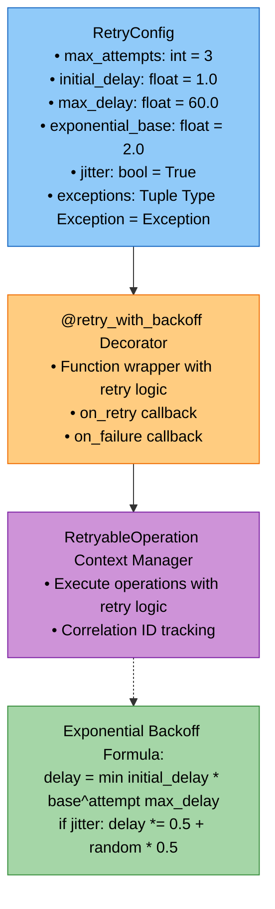

# Utils Module - Comprehensive Study Guide

**Package:** `cogniverse_core` (Core Layer)
**Module Location:** `libs/core/cogniverse_core/common/utils/`

---

## Table of Contents
1. [Module Overview](#module-overview)
2. [Architecture](#architecture)
3. [Core Components](#core-components)
4. [Usage Examples](#usage-examples)
5. [Testing Guide](#testing-guide)
6. [Production Considerations](#production-considerations)

---

## Module Overview

### Purpose
The Utils Module provides production-ready utilities that support the entire Cogniverse system with robust error handling and output management.

### Key Capabilities
- **Retry Logic**: Exponential backoff with jitter for transient failure handling
- **Output Management**: Centralized directory structure for all output files
- **Async Utilities**: Helpers for bridging async code from sync contexts and polled waits

### Dependencies
```python
# External (used across utils modules)
import logging
import time
import random
from functools import wraps
from pathlib import Path
import numpy as np
import torch
```

## Package Structure
```text
libs/core/cogniverse_core/common/utils/
├── async_bridge.py                    # Run a coroutine to completion from sync code
├── async_polling.py                   # Production async polling utilities
├── output_manager.py                  # Output directory management
└── retry.py                           # Retry utilities with exponential backoff
```

---

## Architecture

### 1. Retry System Architecture


```mermaid
flowchart TB
    RC["<span style='color:#000'>RetryConfig<br/>• max_attempts: int = 3<br/>• initial_delay: float = 1.0<br/>• max_delay: float = 60.0<br/>• exponential_base: float = 2.0<br/>• jitter: bool = True<br/>• exceptions: Tuple Type Exception = Exception</span>"]
    DEC["<span style='color:#000'>@retry_with_backoff Decorator<br/>• Function wrapper with retry logic<br/>• on_retry callback<br/>• on_failure callback</span>"]
    CTX["<span style='color:#000'>RetryableOperation Context Manager<br/>• Execute operations with retry logic<br/>• Correlation ID tracking</span>"]
    FORMULA["<span style='color:#000'>Exponential Backoff Formula:<br/>delay = min initial_delay * base^attempt max_delay<br/>if jitter: delay *= 0.5 + random * 0.5</span>"]

    RC --> DEC
    DEC --> CTX
    CTX -.-> FORMULA

    style RC fill:#90caf9,stroke:#1565c0,color:#000
    style DEC fill:#ffcc80,stroke:#ef6c00,color:#000
    style CTX fill:#ce93d8,stroke:#7b1fa2,color:#000
    style FORMULA fill:#a5d6a7,stroke:#388e3c,color:#000
```

---

## Core Components

### 1. Retry Utilities (`retry.py`)

#### RetryConfig
Configures retry behavior with exponential backoff.

```python
@dataclass
class RetryConfig:
    max_attempts: int = 3              # Maximum retry attempts
    initial_delay: float = 1.0         # Initial delay in seconds
    max_delay: float = 60.0            # Maximum delay cap
    exponential_base: float = 2.0      # Exponential growth factor
    jitter: bool = True                # Add random jitter
    exceptions: Tuple[Type[Exception], ...] = (Exception,)

    def should_retry(self, exception: Exception) -> bool:
        """Check if exception is retryable"""
        return isinstance(exception, self.exceptions)

    def get_delay(self, attempt: int) -> float:
        """Calculate delay with exponential backoff + jitter"""
        delay = min(
            self.initial_delay * (self.exponential_base ** (attempt - 1)),
            self.max_delay
        )
        if self.jitter:
            delay = delay * (0.5 + random.random() * 0.5)
        return delay
```

**Key Features:**

- Exponential backoff prevents thundering herd

- Jitter adds randomness to avoid synchronized retries

- Configurable exception types for selective retrying

- Delay capping prevents excessive wait times

**Source:** `libs/core/cogniverse_core/common/utils/retry.py:19-45`

---

#### @retry_with_backoff Decorator
Function decorator for automatic retry with backoff.

```python
def retry_with_backoff(
    func: Optional[Callable[..., T]] = None,
    *,
    config: Optional[RetryConfig] = None,
    on_retry: Optional[Callable[[Exception, int], None]] = None,
    on_failure: Optional[Callable[[Exception], None]] = None
) -> Union[Callable[..., T], Callable[[Callable[..., T]], Callable[..., T]]]:
    """
    Decorator for retrying functions with exponential backoff

    Usage:
        @retry_with_backoff(config=RetryConfig(max_attempts=5))
        def fetch_data():
            return requests.get(url)
    """
```

**Key Features:**

- Wraps any function with retry logic

- Optional callbacks for retry and failure events

- Preserves function signature with @wraps

- Supports both parameterized and non-parameterized usage

**Source:** `libs/core/cogniverse_core/common/utils/retry.py:48-122`

---

#### RetryableOperation Context Manager
Context manager for retry logic with correlation tracking.

```python
class RetryableOperation:
    """
    Context manager for retryable operations

    Example:
        with RetryableOperation(config=RetryConfig(max_attempts=3)) as retry:
            result = retry.execute(lambda: api.call())
    """

    def execute(self, operation: Callable[[], T]) -> T:
        """Execute operation with retry logic"""
```

**Key Features:**

- Context manager interface for retry operations

- Correlation ID for tracking retries across logs

- Automatic cleanup on exit

- Lambda-friendly execution interface

**Source:** `libs/core/cogniverse_core/common/utils/retry.py:125-180`

---

### 2. Output Manager (`output_manager.py`)

#### OutputManager
Centralized directory management for all output files.

```python
class OutputManager:
    """Manages output directories for different components"""

    def __init__(self, base_dir: Optional[str] = None):
        """Initialize with base directory (default: outputs/)"""
        self.base_dir = Path(base_dir or "outputs")

        # Subdirectories
        self.subdirs = {
            "logs": "logs",
            "test_results": "test_results",
            "optimization": "optimization",
            "processing": "processing",
            "agents": "agents",
            "vespa": "vespa",
            "exports": "exports",
            "temp": "temp"
        }
```

**Key Methods:**

1. **get_path(component, filename)**: Get path for specific component
2. **get_logs_dir()**: Get logs directory
3. **get_processing_dir(subtype=None)**: Get processing directory (embeddings, transcripts, etc.)
4. **clean_temp()**: Clean temporary directory
5. **print_structure()**: Print directory structure

**Directory Structure:**
```text
outputs/
├── logs/                    # All log files
├── test_results/           # Test outputs
├── optimization/           # DSPy/GRPO artifacts
├── processing/            # Video processing artifacts (profiles create subdirs)
├── agents/                # Agent-specific outputs
├── vespa/                 # Vespa deployment artifacts
├── exports/               # User-facing exports
└── temp/                  # Temporary files
```

**Singleton Pattern:**
```python
def get_output_manager() -> OutputManager:
    """Get the singleton output manager instance"""
    global _output_manager
    if _output_manager is None:
        _output_manager = OutputManager()
    return _output_manager
```

**Source:** `libs/core/cogniverse_core/common/utils/output_manager.py:10-125`

---

## Usage Examples

### Example 1: Retry Logic for API Calls

```python
from cogniverse_core.common.utils.retry import retry_with_backoff, RetryConfig
import requests

# Configure retry for HTTP errors
http_retry_config = RetryConfig(
    max_attempts=5,
    initial_delay=1.0,
    max_delay=30.0,
    exceptions=(requests.RequestException,)
)

@retry_with_backoff(config=http_retry_config)
def fetch_embedding(video_id: str) -> np.ndarray:
    """Fetch embedding from remote service with retry"""
    response = requests.get(f"https://api.example.com/embeddings/{video_id}")
    response.raise_for_status()
    return np.array(response.json()["embedding"])

# Usage
try:
    embedding = fetch_embedding("video_123")
    print(f"Successfully fetched embedding: {embedding.shape}")
except requests.RequestException as e:
    print(f"Failed after 5 retries: {e}")
```

**Retry Timeline:**

- Attempt 1: Immediate

- Attempt 2: ~1.0s delay (1.0 * 2^0 = 1.0)

- Attempt 3: ~2.0s delay (1.0 * 2^1 = 2.0)

- Attempt 4: ~4.0s delay (1.0 * 2^2 = 4.0)

- Attempt 5: ~8.0s delay (1.0 * 2^3 = 8.0)

Total time: ~15 seconds with jitter

---

### Example 2: Output Directory Management

```python
from cogniverse_core.common.utils.output_manager import get_output_manager

# Get singleton instance
output_mgr = get_output_manager()

# Print directory structure
output_mgr.print_structure()

# Get component-specific paths
log_file = output_mgr.get_path("logs", "agent_run_123.log")
processing_dir = output_mgr.get_processing_dir()
optimization_results = output_mgr.get_path("optimization", "grpo_checkpoint.pt")

# Write to centralized location
with open(log_file, "w") as f:
    f.write("Agent execution log...")

# Clean temporary files
output_mgr.clean_temp()

print(f"\nLog file: {log_file}")
print(f"Processing dir: {processing_dir}")
print(f"Optimization results: {optimization_results}")
```

**Output:**
```text
Output Directory Structure:
Base: /Users/amjain/source/hobby/cogniverse/outputs
  agents: /Users/amjain/source/hobby/cogniverse/outputs/agents
  exports: /Users/amjain/source/hobby/cogniverse/outputs/exports
  logs: /Users/amjain/source/hobby/cogniverse/outputs/logs
  optimization: /Users/amjain/source/hobby/cogniverse/outputs/optimization
  processing: /Users/amjain/source/hobby/cogniverse/outputs/processing
  temp: /Users/amjain/source/hobby/cogniverse/outputs/temp
  test_results: /Users/amjain/source/hobby/cogniverse/outputs/test_results
  vespa: /Users/amjain/source/hobby/cogniverse/outputs/vespa

Log file: outputs/logs/agent_run_123.log
Processing dir: outputs/processing
Optimization results: outputs/optimization/grpo_checkpoint.pt
```

---

## Testing Guide

### Test Coverage

**Unit Tests:**

- ✅ Retry logic: Exponential backoff calculation, jitter, exception filtering

- ✅ Output management: Directory creation, path resolution

**Integration Tests:**

- ✅ Retry with real services: HTTP retry behavior

### Key Test Files

```python
# Common module tests - currently focused on config and profile utilities
tests/common/unit/test_agent_config.py
tests/common/unit/test_config_api_mixin.py
tests/common/unit/test_profile_validator.py
tests/common/unit/test_vespa_config_store.py

tests/common/integration/test_config_persistence.py
tests/common/integration/test_dynamic_config_integration.py

# Note: Dedicated utils tests (retry, logging, query, output)
# are tested indirectly through agent and integration tests
```

### Manual Testing

#### Test Retry Logic
```bash
# Create test script
cat > test_retry.py << 'EOF'
from cogniverse_core.common.utils.retry import retry_with_backoff, RetryConfig
import time

attempts = []

@retry_with_backoff(
    config=RetryConfig(max_attempts=3, initial_delay=0.5),
    on_retry=lambda e, a: attempts.append(a)
)
def flaky_function():
    print(f"Attempt {len(attempts) + 1}")
    if len(attempts) < 2:
        raise ValueError("Transient error")
    return "Success!"

result = flaky_function()
print(f"Result: {result}, Attempts: {len(attempts) + 1}")
EOF

python test_retry.py
# Expected: 3 attempts with exponential delays
```

---

## Production Considerations

### 1. Performance Characteristics

**Retry System:**

- **Overhead**: Minimal (microseconds for config)

- **Memory**: ~1KB per RetryableOperation instance

- **Latency**: Adds exponential backoff delays (configurable)

- **Recommendations**:
  - Use selective exception filtering to avoid retrying non-transient errors
  - Set `max_delay` to prevent excessive wait times
  - Enable jitter for distributed systems

### 2. Error Handling

**Retry Exhaustion:**
```python
# Handle final failure gracefully
@retry_with_backoff(
    config=RetryConfig(max_attempts=3),
    on_failure=lambda e: logger.error(f"Final failure: {e}")
)
def critical_operation():
    return api.call()

try:
    result = critical_operation()
except Exception as e:
    # Fallback logic
    result = fallback_handler(e)
```

### 3. Monitoring Points

**Retry Metrics:**
```python
# Track retry statistics
retry_stats = {
    "total_retries": 0,
    "successful_retries": 0,
    "final_failures": 0
}

def on_retry_callback(exception, attempt):
    retry_stats["total_retries"] += 1
    logger.info(f"Retry {attempt}: {exception}")

def on_failure_callback(exception):
    retry_stats["final_failures"] += 1
    logger.error(f"Final failure: {exception}")

@retry_with_backoff(
    on_retry=on_retry_callback,
    on_failure=on_failure_callback
)
def monitored_operation():
    return api.call()
```

### 4. Common Issues and Solutions

**Issue 1: Retry Loops Never Succeed**
- **Symptom**: All retry attempts fail, final exception raised
- **Cause**: Non-transient error being retried (e.g., 404 Not Found)
- **Solution**: Configure selective exception filtering

```python
# Only retry on transient network errors
from requests.exceptions import ConnectionError, Timeout

retry_config = RetryConfig(
    max_attempts=3,
    exceptions=(ConnectionError, Timeout)  # Don't retry 4xx errors
)
```

---

## Summary

The Utils Module provides production-ready utilities that support the entire Cogniverse system:

### Key Takeaways

1. **Retry System**: Exponential backoff with jitter prevents thundering herd and handles transient failures gracefully
2. **Output Management**: Centralized directory structure keeps outputs organized and prevents main directory pollution
3. **Async Utilities**: `async_bridge.py` and `async_polling.py` provide safe bridging and polled-wait helpers for mixed sync/async code

### Best Practices

1. **Always use retry logic** for external service calls (Vespa, Ollama, HTTP APIs)
2. **Monitor retry statistics** to identify systemic issues
3. **Use OutputManager singleton** for all file I/O to maintain consistency

### Integration Points

- **Agents**: Use retry logic for Vespa queries
- **Ingestion**: Use output management for processing artifacts
- **Testing**: All utilities support comprehensive testing

---

**Related Guides:**

- `common.md` - Shared utilities and configuration

- `backends.md` - Vespa search integration

- `cache.md` - Caching system utilities

**Key Source Files:**

- `libs/core/cogniverse_core/common/utils/retry.py` - Retry logic

- `libs/core/cogniverse_core/common/utils/output_manager.py` - Output directory management

- `libs/core/cogniverse_core/common/utils/async_bridge.py` - Sync-to-async bridge

- `libs/core/cogniverse_core/common/utils/async_polling.py` - Async polling utilities
