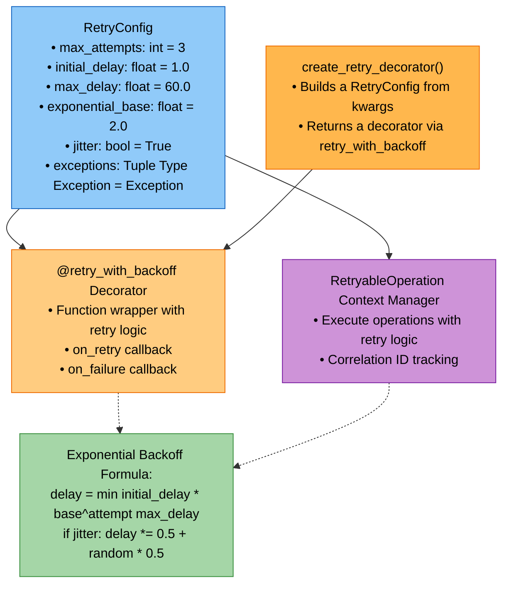
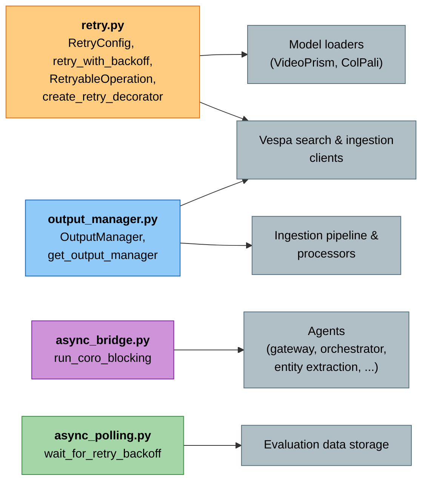

# Utils Module - Comprehensive Study Guide

**Package:** `cogniverse_core` (Core Layer)
**Module Location:** `libs/core/cogniverse_core/common/utils/`

---

## Table of Contents
1. [Module Overview](#module-overview)
2. [Architecture](#architecture)
3. [Core Components](#core-components)
4. [Usage Examples](#usage-examples)
5. [Testing Guide](#testing-guide)
6. [Production Considerations](#production-considerations)

---

## Module Overview

### Purpose
The Utils Module provides production-ready utilities that support the entire Cogniverse system with robust error handling and output management.

### Key Capabilities
- **Retry Logic**: Exponential backoff with jitter for transient failure handling
- **Output Management**: Centralized directory structure for all output files
- **Async Utilities**: Helpers for bridging async code from sync contexts and polled waits

### Dependencies
```python
# Standard library only - used across utils modules
import logging
import time
import random
import asyncio
from dataclasses import dataclass
from functools import wraps
from pathlib import Path
from concurrent.futures import ThreadPoolExecutor
```

## Package Structure
```text
libs/core/cogniverse_core/common/utils/
├── async_bridge.py                    # Run a coroutine to completion from sync code
├── async_polling.py                   # Production async polling utilities
├── output_manager.py                  # Output directory management
└── retry.py                           # Retry utilities with exponential backoff
```

---

## Architecture

### 1. Retry System Architecture

`retry_with_backoff` and `RetryableOperation` are independent entry points that
both consume `RetryConfig` and both call `RetryConfig.get_delay()` for the
backoff formula - the decorator does not wrap the context manager.


```mermaid
flowchart TB
    RC["<span style='color:#000'>RetryConfig<br/>• max_attempts: int = 3<br/>• initial_delay: float = 1.0<br/>• max_delay: float = 60.0<br/>• exponential_base: float = 2.0<br/>• jitter: bool = True<br/>• exceptions: Tuple Type Exception = Exception</span>"]
    DEC["<span style='color:#000'>@retry_with_backoff Decorator<br/>• Function wrapper with retry logic<br/>• on_retry callback<br/>• on_failure callback</span>"]
    CTX["<span style='color:#000'>RetryableOperation Context Manager<br/>• Execute operations with retry logic<br/>• Correlation ID tracking</span>"]
    CRD["<span style='color:#000'>create_retry_decorator()<br/>• Builds a RetryConfig from kwargs<br/>• Returns a decorator via retry_with_backoff</span>"]
    FORMULA["<span style='color:#000'>Exponential Backoff Formula:<br/>delay = min initial_delay * base^attempt max_delay<br/>if jitter: delay *= 0.5 + random * 0.5</span>"]

    RC --> DEC
    RC --> CTX
    CRD --> DEC
    DEC -.-> FORMULA
    CTX -.-> FORMULA

    style RC fill:#90caf9,stroke:#1565c0,color:#000
    style DEC fill:#ffcc80,stroke:#ef6c00,color:#000
    style CTX fill:#ce93d8,stroke:#7b1fa2,color:#000
    style CRD fill:#ffb74d,stroke:#ef6c00,color:#000
    style FORMULA fill:#a5d6a7,stroke:#388e3c,color:#000
```

### 2. Package Overview


```mermaid
flowchart LR
    RETRY["<span style='color:#000'><b>retry.py</b><br/>RetryConfig, retry_with_backoff,<br/>RetryableOperation,<br/>create_retry_decorator</span>"]
    OUT["<span style='color:#000'><b>output_manager.py</b><br/>OutputManager,<br/>get_output_manager</span>"]
    BRIDGE["<span style='color:#000'><b>async_bridge.py</b><br/>run_coro_blocking</span>"]
    POLL["<span style='color:#000'><b>async_polling.py</b><br/>wait_for_retry_backoff</span>"]

    MODELS["<span style='color:#000'>Model loaders<br/>(VideoPrism, ColPali)</span>"]
    VESPA["<span style='color:#000'>Vespa search &amp; ingestion<br/>clients</span>"]
    INGEST["<span style='color:#000'>Ingestion pipeline &amp;<br/>processors</span>"]
    AGENTS["<span style='color:#000'>Agents<br/>(gateway, orchestrator,<br/>entity extraction, ...)</span>"]
    EVAL["<span style='color:#000'>Evaluation data storage</span>"]

    RETRY --> MODELS
    RETRY --> VESPA
    OUT --> INGEST
    OUT --> VESPA
    BRIDGE --> AGENTS
    POLL --> EVAL

    style RETRY fill:#ffcc80,stroke:#ef6c00,color:#000
    style OUT fill:#90caf9,stroke:#1565c0,color:#000
    style BRIDGE fill:#ce93d8,stroke:#7b1fa2,color:#000
    style POLL fill:#a5d6a7,stroke:#388e3c,color:#000
    style MODELS fill:#b0bec5,stroke:#546e7a,color:#000
    style VESPA fill:#b0bec5,stroke:#546e7a,color:#000
    style INGEST fill:#b0bec5,stroke:#546e7a,color:#000
    style AGENTS fill:#b0bec5,stroke:#546e7a,color:#000
    style EVAL fill:#b0bec5,stroke:#546e7a,color:#000
```

---

## Core Components

### 1. Retry Utilities (`retry.py`)

#### RetryConfig
Configures retry behavior with exponential backoff.

```python
@dataclass
class RetryConfig:
    max_attempts: int = 3              # Maximum retry attempts
    initial_delay: float = 1.0         # Initial delay in seconds
    max_delay: float = 60.0            # Maximum delay cap
    exponential_base: float = 2.0      # Exponential growth factor
    jitter: bool = True                # Add random jitter
    exceptions: Tuple[Type[Exception], ...] = (Exception,)

    def should_retry(self, exception: Exception) -> bool:
        """Check if exception is retryable"""
        return isinstance(exception, self.exceptions)

    def get_delay(self, attempt: int) -> float:
        """Calculate delay with exponential backoff + jitter"""
        delay = min(
            self.initial_delay * (self.exponential_base ** (attempt - 1)),
            self.max_delay
        )
        if self.jitter:
            delay = delay * (0.5 + random.random() * 0.5)
        return delay
```

**Key Features:**

- Exponential backoff prevents thundering herd

- Jitter adds randomness to avoid synchronized retries

- Configurable exception types for selective retrying

- Delay capping prevents excessive wait times

**Source:** `libs/core/cogniverse_core/common/utils/retry.py:19-45`

---

#### @retry_with_backoff Decorator
Function decorator for automatic retry with backoff.

```python
def retry_with_backoff(
    func: Optional[Callable[..., T]] = None,
    *,
    config: Optional[RetryConfig] = None,
    on_retry: Optional[Callable[[Exception, int], None]] = None,
    on_failure: Optional[Callable[[Exception], None]] = None
) -> Union[Callable[..., T], Callable[[Callable[..., T]], Callable[..., T]]]:
    """
    Decorator for retrying functions with exponential backoff

    Usage:
        @retry_with_backoff(config=RetryConfig(max_attempts=5))
        def fetch_data():
            return requests.get(url)
    """
```

**Key Features:**

- Wraps any function with retry logic

- Optional callbacks for retry and failure events

- Preserves function signature with @wraps

- Supports both parameterized and non-parameterized usage

**Source:** `libs/core/cogniverse_core/common/utils/retry.py:48-122`

---

#### RetryableOperation Context Manager
Context manager for retry logic with correlation tracking.

```python
class RetryableOperation:
    """
    Context manager for retryable operations

    Example:
        with RetryableOperation(config=RetryConfig(max_attempts=3)) as retry:
            result = retry.execute(lambda: api.call())
    """

    def __init__(
        self,
        config: Optional[RetryConfig] = None,
        correlation_id: Optional[str] = None,
    ):
        """config defaults to RetryConfig(); correlation_id defaults to "default" """

    def execute(self, operation: Callable[[], T]) -> T:
        """Execute operation with retry logic"""
```

**Key Features:**

- Context manager interface for retry operations

- Correlation ID for tracking retries across logs (`__enter__`/`__exit__` do not suppress exceptions - `__exit__` always returns `False`)

- Lambda-friendly execution interface

**Source:** `libs/core/cogniverse_core/common/utils/retry.py:125-176`

---

#### create_retry_decorator()
Factory that builds a preconfigured `RetryConfig` and returns a decorator via `retry_with_backoff`.

```python
def create_retry_decorator(
    max_attempts: int = 3,
    exceptions: Tuple[Type[Exception], ...] = (Exception,),
    initial_delay: float = 1.0,
    max_delay: float = 60.0,
) -> Callable:
    """
    Create a retry decorator with specific configuration

    Example:
        http_retry = create_retry_decorator(
            max_attempts=5,
            exceptions=(requests.RequestException,),
            initial_delay=0.5
        )

        @http_retry
        def fetch_data(url):
            return requests.get(url)
    """
```

**Key Features:**

- Convenience wrapper for the common case of reusing one retry policy across multiple functions

- Returns a plain decorator (not a class) so it can be assigned to a module-level variable

**Source:** `libs/core/cogniverse_core/common/utils/retry.py:179-215`

---

### 2. Output Manager (`output_manager.py`)

#### OutputManager
Centralized directory management for all output files.

```python
class OutputManager:
    """Manages output directories for different components"""

    def __init__(self, base_dir: Optional[str] = None):
        """Initialize with base directory (default: outputs/), creating it
        and all subdirectories immediately."""
        self.base_dir = Path(base_dir or "outputs")
        self.base_dir.mkdir(exist_ok=True)

        # Subdirectories
        self.subdirs = {
            "logs": "logs",
            "test_results": "test_results",
            "optimization": "optimization",
            "processing": "processing",
            "agents": "agents",
            "vespa": "vespa",
            "exports": "exports",
            "temp": "temp"
        }

        self._create_subdirectories()
```

**Key Methods:**

1. **get_path(component, filename=None)**: Get path for specific component; if `component` is not a known subdir it is registered and created on demand
2. **get_logs_dir()**: Get logs directory
3. **get_test_results_dir()**: Get test results directory
4. **get_optimization_dir()**: Get optimization directory (DSPy/GRPO artifacts)
5. **get_processing_dir(subtype=None)**: Get processing directory; `subtype` is currently unused - profiles create their own subdirs underneath
6. **get_temp_dir()**: Get temporary directory
7. **clean_temp()**: Delete all files and subdirectories under the temp directory
8. **get_structure()**: Return the directory structure as a `dict` (`{name: path_str}`, includes a `"base"` key)
9. **print_structure()**: Print the directory structure directly (independent implementation, sorted by key)

**Directory Structure:**
```text
outputs/
├── logs/                    # All log files
├── test_results/           # Test outputs
├── optimization/           # DSPy/GRPO artifacts
├── processing/            # Video processing artifacts (profiles create subdirs)
├── agents/                # Agent-specific outputs
├── vespa/                 # Vespa deployment artifacts
├── exports/               # User-facing exports
└── temp/                  # Temporary files
```

**Singleton Pattern:**
```python
def get_output_manager() -> OutputManager:
    """Get the singleton output manager instance"""
    global _output_manager
    if _output_manager is None:
        _output_manager = OutputManager()
    return _output_manager
```

**Source:** `libs/core/cogniverse_core/common/utils/output_manager.py:10-112` (class); singleton helper at `:119-124`

---

### 3. Async Bridge (`async_bridge.py`)

#### run_coro_blocking()
Runs a coroutine to completion from synchronous code, whether or not an event loop is already running on the current thread.

```python
def run_coro_blocking(coro: Any) -> Any:
    """Run a coroutine to completion from synchronous code.

    When an event loop is already running in this thread (e.g. a sync method
    invoked from within an async request path), the coroutine is driven on a
    worker thread via ``asyncio.run`` in a ``ThreadPoolExecutor`` to avoid a
    "loop already running" error; otherwise it runs directly via
    ``asyncio.run``.
    """
```

**Key Features:**

- No running loop on the current thread: runs the coroutine directly via `asyncio.run(coro)`

- Running loop on the current thread: submits `asyncio.run(coro)` to a single-worker `ThreadPoolExecutor` and blocks on `.result()`, avoiding Python's "asyncio.run() cannot be called from a running event loop" error

- Used by agent sync call sites that need to invoke async ArtifactManager / telemetry APIs, e.g. `gateway_agent.py`, `orchestrator_agent.py`, `query_enhancement_agent.py`, `profile_selection_agent.py`, `entity_extraction_agent.py`, `graph/claim_extractor.py`

**Source:** `libs/core/cogniverse_core/common/utils/async_bridge.py:8-26`

---

### 4. Async Polling (`async_polling.py`)

#### wait_for_retry_backoff()
Semantic replacement for a bare `time.sleep()` call in retry loops - computes an exponential or linear backoff delay and sleeps for it.

```python
def wait_for_retry_backoff(
    attempt: int,
    base_delay: float = 1.0,
    max_delay: float = 60.0,
    exponential: bool = True,
    description: str = "retry backoff",
) -> None:
    """
    Wait with exponential or linear backoff for retries.

    Args:
        attempt: Current attempt number (0-based)
        base_delay: Base delay in seconds
        max_delay: Maximum delay in seconds
        exponential: Use exponential backoff if True, linear if False
        description: Description of what we're retrying
    """
```

**Key Features:**

- Exponential mode: `delay = min(base_delay * 2**attempt, max_delay)`

- Linear mode: `delay = min(base_delay * (attempt + 1), max_delay)`

- No jitter (unlike `RetryConfig.get_delay`) and no callback hooks - it is a plain blocking sleep, not a full retry mechanism

- Used by `libs/evaluation/cogniverse_evaluation/data/storage.py`

**Source:** `libs/core/cogniverse_core/common/utils/async_polling.py:11-36`

---

## Usage Examples

### Example 1: Retry Logic for API Calls

```python
from cogniverse_core.common.utils.retry import retry_with_backoff, RetryConfig
import requests

# Configure retry for HTTP errors
http_retry_config = RetryConfig(
    max_attempts=5,
    initial_delay=1.0,
    max_delay=30.0,
    exceptions=(requests.RequestException,)
)

@retry_with_backoff(config=http_retry_config)
def fetch_embedding(video_id: str) -> np.ndarray:
    """Fetch embedding from remote service with retry"""
    response = requests.get(f"https://api.example.com/embeddings/{video_id}")
    response.raise_for_status()
    return np.array(response.json()["embedding"])

# Usage
try:
    embedding = fetch_embedding("video_123")
    print(f"Successfully fetched embedding: {embedding.shape}")
except requests.RequestException as e:
    print(f"Failed after 5 retries: {e}")
```

**Retry Timeline:**

- Attempt 1: Immediate

- Attempt 2: ~1.0s delay (1.0 * 2^0 = 1.0)

- Attempt 3: ~2.0s delay (1.0 * 2^1 = 2.0)

- Attempt 4: ~4.0s delay (1.0 * 2^2 = 4.0)

- Attempt 5: ~8.0s delay (1.0 * 2^3 = 8.0)

Total time: ~15 seconds with jitter

---

### Example 2: Output Directory Management

```python
from cogniverse_core.common.utils.output_manager import get_output_manager

# Get singleton instance
output_mgr = get_output_manager()

# Print directory structure
output_mgr.print_structure()

# Get component-specific paths
log_file = output_mgr.get_path("logs", "agent_run_123.log")
processing_dir = output_mgr.get_processing_dir()
optimization_results = output_mgr.get_path("optimization", "grpo_checkpoint.pt")

# Write to centralized location
with open(log_file, "w") as f:
    f.write("Agent execution log...")

# Clean temporary files
output_mgr.clean_temp()

print(f"\nLog file: {log_file}")
print(f"Processing dir: {processing_dir}")
print(f"Optimization results: {optimization_results}")
```

**Output:**
```text
Output Directory Structure:
Base: outputs
  agents: outputs/agents
  exports: outputs/exports
  logs: outputs/logs
  optimization: outputs/optimization
  processing: outputs/processing
  temp: outputs/temp
  test_results: outputs/test_results
  vespa: outputs/vespa

Log file: outputs/logs/agent_run_123.log
Processing dir: outputs/processing
Optimization results: outputs/optimization/grpo_checkpoint.pt
```

---

## Testing Guide

### Test Coverage

**Unit Tests:**

- ✅ `async_bridge.run_coro_blocking`: dedicated coverage for the no-loop path, the running-loop-bridges-to-a-thread path, and exception propagation on both paths

- ⚠️ `retry.py`: no dedicated unit test exercises `RetryConfig.get_delay`, `RetryConfig.should_retry`, `retry_with_backoff`, `RetryableOperation`, or `create_retry_decorator` directly. `tests/core/unit/test_model_loaders.py` monkeypatches `cogniverse_core.common.utils.retry.time.sleep` only to make model-loader retry decorators instant in unrelated tests - it does not assert backoff timing, jitter, or exception filtering

- ⚠️ `output_manager.py`: no dedicated unit test. `OutputManager`/`get_output_manager` are exercised indirectly wherever ingestion processor tests import `tests/test_utils.py`'s `TestResultsFormatter`, which calls `get_output_manager().get_test_results_dir()`

- ⚠️ `async_polling.wait_for_retry_backoff`: no test found (production usage is limited to `libs/evaluation/cogniverse_evaluation/data/storage.py`)

### Key Test Files

```python
# Dedicated coverage
tests/core/unit/test_async_bridge.py

# Indirect coverage (imports OutputManager via TestResultsFormatter)
tests/test_utils.py
tests/ingestion/unit/test_pipeline.py
tests/ingestion/unit/test_audio_processor.py
tests/ingestion/unit/test_keyframe_processor.py
tests/ingestion/unit/test_chunk_processor.py
tests/ingestion/unit/test_vlm_descriptor.py

# Indirect coverage (mocks retry.py's time.sleep to skip backoff delay)
tests/core/unit/test_model_loaders.py
```

### Manual Testing

#### Test Retry Logic
```bash
# Create test script
cat > test_retry.py << 'EOF'
from cogniverse_core.common.utils.retry import retry_with_backoff, RetryConfig
import time

attempts = []

@retry_with_backoff(
    config=RetryConfig(max_attempts=3, initial_delay=0.5),
    on_retry=lambda e, a: attempts.append(a)
)
def flaky_function():
    print(f"Attempt {len(attempts) + 1}")
    if len(attempts) < 2:
        raise ValueError("Transient error")
    return "Success!"

result = flaky_function()
print(f"Result: {result}, Attempts: {len(attempts) + 1}")
EOF

uv run python test_retry.py
# Expected: 3 attempts with exponential delays
```

---

## Production Considerations

### 1. Performance Characteristics

**Retry System:**

- **Overhead**: Minimal (microseconds for config)

- **Memory**: ~1KB per RetryableOperation instance

- **Latency**: Adds exponential backoff delays (configurable)

- **Recommendations**:
  - Use selective exception filtering to avoid retrying non-transient errors
  - Set `max_delay` to prevent excessive wait times
  - Enable jitter for distributed systems

### 2. Error Handling

**Retry Exhaustion:**
```python
# Handle final failure gracefully
@retry_with_backoff(
    config=RetryConfig(max_attempts=3),
    on_failure=lambda e: logger.error(f"Final failure: {e}")
)
def critical_operation():
    return api.call()

try:
    result = critical_operation()
except Exception as e:
    # Fallback logic
    result = fallback_handler(e)
```

### 3. Monitoring Points

**Retry Metrics:**
```python
# Track retry statistics
retry_stats = {
    "total_retries": 0,
    "successful_retries": 0,
    "final_failures": 0
}

def on_retry_callback(exception, attempt):
    retry_stats["total_retries"] += 1
    logger.info(f"Retry {attempt}: {exception}")

def on_failure_callback(exception):
    retry_stats["final_failures"] += 1
    logger.error(f"Final failure: {exception}")

@retry_with_backoff(
    on_retry=on_retry_callback,
    on_failure=on_failure_callback
)
def monitored_operation():
    return api.call()
```

### 4. Common Issues and Solutions

**Issue 1: Retry Loops Never Succeed**
- **Symptom**: All retry attempts fail, final exception raised
- **Cause**: Non-transient error being retried (e.g., 404 Not Found)
- **Solution**: Configure selective exception filtering

```python
# Only retry on transient network errors
from requests.exceptions import ConnectionError, Timeout

retry_config = RetryConfig(
    max_attempts=3,
    exceptions=(ConnectionError, Timeout)  # Don't retry 4xx errors
)
```

---

## Summary

The Utils Module provides production-ready utilities that support the entire Cogniverse system:

### Key Takeaways

1. **Retry System**: Exponential backoff with jitter prevents thundering herd and handles transient failures gracefully
2. **Output Management**: Centralized directory structure keeps outputs organized and prevents main directory pollution
3. **Async Utilities**: `async_bridge.py` and `async_polling.py` provide safe bridging and polled-wait helpers for mixed sync/async code

### Best Practices

1. **Always use retry logic** for external service calls (Vespa, Ollama, HTTP APIs)
2. **Monitor retry statistics** to identify systemic issues
3. **Use OutputManager singleton** for all file I/O to maintain consistency

### Integration Points

- **Model loaders** (`libs/core/cogniverse_core/common/models/model_loaders.py`, `videoprism_loader.py`): use `retry_with_backoff`/`RetryConfig` around model download and load
- **Vespa backend** (`libs/vespa/cogniverse_vespa/search_backend.py`, `ingestion_client.py`): use `retry_with_backoff`/`RetryConfig` for query/feed retries, and `OutputManager` for artifact paths
- **Ingestion pipeline and processors** (`libs/runtime/cogniverse_runtime/ingestion/`): use `OutputManager` for logs, processing, and export directories
- **Agents** (`gateway_agent`, `orchestrator_agent`, `query_enhancement_agent`, `profile_selection_agent`, `entity_extraction_agent`, `graph/claim_extractor`): use `run_coro_blocking` to call async ArtifactManager/telemetry APIs from sync code
- **Evaluation** (`libs/evaluation/cogniverse_evaluation/data/storage.py`): uses `wait_for_retry_backoff` for polled waits

---

**Related Guides:**

- `common.md` - Shared utilities and configuration

- `backends.md` - Vespa search integration

- `cache.md` - Caching system utilities

**Key Source Files:**

- `libs/core/cogniverse_core/common/utils/retry.py` - Retry logic

- `libs/core/cogniverse_core/common/utils/output_manager.py` - Output directory management

- `libs/core/cogniverse_core/common/utils/async_bridge.py` - Sync-to-async bridge

- `libs/core/cogniverse_core/common/utils/async_polling.py` - Async polling utilities
