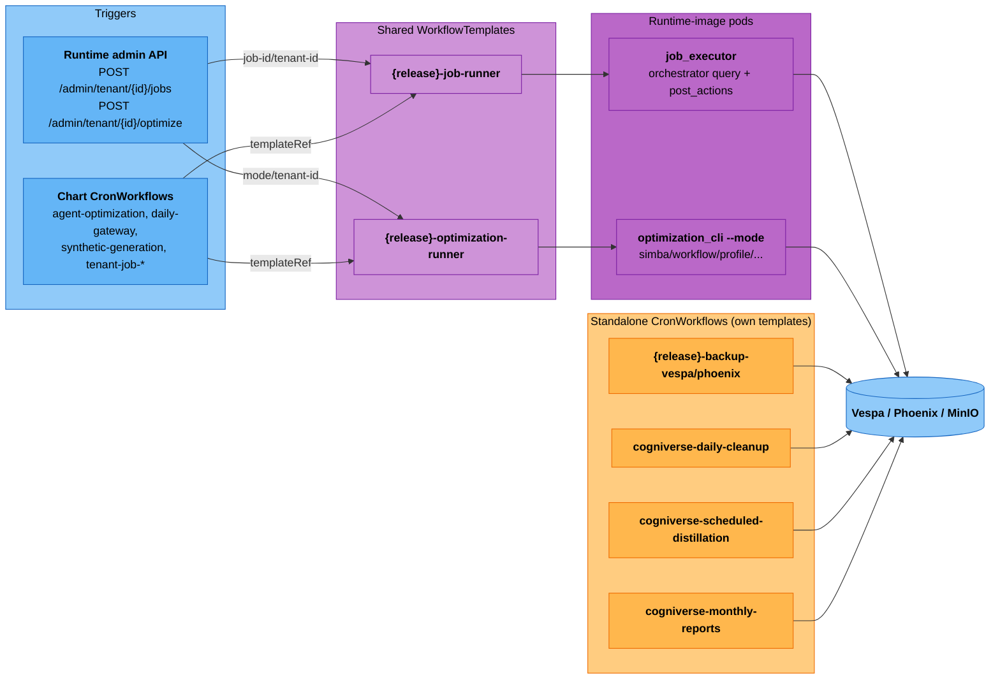

# Argo Workflows Guide

---

## Overview

Cogniverse uses Argo Workflows for batch processing and scheduled maintenance:

- **Video Ingestion**: Bulk video processing workflows
- **Batch Optimization**: DSPy/optimizer-mode runs at scale, scheduled or on-demand
- **Tenant Provisioning**: Automated tenant setup
- **Tenant Scheduled Jobs**: Per-tenant, user-defined recurring agent runs
- **Scheduled Maintenance**: Cron-based cleanup, backups, agent optimization, reports

Two chart-installed `WorkflowTemplate`s are the shared execution primitive; everything else either calls one of them on a schedule (`CronWorkflow`) or submits a one-off `Workflow` against them from the runtime API:



The standalone `workflows/*.yaml` templates (video ingestion, tenant provisioning, and the ad-hoc maintenance prototypes) are separate, self-contained `WorkflowTemplate`/`CronWorkflow` definitions applied directly via `kubectl apply` — they don't go through `job-runner` or `optimization-runner` and are covered in their own sections below.

---

## Prerequisites

### Quick Install with K3s (Local Development)

For local testing of Argo Workflows, use K3s:

```bash
# One-command local setup with K3s + Argo
cogniverse up  # Deploys k3d cluster with all services

# This installs:
# - K3s (lightweight Kubernetes)
# - Argo Workflows controller (as the argo-workflows subchart, in the cogniverse namespace)
# - Cogniverse with Helm
# - All workflow templates

# Access Argo UI (the subchart deploys argo-workflows-server in the cogniverse namespace)
kubectl port-forward -n cogniverse svc/cogniverse-argo-workflows-server 2746:2746
open http://localhost:2746
```

**Why K3s for local Argo testing?**
- ✅ Full Kubernetes API compatibility
- ✅ Runs on laptop/desktop (4GB RAM)
- ✅ Perfect for testing workflows before production
- ✅ Same workflow YAML works on K3s and production K8s

### Manual Install (Production K8s)

For production Kubernetes clusters:

```bash
# Install Argo Workflows controller — pin to v3.7.4 to match the
# argo-workflows subchart version bundled in charts/cogniverse/charts/
# (avoids CronWorkflow/Workflow CRD skew between a manual install and the
# chart-managed dev/staging clusters)
kubectl create namespace argo
kubectl apply -n argo -f https://github.com/argoproj/argo-workflows/releases/download/v3.7.4/install.yaml

# Install Argo CLI
curl -sLO https://github.com/argoproj/argo-workflows/releases/download/v3.7.4/argo-linux-amd64.gz
gunzip argo-linux-amd64.gz
chmod +x argo-linux-amd64
sudo mv argo-linux-amd64 /usr/local/bin/argo

# Verify installation
argo version
```

### Setup Workflow Templates

The chart installs `WorkflowTemplate` and `CronWorkflow` resources automatically via Helm. The chart-managed templates are:

- `{release}-job-runner` — runs `cogniverse_runtime.job_executor` for tenant-scheduled jobs created via `POST /admin/tenant/{id}/jobs` (`charts/cogniverse/templates/job-workflow-template.yaml`; see [Tenant Scheduled Jobs](#tenant-scheduled-jobs))
- `{release}-optimization-runner` — runs `optimization_cli --mode <mode>` for scheduled and on-demand optimization (`charts/cogniverse/templates/optimization-workflow-template.yaml`)

Standalone workflow files for ad-hoc use live in `workflows/`:

```bash
# Apply standalone workflow templates (ad-hoc use only)
kubectl apply -f workflows/video-ingestion.yaml
kubectl apply -f workflows/tenant-provisioning.yaml
kubectl apply -f workflows/scheduled-maintenance.yaml

# Verify templates
argo template list -n cogniverse
```

### Runtime env vars wired by the chart

When `argo.enabled=true` the chart writes these env vars into every runtime pod:

| Variable | Value |
|---|---|
| `WORKFLOW_API_URL` | `http://{release}-argo-workflows-server.{namespace}.svc.cluster.local:2746` |
| `WORKFLOW_NAMESPACE` | release namespace |
| `RUNTIME_SERVICE_ACCOUNT` | chart service account name |
| `JOB_WORKFLOW_TEMPLATE` | `{release}-job-runner` |
| `OPTIMIZATION_WORKFLOW_TEMPLATE` | `{release}-optimization-runner` |

The runtime reads them via `get_workflow_settings()` in `libs/runtime/cogniverse_runtime/config_loader.py`.

---

## Video Ingestion Workflow

### Purpose
Bulk ingestion of videos with multi-profile support.

### Workflow Steps
1. **Validate Input**: Check tenant and video directory
2. **Prepare Videos**: Create batch manifest
3. **Ingest Videos**: Process videos with embeddings
4. **Verify Ingestion**: Confirm documents in Vespa
5. **Notify Completion**: Send status notification

### Submit Workflow

```bash
# Basic ingestion (using the standalone workflows/ template)
argo submit workflows/video-ingestion.yaml \
  -n cogniverse \
  --parameter video-dir="/data/videos" \
  --parameter tenant-id="acme_corp" \
  --parameter profiles="video_colpali_smol500_mv_frame"

# With custom parameters
argo submit workflows/video-ingestion.yaml \
  -n cogniverse \
  --parameter video-dir="/data/acme_corp/videos" \
  --parameter tenant-id="acme_corp" \
  --parameter profiles="video_colpali_smol500_mv_frame,video_videoprism_base_mv_chunk_30s" \
  --parameter batch-size="20" \
  --parameter max-workers="8"
```

### Monitor Progress

```bash
# List workflows
argo list -n cogniverse

# Watch workflow
argo watch <workflow-name> -n cogniverse

# Get logs
argo logs <workflow-name> -n cogniverse

# Get workflow details
argo get <workflow-name> -n cogniverse
```

---

## Batch Optimization Workflow

### Purpose
Run DSPy/optimizer modes (see [Optimization Modes Reference](#optimization-modes-reference) below) against a tenant's Phoenix telemetry at scale.

### Workflow Steps

The `{release}-optimization-runner` `WorkflowTemplate` is a single step, `run-optimizer`: it launches one runtime-image pod running `python -m cogniverse_runtime.optimization_cli --mode <mode> --tenant-id <tenant-id> --lookback-hours <lookback-hours>` under a per-tenant Argo mutex (`optimize-<tenant-id>`) so concurrent submits for the same tenant queue instead of racing. Multi-step pipelines (e.g. running several modes then restarting the runtime) are composed by CronWorkflows that call this template repeatedly with `templateRef` — see [Weekly Agent Optimization](#weekly-agent-optimization-release-agent-optimization-default-sunday-3-am-utc) for the concrete example.

### Submit Workflow

Optimization runs via the chart-installed `{release}-optimization-runner` WorkflowTemplate, referenced by the chart's `CronWorkflow` resources and by the runtime's `POST /admin/tenant/{id}/optimize` endpoint. To trigger manually:

```bash
# Submit via the chart WorkflowTemplate (uses workflowTemplateRef)
argo submit -n cogniverse \
  --from wftmpl/cogniverse-optimization-runner \
  -p mode=simba \
  -p tenant-id="acme_corp" \
  -p lookback-hours=48

# Full --mode choice list accepted by `cogniverse_runtime.optimization_cli`
# (see libs/runtime/cogniverse_runtime/optimization_cli.py build_parser()):
#   cleanup, triggered, simba, workflow, gateway-thresholds,
#   online-routing-eval, profile, entity-extraction, synthetic,
#   rollback, ab-compare, egress-netpol, monthly-reports
#
# The runtime's POST /admin/tenant/{id}/optimize endpoint only allows the
# subset it considers safe for on-demand, per-tenant triggering:
#   gateway-thresholds, simba, workflow, profile, entity-extraction
```

For on-demand optimization via the runtime API:

```bash
curl -X POST http://localhost:8000/admin/tenant/acme_corp/optimize \
  -H 'Content-Type: application/json' \
  -d '{"mode": "gateway-thresholds"}'
```

### Check Results

The `run-optimizer` template declares no Argo output parameters — results live in the pod's stdout (each `optimization_cli` mode logs a JSON result dict) and in whatever `ArtifactManager` persisted for the tenant.

```bash
# Read the run's log output (JSON result dict from optimization_cli)
argo logs <workflow-name> -n cogniverse

# Confirm the run succeeded
argo get <workflow-name> -n cogniverse -o json | jq -r '.status.phase'
```

---

## Tenant Provisioning Workflow

### Purpose
Cold-bootstrap a new tenant's full backend footprint (K8s namespace, Vespa schemas, Phoenix project, resource quotas, storage, memory schema) in one Argo run, without needing a live runtime to drive it.

### How it works

The standalone `workflows/tenant-provisioning.yaml` `WorkflowTemplate` (`provisioning-pipeline` entrypoint) runs nine sequential steps:

1. `validate-tenant` — regex-checks the tenant ID format (lowercase alphanumeric + underscores).
2. `create-namespace` — creates a `cogniverse-<tenant-id>` `Namespace` (`resource: action: create`).
3. `deploy-schemas` — for each comma-separated profile, runs `uv run python scripts/deploy_json_schema.py configs/schemas/<profile>.json` against Vespa directly.
4. `create-phoenix-project` — runs `scripts/provision_tenant.py --step telemetry --tenant-id <id>`.
5. `setup-resource-quotas` — creates a `ResourceQuota` in the tenant namespace from the `cpu-quota` / `memory-quota` / `storage-quota` parameters.
6. `create-storage` — creates a `PersistentVolumeClaim` in the tenant namespace sized to `storage-quota`.
7. `initialize-memory` — runs `scripts/provision_tenant.py --step memory --tenant-id <id>`.
8. `verify-tenant` — checks the namespace, each schema, and the PVC exist.
9. `notify-completion` — logs a completion summary (webhook call commented out).

`scripts/provision_tenant.py` (used by steps 4 and 7) supports two `--step` values:

| Step | What it does |
|---|---|
| `memory` | Creates the tenant's Mem0 memory schema via `Mem0MemoryManager` + `lazy_init_memory` |
| `telemetry` | Emits a probe span so the tenant's Phoenix project is created |

If a runtime is already live for the target cluster, the lighter-weight alternative is to skip this Argo template and drive the same two `provision_tenant.py` steps plus schema deployment through the runtime admin API — see [Register the tenant and deploy schemas](#register-the-tenant-and-deploy-schemas) below.

### Submit Workflow

```bash
# Apply the standalone provisioning template
kubectl apply -f workflows/tenant-provisioning.yaml

# Run the workflow for a new tenant
argo submit workflows/tenant-provisioning.yaml \
  -n cogniverse \
  --parameter tenant-id="newcorp_inc"
```

### Run provisioning steps directly

```bash
# Initialize memory schema
uv run python scripts/provision_tenant.py --tenant-id newcorp_inc --step memory

# Create telemetry project
uv run python scripts/provision_tenant.py --tenant-id newcorp_inc --step telemetry
```

### Register the tenant and deploy schemas

Schema deployment is a separate step via the runtime admin API:

```bash
RUNTIME_URL=http://localhost:8000

# Register tenant
curl -sfX POST "$RUNTIME_URL/admin/tenants" \
  -H 'Content-Type: application/json' \
  -d '{"tenant_id": "newcorp_inc"}'

# Deploy profile schemas
curl -sfX POST "$RUNTIME_URL/admin/profiles/video_colpali_smol500_mv_frame/deploy" \
  -H 'Content-Type: application/json' \
  -d '{"tenant_id": "newcorp_inc"}'
```

Profile configs read and written by these admin endpoints go through `ConfigManager` with `service="backend"` (the default `service` for profile CRUD in `libs/runtime/cogniverse_runtime/routers/admin.py`) — the same config-service scope the dashboard's backend-profile views read from.

---

## Tenant Scheduled Jobs

### Purpose
Per-tenant, user-defined recurring agent runs (e.g. "run this query every morning and save the result to wiki") — distinct from the built-in system optimization/maintenance crons above.

### How it works

`POST /admin/tenant/{tenant_id}/jobs` (`libs/runtime/cogniverse_runtime/routers/tenant.py`) persists the job (`name`, `schedule`, `query`, `post_actions`) into `ConfigStore` under service `tenant_jobs`, then submits an Argo `CronWorkflow` named `tenant-job-<sanitized-tenant-id>-<sanitized-job-id>` that runs the chart's `{release}-job-runner` `WorkflowTemplate` on the given `schedule`. If the Argo submission fails, the ConfigStore write is not committed — a job never shows as `created` without a live schedule backing it.

Each firing invokes `python -m cogniverse_runtime.job_executor --job-id <id> --tenant-id <tenant-id> --runtime-url <runtime-url>` (`libs/runtime/cogniverse_runtime/job_executor.py`), which:

1. Reads the job's `query` + `post_actions` back out of `ConfigStore`.
2. Routes the query through the orchestrator agent to get a result.
3. For each `post_action` string (e.g. `"save to wiki"`, `"send me a summary on Telegram"`), routes it through the orchestrator and, using DenseOn embedding similarity against destination keyword phrases (threshold `0.3`), delivers the result to the detected destination (wiki, Telegram) — or just produces the result with no delivery if no destination matches (e.g. `"create a detailed report"`).

```bash
# Create a scheduled job
curl -sfX POST http://localhost:8000/admin/tenant/acme_corp/jobs \
  -H 'Content-Type: application/json' \
  -d '{"name": "daily-digest", "schedule": "0 8 * * *", "query": "summarize yesterday'"'"'s ingested videos", "post_actions": ["save to wiki"]}'

# List jobs for a tenant
curl http://localhost:8000/admin/tenant/acme_corp/jobs

# Delete a job (also deletes the backing CronWorkflow)
curl -sfX DELETE http://localhost:8000/admin/tenant/acme_corp/jobs/<job-id>

# Inspect the backing CronWorkflow directly (tenant_id is lowercased and
# '_'/':' replaced with '-' to form a valid RFC-1123 CronWorkflow name)
kubectl get cronworkflow tenant-job-acme-corp-<job-id> -n cogniverse
```

---

## Scheduled Maintenance Workflows

The chart renders one `CronWorkflow` per maintenance/optimization concern, gated by its own `argo.*.enabled` value. All are disabled at once if `argo.enabled=false`.

### Daily Backup (`{release}-backup-<service>`, default 3 AM UTC)

Rendered by `charts/cogniverse/templates/data-backup-cronworkflows.yaml`, gated by `hostStorage.backup.enabled`. One `CronWorkflow` per entry in `hostStorage.backup.services` (default: `vespa` via `kubectl exec` + `tar`, `phoenix` via a volume-mount snapshot), all sharing `hostStorage.backup.schedule` (default `"0 3 * * *"`). Each runs two steps — `dump` (tar the service's data into a workflow-scoped staging PVC) then `upload` (`mc cp` the tarball to `s3://<hostStorage.backup.bucket>/<service>/<timestamp>.tar`, then prune all but the most recent `hostStorage.backup.retainLast` snapshots, default 7).

```bash
# View cron workflows (one per backed-up service)
kubectl get cronworkflow -n cogniverse -l app.kubernetes.io/component=backup

# Trigger manually
argo submit --from cronwf/cogniverse-backup-vespa -n cogniverse

# View history
argo list -n cogniverse --selector workflows.argoproj.io/cron-workflow=cogniverse-backup-vespa
```

A standalone `daily-backup` `CronWorkflow` (2 AM UTC, `find -mtime +30 -delete` retention) also exists in `workflows/scheduled-maintenance.yaml` for ad-hoc `kubectl apply` use outside the chart; it is not installed by `cogniverse up` / Helm and is independent of `hostStorage.backup.*`.

### Weekly Agent Optimization (`{release}-agent-optimization`, default Sunday 3 AM UTC)

Chart `CronWorkflow` (`argo.optimization.agentOptimization`, schedule `0 3 * * 0`, tenant `"default"`) that runs all DSPy-based per-agent optimizers in parallel, then the workflow optimizer, then restarts the runtime deployment to pick up the new artifacts:

1. **Step 1 (parallel)** — `gateway-thresholds` (48h lookback), `entity-extraction` (48h), `simba` (168h — spans the full week between runs), `profile` (48h), each via `templateRef` to `{release}-optimization-runner`.
2. **Step 2** — `workflow` optimization (depends on the agent artifacts from step 1).
3. **Step 3** — `kubectl rollout restart deployment/{release}-runtime` so the runtime picks up the freshly compiled DSPy modules.

```bash
# View schedule
kubectl get cronworkflow cogniverse-agent-optimization -n cogniverse

# Trigger manually
argo submit --from cronwf/cogniverse-agent-optimization -n cogniverse

# Suspend/resume
argo cron suspend cogniverse-agent-optimization -n cogniverse
argo cron resume cogniverse-agent-optimization -n cogniverse
```

A standalone `weekly-dspy-optimization` `CronWorkflow` (also `workflows/scheduled-maintenance.yaml`) runs a simpler `--mode simba` loop over a hardcoded tenant list (`default`, `acme_corp`, `globex_inc`) for ad-hoc / non-Helm clusters; it is not what `cogniverse up` installs.

### Daily Gateway Threshold Tuning (`{release}-daily-gateway`, default 4 AM UTC)

Chart `CronWorkflow` (`argo.optimization.dailyGateway`, schedule `0 4 * * *`, tenant `"__system__"`) — a lightweight, single-mode version of the weekly pipeline: runs `gateway-thresholds` (24h lookback) via `templateRef` to `{release}-optimization-runner`, then restarts the runtime deployment.

```bash
kubectl get cronworkflow cogniverse-daily-gateway -n cogniverse
argo submit --from cronwf/cogniverse-daily-gateway -n cogniverse
argo cron suspend cogniverse-daily-gateway -n cogniverse
```

### Synthetic Data Generation (`{release}-synthetic-generation`, default Saturday 1 AM UTC)

Chart `CronWorkflow` (`argo.optimization.syntheticGeneration`, schedule `0 1 * * 6`) running `optimization_cli --mode synthetic --tenant-id default --agents workflow,profile`. Generates training examples via `SyntheticDataService` and saves them as demonstrations through `ArtifactManager` for the next optimization run to merge in. Restricted to the `workflow,profile` generators because `routing` needs `optimizer_configs['routing'].query_templates` (not populated by the chart) and `simba` is an agent-optimization mode, not a synthetic generator.

```bash
kubectl get cronworkflow cogniverse-synthetic-generation -n cogniverse
argo submit --from cronwf/cogniverse-synthetic-generation -n cogniverse
```

### Scheduled Distillation (`{release}-scheduled-distillation`, default 5 AM UTC)

Chart `CronWorkflow` (`argo.optimization.scheduledDistillation`, schedule `0 5 * * *`) running `python -m cogniverse_runtime.quality_monitor_cli --once --tenant-id default` against the in-cluster runtime and Phoenix. Forces a strategy-distillation pass on a fixed schedule so long stable periods (no detected quality drop) still produce new distilled strategies, rather than relying solely on `QualityMonitor`'s degradation trigger. Uses `cogniverse.primaryLLMModelBare` for its `--llm-model` argument since `quality_monitor_cli` posts directly to `/v1/chat/completions`.

```bash
kubectl get cronworkflow cogniverse-scheduled-distillation -n cogniverse
argo submit --from cronwf/cogniverse-scheduled-distillation -n cogniverse
```

### Daily Cleanup (`cogniverse-daily-cleanup`, 4 AM UTC)

Chart `CronWorkflow` (`argo.maintenance.cleanup`, schedule `0 4 * * *`) running `python -m cogniverse_runtime.optimization_cli --mode cleanup`. Four sections run in one pod:

- **Memory cleanup** — per-tenant `Mem0MemoryManager.cleanup_with_schema(build_default_registry())` (schema-driven TTLs from `KnowledgeRegistry`); sweeps every org / tenant from `organization_metadata` + `tenant_metadata`.
- **Log rotation** — `LOG_DIR` (default `/logs`), files older than `--log-retention-days` (chart `argo.maintenance.cleanup.logRetentionDays`, default 7) removed.
- **Temp file cleanup** — `TEMP_DIR` (default `/tmp`), files older than `TEMP_RETENTION_DAYS` env (default 1) removed.
- **Config metadata vacuum** — `VespaConfigStore.prune_all_configs(keep=CONFIG_KEEP_VERSIONS)` (default 10) — drains legacy `config_metadata` row bloat down to the latest N per `config_id`.

Each section reports exact counts in the result dict — see [optimization.md `--mode cleanup`](../modules/optimization.md#17-mode-cleanup-memory-logs-temp-config-vacuum).

```bash
# View workflow
kubectl get cronworkflow cogniverse-daily-cleanup -n cogniverse

# Check last run
argo list -n cogniverse --selector workflows.argoproj.io/cron-workflow=cogniverse-daily-cleanup --limit 1
```

### Monthly Reports (`cogniverse-monthly-reports`, 1st of month, 5 AM UTC)

Chart `CronWorkflow` (`argo.optimization.monthlyReports`, schedule `0 5 1 * *`) — two-step pipeline.

Step 1 (`generate-reports`): runs `optimization_cli --mode monthly-reports --reports-output-dir /reports --lookback-hours 720` against the in-cluster Phoenix and stages `usage-YYYYMM.json` + `performance-YYYYMM.json` onto a `reports-stage` PVC. Usage is per-org tenant counts + each tenant's `schemas_deployed`; performance is per-tenant span count, latency mean / p50 / p95, and `error_rate` over the lookback window.

Step 2 (`upload-reports`): `minio/mc:latest` pod that `mc cp`s the staged JSON into MinIO at `cogniverse-backups/reports/` (`hostStorage.backup.bucket` + `argo.optimization.monthlyReports.uploadPrefix`).

```bash
# View workflow
kubectl get cronworkflow cogniverse-monthly-reports -n cogniverse

# Trigger manually for testing
argo submit --from cronwf/cogniverse-monthly-reports -n cogniverse
```

### Chart LLM model helpers

The chart resolves the runtime's primary chat LLM into two helper templates in `templates/_helpers.tpl`:

- **`cogniverse.primaryLLMModel`** — DSPy / litellm form, always prefixed with the provider (`openai/<bare-model>` for in-cluster vLLM or Ollama; `anthropic/<id>` for SaaS providers if overridden via `runtime.primaryLLM.model`). Used by DSPy LM construction (`create_dspy_lm`) where the prefix selects provider routing.
- **`cogniverse.primaryLLMModelBare`** — same model id **without** the provider prefix. Use this when calling an OpenAI-compatible `/v1/chat/completions` endpoint directly (vLLM, llama.cpp server, Ollama) — those servers serve the bare model name and return 404 on the prefixed form. Used by the `quality-monitor` sidecar (`charts/.../all-resources.yaml`) and the scheduled-distillation cron (`charts/.../optimization-workflows.yaml`).

Resolution order for both: `runtime.primaryLLM.model` if set, else the engine-derived model (`inference.vllm_llm_student.model` when `llm.engine: vllm`, else `llm.model`).

---

## Optimization Modes Reference

All scheduled and on-demand optimization ultimately runs one `--mode` of `cogniverse_runtime.optimization_cli` in a pod templated by `{release}-optimization-runner` (see [Batch Optimization Workflow](#batch-optimization-workflow) above) or, for cleanup/reports, a dedicated `CronWorkflow` (see [Scheduled Maintenance Workflows](#scheduled-maintenance-workflows) above). There is no separate "module optimizer" vs. "DSPy optimizer" category split in the code — every mode below reads Phoenix spans (or a golden dataset, for `triggered`) and writes an artifact via `ArtifactManager`:

| Mode | What it optimizes | Reads |
|---|---|---|
| `simba` | `QueryEnhancementAgent`'s DSPy module (BootstrapFewShot over original→enhanced query pairs) | `cogniverse.query_enhancement` spans |
| `workflow` | Workflow templates + agent performance profiles | `cogniverse.orchestration` spans (via `OrchestrationEvaluator`) |
| `gateway-thresholds` | GLiNER confidence thresholds for the routing gateway | `cogniverse.gateway` spans |
| `online-routing-eval` | Persists per-span routing/confidence scores as telemetry annotations (no artifact) | `cogniverse.routing` spans (via `OnlineEvaluator`) |
| `profile` | `ProfileSelectionAgent`'s DSPy module | `cogniverse.profile_selection` spans |
| `entity-extraction` | `EntityExtractionModule`'s DSPy module | `cogniverse.entity_extraction` spans |
| `synthetic` | Generates training examples for other modes via `SyntheticDataService` | none (LLM-generated) |
| `triggered` | Strategy distillation from the trigger dataset (`strategies_distilled` output) | golden/trigger dataset |
| `rollback` | Restores a tenant's active prompts/demos artifacts to a prior snapshotted version (self-reversible — snapshots the current version first) | `ArtifactManager` version history |
| `ab-compare` | Runs `RLMABRunner` over a Phoenix queries dataset to compare two RLM configurations ("arms"), emitting an `rlm.ab_compare` span per row | a saved Phoenix dataset (`query`/`context` columns) |
| `egress-netpol` | Emits Kubernetes `NetworkPolicy` YAMLs from each agent's `network_policies.deny_all_other` policy config | policy YAMLs on disk, not spans |
| `cleanup` | Memory/log/temp/config housekeeping (no tenant) — see [Daily Cleanup](#daily-cleanup-cogniverse-daily-cleanup-4-am-utc) | DB/filesystem state |
| `monthly-reports` | Usage + performance JSON reports (no tenant) — see [Monthly Reports](#monthly-reports-cogniverse-monthly-reports-1st-of-month-5-am-utc) | Phoenix spans |

### Manual Workflow Submission

Submit optimization workflows on-demand via the chart WorkflowTemplate or the runtime API:

```bash
# Submit via the chart WorkflowTemplate directly
argo submit -n cogniverse \
  --from wftmpl/cogniverse-optimization-runner \
  -p mode=simba \
  -p tenant-id="acme_corp" \
  -p lookback-hours=48

# Or via the runtime API (creates and tracks the Argo Workflow for you;
# restricted to gateway-thresholds, simba, workflow, profile, entity-extraction)
curl -X POST http://localhost:8000/admin/tenant/acme_corp/optimize \
  -H 'Content-Type: application/json' \
  -d '{"mode": "simba"}'

# Poll the on-demand run's status (dashboard uses this to render progress)
curl http://localhost:8000/admin/tenant/acme_corp/optimize/runs/<workflow-name>
```

### Monitoring Optimization Workflows

```bash
# On-demand runs submitted via POST /admin/tenant/{id}/optimize carry
# cogniverse.ai/* labels (see _build_optimization_workflow_manifest in
# libs/runtime/cogniverse_runtime/routers/tenant.py)
argo list -n cogniverse -l cogniverse.ai/trigger=manual
argo list -n cogniverse -l cogniverse.ai/tenant=acme_corp

# Scheduled runs are selected per-CronWorkflow (Argo doesn't propagate the
# CronWorkflow's own labels to the Workflows it spawns)
argo list -n cogniverse --selector workflows.argoproj.io/cron-workflow=cogniverse-agent-optimization

# Follow a specific run's logs
argo logs <workflow-name> -n cogniverse -f

# Inspect its node statuses (the optimization_cli process's stdout/exit code
# is the source of truth; the WorkflowTemplate declares no output parameters)
argo get <workflow-name> -n cogniverse -o json | jq '.status.nodes'
```

---

## Operations

### List All Workflows

```bash
# All workflows
argo list -n cogniverse

# Running workflows
argo list -n cogniverse --status Running

# Failed workflows
argo list -n cogniverse --status Failed

# Completed workflows
argo list -n cogniverse --status Succeeded
```

### Delete Workflows

```bash
# Delete specific workflow
argo delete <workflow-name> -n cogniverse

# Delete all completed workflows
argo delete --completed -n cogniverse

# Delete workflows older than 7 days
argo delete --older 7d -n cogniverse
```

### Retry Failed Workflows

```bash
# Retry workflow
argo retry <workflow-name> -n cogniverse

# Retry from specific node
argo retry <workflow-name> --node-field-selector displayName=ingest-videos -n cogniverse
```

### Suspend/Resume Workflows

```bash
# Suspend running workflow
argo suspend <workflow-name> -n cogniverse

# Resume suspended workflow
argo resume <workflow-name> -n cogniverse
```

---

## Monitoring

### View Logs

```bash
# All logs
argo logs <workflow-name> -n cogniverse

# Follow logs
argo logs <workflow-name> -f -n cogniverse

# Logs for specific step
argo logs <workflow-name> --node-field-selector displayName=ingest-videos -n cogniverse
```

### Workflow Status

```bash
# Detailed status
argo get <workflow-name> -n cogniverse

# Watch workflow progress
argo watch <workflow-name> -n cogniverse

# JSON output
argo get <workflow-name> -n cogniverse -o json
```

### Resource Usage

```bash
# Pod resource usage
kubectl top pods -n cogniverse -l workflows.argoproj.io/workflow=<workflow-name>

# Workflow metrics
kubectl get workflow <workflow-name> -n cogniverse -o jsonpath='{.status.resourcesDuration}'
```

---

## Best Practices

### Resource Management

1. **Set appropriate resource limits**
   ```yaml
   resources:
     requests:
       memory: "8Gi"
       cpu: "4"
     limits:
       memory: "16Gi"
       cpu: "8"
   ```

2. **Use volume claim templates for large data**
   ```yaml
   volumeClaimTemplates:
   - metadata:
       name: workspace
     spec:
       accessModes: ["ReadWriteOnce"]
       resources:
         requests:
           storage: 100Gi
   ```

### Error Handling

1. **Set backoff limits**
   ```yaml
   spec:
     backoffLimit: 3
     restartPolicy: OnFailure
   ```

2. **Use retryStrategy**
   ```yaml
   retryStrategy:
     limit: 3
     retryPolicy: "Always"
     backoff:
       duration: "1m"
       factor: 2
       maxDuration: "10m"
   ```

### Notifications

Configure workflow notifications:

```yaml
metadata:
  annotations:
    notifications.argoproj.io/subscribe.on-workflow-completion: |
      slack:your-channel
```

---

## Troubleshooting

### Workflow Stuck

```bash
# Check workflow status
argo get <workflow-name> -n cogniverse

# Check pod status
kubectl get pods -n cogniverse -l workflows.argoproj.io/workflow=<workflow-name>

# Delete stuck workflow
argo delete <workflow-name> -n cogniverse --force
```

### Pod Failures

```bash
# View pod logs
kubectl logs <pod-name> -n cogniverse

# Describe pod
kubectl describe pod <pod-name> -n cogniverse

# Check events
kubectl get events -n cogniverse --sort-by='.lastTimestamp'
```

### Storage Issues

```bash
# Check PVC status
kubectl get pvc -n cogniverse

# Describe PVC
kubectl describe pvc <pvc-name> -n cogniverse

# Check storage class
kubectl get storageclass
```

---

## Related Documentation

- [Kubernetes Deployment](kubernetes-deployment.md) - K8s setup
- [Deployment](deployment.md) - Deployment overview (use `cogniverse up`)
- [Multi-Tenant Operations](multi-tenant-ops.md) - Tenant management

---
