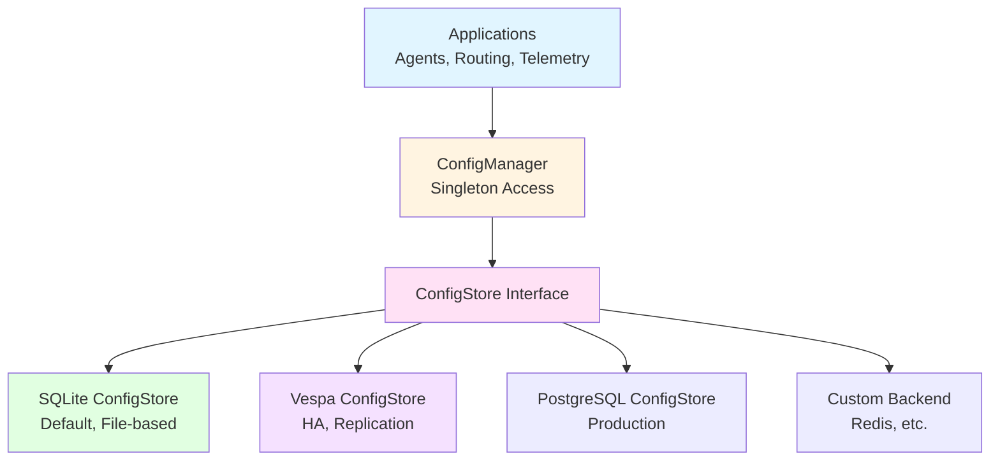
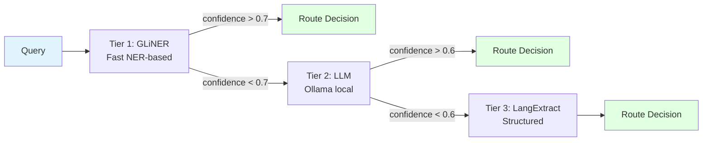
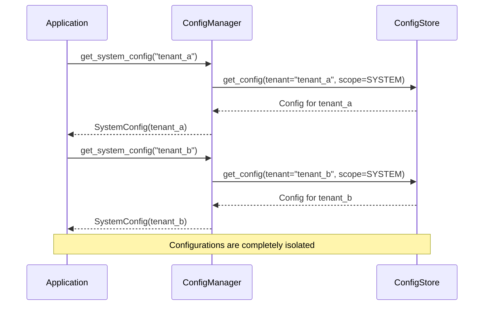

# Cogniverse Study Guide: Configuration Management

**Last Updated:** 2025-11-13
**Architecture:** UV Workspace with 11 packages in layered architecture
**Packages:** `cogniverse_sdk`, `cogniverse_foundation`, `cogniverse_core`
**Module Path:** `libs/foundation/cogniverse_foundation/config/` and `libs/core/cogniverse_core/config/`
**Purpose:** Multi-tenant, versioned configuration system with pluggable storage backends and schema-per-tenant isolation

---

## Module Overview

### Purpose
The configuration system provides centralized management for all system configurations with:
- **Multi-tenant isolation**: Complete configuration separation per tenant
- **Versioning**: Full history tracking with rollback capability
- **Pluggable backends**: SQLite (default), Vespa, PostgreSQL, or custom
- **Hot reload**: Configuration changes apply immediately without restart
- **Type-safe schemas**: Strongly typed configuration dataclasses
- **DSPy integration**: Dynamic optimizer and module configuration

### Key Components
- **ConfigStore** (sdk): Interface for storage backends (foundation layer)
- **BaseConfig** (foundation): Base configuration classes
- **SystemConfig** (core): System-wide configuration (extends BaseConfig)
- **ConfigManager** (core): Singleton access to configuration
- **ConfigWatcher** (core): Hot reload support

---

## Architecture Diagram



---

## Configuration Scopes

### 1. System Configuration
Global infrastructure settings per tenant:

```python
from cogniverse_core.config.unified_config import SystemConfig

system_config = SystemConfig(
    tenant_id="acme",
    llm_model="gpt-4",
    llm_base_url="https://api.openai.com/v1",
    vespa_url="http://localhost:8080",
    vespa_config_port=19071,  # For schema deployment
    phoenix_project_name="acme_project",
    phoenix_enabled=True
)
```

**Settings Include:**
- LLM providers and models
- Vespa backend URLs
- Phoenix telemetry endpoints
- Mem0 memory configuration
- Default resource limits

### 2. Agent Configuration
Per-agent DSPy module and optimizer settings (per tenant):

```python
from cogniverse_core.config.agent_config import AgentConfig, ModuleConfig, DSPyModuleType

agent_config = AgentConfig(
    tenant_id="acme",
    agent_name="video_search_agent",
    module_config=ModuleConfig(
        module_type=DSPyModuleType.REACT,
        signature="Question -> Answer",
        max_iterations=5,
        tools=["vespa_search", "rerank", "summarize"]
    ),
    optimizer_config={
        "type": "GEPA",
        "learning_rate": 0.001,
        "buffer_size": 10000
    },
    llm_model="gpt-4",
    temperature=0.7
)
```

### 3. Routing Configuration
Per-tenant routing optimizer and strategy settings:



**Configuration:**
- Routing tiers (FAST, BALANCED, COMPREHENSIVE)
- Strategy weights and thresholds per tenant
- Per-tenant experience buffer configuration
- GRPO/GEPA optimizer parameters per tenant
- Tenant-isolated routing rules and history

### 4. Telemetry Configuration
Phoenix observability with strict tenant isolation:
- **Per-tenant Phoenix projects** (automatic project creation)
- Span export configuration (sync for tests, async for production)
- Per-tenant experiment tracking
- Per-tenant metric collection and aggregation
- Tenant-specific dashboard customization
- Cross-tenant analytics disabled for security

---

## Storage Backends

### SQLite ConfigStore (Default)

Local SQLite database for development and single-instance deployments.

```python
from cogniverse_core.config.manager import get_config_manager

# Automatically uses SQLite at data/config/config.db
manager = get_config_manager()

# Get system configuration for specific tenant
system_config = manager.get_system_config(tenant_id="acme")
print(f"Tenant: {system_config.tenant_id}")
print(f"LLM: {system_config.llm_model}")
print(f"Vespa: {system_config.vespa_url}:{system_config.vespa_config_port}")
```

**Features:**
- Zero configuration setup
- File-based persistence at `data/config/config.db`
- Full ACID compliance
- Migration path to PostgreSQL

### Vespa ConfigStore

Unified configuration storage in Vespa alongside application data.

```python
from vespa.application import Vespa
from cogniverse_vespa.config_store import VespaConfigStore
from cogniverse_core.config.manager import ConfigManager

# Initialize Vespa store (tenant-aware)
vespa_app = Vespa(url="http://localhost:8080")
vespa_store = VespaConfigStore(
    vespa_app=vespa_app,
    namespace="config_metadata",
    document_type="configuration",
    tenant_isolation=True  # Ensures tenant separation
)

# Use with ConfigManager
manager = ConfigManager(store=vespa_store)
```

**Schema Deployment:**
```bash
# Deploy configuration schema
vespa deploy --wait 300 schemas/config_metadata/

# Verify deployment
curl http://localhost:8080/ApplicationStatus | jq '.schemas'
```

**Features:**
- Leverages Vespa's HA/replication
- Unified storage management
- Real-time configuration sync
- Scales with Vespa cluster

### Custom Backend Implementation

Create custom storage backends by implementing the ConfigStore interface from the sdk layer:

```python
from cogniverse_sdk.interfaces.config_store import ConfigStore
from typing import Dict, Any, Optional, List
import datetime

class RedisConfigStore(ConfigStore):
    """Redis-based configuration storage - implements sdk interface"""

    def __init__(self, redis_url: str):
        self.redis_client = redis.from_url(redis_url)
        self.initialize()

    def initialize(self) -> None:
        """Setup Redis indexes and structures"""
        # Create sorted sets for versioning
        # Setup pub/sub for hot reload
        pass

    def set_config(
        self,
        tenant_id: str,
        scope: ConfigScope,
        service: str,
        config_key: str,
        config_value: Dict[str, Any],
    ) -> ConfigEntry:
        """Store configuration with versioning"""
        # Generate version number
        # Store in Redis with TTL
        # Publish update event
        pass

    def get_config(
        self,
        tenant_id: str,
        scope: ConfigScope,
        service: str,
        config_key: str,
        version: Optional[int] = None,
    ) -> Optional[ConfigEntry]:
        """Retrieve configuration by version"""
        # Get from Redis cache
        # Deserialize JSON
        # Return ConfigEntry
        pass
```

---

## Multi-Tenant Configuration

### Tenant Isolation

Each tenant has completely isolated configuration:



**Example:**

```python
from cogniverse_core.config.manager import get_config_manager
from cogniverse_core.config.unified_config import SystemConfig

manager = get_config_manager()

# Configure Tenant A (enterprise customer)
tenant_a_config = SystemConfig(
    tenant_id="acme_corp",
    llm_model="gpt-4",
    llm_base_url="https://api.openai.com/v1",
    vespa_url="http://localhost:8080",
    vespa_config_port=19071,
    phoenix_project_name="acme_corp_project",  # Isolated project
    phoenix_enabled=True
)
manager.set_system_config(tenant_a_config)

# Configure Tenant B (different customer)
tenant_b_config = SystemConfig(
    tenant_id="globex_inc",
    llm_model="claude-3-opus",
    llm_base_url="https://api.anthropic.com",
    vespa_url="http://localhost:8080",
    vespa_config_port=19071,
    phoenix_project_name="globex_inc_project",  # Isolated project
    phoenix_enabled=True
)
manager.set_system_config(tenant_b_config)

# Configurations are completely isolated
config_a = manager.get_system_config("acme_corp")
config_b = manager.get_system_config("globex_inc")
assert config_a.llm_model != config_b.llm_model
assert config_a.phoenix_project_name != config_b.phoenix_project_name

# Each tenant gets isolated Vespa schemas
# acme_corp → video_colpali_mv_frame_acme_corp
# globex_inc → video_colpali_mv_frame_globex_inc
```

### Tenant Lifecycle Management

```python
# Create new tenant
manager.create_tenant(
    tenant_id="new_tenant",
    config_template="enterprise",  # Use predefined template
    overrides={
        "llm_model": "gpt-4-turbo",
        "max_qps": 100
    }
)

# Clone tenant configuration
manager.clone_tenant(
    source_tenant_id="tenant_a",
    target_tenant_id="tenant_a_staging"
)

# Delete tenant (soft delete, keeps history)
manager.delete_tenant("old_tenant", hard_delete=False)
```

---

## DSPy Integration

### Dynamic Module Configuration

```python
from cogniverse_core.config.agent_config import AgentConfig, ModuleConfig, DSPyModuleType
from cogniverse_core.config.manager import get_config_manager

manager = get_config_manager()

# Configure Video Search Agent with ReAct (per tenant)
video_agent_config = AgentConfig(
    tenant_id="acme_corp",
    agent_name="video_search_agent",
    module_config=ModuleConfig(
        module_type=DSPyModuleType.REACT,
        signature="Question -> Answer",
        max_iterations=5,
        tools=["vespa_search", "rerank", "summarize"]
    ),
    optimizer_config={
        "type": "GEPA",
        "learning_rate": 0.001,
        "buffer_size": 10000
    },
    llm_model="gpt-4",
    temperature=0.7
)

manager.set_agent_config(
    tenant_id="acme_corp",
    agent_name="video_search_agent",
    agent_config=video_agent_config
)
```

### Optimizer Selection

```python
from cogniverse_agents.routing.optimizer_factory import OptimizerFactory
from cogniverse_core.config.manager import get_config_manager

manager = get_config_manager()
factory = OptimizerFactory()

# Get routing configuration (per tenant)
routing_config = manager.get_routing_config("acme_corp")

# Select optimizer based on data availability
optimizer = factory.get_optimizer(
    config=routing_config,
    training_data_size=len(experience_buffer)
)

# Optimizer selection logic:
# < 100 samples: Bootstrap
# 100-1000 samples: SIMBA
# 1000-10000 samples: MIPRO
# > 10000 samples: GEPA
```

---

## Configuration Versioning

### Version Tracking

Every configuration change creates a new version:

```python
from cogniverse_core.common.config_store_interface import ConfigScope

# Get configuration history (tenant-isolated)
history = manager.store.get_config_history(
    tenant_id="acme_corp",
    scope=ConfigScope.SYSTEM,
    service="system",
    config_key="system_config",
    limit=10
)

for entry in history:
    print(f"Version {entry.version}:")
    print(f"  Updated: {entry.updated_at}")
    print(f"  Changes: {entry.config_value}")
```

### Rollback Capability

```python
# Get current version
current = manager.get_system_config("acme_corp")
print(f"Current LLM: {current.llm_model}")

# Rollback to specific version (tenant-safe)
manager.rollback_config(
    tenant_id="acme_corp",
    scope=ConfigScope.SYSTEM,
    service="system",
    config_key="system_config",
    target_version=5
)

# Verify rollback (only affects acme_corp)
rolled_back = manager.get_system_config("acme_corp")
print(f"Rolled back LLM: {rolled_back.llm_model}")

# Other tenants unaffected
other_tenant = manager.get_system_config("globex_inc")
assert other_tenant.llm_model == "claude-3-opus"  # Unchanged
```

---

## Hot Reload Support

Configuration changes apply immediately without restart:

```python
from cogniverse_core.config.config_watcher import ConfigWatcher

# Setup configuration watcher (tenant-aware)
watcher = ConfigWatcher(manager)

# Register callback for configuration changes
def on_config_change(tenant_id: str, scope: str, config: dict):
    print(f"Configuration updated for {tenant_id}/{scope}")
    # Reload affected components
    if scope == "AGENT":
        reload_agent(config)
    elif scope == "ROUTING":
        update_routing_strategy(config)

watcher.register_callback(on_config_change)
watcher.start()

# Changes are detected and applied automatically
manager.set_system_config(updated_config)
# Callback fires immediately
```

---

## Export/Import

### Backup Configuration

```python
import json
from datetime import datetime

# Export all configurations
export_data = manager.store.export_configs(
    tenant_id="production",
    include_history=True,
    include_versions=True
)

# Save with timestamp
timestamp = datetime.now().strftime("%Y%m%d_%H%M%S")
with open(f"config_backup_{timestamp}.json", "w") as f:
    json.dump(export_data, f, indent=2, default=str)

print(f"Exported {len(export_data['configs'])} configurations")
print(f"Total versions: {export_data['total_versions']}")
```

### Restore Configuration

```python
# Load backup
with open("config_backup_20250104_120000.json", "r") as f:
    backup_data = json.load(f)

# Import to new environment
imported_count = manager.store.import_configs(
    tenant_id="staging",
    configs=backup_data,
    overwrite_existing=False,  # Skip existing configs
    preserve_versions=True     # Keep version numbers
)

print(f"Imported {imported_count} configurations")
```

---

## Monitoring and Health

### Configuration Health Checks

```python
# Check storage backend health
if manager.store.health_check():
    print("✓ Configuration storage healthy")
else:
    print("✗ Configuration storage unavailable")

# Get storage statistics
stats = manager.store.get_stats()
print(f"Total configurations: {stats['total_configs']}")
print(f"Total tenants: {stats['total_tenants']}")
print(f"Storage size: {stats['storage_size_mb']} MB")
print(f"Configs by scope: {stats['configs_per_scope']}")
```

### Configuration Metrics

```python
from cogniverse_core.telemetry.metrics_manager import MetricsManager

metrics = MetricsManager()

# Track configuration changes
@metrics.track_config_change
def update_config(tenant_id: str, config: dict):
    manager.set_system_config(config)

# Metrics exposed:
# - config_changes_total
# - config_rollbacks_total
# - config_errors_total
# - config_latency_seconds
```

---

## Best Practices

### 1. Always Use Tenant Context

```python
# ✅ Good: Explicit tenant ID
config = manager.get_system_config(tenant_id="production")

# ❌ Bad: Implicit default tenant
config = manager.get_system_config()  # Uses "default"
```

### 2. Version Critical Changes

```python
# Before major changes
backup = manager.store.export_configs(
    tenant_id="production",
    include_history=True
)

# Make changes with audit trail
manager.set_system_config(
    new_config,
    metadata={"changed_by": "admin", "reason": "Performance tuning"}
)
```

### 3. Use Type-Safe Configurations

```python
# ✅ Good: Type-safe dataclass
from cogniverse_core.config.unified_config import SystemConfig
config = SystemConfig(
    tenant_id="acme_corp",
    llm_model="gpt-4",
    vespa_url="http://localhost:8080",
    vespa_config_port=19071
)

# ❌ Bad: Raw dictionaries
config = {"tenant_id": "acme_corp", "llm_model": "gpt-4"}  # No validation
```

### 4. Implement Configuration Templates

```python
# Define reusable templates
TEMPLATES = {
    "development": {
        "llm_model": "gpt-3.5-turbo",
        "max_qps": 10,
        "cache_ttl": 300
    },
    "production": {
        "llm_model": "gpt-4",
        "max_qps": 100,
        "cache_ttl": 3600
    }
}

# Apply template with overrides
manager.apply_template(
    tenant_id="new_customer",
    template_name="production",
    overrides={"llm_model": "claude-3-opus"}
)
```

---

## Troubleshooting

### Configuration Not Found

```python
# Check if configuration exists
configs = manager.store.list_configs(
    tenant_id="acme_corp",
    scope=ConfigScope.SYSTEM
)
print(f"Available configs: {configs}")

# Initialize missing configuration
if not manager.has_system_config("acme_corp"):
    manager.set_system_config(SystemConfig(tenant_id="acme_corp"))
```

### Version Conflicts

```python
# Handle concurrent updates
try:
    manager.set_system_config(
        config,
        expected_version=current_version,  # Optimistic locking
        force=False
    )
except VersionConflictError:
    # Reload and retry
    latest = manager.get_system_config("acme_corp")
    # Merge changes and retry
```

### Storage Backend Issues

```python
# Fallback to local storage
try:
    manager = ConfigManager(store=VespaConfigStore())
except ConnectionError:
    print("Vespa unavailable, using local SQLite")
    manager = ConfigManager(store=SQLiteConfigStore())
```

---

## Testing

### Unit Tests

```bash
# Run all configuration tests
JAX_PLATFORM_NAME=cpu uv run pytest tests/common/unit/test_config_*.py -v

# Test specific backend
JAX_PLATFORM_NAME=cpu uv run pytest tests/common/unit/test_vespa_config_store.py -v
```

### Integration Tests

```bash
# Test with real backends
docker compose up -d vespa postgres redis

# Run integration tests
JAX_PLATFORM_NAME=cpu uv run pytest tests/common/integration/ -v
```

---

**Related Guides:**
- [../architecture/sdk-architecture.md](../architecture/sdk-architecture.md) - SDK structure
- [../architecture/multi-tenant.md](../architecture/multi-tenant.md) - Multi-tenant architecture
- [../modules/common.md](../modules/common.md) - Common utilities
- [setup-installation.md](./setup-installation.md) - Installation
- [deployment.md](./deployment.md) - Deployment

---

**Next**: [deployment.md](./deployment.md)
