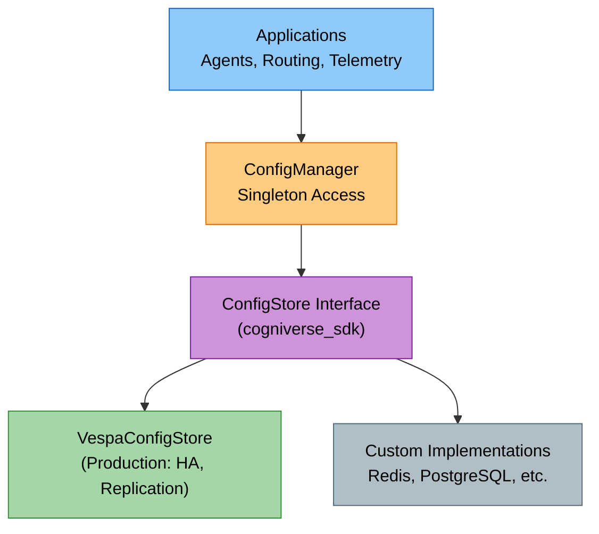
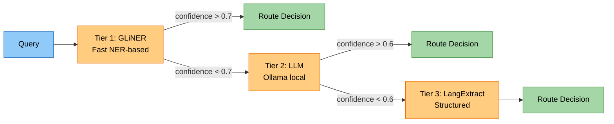
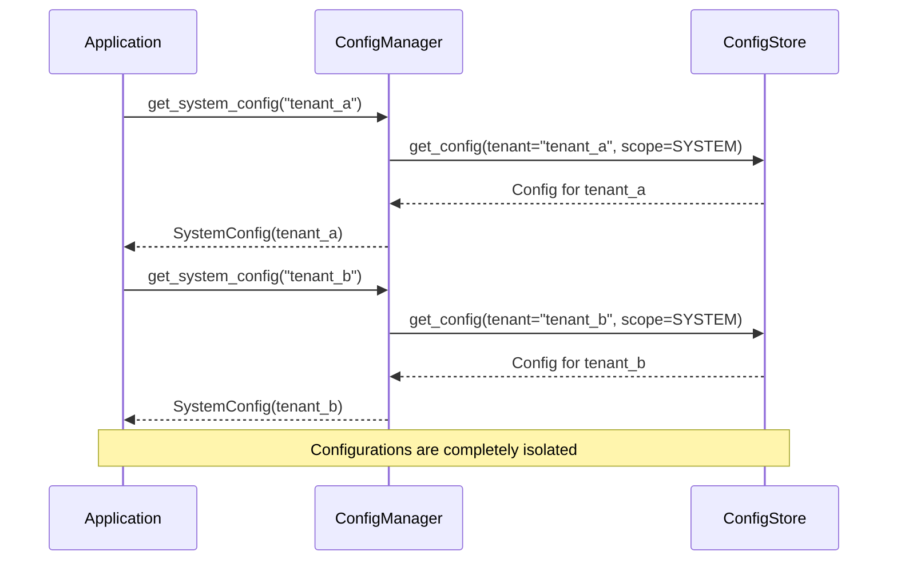

# Cogniverse Study Guide: Configuration Management

**Packages:** `cogniverse_sdk`, `cogniverse_foundation`
**Module Path:** `libs/foundation/cogniverse_foundation/config/` and `libs/sdk/cogniverse_sdk/interfaces/`

---

## Module Overview

### Purpose
The configuration system provides centralized management for all system configurations with:

- **Multi-tenant isolation**: Complete configuration separation per tenant

- **Versioning**: Full history tracking with rollback capability

- **Pluggable backends**: Vespa or custom implementations

- **Type-safe schemas**: Strongly typed configuration dataclasses

- **Caching**: LRU cache for configuration access performance

- **DSPy integration**: Dynamic optimizer and module configuration

### Key Components
- **ConfigStore** (sdk): Interface for storage backends
- **ConfigManager** (foundation): Centralized configuration management with caching
- **SystemConfig** (foundation): System-wide configuration (LLM, backend, telemetry)
- **AgentConfig** (foundation): Per-agent DSPy module and optimizer configuration
- **VespaConfigStore** (vespa): Vespa-based ConfigStore implementation

---

## Architecture Diagram



---

## Configuration Scopes

### 1. System Configuration
Global infrastructure settings per tenant:

```python
from cogniverse_foundation.config.unified_config import SystemConfig

system_config = SystemConfig(
    tenant_id="acme",
    llm_model="gpt-4",
    base_url="https://api.openai.com/v1",
    backend_url="http://localhost",
    backend_port=8080,
    phoenix_url="http://localhost:6006",
)
```

**Settings Include:**

- LLM providers and models

- Backend URLs and ports

- Phoenix telemetry endpoints

- Agent service URLs

- Environment settings

### 2. Agent Configuration
Per-agent DSPy module and optimizer settings (per tenant):

```python
from cogniverse_foundation.config.agent_config import AgentConfig, ModuleConfig, DSPyModuleType, OptimizerConfig, OptimizerType

agent_config = AgentConfig(
    agent_name="video_search_agent",
    agent_version="1.0.0",
    agent_description="Video search agent with ReAct module",
    agent_url="http://localhost:8002",
    capabilities=["video_search", "rerank"],
    skills=[{"name": "vespa_search"}, {"name": "rerank"}],
    module_config=ModuleConfig(
        module_type=DSPyModuleType.REACT,
        signature="Question -> Answer",
        max_retries=5,
        temperature=0.7
    ),
    optimizer_config=OptimizerConfig(
        optimizer_type=OptimizerType.GEPA,
        max_bootstrapped_demos=4,
        max_labeled_demos=16,
        num_trials=10
    ),
    llm_model="gpt-4",
    llm_temperature=0.7
)
```

### 3. Routing Configuration
Per-tenant routing optimizer and strategy settings:



**Configuration:**

- Routing tiers (FAST, BALANCED, COMPREHENSIVE)

- Strategy weights and thresholds per tenant

- Per-tenant experience buffer configuration

- GRPO/GEPA optimizer parameters per tenant

- Tenant-isolated routing rules and history

### 4. Telemetry Configuration
Phoenix observability with strict tenant isolation:

- **Per-tenant Phoenix projects** (automatic project creation)

- Span export configuration (sync for tests, async for production)

- Per-tenant experiment tracking

- Per-tenant metric collection and aggregation

- Tenant-specific dashboard customization

- Cross-tenant analytics disabled for security

---

## Storage Backends

### ConfigStore Interface

Configuration storage uses the `ConfigStore` interface from `cogniverse_sdk`. Common implementations include `VespaConfigStore` for Vespa backend storage, which stores configs in the `config_metadata` schema.

```python
from cogniverse_foundation.config.utils import create_default_config_manager

# Uses the configured backend (e.g., VespaConfigStore)
manager = create_default_config_manager()

# Get system configuration for specific tenant
system_config = manager.get_system_config(tenant_id="acme")
print(f"Tenant: {system_config.tenant_id}")
print(f"LLM: {system_config.llm_model}")
print(f"Backend: {system_config.backend_url}:{system_config.backend_port}")
```

**Features:**

- HA with Vespa replication

- Consistent with application data

- Versioned configuration with history

- Tenant isolation via document IDs

### Custom ConfigStore

Implement the `ConfigStore` interface for alternative storage backends.

```python
from cogniverse_vespa.config.config_store import VespaConfigStore
from cogniverse_foundation.config.manager import ConfigManager

# Initialize Vespa store with URL and port
vespa_store = VespaConfigStore(
    vespa_url="http://localhost",
    vespa_port=8080
)

# Use with ConfigManager (tenant isolation handled via document IDs)
manager = ConfigManager(store=vespa_store, cache_size=100)
```

**Schema Deployment:**
```bash
# Configuration schema is defined in configs/schemas/config_metadata_schema.json
# Deploy via Vespa application package deployment

# Verify schema is accessible
curl http://localhost:8080/ApplicationStatus | jq '.schemas'
```

**Features:**

- Leverages Vespa's HA/replication

- Unified storage management

- Real-time configuration sync

- Scales with Vespa cluster

### Custom Backend Implementation

Create custom storage backends by implementing the ConfigStore interface from the sdk layer:

```python
from cogniverse_sdk.interfaces.config_store import ConfigStore, ConfigScope, ConfigEntry
from typing import Dict, Any, Optional, List
from datetime import datetime
import redis

class RedisConfigStore(ConfigStore):
    """Redis-based configuration storage - implements sdk interface"""

    def __init__(self, redis_url: str):
        self.redis_client = redis.from_url(redis_url)
        self.initialize()

    def initialize(self) -> None:
        """Setup Redis indexes and structures"""
        # Create sorted sets for versioning
        # Setup key-value structures
        pass

    def set_config(
        self,
        tenant_id: str,
        scope: ConfigScope,
        service: str,
        config_key: str,
        config_value: Dict[str, Any],
    ) -> ConfigEntry:
        """Store configuration with versioning"""
        # Generate version number
        # Store in Redis with TTL
        # Publish update event
        pass

    def get_config(
        self,
        tenant_id: str,
        scope: ConfigScope,
        service: str,
        config_key: str,
        version: Optional[int] = None,
    ) -> Optional[ConfigEntry]:
        """Retrieve configuration by version"""
        # Get from Redis cache
        # Deserialize JSON
        # Return ConfigEntry
        pass
```

---

## Multi-Tenant Configuration

### Tenant Isolation

Each tenant has completely isolated configuration:



**Example:**

```python
from cogniverse_foundation.config.utils import create_default_config_manager
from cogniverse_foundation.config.unified_config import SystemConfig

manager = create_default_config_manager()

# Configure Tenant A (enterprise customer)
tenant_a_config = SystemConfig(
    tenant_id="acme_corp",
    llm_model="gpt-4",
    base_url="https://api.openai.com/v1",
    backend_url="http://localhost",
    backend_port=8080,
    phoenix_url="http://localhost:6006",  # Isolated project
)
manager.set_system_config(tenant_a_config)

# Configure Tenant B (different customer)
tenant_b_config = SystemConfig(
    tenant_id="globex_inc",
    llm_model="claude-3-opus",
    base_url="https://api.anthropic.com",
    backend_url="http://localhost",
    backend_port=8080,
    phoenix_url="http://localhost:6006",  # Isolated project
)
manager.set_system_config(tenant_b_config)

# Configurations are completely isolated
config_a = manager.get_system_config("acme_corp")
config_b = manager.get_system_config("globex_inc")
assert config_a.llm_model != config_b.llm_model
assert config_a.tenant_id != config_b.tenant_id  # Isolated configurations

# Each tenant gets isolated Vespa schemas
# acme_corp → video_colpali_mv_frame_acme_corp
# globex_inc → video_colpali_mv_frame_globex_inc
```

### Tenant Configuration Management

```python
# Create configuration for a new tenant
new_tenant_config = SystemConfig(
    tenant_id="new_tenant",
    llm_model="gpt-4-turbo",
    base_url="https://api.openai.com/v1",
    backend_url="http://localhost",
    backend_port=8080,
    phoenix_url="http://localhost:6006"
)
manager.set_system_config(new_tenant_config)

# Copy configuration from one tenant to another
source_config = manager.get_system_config("tenant_a")
target_config = SystemConfig(
    tenant_id="tenant_a_staging",
    **{k: v for k, v in source_config.to_dict().items() if k != "tenant_id"}
)
manager.set_system_config(target_config)

# Delete tenant configuration (removes all versions)
from cogniverse_sdk.interfaces.config_store import ConfigScope
manager.store.delete_config(
    tenant_id="old_tenant",
    scope=ConfigScope.SYSTEM,
    service="system",
    config_key="system_config"
)
```

---

## DSPy Integration

### Dynamic Module Configuration

```python
from cogniverse_foundation.config.agent_config import AgentConfig, ModuleConfig, DSPyModuleType, OptimizerConfig, OptimizerType
from cogniverse_foundation.config.utils import create_default_config_manager

manager = create_default_config_manager()

# Configure Video Search Agent with ReAct (per tenant)
video_agent_config = AgentConfig(
    agent_name="video_search_agent",
    agent_version="1.0.0",
    agent_description="Video search agent with ReAct module",
    agent_url="http://localhost:8002",
    capabilities=["video_search", "rerank", "summarize"],
    skills=[{"name": "vespa_search"}, {"name": "rerank"}],
    module_config=ModuleConfig(
        module_type=DSPyModuleType.REACT,
        signature="Question -> Answer",
        max_retries=5,
        temperature=0.7
    ),
    optimizer_config=OptimizerConfig(
        optimizer_type=OptimizerType.GEPA,
        max_bootstrapped_demos=4,
        max_labeled_demos=16,
        num_trials=10
    ),
    llm_model="gpt-4",
    llm_temperature=0.7
)

manager.set_agent_config(
    tenant_id="acme_corp",
    agent_name="video_search_agent",
    agent_config=video_agent_config
)
```

---

## Configuration Versioning

### Version Tracking

Every configuration change creates a new version:

```python
from cogniverse_sdk.interfaces.config_store import ConfigScope

# Get configuration history (tenant-isolated)
history = manager.store.get_config_history(
    tenant_id="acme_corp",
    scope=ConfigScope.SYSTEM,
    service="system",
    config_key="system_config",
    limit=10
)

for entry in history:
    print(f"Version {entry.version}:")
    print(f"  Updated: {entry.updated_at}")
    print(f"  Changes: {entry.config_value}")
```

### Rollback Capability

```python
from cogniverse_sdk.interfaces.config_store import ConfigScope

# Get current version
current = manager.get_system_config("acme_corp")
print(f"Current LLM: {current.llm_model}")

# Rollback to specific version by retrieving and re-applying old config
old_entry = manager.store.get_config(
    tenant_id="acme_corp",
    scope=ConfigScope.SYSTEM,
    service="system",
    config_key="system_config",
    version=5  # Specific version to rollback to
)

if old_entry:
    # Re-apply old configuration
    old_config = SystemConfig.from_dict(old_entry.config_value)
    manager.set_system_config(old_config)

    # Verify rollback (only affects acme_corp)
    rolled_back = manager.get_system_config("acme_corp")
    print(f"Rolled back LLM: {rolled_back.llm_model}")

# Other tenants unaffected
other_tenant = manager.get_system_config("globex_inc")
assert other_tenant.llm_model == "claude-3-opus"  # Unchanged
```

---

## Export/Import

### Backup Configuration

```python
import json
from datetime import datetime

# Export all configurations
export_data = manager.store.export_configs(
    tenant_id="production",
    include_history=True
)

# Save with timestamp
timestamp = datetime.now().strftime("%Y%m%d_%H%M%S")
with open(f"config_backup_{timestamp}.json", "w") as f:
    json.dump(export_data, f, indent=2, default=str)

print(f"Exported {len(export_data['configs'])} configurations")
```

### Restore Configuration

```python
# Load backup
with open("config_backup_20250104_120000.json", "r") as f:
    backup_data = json.load(f)

# Import to new environment
imported_count = manager.store.import_configs(
    tenant_id="staging",
    configs=backup_data
)

print(f"Imported {imported_count} configurations")
```

---

## Monitoring and Health

### Configuration Health Checks

```python
# Check storage backend health
if manager.store.health_check():
    print("✓ Configuration storage healthy")
else:
    print("✗ Configuration storage unavailable")

# Get storage statistics
stats = manager.store.get_stats()
print(f"Total configurations: {stats['total_configs']}")
print(f"Total tenants: {stats['total_tenants']}")
print(f"Total versions: {stats['total_versions']}")
print(f"Configs by scope: {stats['configs_per_scope']}")
print(f"Storage backend: {stats['storage_backend']}")
```

---

## Best Practices

### 1. Always Use Tenant Context

```python
# ✅ Good: Explicit tenant ID
config = manager.get_system_config(tenant_id="production")

# ❌ Bad: Implicit default tenant
config = manager.get_system_config()  # Uses "default"
```

### 2. Version Critical Changes

```python
# Before major changes, export current configuration
backup = manager.store.export_configs(
    tenant_id="production",
    include_history=True
)

# Save backup to file
import json
from datetime import datetime
timestamp = datetime.now().strftime("%Y%m%d_%H%M%S")
with open(f"config_backup_{timestamp}.json", "w") as f:
    json.dump(backup, f, indent=2, default=str)

# Make changes (metadata tracked in ConfigEntry automatically)
manager.set_system_config(new_config)
```

### 3. Use Type-Safe Configurations

```python
# ✅ Good: Type-safe dataclass
from cogniverse_foundation.config.unified_config import SystemConfig
config = SystemConfig(
    tenant_id="acme_corp",
    llm_model="gpt-4",
    backend_url="http://localhost",
    backend_port=8080
)

# ❌ Bad: Raw dictionaries
config = {"tenant_id": "acme_corp", "llm_model": "gpt-4"}  # No validation
```

### 4. Use Configuration Templates

```python
# Define reusable templates
TEMPLATES = {
    "development": SystemConfig(
        tenant_id="",  # Will be set when applied
        llm_model="gpt-3.5-turbo",
        base_url="http://localhost:11434",
        backend_url="http://localhost",
        backend_port=8080,
        phoenix_url="http://localhost:6006"
    ),
    "production": SystemConfig(
        tenant_id="",
        llm_model="gpt-4",
        base_url="https://api.openai.com/v1",
        backend_url="http://production-vespa",
        backend_port=8080,
        phoenix_url="http://production-phoenix:6006"
    )
}

# Apply template with customization
template = TEMPLATES["production"]
new_config = SystemConfig(
    tenant_id="new_customer",
    llm_model="claude-3-opus",  # Override
    base_url=template.base_url,
    backend_url=template.backend_url,
    backend_port=template.backend_port,
    phoenix_url=template.phoenix_url
)
manager.set_system_config(new_config)
```

---

## Troubleshooting

### Configuration Not Found

```python
from cogniverse_sdk.interfaces.config_store import ConfigScope

# Check if configuration exists
configs = manager.store.list_configs(
    tenant_id="acme_corp",
    scope=ConfigScope.SYSTEM
)
print(f"Available configs: {configs}")

# Initialize missing configuration
existing_config = manager.store.get_config(
    tenant_id="acme_corp",
    scope=ConfigScope.SYSTEM,
    service="system",
    config_key="system_config"
)
if not existing_config:
    manager.set_system_config(SystemConfig(tenant_id="acme_corp"))
```

### Concurrent Updates

```python
# Handle concurrent updates by checking version history
current_entry = manager.store.get_config(
    tenant_id="acme_corp",
    scope=ConfigScope.SYSTEM,
    service="system",
    config_key="system_config"
)

# Make your changes
updated_config = SystemConfig.from_dict(current_entry.config_value)
updated_config.llm_model = "gpt-4-turbo"

# Apply update (creates new version automatically)
manager.set_system_config(updated_config)

# Verify version incremented
new_entry = manager.store.get_config(
    tenant_id="acme_corp",
    scope=ConfigScope.SYSTEM,
    service="system",
    config_key="system_config"
)
assert new_entry.version == current_entry.version + 1
```

### Storage Backend Issues

```python
# Fallback to local storage
from cogniverse_foundation.config.utils import create_default_config_manager

# Initialize with default configuration
manager = create_default_config_manager()
```

---

## Testing

### Unit Tests

```bash
# Run all configuration tests
JAX_PLATFORM_NAME=cpu uv run pytest tests/common/unit/test_agent_config.py -v
JAX_PLATFORM_NAME=cpu uv run pytest tests/common/unit/test_config_api_mixin.py -v

# Test Vespa backend
JAX_PLATFORM_NAME=cpu uv run pytest tests/common/unit/test_vespa_config_store.py -v
```

### Integration Tests

```bash
# Test with real backends
docker compose up -d vespa postgres redis

# Run integration tests
JAX_PLATFORM_NAME=cpu uv run pytest tests/common/integration/ -v
```

---

**Related Guides:**

- [../architecture/sdk-architecture.md](../architecture/sdk-architecture.md) - SDK structure

- [../architecture/multi-tenant.md](../architecture/multi-tenant.md) - Multi-tenant architecture

- [../modules/common.md](../modules/common.md) - Common utilities

- [setup-installation.md](./setup-installation.md) - Installation

- [deployment.md](./deployment.md) - Deployment

---

**Next**: [deployment.md](./deployment.md)
