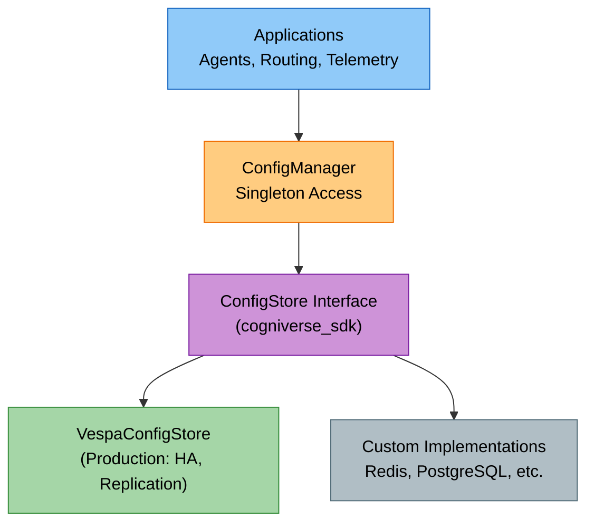
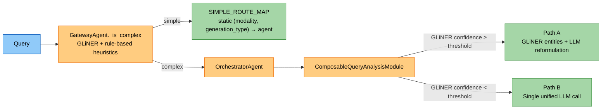
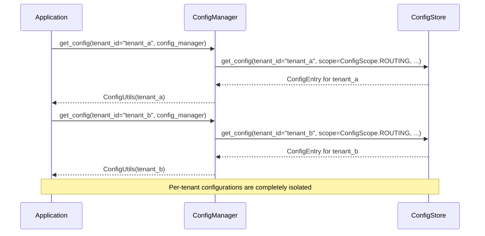

# Cogniverse Study Guide: Configuration Management

**Packages:** `cogniverse_sdk`, `cogniverse_foundation`
**Module Path:** `libs/foundation/cogniverse_foundation/config/` and `libs/sdk/cogniverse_sdk/interfaces/`

---

## Module Overview

### Purpose
The configuration system provides centralized management for all system configurations with:

- **Multi-tenant isolation**: Complete configuration separation per tenant

- **Versioning**: Full history tracking with rollback capability

- **Pluggable backends**: Vespa or custom implementations

- **Type-safe schemas**: Strongly typed configuration dataclasses

- **Caching**: In-process cache of the system config (the hot-path read)

- **DSPy integration**: Dynamic optimizer and module configuration

### Key Components
- **ConfigStore** (sdk): Interface for storage backends
- **ConfigManager** (foundation): Centralized configuration management with caching
- **SystemConfig** (foundation): System-wide configuration (LLM, backend, telemetry)
- **AgentConfig** (foundation): Per-agent DSPy module and optimizer configuration
- **VespaConfigStore** (vespa): Vespa-based ConfigStore implementation

### Package Structure

```text
libs/foundation/cogniverse_foundation/config/
├── unified_config.py    # SystemConfig, LLMEndpointConfig, LLMConfig,
│                         # SemanticRouterConfig, RoutingConfigUnified,
│                         # AgentConfigUnified, BackendConfig, BackendProfileConfig
├── agent_config.py      # AgentConfig, ModuleConfig, OptimizerConfig,
│                         # DSPyModuleType, OptimizerType
├── manager.py            # ConfigManager (central read/write API + caching)
├── utils.py              # ConfigUtils, get_config(), create_default_config_manager(),
│                         # get_config_manager_singleton()
├── bootstrap.py          # BootstrapConfig.from_environment() — resolves backend
│                         # connection info (BACKEND_URL/BACKEND_PORT + config.json
│                         # backend.type) before the ConfigStore itself can connect
├── llm_factory.py        # create_dspy_lm(LLMEndpointConfig) — the single
│                         # chokepoint every dspy.LM() construction goes through
├── api_mixin.py          # ConfigAPIMixin — REST endpoints (GET/PUT /config) for
│                         # runtime agent config with ConfigManager persistence
└── semantic_router.py     # resolve_semantic_router_headers(), apply_semantic_routing(),
                            # create_routed_lm(), routed_lm_context_for() — opt-in
                            # LLM traffic routing through a semantic router

libs/sdk/cogniverse_sdk/interfaces/
└── config_store.py       # ConfigStore ABC, ConfigScope, ConfigEntry

libs/vespa/cogniverse_vespa/config/
└── config_store.py       # VespaConfigStore(ConfigStore) — Vespa-backed implementation
```

---

## Architecture Diagram


```mermaid
flowchart TB
    Apps["<span style='color:#000'>Applications<br/>Agents, Routing, Telemetry</span>"]

    Apps --> Manager["<span style='color:#000'>ConfigManager<br/>Singleton Access</span>"]

    Manager --> Store["<span style='color:#000'>ConfigStore Interface<br/>(cogniverse_sdk)</span>"]

    Store --> Vespa["<span style='color:#000'>VespaConfigStore<br/>(Production: HA, Replication)</span>"]
    Store --> Custom["<span style='color:#000'>Custom Implementations<br/>Redis, PostgreSQL, etc.</span>"]

    style Apps fill:#90caf9,stroke:#1565c0,color:#000
    style Manager fill:#ffcc80,stroke:#ef6c00,color:#000
    style Store fill:#ce93d8,stroke:#7b1fa2,color:#000
    style Vespa fill:#a5d6a7,stroke:#388e3c,color:#000
    style Custom fill:#b0bec5,stroke:#546e7a,color:#000
```

---

## Configuration Scopes

### 1. System Configuration
Global infrastructure settings per tenant:

```python
from cogniverse_foundation.config.unified_config import SystemConfig

# SystemConfig is global infrastructure state (one per deployment) — it
# has no tenant_id field. Per-tenant settings live in RoutingConfigUnified,
# AgentConfig, and TelemetryConfig instead (see below).
system_config = SystemConfig(
    llm_model="gpt-4",
    base_url="https://api.openai.com/v1",
    backend_url="http://localhost",
    backend_port=8080,
    telemetry_url="http://localhost:6006",
)
```

**Settings Include:**

- LLM providers and models

- Backend URLs and ports

- Phoenix telemetry endpoints

- Agent service URLs (via `agents` section)

- Environment settings

### 1a. LLM Endpoint Configuration

`LLMEndpointConfig` and `LLMConfig` from `cogniverse_foundation.config.unified_config` wire the LLM for every agent and optimizer.

```python
from cogniverse_foundation.config.unified_config import LLMEndpointConfig, LLMConfig

# Primary (student) LLM — used at runtime by all agents
primary = LLMEndpointConfig(
    model="openai/google/gemma-4-e4b-it",
    api_base="http://localhost:11434/v1",   # in-cluster vLLM or Ollama
    temperature=0.1,
    max_tokens=1000,
    request_timeout=120.0,   # fail-fast timeout in seconds (default: 120.0)
    num_retries=1,            # total attempts per call (default: 1)
)

# Teacher LLM — used only during DSPy optimization (BootstrapFewShot's teacher_settings)
teacher = LLMEndpointConfig(
    model="openai/cyankiwi/Qwen3.6-27B-AWQ-INT4",
    api_base="http://localhost:29011/v1",
    request_timeout=120.0,
    num_retries=1,
)

llm_config = LLMConfig(primary=primary, teacher=teacher)
```

**Key fields:**

| Field | Default | Purpose |
|---|---|---|
| `model` | (required) | LiteLLM model string with provider prefix (`openai/<model>`, `anthropic/<model>`, etc.) |
| `api_base` | `None` | Endpoint URL. `None` = LiteLLM default routing. |
| `temperature` | `0.1` | Sampling temperature. |
| `max_tokens` | `1000` | Max completion tokens. |
| `request_timeout` | `120.0` | Seconds before litellm raises a timeout. Set low to fail fast on a down endpoint. |
| `num_retries` | `1` | Total call attempts (1 = no retries). DSPy default is higher; this constrains it for fast-fail behavior. |
| `seed` | `None` | vLLM sampling seed for deterministic output in tests. |

Every `dspy.LM` instance in the codebase is built by `create_dspy_lm()` from `cogniverse_foundation.config.llm_factory` — the single chokepoint for LLM instantiation:

```python
from cogniverse_foundation.config.llm_factory import create_dspy_lm

lm = create_dspy_lm(primary)  # wires api_base/api_key/temperature/seed/extra_headers onto dspy.LM
```

When `SystemConfig.semantic_router` (`SemanticRouterConfig`) is enabled, `cogniverse_foundation.config.semantic_router.routed_lm_context_for()` rewrites the endpoint to target the router instead of the model backend and attaches per-tenant authz headers before calling `create_dspy_lm()`:

```python
from cogniverse_foundation.config.semantic_router import routed_lm_context_for

with routed_lm_context_for(config_manager, tenant_id="acme_corp", agent_name="search_agent"):
    ...  # DSPy calls inside this block use the resolved (routed or direct) LM
```

Routing is opt-in and disabled by default (`SemanticRouterConfig.enabled = False`); when disabled, the endpoint's own `api_base` is used unchanged.

### 1b. Agent Registry Configuration

The `agents` section in `config.json` defines agent URLs for A2A discovery via `AgentRegistry`. There are 23 agents in `ConfigLoader.AGENT_CLASSES`, matching the 23 entries in `config.json`'s `agents` section. Schema shape (2 representative entries):

```json
{
  "agents": {
    "search_agent": {
      "url": "http://localhost:8002",
      "enabled": true,
      "capabilities": ["search", "video_search", "retrieval"],
      "modalities": ["VIDEO"]
    },
    "gateway_agent": {
      "url": "http://localhost:8000",
      "enabled": true,
      "capabilities": ["gateway", "classification"],
      "timeout": 10
    }
  }
}
```

**Full roster (all 23 agents, grouped by function):**

| Group | Agent key | Port | Enabled | Capabilities |
|---|---|---|---|---|
| Search & Analysis | `search_agent` | 8002 | true | search, video_search, retrieval |
| Search & Analysis | `text_analysis_agent` | 8003 | true | text_analysis, sentiment, classification |
| Search & Analysis | `image_search_agent` | 8006 | true | image_search, visual_analysis |
| Search & Analysis | `audio_analysis_agent` | 8007 | true | audio_analysis, transcription |
| Search & Analysis | `document_agent` | 8008 | true | document_analysis, pdf_processing |
| Generation + Routing | `gateway_agent` | 8000 | true | gateway, classification |
| Generation + Routing | `entity_extraction_agent` | 8000 | true | entity_extraction, ner |
| Generation + Routing | `query_enhancement_agent` | 8000 | true | query_enhancement, expansion |
| Generation + Routing | `profile_selection_agent` | 8000 | true | profile_selection |
| Generation + Routing | `orchestrator_agent` | 8013 | true | orchestration, planning, multi_agent_coordination |
| Generation + Routing | `summarizer_agent` | 8004 | true | summarization, text_generation |
| Generation + Routing | `detailed_report_agent` | 8005 | true | detailed_report, analysis, text_generation |
| Research + Coding | `deep_research_agent` | 8009 | true | deep_research, analysis |
| Research + Coding | `coding_agent` | 8010 | true | coding, code_generation, code_search |
| Knowledge-Graph & Reasoning | `citation_tracing_agent` | 8019 | false | citation_tracing, audit, provenance_consumer |
| Knowledge-Graph & Reasoning | `contradiction_reconciliation_agent` | 8020 | false | contradiction_reconciliation, audit |
| Knowledge-Graph & Reasoning | `multi_document_synthesis_agent` | 8021 | false | multi_document_synthesis, citation_preservation |
| Knowledge-Graph & Reasoning | `kg_traversal_agent` | 8022 | false | knowledge_graph_traversal, audit |
| Knowledge-Graph & Reasoning | `temporal_reasoning_agent` | 8025 | false | temporal_reasoning, audit |
| Knowledge-Graph & Reasoning | `knowledge_summarization_agent` | 8026 | false | knowledge_summarization, audit, federation_promoter |
| Knowledge-Graph & Reasoning | `audit_explanation_agent` | 8027 | true | audit_explanation, audit, provenance_consumer |
| Multi-tenant + Federation | `cross_tenant_comparison_agent` | 8023 | false | cross_tenant_comparison, audit, federation_consumer |
| Multi-tenant + Federation | `federated_query_agent` | 8024 | false | federated_query, audit, federation_consumer |

Knowledge-graph, reasoning, and federation agents ship `"enabled": false` by default — operators opt in per deployment. `audit_explanation_agent` is the one exception in that group, enabled by default.

**Key Points:**
- Agent keys must match `AGENT_CLASSES` in `config_loader.py` (e.g., `orchestrator_agent`, `search_agent`) — all 23 keys above have a matching entry
- `ConfigLoader.load_agents()` validates each agent class is importable and registers metadata (capabilities, URL) in the `AgentRegistry`
- Set `"enabled": false` to disable an agent without removing its config
- In unified runtime mode, all agents share the same runtime URL; per-request `tenant_id`, `profile`, and `session_id` arrive in the task payload
- `gateway_agent`, `entity_extraction_agent`, `query_enhancement_agent`, and `profile_selection_agent` all default to port 8000 because they run in-process inside the unified gateway rather than as standalone services

### 2. Agent Configuration
Per-agent DSPy module and optimizer settings (per tenant):

```python
from cogniverse_foundation.config.agent_config import AgentConfig, ModuleConfig, DSPyModuleType, OptimizerConfig, OptimizerType

agent_config = AgentConfig(
    agent_name="video_search_agent",
    agent_version="1.0.0",
    agent_description="Video search agent with ReAct module",
    agent_url="http://localhost:8002",
    capabilities=["video_search", "rerank"],
    skills=[{"name": "vespa_search"}, {"name": "rerank"}],
    module_config=ModuleConfig(
        module_type=DSPyModuleType.REACT,
        signature="Question -> Answer",
        max_retries=5,
        temperature=0.7
    ),
    optimizer_config=OptimizerConfig(
        optimizer_type=OptimizerType.GEPA,
        max_bootstrapped_demos=4,
        max_labeled_demos=16,
        num_trials=10
    ),
    llm_model="gpt-4",
    llm_temperature=0.7
)
```

### 3. Routing Configuration
Per-tenant routing settings (`RoutingConfigUnified`), reflecting the two real routing
decisions in the codebase — `GatewayAgent`'s simple/complex classification, and
`OrchestratorAgent`'s GLiNER-gated query analysis path. There is no pluggable
strategy hierarchy or GRPO reinforcement-learning loop; see `docs/modules/routing.md`
for the full routing architecture.


```mermaid
flowchart LR
    Query["<span style='color:#000'>Query</span>"] --> Gateway["<span style='color:#000'>GatewayAgent._is_complex<br/>GLiNER + rule-based heuristics</span>"]

    Gateway -->|simple| SimpleRoute["<span style='color:#000'>SIMPLE_ROUTE_MAP<br/>static (modality, generation_type) → agent</span>"]
    Gateway -->|complex| Orchestrator["<span style='color:#000'>OrchestratorAgent</span>"]

    Orchestrator --> Composable["<span style='color:#000'>ComposableQueryAnalysisModule</span>"]
    Composable -->|GLiNER confidence ≥ threshold| PathA["<span style='color:#000'>Path A<br/>GLiNER entities + LLM reformulation</span>"]
    Composable -->|GLiNER confidence < threshold| PathB["<span style='color:#000'>Path B<br/>Single unified LLM call</span>"]

    style Query fill:#90caf9,stroke:#1565c0,color:#000
    style Gateway fill:#ffcc80,stroke:#ef6c00,color:#000
    style Orchestrator fill:#ffcc80,stroke:#ef6c00,color:#000
    style Composable fill:#ffcc80,stroke:#ef6c00,color:#000
    style SimpleRoute fill:#a5d6a7,stroke:#388e3c,color:#000
    style PathA fill:#a5d6a7,stroke:#388e3c,color:#000
    style PathB fill:#a5d6a7,stroke:#388e3c,color:#000
```

**Configuration (`RoutingConfigUnified` fields):**

- Tier enable flags: `enable_fast_path`, `enable_slow_path`, `enable_fallback` (all default `True`)

- Confidence thresholds: `fast_path_confidence_threshold` (0.7), `slow_path_confidence_threshold` (0.6)

- GLiNER settings: `gliner_model`, `gliner_threshold`, `gliner_device`, `gliner_labels`

- DSPy optimizer knobs: `dspy_enabled`, `dspy_max_bootstrapped_demos`, `dspy_max_labeled_demos` — `BootstrapFewShot` is the only DSPy teleprompter actually instantiated at runtime today; `SIMBA`/`GEPA`/`MIPROv2` are valid `OptimizerType` values but are not wired into an active optimization loop

- Caching: `enable_caching`, `cache_ttl_seconds`, `max_cache_size`

- Tenant-isolated routing config and version history (via `ConfigStore`)

### 4. Telemetry Configuration
`TelemetryConfig` (`cogniverse_foundation.telemetry.config`) is backend-agnostic — it has zero knowledge of Phoenix/LangSmith specifics; provider-specific settings go in `provider_config`:

- **Per-tenant project naming**: `tenant_project_template` (default `"cogniverse-{tenant_id}"`) and `tenant_service_template` resolve the project/service name `TelemetryManager.get_provider(tenant_id=...)` creates or looks up

- **LRU-cached per-tenant providers**: `max_cached_tenants` (default 100), `tenant_cache_ttl_seconds` (default 3600)

- **Span export**: `BatchExportConfig.use_sync_export` (default `False`) — synchronous export in tests for deterministic assertions, async batching in production

- **Instrumentation level**: `TelemetryConfig.level` (`DISABLED`/`BASIC`/`DETAILED`/`VERBOSE`) gates which components emit spans via `should_instrument_component()`

- **Provider selection**: `provider` (`"phoenix"` / `"langsmith"` / `None` for auto-detect)

---

## Storage Backends

### ConfigStore Interface

Configuration storage uses the `ConfigStore` interface from `cogniverse_sdk`. Common implementations include `VespaConfigStore` for Vespa backend storage, which stores configs in the `config_metadata` schema.

```python
from cogniverse_foundation.config.utils import create_default_config_manager

# Uses the configured backend (e.g., VespaConfigStore)
manager = create_default_config_manager()

# Get the global system configuration (not per-tenant)
system_config = manager.get_system_config()
print(f"LLM: {system_config.llm_model}")
print(f"Backend: {system_config.backend_url}:{system_config.backend_port}")
```

**Features:**

- HA with Vespa replication

- Consistent with application data

- Versioned configuration with history

- Tenant isolation via document IDs

### Custom ConfigStore

Implement the `ConfigStore` interface for alternative storage backends.

```python
from cogniverse_vespa.config.config_store import VespaConfigStore
from cogniverse_foundation.config.manager import ConfigManager

# Initialize Vespa store with URL and port
vespa_store = VespaConfigStore(
    backend_url="http://localhost",
    backend_port=8080
)

# Use with ConfigManager (tenant isolation handled via document IDs)
manager = ConfigManager(store=vespa_store)
```

**Schema Deployment:**
```bash
# Configuration schema is defined in configs/schemas/config_metadata_schema.json
# Deploy via Vespa application package deployment

# Verify schema is accessible
curl http://localhost:8080/ApplicationStatus | jq '.schemas'
```

**Features:**

- Leverages Vespa's HA/replication

- Unified storage management

- Real-time configuration sync

- Scales with Vespa cluster

### Custom Backend Implementation

Create custom storage backends by implementing the ConfigStore interface from the sdk layer. `ConfigStore` is an ABC with 11 abstract methods (`initialize`, `set_config`, `get_config`, `get_config_history`, `list_configs`, `list_all_configs`, `delete_config`, `export_configs`, `import_configs`, `get_stats`, `health_check`) — the sketch below shows the pattern for two of them; a real implementation must provide all of them before it can be instantiated:

```python
from cogniverse_sdk.interfaces.config_store import ConfigStore, ConfigScope, ConfigEntry
from typing import Dict, Any, Optional, List
from datetime import datetime
import redis

class RedisConfigStore(ConfigStore):
    """Redis-based configuration storage - implements sdk interface"""

    def __init__(self, redis_url: str):
        self.redis_client = redis.from_url(redis_url)
        self.initialize()

    def initialize(self) -> None:
        """Setup Redis indexes and structures"""
        # Create sorted sets for versioning
        # Setup key-value structures
        pass

    def set_config(
        self,
        tenant_id: str,
        scope: ConfigScope,
        service: str,
        config_key: str,
        config_value: Dict[str, Any],
    ) -> ConfigEntry:
        """Store configuration with versioning"""
        # Generate version number
        # Store in Redis with TTL
        # Publish update event
        pass

    def get_config(
        self,
        tenant_id: str,
        scope: ConfigScope,
        service: str,
        config_key: str,
        version: Optional[int] = None,
    ) -> Optional[ConfigEntry]:
        """Retrieve configuration by version"""
        # Get from Redis cache
        # Deserialize JSON
        # Return ConfigEntry
        pass
```

---

## Multi-Tenant Configuration

### Tenant Isolation

Each tenant has completely isolated configuration:


```mermaid
sequenceDiagram
    participant App as Application
    participant Manager as ConfigManager
    participant Store as ConfigStore

    App->>Manager: get_config(tenant_id="tenant_a", config_manager)
    Manager->>Store: get_config(tenant_id="tenant_a", scope=ConfigScope.ROUTING, ...)
    Store-->>Manager: ConfigEntry for tenant_a
    Manager-->>App: ConfigUtils(tenant_a)

    App->>Manager: get_config(tenant_id="tenant_b", config_manager)
    Manager->>Store: get_config(tenant_id="tenant_b", scope=ConfigScope.ROUTING, ...)
    Store-->>Manager: ConfigEntry for tenant_b
    Manager-->>App: ConfigUtils(tenant_b)

    Note over App,Store: Per-tenant configurations are completely isolated
```

**Example:**

```python
from cogniverse_foundation.config.utils import create_default_config_manager, get_config
from cogniverse_foundation.config.unified_config import RoutingConfigUnified

manager = create_default_config_manager()

# Configure per-tenant routing for Tenant A (enterprise customer)
# routing_mode is "tiered" for both tenants below — it's the only mode
# implemented end-to-end today; other values are accepted by the schema
# for forward compatibility but produce no behavior change at dispatch time.
tenant_a_routing = RoutingConfigUnified(
    tenant_id="acme_corp",
    routing_mode="tiered",
    fast_path_confidence_threshold=0.7,
    cache_ttl_seconds=300,
)
manager.set_routing_config(tenant_a_routing, tenant_id="acme_corp")

# Configure per-tenant routing for Tenant B (different customer)
tenant_b_routing = RoutingConfigUnified(
    tenant_id="globex_inc",
    routing_mode="tiered",
    fast_path_confidence_threshold=0.8,
    cache_ttl_seconds=600,
)
manager.set_routing_config(tenant_b_routing, tenant_id="globex_inc")

# Per-tenant configurations are completely isolated
config_a = get_config(tenant_id="acme_corp", config_manager=manager)
config_b = get_config(tenant_id="globex_inc", config_manager=manager)
assert config_a["cache_ttl_seconds"] != config_b["cache_ttl_seconds"]

# Each tenant gets isolated Vespa schemas
# acme_corp → video_colpali_mv_frame_acme_corp
# globex_inc → video_colpali_mv_frame_globex_inc
```

### Tenant Configuration Management

```python
from cogniverse_foundation.config.unified_config import RoutingConfigUnified
from cogniverse_foundation.config.utils import get_config

# Create per-tenant routing configuration for a new tenant
new_tenant_routing = RoutingConfigUnified(
    tenant_id="new_tenant",
    routing_mode="tiered",
    fast_path_confidence_threshold=0.7,
)
manager.set_routing_config(new_tenant_routing, tenant_id="new_tenant")

# Copy per-tenant config from one tenant to another
source_config = get_config(tenant_id="tenant_a", config_manager=manager)
staging_routing = RoutingConfigUnified(
    tenant_id="tenant_a_staging",
    routing_mode=source_config.get("routing_mode", "tiered"),
)
manager.set_routing_config(staging_routing, tenant_id="tenant_a_staging")

# Delete tenant configuration (removes all versions)
from cogniverse_sdk.interfaces.config_store import ConfigScope
manager.store.delete_config(
    tenant_id="old_tenant",
    scope=ConfigScope.ROUTING,
    service="gateway_agent",
    config_key="routing_config"
)
```

---

## DSPy Integration

### Dynamic Module Configuration

```python
from cogniverse_foundation.config.agent_config import AgentConfig, ModuleConfig, DSPyModuleType, OptimizerConfig, OptimizerType
from cogniverse_foundation.config.utils import create_default_config_manager

manager = create_default_config_manager()

# Configure Video Search Agent with ReAct (per tenant)
video_agent_config = AgentConfig(
    agent_name="video_search_agent",
    agent_version="1.0.0",
    agent_description="Video search agent with ReAct module",
    agent_url="http://localhost:8002",
    capabilities=["video_search", "rerank", "summarize"],
    skills=[{"name": "vespa_search"}, {"name": "rerank"}],
    module_config=ModuleConfig(
        module_type=DSPyModuleType.REACT,
        signature="Question -> Answer",
        max_retries=5,
        temperature=0.7
    ),
    optimizer_config=OptimizerConfig(
        optimizer_type=OptimizerType.GEPA,
        max_bootstrapped_demos=4,
        max_labeled_demos=16,
        num_trials=10
    ),
    llm_model="gpt-4",
    llm_temperature=0.7
)

manager.set_agent_config(
    tenant_id="acme_corp",
    agent_name="video_search_agent",
    agent_config=video_agent_config
)
```

---

## Configuration Versioning

### Version Tracking

Every configuration change creates a new version:

```python
from cogniverse_sdk.interfaces.config_store import ConfigScope

# Get configuration history (SystemConfig stored under "_system" sentinel tenant)
history = manager.store.get_config_history(
    tenant_id="_system",
    scope=ConfigScope.SYSTEM,
    service="system",
    config_key="system_config",
    limit=10
)

for entry in history:
    print(f"Version {entry.version}:")
    print(f"  Updated: {entry.updated_at}")
    print(f"  Changes: {entry.config_value}")
```

### Rollback Capability

```python
from cogniverse_sdk.interfaces.config_store import ConfigScope
from cogniverse_foundation.config.unified_config import SystemConfig

# Get current global system config (no tenant_id argument)
current = manager.get_system_config()
print(f"Current LLM: {current.llm_model}")

# Rollback to specific version by retrieving and re-applying old config
# SystemConfig is stored under the "_system" sentinel tenant
old_entry = manager.store.get_config(
    tenant_id="_system",
    scope=ConfigScope.SYSTEM,
    service="system",
    config_key="system_config",
    version=5  # Specific version to rollback to
)

if old_entry:
    # Re-apply old configuration
    old_config = SystemConfig.from_dict(old_entry.config_value)
    manager.set_system_config(old_config)

    # Verify rollback
    rolled_back = manager.get_system_config()
    print(f"Rolled back LLM: {rolled_back.llm_model}")
```

---

## Export/Import

### Backup Configuration

```python
import json
from datetime import datetime

# Export all configurations
export_data = manager.store.export_configs(
    tenant_id="production",
    include_history=True
)

# Save with timestamp
timestamp = datetime.now().strftime("%Y%m%d_%H%M%S")
with open(f"config_backup_{timestamp}.json", "w") as f:
    json.dump(export_data, f, indent=2, default=str)

print(f"Exported {len(export_data['configs'])} configurations")
```

### Restore Configuration

```python
# Load backup
with open("config_backup_20250104_120000.json", "r") as f:
    backup_data = json.load(f)

# Import to new environment
imported_count = manager.store.import_configs(
    tenant_id="staging",
    configs=backup_data
)

print(f"Imported {imported_count} configurations")
```

---

## Monitoring and Health

### Configuration Health Checks

```python
# Check storage backend health
if manager.store.health_check():
    print("✓ Configuration storage healthy")
else:
    print("✗ Configuration storage unavailable")

# Get storage statistics
stats = manager.store.get_stats()
print(f"Total configurations: {stats['total_configs']}")
print(f"Total tenants: {stats['total_tenants']}")
print(f"Total versions: {stats['total_versions']}")
print(f"Configs by scope: {stats['configs_per_scope']}")
print(f"Storage backend: {stats['storage_backend']}")
```

---

## Best Practices

### 1. Understand System vs Tenant Config

```python
# ✅ Good: SystemConfig is global — call with no arguments
system_config = manager.get_system_config()
print(f"Backend: {system_config.backend_url}:{system_config.backend_port}")

# ✅ Good: Per-tenant config uses get_config() with explicit tenant_id
from cogniverse_foundation.config.utils import get_config
tenant_config = get_config(tenant_id="acme_corp", config_manager=manager)

# ❌ Bad: get_system_config does not accept a tenant_id argument
# config = manager.get_system_config(tenant_id="production")  # WRONG
```

### 2. Version Critical Changes

```python
# Before major changes, export current configuration
backup = manager.store.export_configs(
    tenant_id="_system",
    include_history=True
)

# Save backup to file
import json
from datetime import datetime
timestamp = datetime.now().strftime("%Y%m%d_%H%M%S")
with open(f"config_backup_{timestamp}.json", "w") as f:
    json.dump(backup, f, indent=2, default=str)

# Make changes (a new version is created automatically on write)
from cogniverse_foundation.config.unified_config import SystemConfig
current = manager.get_system_config()
updated = SystemConfig.from_dict({**current.to_dict(), "llm_model": "gpt-4-turbo"})
manager.set_system_config(updated)
```

### 3. Use Type-Safe Configurations

```python
# ✅ Good: Type-safe dataclass (SystemConfig has no tenant_id field)
from cogniverse_foundation.config.unified_config import SystemConfig
config = SystemConfig(
    llm_model="gpt-4",
    backend_url="http://localhost",
    backend_port=8080
)

# ❌ Bad: Raw dictionaries
config = {"llm_model": "gpt-4"}  # No validation
```

### 4. Use Configuration Templates

```python
# Define reusable templates for different deployment environments
# (SystemConfig is global — no tenant_id)
TEMPLATES = {
    "development": SystemConfig(
        llm_model="gpt-3.5-turbo",
        base_url="http://localhost:11434",
        backend_url="http://localhost",
        backend_port=8080,
        telemetry_url="http://localhost:6006"
    ),
    "production": SystemConfig(
        llm_model="gpt-4",
        base_url="https://api.openai.com/v1",
        backend_url="http://production-vespa",
        backend_port=8080,
        telemetry_url="http://production-phoenix:6006"
    )
}

# Apply a template to set the global system config
template = TEMPLATES["production"]
new_config = SystemConfig(
    llm_model="claude-3-opus",  # Override
    base_url=template.base_url,
    backend_url=template.backend_url,
    backend_port=template.backend_port,
    telemetry_url=template.telemetry_url
)
manager.set_system_config(new_config)
```

---

## Troubleshooting

### Configuration Not Found

```python
from cogniverse_sdk.interfaces.config_store import ConfigScope
from cogniverse_foundation.config.unified_config import SystemConfig

# Check if global system configuration exists
configs = manager.store.list_configs(
    tenant_id="_system",
    scope=ConfigScope.SYSTEM
)
print(f"Available configs: {configs}")

# Initialize missing system configuration (no tenant_id — SystemConfig is global)
existing_config = manager.store.get_config(
    tenant_id="_system",
    scope=ConfigScope.SYSTEM,
    service="system",
    config_key="system_config"
)
if not existing_config:
    manager.set_system_config(SystemConfig())
```

### Concurrent Updates

```python
from cogniverse_foundation.config.unified_config import SystemConfig

# Handle concurrent updates by checking version history
current_entry = manager.store.get_config(
    tenant_id="_system",
    scope=ConfigScope.SYSTEM,
    service="system",
    config_key="system_config"
)
if current_entry is None:
    raise RuntimeError("system_config not initialized — call set_system_config first")

# Make your changes
updated_config = SystemConfig.from_dict(current_entry.config_value)
updated_config.llm_model = "gpt-4-turbo"

# Apply update (creates new version automatically)
manager.set_system_config(updated_config)

# Verify version incremented
new_entry = manager.store.get_config(
    tenant_id="_system",
    scope=ConfigScope.SYSTEM,
    service="system",
    config_key="system_config"
)
assert new_entry.version == current_entry.version + 1
```

### Storage Backend Issues

```python
# create_default_config_manager() reads BACKEND_URL/BACKEND_PORT (env) and
# backend.type (configs/config.json) via BootstrapConfig — it raises
# ValueError if BACKEND_URL is unset or backend.type is anything other
# than "vespa" (the only supported backend). There is no silent fallback.
from cogniverse_foundation.config.utils import create_default_config_manager

manager = create_default_config_manager()
```

---

## Testing

### Unit Tests

```bash
# Run all configuration tests
JAX_PLATFORM_NAME=cpu uv run pytest tests/common/unit/test_agent_config.py -v
JAX_PLATFORM_NAME=cpu uv run pytest tests/common/unit/test_config_api_mixin.py -v

# Test Vespa backend (real Vespa instance)
JAX_PLATFORM_NAME=cpu uv run pytest tests/backends/integration/test_config_store.py -v
JAX_PLATFORM_NAME=cpu uv run pytest tests/backends/unit/test_config_store_yql_escape.py -v
```

### Integration Tests

```bash
# Test with real backends
cogniverse up  # Starts all services including Vespa

# Run integration tests
JAX_PLATFORM_NAME=cpu uv run pytest tests/common/integration/ -v
```

---

**Related Guides:**

- [../architecture/sdk-architecture.md](../architecture/sdk-architecture.md) - SDK structure

- [../architecture/multi-tenant.md](../architecture/multi-tenant.md) - Multi-tenant architecture

- [../modules/common.md](../modules/common.md) - Common utilities

- [setup-installation.md](./setup-installation.md) - Installation

- [deployment.md](./deployment.md) - Deployment

---

**Next**: [deployment.md](./deployment.md)
