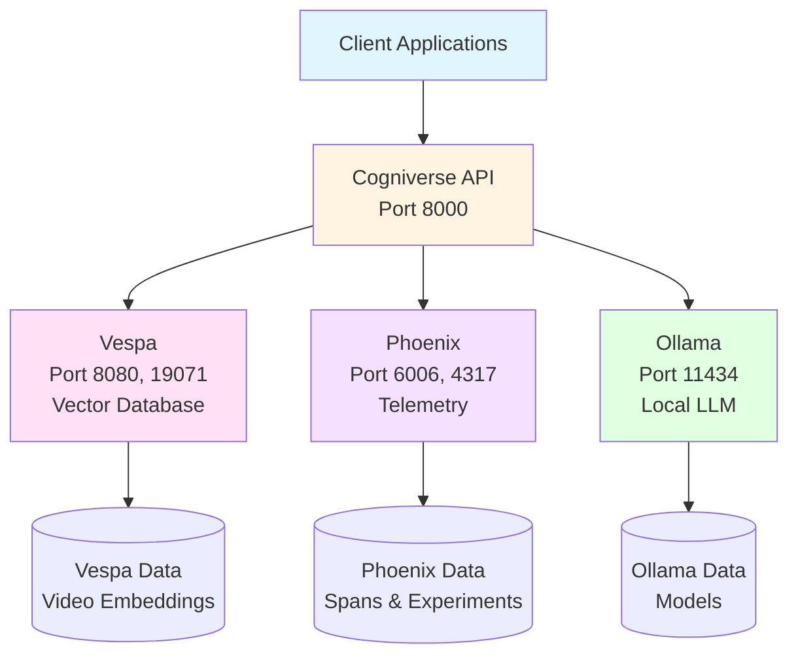
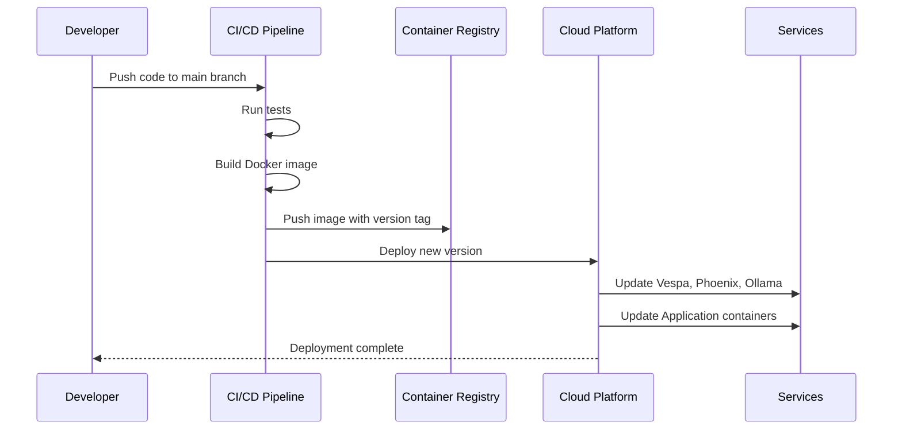
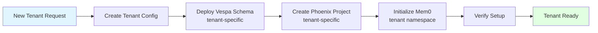
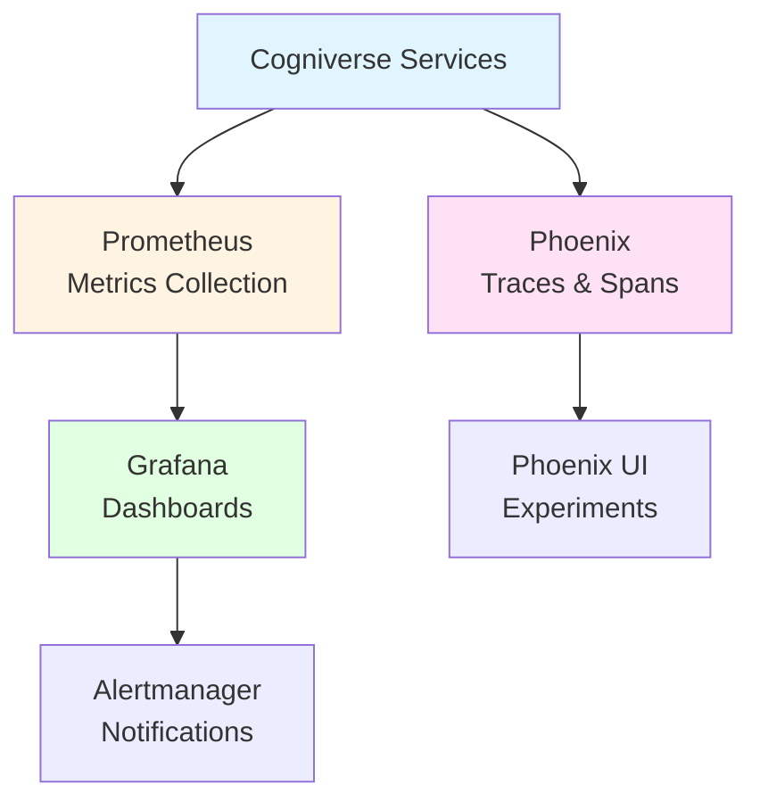

# Cogniverse Study Guide: Deployment Guide

**Last Updated:** 2025-10-08
**Module Path:** System-wide deployment
**Purpose:** Production deployment patterns and infrastructure setup

---

## Module Overview

### Purpose
Comprehensive deployment guide covering:
- **Local Development**: Quick setup for development
- **Docker Compose**: Simple multi-container deployment
- **Cloud Platforms**: AWS ECS, GCP Cloud Run, Modal serverless
- **Kubernetes**: Production-grade orchestration
- **Multi-Tenant**: Schema deployment and isolation

### Core Services
- **Application**: Multi-agent orchestration
- **Vespa**: Multi-tenant vector database (port 8080)
- **Phoenix**: Telemetry and tracing (port 6006)
- **Ollama**: Local LLM inference (port 11434)

---

## Service Architecture



---

## Local Development

### Quick Setup

```bash
# Clone repository
git clone <repo-url>
cd cogniverse

# Install dependencies
pip install uv
uv sync

# Start Vespa
docker run -d --name vespa \
  -p 8080:8080 -p 19071:19071 \
  -v vespa-data:/opt/vespa/var \
  vespaengine/vespa:latest

# Start Phoenix
docker run -d --name phoenix \
  -p 6006:6006 -p 4317:4317 \
  -v phoenix-data:/data \
  -e PHOENIX_WORKING_DIR=/data \
  arizephoenix/phoenix:latest

# Start Ollama
docker run -d --name ollama \
  -p 11434:11434 \
  -v ollama-data:/root/.ollama \
  ollama/ollama:latest

# Pull required Ollama models
docker exec ollama ollama pull llama3.2
docker exec ollama ollama pull nomic-embed-text

# Verify services
curl http://localhost:8080/ApplicationStatus  # Vespa
curl http://localhost:6006/health            # Phoenix
curl http://localhost:11434/api/tags         # Ollama
```

### Service Ports

| Service | Port | Protocol | Purpose |
|---------|------|----------|---------|
| **Vespa HTTP** | 8080 | HTTP | Document feed & search queries |
| **Vespa Config** | 19071 | HTTP | Schema deployment |
| **Phoenix** | 6006 | HTTP | Telemetry & experiments dashboard |
| **Phoenix Collector** | 4317 | gRPC | OTLP span collection |
| **Ollama** | 11434 | HTTP | LLM inference API |
| **Application** | 8000 | HTTP | Main API |

### Environment Configuration

```bash
# Create .env file
cat > .env <<EOF
# Environment
ENVIRONMENT=development
LOG_LEVEL=DEBUG

# Telemetry
TELEMETRY_ENABLED=true
TELEMETRY_LEVEL=detailed
PHOENIX_ENABLED=true
PHOENIX_COLLECTOR_ENDPOINT=localhost:4317
TELEMETRY_SYNC_EXPORT=false  # Use async batch export

# Vespa
VESPA_HOST=localhost
VESPA_PORT=8080

# Ollama
OLLAMA_BASE_URL=http://localhost:11434/v1

# Multi-tenant
DEFAULT_TENANT_ID=default

# Performance
VESPA_FEED_MAX_WORKERS=8
BATCH_SIZE=50
EOF
```

---

## Docker Compose Deployment

### Complete Stack

```yaml
# docker-compose.yml
version: '3.8'

services:
  vespa:
    image: vespaengine/vespa:latest
    ports:
      - "8080:8080"
      - "19071:19071"
    volumes:
      - vespa-data:/opt/vespa/var
    healthcheck:
      test: ["CMD", "curl", "-f", "http://localhost:8080/ApplicationStatus"]
      interval: 30s
      timeout: 10s
      retries: 3

  phoenix:
    image: arizephoenix/phoenix:latest
    ports:
      - "6006:6006"
      - "4317:4317"  # OTLP gRPC collector
    volumes:
      - phoenix-data:/data
    environment:
      - PHOENIX_WORKING_DIR=/data
    healthcheck:
      test: ["CMD", "curl", "-f", "http://localhost:6006/health"]
      interval: 30s
      timeout: 10s
      retries: 3

  ollama:
    image: ollama/ollama:latest
    ports:
      - "11434:11434"
    volumes:
      - ollama-data:/root/.ollama
    deploy:
      resources:
        reservations:
          devices:
            - driver: nvidia
              count: 1
              capabilities: [gpu]

  cogniverse:
    build: .
    ports:
      - "8000:8000"
    environment:
      - VESPA_HOST=vespa
      - VESPA_PORT=8080
      - PHOENIX_COLLECTOR_ENDPOINT=phoenix:4317
      - OLLAMA_BASE_URL=http://ollama:11434/v1
      - ENVIRONMENT=production
      - TELEMETRY_ENABLED=true
    depends_on:
      - vespa
      - phoenix
      - ollama
    volumes:
      - model-cache:/app/models
      - ./configs:/app/configs:ro

volumes:
  vespa-data:
  phoenix-data:
  ollama-data:
  model-cache:
```

```bash
# Deploy stack
docker-compose up -d

# Pull Ollama models
docker-compose exec ollama ollama pull llama3.2
docker-compose exec ollama ollama pull nomic-embed-text

# View logs
docker-compose logs -f cogniverse

# Scale application
docker-compose up -d --scale cogniverse=3
```

---

## Cloud Deployment Patterns

### Deployment Flow



### Modal Deployment (Serverless GPU)

```python
# modal_app.py
import modal

app = modal.App("cogniverse")

# GPU-optimized image with all dependencies
image = (
    modal.Image.debian_slim()
    .pip_install_from_requirements("requirements.txt")
    .run_commands(
        "apt-get update && apt-get install -y ffmpeg git",
        "huggingface-cli download vidore/colsmol-500m",
    )
)

# Video processing function with GPU
@app.function(
    image=image,
    gpu="A10G",  # 24GB VRAM
    memory=32768,  # 32GB RAM
    timeout=1800,  # 30 minutes
    secrets=[modal.Secret.from_name("cogniverse-secrets")],
    volumes={"/models": modal.Volume.from_name("model-cache")}
)
async def process_video(
    video_url: str,
    profile: str = "video_colpali_smol500_mv_frame",
    tenant_id: str = "default"
):
    """Process video with ColPali/VideoPrism on GPU"""
    from src.app.ingestion import VideoIngestionPipeline

    pipeline = VideoIngestionPipeline(profile=profile, tenant_id=tenant_id)
    result = await pipeline.process_video_from_url(video_url)

    return {
        "video_id": result.video_id,
        "documents_created": len(result.documents),
        "processing_time_seconds": result.processing_time
    }

# Search endpoint (CPU-only, fast)
@app.function(
    image=image,
    memory=8192,
    timeout=30,
    secrets=[modal.Secret.from_name("cogniverse-secrets")]
)
async def search(
    query: str,
    profile: str = "video_colpali_smol500_mv_frame",
    ranking_strategy: str = "hybrid_float_bm25",
    top_k: int = 10,
    tenant_id: str = "default"
):
    """Execute search with appropriate agent"""
    from src.app.agents.video_search_agent import VideoSearchAgent

    agent = VideoSearchAgent(profile=profile, tenant_id=tenant_id)
    results = await agent.search(
        query=query,
        ranking_strategy=ranking_strategy,
        top_k=top_k
    )

    return {
        "results": [r.to_dict() for r in results],
        "count": len(results)
    }

# FastAPI web endpoint
@app.function(image=image)
@modal.asgi_app()
def web():
    from fastapi import FastAPI
    from src.api.routes import router

    app = FastAPI(title="Cogniverse API")
    app.include_router(router)

    return app
```

```bash
# Deploy to Modal
modal deploy modal_app.py

# Test endpoints
modal run modal_app.py::search --query "machine learning tutorial"
modal run modal_app.py::process_video --video-url "https://example.com/video.mp4"
```

---

## Kubernetes Deployment

### Helm Chart Structure

```
helm/cogniverse/
├── Chart.yaml
├── values.yaml
├── templates/
│   ├── deployment.yaml
│   ├── service.yaml
│   ├── ingress.yaml
│   ├── configmap.yaml
│   ├── secrets.yaml
│   ├── hpa.yaml
│   └── servicemonitor.yaml
└── values-production.yaml
```

### Values Configuration

```yaml
# helm/cogniverse/values.yaml
replicaCount: 3

image:
  repository: cogniverse
  tag: latest
  pullPolicy: IfNotPresent

service:
  type: ClusterIP
  port: 80
  targetPort: 8000

ingress:
  enabled: true
  className: nginx
  annotations:
    cert-manager.io/cluster-issuer: letsencrypt-prod
  hosts:
    - host: api.cogniverse.example.com
      paths:
        - path: /
          pathType: Prefix

resources:
  limits:
    cpu: 4000m
    memory: 8Gi
  requests:
    cpu: 2000m
    memory: 4Gi

autoscaling:
  enabled: true
  minReplicas: 2
  maxReplicas: 20
  targetCPUUtilizationPercentage: 70

# Vespa configuration
vespa:
  enabled: true
  replicas: 3
  storage: 100Gi
  memory: 16Gi

# Phoenix configuration
phoenix:
  enabled: true
  storage: 50Gi

# Ollama configuration
ollama:
  enabled: true
  gpu:
    enabled: true
    count: 1
  models:
    - llama3.2
    - nomic-embed-text

# Environment variables
env:
  ENVIRONMENT: production
  TELEMETRY_ENABLED: "true"
  LOG_LEVEL: INFO
```

### Deploy with Helm

```bash
# Install
helm install cogniverse cogniverse/cogniverse \
  --namespace cogniverse \
  --create-namespace \
  --values values-production.yaml \
  --wait

# Upgrade
helm upgrade cogniverse cogniverse/cogniverse \
  --namespace cogniverse \
  --values values-production.yaml \
  --wait

# Rollback
helm rollback cogniverse 1 --namespace cogniverse
```

---

## Multi-Tenant Schema Deployment

### Tenant Deployment Flow



### Schema Deployment Script

```python
# scripts/deploy_tenant_schemas.py
"""Deploy schemas for all tenants on production Vespa"""
import asyncio
from src.backends.vespa.schema_manager import VespaSchemaManager

async def deploy_all_tenant_schemas():
    manager = VespaSchemaManager(
        vespa_endpoint="https://vespa.prod.example.com",
        vespa_port=443
    )

    tenants = ["acme", "globex", "initech"]  # Production tenants
    base_schemas = [
        "video_colpali_smol500_mv_frame",
        "video_videoprism_base_mv_chunk_30s"
    ]

    for tenant in tenants:
        for schema in base_schemas:
            tenant_schema = f"{schema}_{tenant}"
            if not manager.schema_exists(tenant_schema):
                print(f"Deploying schema: {tenant_schema}")
                manager.deploy_tenant_schema(
                    base_schema=schema,
                    tenant_id=tenant
                )
            else:
                print(f"Schema exists: {tenant_schema}")

if __name__ == "__main__":
    asyncio.run(deploy_all_tenant_schemas())
```

```bash
# Deploy tenant schemas
uv run python scripts/deploy_tenant_schemas.py
```

---

## Monitoring & Observability

### Phoenix Dashboard Access

```bash
# Port-forward Phoenix in Kubernetes
kubectl port-forward -n cogniverse svc/phoenix 6006:6006

# Access dashboard
open http://localhost:6006

# View tenant-specific traces
# Navigate to project: cogniverse-{tenant_id}-video-search
```

### Metrics Monitoring



---

## Backup & Disaster Recovery

### Automated Backup Script

```bash
#!/bin/bash
# scripts/backup-production.sh

set -e

BACKUP_DATE=$(date +%Y%m%d_%H%M%S)
BACKUP_DIR="/backups/$BACKUP_DATE"
S3_BUCKET="s3://cogniverse-backups-prod"

mkdir -p $BACKUP_DIR

# Backup Vespa data
echo "Backing up Vespa..."
kubectl exec -n cogniverse deployment/vespa -- \
  vespa-backup --cluster video --outputdir /backup

kubectl cp cogniverse/vespa:/backup $BACKUP_DIR/vespa/

# Backup Phoenix data
echo "Backing up Phoenix..."
kubectl exec -n cogniverse deployment/phoenix -- \
  tar -czf /tmp/phoenix-backup.tar.gz /data

kubectl cp cogniverse/phoenix:/tmp/phoenix-backup.tar.gz \
  $BACKUP_DIR/phoenix/phoenix-data.tar.gz

# Backup configurations
echo "Backing up configurations..."
kubectl get configmap -n cogniverse -o yaml > $BACKUP_DIR/configmaps.yaml
kubectl get secret -n cogniverse -o yaml > $BACKUP_DIR/secrets.yaml

# Upload to S3
echo "Uploading to S3..."
aws s3 sync $BACKUP_DIR $S3_BUCKET/$BACKUP_DATE/ \
  --storage-class GLACIER \
  --sse AES256

# Cleanup local backup
rm -rf $BACKUP_DIR

echo "Backup complete: $S3_BUCKET/$BACKUP_DATE/"
```

```bash
# Schedule daily backups (cron)
0 2 * * * /app/scripts/backup-production.sh >> /var/log/backups.log 2>&1
```

---

## Troubleshooting

### Common Issues

**1. Vespa Connection Timeout**

```bash
# Check Vespa pod status
kubectl get pods -n cogniverse -l app=vespa

# Check logs
kubectl logs -n cogniverse deployment/vespa --tail=100

# Test connectivity
kubectl exec -n cogniverse deployment/cogniverse -- \
  curl http://vespa:8080/ApplicationStatus

# Restart if needed
kubectl rollout restart deployment/vespa -n cogniverse
```

**2. Out of Memory (OOMKilled)**

```bash
# Check pod events
kubectl describe pod -n cogniverse <pod-name>

# Increase memory limits
kubectl set resources deployment/cogniverse \
  --limits=memory=16Gi \
  --requests=memory=8Gi \
  -n cogniverse
```

**3. Slow Phoenix Span Export**

```bash
# Check Phoenix collector is accessible
kubectl exec -n cogniverse deployment/cogniverse -- \
  curl http://phoenix:4317

# Check batch export configuration
kubectl set env deployment/cogniverse \
  TELEMETRY_SYNC_EXPORT=false \
  -n cogniverse
```

---

**Related Guides:**
- [00_ARCHITECTURE_OVERVIEW.md](./00_ARCHITECTURE_OVERVIEW.md) - System design
- [19_SETUP_INSTALLATION.md](./19_SETUP_INSTALLATION.md) - Installation
- [20_CONFIGURATION_MANAGEMENT.md](./20_CONFIGURATION_MANAGEMENT.md) - Configuration
- [22_PERFORMANCE_MONITORING.md](./22_PERFORMANCE_MONITORING.md) - Performance

---

**Next**: [22_PERFORMANCE_MONITORING.md](./22_PERFORMANCE_MONITORING.md)
