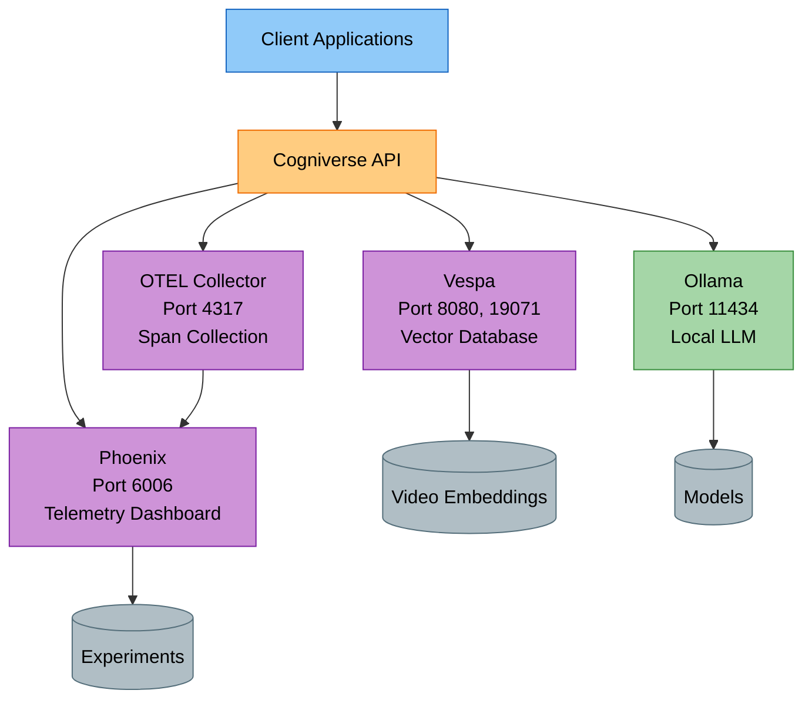

# Deployment Guide

---

## Overview

This guide covers verified, implemented deployment patterns:

- **Local Development**: Docker-based setup for development

- **Modal Serverless**: GPU-accelerated VLM frame description generation

- **Multi-Tenant**: Schema deployment and isolation

### Core Services
- **Vespa**: Multi-tenant vector database (ports 8080, 19071)
- **Phoenix**: Telemetry dashboard (port 6006)
- **OTEL Collector**: OTLP span collection (port 4317)
- **Ollama**: Local LLM inference (port 11434)

---

## Service Architecture



---

## Local Development

### Quick Setup

```bash
# Clone repository
git clone <repo-url>
cd cogniverse

# Install dependencies
pip install uv
uv sync

# Start Vespa
docker run -d --name vespa \
  -p 8080:8080 -p 19071:19071 \
  -v vespa-data:/opt/vespa/var \
  vespaengine/vespa:latest

# Start Phoenix
docker run -d --name phoenix \
  -p 6006:6006 -p 4317:4317 \
  -v phoenix-data:/data \
  -e PHOENIX_WORKING_DIR=/data \
  arizephoenix/phoenix:latest

# Start Ollama
docker run -d --name ollama \
  -p 11434:11434 \
  -v ollama-data:/root/.ollama \
  ollama/ollama:latest

# Pull required Ollama models
docker exec ollama ollama pull llama3.2
docker exec ollama ollama pull nomic-embed-text

# Verify services
curl http://localhost:8080/ApplicationStatus  # Vespa
curl http://localhost:6006/health            # Phoenix
curl http://localhost:11434/api/tags         # Ollama
```

### Service Ports

| Service | Port | Protocol | Purpose |
|---------|------|----------|---------|
| **Vespa HTTP** | 8080 | HTTP | Document feed & search queries |
| **Vespa Config** | 19071 | HTTP | Schema deployment |
| **Phoenix** | 6006 | HTTP | Telemetry & experiments dashboard |
| **OTEL Collector** | 4317 | gRPC | OTLP span collection |
| **Ollama** | 11434 | HTTP | LLM inference API |

### Environment Configuration

Create a `.env` file in the workspace root:

```bash
# Environment
ENVIRONMENT=development
LOG_LEVEL=DEBUG

# Tenant Configuration
DEFAULT_TENANT_ID=default

# Telemetry (per-tenant Phoenix projects)
PHOENIX_ENABLED=true
PHOENIX_COLLECTOR_ENDPOINT=localhost:4317

# Backend (Vespa - multi-tenant with schema-per-tenant)
BACKEND_URL=http://localhost
BACKEND_PORT=8080
BACKEND_CONFIG_PORT=19071

# Ollama
OLLAMA_BASE_URL=http://localhost:11434/v1

# JAX (for VideoPrism)
JAX_PLATFORM_NAME=cpu
```

---

## Deployment Options

Cogniverse supports multiple deployment methods depending on your needs:

### Quick Deployment Scripts

**1. Local Development - Docker Compose** (Recommended for development)
```bash
# Quick start with all services
./scripts/deploy_local_docker.sh

# Production mode
./scripts/deploy_local_docker.sh --production

# With live logs
./scripts/deploy_local_docker.sh --logs
```

**2. Local Kubernetes - K3s** (For testing K8s deployments locally)
```bash
# Install K3s and deploy
./scripts/deploy_k3s.sh --install-k3s

# Deploy to existing K3s
./scripts/deploy_k3s.sh

# With Argo Workflows
./scripts/deploy_k3s.sh --install-argo
```

**3. Production Kubernetes** (For remote K8s clusters: EKS, GKE, AKS)
```bash
# Full production deployment with ingress and TLS
./scripts/deploy_kubernetes.sh \
  --cloud-provider aws \
  --domain cogniverse.example.com \
  --install-ingress \
  --install-cert-manager \
  --install-argo
```

**See detailed guides:**

- [Docker Deployment Guide](docker-deployment.md) - Complete Docker Compose setup

- [Kubernetes Deployment Guide](kubernetes-deployment.md) - K8s/K3s/Helm deployment

- [Istio Service Mesh Guide](istio-service-mesh.md) - Service mesh with mTLS, Phoenix tracing, DNS-based multi-cluster

- [Argo Workflows Guide](argo-workflows.md) - Batch processing workflows

---

## Docker Compose Deployment (Manual)

For manual Docker Compose setup, here's the reference configuration:

### Complete Stack

```yaml
# deployment/docker-compose.yml
version: '3.8'

services:
  vespa:
    image: vespaengine/vespa:latest
    ports:
      - "8080:8080"
      - "19071:19071"
    volumes:
      - vespa-data:/opt/vespa/var
    healthcheck:
      test: ["CMD", "curl", "-f", "http://localhost:8080/ApplicationStatus"]
      interval: 30s
      timeout: 10s
      retries: 3

  phoenix:
    image: arizephoenix/phoenix:latest
    ports:
      - "6006:6006"   # UI + REST API
      - "4317:4317"   # OTLP gRPC collector
    volumes:
      - phoenix-data:/data
    environment:
      - PHOENIX_WORKING_DIR=/data
    healthcheck:
      test: ["CMD", "curl", "-f", "http://localhost:6006/health"]
      interval: 30s
      timeout: 10s
      retries: 3

  ollama:
    image: ollama/ollama:latest
    ports:
      - "11434:11434"
    volumes:
      - ollama-data:/root/.ollama
    deploy:
      resources:
        reservations:
          devices:
            - driver: nvidia
              count: 1
              capabilities: [gpu]

  cogniverse:
    build: .
    ports:
      - "8000:8000"
    environment:
      - BACKEND_URL=http://vespa
      - BACKEND_PORT=8080
      - BACKEND_CONFIG_PORT=19071
      - PHOENIX_COLLECTOR_ENDPOINT=phoenix:4317
      - OLLAMA_BASE_URL=http://ollama:11434/v1
      - ENVIRONMENT=production
      - PHOENIX_ENABLED=true
      - DEFAULT_TENANT_ID=default
    depends_on:
      - vespa
      - phoenix
      - ollama
    volumes:
      - model-cache:/app/models
      - ./configs:/app/configs:ro
      - ./libs:/app/libs:ro  # Mount SDK packages

volumes:
  vespa-data:
  phoenix-data:
  ollama-data:
  model-cache:
```

### Deploy with Docker Compose

```bash
# Deploy stack
docker-compose up -d

# Pull Ollama models
docker-compose exec ollama ollama pull llama3.2
docker-compose exec ollama ollama pull nomic-embed-text

# View logs
docker-compose logs -f cogniverse

# Scale application
docker-compose up -d --scale cogniverse=3
```

---

## Modal Deployment (Serverless GPU)

Modal provides serverless GPU infrastructure for VLM-based video frame description generation. See [docs/modal/deployment_guide.md](../modal/deployment_guide.md) for detailed setup.

### Modal App Structure

The actual Modal service (`scripts/modal_vlm_service.py`) provides VLM description generation using Qwen2-VL-7B-Instruct:

```python
# scripts/modal_vlm_service.py (simplified overview)
import modal

app = modal.App("cogniverse-vlm")

# GPU-optimized image with SGLang and Qwen2-VL-7B model
image = (
    modal.Image.from_registry(f"nvidia/cuda:{tag}", add_python="3.11")
    .pip_install(
        "transformers==4.47.1",
        "sglang[all]==0.4.1",
        # ... other dependencies
    )
    .run_function(download_model, volumes=volumes)
)

@app.cls(
    gpu="h100:1",
    timeout=180 * 60,  # 3 hours
    image=image,
    volumes=volumes,
)
@modal.concurrent(max_inputs=50)
class VLMModel:
    @modal.enter()
    def start_runtime(self):
        """Starts SGLang runtime for VLM inference."""
        import sglang as sgl
        self.runtime = sgl.Runtime(
            model_path="Qwen/Qwen2-VL-7B-Instruct",
            tokenizer_path="Qwen/Qwen2-VL-7B-Instruct",
            tp_size=GPU_COUNT,
            log_level=SGL_LOG_LEVEL,
        )
        sgl.set_default_backend(self.runtime)

    @modal.fastapi_endpoint(method="POST", docs=True)
    def generate_description(self, request: dict) -> dict:
        """
        Generate description for a video frame.

        Args:
            request: {
                "frame_base64": "base64 encoded frame data",
                "frame_path": "optional local path",
                "remote_frame_path": "optional remote path",
                "prompt": "optional custom prompt"
            }

        Returns:
            {"description": "generated text", "duration_seconds": 1.23}
        """
        # Frame description generation using SGLang
        # See actual implementation in scripts/modal_vlm_service.py

    @modal.fastapi_endpoint(method="POST", docs=True)
    def upload_and_process_frames(self, request: dict) -> dict:
        """
        Upload zip of frames and process them all in batch.

        Args:
            request: {
                "zip_data": "base64 encoded zip",
                "frame_mapping": {filename: frame_key}
            }

        Returns:
            {"descriptions": {frame_key: description}, "processed_frames": N}
        """
        # Batch frame processing
        # See actual implementation in scripts/modal_vlm_service.py
```

**Note:** The Modal service provides VLM description generation for video frames. For full video processing pipelines (keyframe extraction, transcription, embeddings, ingestion), use the local pipeline with `scripts/run_ingestion.py`.

### Deploy to Modal

```bash
# Deploy to Modal
modal deploy scripts/modal_vlm_service.py

# Test VLM description generation with a local frame
modal run scripts/modal_vlm_service.py::test_vlm --frame-path /path/to/frame.jpg

# Production usage: Call the FastAPI endpoints
# - VLMModel.generate_description (POST) - Single frame description
# - VLMModel.upload_and_process_frames (POST) - Batch processing
```

For detailed Modal setup, GPU recommendations, and deployment guides, see:

- [docs/modal/deployment_guide.md](../modal/deployment_guide.md) - Complete Modal deployment guide

- [docs/modal/gpu_recommendations.md](../modal/gpu_recommendations.md) - GPU selection and configuration

- [scripts/modal_vlm_service.py](../../scripts/modal_vlm_service.py) - Modal VLM service implementation

---

## Multi-Tenant Schema Deployment

Cogniverse supports multi-tenant deployment with per-tenant schema isolation.

### Schema Deployment Script

**Note:** The actual `scripts/deploy_all_schemas.py` deploys all schemas at once (not per-tenant). It uses pyvespa's ApplicationPackage to bundle schemas and the VespaSchemaManager's internal deployment method.

**Actual Implementation Pattern** (from `scripts/deploy_all_schemas.py`):

```python
# Actual implementation from scripts/deploy_all_schemas.py
# Note: Import from module paths directly (utils not in __all__)
from cogniverse_foundation.config.utils import create_default_config_manager, get_config
from cogniverse_vespa.json_schema_parser import JsonSchemaParser
from cogniverse_vespa.vespa_schema_manager import VespaSchemaManager
from vespa.package import ApplicationPackage
from pathlib import Path

# Get configuration (provides backend connection info)
config_manager = create_default_config_manager()
config = get_config(tenant_id="default", config_manager=config_manager)

# Initialize the schema manager with backend config
# VespaSchemaManager uses backend_endpoint/backend_port (abstracted naming)
schema_manager = VespaSchemaManager(
    backend_endpoint=config.get("backend_url"),
    backend_port=config.get("backend_port")
)

# Get all schema files from configs/schemas/
schemas_dir = Path("configs/schemas")
schema_files = list(schemas_dir.glob("*.json"))  # All JSON schemas

# Create application package to hold all schemas
app_package = ApplicationPackage(name="videosearch")

# Parse each schema and add to package
for schema_file in schema_files:
    parser = JsonSchemaParser()
    schema = parser.load_schema_from_json_file(str(schema_file))
    app_package.add_schema(schema)

# Deploy all schemas at once using internal method
schema_manager._deploy_package(app_package)
```

**Tenant-Aware Schema Deployment**:

```python
from cogniverse_foundation.config.utils import create_default_config_manager, get_config
from cogniverse_core.registries.schema_registry import SchemaRegistry
from cogniverse_core.schemas.filesystem_loader import FilesystemSchemaLoader
from cogniverse_vespa.backend import VespaBackend
from pathlib import Path

# Initialize configuration
config_manager = create_default_config_manager()
config = get_config(tenant_id="default", config_manager=config_manager)

# Get backend config for the tenant
backend_config = config_manager.get_backend_config("default")

# Initialize schema loader
schemas_dir = Path("configs/schemas")
schema_loader = FilesystemSchemaLoader(schemas_dir)

# Initialize backend with all required parameters
# VespaBackend constructor requires:
#   backend_config: BackendConfig instance (REQUIRED)
#   schema_loader: SchemaLoader instance (REQUIRED)
#   config_manager: ConfigManager instance (REQUIRED)
backend = VespaBackend(
    backend_config=backend_config,
    schema_loader=schema_loader,
    config_manager=config_manager
)

# Initialize schema registry
registry = SchemaRegistry(
    config_manager=config_manager,
    backend=backend,
    schema_loader=schema_loader
)

# Deploy schemas for multiple tenants
tenants = ["acme_corp", "globex_inc", "default"]

for tenant_id in tenants:
    # Get all video schemas (exclude metadata schemas)
    all_schemas = schema_loader.list_available_schemas()
    video_schemas = [
        s for s in all_schemas
        if s.startswith("video_") and not s.endswith("_metadata")
    ]

    for base_schema in video_schemas:
        # Deploy tenant-specific schema (name: {base_schema}_{tenant_id})
        tenant_schema_name = registry.deploy_schema(
            tenant_id=tenant_id,
            base_schema_name=base_schema,
            force=False
        )
        print(f"Deployed: {tenant_schema_name}")
```

### Deploy Schemas

```bash
# Deploy all schemas from configs/schemas/ at once
JAX_PLATFORM_NAME=cpu uv run python scripts/deploy_all_schemas.py

# Deploy specific schema file (actual script usage)
JAX_PLATFORM_NAME=cpu uv run python scripts/deploy_json_schema.py \
  configs/schemas/video_colpali_smol500_mv_frame_schema.json

# Deploy multiple schema files
for schema in configs/schemas/video_*_schema.json; do
  JAX_PLATFORM_NAME=cpu uv run python scripts/deploy_json_schema.py "$schema"
done
```

**Note:** For single-schema deployment use `deploy_json_schema.py`. For multi-tenant batch deployment use `deploy_all_schemas.py --tenant-id <tenant_id>`.

### Available Schemas

The `configs/schemas/` directory contains multiple schema types:
- Video schemas: `video_*_schema.json` (for video search)
- Metadata schemas: `organization_metadata_schema.json`, `tenant_metadata_schema.json`, `config_metadata_schema.json`, `adapter_registry_schema.json`
- Other schemas: `agent_memories_schema.json`, `workflow_intelligence_schema.json`

The schema names inside the JSON files do not include the `_schema.json` suffix.

| Schema File | Schema Name (in JSON) | Embedding Model | Modality | Dimensions | Tenant Suffix |
|-------------|----------------------|----------------|----------|------------|---------------|
| `video_colpali_smol500_mv_frame_schema.json` | `video_colpali_smol500_mv_frame` | ColPali SmolVLM 500M | Frame-based | 128 per patch | `_<tenant_id>` |
| `video_colqwen_omni_mv_chunk_30s_schema.json` | `video_colqwen_omni_mv_chunk_30s` | ColQwen2 Omni | Chunk-based (30s) | 128 per patch | `_<tenant_id>` |
| `video_videoprism_base_mv_chunk_30s_schema.json` | `video_videoprism_base_mv_chunk_30s` | VideoPrism Base | Chunk-based (30s) | 768 per patch | `_<tenant_id>` |
| `video_videoprism_large_mv_chunk_30s_schema.json` | `video_videoprism_large_mv_chunk_30s` | VideoPrism Large | Chunk-based (30s) | 1024 per patch | `_<tenant_id>` |
| `video_videoprism_lvt_base_sv_chunk_6s_schema.json` | `video_videoprism_lvt_base_sv_chunk_6s` | VideoPrism LVT Base | Chunk-based (6s) | 768 | `_<tenant_id>` |
| `video_videoprism_lvt_large_sv_chunk_6s_schema.json` | `video_videoprism_lvt_large_sv_chunk_6s` | VideoPrism LVT Large | Chunk-based (6s) | 1024 | `_<tenant_id>` |

**Example:** For tenant `acme_corp`:

- `video_colpali_smol500_mv_frame_acme_corp`
- `video_colqwen_omni_mv_chunk_30s_acme_corp`
- `video_videoprism_base_mv_chunk_30s_acme_corp`
- `video_videoprism_large_mv_chunk_30s_acme_corp`
- `video_videoprism_lvt_base_sv_chunk_6s_acme_corp`
- `video_videoprism_lvt_large_sv_chunk_6s_acme_corp`

Each tenant gets completely isolated schemas with their own documents and indexes.

---

## Monitoring & Observability

### Phoenix Dashboard Access

```bash
# Access local Phoenix dashboard
open http://localhost:6006

# View tenant-specific traces (each tenant has isolated project)
# Projects:
#   - acme_corp_project
#   - globex_inc_project
#   - default_project
```

### Phoenix Telemetry Integration

Phoenix telemetry is automatically enabled with **per-tenant project isolation**:

**Tracked Spans (per tenant):**

- Query processing spans (tenant-specific)

- Agent routing decisions (tenant-isolated)

- Vespa search operations (tenant schema-specific)

- Embedding generation (tenant context)

- Multi-modal reranking (tenant metrics)

**Tenant Isolation:**

- Each tenant has its own Phoenix project

- No cross-tenant trace visibility

- Tenant-specific experiment tracking

- Isolated span datasets per tenant

**Example Span Attributes:**
```json
{
  "tenant_id": "acme_corp",
  "schema_name": "video_colpali_mv_frame_acme_corp",
  "phoenix_project": "acme_corp_project",
  "query": "machine learning tutorial",
  "agent_type": "VideoSearchAgent"
}
```

---

## Troubleshooting

### Vespa Connection Issues

```bash
# Check Vespa health
curl http://localhost:8080/state/v1/health

# Restart Vespa
docker restart vespa

# Check logs
docker logs vespa
```

### Phoenix Not Recording Spans

```bash
# Check Phoenix is running
docker ps | grep phoenix

# Verify endpoint
echo $PHOENIX_COLLECTOR_ENDPOINT

# Check Phoenix logs
docker logs phoenix
```

### Ollama Model Issues

```bash
# List installed models
docker exec ollama ollama list

# Remove and re-pull model
docker exec ollama ollama rm llama3.2
docker exec ollama ollama pull llama3.2
```

---

## SDK Package Deployment

### Building Distribution Packages

```bash
# Build all 11 SDK packages for distribution
for dir in libs/*/; do
  echo "Building $(basename $dir)..."
  (cd "$dir" && uv build)
done

# Packages created in dist/ directory (all 11 packages):
# Foundation Layer:
# - cogniverse-sdk-0.1.0-py3-none-any.whl
# - cogniverse-foundation-0.1.0-py3-none-any.whl
# Core Layer:
# - cogniverse-core-0.1.0-py3-none-any.whl
# - cogniverse-evaluation-0.1.0-py3-none-any.whl
# - cogniverse-telemetry-phoenix-0.1.0-py3-none-any.whl
# Implementation Layer:
# - cogniverse-agents-0.1.0-py3-none-any.whl
# - cogniverse-vespa-0.1.0-py3-none-any.whl
# - cogniverse-synthetic-0.1.0-py3-none-any.whl
# - cogniverse-finetuning-0.1.0-py3-none-any.whl
# Application Layer:
# - cogniverse-runtime-0.1.0-py3-none-any.whl
# - cogniverse-dashboard-0.1.0-py3-none-any.whl
```

### Installing from Wheels

```bash
# Install core package only
pip install dist/cogniverse-core-0.1.0-py3-none-any.whl

# Install agents package (includes core dependency)
pip install dist/cogniverse-agents-0.1.0-py3-none-any.whl

# Install all packages
pip install dist/*.whl
```

### Publishing to PyPI (Optional)

```bash
# Build all packages
for dir in libs/*/; do
  (cd "$dir" && uv build)
done

# Publish to PyPI
for dir in libs/*/; do
  (cd "$dir" && uv publish)
done
```

---

## Related Documentation

- [Setup & Installation](setup-installation.md) - Complete installation guide for UV workspace
- [Configuration](configuration.md) - Multi-tenant configuration management
- [Multi-Tenant Operations](multi-tenant-ops.md) - Multi-tenant deployment patterns
- [Istio Service Mesh](istio-service-mesh.md) - Production service mesh with mTLS and Phoenix tracing
- [SDK Architecture](../architecture/sdk-architecture.md) - SDK package structure
- [Performance & Monitoring](performance-monitoring.md) - Performance targets and monitoring
- [Modal Deployment](../modal/deployment_guide.md) - Serverless GPU deployment
