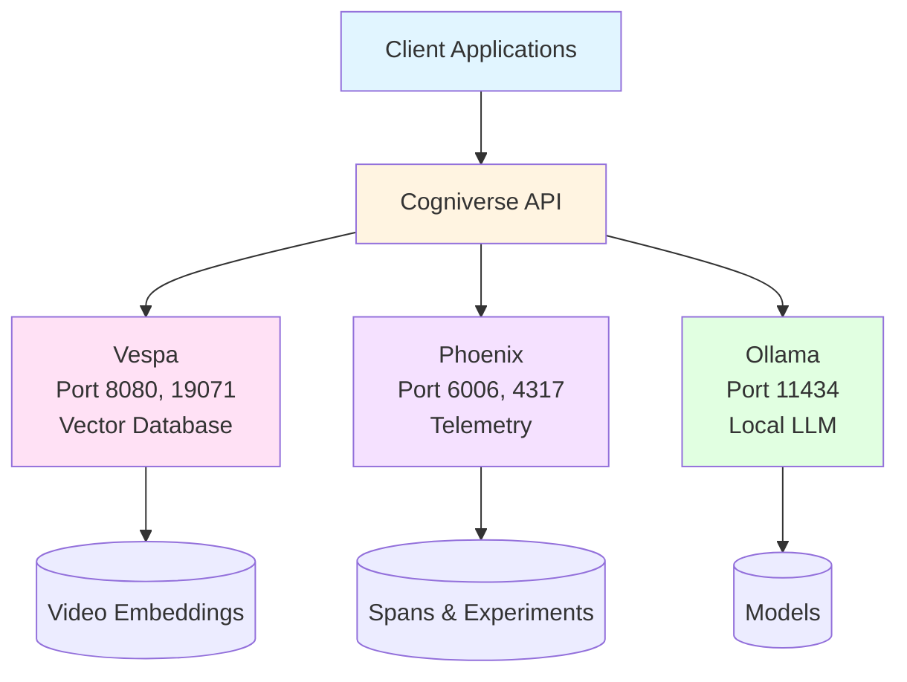

# Deployment Guide

**Last Updated:** 2025-10-15
**Architecture:** UV Workspace with 5 SDK packages
**Purpose:** Deployment patterns for Cogniverse multi-agent system with multi-tenant support

---

## Overview

This guide covers verified, implemented deployment patterns:
- **Local Development**: Docker-based setup for development
- **Modal Serverless**: GPU-accelerated video processing
- **Multi-Tenant**: Schema deployment and isolation

### Core Services
- **Vespa**: Multi-tenant vector database (ports 8080, 19071)
- **Phoenix**: Telemetry and tracing (ports 6006, 4317)
- **Ollama**: Local LLM inference (port 11434)

---

## Service Architecture



---

## Local Development

### Quick Setup

```bash
# Clone repository
git clone <repo-url>
cd cogniverse

# Install dependencies
pip install uv
uv sync

# Start Vespa
docker run -d --name vespa \
  -p 8080:8080 -p 19071:19071 \
  -v vespa-data:/opt/vespa/var \
  vespaengine/vespa:latest

# Start Phoenix
docker run -d --name phoenix \
  -p 6006:6006 -p 4317:4317 \
  -v phoenix-data:/data \
  -e PHOENIX_WORKING_DIR=/data \
  arizephoenix/phoenix:latest

# Start Ollama
docker run -d --name ollama \
  -p 11434:11434 \
  -v ollama-data:/root/.ollama \
  ollama/ollama:latest

# Pull required Ollama models
docker exec ollama ollama pull llama3.2
docker exec ollama ollama pull nomic-embed-text

# Verify services
curl http://localhost:8080/ApplicationStatus  # Vespa
curl http://localhost:6006/health            # Phoenix
curl http://localhost:11434/api/tags         # Ollama
```

### Service Ports

| Service | Port | Protocol | Purpose |
|---------|------|----------|---------|
| **Vespa HTTP** | 8080 | HTTP | Document feed & search queries |
| **Vespa Config** | 19071 | HTTP | Schema deployment |
| **Phoenix** | 6006 | HTTP | Telemetry & experiments dashboard |
| **Phoenix Collector** | 4317 | gRPC | OTLP span collection |
| **Ollama** | 11434 | HTTP | LLM inference API |

### Environment Configuration

Create a `.env` file in the workspace root:

```bash
# Environment
ENVIRONMENT=development
LOG_LEVEL=DEBUG

# Tenant Configuration
DEFAULT_TENANT_ID=default

# Telemetry (per-tenant Phoenix projects)
PHOENIX_ENABLED=true
PHOENIX_COLLECTOR_ENDPOINT=localhost:4317

# Vespa (multi-tenant with schema-per-tenant)
VESPA_HOST=localhost
VESPA_PORT=8080
VESPA_CONFIG_PORT=19071

# Ollama
OLLAMA_BASE_URL=http://localhost:11434/v1

# JAX (for VideoPrism)
JAX_PLATFORM_NAME=cpu
```

---

## Deployment Options

Cogniverse supports multiple deployment methods depending on your needs:

### Quick Deployment Scripts

**1. Local Development - Docker Compose** (Recommended for development)
```bash
# Quick start with all services
./scripts/deploy_local_docker.sh

# Production mode
./scripts/deploy_local_docker.sh --production

# With live logs
./scripts/deploy_local_docker.sh --logs
```

**2. Local Kubernetes - K3s** (For testing K8s deployments locally)
```bash
# Install K3s and deploy
./scripts/deploy_k3s.sh --install-k3s

# Deploy to existing K3s
./scripts/deploy_k3s.sh

# With Argo Workflows
./scripts/deploy_k3s.sh --install-argo
```

**3. Production Kubernetes** (For remote K8s clusters: EKS, GKE, AKS)
```bash
# Full production deployment with ingress and TLS
./scripts/deploy_kubernetes.sh \
  --cloud-provider aws \
  --domain cogniverse.example.com \
  --install-ingress \
  --install-cert-manager \
  --install-argo
```

**See detailed guides:**
- [Docker Deployment Guide](docker-deployment.md) - Complete Docker Compose setup
- [Kubernetes Deployment Guide](kubernetes-deployment.md) - K8s/K3s/Helm deployment
- [Istio Service Mesh Guide](istio-service-mesh.md) - Service mesh with mTLS, Phoenix tracing, DNS-based multi-cluster
- [Argo Workflows Guide](argo-workflows.md) - Batch processing workflows

---

## Docker Compose Deployment (Manual)

For manual Docker Compose setup, here's the reference configuration:

### Complete Stack

```yaml
# docker-compose.yml
version: '3.8'

services:
  vespa:
    image: vespaengine/vespa:latest
    ports:
      - "8080:8080"
      - "19071:19071"
    volumes:
      - vespa-data:/opt/vespa/var
    healthcheck:
      test: ["CMD", "curl", "-f", "http://localhost:8080/ApplicationStatus"]
      interval: 30s
      timeout: 10s
      retries: 3

  phoenix:
    image: arizephoenix/phoenix:latest
    ports:
      - "6006:6006"
      - "4317:4317"  # OTLP gRPC collector
    volumes:
      - phoenix-data:/data
    environment:
      - PHOENIX_WORKING_DIR=/data
    healthcheck:
      test: ["CMD", "curl", "-f", "http://localhost:6006/health"]
      interval: 30s
      timeout: 10s
      retries: 3

  ollama:
    image: ollama/ollama:latest
    ports:
      - "11434:11434"
    volumes:
      - ollama-data:/root/.ollama
    deploy:
      resources:
        reservations:
          devices:
            - driver: nvidia
              count: 1
              capabilities: [gpu]

  cogniverse:
    build: .
    ports:
      - "8000:8000"
    environment:
      - VESPA_HOST=vespa
      - VESPA_PORT=8080
      - VESPA_CONFIG_PORT=19071
      - PHOENIX_COLLECTOR_ENDPOINT=phoenix:4317
      - OLLAMA_BASE_URL=http://ollama:11434/v1
      - ENVIRONMENT=production
      - PHOENIX_ENABLED=true
      - DEFAULT_TENANT_ID=default
    depends_on:
      - vespa
      - phoenix
      - ollama
    volumes:
      - model-cache:/app/models
      - ./configs:/app/configs:ro
      - ./libs:/app/libs:ro  # Mount SDK packages

volumes:
  vespa-data:
  phoenix-data:
  ollama-data:
  model-cache:
```

### Deploy with Docker Compose

```bash
# Deploy stack
docker-compose up -d

# Pull Ollama models
docker-compose exec ollama ollama pull llama3.2
docker-compose exec ollama ollama pull nomic-embed-text

# View logs
docker-compose logs -f cogniverse

# Scale application
docker-compose up -d --scale cogniverse=3
```

---

## Modal Deployment (Serverless GPU)

Modal provides serverless GPU infrastructure for video processing. See [docs/modal/](../modal/) for detailed setup.

### Modal App Structure

```python
# scripts/modal_vlm_service.py
import modal

app = modal.App("cogniverse")

# GPU-optimized image with SDK packages
image = (
    modal.Image.debian_slim()
    .pip_install("uv")
    .copy_local_dir("libs", "/app/libs")  # Copy SDK packages
    .workdir("/app")
    .run_commands(
        "apt-get update && apt-get install -y ffmpeg git",
        "uv sync",  # Install all SDK packages
        "huggingface-cli download vidore/colsmol-500m",
    )
)

# Video processing function with GPU (tenant-aware)
@app.function(
    image=image,
    gpu="A10G",  # 24GB VRAM
    memory=32768,  # 32GB RAM
    timeout=1800,  # 30 minutes
    secrets=[modal.Secret.from_name("cogniverse-secrets")],
    volumes={"/models": modal.Volume.from_name("model-cache")}
)
async def process_video(
    video_url: str,
    profile: str = "video_colpali_smol500_mv_frame",
    tenant_id: str = "default"
):
    """Process video with ColPali/VideoPrism on GPU (tenant-isolated)"""
    from cogniverse_agents.ingestion.pipeline import VideoIngestionPipeline

    pipeline = VideoIngestionPipeline(
        profile=profile,
        tenant_id=tenant_id
    )
    result = await pipeline.process_video_from_url(video_url)

    return {
        "tenant_id": tenant_id,
        "video_id": result.video_id,
        "documents_created": len(result.documents),
        "processing_time_seconds": result.processing_time,
        "schema_name": f"{profile}_{tenant_id}"  # Tenant-isolated schema
    }

# Search endpoint (CPU-only, fast, tenant-aware)
@app.function(
    image=image,
    memory=8192,
    timeout=30,
    secrets=[modal.Secret.from_name("cogniverse-secrets")]
)
async def search(
    query: str,
    profile: str = "video_colpali_smol500_mv_frame",
    ranking_strategy: str = "hybrid_float_bm25",
    top_k: int = 10,
    tenant_id: str = "default"
):
    """Execute search with appropriate agent (tenant-isolated)"""
    from cogniverse_agents.agents.video_search_agent import VideoSearchAgent

    agent = VideoSearchAgent(
        profile=profile,
        tenant_id=tenant_id
    )
    results = await agent.search(
        query=query,
        ranking_strategy=ranking_strategy,
        top_k=top_k
    )

    return {
        "tenant_id": tenant_id,
        "results": [r.to_dict() for r in results],
        "count": len(results),
        "schema_name": f"{profile}_{tenant_id}"
    }
```

### Deploy to Modal

```bash
# Deploy to Modal
modal deploy scripts/modal_vlm_service.py

# Test endpoints
modal run scripts/modal_vlm_service.py::search --query "machine learning tutorial"
modal run scripts/modal_vlm_service.py::process_video --video-url "https://example.com/video.mp4"
```

For detailed Modal setup, GPU recommendations, and deployment guides, see:
- [docs/modal/deployment_guide.md](../modal/deployment_guide.md)
- [docs/modal/gpu_recommendations.md](../modal/gpu_recommendations.md)
- [docs/modal/setup_modal_vlm.py](../modal/setup_modal_vlm.py)

---

## Multi-Tenant Schema Deployment

Cogniverse supports multi-tenant deployment with per-tenant schema isolation.

### Schema Deployment Script

```python
# scripts/deploy_all_schemas.py
from cogniverse_vespa.backends.vespa_schema_manager import VespaSchemaManager
from cogniverse_vespa.backends.json_schema_parser import JsonSchemaParser
from pathlib import Path

# Initialize the schema manager (tenant-aware)
schema_manager = VespaSchemaManager(
    vespa_url="http://localhost:8080",
    vespa_config_port=19071
)

# Get all schema files
schemas_dir = Path("configs/schemas")
schema_files = list(schemas_dir.glob("*.json"))

# Deploy schemas per tenant
tenants = ["acme_corp", "globex_inc", "default"]

for tenant_id in tenants:
    print(f"Deploying schemas for tenant: {tenant_id}")

    for schema_file in schema_files:
        parser = JsonSchemaParser()
        schema = parser.load_schema_from_json_file(str(schema_file))

        # Deploy with tenant-specific schema name
        schema_manager.deploy_schema(
            schema=schema,
            tenant_id=tenant_id,
            schema_suffix=f"_{tenant_id}"  # e.g., video_colpali_mv_frame_acme_corp
        )

        print(f"  ✓ Deployed: {schema.name}_{tenant_id}")
```

### Deploy Schemas

```bash
# Deploy all schemas from configs/schemas/ (all tenants)
uv run python scripts/deploy_all_schemas.py

# Deploy specific schema for specific tenant
JAX_PLATFORM_NAME=cpu uv run python scripts/deploy_json_schema.py \
  --schema-path configs/schemas/video_colpali_smol500_mv_frame.json \
  --tenant-id acme_corp

# Deploy for multiple tenants
for tenant in default acme_corp globex_inc; do
  JAX_PLATFORM_NAME=cpu uv run python scripts/deploy_json_schema.py \
    --schema-path configs/schemas/video_colpali_smol500_mv_frame.json \
    --tenant-id $tenant
done
```

### Available Schemas

| Schema | Embedding Model | Modality | Dimensions | Tenant Suffix |
|--------|----------------|----------|------------|---------------|
| **video_colpali_smol500_mv_frame** | ColPali SmolVLM 500M | Frame-based | 768 | `_<tenant_id>` |
| **video_colqwen_omni_mv_chunk_30s** | ColQwen2 Omni | Chunk-based (30s) | 768 | `_<tenant_id>` |
| **video_videoprism_base_mv_chunk_30s** | VideoPrism Base | Chunk-based (30s) | 768 | `_<tenant_id>` |
| **video_videoprism_lvt_base_sv_chunk_6s** | VideoPrism LVT | Chunk-based (6s) | 1152 | `_<tenant_id>` |

**Example:** For tenant `acme_corp`:
- `video_colpali_smol500_mv_frame_acme_corp`
- `video_videoprism_base_mv_chunk_30s_acme_corp`

Each tenant gets completely isolated schemas with their own documents and indexes.

---

## Monitoring & Observability

### Phoenix Dashboard Access

```bash
# Access local Phoenix dashboard
open http://localhost:6006

# View tenant-specific traces (each tenant has isolated project)
# Projects:
#   - acme_corp_project
#   - globex_inc_project
#   - default_project
```

### Phoenix Telemetry Integration

Phoenix telemetry is automatically enabled with **per-tenant project isolation**:

**Tracked Spans (per tenant):**
- Query processing spans (tenant-specific)
- Agent routing decisions (tenant-isolated)
- Vespa search operations (tenant schema-specific)
- Embedding generation (tenant context)
- Multi-modal reranking (tenant metrics)

**Tenant Isolation:**
- Each tenant has its own Phoenix project
- No cross-tenant trace visibility
- Tenant-specific experiment tracking
- Isolated span datasets per tenant

**Example Span Attributes:**
```json
{
  "tenant_id": "acme_corp",
  "schema_name": "video_colpali_mv_frame_acme_corp",
  "phoenix_project": "acme_corp_project",
  "query": "machine learning tutorial",
  "agent_type": "VideoSearchAgent"
}
```

---

## Troubleshooting

### Vespa Connection Issues

```bash
# Check Vespa health
curl http://localhost:8080/state/v1/health

# Restart Vespa
docker restart vespa

# Check logs
docker logs vespa
```

### Phoenix Not Recording Spans

```bash
# Check Phoenix is running
docker ps | grep phoenix

# Verify endpoint
echo $PHOENIX_COLLECTOR_ENDPOINT

# Check Phoenix logs
docker logs phoenix
```

### Ollama Model Issues

```bash
# List installed models
docker exec ollama ollama list

# Remove and re-pull model
docker exec ollama ollama rm llama3.2
docker exec ollama ollama pull llama3.2
```

---

---

## SDK Package Deployment

### Building Distribution Packages

```bash
# Build all SDK packages for distribution
for dir in libs/*/; do
  echo "Building $(basename $dir)..."
  (cd "$dir" && uv build)
done

# Packages created in dist/ directory:
# - cogniverse_core-0.1.0-py3-none-any.whl
# - cogniverse_agents-0.1.0-py3-none-any.whl
# - cogniverse_vespa-0.1.0-py3-none-any.whl
# - cogniverse_runtime-0.1.0-py3-none-any.whl
# - cogniverse_dashboard-0.1.0-py3-none-any.whl
```

### Installing from Wheels

```bash
# Install core package only
pip install dist/cogniverse_core-0.1.0-py3-none-any.whl

# Install agents package (includes core dependency)
pip install dist/cogniverse_agents-0.1.0-py3-none-any.whl

# Install all packages
pip install dist/*.whl
```

### Publishing to PyPI (Optional)

```bash
# Build all packages
uv build --all

# Publish to PyPI
for dir in libs/*/; do
  (cd "$dir" && uv publish)
done
```

---

## Related Documentation

- [Setup & Installation](setup-installation.md) - Complete installation guide for UV workspace
- [Configuration](configuration.md) - Multi-tenant configuration management
- [Multi-Tenant Operations](multi-tenant-ops.md) - Multi-tenant deployment patterns
- [Istio Service Mesh](istio-service-mesh.md) - Production service mesh with mTLS and Phoenix tracing
- [SDK Architecture](../architecture/sdk-architecture.md) - SDK package structure
- [Performance & Monitoring](performance-monitoring.md) - Performance targets and monitoring
- [Modal Deployment](../modal/deployment_guide.md) - Serverless GPU deployment
