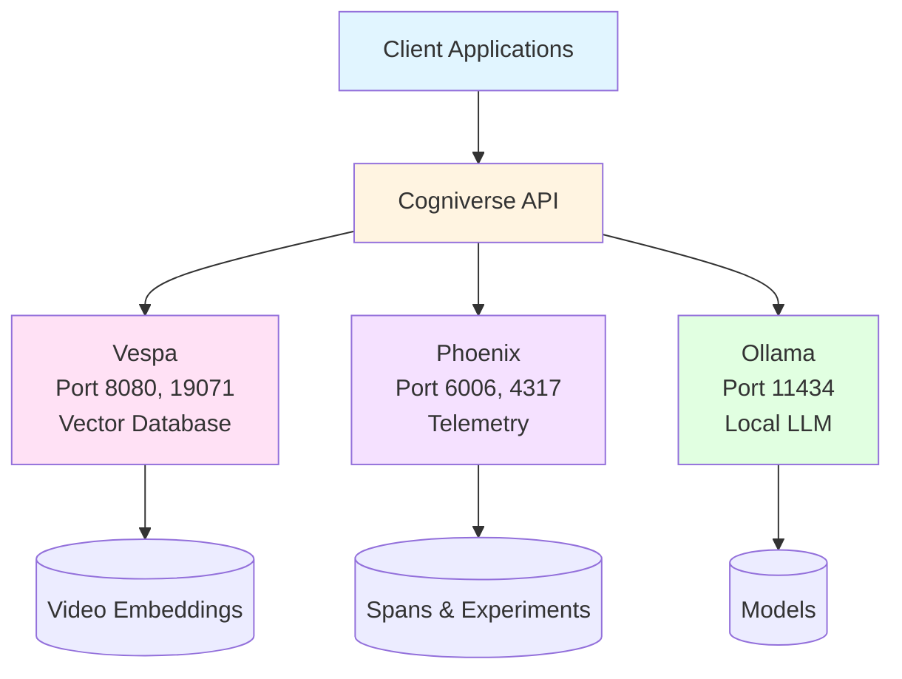

# Deployment Guide

**Last Updated:** 2025-10-08
**Purpose:** Deployment patterns for Cogniverse multi-agent system

---

## Overview

This guide covers verified, implemented deployment patterns:
- **Local Development**: Docker-based setup for development
- **Modal Serverless**: GPU-accelerated video processing
- **Multi-Tenant**: Schema deployment and isolation

### Core Services
- **Vespa**: Multi-tenant vector database (ports 8080, 19071)
- **Phoenix**: Telemetry and tracing (ports 6006, 4317)
- **Ollama**: Local LLM inference (port 11434)

---

## Service Architecture



---

## Local Development

### Quick Setup

```bash
# Clone repository
git clone <repo-url>
cd cogniverse

# Install dependencies
pip install uv
uv sync

# Start Vespa
docker run -d --name vespa \
  -p 8080:8080 -p 19071:19071 \
  -v vespa-data:/opt/vespa/var \
  vespaengine/vespa:latest

# Start Phoenix
docker run -d --name phoenix \
  -p 6006:6006 -p 4317:4317 \
  -v phoenix-data:/data \
  -e PHOENIX_WORKING_DIR=/data \
  arizephoenix/phoenix:latest

# Start Ollama
docker run -d --name ollama \
  -p 11434:11434 \
  -v ollama-data:/root/.ollama \
  ollama/ollama:latest

# Pull required Ollama models
docker exec ollama ollama pull llama3.2
docker exec ollama ollama pull nomic-embed-text

# Verify services
curl http://localhost:8080/ApplicationStatus  # Vespa
curl http://localhost:6006/health            # Phoenix
curl http://localhost:11434/api/tags         # Ollama
```

### Service Ports

| Service | Port | Protocol | Purpose |
|---------|------|----------|---------|
| **Vespa HTTP** | 8080 | HTTP | Document feed & search queries |
| **Vespa Config** | 19071 | HTTP | Schema deployment |
| **Phoenix** | 6006 | HTTP | Telemetry & experiments dashboard |
| **Phoenix Collector** | 4317 | gRPC | OTLP span collection |
| **Ollama** | 11434 | HTTP | LLM inference API |

### Environment Configuration

Create a `.env` file in the project root:

```bash
# Environment
ENVIRONMENT=development
LOG_LEVEL=DEBUG

# Telemetry
PHOENIX_ENABLED=true
PHOENIX_COLLECTOR_ENDPOINT=localhost:4317

# Vespa
VESPA_HOST=localhost
VESPA_PORT=8080

# Ollama
OLLAMA_BASE_URL=http://localhost:11434/v1

# JAX (for VideoPrism)
JAX_PLATFORM_NAME=cpu
```

---

## Docker Compose Deployment (Reference)

While not required, Docker Compose provides a convenient way to orchestrate all services together.

### Complete Stack

```yaml
# docker-compose.yml
version: '3.8'

services:
  vespa:
    image: vespaengine/vespa:latest
    ports:
      - "8080:8080"
      - "19071:19071"
    volumes:
      - vespa-data:/opt/vespa/var
    healthcheck:
      test: ["CMD", "curl", "-f", "http://localhost:8080/ApplicationStatus"]
      interval: 30s
      timeout: 10s
      retries: 3

  phoenix:
    image: arizephoenix/phoenix:latest
    ports:
      - "6006:6006"
      - "4317:4317"  # OTLP gRPC collector
    volumes:
      - phoenix-data:/data
    environment:
      - PHOENIX_WORKING_DIR=/data
    healthcheck:
      test: ["CMD", "curl", "-f", "http://localhost:6006/health"]
      interval: 30s
      timeout: 10s
      retries: 3

  ollama:
    image: ollama/ollama:latest
    ports:
      - "11434:11434"
    volumes:
      - ollama-data:/root/.ollama
    deploy:
      resources:
        reservations:
          devices:
            - driver: nvidia
              count: 1
              capabilities: [gpu]

  cogniverse:
    build: .
    ports:
      - "8000:8000"
    environment:
      - VESPA_HOST=vespa
      - VESPA_PORT=8080
      - PHOENIX_COLLECTOR_ENDPOINT=phoenix:4317
      - OLLAMA_BASE_URL=http://ollama:11434/v1
      - ENVIRONMENT=production
      - TELEMETRY_ENABLED=true
    depends_on:
      - vespa
      - phoenix
      - ollama
    volumes:
      - model-cache:/app/models
      - ./configs:/app/configs:ro

volumes:
  vespa-data:
  phoenix-data:
  ollama-data:
  model-cache:
```

### Deploy with Docker Compose

```bash
# Deploy stack
docker-compose up -d

# Pull Ollama models
docker-compose exec ollama ollama pull llama3.2
docker-compose exec ollama ollama pull nomic-embed-text

# View logs
docker-compose logs -f cogniverse

# Scale application
docker-compose up -d --scale cogniverse=3
```

---

## Modal Deployment (Serverless GPU)

Modal provides serverless GPU infrastructure for video processing. See [docs/modal/](../modal/) for detailed setup.

### Modal App Structure

```python
# scripts/modal_vlm_service.py
import modal

app = modal.App("cogniverse")

# GPU-optimized image with all dependencies
image = (
    modal.Image.debian_slim()
    .pip_install_from_requirements("requirements.txt")
    .run_commands(
        "apt-get update && apt-get install -y ffmpeg git",
        "huggingface-cli download vidore/colsmol-500m",
    )
)

# Video processing function with GPU
@app.function(
    image=image,
    gpu="A10G",  # 24GB VRAM
    memory=32768,  # 32GB RAM
    timeout=1800,  # 30 minutes
    secrets=[modal.Secret.from_name("cogniverse-secrets")],
    volumes={"/models": modal.Volume.from_name("model-cache")}
)
async def process_video(
    video_url: str,
    tenant_id: str,  # REQUIRED - no default
    profile: str = "video_colpali_smol500_mv_frame"
):
    """Process video with ColPali/VideoPrism on GPU

    Args:
        video_url: URL to video file
        tenant_id: Tenant ID in org:tenant format (e.g., "acme:production")
        profile: Embedding profile to use
    """
    from src.app.ingestion import VideoIngestionPipeline

    # Validate tenant_id
    if not tenant_id or ":" not in tenant_id:
        raise ValueError("tenant_id must be in org:tenant format")

    pipeline = VideoIngestionPipeline(profile=profile, tenant_id=tenant_id)
    result = await pipeline.process_video_from_url(video_url)

    return {
        "tenant_id": tenant_id,
        "video_id": result.video_id,
        "documents_created": len(result.documents),
        "processing_time_seconds": result.processing_time
    }

# Search endpoint (CPU-only, fast)
@app.function(
    image=image,
    memory=8192,
    timeout=30,
    secrets=[modal.Secret.from_name("cogniverse-secrets")]
)
async def search(
    query: str,
    tenant_id: str,  # REQUIRED - no default
    profile: str = "video_colpali_smol500_mv_frame",
    ranking_strategy: str = "hybrid_float_bm25",
    top_k: int = 10
):
    """Execute search with appropriate agent

    Args:
        query: Search query
        tenant_id: Tenant ID in org:tenant format (e.g., "acme:production")
        profile: Embedding profile to use
        ranking_strategy: Vespa ranking strategy
        top_k: Number of results to return
    """
    from src.app.agents.video_search_agent import VideoSearchAgent

    # Validate tenant_id
    if not tenant_id or ":" not in tenant_id:
        raise ValueError("tenant_id must be in org:tenant format")

    agent = VideoSearchAgent(profile=profile, tenant_id=tenant_id)
    results = await agent.search(
        query=query,
        ranking_strategy=ranking_strategy,
        top_k=top_k
    )

    return {
        "tenant_id": tenant_id,
        "results": [r.to_dict() for r in results],
        "count": len(results)
    }
```

### Deploy to Modal

```bash
# Deploy to Modal
modal deploy scripts/modal_vlm_service.py

# Test endpoints with tenant_id (REQUIRED)
modal run scripts/modal_vlm_service.py::search \
  --query "machine learning tutorial" \
  --tenant-id "acme:production"

modal run scripts/modal_vlm_service.py::process_video \
  --video-url "https://example.com/video.mp4" \
  --tenant-id "acme:production"
```

For detailed Modal setup, GPU recommendations, and deployment guides, see:
- [docs/modal/deployment_guide.md](../modal/deployment_guide.md)
- [docs/modal/gpu_recommendations.md](../modal/gpu_recommendations.md)
- [docs/modal/setup_modal_vlm.py](../modal/setup_modal_vlm.py)

---

## Multi-Tenant Architecture Deployment

Cogniverse implements schema-per-tenant architecture for complete data isolation. Each tenant receives dedicated Vespa schemas automatically.

### Tenant Management API Deployment

Deploy the tenant management REST API for organization and tenant lifecycle management:

```bash
# Start tenant management service
uvicorn src.admin.tenant_manager:app --port 8001 --reload

# Verify service
curl http://localhost:8001/health
```

**Tenant Management Endpoints**:
- `POST /organizations` - Create organization
- `POST /tenants` - Create tenant with automatic schema creation
- `GET /organizations` - List all organizations
- `GET /tenants` - List tenants (optionally by org)
- `DELETE /tenants/{tenant_id}` - Delete tenant and all data

### Tenant Lifecycle

**1. Create Organization**:
```bash
curl -X POST http://localhost:8001/organizations \
  -H "Content-Type: application/json" \
  -d '{
    "org_id": "acme",
    "description": "ACME Corporation"
  }'
```

**2. Create Tenant (Automatic Schema Deployment)**:
```bash
curl -X POST http://localhost:8001/tenants \
  -H "Content-Type: application/json" \
  -d '{
    "tenant_id": "acme:production",
    "description": "Production environment"
  }'
```

**This automatically**:
- Validates org:tenant format
- Creates tenant metadata
- Deploys tenant-specific Vespa schemas for all profiles
- Creates storage directories

**3. Verify Tenant Schemas**:
```bash
# List tenant schemas
curl http://localhost:8001/tenants/acme:production

# Response shows created schemas:
# - video_colpali_smol500_mv_frame_acme_production
# - video_videoprism_base_mv_chunk_30s_acme_production
# - etc.
```

### Schema Naming Convention

Tenant-specific schemas follow the pattern:
```
{profile}_{org}_{tenant}

Examples:
- video_colpali_smol500_mv_frame_acme_production
- video_videoprism_base_mv_chunk_30s_acme_staging
- video_colqwen_omni_mv_chunk_30s_initech_production
```

### Available Profiles

| Profile | Embedding Model | Modality | Dimensions |
|--------|----------------|----------|------------|
| **video_colpali_smol500_mv_frame** | ColPali SmolVLM 500M | Frame-based | 768 |
| **video_colqwen_omni_mv_chunk_30s** | ColQwen2 Omni | Chunk-based (30s) | 768 |
| **video_videoprism_base_mv_chunk_30s** | VideoPrism Base | Chunk-based (30s) | 768 |
| **video_videoprism_lvt_base_sv_chunk_6s** | VideoPrism LVT | Chunk-based (6s) | 1152 |

Each tenant automatically receives all profiles with dedicated schemas.

### Multi-Tenant Deployment Example

```bash
# 1. Start services
docker-compose up -d vespa phoenix

# 2. Start tenant management API
uvicorn src.admin.tenant_manager:app --port 8001 &

# 3. Create organizations
curl -X POST http://localhost:8001/organizations \
  -H "Content-Type: application/json" \
  -d '{"org_id": "acme", "description": "ACME Corp"}'

curl -X POST http://localhost:8001/organizations \
  -H "Content-Type: application/json" \
  -d '{"org_id": "initech", "description": "Initech Inc"}'

# 4. Create tenants (schemas deployed automatically)
curl -X POST http://localhost:8001/tenants \
  -H "Content-Type: application/json" \
  -d '{"tenant_id": "acme:production", "description": "ACME Production"}'

curl -X POST http://localhost:8001/tenants \
  -H "Content-Type: application/json" \
  -d '{"tenant_id": "acme:staging", "description": "ACME Staging"}'

curl -X POST http://localhost:8001/tenants \
  -H "Content-Type: application/json" \
  -d '{"tenant_id": "initech:production", "description": "Initech Production"}'

# 5. Verify tenants
curl http://localhost:8001/tenants
```

---

## Monitoring & Observability

### Phoenix Dashboard Access

```bash
# Access local Phoenix dashboard
open http://localhost:6006

# View tenant-specific traces
# Navigate to: cogniverse-{tenant_id}-video-search
```

### Phoenix Telemetry Integration

Phoenix telemetry is automatically enabled for:
- Query processing spans
- Agent routing decisions
- Vespa search operations
- Embedding generation
- Multi-modal reranking

All traces are organized by tenant ID for isolation.

---

## Troubleshooting

### Vespa Connection Issues

```bash
# Check Vespa health
curl http://localhost:8080/state/v1/health

# Restart Vespa
docker restart vespa

# Check logs
docker logs vespa
```

### Phoenix Not Recording Spans

```bash
# Check Phoenix is running
docker ps | grep phoenix

# Verify endpoint
echo $PHOENIX_COLLECTOR_ENDPOINT

# Check Phoenix logs
docker logs phoenix
```

### Ollama Model Issues

```bash
# List installed models
docker exec ollama ollama list

# Remove and re-pull model
docker exec ollama ollama rm llama3.2
docker exec ollama ollama pull llama3.2
```

---

## Related Documentation

- [Multi-Tenant Management](multi-tenant-management.md) - Complete tenant lifecycle and architecture guide
- [Setup & Installation](setup-installation.md) - Complete installation guide
- [Configuration](configuration.md) - Multi-tenant configuration management
- [Backends Module](../modules/backends.md) - TenantSchemaManager and tenant-aware search
- [Agents Module](../modules/agents.md) - Tenant-aware agent initialization
- [Performance & Monitoring](performance-monitoring.md) - Performance targets and monitoring
- [Modal Deployment](../modal/deployment_guide.md) - Serverless GPU deployment
