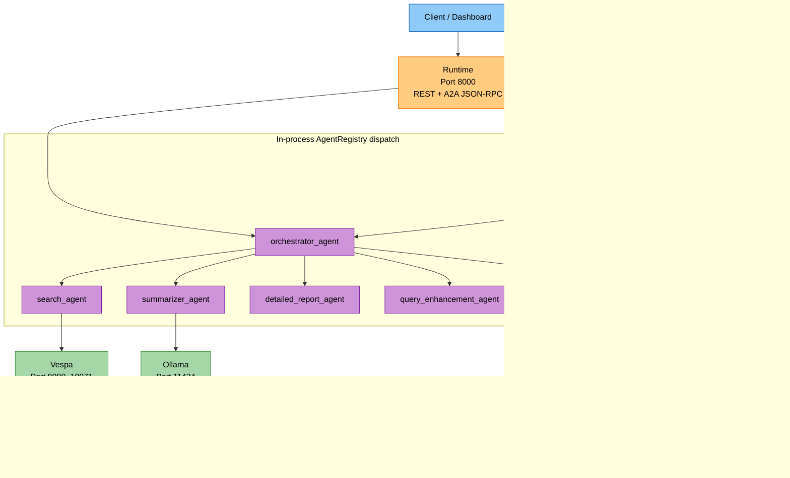

# Deployment Guide

---

## Overview

This guide covers verified, implemented deployment patterns:

- **Local Development**: Docker-based setup for development

- **Modal Serverless**: GPU-accelerated VLM frame description generation

- **Multi-Tenant**: Schema deployment and isolation

### Core Services
- **Vespa**: Multi-tenant vector database (ports 8080, 19071)
- **Phoenix**: Telemetry dashboard + OTLP collector (ports 6006, 4317)
- **Ollama**: Local LLM inference (port 11434)

### Runtime and Agents
The deployed system runs a single **Runtime** process (port 8000) that
exposes REST + an in-process A2A JSON-RPC server (`/a2a`). Agent
implementations (`orchestrator_agent`, `gateway_agent`, `search_agent`,
`summarizer_agent`, `detailed_report_agent`, `entity_extraction_agent`,
`query_enhancement_agent`, and others) are DSPy-based classes registered
with an in-process `AgentRegistry` and dispatched directly by the
Runtime — they are not separate deployments or A2A services on their
own ports. `gateway_agent` and `orchestrator_agent` together form the
routing entry point that plans and hands off to the specialized agents.

`search_agent.py`, `summarizer_agent.py`, and `detailed_report_agent.py`
each have a `--port` CLI default for running that one agent standalone
during development (8002, 8003, 8004 respectively) — this is not how
the chart deploys the system. Other agent classes (`orchestrator_agent`,
`gateway_agent`, `entity_extraction_agent`, `query_enhancement_agent`,
`profile_selection_agent`) have no standalone entry point at all; their
constructor `port` parameter is agent-config metadata used by the A2A
card, not a way to launch them as their own server.

---

## Service Architecture


```mermaid
flowchart TB
    Client["<span style='color:#000'>Client / Dashboard</span>"]

    Client --> Runtime["<span style='color:#000'>Runtime<br/>Port 8000<br/>REST + A2A JSON-RPC</span>"]

    subgraph Registry["<span style='color:#000'>In-process AgentRegistry dispatch</span>"]
      Gateway["<span style='color:#000'>gateway_agent</span>"]
      Orchestrator["<span style='color:#000'>orchestrator_agent</span>"]
      Search["<span style='color:#000'>search_agent</span>"]
      Summarizer["<span style='color:#000'>summarizer_agent</span>"]
      DetailedReport["<span style='color:#000'>detailed_report_agent</span>"]
      QueryEnh["<span style='color:#000'>query_enhancement_agent</span>"]
      EntityExt["<span style='color:#000'>entity_extraction_agent</span>"]
    end

    Runtime --> Gateway
    Runtime --> Orchestrator
    Gateway --> Orchestrator
    Orchestrator --> Search
    Orchestrator --> Summarizer
    Orchestrator --> DetailedReport
    Orchestrator --> QueryEnh
    Orchestrator --> EntityExt

    Search --> Vespa["<span style='color:#000'>Vespa<br/>Port 8080, 19071<br/>Vector Database</span>"]
    Runtime -.-> Phoenix["<span style='color:#000'>Phoenix<br/>Port 6006, 4317<br/>Telemetry</span>"]
    Summarizer --> Ollama["<span style='color:#000'>Ollama<br/>Port 11434<br/>Local LLM</span>"]

    Vespa --> VespaData[("<span style='color:#000'>Video Embeddings</span>")]
    Phoenix --> PhoenixData[("<span style='color:#000'>Experiments</span>")]
    Ollama --> OllamaData[("<span style='color:#000'>Models</span>")]

    style Client fill:#90caf9,stroke:#1565c0,color:#000
    style Runtime fill:#ffcc80,stroke:#ef6c00,color:#000
    style Gateway fill:#ce93d8,stroke:#7b1fa2,color:#000
    style Orchestrator fill:#ce93d8,stroke:#7b1fa2,color:#000
    style Search fill:#ce93d8,stroke:#7b1fa2,color:#000
    style Summarizer fill:#ce93d8,stroke:#7b1fa2,color:#000
    style DetailedReport fill:#ce93d8,stroke:#7b1fa2,color:#000
    style QueryEnh fill:#ce93d8,stroke:#7b1fa2,color:#000
    style EntityExt fill:#ce93d8,stroke:#7b1fa2,color:#000
    style Vespa fill:#a5d6a7,stroke:#388e3c,color:#000
    style Phoenix fill:#a5d6a7,stroke:#388e3c,color:#000
    style Ollama fill:#a5d6a7,stroke:#388e3c,color:#000
    style VespaData fill:#b0bec5,stroke:#546e7a,color:#000
    style PhoenixData fill:#b0bec5,stroke:#546e7a,color:#000
    style OllamaData fill:#b0bec5,stroke:#546e7a,color:#000
```

---

## Local Development

### Quick Setup

```bash
# Clone repository
git clone <repo-url>
cd cogniverse

# Install dependencies
pip install uv
uv sync

# Start Vespa
docker run -d --name vespa \
  -p 8080:8080 -p 19071:19071 \
  -v vespa-data:/opt/vespa/var \
  vespaengine/vespa:latest

# Start Phoenix
docker run -d --name phoenix \
  -p 6006:6006 -p 4317:4317 \
  -v phoenix-data:/data \
  -e PHOENIX_WORKING_DIR=/data \
  arizephoenix/phoenix:latest

# Start Ollama
docker run -d --name ollama \
  -p 11434:11434 \
  -v ollama-data:/root/.ollama \
  ollama/ollama:latest

# Pull required Ollama models
docker exec ollama ollama pull gemma3:4b

# Verify services
curl http://localhost:8080/ApplicationStatus  # Vespa
curl http://localhost:6006/health            # Phoenix
curl http://localhost:11434/api/tags         # Ollama
```

### Service Ports

| Service | Port | Protocol | Purpose |
|---------|------|----------|---------|
| **Vespa HTTP** | 8080 | HTTP | Document feed & search queries |
| **Vespa Config** | 19071 | HTTP | Schema deployment |
| **Phoenix** | 6006 | HTTP | Telemetry & experiments dashboard |
| **Phoenix OTLP** | 4317 | gRPC | OTLP span collection (served by Phoenix) |
| **Ollama** | 11434 | HTTP | LLM inference API |
| **Runtime** | 8000 | HTTP | REST API + in-process A2A JSON-RPC entry point |

The agents dispatched by the Runtime (`orchestrator_agent`,
`gateway_agent`, `search_agent`, `summarizer_agent`,
`detailed_report_agent`, `entity_extraction_agent`,
`query_enhancement_agent`, `profile_selection_agent`, and others) do not
have their own ports in a deployed cluster. Only `search_agent.py`,
`summarizer_agent.py`, and `detailed_report_agent.py` define a
standalone-only `--port` CLI default for running that one agent on its
own during development (8002, 8003, and 8004 respectively). The other
agent classes have no standalone entry point — `orchestrator_agent`'s
constructor defaults `port=8013`, `gateway_agent`'s `port=8014`,
`entity_extraction_agent`'s `port=8010`, `profile_selection_agent`'s
`port=8011`, and `query_enhancement_agent`'s `port=8012`, but these are
only agent-config metadata (used to build the A2A card), not a way to
run the agent as its own server.

### Environment Configuration

Create a `.env` file in the workspace root:

```bash
# Environment (read by evaluation storage)
ENVIRONMENT=development

# Backend (read by BootstrapConfig — REQUIRED)
BACKEND_URL=http://localhost
BACKEND_PORT=8080

# JAX (for VideoPrism models)
JAX_PLATFORM_NAME=cpu

# Config file path (optional — defaults to configs/config.json)
# COGNIVERSE_CONFIG=/path/to/config.json

# Tenant ID is per-request (not an env var)
# Agents receive tenant_id in each A2A task payload
```

---

## Deployment Options

Cogniverse supports multiple deployment methods depending on your needs:

### Unified Deployment (k3d/Helm)

```bash
# Start all services (Vespa, Phoenix, Ollama, Runtime, Dashboard)
cogniverse up

# Check status
cogniverse status
```

**See detailed guides:**

- [Kubernetes Deployment Guide](kubernetes-deployment.md) - K8s/K3s/Helm deployment

- [Istio Service Mesh Guide](istio-service-mesh.md) - Service mesh with mTLS, Phoenix tracing, DNS-based multi-cluster

- [Argo Workflows Guide](argo-workflows.md) - Batch processing workflows

---

## Modal Deployment (Serverless GPU)

Modal provides serverless GPU infrastructure for VLM-based video frame description generation. See [docs/modal/deployment_guide.md](../modal/deployment_guide.md) for detailed setup.

### Modal App Structure

The actual Modal service (`scripts/modal_vlm_service.py`) provides VLM description generation using Qwen3-VL-8B-Instruct:

```python
# scripts/modal_vlm_service.py (simplified overview)
import modal

app = modal.App("cogniverse-vlm")

# GPU-optimized image with SGLang and Qwen3-VL-8B model
image = (
    modal.Image.from_registry(f"nvidia/cuda:{tag}", add_python="3.11")
    .pip_install(
        "transformers>=4.52.0",
        "sglang[all]==0.5.13",
        # ... other dependencies
    )
    .run_function(download_model, volumes=volumes)
)

@app.cls(
    gpu="h100:1",
    timeout=180 * 60,  # 3 hours
    image=image,
    volumes=volumes,
)
@modal.concurrent(max_inputs=50)
class VLMModel:
    @modal.enter()
    def start_runtime(self):
        """Starts SGLang runtime for VLM inference."""
        import sglang as sgl
        self.runtime = sgl.Runtime(
            model_path="Qwen/Qwen3-VL-8B-Instruct",
            tokenizer_path="Qwen/Qwen3-VL-8B-Instruct",
            tp_size=GPU_COUNT,
            log_level=SGL_LOG_LEVEL,
        )
        sgl.set_default_backend(self.runtime)

    @modal.fastapi_endpoint(method="POST", docs=True)
    def generate_description(self, request: dict) -> dict:
        """
        Generate description for a video frame.

        Args:
            request: {
                "frame_base64": "base64 encoded frame data",
                "frame_path": "optional local path",
                "remote_frame_path": "optional remote path",
                "prompt": "optional custom prompt"
            }

        Returns:
            {"description": "generated text", "duration_seconds": 1.23}
        """
        # Frame description generation using SGLang
        # See actual implementation in scripts/modal_vlm_service.py

    @modal.fastapi_endpoint(method="POST", docs=True)
    def upload_and_process_frames(self, request: dict) -> dict:
        """
        Upload zip of frames and process them all in batch.

        Args:
            request: {
                "zip_data": "base64 encoded zip",
                "frame_mapping": {filename: frame_key}
            }

        Returns:
            {"descriptions": {frame_key: description}, "processed_frames": N}
        """
        # Batch frame processing
        # See actual implementation in scripts/modal_vlm_service.py
```

**Note:** The Modal service provides VLM description generation for video frames. For full video processing pipelines (keyframe extraction, transcription, embeddings, ingestion), use the local pipeline with `scripts/run_ingestion.py`.

### Deploy to Modal

```bash
# Deploy to Modal
modal deploy scripts/modal_vlm_service.py

# Test VLM description generation with a local frame
modal run scripts/modal_vlm_service.py::test_vlm --frame-path /path/to/frame.jpg

# Production usage: Call the FastAPI endpoints
# - VLMModel.generate_description (POST) - Single frame description
# - VLMModel.upload_and_process_frames (POST) - Batch processing
```

For detailed Modal setup, GPU recommendations, and deployment guides, see:

- [docs/modal/deployment_guide.md](../modal/deployment_guide.md) - Complete Modal deployment guide

- [docs/modal/gpu_recommendations.md](../modal/gpu_recommendations.md) - GPU selection and configuration

- [scripts/modal_vlm_service.py](../../scripts/modal_vlm_service.py) - Modal VLM service implementation

---

## Multi-Tenant Schema Deployment

Cogniverse supports multi-tenant deployment with per-tenant schema isolation.

### Schema Deployment (runtime admin API)

All production schema deployment goes through the runtime's admin API
so it funnels through ``SchemaRegistry.deploy_schema`` and the
``VespaBackend.deploy_schemas`` merge path (which discovers deployed
document types from the live cluster and refuses to silently drop
peer-tenant schemas). The in-cluster init job at
``charts/cogniverse/templates/init-jobs.yaml`` wires this up as a
post-install step that loops ``.Values.config.tenants`` ×
``.Values.initJobs.schemaDeployment.profiles``:

```bash
RUNTIME_URL="http://$HOST:$PORT"

# Register a tenant (creates tenant metadata records)
curl -sfX POST "$RUNTIME_URL/admin/tenants" \
  -H 'Content-Type: application/json' \
  -d '{"tenant_id": "acme:production"}'

# Deploy a profile's content schema for that tenant
curl -sfX POST "$RUNTIME_URL/admin/profiles/video_colpali_smol500_mv_frame/deploy" \
  -H 'Content-Type: application/json' \
  -d '{"tenant_id": "acme:production", "force": false}'
```

**Tenant-Aware Schema Deployment (programmatic path — what the admin
API calls internally)**:

```python
from cogniverse_foundation.config.utils import create_default_config_manager, get_config
from cogniverse_core.common.tenant_utils import SYSTEM_TENANT_ID
from cogniverse_core.registries.schema_registry import SchemaRegistry
from cogniverse_core.schemas.filesystem_loader import FilesystemSchemaLoader
from cogniverse_vespa.backend import VespaBackend
from pathlib import Path

# Initialize configuration (SYSTEM_TENANT_ID reads cluster-wide base config;
# per-tenant overrides merge in when a specific tenant is resolved later.)
config_manager = create_default_config_manager()
config = get_config(tenant_id=SYSTEM_TENANT_ID, config_manager=config_manager)

# Get the cluster-wide backend config that tenant overrides merge on top of.
backend_config = config_manager.get_backend_config(tenant_id=SYSTEM_TENANT_ID)

# Initialize schema loader
schemas_dir = Path("configs/schemas")
schema_loader = FilesystemSchemaLoader(schemas_dir)

# Initialize backend with all required parameters
# VespaBackend constructor requires:
#   backend_config: BackendConfig instance (REQUIRED)
#   schema_loader: SchemaLoader instance (REQUIRED)
#   config_manager: ConfigManager instance (REQUIRED)
backend = VespaBackend(
    backend_config=backend_config,
    schema_loader=schema_loader,
    config_manager=config_manager
)

# Initialize schema registry
registry = SchemaRegistry(
    config_manager=config_manager,
    backend=backend,
    schema_loader=schema_loader
)

# Deploy schemas for multiple real tenants. There is no "default" tenant
# in cogniverse — every tenant must have been registered via the admin
# API or created here programmatically.
tenants = ["acme_corp", "globex_inc"]

for tenant_id in tenants:
    # Get all video schemas (exclude metadata schemas)
    all_schemas = schema_loader.list_available_schemas()
    video_schemas = [
        s for s in all_schemas
        if s.startswith("video_") and not s.endswith("_metadata")
    ]

    for base_schema in video_schemas:
        # Deploy tenant-specific schema (name: {base_schema}_{tenant_id})
        tenant_schema_name = registry.deploy_schema(
            tenant_id=tenant_id,
            base_schema_name=base_schema,
            force=False
        )
        print(f"Deployed: {tenant_schema_name}")
```

### Deploy Schemas

```bash
# Production: loop tenant × profile against the runtime admin API
# (same pattern as the Helm init job):
RUNTIME_URL="http://localhost:8080"
for tenant in acme:production globex:staging; do
  curl -sfX POST "$RUNTIME_URL/admin/tenants" \
    -H 'Content-Type: application/json' \
    -d "{\"tenant_id\": \"$tenant\"}"
  for profile in video_colpali_smol500_mv_frame; do
    curl -sfX POST "$RUNTIME_URL/admin/profiles/$profile/deploy" \
      -H 'Content-Type: application/json' \
      -d "{\"tenant_id\": \"$tenant\"}"
  done
done

# Dev: single-schema JSON deploy from the filesystem
JAX_PLATFORM_NAME=cpu uv run python scripts/deploy_json_schema.py \
  configs/schemas/video_colpali_smol500_mv_frame_schema.json
```

**Note:** The runtime admin API is the production path and the only
route that preserves peer-tenant schemas through redeploys.
`deploy_json_schema.py` is kept for single-schema dev iteration.

### Available Schemas

The `configs/schemas/` directory contains multiple schema types:
- Video schemas: `video_*_schema.json` (for video search)
- Metadata schemas: `organization_metadata_schema.json`, `tenant_metadata_schema.json`, `config_metadata_schema.json`, `adapter_registry_schema.json`
- Other schemas: `agent_memories_schema.json`, `ranking_strategies.json`

The schema names inside the JSON files do not include the `_schema.json` suffix.

| Schema File | Schema Name (in JSON) | Embedding Model | Modality | Dimensions | Tenant Suffix |
|-------------|----------------------|----------------|----------|------------|---------------|
| `video_colpali_smol500_mv_frame_schema.json` | `video_colpali_smol500_mv_frame` | ColPali SmolVLM 500M | Frame-based | 320 per patch | `_<tenant_id>` |
| `video_colqwen_omni_mv_chunk_30s_schema.json` | `video_colqwen_omni_mv_chunk_30s` | ColQwen3 Omni | Chunk-based (30s) | 320 per patch | `_<tenant_id>` |
| `video_videoprism_base_mv_chunk_30s_schema.json` | `video_videoprism_base_mv_chunk_30s` | VideoPrism Base | Chunk-based (30s) | 768 per patch | `_<tenant_id>` |
| `video_videoprism_large_mv_chunk_30s_schema.json` | `video_videoprism_large_mv_chunk_30s` | VideoPrism Large | Chunk-based (30s) | 1024 per patch | `_<tenant_id>` |
| `video_videoprism_lvt_base_sv_chunk_6s_schema.json` | `video_videoprism_lvt_base_sv_chunk_6s` | VideoPrism LVT Base | Chunk-based (6s) | 768 | `_<tenant_id>` |
| `video_videoprism_lvt_large_sv_chunk_6s_schema.json` | `video_videoprism_lvt_large_sv_chunk_6s` | VideoPrism LVT Large | Chunk-based (6s) | 1024 | `_<tenant_id>` |

**Example:** For tenant `acme_corp`:

- `video_colpali_smol500_mv_frame_acme_corp`
- `video_colqwen_omni_mv_chunk_30s_acme_corp`
- `video_videoprism_base_mv_chunk_30s_acme_corp`
- `video_videoprism_large_mv_chunk_30s_acme_corp`
- `video_videoprism_lvt_base_sv_chunk_6s_acme_corp`
- `video_videoprism_lvt_large_sv_chunk_6s_acme_corp`

Each tenant gets completely isolated schemas with their own documents and indexes.

---

## Monitoring & Observability

### Phoenix Dashboard Access

```bash
# Access local Phoenix dashboard
open http://localhost:6006

# View tenant-specific traces (each tenant has isolated project)
# Projects:
#   - acme_corp_project
#   - globex_inc_project
#   - default_project
```

### Phoenix Telemetry Integration

Phoenix telemetry is automatically enabled with **per-tenant project isolation**:

**Tracked Spans (per tenant):**

- Query processing spans (tenant-specific)

- Agent routing decisions (tenant-isolated)

- Vespa search operations (tenant schema-specific)

- Embedding generation (tenant context)

- Multi-modal reranking (tenant metrics)

**Tenant Isolation:**

- Each tenant has its own Phoenix project

- No cross-tenant trace visibility

- Tenant-specific experiment tracking

- Isolated span datasets per tenant

**Example Span Attributes:**
```json
{
  "tenant_id": "acme_corp",
  "schema_name": "video_colpali_mv_frame_acme_corp",
  "phoenix_project": "acme_corp_project",
  "query": "machine learning tutorial",
  "agent_type": "VideoSearchAgent"
}
```

---

## Troubleshooting

### Vespa Connection Issues

```bash
# Check Vespa health
curl http://localhost:8080/state/v1/health

# Restart Vespa
docker restart vespa

# Check logs
docker logs vespa
```

### Phoenix Not Recording Spans

```bash
# Check Phoenix is running
docker ps | grep phoenix

# Verify OTLP endpoint is reachable (Phoenix serves OTLP on port 4317)
curl -s http://localhost:4317 || echo "Phoenix OTLP not reachable"

# Check Phoenix logs
docker logs phoenix
```

### Ollama Model Issues

```bash
# List installed models
docker exec ollama ollama list

# Remove and re-pull model
docker exec ollama ollama rm gemma3:4b
docker exec ollama ollama pull gemma3:4b
```

---

## SDK Package Deployment

### Building Distribution Packages

```bash
# Build all 13 SDK packages for distribution
for dir in libs/*/; do
  echo "Building $(basename $dir)..."
  (cd "$dir" && uv build)
done

# Packages created in dist/ directory (all 13 packages):
# Foundation Layer:
# - cogniverse-sdk-0.1.0-py3-none-any.whl
# - cogniverse-foundation-0.1.0-py3-none-any.whl
# Core Layer:
# - cogniverse-core-0.1.0-py3-none-any.whl
# - cogniverse-evaluation-0.1.0-py3-none-any.whl
# - cogniverse-telemetry-phoenix-0.1.0-py3-none-any.whl
# Implementation Layer:
# - cogniverse-agents-0.1.0-py3-none-any.whl
# - cogniverse-vespa-0.1.0-py3-none-any.whl
# - cogniverse-synthetic-0.1.0-py3-none-any.whl
# - cogniverse-finetuning-0.1.0-py3-none-any.whl
# Application Layer:
# - cogniverse-runtime-0.1.0-py3-none-any.whl
# - cogniverse-dashboard-0.1.0-py3-none-any.whl
# - cogniverse-cli-0.1.0-py3-none-any.whl
# - cogniverse-messaging-0.1.0-py3-none-any.whl
```

### Installing from Wheels

```bash
# Install core package only
pip install dist/cogniverse-core-0.1.0-py3-none-any.whl

# Install agents package (includes core dependency)
pip install dist/cogniverse-agents-0.1.0-py3-none-any.whl

# Install all packages
pip install dist/*.whl
```

### Publishing to PyPI (Optional)

```bash
# Build all packages
for dir in libs/*/; do
  (cd "$dir" && uv build)
done

# Publish to PyPI
for dir in libs/*/; do
  (cd "$dir" && uv publish)
done
```

---

## Related Documentation

- [Setup & Installation](setup-installation.md) - Complete installation guide for UV workspace
- [Configuration](configuration.md) - Multi-tenant configuration management
- [Multi-Tenant Operations](multi-tenant-ops.md) - Multi-tenant deployment patterns
- [Istio Service Mesh](istio-service-mesh.md) - Production service mesh with mTLS and Phoenix tracing
- [SDK Architecture](../architecture/sdk-architecture.md) - SDK package structure
- [Performance & Monitoring](performance-monitoring.md) - Performance targets and monitoring
- [Modal Deployment](../modal/deployment_guide.md) - Serverless GPU deployment
