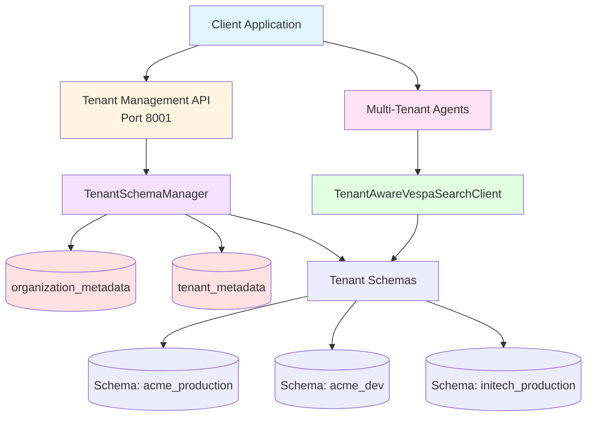
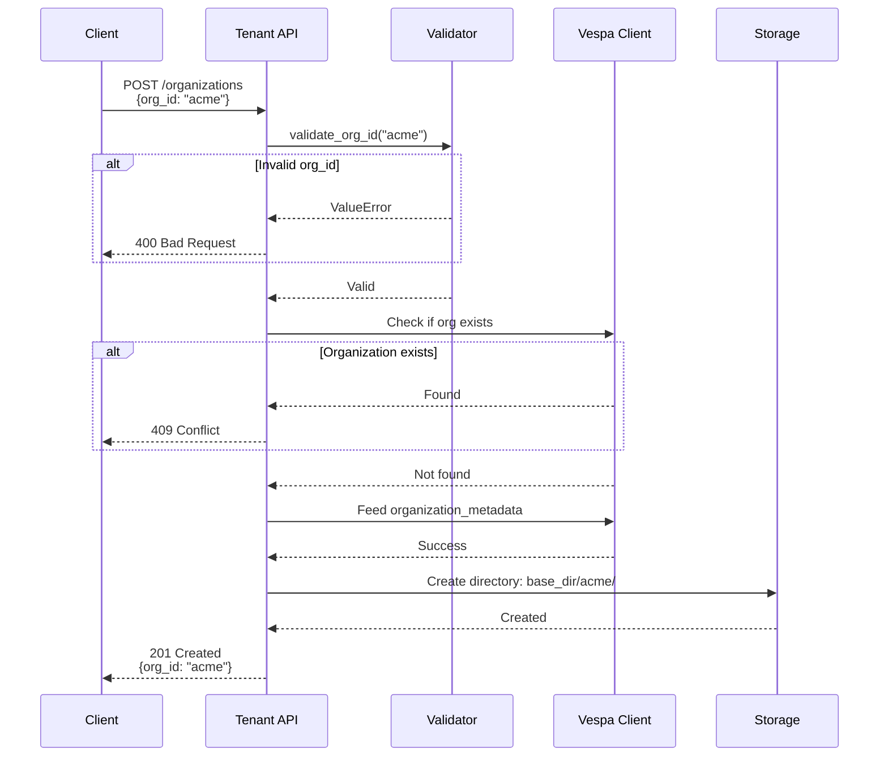
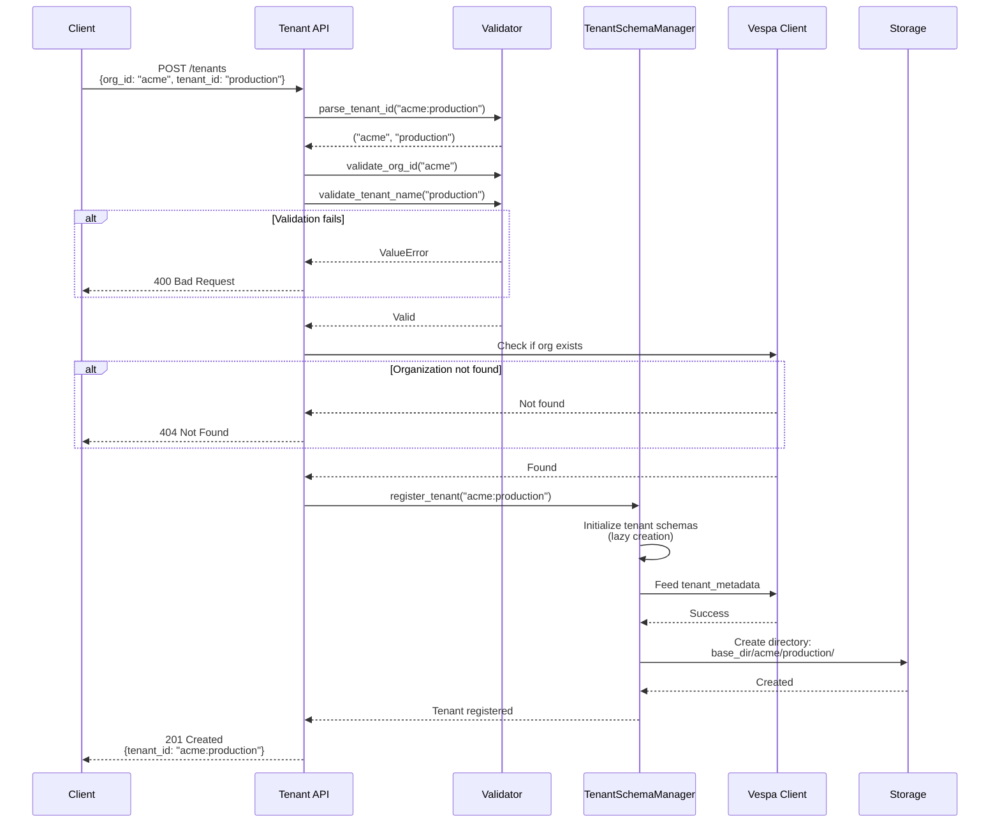
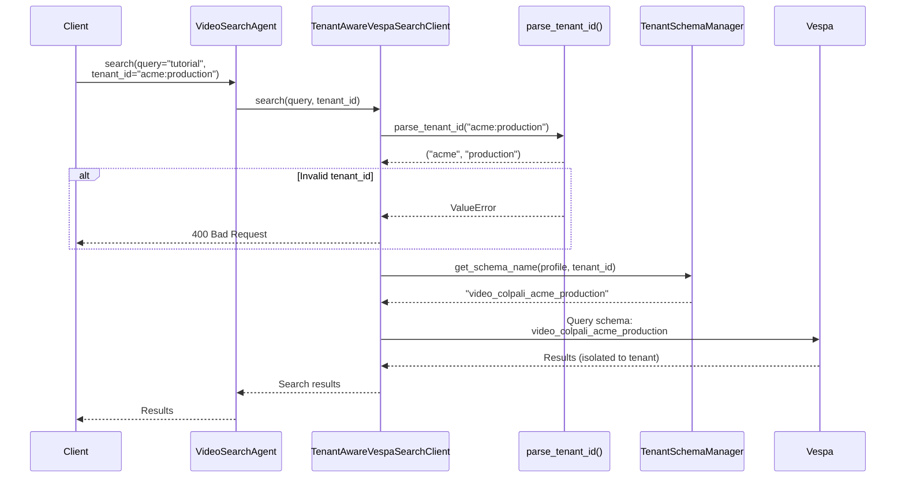
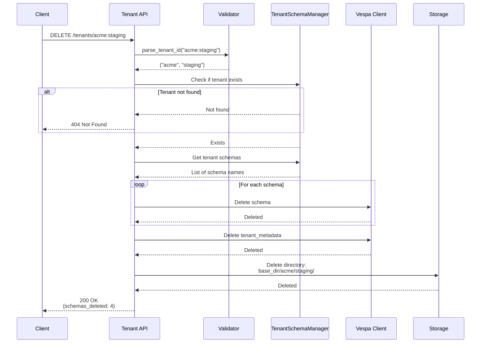

# Multi-Tenant Management Guide

**Last Updated:** 2026-01-25
**Architecture:** UV Workspace with 11 packages in layered architecture
**Purpose:** Comprehensive guide for multi-tenant architecture with schema-per-tenant isolation

---

## Overview

Cogniverse implements a **schema-per-tenant** multi-tenant architecture providing complete physical data isolation. Each tenant operates in a dedicated Vespa schema with isolated storage, preventing any cross-tenant data access.

### Key Features

- **Physical Isolation**: Schema-per-tenant architecture in Vespa
- **Organizational Hierarchy**: Organizations contain multiple tenants
- **Lazy Schema Creation**: Schemas created on first tenant access
- **REST API Management**: Complete tenant lifecycle via HTTP API
- **Automatic Routing**: Tenant-aware query routing in all agents
- **Storage Isolation**: Dedicated directories per tenant

### Architecture at a Glance



---

## Tenant Hierarchy

### Organization and Tenant Concepts

**Organization**: Top-level entity representing a company or business unit
- Examples: `acme`, `initech`, `hooli`
- Validation: Alphanumeric and underscore only (`^[a-zA-Z0-9_]+$`)
- Purpose: Group related tenants under common ownership

**Tenant**: Environment or deployment within an organization
- Examples: `production`, `staging`, `dev`, `customer-123`
- Validation: Alphanumeric, underscore, and hyphen (`^[a-zA-Z0-9_-]+$`)
- Purpose: Isolated data environment for specific use case

### Tenant ID Format

All tenant operations use the **org:tenant** format:

```
{organization}:{tenant_name}

Examples:
- acme:production
- acme:staging
- acme:dev
- initech:production
- hooli:customer_123
```

**Parsing Rules**:
- Colon `:` separates organization from tenant name
- Exactly one colon required
- Both parts must pass validation
- Case-sensitive (lowercase recommended)

### Validation Rules

| Component | Pattern | Valid Examples | Invalid Examples |
|-----------|---------|----------------|------------------|
| **Organization** | `^[a-zA-Z0-9_]+$` | `acme`, `org_123`, `ACME` | `acme-corp`, `acme.com`, `acme corp` |
| **Tenant Name** | `^[a-zA-Z0-9_-]+$` | `production`, `dev-2024`, `cust_1` | `prod.env`, `staging:v2`, `test env` |

**Common Validation Errors**:
- ❌ `acme-corp:production` - Hyphen not allowed in organization
- ❌ `acme:prod.env` - Dot not allowed in tenant name
- ❌ `acme:prod env` - Space not allowed
- ❌ `acme::production` - Empty component
- ❌ `production` - Missing organization prefix
- ✅ `acme:production` - Valid format

### Storage Structure

Tenants are organized in a hierarchical directory structure:

```
base_dir/
├── acme/                      # Organization
│   ├── production/            # Tenant
│   │   ├── videos/
│   │   ├── embeddings/
│   │   └── metadata/
│   ├── staging/               # Tenant
│   └── dev/                   # Tenant
├── initech/                   # Organization
│   └── production/            # Tenant
└── hooli/                     # Organization
    ├── production/            # Tenant
    └── customer_123/          # Tenant
```

---

## Tenant Management REST API

The tenant management service (`src/admin/tenant_manager.py`) provides a complete REST API for organization and tenant lifecycle management.

### API Endpoints

| Method | Endpoint | Purpose | Authentication |
|--------|----------|---------|----------------|
| POST | `/organizations` | Create organization | Not implemented |
| POST | `/tenants` | Create tenant | Not implemented |
| GET | `/organizations` | List all organizations | Not implemented |
| GET | `/tenants` | List tenants (optionally filtered by org) | Not implemented |
| DELETE | `/tenants/{tenant_id}` | Delete tenant and all data | Not implemented |

### Create Organization

Creates a new organization and initializes metadata storage.

**Request**:
```bash
curl -X POST http://localhost:8001/organizations \
  -H "Content-Type: application/json" \
  -d '{
    "org_id": "acme",
    "description": "ACME Corporation",
    "metadata": {
      "industry": "manufacturing",
      "region": "us-west"
    }
  }'
```

**Response** (201 Created):
```json
{
  "status": "success",
  "org_id": "acme",
  "message": "Organization 'acme' created successfully",
  "created_at": "2025-10-09T10:30:00Z"
}
```

**Validation**:
- `org_id` must match `^[a-zA-Z0-9_]+$`
- `org_id` cannot be empty
- Organization must not already exist

### Create Tenant

Creates a new tenant within an organization, initializes storage, and creates Vespa schemas.

**Request**:
```bash
curl -X POST http://localhost:8001/tenants \
  -H "Content-Type: application/json" \
  -d '{
    "org_id": "acme",
    "tenant_id": "production",
    "description": "Production environment",
    "metadata": {
      "environment": "production",
      "region": "us-west-2"
    }
  }'
```

**Alternate Format** (full tenant_id):
```bash
curl -X POST http://localhost:8001/tenants \
  -H "Content-Type: application/json" \
  -d '{
    "tenant_id": "acme:production",
    "description": "Production environment"
  }'
```

**Response** (201 Created):
```json
{
  "status": "success",
  "tenant_id": "acme:production",
  "org_id": "acme",
  "tenant_name": "production",
  "message": "Tenant 'acme:production' created successfully",
  "schemas_initialized": true,
  "created_at": "2025-10-09T10:35:00Z"
}
```

**Validation**:
- Organization must exist before creating tenant
- `tenant_id` must match `^[a-zA-Z0-9_-]+$` (if using org_id + tenant_id format)
- Full `tenant_id` must be valid org:tenant format
- Tenant must not already exist in organization

### List Organizations

Retrieves all organizations in the system.

**Request**:
```bash
curl http://localhost:8001/organizations
```

**Response** (200 OK):
```json
{
  "status": "success",
  "organizations": [
    {
      "org_id": "acme",
      "description": "ACME Corporation",
      "tenant_count": 3,
      "created_at": "2025-10-09T10:30:00Z"
    },
    {
      "org_id": "initech",
      "description": "Initech Inc",
      "tenant_count": 1,
      "created_at": "2025-10-09T11:00:00Z"
    }
  ],
  "total": 2
}
```

### List Tenants

Retrieves all tenants, optionally filtered by organization.

**Request** (all tenants):
```bash
curl http://localhost:8001/tenants
```

**Request** (filter by org):
```bash
curl http://localhost:8001/tenants?org_id=acme
```

**Response** (200 OK):
```json
{
  "status": "success",
  "tenants": [
    {
      "tenant_id": "acme:production",
      "org_id": "acme",
      "tenant_name": "production",
      "description": "Production environment",
      "schema_count": 4,
      "created_at": "2025-10-09T10:35:00Z"
    },
    {
      "tenant_id": "acme:staging",
      "org_id": "acme",
      "tenant_name": "staging",
      "description": "Staging environment",
      "schema_count": 4,
      "created_at": "2025-10-09T10:36:00Z"
    }
  ],
  "total": 2
}
```

### Delete Tenant

Deletes a tenant and all associated data (schemas, documents, storage).

**Request**:
```bash
curl -X DELETE http://localhost:8001/tenants/acme:staging
```

**Response** (200 OK):
```json
{
  "status": "success",
  "tenant_id": "acme:staging",
  "message": "Tenant 'acme:staging' deleted successfully",
  "schemas_deleted": 4,
  "documents_deleted": 1523,
  "deleted_at": "2025-10-09T12:00:00Z"
}
```

**Warning**: This operation is **irreversible**. All tenant data is permanently deleted.

### Error Responses

All endpoints return consistent error responses:

**400 Bad Request** (validation failure):
```json
{
  "status": "error",
  "error": "Invalid org_id: only alphanumeric and underscore characters allowed",
  "code": "VALIDATION_ERROR"
}
```

**404 Not Found** (resource doesn't exist):
```json
{
  "status": "error",
  "error": "Organization 'acme' not found",
  "code": "NOT_FOUND"
}
```

**409 Conflict** (resource already exists):
```json
{
  "status": "error",
  "error": "Organization 'acme' already exists",
  "code": "ALREADY_EXISTS"
}
```

---

## Tenant Lifecycle Flows

### Create Organization Flow



### Create Tenant Flow



### Query with Tenant Routing Flow



### Delete Tenant Flow



---

## Core Components

### TenantSchemaManager

**Location**: `libs/vespa/cogniverse_vespa/schema/` (implementation layer)

**Purpose**: Manages the lifecycle of tenant-specific Vespa schemas with lazy creation and automatic tenant isolation.

**Key Responsibilities**:
- Lazy schema creation on first tenant access
- Tenant registration and validation
- Schema naming with tenant isolation
- Metadata schema management (organization_metadata, tenant_metadata)

**Schema Naming Convention**:
```
{profile}_{org}_{tenant}

Examples:
- video_colpali_smol500_mv_frame_acme_production
- video_videoprism_base_mv_chunk_30s_initech_staging
```

**Usage**:
```python
from cogniverse_vespa.schema.json_schema_parser import JSONSchemaParser  # Implementation layer

# Initialize schema parser
schema_parser = JSONSchemaParser()

# Register tenant (creates schemas lazily)
schema_manager.register_tenant("acme:production")

# Get schema name for profile and tenant
schema_name = schema_manager.get_schema_name(
    profile="video_colpali_smol500_mv_frame",
    tenant_id="acme:production"
)
# Returns: "video_colpali_smol500_mv_frame_acme_production"
```

### TenantAwareVespaSearchClient

**Location**: `libs/vespa/cogniverse_vespa/backends/` (implementation layer)

**Purpose**: Automatic tenant-aware query routing ensuring all search operations are isolated to the correct tenant schema.

**Key Responsibilities**:
- Parse and validate tenant_id from requests
- Route queries to tenant-specific schemas
- Prevent cross-tenant data access
- Handle tenant-not-found errors

**Usage**:
```python
from cogniverse_vespa.backends.vespa_search_client import VespaSearchClient  # Implementation layer

# Initialize client with tenant awareness
search_client = VespaSearchClient(
    vespa_url="http://localhost",
    vespa_port=8080,
    tenant_id="acme:production"
)

# Search with tenant isolation
results = search_client.search(
    query="machine learning tutorial",
    tenant_id="acme:production",
    ranking_strategy="hybrid_float_bm25",
    top_k=10
)
# Automatically routes to: video_colpali_smol500_mv_frame_acme_production
```

### parse_tenant_id() Utility

**Location**: `libs/core/cogniverse_core/utils/tenant_utils.py` (core layer)

**Purpose**: Parse and validate org:tenant format.

**Signature**:
```python
def parse_tenant_id(tenant_id: str) -> tuple[str, str]:
    """
    Parse tenant_id in org:tenant format.

    Args:
        tenant_id: Full tenant identifier (e.g., "acme:production")

    Returns:
        Tuple of (org_id, tenant_name)

    Raises:
        ValueError: If tenant_id is invalid or doesn't contain exactly one colon
    """
```

**Usage**:
```python
from cogniverse_core.utils.tenant_utils import parse_tenant_id  # Core layer

# Parse tenant ID
org_id, tenant_name = parse_tenant_id("acme:production")
# Returns: ("acme", "production")

# Validation errors
parse_tenant_id("invalid")  # ValueError: must contain org:tenant format
parse_tenant_id("a:b:c")    # ValueError: must contain exactly one colon
```

### Agent Factory Pattern

**Purpose**: Per-tenant agent instances with caching

All agents implement a factory function for tenant-aware instantiation:

```python
# Video Search Agent (implementation layer)
from cogniverse_agents.search.video_search_agent import VideoSearchAgent

agent = VideoSearchAgent(
    tenant_id="acme:production",
    profile="video_colpali_smol500_mv_frame"
)

# Routing Agent (implementation layer)
from cogniverse_agents.routing.routing_agent import RoutingAgent

agent = RoutingAgent(tenant_id="acme:production")
```

**Caching**: Agents are cached per tenant_id to avoid re-initialization overhead.

**Validation**: All agents raise `ValueError` if tenant_id is empty or None.

---

## Usage Examples

### Complete Tenant Setup

```bash
# 1. Create organization
curl -X POST http://localhost:8001/organizations \
  -H "Content-Type: application/json" \
  -d '{"org_id": "acme", "description": "ACME Corporation"}'

# 2. Create production tenant
curl -X POST http://localhost:8001/tenants \
  -H "Content-Type: application/json" \
  -d '{"tenant_id": "acme:production", "description": "Production environment"}'

# 3. Create staging tenant
curl -X POST http://localhost:8001/tenants \
  -H "Content-Type: application/json" \
  -d '{"tenant_id": "acme:staging", "description": "Staging environment"}'
```

### Video Ingestion with Tenant Isolation

```python
from cogniverse_agents.ingestion.pipeline import VideoIngestionPipeline  # Implementation layer

# Initialize pipeline for tenant
pipeline = VideoIngestionPipeline(
    profile="video_colpali_smol500_mv_frame",
    tenant_id="acme:production"
)

# Process video (automatically isolated to acme:production schema)
result = await pipeline.process_video(
    video_path="/path/to/video.mp4",
    video_id="tutorial_001"
)
```

### Video Search with Tenant Isolation

```python
from cogniverse_agents.search.video_search_agent import VideoSearchAgent  # Implementation layer

# Get tenant-specific agent
agent = VideoSearchAgent(
    tenant_id="acme:production",
    profile="video_colpali_smol500_mv_frame"
)

# Search (automatically isolated to acme:production)
results = await agent.search(
    query="machine learning tutorial",
    ranking_strategy="hybrid_float_bm25",
    top_k=10
)

# Results only from acme:production schema - no cross-tenant access
```

### List All Tenants for Organization

```bash
# List all tenants for "acme" organization
curl http://localhost:8001/tenants?org_id=acme

# Response shows: acme:production, acme:staging, acme:dev
```

### Delete Tenant

```bash
# Delete staging tenant and all data
curl -X DELETE http://localhost:8001/tenants/acme:staging

# Warning: This permanently deletes:
# - All Vespa schemas for this tenant
# - All documents in tenant schemas
# - All storage directories
# - Tenant metadata
```

---

## Security and Isolation Guarantees

### Physical Data Isolation

- **Schema-per-tenant**: Each tenant has dedicated Vespa schemas
- **No shared schemas**: Zero possibility of cross-tenant data leakage
- **Automatic routing**: TenantAwareVespaSearchClient enforces tenant boundaries
- **Validation at entry**: All API requests validate tenant_id before processing

### Storage Isolation

- **Separate directories**: Each tenant has isolated storage path
- **No shared files**: Video files, embeddings, metadata stored separately
- **Access control**: Directory structure prevents cross-tenant access

### Query Isolation

- **Tenant-specific schemas**: Queries only search tenant's schemas
- **No cross-tenant queries**: Impossible to query data from different tenant
- **Validated routing**: parse_tenant_id() validates before schema selection

### Metadata Isolation

- **organization_metadata**: Separate Vespa schema for organization data
- **tenant_metadata**: Separate Vespa schema for tenant data
- **No shared metadata**: Each tenant's metadata completely isolated

---

## Related Documentation

- [Deployment Guide](deployment.md) - Multi-tenant deployment procedures
- [Configuration Guide](configuration.md) - Multi-tenant configuration spanning foundation and core layers
- [Multi-Tenant Operations](multi-tenant-ops.md) - Day-to-day tenant operations
- [Architecture Documentation](../architecture/sdk-architecture.md) - 11-package layered architecture
