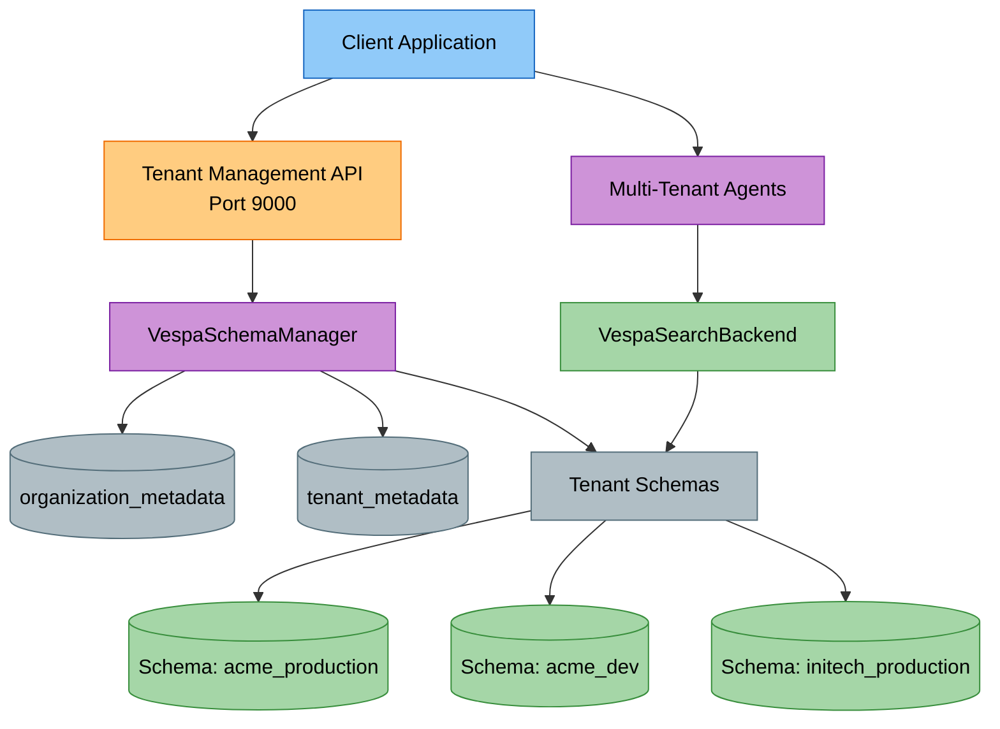
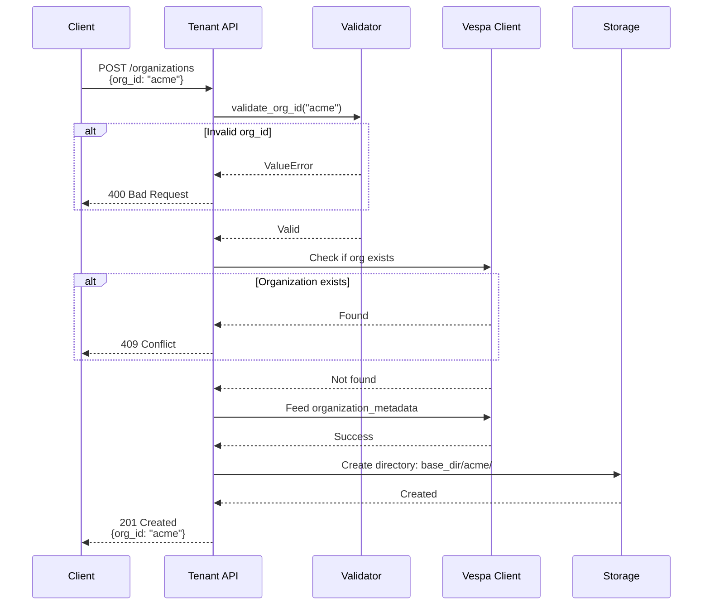
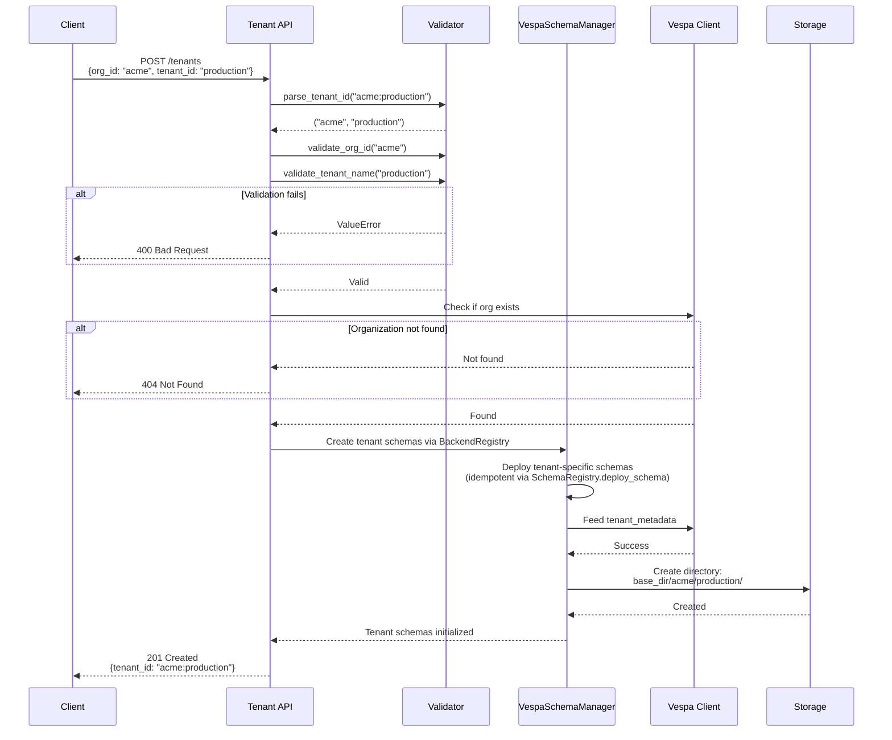
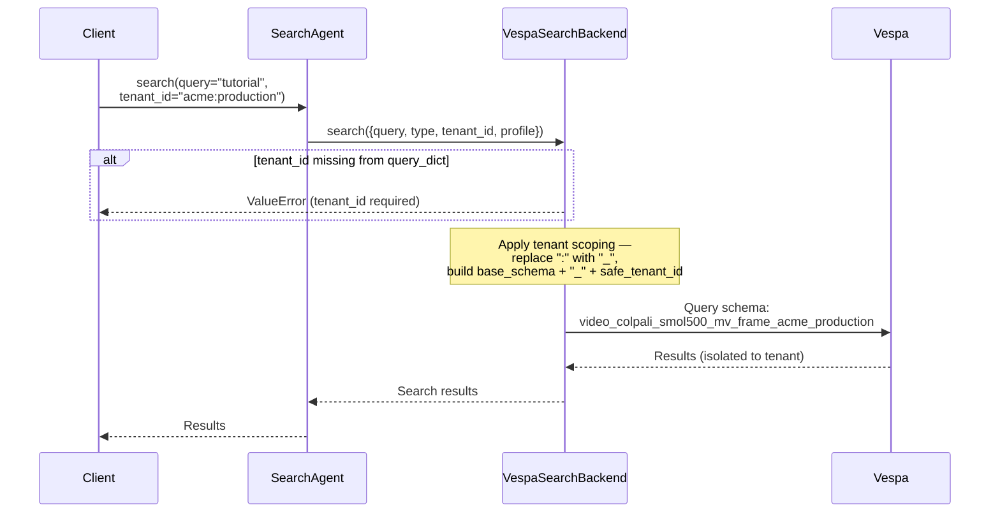
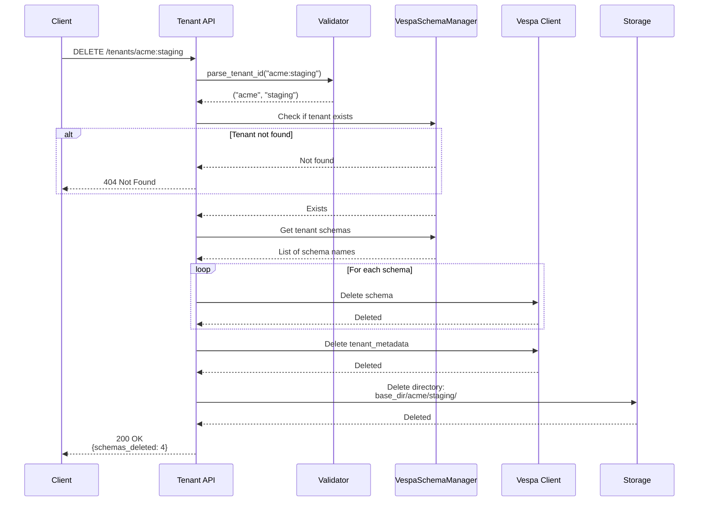
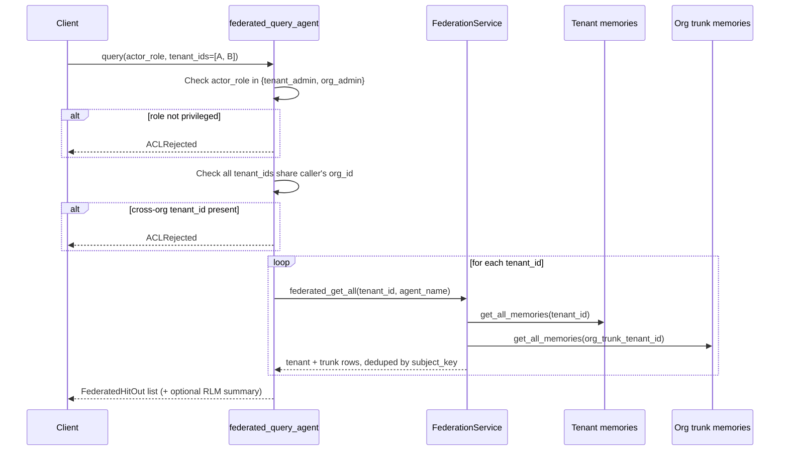

# Multi-Tenant Management Guide

---

## Overview

Cogniverse implements a **schema-per-tenant** multi-tenant architecture providing complete physical data isolation. Each tenant operates in a dedicated Vespa schema with isolated storage, preventing any cross-tenant data access.

### Key Features

- **Physical Isolation**: Schema-per-tenant architecture in Vespa
- **Organizational Hierarchy**: Organizations contain multiple tenants
- **Eager Primary-Schema Deployment**: `POST /admin/tenants` deploys the tenant's content schemas (e.g. `video_colpali_smol500_mv_frame`) immediately; auxiliary schemas such as `knowledge_graph` are instead deployed lazily on that tenant's first write (`libs/runtime/cogniverse_runtime/ingestion_worker/worker.py`)
- **REST API Management**: Complete tenant lifecycle via HTTP API
- **Automatic Routing**: Tenant-aware query routing in all agents
- **Storage Isolation**: Dedicated directories per tenant
- **Controlled Cross-Tenant Federation**: Org-trunk sharing and admin-gated, same-org federated reads (see [Cross-Tenant Federation](#cross-tenant-federation))

### Architecture at a Glance


```mermaid
flowchart TB
    Client["<span style='color:#000'>Client Application</span>"]

    Client --> TenantAPI["<span style='color:#000'>Tenant Management API<br/>Port 9000</span>"]
    Client --> Agents["<span style='color:#000'>Multi-Tenant Agents</span>"]

    TenantAPI --> TenantMgr["<span style='color:#000'>VespaSchemaManager</span>"]
    Agents --> TenantSearch["<span style='color:#000'>VespaSearchBackend</span>"]

    TenantMgr --> OrgMeta[("<span style='color:#000'>organization_metadata</span>")]
    TenantMgr --> TenantMeta[("<span style='color:#000'>tenant_metadata</span>")]
    TenantMgr --> Schemas["<span style='color:#000'>Tenant Schemas</span>"]

    TenantSearch --> Schemas

    Schemas --> AcmeProd[("<span style='color:#000'>Schema: acme_production</span>")]
    Schemas --> AcmeDev[("<span style='color:#000'>Schema: acme_dev</span>")]
    Schemas --> InitechProd[("<span style='color:#000'>Schema: initech_production</span>")]

    style Client fill:#90caf9,stroke:#1565c0,color:#000
    style TenantAPI fill:#ffcc80,stroke:#ef6c00,color:#000
    style Agents fill:#ce93d8,stroke:#7b1fa2,color:#000
    style TenantMgr fill:#ce93d8,stroke:#7b1fa2,color:#000
    style TenantSearch fill:#a5d6a7,stroke:#388e3c,color:#000
    style OrgMeta fill:#b0bec5,stroke:#546e7a,color:#000
    style TenantMeta fill:#b0bec5,stroke:#546e7a,color:#000
    style Schemas fill:#b0bec5,stroke:#546e7a,color:#000
    style AcmeProd fill:#a5d6a7,stroke:#388e3c,color:#000
    style AcmeDev fill:#a5d6a7,stroke:#388e3c,color:#000
    style InitechProd fill:#a5d6a7,stroke:#388e3c,color:#000
```

---

## Tenant Hierarchy

### Organization and Tenant Concepts

**Organization**: Top-level entity representing a company or business unit
- Examples: `acme`, `initech`, `hooli`
- Validation: Alphanumeric and underscore only (`^[a-zA-Z0-9_]+$`)
- Purpose: Group related tenants under common ownership

**Tenant**: Environment or deployment within an organization
- Examples: `production`, `staging`, `dev`, `customer_123`
- Validation: Alphanumeric and underscore only (`^[a-zA-Z0-9_]+$`) — no hyphens; the tenant name becomes part of the Vespa schema name, which only allows `[a-zA-Z0-9_]`
- Purpose: Isolated data environment for specific use case

### Tenant ID Format

All tenant operations use the **org:tenant** format:

```json
{organization}:{tenant_name}

Examples:
- acme:production
- acme:staging
- acme:dev
- initech:production
- hooli:customer_123
```

**Parsing Rules**:

- Colon `:` separates organization from tenant name
- Exactly one colon required
- Both parts must pass validation
- Case-sensitive (lowercase recommended)

### Validation Rules

| Component | Pattern | Valid Examples | Invalid Examples |
|-----------|---------|----------------|------------------|
| **Organization** | `^[a-zA-Z0-9_]+$` | `acme`, `org_123`, `ACME` | `acme-corp`, `acme.com`, `acme corp` |
| **Tenant Name** | `^[a-zA-Z0-9_]+$` | `production`, `dev_2024`, `cust_1` | `dev-2024`, `prod.env`, `staging:v2`, `test env` |

**Common Validation Errors**:

- ❌ `acme-corp:production` - Hyphen not allowed in organization
- ❌ `acme:dev-2024` - Hyphen not allowed in tenant name either (schema names only permit `[a-zA-Z0-9_]`)
- ❌ `acme:prod.env` - Dot not allowed in tenant name
- ❌ `acme:prod env` - Space not allowed
- ❌ `acme::production` - Empty component
- ❌ `production` - Missing organization prefix
- ✅ `acme:production` - Valid format

### Storage Structure

Tenants are organized in a hierarchical directory structure:

```text
base_dir/
├── acme/                      # Organization
│   ├── production/            # Tenant
│   │   ├── videos/
│   │   ├── embeddings/
│   │   └── metadata/
│   ├── staging/               # Tenant
│   └── dev/                   # Tenant
├── initech/                   # Organization
│   └── production/            # Tenant
└── hooli/                     # Organization
    ├── production/            # Tenant
    └── customer_123/          # Tenant
```

---

## Tenant Management REST API

The tenant management service (`libs/runtime/cogniverse_runtime/admin/tenant_manager.py`) provides a complete REST API for organization and tenant lifecycle management.

### API Endpoints

| Method | Endpoint | Purpose | Authentication |
|--------|----------|---------|----------------|
| POST | `/admin/organizations` | Create organization | None (open) |
| POST | `/admin/tenants` | Create tenant | None (open) |
| GET | `/admin/organizations` | List all organizations | None (open) |
| GET | `/admin/organizations/{org_id}` | Get organization details | None (open) |
| GET | `/admin/organizations/{org_id}/tenants` | List tenants for organization | None (open) |
| GET | `/admin/tenants/{tenant_full_id}` | Get tenant details. `tenant_full_id` accepts both simple form (`acme`, normalized to `acme:acme`) and colon form (`acme:production`). | None (open) |
| DELETE | `/admin/tenants/{tenant_full_id}` | Delete tenant and all data. Same canonicalization as GET. | None (open) |
| DELETE | `/admin/organizations/{org_id}` | Delete organization and all tenants | None (open) |
| POST | `/admin/reconcile-orphans?dry_run={true\|false}` | List Vespa-only schema orphans, optionally drop them all in one redeploy. See [Orphan reconciliation](../operations/multi-tenant-ops.md#orphan-reconciliation). | None (open) |

> `DELETE /admin/tenants/{id}` redeploys the Vespa application package
> without the tenant's schemas. If the redeploy would still leave an
> unresolved Vespa-only orphan (a schema with no registry record that it
> cannot confirm belongs to this tenant), it **refuses** with a
> `BackendDeploymentError` rather than dropping a peer tenant's data. Use
> `POST /admin/reconcile-orphans?dry_run=true` to audit orphans first,
> then `dry_run=false` naming the orphan tenants to clear them.

> Ingestion and graph endpoints (`/ingestion/upload`,
> `/ingestion/start`, `/graph/*`) require the tenant to be registered
> via `POST /admin/tenants` before they accept traffic. Calls with an
> unregistered `tenant_id` return 404 `Tenant '...' not registered`.

### Create Organization

Creates a new organization and initializes metadata storage.

**Request**:
```bash
curl -X POST http://localhost:9000/admin/organizations \
  -H "Content-Type: application/json" \
  -d '{
    "org_id": "acme",
    "org_name": "ACME Corporation",
    "created_by": "admin"
  }'
```

**Response** (201 Created):
```json
{
  "org_id": "acme",
  "org_name": "ACME Corporation",
  "created_at": 1728470000000,
  "created_by": "admin",
  "status": "active",
  "tenant_count": 0,
  "config": {}
}
```

**Validation**:

- `org_id` must match `^[a-zA-Z0-9_]+$`
- `org_id` cannot be empty
- Organization must not already exist

### Create Tenant

Creates a new tenant within an organization, initializes storage, and creates Vespa schemas.

**Request**:
```bash
curl -X POST http://localhost:9000/admin/tenants \
  -H "Content-Type: application/json" \
  -d '{
    "org_id": "acme",
    "tenant_id": "production",
    "created_by": "admin"
  }'
```

**Alternate Format** (full tenant_id):
```bash
curl -X POST http://localhost:9000/admin/tenants \
  -H "Content-Type: application/json" \
  -d '{
    "tenant_id": "acme:production",
    "created_by": "admin"
  }'
```

**Response** (201 Created):
```json
{
  "tenant_full_id": "acme:production",
  "org_id": "acme",
  "tenant_name": "production",
  "created_at": 1728470100000,
  "created_by": "admin",
  "status": "active",
  "schemas_deployed": ["video_colpali_smol500_mv_frame"]
}
```

**Validation**:

- Organization must exist before creating tenant
- `tenant_id` must match `^[a-zA-Z0-9_]+$` (if using org_id + tenant_id format; no hyphens)
- Full `tenant_id` must be valid org:tenant format
- Tenant must not already exist in organization

### List Organizations

Retrieves all organizations in the system.

**Request**:
```bash
curl http://localhost:9000/admin/organizations
```

**Response** (200 OK):
```json
{
  "organizations": [
    {
      "org_id": "acme",
      "org_name": "ACME Corporation",
      "created_at": 1728470000000,
      "created_by": "admin",
      "status": "active",
      "tenant_count": 3
    },
    {
      "org_id": "initech",
      "org_name": "Initech Inc",
      "created_at": 1728471800000,
      "created_by": "admin",
      "status": "active",
      "tenant_count": 1
    }
  ],
  "total_count": 2
}
```

### List Tenants

Retrieves all tenants, optionally filtered by organization.

**Request** (list tenants for org):
```bash
curl http://localhost:9000/admin/organizations/acme/tenants
```

**Response** (200 OK):
```json
{
  "tenants": [
    {
      "tenant_full_id": "acme:production",
      "org_id": "acme",
      "tenant_name": "production",
      "created_at": 1728470100000,
      "created_by": "admin",
      "status": "active",
      "schemas_deployed": ["video_colpali_smol500_mv_frame"]
    },
    {
      "tenant_full_id": "acme:staging",
      "org_id": "acme",
      "tenant_name": "staging",
      "created_at": 1728470160000,
      "created_by": "admin",
      "status": "active",
      "schemas_deployed": ["video_colpali_smol500_mv_frame"]
    }
  ],
  "total_count": 2,
  "org_id": "acme"
}
```

### Delete Tenant

Deletes a tenant and all associated data (schemas, documents, storage). Schemas are immediately removed from Vespa via redeployment.

**Request**:
```bash
curl -X DELETE http://localhost:9000/admin/tenants/acme:staging
```

**Response** (200 OK):
```json
{
  "status": "deleted",
  "tenant_full_id": "acme:staging",
  "schemas_deleted": 1,
  "deleted_schemas": ["video_colpali_smol500_mv_frame_acme_staging"]
}
```

**Warning**: This operation is **irreversible**. All tenant data is permanently deleted.

### Error Responses

All endpoints return FastAPI HTTPException responses:

**400 Bad Request** (validation failure):
```json
{
  "detail": "Invalid org_id 'acme-corp': only alphanumeric and underscore allowed"
}
```

**404 Not Found** (resource doesn't exist):
```json
{
  "detail": "Organization acme not found"
}
```

**409 Conflict** (resource already exists):
```json
{
  "detail": "Organization acme already exists"
}
```

**500 Internal Server Error** (backend failure):
```json
{
  "detail": "Failed to create organization acme in backend"
}
```

---

## Tenant Lifecycle Flows

### Create Organization Flow


```mermaid
sequenceDiagram
    participant Client
    participant API as Tenant API
    participant Validator
    participant VespaClient as Vespa Client
    participant Storage

    Client->>API: POST /organizations<br/>{org_id: "acme"}

    API->>Validator: validate_org_id("acme")
    alt Invalid org_id
        Validator-->>API: ValueError
        API-->>Client: 400 Bad Request
    end

    Validator-->>API: Valid

    API->>VespaClient: Check if org exists
    alt Organization exists
        VespaClient-->>API: Found
        API-->>Client: 409 Conflict
    end

    VespaClient-->>API: Not found

    API->>VespaClient: Feed organization_metadata
    VespaClient-->>API: Success

    API->>Storage: Create directory: base_dir/acme/
    Storage-->>API: Created

    API-->>Client: 201 Created<br/>{org_id: "acme"}
```

### Create Tenant Flow


```mermaid
sequenceDiagram
    participant Client
    participant API as Tenant API
    participant Validator
    participant SchemaManager as VespaSchemaManager
    participant VespaClient as Vespa Client
    participant Storage

    Client->>API: POST /tenants<br/>{org_id: "acme", tenant_id: "production"}

    API->>Validator: parse_tenant_id("acme:production")
    Validator-->>API: ("acme", "production")

    API->>Validator: validate_org_id("acme")
    API->>Validator: validate_tenant_name("production")

    alt Validation fails
        Validator-->>API: ValueError
        API-->>Client: 400 Bad Request
    end

    Validator-->>API: Valid

    API->>VespaClient: Check if org exists
    alt Organization not found
        VespaClient-->>API: Not found
        API-->>Client: 404 Not Found
    end

    VespaClient-->>API: Found

    API->>SchemaManager: Create tenant schemas via BackendRegistry

    SchemaManager->>SchemaManager: Deploy tenant-specific schemas<br/>(idempotent via SchemaRegistry.deploy_schema)

    SchemaManager->>VespaClient: Feed tenant_metadata
    VespaClient-->>SchemaManager: Success

    SchemaManager->>Storage: Create directory:<br/>base_dir/acme/production/
    Storage-->>SchemaManager: Created

    SchemaManager-->>API: Tenant schemas initialized

    API-->>Client: 201 Created<br/>{tenant_id: "acme:production"}
```

### Query with Tenant Routing Flow


```mermaid
sequenceDiagram
    participant Client
    participant Agent as SearchAgent
    participant Backend as VespaSearchBackend
    participant Vespa

    Client->>Agent: search(query="tutorial",<br/>tenant_id="acme:production")

    Agent->>Backend: search({query, type, tenant_id, profile})

    alt tenant_id missing from query_dict
        Backend-->>Client: ValueError (tenant_id required)
    end

    Note over Backend: Apply tenant scoping —<br/>replace ":" with "_",<br/>build base_schema + "_" + safe_tenant_id

    Backend->>Vespa: Query schema:<br/>video_colpali_smol500_mv_frame_acme_production
    Vespa-->>Backend: Results (isolated to tenant)

    Backend-->>Agent: Search results
    Agent-->>Client: Results
```

### Delete Tenant Flow


```mermaid
sequenceDiagram
    participant Client
    participant API as Tenant API
    participant Validator
    participant SchemaManager as VespaSchemaManager
    participant VespaClient as Vespa Client
    participant Storage

    Client->>API: DELETE /tenants/acme:staging

    API->>Validator: parse_tenant_id("acme:staging")
    Validator-->>API: ("acme", "staging")

    API->>SchemaManager: Check if tenant exists
    alt Tenant not found
        SchemaManager-->>API: Not found
        API-->>Client: 404 Not Found
    end

    SchemaManager-->>API: Exists

    API->>SchemaManager: Get tenant schemas
    SchemaManager-->>API: List of schema names

    loop For each schema
        API->>VespaClient: Delete schema
        VespaClient-->>API: Deleted
    end

    API->>VespaClient: Delete tenant_metadata
    VespaClient-->>API: Deleted

    API->>Storage: Delete directory:<br/>base_dir/acme/staging/
    Storage-->>API: Deleted

    API-->>Client: 200 OK<br/>{schemas_deleted: 4}
```

---

## Core Components

### VespaSchemaManager

**Location**: `libs/vespa/cogniverse_vespa/vespa_schema_manager.py` (implementation layer)

**Purpose**: Manages the lifecycle of tenant-specific Vespa schemas with idempotent deployment and automatic tenant isolation.

**Key Responsibilities**:

- Idempotent schema deployment (`SchemaRegistry.deploy_schema` skips redeploying a schema that is already tracked, unless `force=True`); primary content schemas deploy eagerly from `POST /admin/tenants`, while auxiliary schemas like `knowledge_graph` deploy lazily on a tenant's first write
- Tenant registration and validation
- Schema naming with tenant isolation
- Metadata schema management (organization_metadata, tenant_metadata)

**Schema Naming Convention**:
```json
{profile}_{org}_{tenant}

Examples:
- video_colpali_smol500_mv_frame_acme_production
- video_videoprism_base_mv_chunk_30s_initech_staging
```

**Usage**:
```python
from cogniverse_vespa.vespa_schema_manager import VespaSchemaManager  # Implementation layer
from cogniverse_core.schemas.filesystem_loader import FilesystemSchemaLoader
from cogniverse_core.registries.schema_registry import SchemaRegistry
from cogniverse_core.registries.backend_registry import BackendRegistry
from cogniverse_foundation.config.utils import create_default_config_manager
from pathlib import Path

# Initialize dependencies
schema_loader = FilesystemSchemaLoader(base_path=Path("configs/schemas"))  # For loading schema templates
config_manager = create_default_config_manager()

# backend is REQUIRED by SchemaRegistry (raises ValueError if None).
# "system" is the tenant_id tenant_manager.py itself uses for the shared
# metadata backend (organization_metadata / tenant_metadata span all tenants).
backend = BackendRegistry.get_instance().get_ingestion_backend(
    "vespa",
    tenant_id="system",
    config={"url": "http://localhost", "port": 8080},
    config_manager=config_manager,
    schema_loader=schema_loader,
)
schema_registry = SchemaRegistry(config_manager=config_manager, backend=backend, schema_loader=schema_loader)

# Initialize schema manager (backend_endpoint and backend_port are REQUIRED)
schema_manager = VespaSchemaManager(
    backend_endpoint="http://localhost",
    backend_port=8080,
    schema_loader=schema_loader,
    schema_registry=schema_registry
)

# Get tenant-specific schema name
schema_name = schema_manager.get_tenant_schema_name(
    tenant_id="acme:production",
    base_schema_name="video_colpali_smol500_mv_frame"
)
# Returns: "video_colpali_smol500_mv_frame_acme_production"
```

### VespaSearchBackend (Tenant-Scoped Search)

**Location**: `libs/vespa/cogniverse_vespa/search_backend.py` (implementation layer)

**Purpose**: Tenant-scoped search entry point ensuring all search operations are isolated to the correct tenant schema.

**Key Responsibilities**:

- Require `tenant_id` in every `query_dict` (raises if missing)
- Route queries to tenant-specific schemas (`base_schema + "_" + tenant_id`)
- Prevent cross-tenant data access

**Usage**:
```python
from cogniverse_vespa.search_backend import VespaSearchBackend  # Implementation layer
from cogniverse_foundation.config.utils import create_default_config_manager
from cogniverse_core.schemas.filesystem_loader import FilesystemSchemaLoader
from pathlib import Path

# Initialize dependencies
config_manager = create_default_config_manager()
schema_loader = FilesystemSchemaLoader(base_path=Path("configs/schemas"))

backend = VespaSearchBackend(
    config=backend_config,        # carries url/port/profiles
    config_manager=config_manager,
    schema_loader=schema_loader,
)

# tenant_id and type are REQUIRED in query_dict; search() raises if either is missing.
# The base schema name comes from the resolved profile's config, not from a "schema" key.
results = backend.search({
    "query": "machine learning tutorial",
    "type": "video",                                  # REQUIRED content type
    "tenant_id": "acme:production",                   # REQUIRED
    "profile": "video_colpali_smol500_mv_frame",
    "strategy": "hybrid_float_bm25",
    "top_k": 10,
})
# Automatically routes to: video_colpali_smol500_mv_frame_acme_production
```

### parse_tenant_id() Utility

**Location**: `libs/core/cogniverse_core/common/tenant_utils.py` (core layer)

**Purpose**: Parse and validate org:tenant format.

**Signature**:
```python
def parse_tenant_id(tenant_id: str) -> tuple[str, str]:
    """
    Parse tenant_id into org_id and tenant_name.

    Supports two formats:
    - Simple: "acme" -> ("acme", "acme")
    - Org:tenant: "acme:production" -> ("acme", "production")

    Args:
        tenant_id: Tenant identifier (simple or org:tenant format)

    Returns:
        Tuple of (org_id, tenant_name)

    Raises:
        ValueError: If tenant_id is empty or has invalid format
    """
```

**Usage**:
```python
from cogniverse_core.common.tenant_utils import parse_tenant_id  # Core layer

# Parse tenant ID
org_id, tenant_name = parse_tenant_id("acme:production")
# Returns: ("acme", "production")

# Simple format (no colon) returns same value for both org and tenant
parse_tenant_id("acme")     # Returns: ("acme", "acme")

# Validation errors
parse_tenant_id("")          # ValueError: tenant_id cannot be empty
parse_tenant_id("a:b:c")    # ValueError: Expected 'org:tenant' with single colon
parse_tenant_id("acme:")     # ValueError: both org and tenant parts must be non-empty
```

### Agent Factory Pattern

**Purpose**: Tenant-aware agent instantiation and dispatch.

Cogniverse ships 23 agents (`configs/config.json` `agents.*`). All 23 enforce
tenant isolation, but via one of two patterns:

| Pattern | Agents | How tenant_id is enforced | Instance lifecycle |
|---|---|---|---|
| **Per-request `AgentDeps`** (22 agents) | `search_agent`, `image_search_agent`, `document_agent`, `audio_analysis_agent`, `gateway_agent`, `orchestrator_agent`, `summarizer_agent`, `detailed_report_agent`, `profile_selection_agent`, `query_enhancement_agent`, `entity_extraction_agent`, `deep_research_agent`, `coding_agent`, `citation_tracing_agent`, `contradiction_reconciliation_agent`, `multi_document_synthesis_agent`, `kg_traversal_agent`, `temporal_reasoning_agent`, `knowledge_summarization_agent`, `audit_explanation_agent`, `cross_tenant_comparison_agent`, `federated_query_agent` | `tenant_id` arrives on the agent's `AgentInput`/`AgentDeps`. Some declare it required (`search_agent.SearchInput`, `orchestrator_agent.OrchestratorInput`, `deep_research_agent`'s input: `Field(...)`, no default — Pydantic raises a validation error, a `ValueError` subclass, if omitted); others declare it `Optional[str] = None` and validate it explicitly with `cogniverse_core.common.tenant_utils.require_tenant_id()`, either in `_process_impl` (e.g. `gateway_agent`, `entity_extraction_agent`, `profile_selection_agent`, `query_enhancement_agent`) or at construction from `deps.tenant_id` (`coding_agent.__init__`), which raises `ValueError` | `AgentDispatcher.dispatch()` (`libs/runtime/cogniverse_runtime/agent_dispatcher.py`) instantiates a fresh agent (stateless, per-request) for `image_search_agent`, `audio_analysis_agent`, `document_agent`, `orchestrator_agent`, `summarizer_agent`, `detailed_report_agent`, `deep_research_agent`, and `coding_agent`. `search_agent` and `gateway_agent` each keep their own per-tenant instance cache (`SearchAgent`: a small per-profile cache; `gateway_agent`: a `TenantLRUCache` whose cache hits re-run `_load_artifact` every `GATEWAY_ARTIFACT_TTL_S`, 5 min). The remaining 12 (`profile_selection_agent`, `query_enhancement_agent`, `entity_extraction_agent`, `citation_tracing_agent`, `contradiction_reconciliation_agent`, `multi_document_synthesis_agent`, `kg_traversal_agent`, `temporal_reasoning_agent`, `knowledge_summarization_agent`, `audit_explanation_agent`, `cross_tenant_comparison_agent`, `federated_query_agent`) dispatch through the generic catch-all path and are cached per `(tenant, agent_name)` in a `TenantLRUCache` whose cache hits re-run `_load_artifact` every `GENERIC_AGENT_TTL_S` (also 5 min); all three TTL-cached agent pools evict immediately on tenant delete via `evict_tenant_from_registered_caches` |
| **`TenantAwareAgentMixin` + per-tenant cache** (1 agent) | `text_analysis_agent` | `TenantAwareAgentMixin.__init__` (`libs/core/cogniverse_core/agents/tenant_aware_mixin.py`) raises `ValueError` if `tenant_id` is empty/whitespace at construction time | Its standalone FastAPI app keeps a `TenantLRUCache` (`libs/foundation/cogniverse_foundation/caching/tenant_lru.py`, capacity 16) of agent instances keyed by `tenant_id`, since each instance loads persisted per-tenant DSPy module config |

The examples below use the per-request pattern, which covers all agents reached
through `AgentDispatcher` (the A2A `/a2a` endpoint and the `/agents` REST route):

```python
# Search Agent (implementation layer)
from cogniverse_agents.search_agent import SearchAgent, SearchAgentDeps
from cogniverse_foundation.config.utils import create_default_config_manager
from cogniverse_core.schemas.filesystem_loader import FilesystemSchemaLoader
from pathlib import Path

config_manager = create_default_config_manager()
schema_loader = FilesystemSchemaLoader(Path("configs/schemas"))

# ONE agent serves ALL tenants — tenant_id is per-request
agent = SearchAgent(
    deps=SearchAgentDeps(profile="video_colpali_smol500_mv_frame"),
    config_manager=config_manager,
    schema_loader=schema_loader,
)

# Orchestrator Agent (implementation layer)
from cogniverse_agents.orchestrator_agent import OrchestratorAgent, OrchestratorDeps
from cogniverse_core.registries.agent_registry import AgentRegistry
from cogniverse_core.common.tenant_utils import SYSTEM_TENANT_ID

# AgentRegistry itself needs a tenant_id (used for config isolation when
# resolving agent endpoints), but OrchestratorDeps is an empty, tenant-agnostic
# dependency object — tenant_id for a query arrives per-request via
# OrchestratorInput(tenant_id=...), not at construction.
registry = AgentRegistry(tenant_id=SYSTEM_TENANT_ID, config_manager=config_manager)
router = OrchestratorAgent(
    deps=OrchestratorDeps(),
    registry=registry,          # REQUIRED — no default
    config_manager=config_manager,
)
```

**Caching**: Most agents are tenant-agnostic and either shared or freshly
constructed per dispatch call — see the table above; only `text_analysis_agent`
caches whole agent instances per tenant_id.

**Validation**: The framework provides two standard tenant-validation
mechanisms that raise `ValueError` on a missing/empty tenant_id — a required
`tenant_id` field (Pydantic) on the per-request input model, or an explicit
`require_tenant_id()` call inside `_process_impl` — plus `TenantAwareAgentMixin`
for `text_analysis_agent`'s construction-time check. Not every agent's read
path calls one of these (e.g. `citation_tracing_agent` falls back to an empty
tenant_id string rather than raising when neither the dispatcher-stamped
tenant nor `input.tenant_id` is set), so this is the standard contract rather
than a proof that every code path enforces it.

---

## Usage Examples

### Complete Tenant Setup

```bash
# 1. Create organization
curl -X POST http://localhost:9000/admin/organizations \
  -H "Content-Type: application/json" \
  -d '{"org_id": "acme", "org_name": "ACME Corporation", "created_by": "admin"}'

# 2. Create production tenant
curl -X POST http://localhost:9000/admin/tenants \
  -H "Content-Type: application/json" \
  -d '{"tenant_id": "acme:production", "created_by": "admin"}'

# 3. Create staging tenant
curl -X POST http://localhost:9000/admin/tenants \
  -H "Content-Type: application/json" \
  -d '{"tenant_id": "acme:staging", "created_by": "admin"}'
```

### Video Ingestion with Tenant Isolation

```python
from cogniverse_runtime.ingestion.pipeline import VideoIngestionPipeline  # Application layer
from cogniverse_foundation.config.utils import create_default_config_manager
from cogniverse_core.schemas.filesystem_loader import FilesystemSchemaLoader
from pathlib import Path

# Initialize pipeline for tenant
config_manager = create_default_config_manager()
schema_loader = FilesystemSchemaLoader(base_path=Path("configs/schemas"))  # Optional but recommended for schema operations

pipeline = VideoIngestionPipeline(
    tenant_id="acme:production",
    config_manager=config_manager,
    schema_loader=schema_loader,
    schema_name="video_colpali_smol500_mv_frame"
)

# Process video (automatically isolated to acme:production schema)
result = await pipeline.process_video_async(
    video_path=Path("/path/to/video.mp4")
)
```

### Video Search with Tenant Isolation

```python
from cogniverse_agents.search_agent import SearchAgent, SearchAgentDeps  # Implementation layer
from cogniverse_foundation.config.utils import create_default_config_manager
from cogniverse_core.schemas.filesystem_loader import FilesystemSchemaLoader
from pathlib import Path

config_manager = create_default_config_manager()
schema_loader = FilesystemSchemaLoader(Path("configs/schemas"))

# ONE agent serves ALL tenants — tenant_id is a per-request parameter
agent = SearchAgent(
    deps=SearchAgentDeps(profile="video_colpali_smol500_mv_frame"),
    config_manager=config_manager,
    schema_loader=schema_loader,
)

# Search (automatically isolated to acme:production) - synchronous
# tenant_id is a PER-REQUEST parameter on search_by_text()
results = agent.search_by_text(
    query="machine learning tutorial",
    tenant_id="acme:production",
    top_k=10,
)

# Results only from acme:production schema - no cross-tenant access
```

### List All Tenants for Organization

```bash
# List all tenants for "acme" organization
curl http://localhost:9000/admin/organizations/acme/tenants

# Response shows: acme:production, acme:staging, acme:dev
```

### Delete Tenant

```bash
# Delete staging tenant and all data
curl -X DELETE http://localhost:9000/admin/tenants/acme:staging

# Warning: This permanently deletes:
# - All Vespa schemas for this tenant
# - All documents in tenant schemas
# - All storage directories
# - Tenant metadata
```

---

## Cross-Tenant Federation

Schema-per-tenant isolation is the default and cannot be bypassed by ordinary
search or ingestion traffic. Two disabled-by-default agents provide the one
sanctioned, explicitly ACL-gated exception: controlled cross-tenant reads
**within a single organization**.

### Org Trunk

`FederationService` (`libs/core/cogniverse_core/memory/federation.py`) treats
a synthetic tenant `{org_id}:_org_trunk` as a shared namespace for an
organization — `org_trunk_tenant_id("acme:production")` returns
`"acme:_org_trunk"`.

- **Federated read** (`federated_get_all(tenant_id, agent_name)`): merges
  memories from a tenant's own namespace and its org trunk, deduped by
  `subject_key` — the tenant's own memory wins over a trunk entry on the
  same subject.
- **Promotion** (`promote_to_org_trunk(...)`): copies one tenant's memory
  into the org trunk so every tenant in the org can see it. Requires the
  actor's role to be `tenant_admin` or `org_admin` (checked against the
  knowledge schema's `pinnable_by` floor); `tenant_private` memories are
  never eligible — only memories classified `org_shared` can be promoted.

### cross_tenant_comparison_agent and federated_query_agent

| Agent | Port | Purpose |
|---|---|---|
| `cross_tenant_comparison_agent` | 8023 (`enabled: false`) | Compares per-tenant views of the same subject across every tenant in an org via `FederationService.federated_get_all`, reporting whether tenants agree via `distinct_signatures_count` |
| `federated_query_agent` | 8024 (`enabled: false`) | Answers a free-text query by aggregating federated reads across multiple tenants in the same org, with an optional RLM summary over the results |

Both agents enforce the same ACL gate before reading anything:

1. `actor_role` must be `tenant_admin` or `org_admin` — any other role raises `ACLRejected`.
2. Every requested `tenant_id` must share the caller's `org_id` (parsed via `parse_tenant_id`) — a cross-org request is rejected.


```mermaid
sequenceDiagram
    participant Client
    participant Agent as federated_query_agent
    participant Fed as FederationService
    participant TenantMem as Tenant memories
    participant Trunk as Org trunk memories

    Client->>Agent: query(actor_role, tenant_ids=[A, B])
    Agent->>Agent: Check actor_role in {tenant_admin, org_admin}
    alt role not privileged
        Agent-->>Client: ACLRejected
    end
    Agent->>Agent: Check all tenant_ids share caller's org_id
    alt cross-org tenant_id present
        Agent-->>Client: ACLRejected
    end
    loop for each tenant_id
        Agent->>Fed: federated_get_all(tenant_id, agent_name)
        Fed->>TenantMem: get_all_memories(tenant_id)
        Fed->>Trunk: get_all_memories(org_trunk_tenant_id)
        Fed-->>Agent: tenant + trunk rows, deduped by subject_key
    end
    Agent-->>Client: FederatedHitOut list (+ optional RLM summary)
```

This is the only sanctioned way one tenant's data becomes visible to another
tenant's request: both agents ship disabled (`enabled: false` in
`configs/config.json`) and remain role-gated even when enabled.

---

## Security and Isolation Guarantees

### Physical Data Isolation

- **Schema-per-tenant**: Each tenant has dedicated Vespa schemas
- **No shared schemas**: Zero possibility of cross-tenant data leakage
- **Automatic routing**: VespaSearchBackend enforces tenant boundaries
- **Validation at entry**: All API requests validate tenant_id before processing

### Storage Isolation

- **Separate directories**: Each tenant has isolated storage path
- **No shared files**: Video files, embeddings, metadata stored separately
- **Access control**: Directory structure prevents cross-tenant access

### Query Isolation

- **Tenant-specific schemas**: Queries only search tenant's schemas
- **No cross-tenant queries by default**: Search and ingestion paths (`VespaSearchBackend`, `VideoIngestionPipeline`) cannot address another tenant's schema
- **One sanctioned, ACL-gated exception**: `cross_tenant_comparison_agent` / `federated_query_agent` can read across tenants in the same org, but only for `tenant_admin`/`org_admin` actors — see [Cross-Tenant Federation](#cross-tenant-federation)
- **Validated routing**: parse_tenant_id() validates before schema selection

### Metadata Isolation

- **organization_metadata**: Separate Vespa schema for organization data
- **tenant_metadata**: Separate Vespa schema for tenant data
- **No shared metadata**: Each tenant's metadata completely isolated

---

## Related Documentation

- [Deployment Guide](deployment.md) - Multi-tenant deployment procedures
- [Configuration Guide](configuration.md) - Multi-tenant configuration spanning foundation and core layers
- [Multi-Tenant Operations](multi-tenant-ops.md) - Day-to-day tenant operations, including orphan reconciliation
- [Architecture Documentation](../architecture/sdk-architecture.md) - layered architecture
- [Agents Module Guide](../modules/agents.md) - full roster and per-agent implementation detail for all 23 agents
