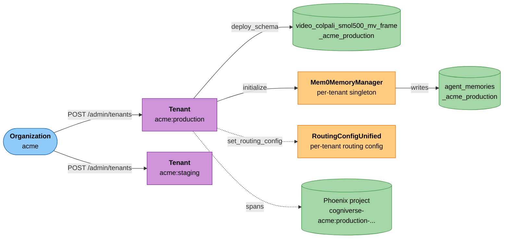

# Multi-Tenant Operations Guide

---

## Overview

Cogniverse implements **schema-per-tenant isolation** to provide complete data separation, security, and independent configuration for each tenant.

### Key Isolation Boundaries

- **Backend Schemas**: Each tenant has dedicated schemas with tenant-suffixed names
- **Telemetry Projects**: Each tenant has isolated telemetry projects
- **Configuration**: Per-tenant configuration with versioning and rollback
- **Memory**: Per-tenant Mem0 memory with isolated user/agent histories
- **Routing**: Per-tenant routing strategies and experience buffers

---

## Tenant Lifecycle



### 0. Register Tenant (Admin API)

The runtime's Tenant Management API
(`libs/runtime/cogniverse_runtime/admin/tenant_manager.py`, mounted at
`/admin`) is the system of record for org/tenant existence —
`assert_tenant_exists` on every search/ingestion/graph request checks
the `tenant_metadata` document this API writes. The Python steps in
"1. Tenant Creation" below configure the *global* system config and
the tenant's memory stack; they do not register the tenant itself.
Register it first.

Tenants live under an **organization** in `org:tenant` form (e.g.
`acme:production`); creating a tenant auto-creates its org when the
org doesn't exist yet.

```bash
RUNTIME_URL=http://localhost:8000

# Optional: create the org explicitly (otherwise auto-created by the
# first tenant create call below)
curl -sfX POST "$RUNTIME_URL/admin/organizations" \
  -H 'Content-Type: application/json' \
  -d '{"org_id": "acme", "org_name": "Acme Corp", "created_by": "admin"}'

# Create the tenant — deploys base_schemas (defaults to
# ["video_colpali_smol500_mv_frame"] when the field is omitted)
curl -sfX POST "$RUNTIME_URL/admin/tenants" \
  -H 'Content-Type: application/json' \
  -d '{"tenant_id": "acme:production", "created_by": "admin",
       "base_schemas": ["video_colpali_smol500_mv_frame"]}'

# List tenants in an org
curl -sf "$RUNTIME_URL/admin/organizations/acme/tenants" | jq .

# Get one tenant
curl -sf "$RUNTIME_URL/admin/tenants/acme:production" | jq .

# Delete a tenant — drops its schemas AND its tenant_metadata record
# in one call (this is what "3. Tenant Deletion" below wraps)
curl -sfX DELETE "$RUNTIME_URL/admin/tenants/acme:production"

# Delete an organization — cascades to delete every tenant in it first
curl -sfX DELETE "$RUNTIME_URL/admin/organizations/acme"
```

The dashboard's **Tenant Management** tab
(`libs/dashboard/cogniverse_dashboard/tabs/tenant_management.py`)
wraps the same endpoints with a form-based UI for creating, listing,
and deleting organizations and tenants without hand-writing curl.

Auth is not yet wired into this API — it currently trusts the caller
to pass `tenant_id` / `created_by` honestly in the request body.

### 1. Tenant Creation

```python
from pathlib import Path

# Imports from layered architecture
from cogniverse_foundation.config.unified_config import SystemConfig  # Foundation layer
from cogniverse_foundation.config.utils import create_default_config_manager  # Foundation layer
from cogniverse_core.schemas.filesystem_loader import FilesystemSchemaLoader  # Core layer

# Initialize managers
config_manager = create_default_config_manager()
schema_loader = FilesystemSchemaLoader(Path("configs/schemas"))

# Create new tenant
tenant_id = "acme_corp"

# 1. Ensure global system configuration is set (once for the whole deployment)
# SystemConfig is NOT per-tenant — it holds deployment-wide infrastructure settings.
system_config = SystemConfig(
    llm_model="openai/google/gemma-4-e4b-it",
    base_url="http://localhost:11434",
    backend_url="http://localhost",
    backend_port=8080,
    telemetry_url="http://localhost:6006",
)
config_manager.set_system_config(system_config)

# 2. Deploy schemas using script (from project root)
# JAX_PLATFORM_NAME=cpu uv run python scripts/deploy_json_schema.py configs/schemas/video_colpali_smol500_mv_frame_schema.json

# 3. Initialize tenant memory
from cogniverse_core.memory.manager import Mem0MemoryManager  # Core layer
from cogniverse_core.memory.schema import build_default_registry

memory_manager = Mem0MemoryManager(tenant_id=tenant_id)
memory_manager.initialize(
    backend_host="localhost",
    backend_port=8080,
    llm_model="openai/google/gemma-4-e4b-it",
    embedding_model="lightonai/DenseOn",
    llm_base_url="http://localhost:11434",
    embedder_base_url="http://localhost:8000",  # Required: DenseOn /v1 endpoint
    config_manager=config_manager,
    schema_loader=schema_loader,
    # Enables schema enforcement (provenance + trust + reconciliation)
    knowledge_registry=build_default_registry(),
)

print(f"✅ Tenant {tenant_id} created successfully")
print(f"   Config: Stored in config manager")
# TelemetryConfig.tenant_project_template is "cogniverse-{tenant_id}"
print(f"   Telemetry Project: cogniverse-{tenant_id}")
print(f"   Memory: Initialized with backend isolation")
```

### 2. Tenant Configuration

```python
from cogniverse_foundation.config.unified_config import RoutingConfigUnified  # Foundation layer

# Configure routing for tenant
routing_config = RoutingConfigUnified(
    tenant_id=tenant_id,
    # "tiered" is the only mode implemented end-to-end (fast + slow +
    # fallback path below). Other string values are accepted by the
    # dataclass for forward-compat but produce no behavior change at
    # dispatch time — do not rely on them.
    routing_mode="tiered",
    enable_fast_path=True,
    enable_slow_path=True,
    fast_path_confidence_threshold=0.7,
    slow_path_confidence_threshold=0.6,
    enable_auto_optimization=True,
    optimization_interval_seconds=3600
)

config_manager.set_routing_config(routing_config)

print(f"✅ Routing configured for {tenant_id}")
```

### 3. Tenant Deletion

```python
# Soft delete (preserves configuration history)
def soft_delete_tenant(tenant_id: str):
    """Soft delete - keeps configuration history"""
    from datetime import datetime

    # 1. Mark tenant as inactive via per-tenant routing config metadata
    from cogniverse_foundation.config.unified_config import RoutingConfigUnified
    routing_config = config_manager.get_routing_config(tenant_id=tenant_id)
    if routing_config is None:
        routing_config = RoutingConfigUnified(tenant_id=tenant_id)
    # Ensure metadata dict exists
    if not routing_config.metadata:
        routing_config.metadata = {}
    routing_config.metadata["status"] = "inactive"
    routing_config.metadata["deactivated_at"] = datetime.now().isoformat()
    config_manager.set_routing_config(routing_config, tenant_id=tenant_id)

    # 2. Stop accepting new requests
    # (handled by application layer checking metadata["status"])

    # 3. Preserve data for retention period
    print(f"✅ Tenant {tenant_id} marked inactive")
    print(f"   Data retention: 90 days")
    print(f"   Can be reactivated within retention period")

# Hard delete (permanent removal). Prefer
# `curl -X DELETE $RUNTIME_URL/admin/tenants/{tenant_id}` (see "0. Register
# Tenant" above) — it does steps 1+3 below in one call via the same
# `delete_tenant_internal` code path. The function here shows what that
# endpoint does under the hood for callers driving it directly.
def hard_delete_tenant(tenant_id: str):
    """Hard delete - permanent removal"""

    # 1. Delete backend schemas — redeploys the Vespa application package
    # with allow_schema_removal=True (validation override required for
    # content type removal), then tombstones the SchemaRegistry entries.
    # schema_manager here is a VespaSchemaManager, normally obtained via
    # backend.schema_manager rather than constructed directly (it needs
    # a wired SchemaRegistry) — this function shows what happens
    # server-side, use the DELETE endpoint above for real operations.
    schema_manager.delete_tenant_schemas(tenant_id)

    # 2. Delete telemetry project
    # (manual cleanup required via telemetry provider UI or API)

    # 3. Delete configurations (if delete method exists)
    # config_manager.delete_tenant_config(tenant_id)

    # 4. Clear memory (clear for all agents under this tenant)
    memory_manager = Mem0MemoryManager(tenant_id=tenant_id)
    # Note: clear_agent_memory requires agent_name parameter
    # For full tenant cleanup, iterate through all agents or use backend API

    print(f"✅ Tenant {tenant_id} permanently deleted")

# Usage
soft_delete_tenant("acme_corp")  # Default: soft delete
# hard_delete_tenant("acme_corp")  # Use with caution
```

---

## Schema Management

### Schema Naming Convention

`VespaSchemaManager.get_tenant_schema_name` (and
`SchemaRegistry.deploy_schema`, which calls the same
`canonical_tenant_id` helper) canonicalize `tenant_id` to `org:tenant`
**before** building the suffix — a bare id with no colon is doubled
(`"acme"` → `"acme:acme"`), an `org:tenant` id passes through as-is.
The colon is then replaced with `_`:

```text
<base_schema_name>_<canonical_org>_<canonical_tenant>

Examples (bare tenant_id — org and tenant name are the same string,
so the suffix repeats it):
- video_colpali_smol500_mv_frame_acme_acme        (tenant_id="acme")
- video_videoprism_base_mv_chunk_30s_default_default  (tenant_id="default")

Examples (explicit org:tenant — no repetition):
- video_colpali_smol500_mv_frame_acme_production  (tenant_id="acme:production")
- video_colqwen_omni_mv_chunk_30s_globex_dev       (tenant_id="globex:dev")
```

Prefer explicit `org:tenant` ids (as used by the Admin API in "0.
Register Tenant" above) for anything where you'll need to predict or
construct the schema name yourself (backup scripts, troubleshooting
commands) — it avoids the bare-id doubling entirely.

### Deploy Schema

```bash
# Deploy ColPali schema
JAX_PLATFORM_NAME=cpu uv run python scripts/deploy_json_schema.py \
  configs/schemas/video_colpali_smol500_mv_frame_schema.json

# Verify schema deployed
curl http://localhost:8080/document/v1/ | jq '.schemas'
```

### Deploy Tenant Schemas

Schema deployment is always per-tenant; the runtime admin API funnels
through ``SchemaRegistry.deploy_schema`` so peer-tenant schemas are
preserved through redeploys.

```bash
RUNTIME_URL=http://localhost:8000

# Register the tenant first if it isn't already
curl -sfX POST "$RUNTIME_URL/admin/tenants" \
  -H 'Content-Type: application/json' \
  -d '{"tenant_id": "acme:production", "created_by": "admin"}'

# Deploy profile schemas for this tenant
SCHEMAS=(
  "video_colpali_smol500_mv_frame"
  "video_videoprism_base_mv_chunk_30s"
)

for schema in "${SCHEMAS[@]}"; do
  curl -sfX POST "$RUNTIME_URL/admin/profiles/${schema}/deploy" \
    -H 'Content-Type: application/json' \
    -d '{"tenant_id": "acme:production"}'
  echo "✓ Deployed: ${schema} for acme:production"
done
```

### List Tenant Schemas

```python
# List all schemas via backend API
import requests

backend_url = "http://localhost:8080"

# Query backend for deployed schemas
response = requests.get(f"{backend_url}/ApplicationStatus")
if response.status_code == 200:
    # Parse schema names from response
    # (Implementation depends on backend API response format)
    print("Schemas deployed successfully")
else:
    print(f"Failed to query schemas: {response.status_code}")

# Note: Schema listing is best done via backend CLI or API
# Tenant-specific schemas follow pattern: {base_schema}_{tenant_id}
```

### Bulk delete tenant schemas

`VespaSchemaManager.delete_tenant_schemas(tenant_id)` unions that
tenant's registry-known schemas with any Vespa-deployed schema whose
name ends in *that tenant's own* suffix (self-orphans get swept too),
then redeploys without them. It does **not** absorb a *peer* tenant's
unresolved orphan: if removing the deletion set would still leave some
other schema in Vespa with no registry record, it refuses by raising
`BackendDeploymentError` rather than silently dropping an unrelated
tenant's data — the caller must escalate to the bulk path.
`delete_tenant_schemas_bulk(tenant_ids)` is the escalation: given the
full list of orphan-implicated tenants (e.g. from the dry-run below),
it unions every tenant's targets, absorbs whatever orphans remain
unresolved (logging warnings instead of raising), and drops everything
in one atomic redeploy.

```python
# schema_manager is a VespaSchemaManager (backend.schema_manager),
# normally reached through the runtime rather than constructed
# directly — shown here as the library call the Admin API wraps.

# Single-tenant delete — refuses (raises BackendDeploymentError) if an
# unrelated peer-tenant orphan would be left dangling by the redeploy.
schema_manager.delete_tenant_schemas("acme:prod")

# Multi-tenant atomic delete — absorbs unresolved orphans across the
# given tenant set instead of refusing (the operator-confirmed path).
schema_manager.delete_tenant_schemas_bulk(["acme:prod", "globex:dev"])
```

---

## Orphan reconciliation

A schema is an **orphan** when it exists in Vespa's deployed application
package but has no active record in the SchemaRegistry. Orphans
accumulate from interrupted deploy paths — a SIGKILL between
`backend.deploy_schemas` and `register_schema`, a power loss
mid-cleanup, or pre-`assert_tenant_exists` code paths that bypassed
`POST /admin/tenants`.

Production runtimes do not auto-drop orphans (they may represent
half-completed deploys of real customer data). Recovery is operator-
triggered.

### `cogniverse admin reconcile-orphans`

```bash
# Dry-run (default): list every orphan schema and the implied tenant
cogniverse admin reconcile-orphans

# Confirm: drop every orphan tenant in a single atomic redeploy
cogniverse admin reconcile-orphans --confirm

# Point at a non-default runtime
cogniverse admin reconcile-orphans --runtime-url http://runtime.cogniverse.svc:28000
```

The CLI calls `POST /admin/reconcile-orphans` on the runtime. Output
includes:

- `orphan_schemas` — full schema names found in Vespa but not in the registry
- `orphan_tenants` — tenant ids recovered by stripping known base prefixes
- `unrecovered_schemas` — orphan names whose base prefix isn't in the
  built-in `KNOWN_BASES` list (operator review required before forcing
  removal)

### `POST /admin/reconcile-orphans?dry_run={true|false}`

```bash
# Dry-run
curl -sfX POST "$RUNTIME_URL/admin/reconcile-orphans?dry_run=true" | jq .

# Confirm — drops every orphan tenant in one Vespa redeploy
curl -sfX POST "$RUNTIME_URL/admin/reconcile-orphans?dry_run=false" | jq .
```

Response body:

```json
{
  "dry_run": false,
  "deleted": ["knowledge_graph_acme_dev", "video_colpali_smol500_mv_frame_globex_test"],
  "orphan_schemas": ["knowledge_graph_acme_dev", "video_colpali_smol500_mv_frame_globex_test"],
  "orphan_tenants": ["acme:dev", "globex:test"],
  "unrecovered_schemas": []
}
```

Why one endpoint instead of iterating per-tenant DELETEs: the single-
tenant delete path *refuses* (raises `BackendDeploymentError`) rather
than dropping a peer tenant's unresolved orphan, so iterating per
tenant would just fail on the first tenant with a cross-tenant orphan
and leave the rest untouched — not silently drop them. The reconcile
endpoint first audits every orphan, exposes
the full list in the response (`orphan_schemas`, `orphan_tenants`,
`unrecovered_schemas`), then runs one `_redeploy_dropping` call so the
operator has a single, reviewable record of what was removed.

---

## Data Ingestion

### Ingest Video for Specific Tenant

```bash
# Ingest videos for the acme:production tenant (from project root).
# Using explicit org:tenant form here (not a bare "acme_corp") so the
# resulting schema name below has a single, predictable suffix — see
# "Schema Naming Convention" above for what a bare tenant_id would do.
JAX_PLATFORM_NAME=cpu uv run python scripts/run_ingestion.py \
  --video_dir data/videos/acme_production/ \
  --backend vespa \
  --profile video_colpali_smol500_mv_frame \
  --tenant-id acme:production

# Verify ingestion (backend-specific - example for Vespa)
curl "http://localhost:8080/document/v1/video_colpali_smol500_mv_frame_acme_production/frame/docid/1"
```

### Bulk Tenant Ingestion

```python
from pathlib import Path

async def ingest_tenant_videos(tenant_id: str, video_dir: Path):
    """Ingest all videos for a tenant"""

    video_files = list(video_dir.glob("*.mp4"))
    print(f"Processing {len(video_files)} videos for {tenant_id}")

    # Use the ingestion script (recommended approach)
    import subprocess
    result = subprocess.run([
        "uv", "run", "python", "scripts/run_ingestion.py",
        "--video_dir", str(video_dir),
        "--backend", "vespa",
        "--profile", "video_colpali_smol500_mv_frame",
        "--tenant-id", tenant_id
    ], capture_output=True, text=True)

    if result.returncode == 0:
        print(f"✓ Ingestion completed for {tenant_id}")
    else:
        print(f"✗ Ingestion failed: {result.stderr}")

    return result.returncode == 0

# Usage (in async context)
import asyncio

asyncio.run(ingest_tenant_videos("acme_corp", Path("data/videos/acme_corp")))
asyncio.run(ingest_tenant_videos("globex_inc", Path("data/videos/globex_inc")))
```

---

## Query & Search

### Tenant-Isolated Search

```python
from cogniverse_agents.search_agent import SearchAgent, SearchAgentDeps
from cogniverse_foundation.config.utils import create_default_config_manager
from cogniverse_core.schemas.filesystem_loader import FilesystemSchemaLoader
from pathlib import Path

# Initialize once — ONE agent serves ALL tenants
config_manager = create_default_config_manager()
schema_loader = FilesystemSchemaLoader(Path("configs/schemas"))

agent = SearchAgent(
    deps=SearchAgentDeps(profile="video_colpali_smol500_mv_frame"),
    config_manager=config_manager,
    schema_loader=schema_loader,
)

def search_tenant_videos(
    tenant_id: str,
    query: str,
    top_k: int = 10
):
    """Search videos within tenant isolation"""

    # tenant_id is a PER-REQUEST parameter on search_by_text()
    results = agent.search_by_text(
        query=query,
        tenant_id=tenant_id,
        top_k=top_k,
    )

    return results

# Search for acme_corp
acme_results = search_tenant_videos("acme_corp", "machine learning")

# Search for globex_inc (completely isolated)
globex_results = search_tenant_videos("globex_inc", "machine learning")
```

---

## Telemetry & Monitoring

### Per-Tenant Telemetry Projects

Each tenant gets an isolated telemetry project:

```python
from cogniverse_foundation.telemetry.config import TelemetryConfig
from cogniverse_foundation.telemetry.manager import TelemetryManager

# Initialize telemetry (singleton)
telemetry = TelemetryManager(
    config=TelemetryConfig(
        enabled=True,
        otlp_endpoint="localhost:4317"
    )
)

# All spans require tenant_id for isolation
tenant_id = "acme_corp"
with telemetry.span("video_search", tenant_id=tenant_id) as span:
    span.set_attribute("query", query)
    # ... perform search
```

### View Tenant-Specific Traces

```bash
# Access telemetry dashboard (Phoenix)
open http://localhost:6006

# Projects visible (TelemetryConfig.tenant_project_template is
# "cogniverse-{tenant_id}"; a "service" argument to get_project_name
# appends "-{service}", as profile_metrics.py does for
# "cogniverse-orchestration" spans):
# - cogniverse-acme_corp (tenant project)
# - cogniverse-globex_inc (tenant project)
# - cogniverse-default (default tenant project)

# Each project contains only that tenant's traces
```

### Cross-Tenant Analytics (Admin Only)

Tenant isolation in Phoenix is per-*project* (`cogniverse-{tenant_id}`),
not a `tenant_id` span attribute — no span in the codebase sets one.
`PhoenixAnalytics.get_traces()` queries a single project via its
`project_name` kwarg, so cross-tenant aggregation means calling it once
per known tenant and keying the results yourself by which project you
queried — not by reading `trace.metadata["tenant_id"]`, which would
always come back empty.

```python
from cogniverse_telemetry_phoenix.evaluation.analytics import PhoenixAnalytics
from datetime import datetime

# Admin can view aggregated metrics across tenants. tenant_ids would
# typically come from GET /admin/organizations/{org}/tenants for every
# org (see "0. Register Tenant" above) rather than being hard-coded.
tenant_ids = ["acme:production", "globex:dev"]

analytics = PhoenixAnalytics(telemetry_url="http://localhost:6006")

start_time = datetime(2025, 1, 1)
end_time = datetime(2025, 1, 31)

tenant_stats = {}
for tenant_id in tenant_ids:
    traces = analytics.get_traces(
        start_time=start_time,
        end_time=end_time,
        limit=10000,
        project_name=f"cogniverse-{tenant_id}",
    )

    stats = {"total": 0, "success": 0, "latencies": []}
    for trace in traces:
        stats["total"] += 1
        if trace.status == "success":
            stats["success"] += 1
        stats["latencies"].append(trace.duration_ms)
    tenant_stats[tenant_id] = stats

# Display metrics
for tenant_id, stats in tenant_stats.items():
    avg_latency = sum(stats["latencies"]) / len(stats["latencies"]) if stats["latencies"] else 0
    success_rate = stats["success"] / stats["total"] if stats["total"] > 0 else 0

    print(f"\n{tenant_id}:")
    print(f"  Total Queries: {stats['total']}")
    print(f"  Avg Latency: {avg_latency:.1f}ms")
    print(f"  Success Rate: {success_rate:.1%}")
```

---

## Memory Management

### Per-Tenant Memory

Each tenant has isolated Mem0 memory:

```python
from pathlib import Path

from cogniverse_core.memory.manager import Mem0MemoryManager
from cogniverse_core.schemas.filesystem_loader import FilesystemSchemaLoader
from cogniverse_foundation.config.utils import create_default_config_manager

config_manager = create_default_config_manager()
schema_loader = FilesystemSchemaLoader(Path("configs/schemas"))

# Get tenant-specific memory managers (per-tenant singleton pattern)
memory_acme = Mem0MemoryManager(tenant_id="acme_corp")
memory_acme.initialize(
    backend_host="localhost",
    backend_port=8080,
    llm_model="openai/google/gemma-4-e4b-it",
    embedding_model="lightonai/DenseOn",
    llm_base_url="http://localhost:11434",
    embedder_base_url="http://localhost:8000",  # Required: DenseOn /v1 endpoint
    config_manager=config_manager,
    schema_loader=schema_loader,
)

memory_globex = Mem0MemoryManager(tenant_id="globex_inc")
memory_globex.initialize(
    backend_host="localhost",
    backend_port=8080,
    llm_model="openai/google/gemma-4-e4b-it",
    embedding_model="lightonai/DenseOn",
    llm_base_url="http://localhost:11434",
    embedder_base_url="http://localhost:8000",  # Required: DenseOn /v1 endpoint
    config_manager=config_manager,
    schema_loader=schema_loader,
)

# Add memory for acme_corp
memory_acme.add_memory(
    content="User prefers technical tutorials",
    tenant_id="acme_corp",
    agent_name="video_search_agent"
)

# Search memory (tenant-isolated)
memories = memory_acme.search_memory(
    query="What does the user prefer?",
    tenant_id="acme_corp",
    agent_name="video_search_agent",
    top_k=5
)

# Memories are completely isolated per tenant
```

### Session-scoped scratch memory

Cogniverse ships a built-in `session_scratch` knowledge kind: any memory
written under this kind is automatically tagged with the request's
`session_id` and is hard-deleted when the session ends. The schema
forbids pinning at construction time so a transient scratch row can't be
pinned and then silently lost on session close.

The wire end-to-end:

1. **Caller stamps `session_id` on the request.** The gateway's HTTP
   handler reads `session_id` from the request body / cookie / JWT and
   puts it onto the dispatcher's per-request `context["session_id"]`.
2. **Dispatcher propagates it to memory-aware agents.** When the agent
   inherits `MemoryAwareMixin`, the dispatcher wraps the call in
   `_scoped_session(agent, session_id)` which calls
   `agent.set_session_id(session_id)` for the duration of the request
   and clears it on exit (so a long-lived agent instance never bleeds
   one user's session into the next).
3. **Mixin auto-stamps `metadata.session_id` on writes.** Any
   `update_memory()` call inside the scope automatically merges
   `session_id` into the metadata dict — agent code never has to thread
   it through manually. Caller-supplied `session_id` always wins (no
   silent overwrite).
4. **Schema validates writes.** `KnowledgeSchema.validate_session_membership`
   rejects EPHEMERAL_SESSION-kind writes that arrive without a
   `session_id` so a missed propagation never produces a memory the
   cleanup path can't find.
5. **Session close fans out cleanup.** When the session ends, the
   gateway POSTs once to the runtime — see endpoints below.

#### Admin endpoints

```bash
# Per-tenant: drop one session's scratch rows in one tenant. Use when
# you know exactly which tenant the session touched (operator triage).
curl -X DELETE "https://runtime/admin/tenants/${TENANT}/sessions/${SID}"
# → 200 {"status":"dropped","tenant_id":"...","session_id":"...",
#         "deleted_by_kind":{"session_scratch":3},"total_deleted":3}

# Cross-tenant fan-out: drop one session everywhere it has rows.
# This is the endpoint the gateway hits on logout / ws-disconnect.
# It iterates every warm Mem0 instance in the runtime's LRU and calls
# drop_session on each. Tenants evicted from the warm cache are
# skipped (their rows still exist; the next request that warms the
# manager and triggers another close webhook will sweep them).
curl -X POST "https://runtime/admin/sessions/${SID}/close"
# → 200 {"status":"closed","session_id":"...",
#         "per_tenant":{"acme":{"session_scratch":3}},
#         "total_deleted":3,"skipped_tenants":[]}
```

#### Registering custom session kinds

Tenants who want their own session-scoped kind beyond the default
`session_scratch` can register one:

```python
from cogniverse_core.memory.schema import (
    KnowledgeSchema,
    Pinnable,
    Retention,
    Sensitivity,
)

reg.register(
    KnowledgeSchema(
        kind="my_session_view",
        retention=Retention.EPHEMERAL_SESSION,
        sensitivity=Sensitivity.TENANT_PRIVATE,
        pinnable_by=Pinnable.NOBODY,  # required: schema gates other values
        provenance_required=False,
    )
)
```

The `pinnable_by=Pinnable.NOBODY` constraint is enforced in
`KnowledgeSchema.__post_init__` — passing any other role raises a
`ValueError` at schema construction. Pinning a session memory and then
losing it on session close would be a foot-gun; the schema gate makes
it unrepresentable.

### Memory Statistics per Tenant

```python
# Get memory stats for tenant
stats = memory_acme.get_memory_stats(
    tenant_id="acme_corp",
    agent_name="video_search_agent"
)

print(f"Tenant: acme_corp")
print(f"  Total Memories: {stats['total_memories']}")
print(f"  Enabled: {stats['enabled']}")
print(f"  Tenant ID: {stats.get('tenant_id', 'N/A')}")
print(f"  Agent: {stats.get('agent_name', 'N/A')}")
```

---

## Configuration Management

### Tenant Configuration Templates

```python
from cogniverse_foundation.config.unified_config import SystemConfig
from cogniverse_foundation.config.utils import create_default_config_manager

config_manager = create_default_config_manager()

# Define configuration templates
# Note: SystemConfig has basic system-level settings
# For advanced features (cache TTL, optimization), use RoutingConfigUnified
TENANT_TEMPLATES = {
    "enterprise": {
        "llm_model": "mistral:7b-instruct",
        "backend_url": "http://localhost",
        "backend_port": 8080,
        "telemetry_url": "http://localhost:6006"
    },
    "startup": {
        "llm_model": "openai/google/gemma-4-e4b-it",
        "backend_url": "http://localhost",
        "backend_port": 8080,
        "telemetry_url": "http://localhost:6006"
    },
    "trial": {
        "llm_model": "openai/google/gemma-4-e4b-it",
        "backend_url": "http://localhost",
        "backend_port": 8080,
        "telemetry_url": "http://localhost:6006"
    }
}

# Apply template to new tenant
def create_tenant_from_template(
    tenant_id: str,
    template: str = "enterprise",
    overrides: dict = None
):
    """Create tenant with template configuration"""

    # Get template
    template_config = TENANT_TEMPLATES[template].copy()

    # Apply overrides
    if overrides:
        template_config.update(overrides)

    # Create global system config from template (SystemConfig has no tenant_id)
    config = SystemConfig(**template_config)

    config_manager.set_system_config(config)
    print(f"✅ System config applied from {template} template")

# Usage
create_tenant_from_template(
    tenant_id="new_startup",
    template="startup",
    overrides={"llm_model": "google/gemma-4-e4b-it"}  # Custom override
)
```

### Configuration Rollback

```python
from cogniverse_foundation.config.utils import create_default_config_manager
from cogniverse_sdk.interfaces.config_store import ConfigScope

config_manager = create_default_config_manager()

# Rollback global system configuration using version history
# SystemConfig is stored under the "_system" sentinel tenant — not per-tenant.
def rollback_system_config(version: int):
    """Rollback global system configuration to a specific version"""

    # Get config history (stored under "_system")
    entries = config_manager.store.get_config_history(
        tenant_id="_system",
        scope=ConfigScope.SYSTEM,
        service="system",
        config_key="system_config",
        limit=100
    )

    # Find target version
    target_entry = next((e for e in entries if e.version == version), None)
    if not target_entry:
        print(f"❌ Version {version} not found in system config history")
        return

    # Restore from target version
    from cogniverse_foundation.config.unified_config import SystemConfig
    old_config = SystemConfig.from_dict(target_entry.config_value)
    config_manager.set_system_config(old_config)

    print(f"✅ Rolled back system config to version {version}")

# Usage
rollback_system_config(version=5)
```

---

## Security & Isolation

### Egress enforcement: per-agent matrix

Cogniverse defends agent egress at three layers. The right layer for
each agent depends on whether it executes code, makes direct HTTP
calls, or only goes through hookable libraries.

Of the 23 agents in `configs/config.json` `agents.*`, only 5 have a
dedicated `configs/agent_policies/<name>.yaml`: `coding_agent`,
`orchestrator_agent`, `search_agent`, `summarizer_agent`, and
`routing_agent` — the last is `GatewayAgent`'s policy file (the
dispatcher's egress-check calls it by the pre-rename name
`"routing_agent"`; there is no `gateway_agent.yaml`). Every other agent
falls through with no dedicated policy and no dispatch-time check.

| Agent | Container isolation | App-layer egress check | CNI NetworkPolicy | Dispatch-time validation |
|---|---|---|---|---|
| **CodingAgent** | ✅ ``exec_in_sandbox`` | n/a | ✅ | ✅ |
| **OrchestratorAgent** (A2A subagent dispatch) | n/a | ✅ ``PolicyEnforcingTransport`` | ✅ | ✅ |
| **SearchAgent / SummarizerAgent / GatewayAgent** (policy file: `routing_agent.yaml`) | n/a | ◯ deliberately not wired (see "Why no app-layer enforcement on Vespa egress" below) | ✅ | ✅ |
| **All other 18 agents** — `image_search_agent`, `document_agent`, `text_analysis_agent`, `audio_analysis_agent`, `deep_research_agent`, `detailed_report_agent`, `profile_selection_agent`, `query_enhancement_agent`, `entity_extraction_agent`, `cross_tenant_comparison_agent`, `federated_query_agent`, and the 7 Knowledge-Graph & Reasoning agents (`CitationTracingAgent`, `ContradictionReconciliationAgent`, `MultiDocumentSynthesisAgent`, `KnowledgeGraphTraversalAgent`, `TemporalReasoningAgent`, `KnowledgeSummarizationAgent`, `AuditExplanationAgent`) | n/a | ◯ no policy registered | ✅ only via the shared runtime pod's unified egress union (no agent-specific rule) | ◯ `agent_dispatcher.py` has no `validate_dispatch_endpoints` call for these agent names |

**What "wired" means**:

  - `exec_in_sandbox`: the agent's outbound process runs inside an
    OpenShell-managed container with syscall filtering, OOM caps, and
    network egress restricted to the policy's allowlist. Required for
    any agent that executes user-supplied code.
  - `PolicyEnforcingTransport`: an httpx transport that intercepts
    every outbound request and raises `EgressDeniedError` (sub-ms,
    structured) when `(host, port)` is not on the agent's policy
    allowlist. Wired through `SandboxManager.make_http_client(agent_type)`
    and consumed by the dispatcher when constructing the agent.
  - **CNI NetworkPolicy**: kernel-level packet drop by Cilium / Calico
    based on pod labels. Generated from the agent policy YAMLs by
    `uv run python -m cogniverse_runtime.optimization_cli --mode egress-netpol`
    and applied to the Helm release. The actual production deny
    mechanism — works regardless of what library the agent uses
    (httpx, pyvespa, DSPy, raw socket). The default Helm chart topology
    runs every agent inside one shared runtime pod, so the generator's
    `unified-runtime` emit mode is used: ONE `NetworkPolicy` whose
    egress list is the de-duplicated union of every `configs/agent_policies/*.yaml`
    file, selecting on the runtime pod's labels rather than per-agent
    labels (per-agent pod selectors are only meaningful if each agent
    ever runs in its own Deployment).
  - **Dispatch-time validation**: at boot, the dispatcher cross-checks
    every agent's *configured* backend URLs against the policy YAML's
    egress allowlist. Catches operator config drift (someone moved the
    Vespa port without updating the policy) as a logged warning before
    the first request runs into a CNI deny or an `EgressDeniedError`.

### Why no app-layer enforcement on Vespa / LLM egress

App-layer egress checks for SearchAgent / SummarizerAgent /
GatewayAgent would protect against **unintended URLs being requested
at runtime**. For these agents that scenario doesn't exist:

  - The Vespa endpoint is set ONCE in `BackendConfig.url:port` and
    read by `VespaBackend.__init__`. It never changes per request.
  - The LLM endpoint is similarly one configured value per agent.
  - Neither URL is ever sourced from a prompt, from user input, or
    from the agent registry — i.e. there is no path by which an LLM
    injection or a registry corruption could redirect the call.

The realistic threats reduce to:

  - **Config drift** (policy YAML and `BackendConfig` disagree on the
    port) — caught by `validate_dispatch_endpoints` at boot, before
    any request runs.
  - **Code drift** (a new hard-coded URL slips into the data-plane
    code) — caught by code review; if it slips through, CNI catches
    it at the kernel.
  - **CNI misconfiguration** — the fix is in CNI policy, not in a
    redundant app-layer check.

The OrchestratorAgent is different: it dispatches A2A subagent calls
to URLs *resolved per request from the agent registry*. That registry
is dynamic (operators add agents, canary endpoints come and go) so
the agent code can request a URL it has never seen before. The
app-layer transport is meaningful there — it's the only layer that
can deny a registered-but-not-allowlisted peer at the moment of call.

The CodingAgent is even more different: it runs LLM-generated code
that can call ANY URL. Container isolation + egress allowlist is the
only feasible defence.

In short: **app-layer enforcement scales with how dynamic the URL
choice is**. CodingAgent (anything) and OrchestratorAgent (registry)
need it; Search/Summarizer/Gateway (one fixed config value) get
nothing useful from it on top of dispatch-time validation + CNI.

The same "one fixed config value" reasoning applies to the other 18
agents in the matrix above (`image_search_agent`, `document_agent`,
`text_analysis_agent`, `audio_analysis_agent`, `deep_research_agent`,
`detailed_report_agent`, `profile_selection_agent`,
`query_enhancement_agent`, `entity_extraction_agent`, the federation
pair, and the 7 Knowledge-Graph agents) — none of them source a
target URL from user input or a dynamic registry either. Unlike
Search/Summarizer/Gateway, though, they have neither a dedicated
policy YAML nor a `validate_dispatch_endpoints` call, so they get
*only* the incidental CNI coverage from the shared runtime pod's
unified egress union — a config-drift typo in one of these agents'
`BackendConfig.url:port` is not caught at boot the way it is for the
three wired agents. It still fails loud (connection error / 4xx)
rather than silently, since the URL space is exactly as fixed as
SearchAgent's; there's just no dispatch-time check confirming it
matches policy before the first request. Extending
`validate_dispatch_endpoints` and a policy YAML to these agents is
tracked as a hardening item, not a currently-wired guarantee — don't
document them as covered until a policy file exists in
`configs/agent_policies/`.

**For dev / test environments** (where NetworkPolicy doesn't apply —
local k3d, pytest CI), the same reasoning holds: the agent code
cannot request a wrong URL because the URL doesn't come from
anywhere unsafe. A typo in `BackendConfig.url:port` would point the
agent at a non-existent or wrong port and produce an immediate
connection error or a 4xx — the failure is loud, not silent.

**Operator opt-out**:

```bash
# Disable application-layer enforcement entirely (CNI still enforces
# in production). Useful for dev iteration on a new policy YAML.
COGNIVERSE_OPENSHELL_HTTP_ENFORCEMENT=disabled

# Disable the sandbox manager entirely (also disables exec_in_sandbox
# for CodingAgent — only safe in trusted dev environments).
COGNIVERSE_SANDBOX_POLICY=disabled
```

### Tenant Isolation Verification

```python
from pathlib import Path

from cogniverse_agents.search_agent import SearchAgent, SearchAgentDeps
from cogniverse_core.schemas.filesystem_loader import FilesystemSchemaLoader
from cogniverse_foundation.config.utils import create_default_config_manager

config_manager = create_default_config_manager()


async def verify_tenant_isolation(tenant_a: str, tenant_b: str):
    """Verify complete isolation between two tenants"""

    checks = []

    # 1. Schema isolation
    # Note: Schema isolation is enforced by tenant-suffixed schema names
    # (see "Schema Naming Convention" above for the exact suffix rule —
    # it differs for a bare tenant_id vs an explicit org:tenant id).
    checks.append(("Schema Isolation", True))  # Enforced by design

    # 2. Data isolation (search)
    schema_loader = FilesystemSchemaLoader(Path("configs/schemas"))
    agent = SearchAgent(
        deps=SearchAgentDeps(profile="video_colpali_smol500_mv_frame"),
        config_manager=config_manager,
        schema_loader=schema_loader,
    )
    results_a = agent.search_by_text(query="test query", tenant_id=tenant_a, top_k=100)  # synchronous
    # Verify tenant isolation by checking results are from correct tenant's schema
    checks.append(("Data Isolation", len(results_a) >= 0))  # Verify search works

    # 3. Memory isolation
    memory_a = Mem0MemoryManager(tenant_id=tenant_a)
    memories_a = memory_a.get_all_memories(tenant_id=tenant_a, agent_name="video_search_agent")
    checks.append(("Memory Isolation", len(memories_a) >= 0))  # Verify access works

    # 4. Configuration isolation (per-tenant routing configs are isolated)
    from cogniverse_foundation.config.utils import get_config
    config_a = get_config(tenant_id=tenant_a, config_manager=config_manager)
    config_b = get_config(tenant_id=tenant_b, config_manager=config_manager)
    checks.append(("Config Isolation", True))  # get_config scopes by tenant_id by design

    # Report
    print(f"\n🔒 Tenant Isolation Verification")
    print(f"   Tenant A: {tenant_a}")
    print(f"   Tenant B: {tenant_b}\n")

    all_passed = True
    for check_name, passed in checks:
        status = "✅" if passed else "❌"
        print(f"   {status} {check_name}")
        if not passed:
            all_passed = False

    return all_passed

# Run verification (in async context)
isolation_verified = await verify_tenant_isolation("acme_corp", "globex_inc")
assert isolation_verified, "Tenant isolation verification failed!"
```

### Access Control

Note: this is a reference pattern, not a framework-provided decorator —
`tenant_manager.py`'s own docstring states auth is "not yet integrated"
into the Admin API; it currently trusts the caller's request body. The
one real per-request ACL check in the codebase today lives in
`cross_tenant_comparison_agent` / `federated_query_agent` (actor role
must be `tenant_admin` or `org_admin`, and every requested tenant must
share the caller's org).

```python
from cogniverse_agents.search_agent import SearchAgent, SearchAgentDeps
from cogniverse_core.schemas.filesystem_loader import FilesystemSchemaLoader
from pathlib import Path

# Tenant access control decorator
def require_tenant_access(tenant_id: str):
    """Decorator to enforce tenant access control"""
    def decorator(func):
        def wrapper(*args, **kwargs):
            # Verify caller has access to tenant
            caller_tenant = kwargs.get('caller_tenant_id')
            if caller_tenant != tenant_id:
                raise PermissionError(
                    f"Caller {caller_tenant} not authorized for tenant {tenant_id}"
                )
            return func(*args, **kwargs)
        return wrapper
    return decorator

# Usage
@require_tenant_access("acme_corp")
def search_acme_videos(query: str, caller_tenant_id: str, config_manager):
    """Search restricted to acme_corp tenant"""
    schema_loader = FilesystemSchemaLoader(Path("configs/schemas"))
    agent = SearchAgent(
        deps=SearchAgentDeps(profile="video_colpali_smol500_mv_frame"),
        config_manager=config_manager,
        schema_loader=schema_loader,
    )
    return agent.search_by_text(query=query, tenant_id="acme_corp")  # synchronous (not async)
```

---

## Performance & Optimization

### Per-Tenant Performance Metrics

Per-modality runtime metrics (request counts, P50/P95/P99 latency, success rate) are available per tenant in the **Profile Routing Metrics** dashboard tab (`libs/dashboard/cogniverse_dashboard/tabs/profile_metrics.py`).

The tab reads `cogniverse.profile_selection` spans from the tenant's Phoenix project and aggregates them by the `profile_selection.modality` attribute that `ProfileSelectionAgent` emits on every dispatch. Tenant isolation is provided natively by the telemetry layer — each tenant has its own Phoenix project (`cogniverse-{tenant_id}-cogniverse-orchestration`), so span queries are scoped automatically.

To view metrics for a specific tenant:
1. Open the dashboard: `uv run streamlit run libs/dashboard/cogniverse_dashboard/app.py --server.port 8501`
2. Select the tenant from the sidebar.
3. Navigate to the "Profile Routing Metrics" tab.

### Tenant-Specific Optimization

Trigger on-demand optimization for a tenant via the admin API:

```python
import requests

# Submit an optimization run for a specific tenant
def trigger_tenant_optimization(tenant_id: str, mode: str = "gateway-thresholds"):
    response = requests.post(
        f"http://localhost:8000/admin/tenant/{tenant_id}/optimize",
        json={"mode": mode},
    )
    result = response.json()
    print(f"Workflow submitted: {result['workflow_name']}")
    print(f"Track progress: {result['status_url']}")
    return result

# Available modes: gateway-thresholds, simba, workflow, profile, entity-extraction
# (synthetic-data generation runs on its own scheduled CronWorkflow, not
# through this on-demand endpoint)
trigger_tenant_optimization("acme_corp", mode="gateway-thresholds")
```

---

## Backup & Recovery

### Tenant Data Backup

Tenant data can be backed up using backend-specific tools:

```bash
# Example: Backup tenant data manually using backend API

# Use explicit org:tenant form — the schema suffix below is
# TENANT_ID with ":" replaced by "_" (see "Schema Naming Convention").
# A bare tenant_id (no colon) gets doubled by canonicalization before
# the suffix is derived, so this substitution would be wrong for one.
TENANT_ID="acme:production"
SCHEMA_SUFFIX="${TENANT_ID//:/_}"
BACKUP_DIR="backups/${SCHEMA_SUFFIX}/$(date +%Y%m%d_%H%M%S)"

mkdir -p "$BACKUP_DIR"

echo "Backing up tenant: $TENANT_ID"

# 1. Backup configuration (stored in backend via ConfigManager)
# Configuration is already persisted in the backend config store

# 2. Backup backend documents (per schema - example for Vespa)
for schema in video_colpali_smol500_mv_frame video_videoprism_base_mv_chunk_30s; do
  schema_name="${schema}_${SCHEMA_SUFFIX}"
  # Use backend visit API to export all documents
  curl "http://localhost:8080/document/v1/${schema_name}/frame/docid" \
    > "$BACKUP_DIR/${schema_name}_documents.json"
done

# 3. Backup memory from backend
curl "http://localhost:8080/document/v1/agent_memories_${SCHEMA_SUFFIX}/memory/docid" \
  > "$BACKUP_DIR/memory.json"

echo "✅ Backup complete: $BACKUP_DIR"

# Note: For production, use backend-specific backup tools (e.g., Vespa snapshots)
```

### Tenant Data Restore

```bash
# Example: Restore tenant data manually using backend API

TENANT_ID="acme:production"
SCHEMA_SUFFIX="${TENANT_ID//:/_}"
BACKUP_DIR="$1"

echo "Restoring tenant: $TENANT_ID from $BACKUP_DIR"

# 1. Restore configuration (via ConfigManager API - not file-based)
# Configuration should be restored using config_manager.set_system_config()

# 2. Re-register tenant + deploy its schemas via runtime admin API
curl -sfX POST "$RUNTIME_URL/admin/tenants" \
  -H 'Content-Type: application/json' \
  -d "{\"tenant_id\": \"$TENANT_ID\", \"created_by\": \"restore-script\"}"
curl -sfX POST "$RUNTIME_URL/admin/profiles/video_colpali_smol500_mv_frame/deploy" \
  -H 'Content-Type: application/json' \
  -d "{\"tenant_id\": \"$TENANT_ID\", \"force\": true}"

# 3. Restore backend documents
for doc_file in "$BACKUP_DIR"/*_documents.json; do
  curl -X POST \
    -H "Content-Type: application/json" \
    --data-binary "@$doc_file" \
    "http://localhost:8080/document/v1/"
done

# 4. Restore memory
curl -X POST \
  -H "Content-Type: application/json" \
  --data-binary "@$BACKUP_DIR/memory.json" \
  "http://localhost:8080/document/v1/agent_memories_${SCHEMA_SUFFIX}/memory/"

echo "✅ Restore complete for $TENANT_ID"

# Note: For production, use backend-specific restore tools (e.g., Vespa snapshots)
```

---

## Troubleshooting

### Tenant Schema Not Found

```python
from cogniverse_core.common.tenant_utils import canonical_tenant_id


# Check if tenant schemas exist
def diagnose_tenant_schemas(tenant_id: str):
    """Diagnose tenant schema issues"""

    print(f"Diagnosing schemas for: {tenant_id}\n")

    # A naive f"{base}_{tenant_id}" is wrong for BOTH a bare tenant_id
    # (canonicalization doubles it: "acme" -> "acme:acme" -> suffix
    # "acme_acme") and an org:tenant id (the literal ":" isn't a valid
    # Vespa schema-name character). Mirror the real
    # VespaSchemaManager.get_tenant_schema_name suffix logic instead.
    suffix = canonical_tenant_id(tenant_id).replace(":", "_")
    expected_schemas = [
        f"video_colpali_smol500_mv_frame_{suffix}",
        f"video_videoprism_base_mv_chunk_30s_{suffix}",
    ]

    print(f"Expected schemas for {tenant_id}:")
    for schema in expected_schemas:
        print(f"   - {schema}")
        # To verify: curl http://localhost:8080/document/v1/{schema}/...

    print(
        f"\n   To deploy, POST /admin/profiles/<profile>/deploy with "
        f"tenant_id={tenant_id} against the runtime."
    )

# Usage
diagnose_tenant_schemas("acme:production")
```

### Tenant Configuration Missing

```python
from cogniverse_foundation.config.utils import create_default_config_manager

config_manager = create_default_config_manager()


# Check global system configuration and per-tenant routing config
def diagnose_tenant_config(tenant_id: str):
    """Diagnose tenant configuration issues"""

    print(f"Diagnosing configuration for: {tenant_id}\n")

    # Global system config (no tenant_id argument)
    system_config = config_manager.get_system_config()
    print(f"✅ Global system configuration:")
    print(f"   LLM Model: {system_config.llm_model}")
    print(f"   Telemetry URL: {system_config.telemetry_url}")
    print(f"   Backend URL: {system_config.backend_url}")

    # Per-tenant routing config. get_routing_config() NEVER raises for a
    # missing tenant — it silently returns RoutingConfigUnified(tenant_id=...)
    # defaults (see ConfigManager.get_routing_config), so a try/except around
    # it can't detect "missing". Query the store directly instead: it
    # returns None when no entry has ever been written for this tenant.
    # Canonicalize first — get/set_routing_config store under the
    # canonical org:tenant form, not necessarily what the caller passed.
    from cogniverse_core.common.tenant_utils import canonical_tenant_id
    from cogniverse_sdk.interfaces.config_store import ConfigScope

    entry = config_manager.store.get_config(
        tenant_id=canonical_tenant_id(tenant_id),
        scope=ConfigScope.ROUTING,
        service="gateway_agent",
        config_key="routing_config",
    )
    if entry is not None:
        print(f"✅ Per-tenant routing configuration found for {tenant_id}")
    else:
        print(f"❌ No per-tenant routing config stored for {tenant_id} (defaults are in effect)")
        print(f"   Run: config_manager.set_routing_config(RoutingConfigUnified(tenant_id='{tenant_id}'), tenant_id='{tenant_id}')")

# Usage
diagnose_tenant_config("acme_corp")
```

---

## Best Practices

### 1. Always Use Tenant Context

```python
from cogniverse_agents.search_agent import SearchAgent, SearchAgentDeps
from cogniverse_foundation.config.utils import create_default_config_manager
from cogniverse_core.schemas.filesystem_loader import FilesystemSchemaLoader
from pathlib import Path

config_manager = create_default_config_manager()
schema_loader = FilesystemSchemaLoader(Path("configs/schemas"))

# ✅ Good: Profile set via deps, tenant_id at search time
agent = SearchAgent(
    deps=SearchAgentDeps(profile="video_colpali_smol500_mv_frame"),
    config_manager=config_manager,
    schema_loader=schema_loader,
)
results = agent.search_by_text(
    query="machine learning",
    tenant_id="acme_corp",
    top_k=10,
)
```

### 2. Verify Tenant Isolation

```python
from cogniverse_agents.search_agent import SearchAgent, SearchAgentDeps
from cogniverse_foundation.config.utils import create_default_config_manager
from cogniverse_core.schemas.filesystem_loader import FilesystemSchemaLoader
from pathlib import Path

config_manager = create_default_config_manager()
schema_loader = FilesystemSchemaLoader(Path("configs/schemas"))

# One agent instance serves ALL tenants
agent = SearchAgent(
    deps=SearchAgentDeps(profile="video_colpali_smol500_mv_frame"),
    config_manager=config_manager,
    schema_loader=schema_loader,
)

# Search as tenant A
results_a = agent.search_by_text(
    query="test query",
    tenant_id="tenant_a",
    top_k=10,
)

# Search as tenant B — completely isolated schemas
results_b = agent.search_by_text(
    query="test query",
    tenant_id="tenant_b",
    top_k=10,
)

# No cross-tenant leakage — each tenant has its own Vespa schemas
```

### 3. Monitor Tenant Health

```python
from cogniverse_core.memory.manager import Mem0MemoryManager
from cogniverse_foundation.config.utils import create_default_config_manager

config_manager = create_default_config_manager()


# Regular tenant health checks
async def monitor_tenant_health(tenant_id: str):
    """Monitor tenant health metrics"""

    # Check per-tenant routing config existence. get_config()/
    # get_routing_config() never raise for a missing tenant — they
    # silently return defaults — so query the store directly (returns
    # None when nothing has been written for this tenant). Canonicalize
    # first — set_routing_config stores under the canonical org:tenant form.
    from cogniverse_core.common.tenant_utils import canonical_tenant_id
    from cogniverse_sdk.interfaces.config_store import ConfigScope

    entry = config_manager.store.get_config(
        tenant_id=canonical_tenant_id(tenant_id),
        scope=ConfigScope.ROUTING,
        service="gateway_agent",
        config_key="routing_config",
    )
    has_config = entry is not None

    # Check if tenant has memory manager instance
    has_memory = tenant_id in Mem0MemoryManager._instances

    health = {
        "schemas": 0,  # Would need schema_manager.list_schemas() if available
        "config": has_config,
        "memory_initialized": has_memory,
        "telemetry_project": tenant_id
    }

    # Alert if any health check fails
    if health["schemas"] == 0:
        alert(f"Tenant {tenant_id}: No schemas deployed")

    if not health["config"]:
        alert(f"Tenant {tenant_id}: Configuration missing")

    return health
```

### 4. Implement Tenant Quotas

```python
# Example: Enforce tenant quotas (custom implementation required)
# Note: TenantQuotaManager is not part of the core framework
# This is a reference implementation pattern for production deployments

from typing import Dict, Any

class TenantQuotaManager:
    """
    Custom quota manager for multi-tenant deployments.

    Note: This is a reference implementation. Quotas should be implemented
    at the application or infrastructure layer based on your requirements.
    """

    def __init__(self, tenant_id: str):
        self.tenant_id = tenant_id
        self.quotas = self._load_quotas()

    async def check_quota(self, resource: str, amount: int = 1):
        """Check if tenant has quota for resource"""

        current_usage = await self._get_usage(resource)
        max_quota = self.quotas.get(resource, float('inf'))

        if current_usage + amount > max_quota:
            raise Exception(
                f"Tenant {self.tenant_id} exceeded {resource} quota "
                f"(current: {current_usage}, max: {max_quota})"
            )

        return True

    def _load_quotas(self) -> Dict[str, int]:
        """Load quota configuration for tenant"""
        # Implementation: Load from config store or database
        return {
            "api_calls": 10000,
            "storage_mb": 1000,
            "concurrent_requests": 10
        }

    async def _get_usage(self, resource: str) -> int:
        """Get current usage for resource"""
        # Implementation: Query from telemetry or metrics store
        return 0  # Placeholder

# Usage (in async context)
quota_manager = TenantQuotaManager("acme_corp")
await quota_manager.check_quota("api_calls")
await quota_manager.check_quota("storage_mb", amount=100)
```

---

## Related Documentation

- [Configuration Management](configuration.md) - Multi-tenant configuration
- [Deployment Guide](deployment.md) - Deployment with tenant isolation
- [Multi-Tenant Architecture](../architecture/multi-tenant.md) - Architecture design
- [SDK Architecture](../architecture/sdk-architecture.md) - Package structure
