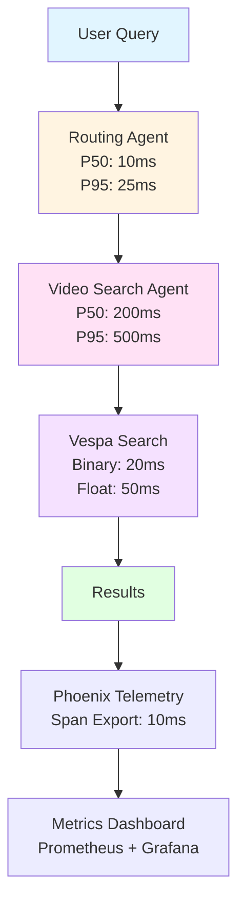
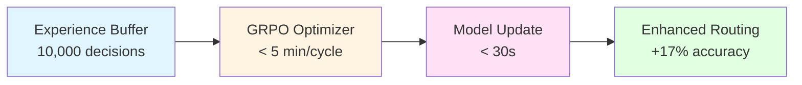
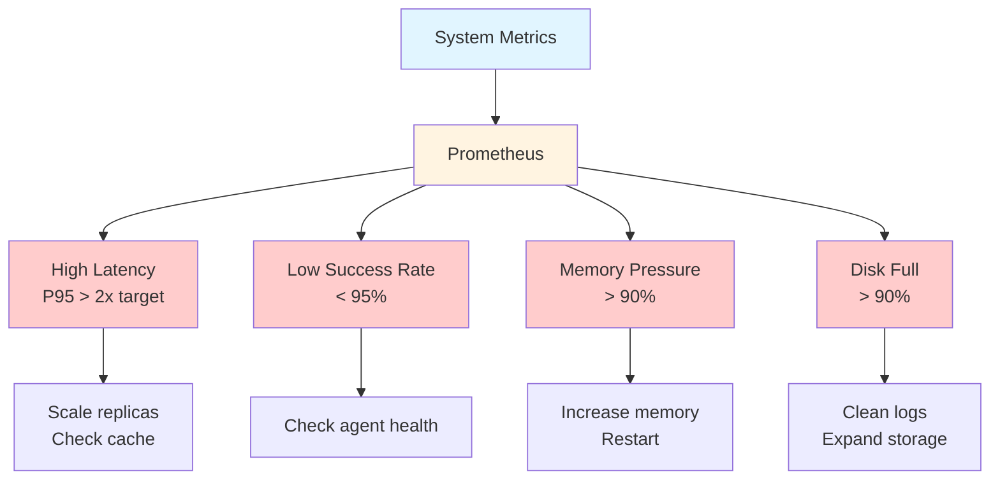
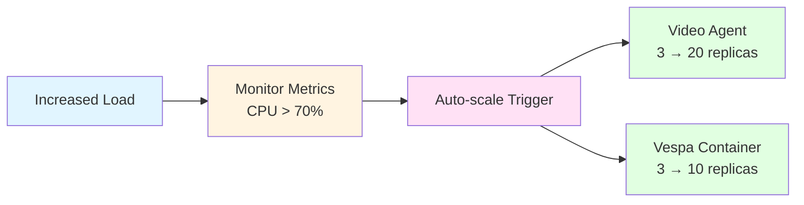

# Cogniverse Study Guide: Performance & Monitoring

**Last Updated:** 2025-11-13
**Architecture:** UV Workspace with 10 packages in layered architecture
**Module Path:** System-wide
**Purpose:** Performance benchmarks, targets, monitoring, and optimization strategies

---

## Module Overview

### Purpose
Comprehensive performance monitoring and optimization covering:
- **Performance Targets**: Latency, throughput, resource utilization
- **System Metrics**: Multi-agent orchestration, Vespa backend, embedding models
- **Monitoring Setup**: Prometheus, Grafana, Phoenix dashboards
- **Optimization**: GRPO/GEPA impact, caching strategies
- **Alerting**: Critical thresholds and degradation patterns

### Key Metrics Categories
- **Query Performance**: End-to-end latency, routing decisions
- **Ingestion Performance**: Video processing pipeline, embedding generation
- **Resource Utilization**: CPU, memory, disk, network
- **Search Quality**: MRR, NDCG, precision, recall

---

## Performance Targets

### Multi-Agent Orchestration

| Component | P50 Target | P95 Target | P99 Target |
|-----------|------------|------------|------------|
| **Composing Agent** | < 50ms | < 100ms | < 150ms |
| **Video Search Agent** | < 200ms | < 500ms | < 750ms |
| **Routing Decision** | < 10ms | < 25ms | < 50ms |
| **Result Aggregation** | < 20ms | < 50ms | < 100ms |

### Vespa Backend Performance

| Operation | P50 Target | P95 Target | P99 Target |
|-----------|------------|------------|------------|
| **BM25 Search** | < 10ms | < 25ms | < 50ms |
| **Float Embedding** | < 50ms | < 100ms | < 200ms |
| **Binary Embedding** | < 20ms | < 50ms | < 100ms |
| **Hybrid Ranking** | < 75ms | < 150ms | < 300ms |
| **Phased Ranking** | < 100ms | < 200ms | < 400ms |

---

## Performance Architecture



---

## Video Processing Pipeline

### Ingestion Performance

| Stage | Single Video | Batch (10) | Batch (100) |
|-------|--------------|------------|-------------|
| **Frame Extraction** | < 5s | < 30s | < 4 min |
| **Transcription** | < 10s | < 60s | < 8 min |
| **ColPali Embedding** | < 3s | < 20s | < 3 min |
| **VideoPrism Embedding** | < 8s | < 50s | < 7 min |
| **Vespa Ingestion** | < 2s | < 10s | < 90s |

### Embedding Model Performance

| Model | Dimensions | Inference Time | Memory |
|-------|------------|----------------|--------|
| **ColPali SmolVLM 500M** | 768 | < 100ms/frame | 2GB |
| **ColQwen2 Omni** | 768 | < 150ms/frame | 4GB |
| **VideoPrism Base** | 768 | < 200ms/chunk | 3GB |
| **VideoPrism LVT** | 1152 | < 300ms/chunk | 4GB |

---

## Query Performance

### End-to-End Latency


| Query Type | P50 | P95 | P99 |
|------------|-----|-----|-----|
| **Simple Text** | < 100ms | < 200ms | < 400ms |
| **Complex Multi-Modal** | < 300ms | < 600ms | < 1000ms |
| **With Visual Reranking** | < 500ms | < 1000ms | < 1500ms |
| **With Memory Lookup** | < 400ms | < 800ms | < 1200ms |

### Concurrent Load

| Metric | Target | Peak |
|--------|--------|------|
| **Queries Per Second** | 100 QPS | 200 QPS |
| **Concurrent Users** | 500 | 1000 |
| **Success Rate** | > 99% | > 95% |
| **Timeout Rate** | < 0.1% | < 1% |

---

## Optimization System Performance

### GRPO/GEPA Optimizer



| Metric | Target | Description |
|--------|--------|-------------|
| **Optimization Cycle** | < 5 min | Complete GRPO iteration |
| **Experience Buffer Size** | 10,000 | Routing decisions stored |
| **Batch Processing** | 1000/min | Experience replay rate |
| **Model Update** | < 30s | Routing model update time |

### DSPy Optimizer Performance

| Optimizer | Training Time | Memory | Convergence |
|-----------|--------------|--------|-------------|
| **Bootstrap** | < 10 min | 4GB | 10-20 iterations |
| **SIMBA** | < 30 min | 8GB | 50-100 iterations |
| **MIPRO** | < 60 min | 16GB | 100-200 iterations |
| **GEPA (Custom)** | < 5 min/cycle | 6GB | Continuous |

### Optimization Impact

| Metric | Baseline | Optimized | Improvement |
|--------|----------|-----------|-------------|
| **Routing Accuracy** | 75% | 92% | +17% |
| **Query Latency** | 500ms | 350ms | -30% |
| **Cache Hit Rate** | 20% | 45% | +125% |
| **Error Rate** | 5% | 1% | -80% |

---

## Memory System Performance

### Mem0 Operations

| Operation | P50 | P95 | P99 |
|-----------|-----|-----|-----|
| **Memory Add** | < 50ms | < 100ms | < 200ms |
| **Memory Search** | < 30ms | < 75ms | < 150ms |
| **Memory Update** | < 40ms | < 90ms | < 180ms |
| **Memory Delete** | < 20ms | < 50ms | < 100ms |

### Memory Storage

| Metric | Target | Maximum |
|--------|--------|---------|
| **Memories per User** | 1000 | 10,000 |
| **Memory Size** | 1KB | 10KB |
| **Total Storage** | 100GB | 1TB |
| **Retention Period** | 90 days | 365 days |

---

## Multi-Tenant Performance

### Tenant Isolation

| Metric | Target | Description |
|--------|--------|-------------|
| **Tenant Creation** | < 5s | Complete schema deployment |
| **Tenant Switch** | < 1ms | Context switching overhead |
| **Cross-Tenant Isolation** | 100% | Zero data leakage |
| **Concurrent Tenants** | 1000 | Active tenant limit |

### Per-Tenant Limits

| Resource | Default | Maximum |
|----------|---------|---------|
| **Documents** | 100,000 | 1,000,000 |
| **QPS** | 10 | 100 |
| **Storage** | 10GB | 100GB |
| **Memory Usage** | 1GB | 10GB |

---

## Phoenix Telemetry Performance

### Span Collection

| Metric | Target | Description |
|--------|--------|-------------|
| **Span Export** | < 10ms | Async export latency |
| **Batch Size** | 1000 | Spans per batch |
| **Export Interval** | 5s | Batch export frequency |
| **Span Storage** | 30 days | Retention period |

### Experiment Tracking

| Operation | Target | Description |
|-----------|--------|-------------|
| **Experiment Creation** | < 100ms | New experiment setup |
| **Result Recording** | < 50ms | Per-query result storage |
| **Dataset Upload** | < 1s/1000 rows | Bulk data ingestion |
| **Metric Computation** | < 500ms | Aggregate metrics calc |

---

## Resource Utilization

### System Resources

| Resource | Normal Load | Peak Load | Maximum |
|----------|-------------|-----------|---------|
| **CPU Usage** | < 40% | < 70% | < 90% |
| **Memory Usage** | < 8GB | < 16GB | < 32GB |
| **Disk I/O** | < 100MB/s | < 500MB/s | < 1GB/s |
| **Network I/O** | < 50MB/s | < 200MB/s | < 500MB/s |

### Container Resources

| Service | CPU Request | Memory Request | Replicas |
|---------|-------------|----------------|----------|
| **Composing Agent** | 2 cores | 4GB | 3 |
| **Video Search Agent** | 4 cores | 8GB | 5 |
| **Vespa Container** | 8 cores | 16GB | 3 |
| **Vespa Content** | 4 cores | 32GB | 5 |
| **Phoenix** | 2 cores | 4GB | 1 |
| **Mem0** | 2 cores | 4GB | 2 |

---

## Search Quality Metrics

### Reference-Based Evaluation

| Metric | Target | Description |
|--------|--------|-------------|
| **MRR@10** | > 0.8 | Mean Reciprocal Rank |
| **NDCG@10** | > 0.85 | Normalized DCG |
| **Precision@5** | > 0.75 | Top-5 precision |
| **Recall@10** | > 0.9 | Top-10 recall |

### Reference-Free Quality

| Metric | Target | Description |
|--------|--------|-------------|
| **Relevance Score** | > 0.8 | Semantic similarity |
| **Diversity Score** | > 0.6 | Result variety |
| **Distribution Score** | > 0.7 | Score separation |

---

## Monitoring & Alerting

### Critical Alerts



| Alert | Threshold | Action |
|-------|-----------|--------|
| **High Latency** | P95 > 2x target | Scale replicas, check cache |
| **Low Success Rate** | < 95% | Check agent health |
| **Memory Pressure** | > 90% usage | Increase memory, restart |
| **Disk Full** | > 90% usage | Clean logs, expand storage |

### Performance Degradation

| Metric | Warning | Critical |
|--------|---------|----------|
| **Query Latency** | +50% baseline | +100% baseline |
| **Error Rate** | > 2% | > 5% |
| **Cache Hit Rate** | < 30% | < 20% |
| **CPU Usage** | > 80% | > 95% |

---

## Scaling Targets

### Horizontal Scaling



| Component | Auto-scale Trigger | Min | Max |
|-----------|-------------------|-----|-----|
| **Composing Agent** | CPU > 70% | 2 | 10 |
| **Video Search Agent** | CPU > 70% | 3 | 20 |
| **Vespa Container** | QPS > 100 | 3 | 10 |
| **Vespa Content** | Storage > 80% | 3 | 20 |

---

## Performance Testing

### Load Testing

```bash
# 100 QPS sustained load test
locust -f tests/load/locust_multi_agent.py --users 100 --spawn-rate 10

# Stress test with 1000 concurrent users
locust -f tests/load/locust_stress.py --users 1000 --spawn-rate 50

# Endurance test (24 hours)
locust -f tests/load/locust_endurance.py --users 100 --run-time 24h
```

### Performance Benchmarks

```bash
# Video ingestion benchmark
uv run python benchmarks/ingestion_performance.py --videos 100

# Query latency benchmark
uv run python benchmarks/query_latency.py --queries 10000

# Optimization impact benchmark
uv run python benchmarks/optimization_impact.py --iterations 100
```

### Continuous Performance Monitoring

```bash
# Real-time dashboard
uv run streamlit run scripts/phoenix_dashboard_standalone.py

# Performance regression detection
uv run python scripts/performance_regression_check.py --baseline v1.0 --current HEAD

# Weekly performance report
uv run python scripts/generate_performance_report.py --period weekly
```

---

## Dashboard Setup

### Phoenix Dashboard

Access the Phoenix dashboard for telemetry and experiment tracking:

```bash
# Port-forward if running in Kubernetes
kubectl port-forward -n cogniverse svc/phoenix 6006:6006

# Open dashboard
open http://localhost:6006

# View tenant-specific traces
# Navigate to: cogniverse-{tenant_id}-video-search
```

### Grafana Dashboards

**Cogniverse Overview Dashboard:**
- Request rate (queries/sec)
- P50/P95/P99 latency
- Error rate by tenant
- Vespa query performance
- Agent routing distribution
- Phoenix experiment success rate

---

**Related Guides:**
- [00_ARCHITECTURE_OVERVIEW.md](./00_ARCHITECTURE_OVERVIEW.md) - System design
- [17_INSTRUMENTATION.md](./17_INSTRUMENTATION.md) - Observability patterns
- [19_SETUP_INSTALLATION.md](./19_SETUP_INSTALLATION.md) - Installation
- [21_DEPLOYMENT_GUIDE.md](./21_DEPLOYMENT_GUIDE.md) - Deployment

---

**Version History:**

| Version | Date | Changes |
|---------|------|---------|
| 2.0 | 2025-10-08 | Complete rewrite for multi-agent architecture |
| 1.5 | 2025-09-15 | Added DSPy optimization targets |
| 1.0 | 2025-08-01 | Initial performance targets |
