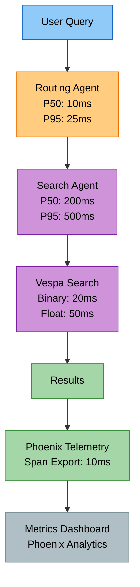
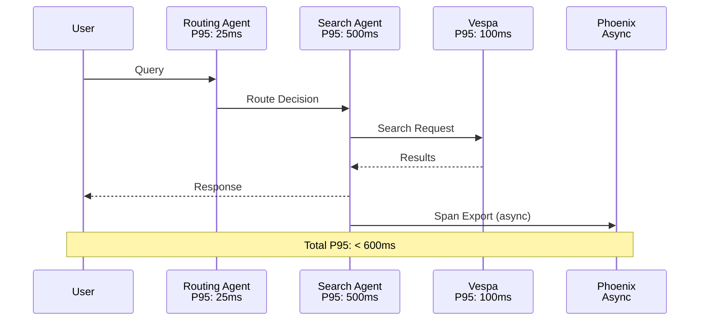
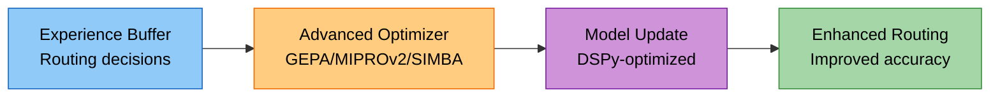
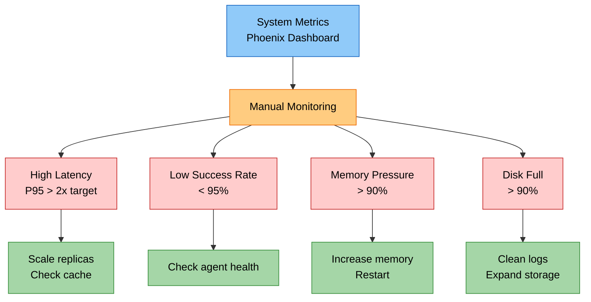
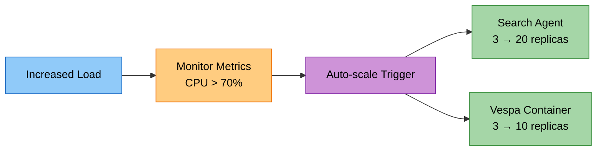

# Cogniverse Study Guide: Performance & Monitoring

**Module Path:** System-wide

---

## Module Overview

### Purpose
Comprehensive performance monitoring and optimization covering:

- **Performance Targets**: Latency, throughput, resource utilization

- **System Metrics**: Multi-agent orchestration, Vespa backend, embedding models

- **Monitoring Setup**: Phoenix dashboards for telemetry and experiment tracking

- **Optimization**: Advanced DSPy optimization (GEPA/MIPROv2/SIMBA), caching strategies

- **Alerting**: Performance degradation patterns and thresholds

### Key Metrics Categories
- **Query Performance**: End-to-end latency, routing decisions
- **Ingestion Performance**: Video processing pipeline, embedding generation
- **Resource Utilization**: CPU, memory, disk, network
- **Search Quality**: MRR, NDCG, precision, recall

---

## Performance Targets

> **Note**: These are aspirational targets. Actual performance depends on hardware, network conditions, embedding model selection, and query complexity. Use Phoenix dashboard to measure actual latencies in your environment.

### Multi-Agent Orchestration

| Component | P50 Target | P95 Target | P99 Target |
|-----------|------------|------------|------------|
| **Multi-Agent Orchestrator** | < 50ms | < 100ms | < 150ms |
| **Search Agent** | < 200ms | < 500ms | < 750ms |
| **Routing Decision** | < 10ms | < 25ms | < 50ms |
| **Result Aggregation** | < 20ms | < 50ms | < 100ms |

### Vespa Backend Performance

| Operation | P50 Target | P95 Target | P99 Target |
|-----------|------------|------------|------------|
| **BM25 Search** | < 10ms | < 25ms | < 50ms |
| **Float Embedding** | < 50ms | < 100ms | < 200ms |
| **Binary Embedding** | < 20ms | < 50ms | < 100ms |
| **Hybrid Ranking** | < 75ms | < 150ms | < 300ms |
| **Phased Ranking** | < 100ms | < 200ms | < 400ms |

---

## Performance Architecture



---

## Video Processing Pipeline

### Ingestion Performance

> **Note**: These are approximate targets based on typical hardware (M1/M2 Mac or similar). Actual performance varies significantly based on video duration, resolution, hardware, and selected embedding models.

| Stage | Single Video | Notes |
|-------|--------------|-------|
| **Frame Extraction** | Variable | Depends on video length, resolution, and keyframe extraction strategy |
| **Transcription** | Variable | Depends on audio length and Whisper model size |
| **ColPali Embedding** | Variable | Depends on number of frames/chunks and GPU availability |
| **VideoPrism Embedding** | Variable | Depends on number of chunks and GPU/TPU availability |
| **Vespa Ingestion** | Variable | Depends on batch size, document size, and network latency |

### Embedding Model Performance

| Model | Dimensions | Inference Time | Memory |
|-------|------------|----------------|--------|
| **ColPali SmolVLM 500M** | 128×1024 (patch-based) | Variable | 2GB |
| **ColQwen2 Omni** | 128×1024 (patch-based) | Variable | 4GB |
| **VideoPrism Base** | 768 or 1024 | Variable | 3GB |
| **VideoPrism LVT** | 768 or 1024 | Variable | 4GB |

> **Note**: Inference times are hardware-dependent and vary based on input size. ColPali and ColQwen use patch-based embeddings (1024 patches of 128 dimensions each). VideoPrism supports both 768 and 1024-dimensional outputs depending on configuration.

---

## Query Performance

### End-to-End Latency



| Query Type | P50 | P95 | P99 |
|------------|-----|-----|-----|
| **Simple Text** | < 100ms | < 200ms | < 400ms |
| **Complex Multi-Modal** | < 300ms | < 600ms | < 1000ms |
| **With Visual Reranking** | < 500ms | < 1000ms | < 1500ms |
| **With Memory Lookup** | < 400ms | < 800ms | < 1200ms |

### Concurrent Load

| Metric | Target | Peak |
|--------|--------|------|
| **Queries Per Second** | 100 QPS | 200 QPS |
| **Concurrent Users** | 500 | 1000 |
| **Success Rate** | > 99% | > 95% |
| **Timeout Rate** | < 0.1% | < 1% |

---

## Optimization System Performance

### Advanced Routing Optimizer (GEPA/MIPROv2/SIMBA)



| Metric | Target | Description |
|--------|--------|-------------|
| **Optimization Cycle** | Variable | Complete optimization iteration (depends on optimizer) |
| **Experience Buffer Size** | 1000 | Routing decisions stored (configurable) |
| **Batch Processing** | Variable | Experience replay rate (depends on dataset size) |
| **Model Update** | Variable | Routing model update time (depends on optimizer) |

### DSPy Optimizer Performance

| Optimizer | Training Time | Memory | Convergence |
|-----------|--------------|--------|-------------|
| **Bootstrap** | Variable | 4GB | 10-20 iterations |
| **SIMBA** | Variable | 8GB | 50-100 iterations |
| **MIPROv2** | Variable | 16GB | 100-200 iterations |
| **GEPA** | Variable | 6GB | Continuous |

> **Note**: Actual training time depends on dataset size, model complexity, and hardware. The optimizer is selected automatically based on dataset size thresholds (Bootstrap: <20, SIMBA: <50, MIPROv2: <100, GEPA: 200+).

### Optimization Impact

> **Note**: Impact metrics are targets and will vary based on dataset size, quality, and optimization configuration. Actual improvements depend on the amount of routing experience collected.

| Metric | Baseline | Target | Expected Improvement |
|--------|----------|--------|----------------------|
| **Routing Accuracy** | Varies | Improved | Depends on experience |
| **Query Latency** | Varies | Optimized | Caching reduces latency |
| **Cache Hit Rate** | Initial | Improved | Learning improves caching |
| **Error Rate** | Initial | Reduced | Better routing reduces errors |

---

## Memory System Performance

### Mem0 Operations

> **Note**: Mem0 memory system is implemented and uses Vespa backend. Performance depends on Vespa cluster configuration and embedding model (nomic-embed-text, 768 dimensions).

| Operation | Target | Description |
|-----------|--------|-------------|
| **Memory Add** | Variable | Depends on embedding generation + Vespa write |
| **Memory Search** | Variable | Depends on Vespa vector search performance |
| **Memory Update** | Variable | Depends on memory retrieval + update |
| **Memory Delete** | Variable | Depends on Vespa delete operation |

### Memory Storage

| Metric | Configuration | Description |
|--------|--------------|-------------|
| **Schema per Tenant** | Yes | Each tenant gets dedicated `agent_memories_{tenant_id}` schema |
| **Embedding Model** | nomic-embed-text | 768-dimensional embeddings |
| **Backend** | Vespa | Persistent storage with vector search |
| **Isolation** | Per-tenant | Complete memory isolation between tenants |

---

## Multi-Tenant Performance

> **Note**: Multi-tenant architecture is implemented with schema-per-tenant isolation in Vespa. Performance characteristics depend on Vespa cluster size and configuration.

### Tenant Isolation

| Metric | Target | Description |
|--------|--------|-------------|
| **Tenant Creation** | Variable | Complete schema deployment (depends on Vespa) |
| **Tenant Switch** | < 1ms | Context switching overhead (config lookup) |
| **Cross-Tenant Isolation** | 100% | Zero data leakage (enforced by schema isolation) |
| **Concurrent Tenants** | Variable | Limited by Vespa cluster resources |

### Per-Tenant Limits

> **Note**: These are example limits. Actual limits should be configured based on your deployment resources and requirements.

| Resource | Example Default | Example Maximum |
|----------|----------------|-----------------|
| **Documents** | 100,000 | 1,000,000 |
| **QPS** | 10 | 100 |
| **Storage** | 10GB | 100GB |
| **Memory Usage** | 1GB | 10GB |

---

## Phoenix Telemetry Performance

> **Note**: Phoenix telemetry is implemented using OpenTelemetry SDK. Actual performance depends on Phoenix server configuration and network conditions.

### Span Collection

| Metric | Configuration | Description |
|--------|--------------|-------------|
| **Span Export** | Async | Non-blocking async export |
| **Batch Size** | Configurable | Spans batched before export |
| **Export Interval** | Configurable | Batch export frequency |
| **Span Storage** | SQLite DB | Persistent storage in Phoenix |

### Experiment Tracking

> **Note**: Experiment tracking uses Phoenix SDK. Performance depends on dataset size and evaluation complexity.

| Operation | Characteristics | Description |
|-----------|----------------|-------------|
| **Experiment Creation** | Fast | New experiment setup via Phoenix API |
| **Result Recording** | Batched | Per-query result storage |
| **Dataset Upload** | Variable | Depends on dataset size and format |
| **Metric Computation** | Variable | Depends on metric complexity (MRR, NDCG, etc.) |

---

## Resource Utilization

### System Resources

| Resource | Normal Load | Peak Load | Maximum |
|----------|-------------|-----------|---------|
| **CPU Usage** | < 40% | < 70% | < 90% |
| **Memory Usage** | < 8GB | < 16GB | < 32GB |
| **Disk I/O** | < 100MB/s | < 500MB/s | < 1GB/s |
| **Network I/O** | < 50MB/s | < 200MB/s | < 500MB/s |

### Container Resources

| Service | CPU Request | Memory Request | Replicas |
|---------|-------------|----------------|----------|
| **Multi-Agent Orchestrator** | 2 cores | 4GB | 3 |
| **Search Agent** | 4 cores | 8GB | 5 |
| **Vespa Container** | 8 cores | 16GB | 3 |
| **Vespa Content** | 4 cores | 32GB | 5 |
| **Phoenix** | 2 cores | 4GB | 1 |

> **Note**: These are example resource allocations. Actual requirements depend on workload, concurrency, and embedding models used. Mem0 uses the same Vespa backend, so no separate deployment is needed.

---

## Search Quality Metrics

> **Note**: These are aspirational targets for search quality. Actual metrics depend on dataset quality, embedding model selection, and evaluation methodology. Use Phoenix experiments to measure actual performance on your queries.

### Reference-Based Evaluation

| Metric | Target | Description |
|--------|--------|-------------|
| **MRR@10** | > 0.8 | Mean Reciprocal Rank (requires ground truth) |
| **NDCG@10** | > 0.85 | Normalized DCG (requires relevance judgments) |
| **Precision@5** | > 0.75 | Top-5 precision (requires ground truth) |
| **Recall@10** | > 0.9 | Top-10 recall (requires complete relevance set) |

### Reference-Free Quality

| Metric | Target | Description |
|--------|--------|-------------|
| **Relevance Score** | > 0.8 | Semantic similarity |
| **Diversity Score** | > 0.6 | Result variety |
| **Distribution Score** | > 0.7 | Score separation |

---

## Monitoring & Alerting

> **Note**: Alerting infrastructure (Prometheus/Grafana) is not currently implemented. Monitoring is done via Phoenix dashboard and manual metrics inspection.

### Performance Degradation Patterns



| Issue Pattern | Threshold | Recommended Action |
|---------------|-----------|-------------------|
| **High Latency** | P95 > 2x target | Scale replicas, check cache |
| **Low Success Rate** | < 95% | Check agent health |
| **Memory Pressure** | > 90% usage | Increase memory, restart |
| **Disk Full** | > 90% usage | Clean logs, expand storage |

### Performance Degradation

| Metric | Warning | Critical |
|--------|---------|----------|
| **Query Latency** | +50% baseline | +100% baseline |
| **Error Rate** | > 2% | > 5% |
| **Cache Hit Rate** | < 30% | < 20% |
| **CPU Usage** | > 80% | > 95% |

---

## Scaling Targets

### Horizontal Scaling



| Component | Auto-scale Trigger | Min | Max |
|-----------|-------------------|-----|-----|
| **Multi-Agent Orchestrator** | CPU > 70% | 2 | 10 |
| **Search Agent** | CPU > 70% | 3 | 20 |
| **Vespa Container** | QPS > 100 | 3 | 10 |
| **Vespa Content** | Storage > 80% | 3 | 20 |

---

## Performance Testing

### Load Testing

Load testing suite: `tests/routing/integration/test_production_load.py` — covers 100 QPS throughput, concurrent request handling, sustained load, and latency percentile validation.

### Performance Benchmarks

```bash
# Video ingestion - use integration test with timing
JAX_PLATFORM_NAME=cpu uv run pytest tests/ingestion/integration/ -v -k "ingestion" --durations=0

# Query latency - use search tests with timing
JAX_PLATFORM_NAME=cpu uv run pytest tests/agents/integration/ -v -k "search" --durations=0
```

### Continuous Performance Monitoring

```bash
# Real-time dashboard
uv run streamlit run scripts/phoenix_dashboard_standalone.py
```

---

## Dashboard Setup

### Phoenix Dashboard

Access the Phoenix dashboard for telemetry and experiment tracking:

```bash
# Port-forward if running in Kubernetes
kubectl port-forward -n cogniverse svc/phoenix 6006:6006

# Open dashboard
open http://localhost:6006

# View tenant-specific traces
# Navigate to: cogniverse-{tenant_id}-video-search
```

**Available Views:**

- Trace timeline and spans

- Request rate and latency metrics

- Error tracking by tenant

- Experiment tracking and evaluation

- Agent routing decisions

- Search quality metrics (MRR, NDCG)

> **Note**: Grafana integration is not currently implemented. All monitoring is done through Phoenix dashboard.

---

**Related Guides:**

- [Architecture Overview](../architecture/overview.md) - System design

- [Instrumentation](../development/instrumentation.md) - Observability patterns

- [Deployment Guide](../modal/deployment_guide.md) - Deployment

---

**Version History:**

| Version | Date | Changes |
|---------|------|---------|
| 3.0 | 2026-02-04 | Updated component names, clarified aspirational vs actual metrics |
| 2.0 | 2025-10-08 | Complete rewrite for multi-agent architecture |
| 1.5 | 2025-09-15 | Added DSPy optimization targets |
| 1.0 | 2025-08-01 | Initial performance targets |
