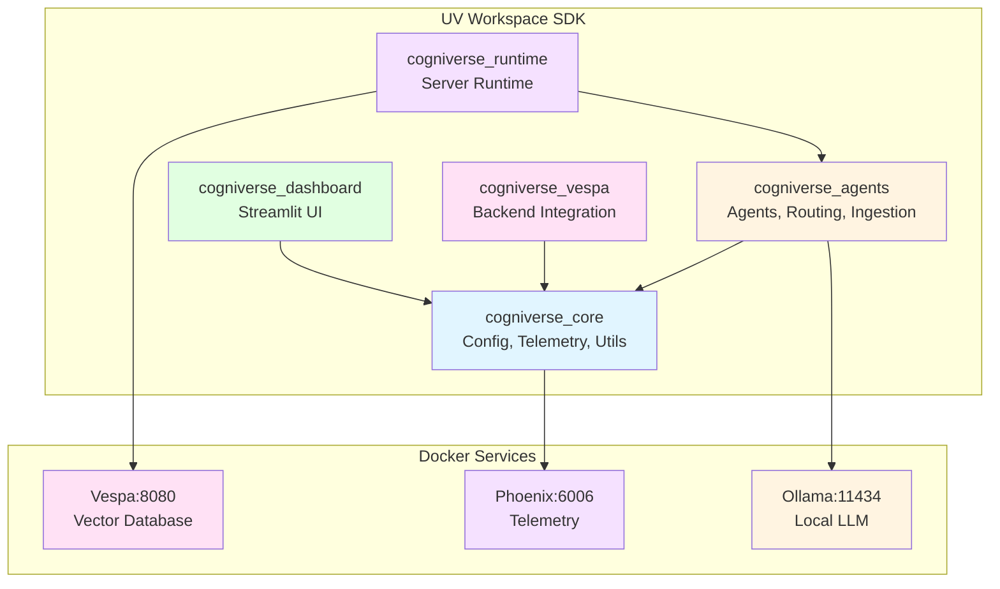

# Cogniverse Study Guide: Setup & Installation

**Last Updated:** 2025-10-15
**Architecture:** UV Workspace with 5 SDK packages
**Purpose:** Complete installation and setup guide for Cogniverse multi-agent RAG system

---

## Prerequisites

### System Requirements
- **Python**: 3.12+ (required for compatibility)
- **Memory**: 16GB RAM minimum (32GB recommended)
- **Storage**: 20GB+ disk space
- **GPU**: CUDA-capable GPU optional (recommended for video processing)
- **OS**: Linux, macOS, or Windows with WSL2

### Required Software
- **Docker**: For Vespa, Phoenix, and Ollama containers
- **Git**: For repository management
- **uv**: Python package manager (required for workspace support)

---

## Quick Start Installation

### 1. Clone Repository

```bash
git clone <repository-url>
cd cogniverse
```

### 2. Install Python Dependencies

```bash
# Install uv if not already installed
pip install uv

# Sync all workspace packages (installs all 5 SDK packages)
uv sync

# This installs:
# - cogniverse_core (libs/core/)
# - cogniverse_agents (libs/agents/)
# - cogniverse_vespa (libs/vespa/)
# - cogniverse_runtime (libs/runtime/)
# - cogniverse_dashboard (libs/dashboard/)
```

**Note:** `uv sync` handles the entire UV workspace, installing all packages and their dependencies in editable mode.

### 3. Start Core Services

```bash
# Start Vespa (vector database)
docker run -d --name vespa \
  -p 8080:8080 -p 19071:19071 \
  -v vespa-data:/opt/vespa/var \
  vespaengine/vespa:latest

# Start Phoenix (telemetry)
docker run -d --name phoenix \
  -p 6006:6006 -p 4317:4317 \
  -v phoenix-data:/data \
  -e PHOENIX_WORKING_DIR=/data \
  arizephoenix/phoenix:latest

# Start Ollama (local LLM)
docker run -d --name ollama \
  -p 11434:11434 \
  -v ollama-data:/root/.ollama \
  ollama/ollama:latest
```

### 4. Pull Required Models

```bash
# Pull Ollama models
docker exec ollama ollama pull llama3.2
docker exec ollama ollama pull nomic-embed-text
```

### 5. Verify Installation

```bash
# Check Vespa
curl http://localhost:8080/ApplicationStatus

# Check Phoenix
curl http://localhost:6006/health

# Check Ollama
curl http://localhost:11434/api/tags
```

---

## UV Workspace Structure

Cogniverse uses a **UV workspace** with 5 independent SDK packages:

```
cogniverse/
├── libs/
│   ├── core/              # cogniverse_core
│   │   ├── pyproject.toml
│   │   └── cogniverse_core/
│   │       ├── config/    # Configuration management
│   │       ├── telemetry/ # Phoenix telemetry
│   │       ├── evaluation/# Experiment tracking
│   │       └── common/    # Utilities, cache, memory
│   ├── agents/            # cogniverse_agents
│   │   ├── pyproject.toml
│   │   └── cogniverse_agents/
│   │       ├── agents/    # Agent implementations
│   │       ├── routing/   # Query routing
│   │       ├── ingestion/ # Video processing
│   │       ├── search/    # Search & reranking
│   │       └── tools/     # A2A tools
│   ├── vespa/             # cogniverse_vespa
│   │   ├── pyproject.toml
│   │   └── cogniverse_vespa/
│   │       └── backends/  # Vespa integration
│   ├── runtime/           # cogniverse_runtime
│   │   ├── pyproject.toml
│   │   └── cogniverse_runtime/
│   │       └── server/    # Runtime server
│   └── dashboard/         # cogniverse_dashboard
│       ├── pyproject.toml
│       └── cogniverse_dashboard/
│           └── ui/        # Streamlit dashboard
├── pyproject.toml         # Workspace root
└── uv.lock                # Unified lockfile
```

**Benefits:**
- **Independent versioning**: Each package can be released separately
- **Clear dependencies**: Package boundaries enforce clean architecture
- **Modular deployment**: Install only what you need
- **Better IDE support**: Clear module boundaries

---

## Service Architecture



---

## Service Ports

| Service | Port | Purpose |
|---------|------|---------|
| **Vespa HTTP** | 8080 | Document feed & search |
| **Vespa Config** | 19071 | Schema deployment |
| **Phoenix Web** | 6006 | Dashboard & experiments |
| **Phoenix Collector** | 4317 | OTLP span collection (gRPC) |
| **Ollama** | 11434 | LLM inference API |

---

## Environment Configuration

Create `.env` file in the workspace root:

```bash
cat > .env <<EOF
# Environment
ENVIRONMENT=development
LOG_LEVEL=DEBUG

# Tenant Configuration
DEFAULT_TENANT_ID=default

# Vespa
VESPA_HOST=localhost
VESPA_PORT=8080
VESPA_CONFIG_PORT=19071

# Phoenix
PHOENIX_ENABLED=true
PHOENIX_COLLECTOR_ENDPOINT=localhost:4317

# Ollama
OLLAMA_BASE_URL=http://localhost:11434

# JAX (for VideoPrism)
JAX_PLATFORM_NAME=cpu
EOF
```

**Multi-Tenant Note:** Each tenant uses schema-per-tenant isolation in Vespa. The system automatically creates isolated schemas per tenant.

---

## Post-Installation Setup

### 1. Verify Workspace Installation

```bash
# List installed packages
uv pip list | grep cogniverse

# Expected output:
# cogniverse-core         0.1.0
# cogniverse-agents       0.1.0
# cogniverse-vespa        0.1.0
# cogniverse-runtime      0.1.0
# cogniverse-dashboard    0.1.0
```

### 2. Deploy Vespa Schemas

```bash
# Deploy ColPali frame-based schema for default tenant
JAX_PLATFORM_NAME=cpu uv run python scripts/deploy_json_schema.py \
  --schema-path configs/schemas/video_colpali_smol500_mv_frame.json \
  --tenant-id default

# Deploy additional schemas for multi-tenant setup
JAX_PLATFORM_NAME=cpu uv run python scripts/deploy_json_schema.py \
  --schema-path configs/schemas/video_videoprism_base_mv_chunk_30s.json \
  --tenant-id acme
```

### 3. Run Test Ingestion

```bash
# Ingest sample videos (default tenant)
JAX_PLATFORM_NAME=cpu uv run python scripts/run_ingestion.py \
  --video_dir data/testset/evaluation/sample_videos \
  --backend vespa \
  --profile video_colpali_smol500_mv_frame \
  --tenant-id default
```

### 4. Verify End-to-End

```bash
# Run comprehensive test suite
JAX_PLATFORM_NAME=cpu timeout 7200 uv run pytest \
  tests/memory/ \
  tests/ingestion/ \
  tests/evaluation/ \
  tests/routing/ \
  -v --tb=line
```

---

##Troubleshooting

### Vespa Connection Issues

```bash
# Check Vespa health
curl http://localhost:8080/state/v1/health

# Restart Vespa
docker restart vespa

# Check logs
docker logs vespa
```

### Phoenix Not Recording Spans

```bash
# Check Phoenix is running
docker ps | grep phoenix

# Verify endpoint
echo $PHOENIX_COLLECTOR_ENDPOINT

# Check Phoenix logs
docker logs phoenix
```

### Ollama Model Issues

```bash
# List installed models
docker exec ollama ollama list

# Remove and re-pull model
docker exec ollama ollama rm llama3.2
docker exec ollama ollama pull llama3.2
```

---

## Advanced Installation Options

### Installing Individual Packages

```bash
# Install only core package
cd libs/core
uv pip install -e .

# Install agents package (automatically installs core as dependency)
cd libs/agents
uv pip install -e .

# Install all packages in development mode
uv sync --all-extras
```

### Development Installation

```bash
# Install with development dependencies
uv sync --all-extras --dev

# Install pre-commit hooks
uv run pre-commit install

# Run code quality checks
uv run ruff check .
uv run ruff format .
```

### Package Import Verification

```python
# Verify package imports work correctly
python -c "
from cogniverse_core.config.unified_config import SystemConfig
from cogniverse_core.telemetry import TelemetryManager
from cogniverse_agents.routing.config import RoutingConfig
from cogniverse_agents.agents.base_agent import BaseAgent
from cogniverse_vespa.backends.vespa_backend import VespaBackend
print('✅ All imports successful!')
"
```

---

## Workspace Management

### Adding New Dependencies

```bash
# Add dependency to core package
cd libs/core
uv add <package-name>

# Add dependency to agents package
cd libs/agents
uv add <package-name>

# Sync workspace after changes
cd ../..
uv sync
```

### Updating Dependencies

```bash
# Update all packages
uv sync --upgrade

# Update specific package
uv pip install --upgrade <package-name>

# Regenerate lockfile
uv lock --upgrade
```

### Building Distribution Packages

```bash
# Build all packages
for dir in libs/*/; do
  (cd "$dir" && uv build)
done

# Build specific package
cd libs/core
uv build

# Output: dist/cogniverse_core-0.1.0-py3-none-any.whl
```

---

## Common Import Patterns

After installation, use these import patterns:

```python
# Configuration
from cogniverse_core.config.unified_config import SystemConfig, RoutingConfigUnified

# Telemetry
from cogniverse_core.telemetry import TelemetryManager, TelemetryConfig

# Memory
from cogniverse_core.common.memory.mem0_memory_manager import Mem0MemoryManager

# Agents
from cogniverse_agents.agents.routing_agent import RoutingAgent
from cogniverse_agents.agents.video_search_agent import VideoSearchAgent

# Routing
from cogniverse_agents.routing.config import RoutingConfig
from cogniverse_agents.routing.strategies import GLiNERRoutingStrategy

# Ingestion
from cogniverse_agents.ingestion.pipeline import VideoIngestionPipeline

# Backend
from cogniverse_vespa.backends.vespa_backend import VespaBackend
```

---

## Troubleshooting

### Workspace Issues

```bash
# Clear UV cache
uv cache clean

# Reinstall workspace
rm -rf .venv uv.lock
uv sync

# Verify package locations
uv pip show cogniverse-core
uv pip show cogniverse-agents
```

### Import Errors

If you see `ModuleNotFoundError: No module named 'cogniverse_core'`:

```bash
# Ensure you're using the workspace virtual environment
source .venv/bin/activate  # Linux/macOS
# or
.venv\Scripts\activate     # Windows

# Verify packages are installed
uv pip list | grep cogniverse

# Reinstall in editable mode
uv sync
```

### Path Issues

If imports don't work, check your Python path:

```python
import sys
print('\n'.join(sys.path))

# Should include paths like:
# /path/to/cogniverse/libs/core
# /path/to/cogniverse/libs/agents
```

---

## Next Steps

- **SDK Architecture**: See [docs/architecture/sdk-architecture.md](../architecture/sdk-architecture.md)
- **Multi-Tenant Setup**: See [docs/architecture/multi-tenant.md](../architecture/multi-tenant.md)
- **Configuration**: See [docs/operations/configuration.md](./configuration.md)
- **Deployment**: See [docs/operations/deployment.md](./deployment.md)
