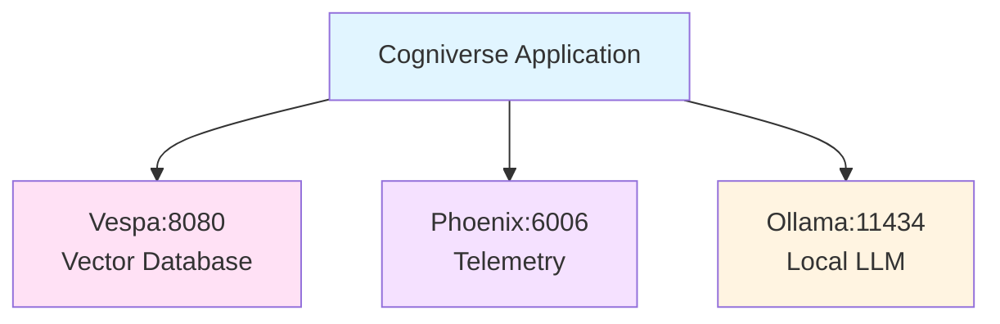

# Cogniverse Study Guide: Setup & Installation

**Last Updated:** 2025-10-08
**Module Path:** System-wide
**Purpose:** Complete installation and setup guide for Cogniverse multi-agent RAG system

---

## Prerequisites

### System Requirements
- **Python**: 3.12+ (required for compatibility)
- **Memory**: 16GB RAM minimum (32GB recommended)
- **Storage**: 20GB+ disk space
- **GPU**: CUDA-capable GPU optional (recommended for video processing)
- **OS**: Linux, macOS, or Windows with WSL2

### Required Software
- **Docker**: For Vespa, Phoenix, and Ollama containers
- **Git**: For repository management
- **uv** or **pip**: Python package manager

---

## Quick Start Installation

### 1. Clone Repository

```bash
git clone <repository-url>
cd cogniverse
```

### 2. Install Python Dependencies

```bash
# Using uv (recommended - faster)
pip install uv
uv sync

# Or using pip
pip install -r requirements.txt
```

### 3. Start Core Services

```bash
# Start Vespa (vector database)
docker run -d --name vespa \
  -p 8080:8080 -p 19071:19071 \
  -v vespa-data:/opt/vespa/var \
  vespaengine/vespa:latest

# Start Phoenix (telemetry)
docker run -d --name phoenix \
  -p 6006:6006 -p 4317:4317 \
  -v phoenix-data:/data \
  -e PHOENIX_WORKING_DIR=/data \
  arizephoenix/phoenix:latest

# Start Ollama (local LLM)
docker run -d --name ollama \
  -p 11434:11434 \
  -v ollama-data:/root/.ollama \
  ollama/ollama:latest
```

### 4. Pull Required Models

```bash
# Pull Ollama models
docker exec ollama ollama pull llama3.2
docker exec ollama ollama pull nomic-embed-text
```

### 5. Verify Installation

```bash
# Check Vespa
curl http://localhost:8080/ApplicationStatus

# Check Phoenix
curl http://localhost:6006/health

# Check Ollama
curl http://localhost:11434/api/tags
```

---

## Service Architecture



---

## Service Ports

| Service | Port | Purpose |
|---------|------|---------|
| **Vespa HTTP** | 8080 | Document feed & search |
| **Vespa Config** | 19071 | Schema deployment |
| **Phoenix Web** | 6006 | Dashboard & experiments |
| **Phoenix Collector** | 4317 | OTLP span collection (gRPC) |
| **Ollama** | 11434 | LLM inference API |

---

## Environment Configuration

Create `.env` file:

```bash
cat > .env <<EOF
# Environment
ENVIRONMENT=development
LOG_LEVEL=DEBUG

# Vespa
VESPA_HOST=localhost
VESPA_PORT=8080

# Phoenix
PHOENIX_ENABLED=true
PHOENIX_COLLECTOR_ENDPOINT=localhost:4317

# Ollama
OLLAMA_BASE_URL=http://localhost:11434

# JAX (for VideoPrism)
JAX_PLATFORM_NAME=cpu
EOF
```

---

## Post-Installation Setup

### 1. Deploy Vespa Schemas

```bash
# Deploy ColPali frame-based schema
JAX_PLATFORM_NAME=cpu uv run python scripts/deploy_json_schema.py \
  --schema-path configs/schemas/video_colpali_smol500_mv_frame.json
```

### 2. Run Test Ingestion

```bash
# Ingest sample videos
JAX_PLATFORM_NAME=cpu uv run python scripts/run_ingestion.py \
  --video_dir data/testset/evaluation/sample_videos \
  --backend vespa \
  --profile video_colpali_smol500_mv_frame
```

### 3. Verify End-to-End

```bash
# Run system tests
JAX_PLATFORM_NAME=cpu uv run pytest tests/system/ -v
```

---

##Troubleshooting

### Vespa Connection Issues

```bash
# Check Vespa health
curl http://localhost:8080/state/v1/health

# Restart Vespa
docker restart vespa

# Check logs
docker logs vespa
```

### Phoenix Not Recording Spans

```bash
# Check Phoenix is running
docker ps | grep phoenix

# Verify endpoint
echo $PHOENIX_COLLECTOR_ENDPOINT

# Check Phoenix logs
docker logs phoenix
```

### Ollama Model Issues

```bash
# List installed models
docker exec ollama ollama list

# Remove and re-pull model
docker exec ollama ollama rm llama3.2
docker exec ollama ollama pull llama3.2
```

---

## Next Steps

- **Configuration**: See [20_CONFIGURATION_MANAGEMENT.md](./20_CONFIGURATION_MANAGEMENT.md)
- **Deployment**: See [21_DEPLOYMENT_GUIDE.md](./21_DEPLOYMENT_GUIDE.md)
- **Architecture**: See [00_ARCHITECTURE_OVERVIEW.md](./00_ARCHITECTURE_OVERVIEW.md)
