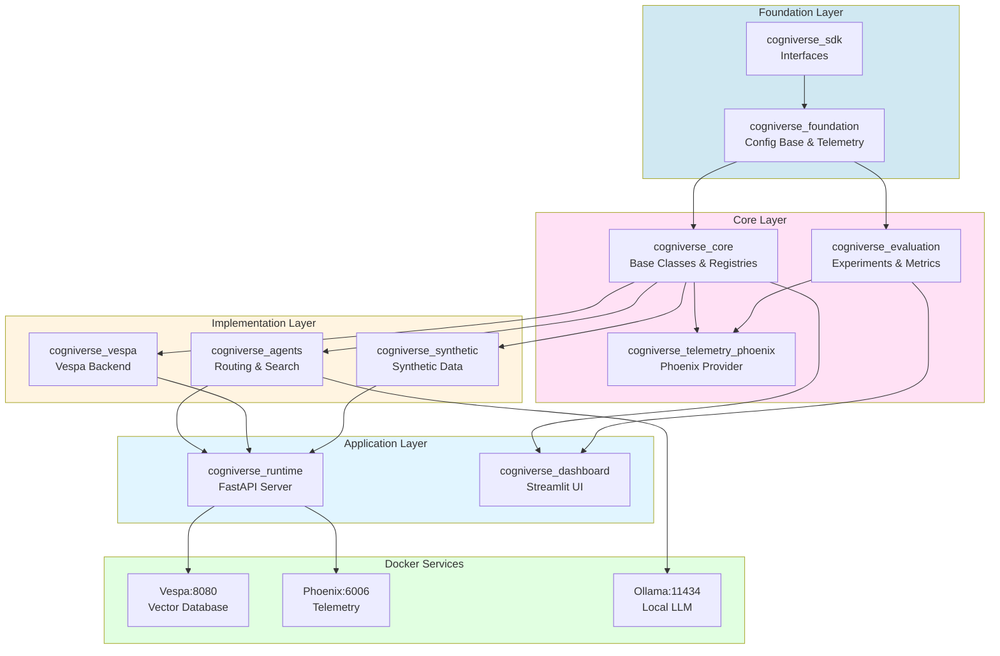

# Cogniverse Setup & Installation Guide

**Last Updated:** 2026-01-25
**Architecture:** UV Workspace with 11 packages in layered architecture
**Purpose:** Production-ready installation and setup guide for Cogniverse multi-agent AI platform

---

## Prerequisites

### System Requirements
- **Python**: 3.12+ (required for compatibility)
- **Memory**: 16GB RAM minimum (32GB recommended)
- **Storage**: 20GB+ disk space
- **GPU**: CUDA-capable GPU optional (recommended for video processing)
- **OS**: Linux, macOS, or Windows with WSL2

### Required Software
- **Docker**: For Vespa, Phoenix, and Ollama containers
- **Git**: For repository management
- **uv**: Python package manager (required for workspace support)

---

## Quick Start Installation

### 1. Clone Repository

```bash
git clone <repository-url>
cd cogniverse
```

### 2. Install Python Dependencies

```bash
# Install uv if not already installed
pip install uv

# Sync all workspace packages (installs all 10 SDK packages)
uv sync

# This installs:
# Foundation Layer:
# - cogniverse_sdk (libs/sdk/)
# - cogniverse_foundation (libs/foundation/)
# Core Layer:
# - cogniverse_core (libs/core/)
# - cogniverse_evaluation (libs/evaluation/)
# - cogniverse_telemetry_phoenix (libs/telemetry-phoenix/)
# Implementation Layer:
# - cogniverse_agents (libs/agents/)
# - cogniverse_vespa (libs/vespa/)
# - cogniverse_synthetic (libs/synthetic/)
# Application Layer:
# - cogniverse_runtime (libs/runtime/)
# - cogniverse_dashboard (libs/dashboard/)
```

**Note:** `uv sync` handles the entire UV workspace, installing all packages and their dependencies in editable mode.

### 3. Start Core Services

```bash
# Start Vespa (vector database)
docker run -d --name vespa \
  -p 8080:8080 -p 19071:19071 \
  -v vespa-data:/opt/vespa/var \
  vespaengine/vespa:latest

# Start Phoenix (telemetry)
docker run -d --name phoenix \
  -p 6006:6006 -p 4317:4317 \
  -v phoenix-data:/data \
  -e PHOENIX_WORKING_DIR=/data \
  arizephoenix/phoenix:latest

# Start Ollama (local LLM)
docker run -d --name ollama \
  -p 11434:11434 \
  -v ollama-data:/root/.ollama \
  ollama/ollama:latest
```

### 4. Pull Required Models

```bash
# Pull Ollama models
docker exec ollama ollama pull llama3.2
docker exec ollama ollama pull nomic-embed-text
```

### 5. Verify Installation

```bash
# Check Vespa
curl http://localhost:8080/ApplicationStatus

# Check Phoenix
curl http://localhost:6006/health

# Check Ollama
curl http://localhost:11434/api/tags
```

---

## UV Workspace Structure

Cogniverse uses a **UV workspace** with 11 packages in layered architecture:

```
cogniverse/
├── libs/                         # SDK Packages (UV workspace - 11 packages)
│   # FOUNDATION LAYER (Pure Interfaces)
│   ├── sdk/                      # cogniverse_sdk
│   │   ├── pyproject.toml
│   │   └── cogniverse_sdk/
│   │       ├── interfaces/       # Backend, ConfigStore, SchemaLoader interfaces
│   │       └── document.py       # Universal document model
│   ├── foundation/               # cogniverse_foundation
│   │   ├── pyproject.toml
│   │   └── cogniverse_foundation/
│   │       ├── config/           # Configuration base classes
│   │       └── telemetry/        # Telemetry interfaces
│   # CORE LAYER
│   ├── core/                     # cogniverse_core
│   │   ├── pyproject.toml
│   │   └── cogniverse_core/
│   │       ├── agents/           # Base agent classes
│   │       ├── common/           # Shared utilities
│   │       ├── registries/       # Component registries
│   │       └── memory/           # Memory management
│   ├── evaluation/               # cogniverse_evaluation
│   │   ├── pyproject.toml
│   │   └── cogniverse_evaluation/
│   │       ├── experiments/      # Experiment management
│   │       ├── metrics/          # Provider-agnostic metrics
│   │       └── datasets/         # Dataset handling
│   ├── telemetry-phoenix/        # cogniverse_telemetry_phoenix (Plugin)
│   │   ├── pyproject.toml
│   │   └── cogniverse_telemetry_phoenix/
│   │       ├── provider.py       # Phoenix telemetry provider
│   │       └── evaluation/       # Phoenix evaluation provider
│   # IMPLEMENTATION LAYER
│   ├── agents/                   # cogniverse_agents
│   │   ├── pyproject.toml
│   │   └── cogniverse_agents/
│   │       ├── routing/          # DSPy routing & optimization
│   │       ├── search/           # Multi-modal search & reranking
│   │       └── tools/            # A2A tools
│   ├── vespa/                    # cogniverse_vespa
│   │   ├── pyproject.toml
│   │   └── cogniverse_vespa/
│   │       ├── backends/         # Vespa backend (tenant schemas)
│   │       └── schema/           # Schema management
│   ├── synthetic/                # cogniverse_synthetic
│   │   ├── pyproject.toml
│   │   └── cogniverse_synthetic/
│   │       ├── generators/       # Synthetic data generators
│   │       └── service.py        # Synthetic data service
│   # APPLICATION LAYER
│   ├── runtime/                  # cogniverse_runtime
│   │   ├── pyproject.toml
│   │   └── cogniverse_runtime/
│   │       ├── server/           # FastAPI server
│   │       └── ingestion/        # Video processing pipeline
│   └── dashboard/                # cogniverse_dashboard
│       ├── pyproject.toml
│       └── cogniverse_dashboard/
│           ├── phoenix/          # Phoenix dashboards
│           └── streamlit/        # Streamlit UI
├── pyproject.toml                # Workspace root
└── uv.lock                       # Unified lockfile
```

**Benefits:**
- **Layered Architecture**: Clear separation between foundation, core, implementation, and application layers
- **Independent versioning**: Each package can be released separately
- **Clear dependencies**: Package boundaries enforce clean architecture
- **Modular deployment**: Install only what you need
- **Better IDE support**: Clear module boundaries
- **Plugin Architecture**: Telemetry providers via entry points

---

## Service Architecture



---

## Service Ports

| Service | Port | Purpose |
|---------|------|---------|
| **Vespa HTTP** | 8080 | Document feed & search |
| **Vespa Config** | 19071 | Schema deployment |
| **Phoenix Web** | 6006 | Dashboard & experiments |
| **Phoenix Collector** | 4317 | OTLP span collection (gRPC) |
| **Ollama** | 11434 | LLM inference API |

---

## Environment Configuration

Create `.env` file in the workspace root:

```bash
cat > .env <<EOF
# Environment
ENVIRONMENT=development
LOG_LEVEL=DEBUG

# Tenant Configuration
DEFAULT_TENANT_ID=default

# Vespa
VESPA_HOST=localhost
VESPA_PORT=8080
VESPA_CONFIG_PORT=19071

# Phoenix
PHOENIX_ENABLED=true
PHOENIX_COLLECTOR_ENDPOINT=localhost:4317

# Ollama
OLLAMA_BASE_URL=http://localhost:11434

# JAX (for VideoPrism)
JAX_PLATFORM_NAME=cpu
EOF
```

**Multi-Tenant Note:** Each tenant uses schema-per-tenant isolation in Vespa. The system automatically creates isolated schemas per tenant.

**Multi-Modal Support:** Cogniverse supports six content types:
- **VIDEO**: Frame-based (ColPali) and chunk-based (VideoPrism) processing
- **AUDIO**: Speech and audio analysis extracted from video
- **IMAGE**: Visual similarity search with ColQwen2 or ColPali
- **DOCUMENT**: PDF, DOCX processing with vision models
- **TEXT**: Natural language processing with text embeddings
- **DATAFRAME**: Tabular data (CSV, Excel) with text representation

---

## Post-Installation Setup

### 1. Verify Workspace Installation

```bash
# List installed packages
uv pip list | grep cogniverse

# Expected output (all 11 packages):
# cogniverse-sdk                 0.1.0
# cogniverse-foundation          0.1.0
# cogniverse-core                0.1.0
# cogniverse-evaluation          0.1.0
# cogniverse-telemetry-phoenix   0.1.0
# cogniverse-agents              0.1.0
# cogniverse-vespa               0.1.0
# cogniverse-synthetic           0.1.0
# cogniverse-runtime             0.1.0
# cogniverse-dashboard           0.1.0
```

### 2. Deploy Vespa Schemas

```bash
# Deploy ColPali frame-based schema for default tenant
JAX_PLATFORM_NAME=cpu uv run python scripts/deploy_json_schema.py \
  --schema-path configs/schemas/video_colpali_smol500_mv_frame.json \
  --tenant-id default

# Deploy additional schemas for multi-tenant setup
JAX_PLATFORM_NAME=cpu uv run python scripts/deploy_json_schema.py \
  --schema-path configs/schemas/video_videoprism_base_mv_chunk_30s.json \
  --tenant-id acme
```

### 3. Run Test Ingestion

```bash
# Ingest sample videos (default tenant)
JAX_PLATFORM_NAME=cpu uv run python scripts/run_ingestion.py \
  --video_dir data/testset/evaluation/sample_videos \
  --backend vespa \
  --profile video_colpali_smol500_mv_frame \
  --tenant-id default
```

### 4. Verify End-to-End

```bash
# Run comprehensive test suite
JAX_PLATFORM_NAME=cpu timeout 7200 uv run pytest \
  tests/memory/ \
  tests/ingestion/ \
  tests/evaluation/ \
  tests/routing/ \
  -v --tb=line
```

---

##Troubleshooting

### Vespa Connection Issues

```bash
# Check Vespa health
curl http://localhost:8080/state/v1/health

# Restart Vespa
docker restart vespa

# Check logs
docker logs vespa
```

### Phoenix Not Recording Spans

```bash
# Check Phoenix is running
docker ps | grep phoenix

# Verify endpoint
echo $PHOENIX_COLLECTOR_ENDPOINT

# Check Phoenix logs
docker logs phoenix
```

### Ollama Model Issues

```bash
# List installed models
docker exec ollama ollama list

# Remove and re-pull model
docker exec ollama ollama rm llama3.2
docker exec ollama ollama pull llama3.2
```

---

## Advanced Installation Options

### Installing Individual Packages

```bash
# Install only core package
cd libs/core
uv pip install -e .

# Install agents package (automatically installs core as dependency)
cd libs/agents
uv pip install -e .

# Install all packages in development mode
uv sync --all-extras
```

### Development Installation

```bash
# Install with development dependencies
uv sync --all-extras --dev

# Install pre-commit hooks
uv run pre-commit install

# Run code quality checks
uv run ruff check .
uv run ruff format .
```

### Package Import Verification

```python
# Verify package imports work correctly for all 11 packages
python -c "
# Foundation Layer
from cogniverse_sdk.interfaces.backend import Backend
from cogniverse_sdk.document import Document
from cogniverse_foundation.config.unified_config import BaseConfig
from cogniverse_foundation.telemetry.providers.base import TelemetryProvider

# Core Layer
from cogniverse_core.agents.base_agent import BaseAgent
from cogniverse_core.config.unified_config import SystemConfig
from cogniverse_evaluation.experiments.experiment import Experiment
from cogniverse_evaluation.metrics.accuracy import AccuracyMetric
from cogniverse_telemetry_phoenix.provider import PhoenixProvider

# Implementation Layer
from cogniverse_agents.routing.routing_agent import RoutingAgent
from cogniverse_vespa.tenant.tenant_schema_manager import TenantSchemaManager
from cogniverse_synthetic.service import SyntheticDataService

# Application Layer
from cogniverse_runtime.main import app
from cogniverse_dashboard.app import run_dashboard

print('✅ All 11 packages imported successfully!')
"
```

---

## Workspace Management

### Adding New Dependencies

```bash
# Add dependency to core package
cd libs/core
uv add <package-name>

# Add dependency to agents package
cd libs/agents
uv add <package-name>

# Sync workspace after changes
cd ../..
uv sync
```

### Updating Dependencies

```bash
# Update all packages
uv sync --upgrade

# Update specific package
uv pip install --upgrade <package-name>

# Regenerate lockfile
uv lock --upgrade
```

### Building Distribution Packages

```bash
# Build all packages
for dir in libs/*/; do
  (cd "$dir" && uv build)
done

# Build specific package
cd libs/core
uv build

# Output: dist/cogniverse_core-0.1.0-py3-none-any.whl
```

---

## Common Import Patterns

After installation, use these import patterns for all 11 packages:

```python
# ===== FOUNDATION LAYER =====
# SDK - Interfaces and Document Model
from cogniverse_sdk.interfaces.backend import Backend
from cogniverse_sdk.interfaces.config_store import ConfigStore
from cogniverse_sdk.document import Document, DocumentMetadata

# Foundation - Base Configuration and Telemetry
from cogniverse_foundation.config.unified_config import BaseConfig
from cogniverse_foundation.telemetry.providers.base import TelemetryProvider
from cogniverse_foundation.telemetry.config import TelemetryConfig

# ===== CORE LAYER =====
# Core - Base Classes and Registries
from cogniverse_core.agents.base_agent import BaseAgent
from cogniverse_core.agents.memory_aware_mixin import MemoryAwareMixin
from cogniverse_core.config.unified_config import SystemConfig
from cogniverse_core.registries.agent_registry import AgentRegistry
from cogniverse_core.common.tenant_utils import get_tenant_id, with_tenant_context

# Evaluation - Experiments and Metrics
from cogniverse_evaluation.experiments.experiment import Experiment
from cogniverse_evaluation.experiments.manager import ExperimentManager
from cogniverse_evaluation.metrics.accuracy import AccuracyMetric
from cogniverse_evaluation.datasets.loader import DatasetLoader

# Telemetry Phoenix - Phoenix Provider (Plugin)
from cogniverse_telemetry_phoenix.provider import PhoenixProvider
# Note: Use EvaluationRegistry to get evaluation providers
from cogniverse_evaluation.providers.registry import EvaluationRegistry

# ===== IMPLEMENTATION LAYER =====
# Agents - Routing and Search
from cogniverse_agents.routing.routing_agent import RoutingAgent
from cogniverse_agents.search.video_search_agent import VideoSearchAgent
from cogniverse_agents.orchestration.composing_agent import ComposingAgent
from cogniverse_agents.tools.a2a_tools import A2ATools

# Vespa - Backend and Schema Management
from cogniverse_vespa.tenant.tenant_schema_manager import TenantSchemaManager
from cogniverse_vespa.backends.vespa_search_client import VespaSearchClient
from cogniverse_vespa.schema.json_schema_parser import JSONSchemaParser

# Synthetic - Data Generation
from cogniverse_synthetic.service import SyntheticDataService
from cogniverse_synthetic.generators.gepa_generator import GEPAGenerator

# ===== APPLICATION LAYER =====
# Runtime - Server and Ingestion
from cogniverse_runtime.main import app
from cogniverse_runtime.middleware.tenant_context import inject_tenant_context
from cogniverse_runtime.ingestion.pipeline import IngestionPipeline

# Dashboard - UI and Analytics
from cogniverse_dashboard.app import run_dashboard
from cogniverse_dashboard.components.experiment_viewer import ExperimentViewer
```

---

## Troubleshooting

### Workspace Issues

```bash
# Clear UV cache
uv cache clean

# Reinstall workspace
rm -rf .venv uv.lock
uv sync

# Verify package locations
uv pip show cogniverse-core
uv pip show cogniverse-agents
```

### Import Errors

If you see `ModuleNotFoundError: No module named 'cogniverse_core'`:

```bash
# Ensure you're using the workspace virtual environment
source .venv/bin/activate  # Linux/macOS
# or
.venv\Scripts\activate     # Windows

# Verify packages are installed
uv pip list | grep cogniverse

# Reinstall in editable mode
uv sync
```

### Path Issues

If imports don't work, check your Python path:

```python
import sys
print('\n'.join(sys.path))

# Should include paths like:
# /path/to/cogniverse/libs/core
# /path/to/cogniverse/libs/agents
```

---

## Next Steps

- **SDK Architecture**: See [docs/architecture/sdk-architecture.md](../architecture/sdk-architecture.md)
- **Multi-Tenant Setup**: See [docs/architecture/multi-tenant.md](../architecture/multi-tenant.md)
- **Configuration**: See [docs/operations/configuration.md](./configuration.md)
- **Deployment**: See [docs/operations/deployment.md](./deployment.md)
