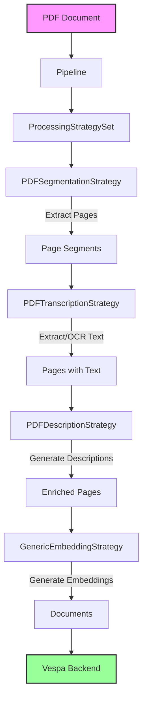
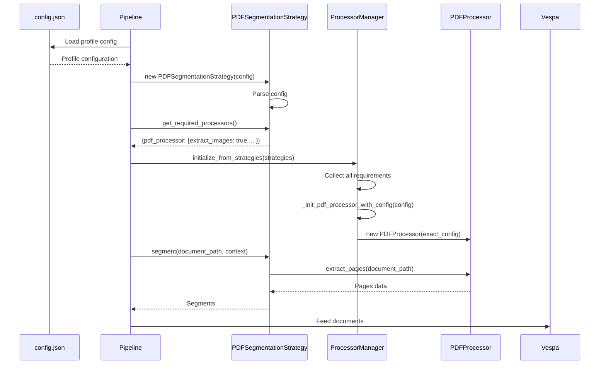

# PDF Integration Guide - Refactored Pipeline Architecture

## Table of Contents
1. [Architecture Overview](#architecture-overview)
2. [Configuration Flow - Single Source of Truth](#configuration-flow---single-source-of-truth)
3. [Implementation Guide](#implementation-guide)
4. [Flow Diagrams](#flow-diagrams)
5. [Code Examples](#code-examples)
6. [Testing Strategy](#testing-strategy)
7. [Best Practices](#best-practices)

## Architecture Overview

The refactored video ingestion pipeline architecture enables clean extension to new document types like PDFs through:

- **Composable Strategies**: Each processing step (segmentation, transcription, description, embedding) is a pluggable strategy
- **ProcessorManager**: Centralized factory that creates processors based on strategy requirements
- **Generic Processing**: Unified embedding generation that works with any segment type
- **Single Source of Truth**: Configuration flows unidirectionally from config.json

## Configuration Flow - Single Source of Truth

### Principle
Configuration flows in ONE direction only:
```
config.json → Strategy → ProcessorManager → Processor
```

### Key Rules
1. **config.json** is the single source of truth for all configuration
2. **Strategies** read from config and declare what they need via `get_required_processors()`
3. **ProcessorManager** acts as a pure factory - NO defaults, NO overrides
4. **Processors** receive configuration passed through from the strategy

### Example Configuration Flow

```json
// config.json - Single Source of Truth
{
  "document_processing_profiles": {
    "pdf_extraction": {
      "schema_name": "document_pdf_colpali",
      "processing_mode": "page_based",
      "storage_mode": "multi_doc",
      
      // Processing configuration
      "extract_images": true,
      "extract_text": true,
      "ocr_enabled": true,
      "ocr_language": "eng",
      
      // Page processing
      "max_pages": 100,
      "dpi": 150,
      "image_format": "PNG",
      
      // Embedding configuration
      "embedding_model": "vidore/colpali-v1.2",
      "embedding_type": "page_based",
      "batch_size": 4
    }
  }
}
```

## Implementation Guide

### Step 1: Define PDF Processing Strategies

```python
# src/app/ingestion/processing_strategies_pdf.py

class PDFSegmentationStrategy(SegmentationStrategy):
    """Extracts pages from PDF as segments."""
    
    def __init__(self, config: Dict[str, Any]):
        self.config = config  # Direct from config.json profile
        self.extract_images = config.get('extract_images', True)
        self.extract_text = config.get('extract_text', True)
        self.ocr_enabled = config.get('ocr_enabled', False)
        self.max_pages = config.get('max_pages', 100)
    
    def get_required_processors(self) -> Dict[str, Dict[str, Any]]:
        """Declare what processors this strategy needs."""
        return {
            'pdf_processor': {
                'extract_images': self.extract_images,
                'extract_text': self.extract_text,
                'ocr_enabled': self.ocr_enabled,
                'ocr_language': self.config.get('ocr_language', 'eng'),
                'dpi': self.config.get('dpi', 150),
                'image_format': self.config.get('image_format', 'PNG')
            }
        }
    
    async def segment(self, document_path: Path, pipeline_context: Any,
                     metadata: Optional[Dict] = None) -> Dict[str, Any]:
        """Extract pages from PDF."""
        if not pipeline_context.pdf_processor:
            raise ValueError("PDF processor not initialized")
        
        # Use the processor that was created based on our requirements
        pages_data = pipeline_context.pdf_processor.extract_pages(
            document_path,
            max_pages=self.max_pages
        )
        
        # Convert to standard segment format
        segments = []
        for idx, page in enumerate(pages_data['pages']):
            segments.append({
                'page_number': page['page_number'],
                'image_path': page.get('image_path'),
                'text': page.get('text', ''),
                'metadata': page.get('metadata', {})
            })
        
        return {
            'segments': segments,
            'document_type': 'pdf',
            'total_pages': pages_data['total_pages'],
            'metadata': pages_data.get('metadata', {})
        }


class PDFTranscriptionStrategy(TranscriptionStrategy):
    """Extracts and processes text from PDF pages."""
    
    def __init__(self, config: Dict[str, Any]):
        self.config = config
        self.use_ocr = config.get('ocr_enabled', False)
    
    def get_required_processors(self) -> Dict[str, Dict[str, Any]]:
        """OCR processor if needed."""
        if self.use_ocr:
            return {
                'ocr_processor': {
                    'language': self.config.get('ocr_language', 'eng'),
                    'confidence_threshold': self.config.get('ocr_confidence', 0.6)
                }
            }
        return {}
    
    async def transcribe(self, segments_data: Dict[str, Any],
                        pipeline_context: Any) -> Dict[str, Any]:
        """Extract or OCR text from pages."""
        segments = segments_data['segments']
        
        for segment in segments:
            if not segment.get('text') and self.use_ocr:
                # OCR the page image if no text extracted
                if pipeline_context.ocr_processor and segment.get('image_path'):
                    ocr_result = pipeline_context.ocr_processor.process_image(
                        segment['image_path']
                    )
                    segment['text'] = ocr_result.get('text', '')
        
        return segments_data


class PDFDescriptionStrategy(DescriptionStrategy):
    """Generate descriptions for PDF pages using VLM."""
    
    def __init__(self, config: Dict[str, Any]):
        self.config = config
        self.generate_descriptions = config.get('generate_descriptions', True)
        self.vlm_model = config.get('vlm_model', 'gpt-4-vision')
    
    def get_required_processors(self) -> Dict[str, Dict[str, Any]]:
        if self.generate_descriptions:
            return {
                'vlm_processor': {
                    'model': self.vlm_model,
                    'max_tokens': self.config.get('vlm_max_tokens', 300),
                    'temperature': self.config.get('vlm_temperature', 0.7)
                }
            }
        return {}
    
    async def generate_descriptions(self, segments_data: Dict[str, Any],
                                   pipeline_context: Any) -> Dict[str, Any]:
        """Generate descriptions for PDF pages."""
        if not self.generate_descriptions:
            return segments_data
        
        segments = segments_data['segments']
        
        for segment in segments:
            if pipeline_context.vlm_processor and segment.get('image_path'):
                description = await pipeline_context.vlm_processor.describe_image(
                    segment['image_path'],
                    context=segment.get('text', '')
                )
                segment['description'] = description
        
        return segments_data
```

### Step 2: Extend ProcessorManager

```python
# src/app/ingestion/processor_manager.py

class ProcessorManager:
    """Factory for creating processors based on strategy requirements."""
    
    def __init__(self, logger: logging.Logger):
        self.logger = logger
        self.pdf_processor = None
        self.ocr_processor = None
        self.vlm_processor = None
        # ... other processors
    
    def initialize_from_strategies(self, strategies: 'ProcessingStrategySet'):
        """Initialize processors based on what strategies require."""
        # Collect all requirements
        all_requirements = {}
        
        for strategy in [strategies.segmentation_strategy,
                         strategies.transcription_strategy,
                         strategies.description_strategy,
                         strategies.embedding_strategy]:
            if strategy:
                requirements = strategy.get_required_processors()
                all_requirements.update(requirements)
        
        # Initialize based on requirements - NO DEFAULTS!
        self._init_from_requirements(all_requirements)
    
    def _init_from_requirements(self, required_processors: Dict):
        """Initialize only what's required, with exact config."""
        
        # PDF Processor
        if 'pdf_processor' in required_processors:
            config = required_processors['pdf_processor']
            self.logger.info(f"🔧 Strategy requires pdf_processor with config: {config}")
            self._init_pdf_processor_with_config(config)
        
        # OCR Processor
        if 'ocr_processor' in required_processors:
            config = required_processors['ocr_processor']
            self.logger.info(f"🔧 Strategy requires ocr_processor with config: {config}")
            self._init_ocr_processor_with_config(config)
        
        # VLM Processor
        if 'vlm_processor' in required_processors:
            config = required_processors['vlm_processor']
            self.logger.info(f"🔧 Strategy requires vlm_processor with config: {config}")
            self._init_vlm_processor_with_config(config)
    
    def _init_pdf_processor_with_config(self, config: Dict[str, Any]):
        """Initialize PDF processor with exact config from strategy."""
        from src.app.ingestion.processors.pdf_processor import PDFProcessor
        
        self.pdf_processor = PDFProcessor(
            extract_images=config['extract_images'],
            extract_text=config['extract_text'],
            ocr_enabled=config['ocr_enabled'],
            ocr_language=config['ocr_language'],
            dpi=config['dpi'],
            image_format=config['image_format'],
            logger=self.logger
        )
    
    def _init_ocr_processor_with_config(self, config: Dict[str, Any]):
        """Initialize OCR processor with exact config from strategy."""
        from src.app.ingestion.processors.ocr_processor import OCRProcessor
        
        self.ocr_processor = OCRProcessor(
            language=config['language'],
            confidence_threshold=config.get('confidence_threshold', 0.6),
            logger=self.logger
        )
```

### Step 3: Create PDF Processor

```python
# src/app/ingestion/processors/pdf_processor.py

import fitz  # PyMuPDF
from PIL import Image
from pathlib import Path
from typing import Dict, List, Any, Optional
import logging

class PDFProcessor:
    """Processes PDF documents into pages with images and text."""
    
    def __init__(self, extract_images: bool = True,
                 extract_text: bool = True,
                 ocr_enabled: bool = False,
                 ocr_language: str = 'eng',
                 dpi: int = 150,
                 image_format: str = 'PNG',
                 logger: Optional[logging.Logger] = None):
        """
        Initialize with configuration from strategy.
        Note: All config comes from the strategy, which got it from config.json
        """
        self.extract_images = extract_images
        self.extract_text = extract_text
        self.ocr_enabled = ocr_enabled
        self.ocr_language = ocr_language
        self.dpi = dpi
        self.image_format = image_format
        self.logger = logger or logging.getLogger(__name__)
    
    def extract_pages(self, pdf_path: Path, max_pages: int = 100) -> Dict[str, Any]:
        """Extract pages from PDF with images and text."""
        self.logger.info(f"📄 Extracting pages from {pdf_path.name}")
        
        doc = fitz.open(pdf_path)
        pages_data = []
        
        for page_num in range(min(len(doc), max_pages)):
            page = doc[page_num]
            page_data = {
                'page_number': page_num + 1,
                'metadata': {}
            }
            
            # Extract text if configured
            if self.extract_text:
                text = page.get_text()
                page_data['text'] = text
                page_data['metadata']['has_text'] = bool(text.strip())
            
            # Extract image if configured
            if self.extract_images:
                # Render page to image
                mat = fitz.Matrix(self.dpi/72.0, self.dpi/72.0)
                pix = page.get_pixmap(matrix=mat)
                
                # Save image
                image_path = pdf_path.parent / f"{pdf_path.stem}_page_{page_num+1}.{self.image_format.lower()}"
                
                if self.image_format.upper() == 'PNG':
                    pix.save(str(image_path))
                else:
                    # Convert to PIL for other formats
                    img_data = pix.tobytes("ppm")
                    img = Image.open(io.BytesIO(img_data))
                    img.save(str(image_path), self.image_format)
                
                page_data['image_path'] = str(image_path)
                page_data['metadata']['image_size'] = (pix.width, pix.height)
            
            pages_data.append(page_data)
        
        doc.close()
        
        return {
            'pages': pages_data,
            'total_pages': len(doc),
            'metadata': {
                'pdf_path': str(pdf_path),
                'extracted_pages': len(pages_data)
            }
        }
```

### Step 4: Integrate with Pipeline

```python
# src/app/ingestion/pipeline.py

class DocumentIngestionPipeline(VideoIngestionPipeline):
    """Extended pipeline that handles both videos and documents."""
    
    def _create_strategy_set(self, profile_config: Dict[str, Any]) -> ProcessingStrategySet:
        """Create appropriate strategies based on document type."""
        
        processing_mode = profile_config.get('processing_mode', 'frame_based')
        
        if processing_mode == 'page_based':
            # PDF processing strategies
            from .processing_strategies_pdf import (
                PDFSegmentationStrategy,
                PDFTranscriptionStrategy,
                PDFDescriptionStrategy
            )
            
            return ProcessingStrategySet(
                segmentation_strategy=PDFSegmentationStrategy(profile_config),
                transcription_strategy=PDFTranscriptionStrategy(profile_config),
                description_strategy=PDFDescriptionStrategy(profile_config),
                embedding_strategy=GenericEmbeddingStrategy(profile_config)
            )
        else:
            # Video processing strategies (existing)
            return super()._create_strategy_set(profile_config)
    
    async def process_document(self, document_path: Path) -> Dict[str, Any]:
        """Process a document (PDF or video) through the pipeline."""
        
        if document_path.suffix.lower() == '.pdf':
            return await self._process_pdf(document_path)
        elif document_path.suffix.lower() in ['.mp4', '.avi', '.mov']:
            return await self.process_video(document_path)
        else:
            raise ValueError(f"Unsupported document type: {document_path.suffix}")
```

## Flow Diagrams

### Configuration Flow Diagram


### Processing Flow Diagram



### Sequence Diagram



## Code Examples

### Example 1: Adding a New PDF Profile

```json
// config.json
{
  "document_processing_profiles": {
    "pdf_scientific_papers": {
      "schema_name": "document_pdf_scientific",
      "processing_mode": "page_based",
      "storage_mode": "single_doc",  // One doc per PDF
      
      // Specific for scientific papers
      "extract_images": true,
      "extract_text": true,
      "extract_tables": true,
      "extract_equations": true,
      "ocr_enabled": false,  // PDFs have text
      
      // Citation extraction
      "extract_citations": true,
      "citation_style": "APA",
      
      // Embedding model tuned for scientific text
      "embedding_model": "allenai/scibert",
      "embedding_type": "page_based",
      "batch_size": 8
    }
  }
}
```

### Example 2: Custom PDF Strategy

```python
class ScientificPDFSegmentationStrategy(PDFSegmentationStrategy):
    """Special handling for scientific papers."""
    
    def get_required_processors(self) -> Dict[str, Dict[str, Any]]:
        base_requirements = super().get_required_processors()
        
        # Add scientific paper specific processors
        if self.config.get('extract_citations'):
            base_requirements['citation_processor'] = {
                'style': self.config.get('citation_style', 'APA'),
                'extract_references': True
            }
        
        if self.config.get('extract_equations'):
            base_requirements['equation_processor'] = {
                'format': 'latex',
                'extract_inline': True,
                'extract_display': True
            }
        
        return base_requirements
```

### Example 3: Using the Pipeline

```python
# scripts/run_pdf_ingestion.py

async def main():
    # Load config
    config = get_config()
    
    # Create pipeline with PDF profile
    pipeline_config = PipelineConfig.from_config()
    pipeline_config.profile = 'pdf_extraction'
    
    pipeline = DocumentIngestionPipeline(
        config=pipeline_config,
        app_config=config,
        schema_name='document_pdf_colpali'
    )
    
    # Process PDFs
    pdf_dir = Path("data/pdfs")
    pdf_files = list(pdf_dir.glob("*.pdf"))
    
    results = await pipeline.process_documents_concurrent(
        pdf_files,
        max_concurrent=3
    )
    
    print(f"Processed {len(results)} PDFs")
```

## Testing Strategy

### Unit Tests

```python
# tests/test_pdf_strategies.py

def test_pdf_segmentation_strategy_requirements():
    """Test that strategy correctly declares requirements."""
    config = {
        'extract_images': True,
        'extract_text': True,
        'ocr_enabled': True,
        'ocr_language': 'fra'
    }
    
    strategy = PDFSegmentationStrategy(config)
    requirements = strategy.get_required_processors()
    
    assert 'pdf_processor' in requirements
    assert requirements['pdf_processor']['extract_images'] == True
    assert requirements['pdf_processor']['ocr_language'] == 'fra'


def test_processor_manager_creates_from_requirements():
    """Test that ProcessorManager creates processors correctly."""
    manager = ProcessorManager(logger=mock_logger)
    
    requirements = {
        'pdf_processor': {
            'extract_images': False,
            'extract_text': True,
            'ocr_enabled': False
        }
    }
    
    manager._init_from_requirements(requirements)
    
    assert manager.pdf_processor is not None
    assert manager.pdf_processor.extract_images == False
    assert manager.pdf_processor.extract_text == True
```

### Integration Tests

```python
# tests/test_pdf_pipeline_integration.py

async def test_pdf_pipeline_end_to_end():
    """Test full PDF processing pipeline."""
    
    # Create test PDF
    test_pdf = create_test_pdf()
    
    # Create pipeline
    config = {
        'processing_mode': 'page_based',
        'extract_images': True,
        'extract_text': True,
        'embedding_model': 'vidore/colpali-v1.2'
    }
    
    pipeline = DocumentIngestionPipeline(config)
    
    # Process PDF
    result = await pipeline.process_document(test_pdf)
    
    # Verify results
    assert result['status'] == 'completed'
    assert result['documents_processed'] > 0
    assert result['documents_fed'] > 0
```

## Best Practices

### 1. Configuration Management

- **Always** define complete configuration in config.json
- **Never** hard-code defaults in ProcessorManager
- **Let** strategies decide what they need based on config
- **Use** profile inheritance for common settings

### 2. Strategy Design

- **Keep** strategies focused on orchestration, not implementation
- **Delegate** actual work to processors
- **Return** standardized data structures
- **Handle** missing processors gracefully

### 3. Processor Implementation

- **Accept** all configuration through constructor
- **Don't** make assumptions about defaults
- **Log** important operations and decisions
- **Return** consistent data structures

### 4. Error Handling

```python
class PDFSegmentationStrategy(SegmentationStrategy):
    async def segment(self, document_path: Path, pipeline_context: Any,
                     metadata: Optional[Dict] = None) -> Dict[str, Any]:
        """Extract pages with proper error handling."""
        
        if not pipeline_context.pdf_processor:
            # Strategy required it but it's not there
            raise ValueError(
                f"PDF processor not initialized. "
                f"Required config: {self.get_required_processors()}"
            )
        
        try:
            pages_data = pipeline_context.pdf_processor.extract_pages(
                document_path,
                max_pages=self.max_pages
            )
        except Exception as e:
            self.logger.error(f"Failed to extract pages: {e}")
            # Return empty but valid structure
            return {
                'segments': [],
                'document_type': 'pdf',
                'error': str(e)
            }
        
        return self._format_segments(pages_data)
```

### 5. Testing Configuration Flow

```python
def test_configuration_flow_integrity():
    """Ensure configuration flows correctly through the system."""
    
    # Original config
    original_config = {
        'extract_images': True,
        'dpi': 200,
        'ocr_language': 'deu'
    }
    
    # Create strategy
    strategy = PDFSegmentationStrategy(original_config)
    requirements = strategy.get_required_processors()
    
    # Verify requirements match original
    pdf_config = requirements['pdf_processor']
    assert pdf_config['extract_images'] == original_config['extract_images']
    assert pdf_config['dpi'] == original_config['dpi']
    assert pdf_config['ocr_language'] == original_config['ocr_language']
    
    # Create processor manager
    manager = ProcessorManager(mock_logger)
    manager._init_from_requirements(requirements)
    
    # Verify processor has correct config
    assert manager.pdf_processor.dpi == original_config['dpi']
    assert manager.pdf_processor.ocr_language == original_config['ocr_language']
```

## Summary

The refactored architecture makes adding PDF support clean and maintainable:

1. **Single Source of Truth**: All configuration comes from config.json
2. **Composable Strategies**: Each processing step is independent and pluggable
3. **Pure Factory Pattern**: ProcessorManager creates exactly what's needed
4. **Generic Processing**: Unified embedding generation works for any document type
5. **Clear Data Flow**: Configuration and data flow in predictable directions

This design ensures that adding new document types (spreadsheets, presentations, etc.) follows the same clean pattern without modifying existing code.