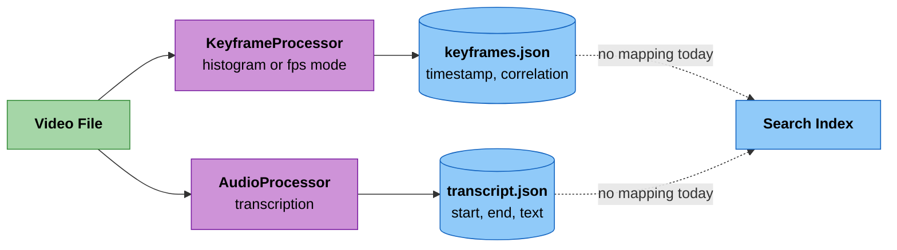
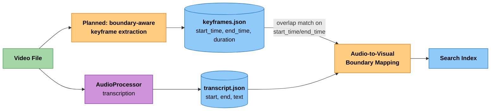

# Frame Boundary Algorithm

> **⚠️ Implementation Status: PARTIAL**
>
> This document describes advanced temporal boundary calculation.
> **Keyframes** (`keyframe_processor.py`, `KeyframeProcessor`):
> - Single `timestamp` per keyframe (point-in-time, NOT start/end boundaries)
> - Visual scene change detection via histogram comparison (or FPS-based extraction)
> - No duration calculation for visual scenes
> - No audio-to-visual boundary mapping (audio is processed separately)
>
> **Video chunks** (`chunk_processor.py`, `ChunkProcessor`):
> - Full temporal boundaries with `start_time`, `end_time`, and `duration` fields
> - Fixed-duration chunking (e.g., 6s or 30s segments)
>
> The boundary calculation features described below apply to keyframes and are NOT yet implemented for that extraction mode. Video chunk extraction already provides full temporal boundaries.

This document describes a planned enhancement for calculating keyframe temporal boundaries in the video processing pipeline.

## Overview

The planned feature would combine visual scene change detection with audio transcription to create semantically meaningful frame boundaries. Each keyframe would represent a visual scene that may span multiple audio segments or partial segments.

**Current State**: `KeyframeProcessor` extracts keyframes either at visual scene changes (histogram comparison) or at fixed FPS intervals, but only records a single timestamp per frame either way. Audio transcription is processed separately without mapping to visual boundaries. See [Configuration](#configuration) below for which mode the shipped profiles actually use.





## Algorithm Components

### 1. Visual Keyframe Extraction (Planned)

**Planned Location**: Processing pipeline

The planned keyframe extraction would use histogram comparison to detect visual scene changes:

```python
from pathlib import Path
from typing import List, Tuple
import numpy as np
import cv2

def extract_keyframes_with_boundaries(video_path: Path, threshold: float = 0.999) -> List[Tuple[np.ndarray, float, float]]:
    """
    Planned enhancement: Extract keyframes with temporal boundaries.

    Args:
        video_path: Path to video file
        threshold: Histogram correlation threshold for scene detection

    Returns: List of (frame, start_time, end_time) tuples
    """
    keyframes = []
    cap = cv2.VideoCapture(str(video_path))
    fps = cap.get(cv2.CAP_PROP_FPS)

    prev_hist = None
    start_time = 0.0
    frame_count = 0
    last_keyframe = None

    while True:
        ret, frame = cap.read()
        if not ret:
            break

        current_time = frame_count / fps
        hist = cv2.calcHist([frame], [0, 1, 2], None, [8, 8, 8], [0, 256, 0, 256, 0, 256])
        hist = cv2.normalize(hist, hist).flatten()

        is_keyframe = False
        if prev_hist is None:
            is_keyframe = True  # First frame is always a keyframe
        else:
            correlation = cv2.compareHist(prev_hist, hist, cv2.HISTCMP_CORREL)
            if correlation < threshold:  # Scene change detected
                is_keyframe = True

        if is_keyframe:
            # Save previous keyframe with its boundary
            if last_keyframe is not None:
                keyframes.append((last_keyframe, start_time, current_time))

            # Start new scene
            last_keyframe = frame.copy()
            start_time = current_time
            prev_hist = hist

        frame_count += 1

    # Add final keyframe
    if last_keyframe is not None:
        # Use total video duration as end_time for final keyframe
        video_duration = cap.get(cv2.CAP_PROP_FRAME_COUNT) / fps if fps > 0 else current_time
        keyframes.append((last_keyframe, start_time, video_duration))

    cap.release()
    return keyframes
```

**Key Points** (Planned Feature):

- Would use histogram correlation to detect scene changes (threshold configurable, default 0.999)
- Each keyframe would get `start_time` and `end_time` based on when visual scenes change
- A keyframe's duration would represent how long that visual scene persists
- Scene changes would be detected when histogram correlation drops below threshold

**Current Implementation** (`KeyframeProcessor`) provides:
- Single `timestamp` per keyframe (not start/end boundaries)
- Two extraction modes: histogram correlation (default threshold 0.999) or FPS-based
- `correlation` score per keyframe in histogram mode
- Frame-to-frame histogram comparison (`prev_hist` updated every frame)
- No duration calculation for visual scenes

### 2. Audio Transcription Mapping (Planned)

**Status**: Not yet implemented

Audio transcripts would be mapped TO the existing keyframe boundaries:

```python
# Step 1: Extract text from transcript segments (segment-level only, no word-level timestamps)
# Current transcription format: segments with start, end, text
# Example: {"start": 29.28, "end": 31.6, "text": "protecting your head"}

# Step 2: For each keyframe, find overlapping audio segments
# `keyframes` is the list of (frame, start_time, end_time) tuples from Step 1
for i, (frame, start_time, end_time) in enumerate(keyframes):
    # Find segments that overlap with this visual scene
    overlapping_segments = [
        seg['text'] for seg in transcription_segments
        if seg['start'] < end_time and seg['end'] > start_time
    ]
    audio_segment = " ".join(overlapping_segments).strip()
```

## Frame Boundary Examples (Planned Feature)

The following example illustrates how the planned boundary calculation would work:

Using video `v_-IMXSEIabMM` as an example:

### Frame 41 Analysis (Hypothetical Example)

**Visual Scene** (planned): 30.030s - 46.847s (16.8 second duration)

**Audio Content During This Scene**:

- Segment 6 (29.28s - 31.6s): "you're protecting your head, that's the most important."
- Segment 7 (32.54s - 38.72s): "Sacrificing a limb, hurting your hand, and saving your head, because having your head"
- Segment 8 (38.72s - 43.6s): "hit the ice, especially when it comes black ice, and getting a subdural hematoma, blood"
- Segment 9 (43.6s - 46.7s): "inside the brain, can be devastating for a lot of people."

**Interpretation**:
This hypothetical example shows how a 16.8-second keyframe boundary would represent a coherent visual scene where the speaker discusses head protection. The long duration would indicate that the visual content remains relatively stable while covering multiple related audio segments about the same topic.

**Note**: Current implementation only provides a single point-in-time `timestamp` field (approximately 30.03s) for this frame, not the full boundary range. Audio segment timestamps are from actual transcript data.

## Design Rationale (For Planned Feature)

### Why Not Align with Audio Segments?

When the boundary calculation feature is implemented, it will not align with audio segments because:

1. **Visual vs Audio Boundaries**: Visual scene changes and speech segment boundaries often don't align
2. **Semantic Coherence**: A single visual scene may cover multiple related audio topics
3. **Search Efficiency**: Longer, semantically coherent frames are better for retrieval than artificially short segments

### Frame Duration Characteristics (Planned)

Once boundary calculation is implemented, frame durations would exhibit these characteristics:

- **Short durations (0.1-2s)**: Rapid visual changes (action sequences, cuts)
- **Medium durations (2-5s)**: Typical scene lengths
- **Long durations (5-20s)**: Stable visual scenes with extended dialogue/narration
- **Very long durations (>20s)**: May indicate processing errors or very static content

**Current State**: All frames have point-in-time timestamps only; no duration data available.

## Current Implementation

### Actual Implementation (keyframe_processor.py)
**Location**: `libs/runtime/cogniverse_runtime/ingestion/processors/keyframe_processor.py`

**Class**: `KeyframeProcessor` (extends `BaseProcessor`)

**What it provides**:
- Two extraction modes: `histogram` (scene change detection) or `fps` (regular intervals)
- Visual scene change detection with histogram comparison (histogram mode)
- Single `timestamp` field per keyframe (point-in-time timestamp when frame was extracted)
- Threshold-based detection (default 0.999 similarity for histogram correlation)
- `correlation` score per keyframe (histogram mode only)
- Separate audio transcription processing (not mapped to visual boundaries)

**Current output format per keyframe (histogram mode)**:
```python
{
    "frame_number": 901,
    "timestamp": 30.03,          # Point-in-time when frame was extracted
    "filename": "v_-IMXSEIabMM_keyframe_0041.jpg",
    "path": "outputs/processing/profile_<profile_name>/keyframes/v_-IMXSEIabMM/v_-IMXSEIabMM_keyframe_0041.jpg",
    "correlation": 0.987         # Histogram correlation score (histogram mode only)
}
```

**Current output format per keyframe (FPS mode)**:
```python
{
    "frame_number": 901,
    "timestamp": 30.03,
    "filename": "v_-IMXSEIabMM_keyframe_0041.jpg",
    "path": "outputs/processing/profile_<profile_name>/keyframes/v_-IMXSEIabMM/v_-IMXSEIabMM_keyframe_0041.jpg"
}
```

`<profile_name>` is the backend profile driving the pipeline run (e.g. `video_colpali_smol500_mv_frame`) — `ProcessingStrategySet` passes `pipeline_context.profile_output_dir` (`outputs/processing/profile_<schema_name>`) into `KeyframeProcessor.extract_keyframes()` as `output_dir`, which then appends `keyframes/<video_id>/`.

**What it does NOT provide**:
- No `start_time` field (when scene starts)
- No `end_time` field (when scene ends)
- No `duration` field (how long scene persists)
- No boundary calculation between successive keyframes

### Configuration

`KeyframeProcessor.__init__` accepts `threshold` (default `0.999`), `max_frames` (default `3000`), and an optional `fps` — passing `fps` switches `extraction_mode` from `histogram` to `fps`. These are wired per backend profile through the `strategies.segmentation` block:

```json
{
  "strategies": {
    "segmentation": {
      "class": "FrameSegmentationStrategy",
      "params": { "fps": 0.5, "threshold": 0.999, "max_frames": 3000 }
    }
  }
}
```

Backend profiles are read and written through `ConfigManager.get_backend_profile(profile_name, tenant_id, service="backend")` / `add_backend_profile(...)` / `update_backend_profile(...)` (the `service` argument defaults to `"backend"` on all of `ConfigManager`'s profile methods), and are editable from the dashboard's backend-profile tab or the runtime admin API.

As of this writing, `video_colpali_smol500_mv_frame` is the only shipped profile whose segmentation strategy is `FrameSegmentationStrategy` (all other video profiles use `ChunkSegmentationStrategy`, which already produces full `start_time`/`end_time`/`duration` boundaries — see the warning at the top of this document). That profile sets `fps: 0.5`, so in practice keyframe extraction currently runs in **FPS mode**, not histogram mode — the `histogram` extraction path described above is the code's default when `fps` is omitted, but no shipped profile currently selects it.

### Future Enhancement (NOT YET IMPLEMENTED)
The sophisticated boundary detection described in this document (with `start_time`, `end_time`, `duration`) is a planned enhancement. The current system extracts keyframes at scene change points but does not calculate the temporal duration of each visual scene.

## Metadata Structure

### Current Format (As Generated by KeyframeProcessor)

Each frame in the metadata currently contains:

```json
{
  "frame_number": 901,
  "timestamp": 30.03,
  "filename": "v_-IMXSEIabMM_keyframe_0041.jpg",
  "path": "outputs/processing/profile_<profile_name>/keyframes/v_-IMXSEIabMM/v_-IMXSEIabMM_keyframe_0041.jpg",
  "correlation": 0.987
}
```

**Field Descriptions**:
- `frame_number`: Frame index in the original video file
- `timestamp`: Point-in-time when this keyframe was extracted (seconds from video start)
- `filename`: Output filename for the extracted frame image (`{video_id}_keyframe_{count:04d}.jpg`)
- `path`: Full path to the saved keyframe image file
- `correlation`: Histogram correlation score at this frame (histogram mode only; absent in FPS mode)

**What's Missing**: No temporal boundary information (start_time, end_time, duration).

### Planned Format (Future Enhancement - NOT IMPLEMENTED)

The boundary-based format would add temporal scene boundaries to the existing fields:

```json
{
  "frame_number": 901,
  "filename": "v_-IMXSEIabMM_keyframe_0041.jpg",
  "start_time": 30.03,
  "end_time": 46.8468,
  "duration": 16.8168,
  "path": "outputs/processing/profile_<profile_name>/keyframes/v_-IMXSEIabMM/v_-IMXSEIabMM_keyframe_0041.jpg",
  "correlation": 0.987
}
```

**Planned Additional Fields** (replacing `timestamp`):
- `start_time`: When the visual scene begins (seconds)
- `end_time`: When the visual scene ends (seconds)
- `duration`: How long the visual scene persists (seconds)

This enhanced format would enable precise audio-to-visual boundary mapping for improved search and retrieval.

## Implications for Search

### Current Implementation Limitations:
1. **Point-in-Time Timestamps Only**: Each frame has a single `timestamp` marking when it was extracted
2. **No Scene Duration Information**: Cannot determine how long a visual scene persists
3. **Separate Processing**: Audio and visual content are processed independently without temporal alignment
4. **Scene Change Detection**: `KeyframeProcessor` supports histogram-based scene-change extraction, but the one shipped profile that uses it (`video_colpali_smol500_mv_frame`) runs it in fixed-FPS mode instead; either way, boundaries between frames are not recorded

### Planned Enhancement Benefits (once boundary calculation is implemented):
1. **Semantic Scene Representation**: Frame boundaries would align with actual visual scene changes
2. **Audio-Visual Coherence**: Frames would contain both visual content and overlapping audio segments
3. **Context Preservation**: Longer scene durations preserve more context for better search relevance
4. **Temporal Accuracy**: Frame boundaries would reflect actual content transitions, not artificial segmentation
5. **Duration-Aware Retrieval**: Search could factor in scene duration (brief flashes vs. sustained content)
