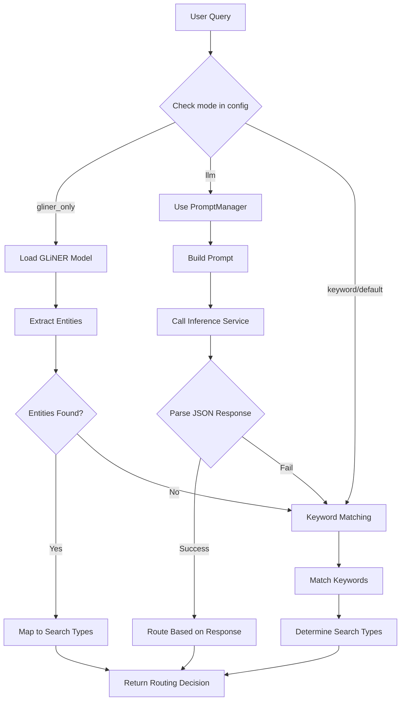

# Routing Configuration Guide

## Overview
The Multi-Agent RAG System uses a configurable routing system to determine whether queries should be sent to video search, text search, or both. The routing logic is implemented in the `QueryAnalysisTool` within `src/agents/composing_agents_main.py`.

## Configuration Options

### 1. Routing Mode (`query_inference_engine.mode`)

Set in `config.json`:
```json
"query_inference_engine": {
    "mode": "gliner_only",  // Options: "gliner_only", "llm", "keyword"
    ...
}
```

### 2. GLiNER Configuration (for `gliner_only` mode)

```json
"query_inference_engine": {
    "mode": "gliner_only",
    "current_gliner_model": "urchade/gliner_large-v2.1",
    "gliner_labels": [
        "video_content",      // Triggers video search
        "visual_content",     // Triggers video search
        "document_content",   // Triggers text search
        "text_information",   // Triggers text search
        "time_reference",     // For temporal extraction
        "date_pattern",       // For temporal extraction
        "search_intent"       // General search intent
    ],
    "gliner_threshold": 0.3,  // Confidence threshold
    "available_gliner_models": [
        "urchade/gliner_small-v2.1",   // Fastest, least accurate
        "urchade/gliner_medium-v2.1",  // Balanced
        "urchade/gliner_large-v2.1",   // Most accurate
        "urchade/gliner_multi-v2.1"    // Multi-lingual
    ]
}
```

### 3. LLM Configuration (for `llm` mode)

```json
"inference": {
    "provider": "local",  // Options: "local", "modal"
    
    // For local (Ollama)
    "local_endpoint": "http://localhost:11434",
    "model": "gemma2:2b",
    
    // For Modal deployment
    "modal_endpoint": "https://your-app-generate.modal.run",
    
    // Prompt configuration
    "prompts": {
        "artifacts_path": null,  // Path to optimized prompts (optional)
        "default_system_prompt": "You are a precise routing agent..."
    },
    
    // Generation parameters
    "model_config": {
        "temperature": 0.1,
        "max_tokens": 100
    }
}
```

## Routing Logic Flow



## Routing Decision Output

The QueryAnalysisTool returns:
```python
{
    "original_query": "user's query",
    "needs_video_search": True/False,
    "needs_text_search": True/False,
    "temporal_info": {
        "start_date": "YYYY-MM-DD",
        "end_date": "YYYY-MM-DD",
        "detected_pattern": "yesterday/last_week/etc"
    },
    "cleaned_query": "normalized query",
    "routing_method": "gliner/llm/keyword",  # How it was routed
    "generation_type": "detailed_report/summary/raw_results"  # Only for LLM mode
}
```

## Changing Routing Modes

### To Use GLiNER (Fast, Local):
```json
"query_inference_engine": {
    "mode": "gliner_only",
    "current_gliner_model": "urchade/gliner_large-v2.1"
}
```

### To Use LLM Routing (Sophisticated):
```json
"query_inference_engine": {
    "mode": "llm"
},
"inference": {
    "provider": "local",
    "local_model": "gemma2:2b"
}
```

### To Use Simple Keywords:
```json
"query_inference_engine": {
    "mode": "keyword"
}
```

## Temporal Extraction

All modes support temporal extraction for patterns like:
- "yesterday" → Previous day
- "last week" → Past 7 days
- "last month" → Past 30 days
- "this week" → Current week
- "this month" → Current month
- Specific dates: "2024-01-15"

## Adding Custom Routing Logic

To add new routing logic:

1. **For GLiNER**: Add new labels to `gliner_labels` in config
2. **For LLM**: Modify the prompt in `prompts.default_system_prompt`
3. **For Keywords**: Edit the keyword lists in `_keyword_based_analysis()`

## Performance Comparison

| Mode | Speed | Accuracy | Requirements |
|------|-------|----------|--------------|
| GLiNER | Fast (~50ms) | Good (75%) | Local model download |
| LLM | Medium (~500ms) | Best (90%+) | Ollama/Modal running |
| Keyword | Instant | Basic (60%) | None |

## Troubleshooting

### GLiNER Issues:
- Check model is downloaded: Models are auto-downloaded on first use
- Verify CUDA/MPS availability for GPU acceleration
- Lower threshold if not detecting entities

### LLM Issues:
- Ensure Ollama is running: `ollama serve`
- Check model is pulled: `ollama pull gemma2:2b`
- For Modal, verify deployment: `modal deploy src/inference/modal_inference_service.py`

### Keyword Issues:
- Add domain-specific keywords to the lists in the code
- Consider switching to GLiNER or LLM for better accuracy