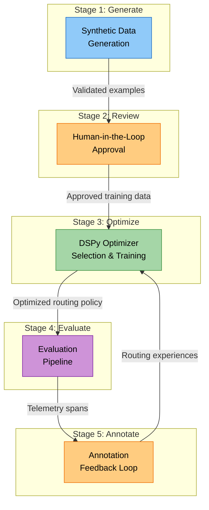
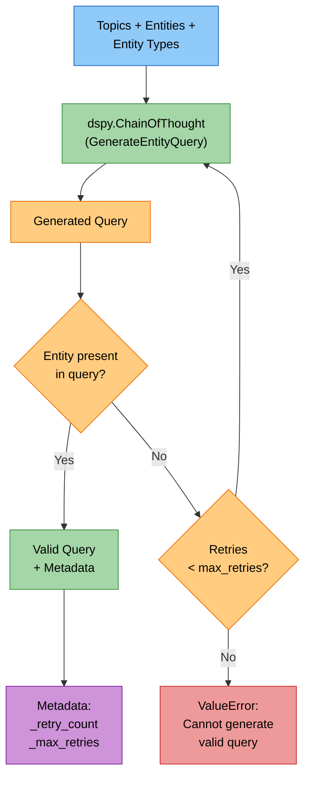
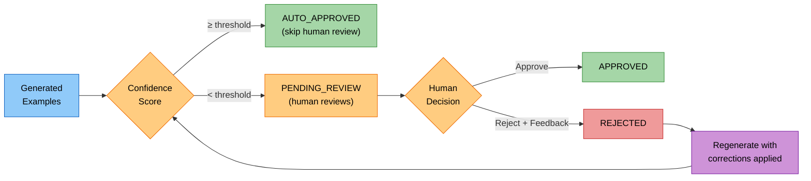
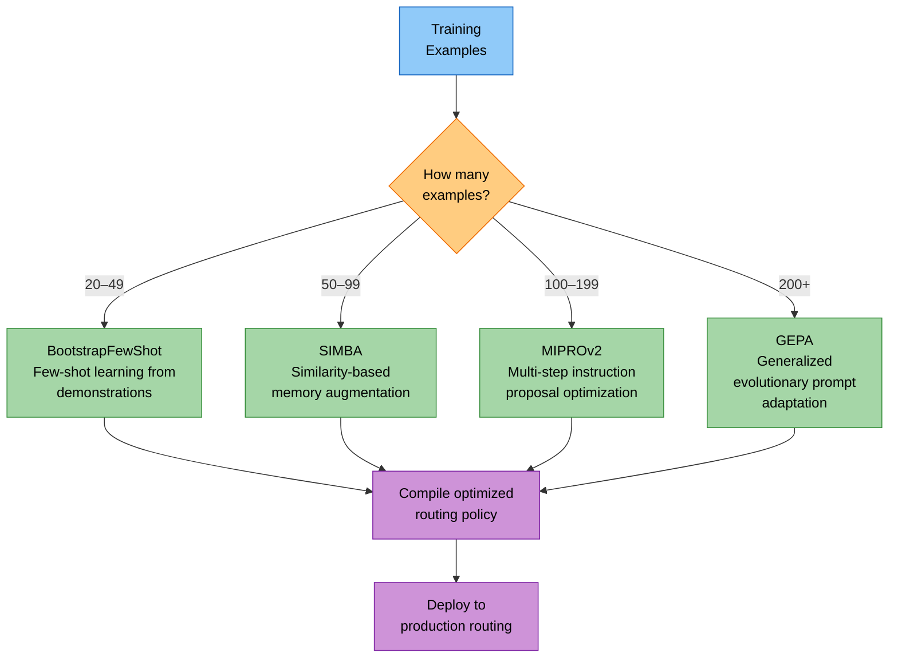
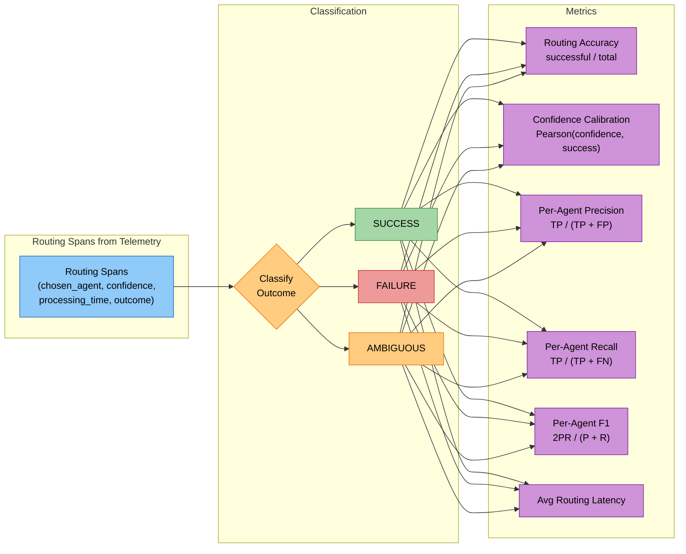

# The Evaluation & Optimization Loop

## Problem Statement

Static prompts and fixed routing logic degrade over time. Query distributions shift, new content types appear, and user expectations evolve. A system that was 90% accurate at launch will silently drift to 70% without a mechanism for continuous learning.

The solution is a **closed-loop system** where every routing decision feeds back into optimization — through synthetic data generation, human review, automated evaluation, and annotation-driven retraining.

---

## The Complete Feedback Loop



Each stage feeds the next, creating a virtuous cycle: generate data → human validates → optimizer learns → evaluation measures → annotations refine → optimizer improves further.

---

## Stage 1: Synthetic Data Generation

### Validated DSPy Modules

Synthetic training data is generated using a `ValidatedEntityQueryGenerator` — a DSPy module with `ChainOfThought` reasoning and built-in retry validation.



**Key design decisions:**
- **No fallback to dummy data** — if the generator can't produce a valid query after `max_retries` (default: 3), it raises a `ValueError` rather than silently returning garbage
- **Validation is case-insensitive** — at least one entity must appear in the generated query text
- **Retry count is metadata** — stored on the prediction for downstream confidence scoring

### Confidence Scoring

Each generated example receives a confidence score from 4 independent signals:

| Signal | Weight | Logic |
|---|---|---|
| **Retry Count** | Dominant | −0.15 per retry attempt (penalty stacks) |
| **Entity Presence** | Multiplicative | ×1.05 boost if entity found; ×0.7 penalty if expected but missing |
| **Query Length** | Multiplicative | ×0.8 if < 10 chars (too short); ×0.9 if > 200 chars (too long) |
| **Reasoning Quality** | Minor boost | ×1.02 if reasoning text > 20 characters |

**Resulting confidence bands:**
- **0.9–1.0**: High confidence (first attempt, entities present, good length)
- **0.75–0.9**: Medium confidence (1–2 retries)
- **< 0.75**: Low confidence (3+ retries, missing entities)

The final score is clamped to [0.0, 1.0].

---

## Stage 2: Human-in-the-Loop Approval

### Confidence-Based Auto-Approval

Generated data is sorted into batches with automatic triage:



**Approval statuses:**
- `AUTO_APPROVED` — high confidence, no human needed
- `PENDING_REVIEW` — below threshold, awaiting human
- `APPROVED` — human explicitly approved
- `REJECTED` — human rejected with feedback
- `REGENERATED` — rejected, then regenerated with corrections

### Rejection → Feedback → Regeneration Cycle

When a human rejects an example, the `FeedbackHandler`:

1. Extracts the original generation parameters (topics, entities)
2. Applies corrections from the reviewer (e.g., corrected entities, refined topics)
3. Regenerates using the DSPy module with corrections applied
4. Creates a new review item with ID `{original_id}_regen_{attempt}`
5. Sets initial confidence to 0.8 and stores generation metadata:
   - `regeneration: True`
   - `original_query` for comparison
   - `human_feedback` text
   - `corrections_applied` dictionary

Maximum 2 regeneration attempts per item. If all fail, the item is dropped (returns `None`) rather than producing low-quality data.

---

## Stage 3: DSPy Optimization

### Adaptive Optimizer Selection

The system selects the most advanced applicable optimizer based on available training data volume:



| Optimizer | Data Threshold | Approach | Best For |
|---|---|---|---|
| **BootstrapFewShot** | 20–49 examples | Generates demonstrations from a teacher model | Cold start, limited data |
| **SIMBA** | 50–99 examples | Learns from similar successful transformations | Pattern matching from memory |
| **MIPROv2** | 100–199 examples | Multi-step instruction proposal + optimization | Refining prompt instructions |
| **GEPA** | 200+ examples | Evolutionary prompt adaptation | Large-scale prompt evolution |

### Teacher/Student Pattern

A large LLM (teacher) generates high-quality routing demonstrations. These demonstrations are then used to optimize a smaller, faster LLM (student) that handles production routing. This keeps latency low while maintaining quality.

### Reward Computation

Every routing decision produces a reward signal used for optimization:

```
reward = 0.4 × search_quality       # Quality of returned results [0-1]
       + 0.3 × agent_success        # Did the agent complete? (1.0 or 0.0)
       + 0.3 × user_satisfaction    # Explicit user feedback [0-1] (when available)
       − 0.1 × time_penalty         # Sigmoid penalty for slow processing
```

When `user_satisfaction` is unavailable, the reward normalizes across the remaining weights.

**Time penalty** uses a sigmoid curve so that fast responses aren't penalized and very slow responses asymptotically approach the maximum penalty:

```
time_penalty = 0.1 × (1.0 − 1.0 / (1.0 + processing_time / 10.0))
```

### Optimization Trigger Conditions

The optimizer doesn't run on every experience. It triggers when:
1. **Minimum data threshold met** — at least 50 experiences accumulated
2. **Periodic schedule** — every 10 new experiences
3. **Performance decline** — recent average reward drops > 0.1 below historical average

Each optimization step:
1. Samples a batch (size 32) from the experience replay buffer
2. Converts experiences to DSPy examples
3. Compiles the routing policy with the selected optimizer
4. Decays exploration epsilon: `ε *= 0.995` (floor: 0.05)

---

## Stage 4: Evaluation

### Reference-Free Evaluators

For live traffic where ground truth isn't available, reference-free evaluators assess result quality:

- **Relevance** — does the result address the query intent?
- **Diversity** — are results covering different aspects/modalities?
- **Temporal Coverage** — for time-sensitive queries, are results well-distributed in time?
- **LLM-Based Assessment** — an LLM evaluates overall response quality

### Golden Dataset Comparison

When a curated golden dataset is available, standard IR metrics measure retrieval quality against known-good results.

### Routing-Specific Metrics



| Metric | What It Measures |
|---|---|
| **Routing Accuracy** | Fraction of routing decisions that led to successful outcomes |
| **Confidence Calibration** | Pearson correlation between stated confidence and actual success rate |
| **Per-Agent Precision** | Per agent: TP / (TP + FP) — how often routing to this agent succeeds |
| **Per-Agent Recall** | Per agent: TP / (TP + FN) — how often the right agent is chosen when it should be |
| **Per-Agent F1** | Harmonic mean of precision and recall per agent |
| **Avg Routing Latency** | Mean time for routing decision (ms) |

### IR Metrics Suite

Standard information retrieval metrics evaluated at multiple K values (1, 5, 10):

| Metric | Formula | Interpretation |
|---|---|---|
| **MRR** | `1 / (position + 1)` of first relevant result | How quickly the first good result appears |
| **NDCG@K** | `DCG / IDCG` with log₂ discount | Ranking quality considering position |
| **Precision@K** | `relevant_in_K / K` | Fraction of top-K results that are relevant |
| **Recall@K** | `relevant_in_K / total_relevant` | Fraction of all relevant results captured in top-K |
| **F1@K** | `2 × (P × R) / (P + R)` | Balanced precision-recall at K |
| **MAP** | Average precision across multiple queries | Overall retrieval effectiveness |

---

## Stage 5: Annotation Feedback Loop

The annotation feedback loop closes the optimization cycle by converting human judgments on live traffic into training signal for the routing optimizer.

### End-to-End Flow

```mermaid
sequenceDiagram
    participant PHX as Phoenix Telemetry
    participant AFL as Annotation Feedback Loop
    participant LLM as LLM Auto-Annotator
    participant HUM as Human Reviewer
    participant OPT as Routing Optimizer
    participant RB as Replay Buffer (1000)

    loop Every 15 minutes
        AFL->>PHX: Query new routing spans
        PHX-->>AFL: Annotated spans

        alt LLM Pre-Annotation
            AFL->>LLM: Annotate span
            LLM-->>AFL: Label + confidence + reasoning
            Note over LLM: Labels: CORRECT_ROUTING,<br/>WRONG_ROUTING, AMBIGUOUS,<br/>INSUFFICIENT_INFO
        end

        alt Low confidence or flagged
            AFL->>HUM: Request human review
            HUM-->>AFL: Verified annotation
        end

        AFL->>AFL: Convert annotation → RoutingExperience
        Note over AFL: CORRECT → quality=0.9, success=True<br/>WRONG → quality=0.3, success=False<br/>AMBIGUOUS → quality=0.6

        AFL->>RB: Store experience (FIFO, max 1000)

        alt ≥ 10 new annotations
            AFL->>OPT: Trigger optimizer update
            OPT->>RB: Sample training batch
            OPT->>OPT: Select optimizer + compile
        end
    end
```

### Phoenix Telemetry Span Polling

The feedback loop polls Phoenix every **15 minutes** (configurable `poll_interval_minutes`) for newly annotated routing spans. It filters for human-reviewed annotations only — LLM auto-annotations feed into a separate pre-screening step.

### LLM Auto-Annotation

An LLM annotator pre-screens routing spans before human review:
- Examines: query content, routing decision, execution outcome
- Produces: `label`, `confidence`, `reasoning`, `suggested_correct_agent`, `requires_human_review`
- Uses low temperature (0.3) for consistency
- When uncertain, flags `requires_human_review: true`

### Annotation → RoutingExperience Conversion

Each annotation maps to a `RoutingExperience` with computed reward:

| Annotation Label | search_quality | agent_success | user_satisfaction |
|---|---|---|---|
| `CORRECT_ROUTING` | 0.9 | True (1.0) | 1.0 |
| `WRONG_ROUTING` | 0.3 | False (0.0) | 0.0 |
| `AMBIGUOUS` | 0.6 | False (0.0) | 0.0 |
| `INSUFFICIENT_INFO` | 0.5 | False (0.0) | 0.0 |

### Experience Replay Buffer

- FIFO buffer with capacity of **1000** recent experiences
- New experiences push out the oldest
- Training batches are sampled from this buffer (size 32)
- Keeps the optimizer focused on recent patterns rather than stale data

### Automatic Retraining Trigger

When ≥ **10 new annotations** are processed in a single polling cycle, the optimizer is automatically triggered. This ensures the system responds quickly to a burst of human feedback.

---

## What Gets Stored in Telemetry

Routing spans capture the full context needed for offline analysis and annotation:

| Span Attribute | Type | Purpose |
|---|---|---|
| `routing.chosen_agent` | string | Which agent was selected |
| `routing.confidence` | float | Routing confidence score |
| `routing.processing_time` | float | Decision latency (ms) |
| `routing.query` | string | Original user query |
| `routing.enhanced_query` | string | Post-enhancement query |
| `routing.entities` | list | Extracted entities |
| `routing.relationships` | list | Extracted relationships |
| `routing.context` | dict | Conversation context |
| `routing.outcome` | enum | SUCCESS / FAILURE / AMBIGUOUS |
| `annotation.label` | enum | CORRECT / WRONG / AMBIGUOUS / INSUFFICIENT |
| `annotation.confidence` | float | Annotator's confidence |
| `annotation.reasoning` | string | Why this label was chosen |
| `annotation.suggested_agent` | string | If WRONG: which agent should have been used |
| `annotation.requires_human_review` | bool | Whether human verification is needed |

---

## Key Techniques Summary

| Technique | Category | Role in System |
|---|---|---|
| **DSPy ChainOfThought** | Prompt engineering | Validated synthetic data generation with retry logic |
| **Confidence Scoring (4 signals)** | Data quality | Retry count + entity presence + length + reasoning quality |
| **HITL Approval** | Data curation | Confidence-based auto-approval with rejection/regeneration cycle |
| **BootstrapFewShot** | Few-shot learning | Cold-start optimization with 20–49 examples |
| **SIMBA** | Memory augmentation | Pattern-based optimization for 50–99 examples |
| **MIPROv2** | Instruction optimization | Multi-step prompt refinement for 100–199 examples |
| **GEPA** | Evolutionary optimization | Large-scale prompt evolution for 200+ examples |
| **Reward Computation** | Reinforcement signal | Multi-factor reward: quality + success + satisfaction − time |
| **Experience Replay** | Online learning | FIFO buffer (1000) for recent experience sampling |
| **Reference-Free Evaluation** | Quality assessment | Relevance, diversity, temporal coverage without ground truth |
| **IR Metrics Suite** | Retrieval evaluation | MRR, NDCG@K, Precision@K, Recall@K, MAP |
| **Confidence Calibration** | Model quality | Pearson correlation between confidence and actual success |
| **Phoenix Telemetry** | Observability | Span-level routing instrumentation with annotation support |
| **LLM Auto-Annotation** | Semi-automated labeling | Pre-screen routing decisions before human review |
| **Temporal Decay** | Online learning | Exploration ε decays 0.995× per update (floor: 0.05) |
