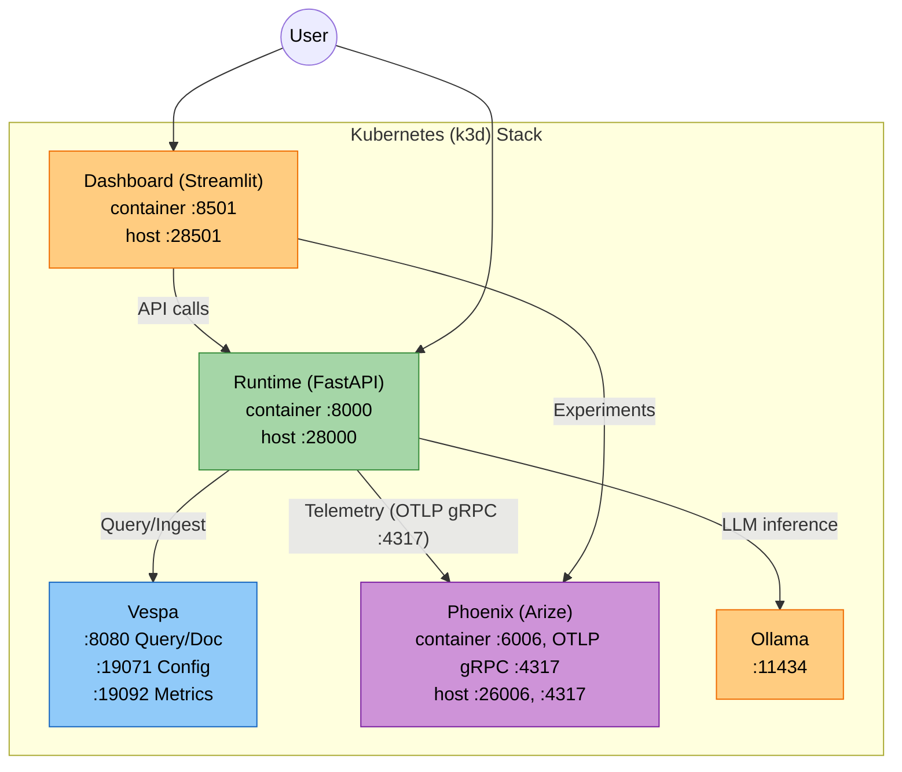
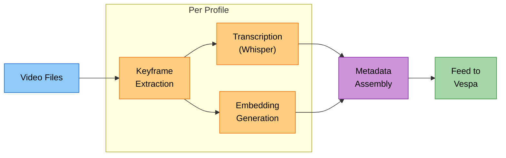
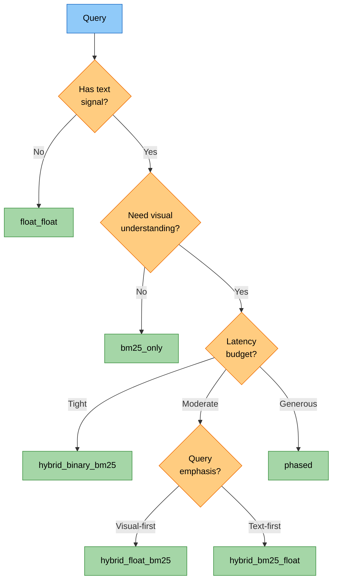
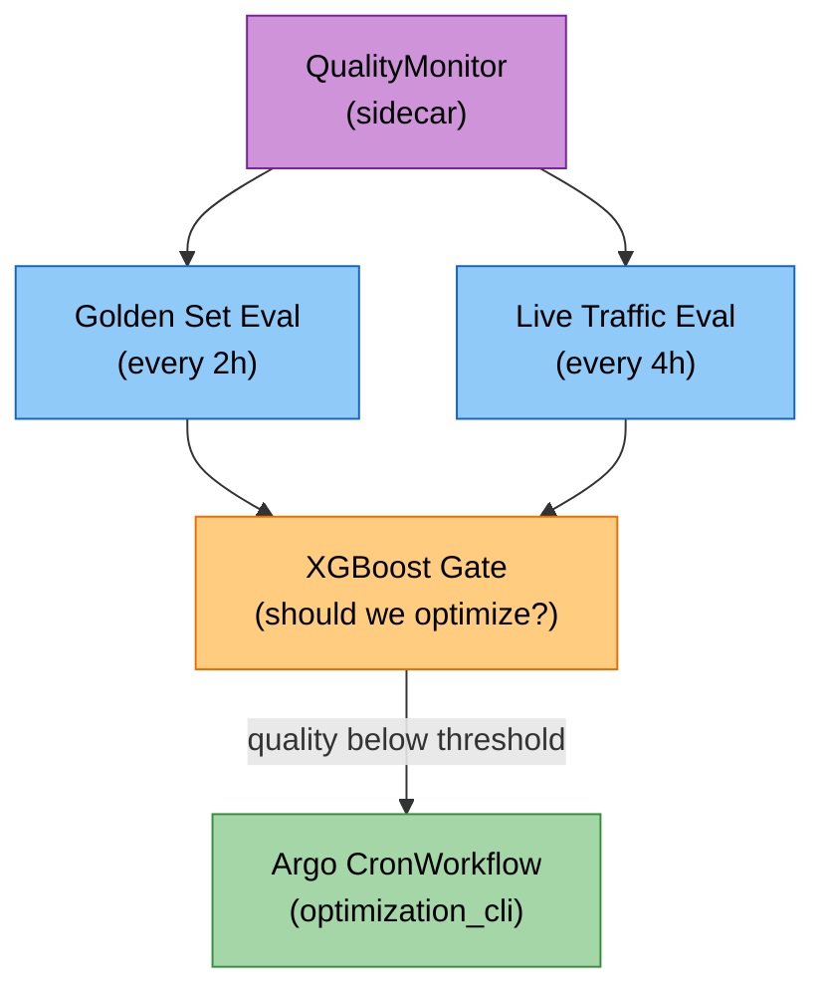
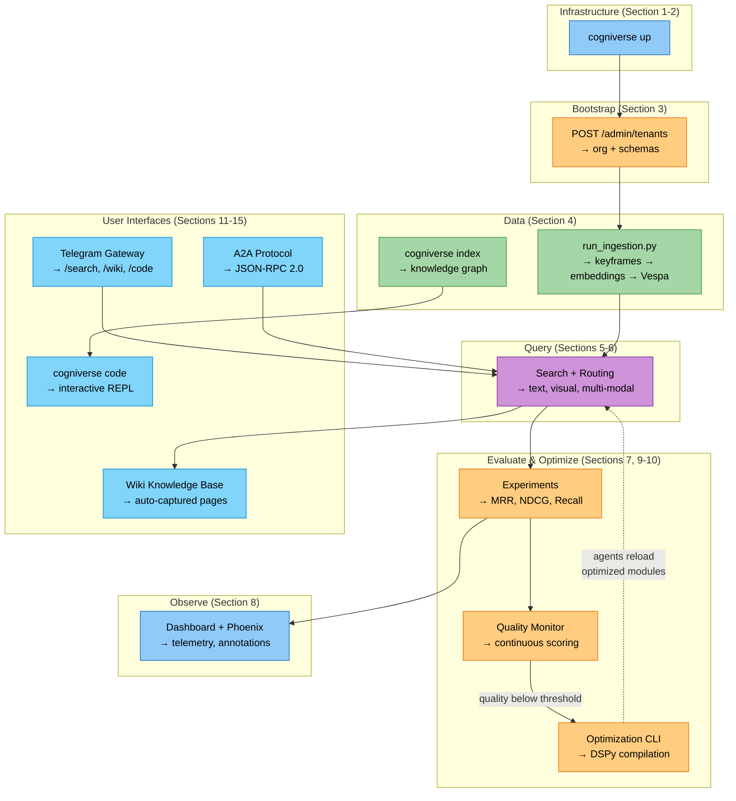

# Live Demo Guide

A hands-on companion to [Intelligent Query Routing](../architecture/intelligent-query-routing.md) and [Evaluation & Optimization Loop](../architecture/evaluation-optimization-loop.md). Walk through deploying, bootstrapping, ingesting, searching, and evaluating — demonstrating the techniques from those docs in a live setting.

---

## 1. Prerequisites & Quick Start

### Environment Setup

```bash
# Clone and install (UV workspace — resolves all 13 packages)
git clone <repo-url> && cd cogniverse
uv sync

# Environment variables
export ROUTER_OPTIMIZER_TEACHER_KEY=...   # for DSPy teacher model (any LiteLLM-supported provider)
export ANNOTATION_API_KEY=...             # for LLM auto-annotator (optional)

# VideoPrism requires JAX on CPU (unless you have a TPU)
export JAX_PLATFORM_NAME=cpu

# Every `cogniverse index` / `cogniverse code` / `cogniverse graph` command needs a
# tenant — pass `--tenant <id>` per-command, or export it once here:
export COGNIVERSE_TENANT_ID=acme:production
```

### Verify Installation

```bash
# Check the workspace packages are installed
uv run python -c "import cogniverse_core; print('Core OK')"
uv run python -c "import cogniverse_vespa; print('Vespa client OK')"
uv run python -c "import cogniverse_runtime; print('Runtime OK')"
```

---

## 2. Service Architecture

### Topology


```mermaid
graph TB
    subgraph "Kubernetes (k3d) Stack"
        VESPA["<span style='color:#000'>Vespa<br/>:8080 Query/Doc<br/>:19071 Config<br/>:19092 Metrics</span>"]
        RUNTIME["<span style='color:#000'>Runtime (FastAPI)<br/>container :8000<br/>host :28000</span>"]
        DASHBOARD["<span style='color:#000'>Dashboard (Streamlit)<br/>container :8501<br/>host :28501</span>"]
        PHOENIX["<span style='color:#000'>Phoenix (Arize)<br/>container :6006, OTLP gRPC :4317<br/>host :26006, :4317</span>"]
        OLLAMA["<span style='color:#000'>Ollama<br/>:11434</span>"]
    end

    RUNTIME -->|"Query/Ingest"| VESPA
    RUNTIME -->|"Telemetry (OTLP gRPC :4317)"| PHOENIX
    DASHBOARD -->|"API calls"| RUNTIME
    DASHBOARD -->|"Experiments"| PHOENIX
    RUNTIME -->|"LLM inference"| OLLAMA

    USER(("<span style='color:#000'>User</span>")) --> DASHBOARD
    USER --> RUNTIME

    style VESPA fill:#90caf9,stroke:#1565c0,color:#000
    style RUNTIME fill:#a5d6a7,stroke:#388e3c,color:#000
    style DASHBOARD fill:#ffcc80,stroke:#ef6c00,color:#000
    style PHOENIX fill:#ce93d8,stroke:#7b1fa2,color:#000
    style OLLAMA fill:#ffcc80,stroke:#ef6c00,color:#000
```

Runtime, Dashboard, and Phoenix each listen on the port shown above
*inside* their container. `cogniverse up` creates the k3d cluster with a
host-port mapping per service (`libs/cli/cogniverse_cli/cluster.py`
`DEFAULT_PORTS`), so from your host machine you reach them on different,
higher-numbered ports. Vespa and Ollama's host ports match their
container ports. There is no separate OTel Collector — Runtime exports
spans directly to Phoenix's built-in OTLP gRPC receiver on `:4317`.

### Port Reference

All commands below assume the stack is running via `cogniverse up` (k3d) and use the **host** port.

| Service | Host Port | Purpose | Health Check |
|---------|-----------|---------|--------------|
| **Vespa** | 8080 | Query & Document API | `curl http://localhost:19071/state/v1/health` |
| **Vespa** | 19071 | Config Server API | (same as above) |
| **Vespa** | 19092 | Metrics endpoint (container-only, not published by the k3d loadbalancer) | — |
| **Runtime** | 28000 | Unified FastAPI (search, ingest, agents, events, tenant admin) — container port 8000 | `curl http://localhost:28000/health` |
| **Dashboard** | 28501 | Streamlit UI — container port 8501 | `curl http://localhost:28501/_stcore/health` |
| **Phoenix** | 26006 | Evaluation & observability UI — container port 6006 | — |
| **Phoenix** | 4317 | OTLP gRPC span receiver (Runtime sends telemetry here directly) | — |
| **Ollama** | 11434 | Local LLM inference | `curl http://localhost:11434/api/tags` |
| **Argo** | 2746 | Argo Workflows API (optimization CronWorkflows) | — |

Tenant management is not a separate service in the k3d stack — it's
served by the Runtime itself at `$RUNTIME_URL/admin/tenants` (see
[Bootstrap](#3-bootstrap-tenant--schema-setup) below). A standalone
`tenant_manager.py` process (default port 9000) is also available for
lightweight local bootstrap without the full Runtime image; see Path B.

### Launch & Verify

```bash
# Start all services via k3d
cogniverse up

# Check status
cogniverse status
```

---

## 3. Bootstrap: Tenant & Schema Setup

The system requires a **tenant** before you can ingest or search. Tenant creation automatically provisions the organization and deploys schemas.

### Path A: Via the Runtime's Tenant API (Recommended for Demo)

> **Note**: The tenant-management endpoints (`admin/tenant_manager.py`) are
> mounted straight into the Runtime's FastAPI app under `/admin` — there is
> no separate tenant service to start. Hit them on the Runtime's own host
> port (`28000` after `cogniverse up`).

This is the single-call bootstrap. Creating a tenant:
1. Auto-creates the organization if it doesn't exist
2. Deploys all requested schemas to Vespa
3. Creates tenant metadata

```bash
RUNTIME_URL=http://localhost:28000

# Create a tenant — this bootstraps everything
curl -X POST "$RUNTIME_URL/admin/tenants" \
  -H "Content-Type: application/json" \
  -d '{
    "tenant_id": "acme:production",
    "created_by": "admin",
    "base_schemas": [
      "video_colpali_smol500_mv_frame",
      "video_videoprism_base_mv_chunk_30s"
    ]
  }'
```

**Response** (`schemas_deployed` lists the requested base schema names —
the live Vespa schema is each of these suffixed with `_{org_id}_{tenant_name}`):
```json
{
  "tenant_full_id": "acme:production",
  "org_id": "acme",
  "tenant_name": "production",
  "schemas_deployed": [
    "video_colpali_smol500_mv_frame",
    "video_videoprism_base_mv_chunk_30s"
  ],
  "status": "active",
  "created_at": 1736938200000
}
```

**Schema naming convention**: `{base_schema}_{org_id}_{tenant_name}` (e.g.
`video_colpali_smol500_mv_frame_acme_production` — the actual Vespa schema
name; `GET /admin/profiles/{profile}?tenant_id=...` or the
`/admin/profiles/{profile}/deploy` response's `tenant_schema_name` field
returns it directly).

```bash
# Verify tenant exists
curl "$RUNTIME_URL/admin/tenants/acme:production"

# List all tenants for the org
curl "$RUNTIME_URL/admin/organizations/acme/tenants"
```

### Path B: Via CLI Scripts (Dev Setup)

Schema deployment always flows through the runtime admin API so it
goes through `SchemaRegistry.deploy_schema` and the live-Vespa merge
path:

```bash
RUNTIME_URL=http://localhost:28000

# Deploy a profile's content schema for a tenant
curl -sfX POST "$RUNTIME_URL/admin/profiles/video_colpali_smol500_mv_frame/deploy" \
  -H 'Content-Type: application/json' \
  -d '{"tenant_id": "acme:production", "force": false}'

# Multiple profiles for the same tenant
for profile in video_colpali_smol500_mv_frame video_videoprism_base_mv_chunk_30s; do
  curl -sfX POST "$RUNTIME_URL/admin/profiles/$profile/deploy" \
    -H 'Content-Type: application/json' \
    -d '{"tenant_id": "acme:production"}'
done

# Single-schema dev deploy from a JSON file
uv run python scripts/deploy_json_schema.py configs/schemas/video_colpali_smol500_mv_frame_schema.json
```

**Alternative: standalone tenant-manager (no Runtime image needed).**
`cogniverse_runtime.admin.tenant_manager` also runs as its own FastAPI app —
useful for bootstrapping tenants against Vespa before the full Runtime
image is built. It serves the identical `/admin/tenants` and
`/admin/organizations` routes on its own port (default `9000`):

```bash
uv run python -m cogniverse_runtime.admin.tenant_manager &

curl -X POST http://localhost:9000/admin/tenants \
  -H "Content-Type: application/json" \
  -d '{"tenant_id": "acme:production", "created_by": "admin"}'
```

### Schema Profiles

| Profile | Model | Embedding Dims | Strategy | Chunk Size |
|---------|-------|---------------|----------|------------|
| `video_colpali_smol500_mv_frame` | ColPali | 320d (multi-vector, 1024 patches) | Frame-based | per-frame |
| `video_colqwen_omni_mv_chunk_30s` | ColQwen Omni | 320d (multi-vector, 1024 patches) | Chunk-based | 30s |
| `video_videoprism_base_mv_chunk_30s` | VideoPrism Base | 768d (multi-vector, 4096 patches) | Chunk-based | 30s |
| `video_videoprism_large_mv_chunk_30s` | VideoPrism Large | 1024d (multi-vector, 2048 patches) | Chunk-based | 30s |
| `video_videoprism_lvt_base_sv_chunk_6s` | VideoPrism LVT Base | 768d (single-vector) | Temporal | 6s |
| `video_videoprism_lvt_large_sv_chunk_6s` | VideoPrism LVT Large | 1024d (single-vector) | Temporal | 6s |

**Key distinctions:**
- **ColPali/ColQwen** — multi-vector patch embeddings (1024 patches per frame/chunk), matched via MaxSim
- **VideoPrism (`_mv_` profiles)** — multi-vector patch embeddings per chunk, matched via MaxSim
- **VideoPrism LVT** — single global embedding per chunk, matched via cosine similarity
- **LVT (Learned Video Tokenizer)** — temporal models with 6s chunks for fine-grained temporal search
- **`_sv_` profiles** — single-vector (one dense embedding per chunk); `_mv_` profiles — multi-vector (patch/token embeddings per frame or chunk)

---

## 4. Video Ingestion Pipeline

### Pipeline Flow


```mermaid
flowchart LR
    V["<span style='color:#000'>Video Files</span>"] --> KF["<span style='color:#000'>Keyframe<br/>Extraction</span>"]
    KF --> T["<span style='color:#000'>Transcription<br/>(Whisper)</span>"]
    KF --> E["<span style='color:#000'>Embedding<br/>Generation</span>"]
    T --> META["<span style='color:#000'>Metadata<br/>Assembly</span>"]
    E --> META
    META --> VESPA["<span style='color:#000'>Feed to<br/>Vespa</span>"]

    subgraph "Per Profile"
        KF
        T
        E
    end

    style V fill:#90caf9,stroke:#1565c0,color:#000
    style KF fill:#ffcc80,stroke:#ef6c00,color:#000
    style T fill:#ffcc80,stroke:#ef6c00,color:#000
    style E fill:#ffcc80,stroke:#ef6c00,color:#000
    style META fill:#ce93d8,stroke:#7b1fa2,color:#000
    style VESPA fill:#a5d6a7,stroke:#388e3c,color:#000
```

Each profile defines its own keyframe extraction strategy, embedding model, and chunking approach. Multiple profiles can run in parallel against the same videos.

### Ingestion Commands

`--tenant-id` is required — there is no default tenant; register one first via [Bootstrap](#3-bootstrap-tenant--schema-setup).

```bash
# Single profile — quick test
uv run python scripts/run_ingestion.py \
  --tenant-id acme:production \
  --video_dir data/testset/evaluation/sample_videos \
  --backend vespa \
  --profile video_colpali_smol500_mv_frame

# Multi-profile — compare retrieval approaches
uv run python scripts/run_ingestion.py \
  --tenant-id acme:production \
  --video_dir data/testset/evaluation/sample_videos \
  --backend vespa \
  --profile video_colpali_smol500_mv_frame \
           video_colqwen_omni_mv_chunk_30s \
           video_videoprism_base_mv_chunk_30s \
           video_videoprism_lvt_base_sv_chunk_6s

# Test mode — limited frames for faster iteration
uv run python scripts/run_ingestion.py \
  --tenant-id acme:production \
  --video_dir data/testset/evaluation/sample_videos \
  --backend vespa \
  --profile video_colpali_smol500_mv_frame \
  --test-mode --max-frames 1
```

### Sample Videos (10 test files)

| File | Content |
|------|---------|
| `v_-6dz6tBH77I.mp4` | Discus throwing |
| `v_-D1gdv_gQyw.mp4` | Man lighting fire |
| `v_-HpCLXdtcas.mkv` | Man lifting barbell |
| `v_-IMXSEIabMM.mp4` | Shoveling snow |
| `v_-MbZ-W0AbN0.mp4` | Furniture polish demonstration |
| `v_-cAcA8dO7kA.mp4` | Dirt bike crash |
| `v_-nl4G-00PtA.mp4` | Man washing dishes |
| `v_-pkfcMUIEMo.mp4` | Snow shoveling demonstration |
| `v_-uJnucdW6DY.mp4` | Kids playing with ball |
| `v_-vnSFKJNB94.mp4` | Diving maneuvers |

### Interpreting Output

Watch the log output for:
- **docs/sec** — ingestion throughput per profile
- **Success rate** — percentage of videos successfully processed
- **Embedding dimensions** — confirms the profile schema matches (320d for ColPali, 768d for VideoPrism Base, etc.)

```bash
# Follow logs during ingestion
tail -f outputs/logs/*.log
```

---

## 5. Search & Query Execution

### Ranking Strategies

The system supports 9 ranking strategies, from simple keyword matching to hybrid reranking:

| Strategy | Technique | When to Use |
|----------|-----------|-------------|
| `bm25_only` | BM25 text matching | Baseline, keyword queries |
| `float_float` | Dense float embeddings | Highest visual accuracy |
| `binary_binary` | Binary embeddings | Fastest visual search |
| `float_binary` | Float query, binary index | Speed/accuracy balance |
| `phased` | Binary retrieval → float reranking | Optimized two-phase |
| `hybrid_float_bm25` | Visual + text hybrid | Best overall accuracy |
| `hybrid_bm25_float` | Text-first + precise float rerank | Text-heavy queries |
| `hybrid_binary_bm25` | Fast hybrid (binary visual + text) | Low-latency hybrid |
| `hybrid_bm25_binary` | Text-first + binary visual rerank | Fast text-first hybrid |

### Run the Comprehensive Query Test

The golden dataset (`sample_videos_retrieval_queries.json`) contains queries matched to expected videos — questions, answer phrases, temporal queries, and consistency queries.

```bash
# Single profile, default strategy
uv run python tests/comprehensive_video_query_test_v2.py \
  --profiles video_colpali_smol500_mv_frame

# Multi-profile comparison across strategies
JAX_PLATFORM_NAME=cpu uv run python tests/comprehensive_video_query_test_v2.py \
  --profiles video_videoprism_base_mv_chunk_30s video_videoprism_large_mv_chunk_30s video_colpali_smol500_mv_frame \
  --test-multiple-strategies
```

### Sample Queries from the Golden Dataset

```json
{"query": "What is the man doing in the video and what is he wearing?",
 "expected_videos": ["v_-HpCLXdtcas"], "query_type": "question"}

{"query": "people shoveling",
 "expected_videos": ["v_-IMXSEIabMM"], "query_type": "answer_phrase"}

{"query": "What direction did the man look after throwing the disk?",
 "expected_videos": ["v_-6dz6tBH77I"], "query_type": "question"}

{"query": "What happens after the biker rides towards the middle of the dirt field?",
 "expected_videos": ["v_-cAcA8dO7kA"], "query_type": "question"}
```

### Result Metrics

Each experiment reports standard IR metrics:

| Metric | What It Measures |
|--------|-----------------|
| **MRR** (Mean Reciprocal Rank) | How high the first relevant result ranks |
| **NDCG@K** | Graded relevance of top-K results |
| **Recall@K** | Fraction of relevant results found in top-K |
| **Precision@K** | Fraction of top-K results that are relevant |

### Search Strategy Decision Flow


```mermaid
flowchart TD
    Q["<span style='color:#000'>Query</span>"] --> HAS_TEXT{"<span style='color:#000'>Has text<br/>signal?</span>"}
    HAS_TEXT -- "No" --> FLOAT["<span style='color:#000'>float_float</span>"]
    HAS_TEXT -- "Yes" --> NEED_VIS{"<span style='color:#000'>Need visual<br/>understanding?</span>"}
    NEED_VIS -- "No" --> BM25["<span style='color:#000'>bm25_only</span>"]
    NEED_VIS -- "Yes" --> LATENCY{"<span style='color:#000'>Latency<br/>budget?</span>"}
    LATENCY -- "Tight" --> BIN["<span style='color:#000'>hybrid_binary_bm25</span>"]
    LATENCY -- "Moderate" --> HYBRID{"<span style='color:#000'>Query<br/>emphasis?</span>"}
    LATENCY -- "Generous" --> PHASED["<span style='color:#000'>phased</span>"]
    HYBRID -- "Visual-first" --> HFB["<span style='color:#000'>hybrid_float_bm25</span>"]
    HYBRID -- "Text-first" --> HBF["<span style='color:#000'>hybrid_bm25_float</span>"]

    style Q fill:#90caf9,stroke:#1565c0,color:#000
    style FLOAT fill:#a5d6a7,stroke:#388e3c,color:#000
    style BM25 fill:#a5d6a7,stroke:#388e3c,color:#000
    style BIN fill:#a5d6a7,stroke:#388e3c,color:#000
    style HFB fill:#a5d6a7,stroke:#388e3c,color:#000
    style HBF fill:#a5d6a7,stroke:#388e3c,color:#000
    style PHASED fill:#a5d6a7,stroke:#388e3c,color:#000
    style HAS_TEXT fill:#ffcc80,stroke:#ef6c00,color:#000
    style NEED_VIS fill:#ffcc80,stroke:#ef6c00,color:#000
    style LATENCY fill:#ffcc80,stroke:#ef6c00,color:#000
    style HYBRID fill:#ffcc80,stroke:#ef6c00,color:#000
```

---

## 6. Intelligent Routing

> **Deep dive**: [Intelligent Query Routing](../architecture/intelligent-query-routing.md)

The routing system uses a DSPy-powered decision pipeline with an A2A agent architecture:

| Stage | Agent | Purpose |
|-------|-------|---------|
| Gateway triage | `GatewayAgent` | Classify simple vs. complex with GLiNER + deterministic rules (no LLM call), pick modality + generation type |
| Entity extraction | `EntityExtractionAgent` | Tiered NER: fast GLiNER + SpaCy path, DSPy ChainOfThought fallback |
| Query enhancement | `QueryEnhancementAgent` | Expand/rewrite queries with synonyms, context, and RRF fusion variants |
| Profile selection | `ProfileSelectionAgent` | DSPy picks the best backend search profile, with a heuristic fallback |
| Orchestration planning | `OrchestratorAgent` | DSPy plans a multi-agent workflow for queries the gateway routes as complex |
| Execution | `SearchAgent` / other execution agents | Run the routed single- or multi-agent workflow |

### Full Agent Roster

The system ships 23 agents (`configs/config.json` `agents.*`); most run
in-process inside the unified Runtime and share port 8000 internally
(`28000` on the host under `cogniverse up`). See
[Agents Module](../modules/agents.md) for full architecture detail.

**Gateway & routing** (all enabled)

| Agent | Port | Purpose |
|-------|------|---------|
| `gateway_agent` | 8000 | LLM-free entry point: GLiNER classification + deterministic routing |
| `orchestrator_agent` | 8013 | Autonomous multi-agent planner + A2A executor |
| `profile_selection_agent` | 8000 | DSPy backend-profile selection |
| `query_enhancement_agent` | 8000 | DSPy query expansion and RRF variant generation |
| `entity_extraction_agent` | 8000 | Tiered GLiNER/SpaCy + DSPy fallback NER |

**Search & analysis** (all enabled)

| Agent | Port | Purpose |
|-------|------|---------|
| `search_agent` | 8002 | Multi-modal Vespa retrieval with DSPy query rewriting and RRF ensemble fusion |
| `image_search_agent` | 8006 | ColPali multi-vector image similarity search, semantic/hybrid modes |
| `document_agent` | 8008 | Dual-strategy document search: ColPali visual, ColBERT/BM25 text, or hybrid |
| `text_analysis_agent` | 8003 | Runtime-configurable DSPy sentiment/summary/entity analysis |
| `audio_analysis_agent` | 8007 | Whisper transcription plus transcript/acoustic/hybrid Vespa audio search |

**Generation** (all enabled)

| Agent | Port | Purpose |
|-------|------|---------|
| `summarizer_agent` | 8004 | DSPy structured summaries with a thinking phase and VLM visual analysis |
| `detailed_report_agent` | 8005 | DSPy detailed reports (findings, technical + visual analysis) with optional RLM synthesis |
| `deep_research_agent` | 8009 | Decompose → parallel search → evaluate → synthesize research loop |
| `coding_agent` | 8010 | Plan → generate → execute → iterate coding loop in an OpenShell sandbox |

**Knowledge & audit** (reached via `/admin/tenants/{tenant_id}/knowledge/*`; only `audit_explanation_agent` is enabled by default)

| Agent | Port | Enabled | Purpose |
|-------|------|---------|---------|
| `audit_explanation_agent` | 8027 | yes | Explains an answer memory's derivation chain, source trust, and contradictions |
| `citation_tracing_agent` | 8019 | no | Walks a memory's provenance chain back to primary sources |
| `contradiction_reconciliation_agent` | 8020 | no | Resolves conflicting memories under a schema's contradiction policy |
| `multi_document_synthesis_agent` | 8021 | no | Synthesizes an answer across N documents while preserving citations |
| `kg_traversal_agent` | 8022 | no | Walks kg_node/kg_edge memories from a seed entity |
| `temporal_reasoning_agent` | 8025 | no | Compares a subject's knowledge across time windows |
| `knowledge_summarization_agent` | 8026 | no | Distills a knowledge subgraph into a citation-aware summary, with admin-gated org-trunk promotion |

**Multi-tenant & federation** (disabled by default)

| Agent | Port | Purpose |
|-------|------|---------|
| `cross_tenant_comparison_agent` | 8023 | Compares per-tenant views of a subject across an org |
| `federated_query_agent` | 8024 | Aggregates federated reads across tenants in an org, with optional RLM summarization |

### Test Routing via the API

```bash
# Route a query through the A2A protocol
curl -X POST http://localhost:28000/a2a \
  -H "Content-Type: application/json" \
  -d '{
    "jsonrpc": "2.0",
    "id": "1",
    "method": "tasks/send",
    "params": {
      "message": {
        "role": "user",
        "parts": [{"type": "text", "text": "Find videos of a dog playing fetch"}]
      },
      "metadata": {"tenant_id": "acme:production"}
    }
  }'
```

### Observing Routing in Phoenix

After running queries, open Phoenix at `http://localhost:26006`:
- Each routing decision creates a telemetry span
- Spans show: confidence scores, extracted entities, recommended agent
- Filter by project name to see routing-specific traces

---

## 7. Evaluation & Experiments

> **Deep dive**: [Evaluation & Optimization Loop](../architecture/evaluation-optimization-loop.md)

### Run Experiments

```bash
# Basic evaluation with quality metrics
uv run python scripts/run_experiments_with_visualization.py \
  --tenant-id acme:production \
  --dataset-path data/testset/evaluation/sample_videos_retrieval_queries.json \
  --dataset-name golden_eval_v1 \
  --profiles video_colpali_smol500_mv_frame

# All strategies for a profile
uv run python scripts/run_experiments_with_visualization.py \
  --tenant-id acme:production \
  --dataset-path data/testset/evaluation/sample_videos_retrieval_queries.json \
  --dataset-name golden_eval_v1 \
  --profiles video_colpali_smol500_mv_frame \
  --all-strategies

# With LLM-based evaluators
uv run python scripts/run_experiments_with_visualization.py \
  --tenant-id acme:production \
  --dataset-path data/testset/evaluation/sample_videos_retrieval_queries.json \
  --dataset-name golden_eval_v1 \
  --profiles video_colpali_smol500_mv_frame \
  --llm-evaluators \
  --evaluator visual_judge
```

### Evaluator Types

| Evaluator | What It Does | Requires |
|-----------|-------------|----------|
| **Quality evaluators** (default) | IR metrics: MRR, NDCG, Recall, Precision | Ground truth labels |
| **`visual_judge`** | LLM scores visual relevance of results | `ROUTER_OPTIMIZER_TEACHER_KEY` |
| **`llm_judge`** | LLM evaluates text answer quality | `ROUTER_OPTIMIZER_TEACHER_KEY` |
| **`modal_visual_judge`** | GPU-accelerated visual evaluation on Modal | Modal token |

### View Results in Phoenix

1. Open `http://localhost:26006`
2. Navigate to **Experiments** — each run appears as a named experiment
3. Compare metrics across profiles and strategies
4. Click into individual examples to see per-query scores

---

## 8. Dashboard & Observability

### Launch the Dashboard

```bash
# Via k3d (already running if you did `cogniverse up`) — host port 28501
# Or locally against a running Runtime (uses container port 8501 directly):
uv run streamlit run libs/dashboard/cogniverse_dashboard/app.py --server.port 8501
```

Open `http://localhost:28501` (k3d) or `http://localhost:8501` (local
streamlit) — a tenant must be selected in the sidebar first (there is no
default tenant). The dashboard is a flat set of 16 top-level tabs:

- **📊 Analytics** — Phoenix telemetry visualization (traces, latency, outliers)
- **🧪 Evaluation** — Experiment results and metric comparison
- **🗺️ Embedding Atlas** — Vector space visualization
- **🎯 Routing Evaluation** — Routing/gateway performance metrics
- **🔄 Orchestration Annotation** — Multi-agent orchestration review and labeling
- **📈 Profile Routing Metrics** — Per-profile routing performance
- **🔧 Optimization** — Upload training examples, trigger optimizer runs
- **🔬 Synthetic Data & Optimization** — Synthetic dataset generation for optimizers
- **✅ Approval Queue** — Human-in-the-loop review for pending changes
- **📥 Ingestion Testing** — Interactive video upload and pipeline processing
- **🔍 Interactive Search** — Live search testing across ranking strategies
- **💬 Chat** — Conversational search via the routing layer
- **⚙️ Configuration** — System config viewer/editor
- **👥 Tenant Management** — Organization/tenant CRUD
- **🧠 Memory** — Agent memory inspection
- **🅰️🅱️ RLM A/B Compare** — Latency/token/judge deltas from `optimization_cli --mode ab-compare` runs

### Runtime API Explorer

The Runtime exposes full OpenAPI docs:

```bash
# Interactive API docs
open http://localhost:28000/docs
```

Key endpoint groups (Runtime on host port 28000, container port 8000):

| Group | Base Path | Notable Endpoints |
|-------|-----------|-------------------|
| **Search** | `/search` | `POST /search/` — execute query; `GET /search/strategies` — list strategies |
| **Ingestion** | `/ingestion` | `POST /ingestion/start` — launch job; `GET /ingestion/status/{job_id}` — poll status |
| **Admin** | `/admin` | `GET /admin/system/stats`; `POST /admin/profiles`; `GET /admin/profiles`; `POST /admin/profiles/{name}/deploy` |
| **Tenants** | `/admin` | `POST /admin/tenants`; `GET /admin/tenants/{id}`; `POST /admin/organizations`; `GET /admin/organizations/{org_id}/tenants` (see [Bootstrap](#3-bootstrap-tenant--schema-setup)) |
| **Knowledge agents** | `/admin` | `POST /admin/tenants/{tenant_id}/knowledge/audit/explain`, `.../kg/traverse`, `.../summarize`, and 6 more — one per [knowledge & audit agent](#full-agent-roster) |
| **Tenant extensibility** | `/admin/tenant` | `PUT /admin/tenant/{id}/instructions`; `POST /admin/tenant/{id}/memories`; `POST /admin/tenant/{id}/optimize` |
| **Debug** | `/admin/debug` | `POST /admin/debug/memsnap`; `POST /admin/debug/memreset` |
| **Agents** | `/agents` | `POST /agents/register`; `POST /agents/{name}/process`; `GET /agents/` — list agents |
| **A2A** | `/a2a` | `POST /a2a` — JSON-RPC 2.0 (`method: tasks/send` or `tasks/sendSubscribe` for SSE streaming) |
| **Events** | `/events` | `GET /events/workflows/{id}` — workflow status; `POST /events/workflows/{id}/cancel` |
| **Wiki** | `/wiki` | See [Wiki Knowledge Base](#12-wiki-knowledge-base) |
| **Graph** | `/graph` | See [Knowledge Graph CLI](#13-knowledge-graph-cli) |
| **Health** | `/health` | `/health/live` (liveness); `/health/ready` (readiness) |

---

## 9. Optimization Pipeline

> **Deep dive**: [Evaluation & Optimization Loop](../architecture/evaluation-optimization-loop.md)

The optimization CLI closes the feedback loop: evaluation reveals quality gaps → optimization compiles improved DSPy modules → agents load them at startup.

### How It Works


```mermaid
flowchart LR
    SPANS["<span style='color:#000'>Phoenix Spans<br/>(production traffic)</span>"]
    BUILD["<span style='color:#000'>Build DSPy<br/>Training Examples</span>"]
    COMPILE["<span style='color:#000'>Compile Optimized<br/>Modules (SIMBA/MIPROv2)</span>"]
    ARTIFACT["<span style='color:#000'>Save Artifact<br/>(ArtifactManager)</span>"]
    LOAD["<span style='color:#000'>Agent loads artifact<br/>at next startup</span>"]

    SPANS --> BUILD --> COMPILE --> ARTIFACT --> LOAD

    style SPANS fill:#90caf9,stroke:#1565c0,color:#000
    style BUILD fill:#ffcc80,stroke:#ef6c00,color:#000
    style COMPILE fill:#ce93d8,stroke:#7b1fa2,color:#000
    style ARTIFACT fill:#a5d6a7,stroke:#388e3c,color:#000
    style LOAD fill:#90caf9,stroke:#1565c0,color:#000
```

### Optimization Modes

`--tenant-id` is required for every mode except `cleanup`, `egress-netpol`, and `monthly-reports`, which run globally.

| Mode | What It Optimizes | When to Use |
|------|-------------------|-------------|
| `gateway-thresholds` | GLiNER confidence thresholds | When fast-path misroutes queries |
| `entity-extraction` | Entity extraction accuracy | When entities are missed or wrong |
| `profile` | Profile performance ranking | After multi-profile experiments |
| `workflow` | Full end-to-end pipeline (all modes) | Scheduled nightly optimization |
| `triggered` | On-demand for specific agents | When quality monitor fires |
| `simba` | SIMBA optimizer for routing | Alternative to MIPROv2 |
| `online-routing-eval` | Scores `cogniverse.routing` spans (routing outcome + confidence calibration) | Continuous drift detection between full optimization runs |
| `synthetic` | Generates synthetic training examples via `SyntheticDataService` for `simba`/`profile`/`workflow` | Bootstrapping training data before the first real optimization pass |
| `rollback` | Restores an agent's active prompts/demos to a previously-snapshotted version | Undoing a bad optimization run |
| `ab-compare` | Runs `RLMABRunner` over a Phoenix queries dataset, emits `rlm.ab_compare` spans | Comparing RLM configurations head-to-head |
| `egress-netpol` | Generates k8s NetworkPolicy CRDs from `configs/agent_policies/` | Regenerating egress policies after an agent policy change |
| `monthly-reports` | Usage + performance report (per-org/tenant schema counts, per-tenant span latency/error rate) | Scheduled monthly reporting |
| `cleanup` | Purge old optimization logs | Periodic maintenance |

### Run Optimization

```bash
# Full workflow — all modes in sequence
python -m cogniverse_runtime.optimization_cli \
  --mode workflow --tenant-id acme:production

# Triggered by quality monitor (receives dataset name)
python -m cogniverse_runtime.optimization_cli \
  --mode triggered --tenant-id acme:production \
  --agents search,summary \
  --trigger-dataset optimization-trigger-default-20260403_040000

# Cleanup old logs (keep last 7 days)
python -m cogniverse_runtime.optimization_cli \
  --mode cleanup --log-retention-days 7
```

### What to Observe

After optimization runs, check Phoenix:
- New experiment with optimized module scores vs baseline
- Artifact saved to telemetry provider's dataset store
- On next agent restart, the agent loads the compiled module automatically

---

## 10. Quality Monitor

The quality monitor is a continuous sidecar that evaluates all agents and triggers optimization when quality degrades below thresholds.

### Architecture


```mermaid
flowchart TD
    QM["<span style='color:#000'>QualityMonitor<br/>(sidecar)</span>"]
    GOLDEN["<span style='color:#000'>Golden Set Eval<br/>(every 2h)</span>"]
    LIVE["<span style='color:#000'>Live Traffic Eval<br/>(every 4h)</span>"]
    GATE["<span style='color:#000'>XGBoost Gate<br/>(should we optimize?)</span>"]
    ARGO["<span style='color:#000'>Argo CronWorkflow<br/>(optimization_cli)</span>"]

    QM --> GOLDEN
    QM --> LIVE
    GOLDEN --> GATE
    LIVE --> GATE
    GATE -->|"quality below threshold"| ARGO

    style QM fill:#ce93d8,stroke:#7b1fa2,color:#000
    style GOLDEN fill:#90caf9,stroke:#1565c0,color:#000
    style LIVE fill:#90caf9,stroke:#1565c0,color:#000
    style GATE fill:#ffcc80,stroke:#ef6c00,color:#000
    style ARGO fill:#a5d6a7,stroke:#388e3c,color:#000
```

### Run the Quality Monitor

```bash
# Development — single evaluation cycle and exit
python -m cogniverse_runtime.quality_monitor_cli \
  --tenant-id acme:production \
  --runtime-url http://localhost:28000 \
  --phoenix-url http://localhost:26006 \
  --llm-model google/gemma-4-e4b-it \
  --once

# Continuous monitoring (production sidecar)
python -m cogniverse_runtime.quality_monitor_cli \
  --tenant-id acme:production \
  --runtime-url http://localhost:28000 \
  --phoenix-url http://localhost:26006 \
  --llm-model google/gemma-4-e4b-it \
  --golden-interval 7200 \
  --live-interval 14400 \
  --live-sample-count 20

# With Argo integration (auto-submits optimization workflows)
python -m cogniverse_runtime.quality_monitor_cli \
  --tenant-id acme:production \
  --runtime-url http://localhost:28000 \
  --phoenix-url http://localhost:26006 \
  --llm-model google/gemma-4-e4b-it \
  --argo-url http://argo-server:2746 \
  --argo-namespace cogniverse
```

### Configuration

| Flag | Default | Purpose |
|------|---------|---------|
| `--runtime-url` | `http://localhost:28000` | Runtime API URL for running golden queries |
| `--phoenix-url` | `http://localhost:6006` | Phoenix HTTP endpoint — override to `http://localhost:26006` when targeting a `cogniverse up` (k3d) deployment from the host |
| `--golden-interval` | 7200 (2h) | Seconds between golden set evaluations |
| `--live-interval` | 14400 (4h) | Seconds between live traffic evaluations |
| `--live-sample-count` | 20 | Spans to sample per agent for live eval |
| `--golden-dataset-path` | `data/testset/evaluation/sample_videos_retrieval_queries.json` | Path to golden dataset |
| `--llm-model` | *(required, no default)* | LLM model id for judge evaluations, e.g. `google/gemma-4-e4b-it` |
| `--once` | false | Single cycle and exit (for Argo CronWorkflows) |

In production, the quality monitor runs as a Kubernetes sidecar (`runtime.qualityMonitor.enabled: true` in Helm values).

---

## 11. Telegram Messaging Gateway

Users can interact with Cogniverse via Telegram — search, summarize, research, and manage the wiki through bot commands.

### Setup

```bash
# Set the bot token (create via @BotFather on Telegram)
export TELEGRAM_BOT_TOKEN=your_bot_token_here

# Start with messaging enabled
cogniverse up --messaging

# Or for development (polling mode):
export GATEWAY_MODE=polling
python -m cogniverse_messaging.gateway
```

### Invite Flow

Telegram access is tenant-scoped. Admins generate invite tokens; users redeem them.

```bash
# Admin: generate an invite token
curl -X POST http://localhost:28000/admin/messaging/invite \
  -H "Content-Type: application/json" \
  -d '{"tenant_id": "acme:production", "expires_in_hours": 24}'

# Returns: {"token": "abc123def456...", "tenant_id": "acme:production"}
```

The user sends `/start abc123def456...` to the bot to link their Telegram account to the tenant.

### Bot Commands

| Command | Agent | Example |
|---------|-------|---------|
| `/search <query>` | search_agent | `/search machine learning tutorial` |
| `/summarize <query>` | summarizer_agent | `/summarize the Python basics video` |
| `/report <query>` | detailed_report_agent | `/report Q4 content performance` |
| `/research <query>` | deep_research_agent | `/research best practices for async Python` |
| `/code <query>` | coding_agent | `/code write a FastAPI health endpoint` |
| `/wiki search <query>` | — | Search the wiki knowledge base |
| `/wiki topic <name>` | — | Look up a topic page by name |
| `/wiki index` | — | Show the full wiki index |
| `/wiki lint` | — | Check wiki for orphan/stale/empty pages |
| `/memories` | — | View stored conversation memories |
| `/instructions` | — | View system instructions |
| `/jobs create ...` | — | Create background processing jobs |
| `/jobs list` | — | List job status |
| Plain text | orchestrator_agent | `what videos do you have on transformers?` |
| Photo/video | search_agent | Send media to search for similar content |
| `/help` | — | Show all available commands |

Conversation history is maintained via Mem0 across sessions. The gateway runs in **polling** mode for development and **webhook** mode for production (`GATEWAY_MODE=webhook` with `TELEGRAM_WEBHOOK_URL` set).

---

## 12. Wiki Knowledge Base

The wiki automatically saves substantial agent interactions as searchable pages in Vespa. It requires no configuration — a per-tenant `wiki_pages_<tenant>` schema is deployed automatically on that tenant's first wiki access.

### Auto-Filing Triggers

Interactions are automatically saved to the wiki when:
- The response contains 3+ extracted entities
- The agent is `detailed_report_agent` or `deep_research_agent`
- The conversation spans 4+ turns

### REST API

```bash
# Save an interaction manually
curl -X POST http://localhost:28000/wiki/save \
  -H "Content-Type: application/json" \
  -d '{
    "query": "how does ColPali work?",
    "response": {"answer": "ColPali uses patch-level embeddings..."},
    "entities": ["ColPali", "patch_embeddings"],
    "agent_name": "summarizer_agent",
    "tenant_id": "acme:production"
  }'

# Search the wiki
curl -X POST http://localhost:28000/wiki/search \
  -H "Content-Type: application/json" \
  -d '{"query": "ColPali embeddings", "tenant_id": "acme:production", "top_k": 5}'

# Get a topic by slug
curl "http://localhost:28000/wiki/topic/colpali-embeddings?tenant_id=acme:production"

# Browse the full index
curl "http://localhost:28000/wiki/index?tenant_id=acme:production"

# Run lint checks (find orphan, stale, or empty pages)
curl "http://localhost:28000/wiki/lint?tenant_id=acme:production"

# Delete a topic
curl -X DELETE "http://localhost:28000/wiki/topic/old-topic?tenant_id=acme:production"
```

### Via Telegram

After connecting the messaging gateway, users interact with the wiki through bot commands:

```text
/wiki search ColPali
/wiki topic colpali-embeddings
/wiki index
/wiki lint
```

---

## 13. Knowledge Graph CLI

Index code or documents into a searchable knowledge graph stored in Vespa. The graph captures entities (functions, classes, modules) and their relationships (calls, imports, inherits).

### Build the Graph

```bash
# Index a codebase
cogniverse index ./libs --type code

# Index with a specific tenant
cogniverse index ./libs --type code --tenant acme:production

# Index with a specific Vespa profile
cogniverse index ./libs --type code --profile video_colpali_smol500_mv_frame
```

> **Note:** Only `--type code` is currently supported. `docs` and `video` types are planned.

### Query the Graph (CLI)

```bash
# View graph statistics
cogniverse graph stats
cogniverse graph stats --tenant acme:production

# Search for nodes by name or description
cogniverse graph search "query encoder" --top-k 10

# Find neighbors of a node
cogniverse graph neighbors "SearchAgent" --depth 2

# Find path between two nodes
cogniverse graph path "OrchestratorAgent" "SearchAgent" --max-depth 5
```

### REST API

```bash
# Search nodes
curl "http://localhost:28000/graph/search?query=encoder&tenant_id=acme:production&top_k=10"

# Get neighbors
curl "http://localhost:28000/graph/neighbors?node_id=SearchAgent&tenant_id=acme:production&depth=2"

# Find path between nodes
curl "http://localhost:28000/graph/path?source=OrchestratorAgent&target=SearchAgent&tenant_id=acme:production"

# Graph statistics
curl "http://localhost:28000/graph/stats?tenant_id=acme:production"
```

---

## 14. Coding Agent CLI

An interactive REPL for planning, generating, and executing code changes with streaming output.

### Launch the REPL

```bash
# Default — Python, 5 iterations
cogniverse code

# Specify language and iteration limit
cogniverse code --language python --iterations 10

# With codebase context (index first for best results)
cogniverse index ./libs --type code
cogniverse code --codebase ./libs

# Specify tenant
cogniverse code --tenant acme:production
```

### How It Works

The coding agent follows a plan → generate → execute loop:

1. **Plan** — Analyzes the request and proposes a change plan
2. **Generate** — Writes code changes with streaming output
3. **Execute** — Applies changes and runs validation
4. **Iterate** — Refines based on errors (up to `--iterations` limit)

The agent uses the knowledge graph (if indexed) for codebase context, and refuses to run generated code without an available OpenShell sandbox (`SandboxManager`) — there is no unsandboxed fallback.

> **Full documentation**: [Coding Agent CLI](../user/coding-agent-cli.md)

---

## 15. A2A Protocol

The Runtime exposes a Google A2A (Agent-to-Agent) protocol server for programmatic agent interaction. This is a JSON-RPC 2.0 interface for building applications that talk to Cogniverse agents.

### Agent Card

Every A2A server publishes a discovery document:

```bash
curl http://localhost:28000/a2a/.well-known/agent-card.json
```

Returns the agent card with capabilities, skills, and supported input/output modes. The pre-1.0 `a2a-sdk` path `/a2a/.well-known/agent.json` is also served for backward compatibility but is deprecated.

### Send a Task (Fire-and-Forget)

```bash
curl -X POST http://localhost:28000/a2a \
  -H "Content-Type: application/json" \
  -d '{
    "jsonrpc": "2.0",
    "id": "1",
    "method": "tasks/send",
    "params": {
      "message": {
        "role": "user",
        "parts": [{"type": "text", "text": "Find videos of a dog playing fetch"}]
      },
      "metadata": {"tenant_id": "acme:production"}
    }
  }'
```

### Stream a Task (SSE)

```bash
curl -X POST http://localhost:28000/a2a \
  -H "Content-Type: application/json" \
  -d '{
    "jsonrpc": "2.0",
    "id": "2",
    "method": "tasks/sendSubscribe",
    "params": {
      "message": {
        "role": "user",
        "parts": [{"type": "text", "text": "Summarize the cooking tutorial video"}]
      },
      "metadata": {"tenant_id": "acme:production"}
    }
  }'
```

The response is a Server-Sent Events stream with incremental results.

### REST Alternative

For simpler integrations, the REST agents API provides a direct endpoint:

```bash
# Process a task with a specific agent
curl -X POST http://localhost:28000/agents/search_agent/process \
  -H "Content-Type: application/json" \
  -d '{
    "agent_name": "search_agent",
    "query": "machine learning tutorial",
    "top_k": 10,
    "context": {"tenant_id": "acme:production"}
  }'

# List available agents
curl http://localhost:28000/agents/

# Get agent capabilities
curl http://localhost:28000/agents/search_agent
```

### Multi-Turn Conversations

Both A2A and REST support multi-turn context:

```bash
# REST: pass context_id and conversation_history
curl -X POST http://localhost:28000/agents/search_agent/process \
  -H "Content-Type: application/json" \
  -d '{
    "agent_name": "search_agent",
    "query": "show me longer ones",
    "context_id": "session-abc-123",
    "conversation_history": [
      {"role": "user", "content": "find Python tutorials"},
      {"role": "assistant", "content": "Found 5 results..."}
    ],
    "context": {"tenant_id": "acme:production"}
  }'
```

---

## 16. End-to-End Flow

The complete workflow ties all sections together — from infrastructure through the continuous improvement loop:


```mermaid
flowchart TD
    subgraph "Infrastructure (Section 1-2)"
        DC["<span style='color:#000'>cogniverse up</span>"]
    end

    subgraph "Bootstrap (Section 3)"
        TENANT["<span style='color:#000'>POST /admin/tenants<br/>→ org + schemas</span>"]
    end

    subgraph "Data (Section 4)"
        INGEST["<span style='color:#000'>run_ingestion.py<br/>→ keyframes → embeddings → Vespa</span>"]
        KG["<span style='color:#000'>cogniverse index<br/>→ knowledge graph</span>"]
    end

    subgraph "Query (Sections 5-6)"
        SEARCH["<span style='color:#000'>Search + Routing<br/>→ text, visual, multi-modal</span>"]
    end

    subgraph "Evaluate & Optimize (Sections 7, 9-10)"
        EXP["<span style='color:#000'>Experiments<br/>→ MRR, NDCG, Recall</span>"]
        QM["<span style='color:#000'>Quality Monitor<br/>→ continuous scoring</span>"]
        OPT["<span style='color:#000'>Optimization CLI<br/>→ DSPy compilation</span>"]
    end

    subgraph "Observe (Section 8)"
        DASH["<span style='color:#000'>Dashboard + Phoenix<br/>→ telemetry, annotations</span>"]
    end

    subgraph "User Interfaces (Sections 11-15)"
        TG["<span style='color:#000'>Telegram Gateway<br/>→ /search, /wiki, /code</span>"]
        WIKI["<span style='color:#000'>Wiki Knowledge Base<br/>→ auto-captured pages</span>"]
        CODE["<span style='color:#000'>cogniverse code<br/>→ interactive REPL</span>"]
        A2A["<span style='color:#000'>A2A Protocol<br/>→ JSON-RPC 2.0</span>"]
    end

    DC --> TENANT --> INGEST
    INGEST --> SEARCH
    KG --> CODE

    SEARCH --> EXP
    SEARCH --> WIKI
    EXP --> QM
    QM -->|"quality below threshold"| OPT
    OPT -.->|"agents reload<br/>optimized modules"| SEARCH
    EXP --> DASH

    TG --> SEARCH
    A2A --> SEARCH

    style DC fill:#90caf9,stroke:#1565c0,color:#000
    style TENANT fill:#ffcc80,stroke:#ef6c00,color:#000
    style INGEST fill:#a5d6a7,stroke:#388e3c,color:#000
    style KG fill:#a5d6a7,stroke:#388e3c,color:#000
    style SEARCH fill:#ce93d8,stroke:#7b1fa2,color:#000
    style EXP fill:#ffcc80,stroke:#ef6c00,color:#000
    style QM fill:#ffcc80,stroke:#ef6c00,color:#000
    style OPT fill:#ffcc80,stroke:#ef6c00,color:#000
    style DASH fill:#90caf9,stroke:#1565c0,color:#000
    style TG fill:#81d4fa,stroke:#0288d1,color:#000
    style WIKI fill:#81d4fa,stroke:#0288d1,color:#000
    style CODE fill:#81d4fa,stroke:#0288d1,color:#000
    style A2A fill:#81d4fa,stroke:#0288d1,color:#000
```

### Quick Reference

```bash
# 1. Start services
cogniverse up --messaging

# 2. Create tenant (auto-provisions org + schemas)
curl -X POST http://localhost:28000/admin/tenants \
  -H "Content-Type: application/json" \
  -d '{"tenant_id": "acme:production", "created_by": "admin",
       "base_schemas": ["video_colpali_smol500_mv_frame"]}'

# 3. Ingest videos
uv run python scripts/run_ingestion.py \
  --tenant-id acme:production \
  --video_dir data/testset/evaluation/sample_videos \
  --backend vespa \
  --profile video_colpali_smol500_mv_frame

# 4. Search via API
curl -X POST http://localhost:28000/search/ \
  -H "Content-Type: application/json" \
  -d '{"query": "dog playing fetch", "tenant_id": "acme:production", "top_k": 5}'

# 5. Evaluate retrieval quality
uv run python scripts/run_experiments_with_visualization.py \
  --tenant-id acme:production \
  --dataset-path data/testset/evaluation/sample_videos_retrieval_queries.json \
  --dataset-name golden_eval_v1 \
  --profiles video_colpali_smol500_mv_frame --all-strategies

# 6. Run optimization
python -m cogniverse_runtime.optimization_cli \
  --mode workflow --tenant-id acme:production

# 7. Start quality monitor (continuous)
python -m cogniverse_runtime.quality_monitor_cli \
  --tenant-id acme:production \
  --runtime-url http://localhost:28000 \
  --phoenix-url http://localhost:26006

# 8. Build knowledge graph
cogniverse index ./libs --type code --tenant acme:production

# 9. Interactive coding agent
cogniverse code --codebase ./libs --tenant acme:production

# 10. Open dashboard
open http://localhost:28501
```

---

**See also:**
- [Intelligent Query Routing](../architecture/intelligent-query-routing.md) — DSPy routing, entity extraction, multi-agent orchestration
- [Evaluation & Optimization Loop](../architecture/evaluation-optimization-loop.md) — synthetic data, HITL review, adaptive optimization
- [Coding Agent CLI](../user/coding-agent-cli.md) — Full coding agent documentation
- [Knowledge Graph](../user/knowledge-graph.md) — Graph extraction and querying
