# Live Demo Guide

A hands-on companion to [Intelligent Query Routing](./intelligent-query-routing.md) and [Evaluation & Optimization Loop](./evaluation-optimization-loop.md). Walk through deploying, bootstrapping, ingesting, searching, and evaluating — demonstrating the techniques from those docs in a live setting.

---

## 1. Prerequisites & Quick Start

### Environment Setup

```bash
# Clone and install (UV workspace — resolves all 11 packages)
git clone <repo-url> && cd cogniverse
uv sync

# Environment variables
export ROUTER_OPTIMIZER_TEACHER_KEY=...   # for DSPy teacher model (any LiteLLM-supported provider)
export ANNOTATION_API_KEY=...             # for LLM auto-annotator (optional)

# VideoPrism requires JAX on CPU (unless you have a TPU)
export JAX_PLATFORM_NAME=cpu
```

### Verify Installation

```bash
# Check the workspace packages are installed
uv run python -c "import cogniverse_core; print('Core OK')"
uv run python -c "import cogniverse_vespa; print('Vespa client OK')"
uv run python -c "import cogniverse_runtime; print('Runtime OK')"
```

---

## 2. Service Architecture

### Topology


### Port Reference

| Service | Port | Purpose | Health Check |
|---------|------|---------|--------------|
| **Vespa** | 8080 | Query & Document API | `curl http://localhost:19071/state/v1/health` |
| **Vespa** | 19071 | Config Server API | (same as above) |
| **Vespa** | 19092 | Metrics endpoint | — |
| **Runtime** | 8000 | Unified FastAPI (search, ingest, agents, events) | `curl http://localhost:8000/health` |
| **Tenant Manager** | 9000 | Organization & tenant management API | `curl http://localhost:9000/health` |
| **Dashboard** | 8501 | Streamlit UI | `curl http://localhost:8501/_stcore/health` |
| **Phoenix** | 6006 | Evaluation & observability UI | — |
| **OTel Collector** | 4317 | OTLP gRPC receiver | — |
| **OTel Collector** | 4318 | OTLP HTTP receiver | — |
| **Ollama** | 11434 | Local LLM inference | `curl http://localhost:11434/api/tags` |

### Launch & Verify

```bash
# Start all services
docker-compose up -d

# Watch startup progress
docker-compose ps

# Wait for Vespa (takes ~60s on first boot)
docker-compose logs -f vespa 2>&1 | grep -m1 "started"

# Confirm all healthy
docker-compose ps --format "table {{.Name}}\t{{.Status}}"
```

---

## 3. Bootstrap: Tenant & Schema Setup

The system requires a **tenant** before you can ingest or search. Tenant creation automatically provisions the organization and deploys schemas.

### Path A: Via Tenant Management API (Recommended for Demo)

> **Note**: Tenant management runs on a separate service (default port 9000), not the main Runtime API.

This is the single-call bootstrap. Creating a tenant:
1. Auto-creates the organization if it doesn't exist
2. Deploys all requested schemas to Vespa
3. Creates tenant metadata

```bash
# Create a tenant — this bootstraps everything
curl -X POST http://localhost:9000/admin/tenants \
  -H "Content-Type: application/json" \
  -d '{
    "tenant_id": "acme:production",
    "created_by": "admin",
    "base_schemas": [
      "video_colpali_smol500_mv_frame",
      "video_videoprism_base_mv_chunk_30s"
    ]
  }'
```

**Response** (confirms schemas deployed):
```json
{
  "tenant_full_id": "acme:production",
  "org_id": "acme",
  "tenant_name": "production",
  "schemas_deployed": [
    "video_colpali_smol500_mv_frame_acme_production",
    "video_videoprism_base_mv_chunk_30s_acme_production"
  ],
  "status": "active",
  "created_at": "2025-01-15T10:30:00Z"
}
```

**Schema naming convention**: `{base_schema}_{org_id}_{tenant_name}`

```bash
# Verify tenant exists
curl http://localhost:9000/admin/tenants/acme:production

# List all tenants for the org
curl http://localhost:9000/admin/organizations/acme/tenants
```

### Path B: Via CLI Scripts (Dev Setup)

For base schema deployment without the API:

```bash
# Deploy all base schemas (no tenant — just the templates)
uv run python scripts/deploy_all_schemas.py

# Deploy schemas for a specific tenant
uv run python scripts/deploy_all_schemas.py --tenant-id acme:production

# Deploy specific schemas only
uv run python scripts/deploy_all_schemas.py \
  --tenant-id acme:production \
  --base-schemas video_colpali_smol500_mv_frame,video_videoprism_base_mv_chunk_30s

# Deploy a single schema file directly
uv run python scripts/deploy_json_schema.py configs/schemas/video_colpali_smol500_mv_frame_schema.json
```

### Schema Profiles

| Profile | Model | Embedding Dims | Strategy | Chunk Size |
|---------|-------|---------------|----------|------------|
| `video_colpali_smol500_mv_frame` | ColPali | 128d (multi-vector, 1024 patches) | Frame-based | per-frame |
| `video_colqwen_omni_mv_chunk_30s` | ColQwen Omni | 128d (multi-vector, 1024 patches) | Chunk-based | 30s |
| `video_videoprism_base_mv_chunk_30s` | VideoPrism Base | 768d (single-vector) | Chunk-based | 30s |
| `video_videoprism_large_mv_chunk_30s` | VideoPrism Large | 1024d (single-vector) | Chunk-based | 30s |
| `video_videoprism_lvt_base_sv_chunk_6s` | VideoPrism LVT Base | 768d (single-vector) | Temporal | 6s |
| `video_videoprism_lvt_large_sv_chunk_6s` | VideoPrism LVT Large | 1024d (single-vector) | Temporal | 6s |

**Key distinctions:**
- **ColPali/ColQwen** — multi-vector patch embeddings (1024 patches per frame/chunk), matched via MaxSim
- **VideoPrism** — single global embedding per chunk, matched via cosine similarity
- **LVT (Learned Video Tokenizer)** — temporal models with 6s chunks for fine-grained temporal search
- **`_sv_` profiles** — single-video optimized; `_mv_` profiles — multi-video corpus

---

## 4. Video Ingestion Pipeline

### Pipeline Flow


Each profile defines its own keyframe extraction strategy, embedding model, and chunking approach. Multiple profiles can run in parallel against the same videos.

### Ingestion Commands

```bash
# Single profile — quick test
uv run python scripts/run_ingestion.py \
  --video_dir data/testset/evaluation/sample_videos \
  --backend vespa \
  --profile video_colpali_smol500_mv_frame

# Multi-profile — compare retrieval approaches
uv run python scripts/run_ingestion.py \
  --video_dir data/testset/evaluation/sample_videos \
  --backend vespa \
  --profile video_colpali_smol500_mv_frame \
           video_colqwen_omni_mv_chunk_30s \
           video_videoprism_base_mv_chunk_30s \
           video_videoprism_lvt_base_sv_chunk_6s

# Test mode — limited frames for faster iteration
uv run python scripts/run_ingestion.py \
  --video_dir data/testset/evaluation/sample_videos \
  --backend vespa \
  --profile video_colpali_smol500_mv_frame \
  --test-mode --max-frames 1

# With tenant
uv run python scripts/run_ingestion.py \
  --video_dir data/testset/evaluation/sample_videos \
  --backend vespa \
  --tenant-id acme:production \
  --profile video_colpali_smol500_mv_frame
```

### Sample Videos (10 test files)

| File | Content |
|------|---------|
| `v_-6dz6tBH77I.mp4` | Discus throwing |
| `v_-D1gdv_gQyw.mp4` | Man lighting fire |
| `v_-HpCLXdtcas.mkv` | Man lifting barbell |
| `v_-IMXSEIabMM.mp4` | Shoveling snow |
| `v_-MbZ-W0AbN0.mp4` | Furniture polish demonstration |
| `v_-cAcA8dO7kA.mp4` | Dirt bike crash |
| `v_-nl4G-00PtA.mp4` | Man washing dishes |
| `v_-pkfcMUIEMo.mp4` | Snow shoveling demonstration |
| `v_-uJnucdW6DY.mp4` | Kids playing with ball |
| `v_-vnSFKJNB94.mp4` | Diving maneuvers |

### Interpreting Output

Watch the log output for:
- **docs/sec** — ingestion throughput per profile
- **Success rate** — percentage of videos successfully processed
- **Embedding dimensions** — confirms the profile schema matches (128d for ColPali, 768d for VideoPrism Base, etc.)

```bash
# Follow logs during ingestion
tail -f outputs/logs/*.log
```

---

## 5. Search & Query Execution

### Ranking Strategies

The system supports 7 ranking strategies, from simple keyword matching to hybrid reranking:

| Strategy | Technique | When to Use |
|----------|-----------|-------------|
| `bm25_only` | BM25 text matching | Baseline, keyword queries |
| `bm25_binary` | BM25 + binary embedding pre-filter | Fast approximate matching |
| `bm25_float` | BM25 + float embedding scoring | Accurate semantic matching |
| `bm25_float_rerank` | BM25 + float + cross-encoder rerank | Highest quality, slowest |
| `semantic_only` | Pure embedding similarity | Visual queries with no text signal |
| `hybrid_rrf` | Reciprocal Rank Fusion (BM25 + semantic) | Balanced keyword + semantic |
| `hybrid_weighted` | Weighted combination of signals | Tunable precision/recall trade-off |

### Run the Comprehensive Query Test

The golden dataset (`sample_videos_retrieval_queries.json`) contains queries matched to expected videos — questions, answer phrases, temporal queries, and consistency queries.

```bash
# Single profile, default strategy
uv run python tests/comprehensive_video_query_test_v2.py \
  --profiles video_colpali_smol500_mv_frame

# Multi-profile comparison across strategies
JAX_PLATFORM_NAME=cpu uv run python tests/comprehensive_video_query_test_v2.py \
  --profiles video_videoprism_base_mv_chunk_30s video_videoprism_large_mv_chunk_30s video_colpali_smol500_mv_frame \
  --test-multiple-strategies
```

### Sample Queries from the Golden Dataset

```json
{"query": "What is the man doing in the video and what is he wearing?",
 "expected_videos": ["v_-HpCLXdtcas"], "query_type": "question"}

{"query": "people shoveling",
 "expected_videos": ["v_-IMXSEIabMM"], "query_type": "answer_phrase"}

{"query": "What direction did the man look after throwing the disk?",
 "expected_videos": ["v_-6dz6tBH77I"], "query_type": "question"}

{"query": "What happens after the biker rides towards the middle of the dirt field?",
 "expected_videos": ["v_-cAcA8dO7kA"], "query_type": "question"}
```

### Result Metrics

Each experiment reports standard IR metrics:

| Metric | What It Measures |
|--------|-----------------|
| **MRR** (Mean Reciprocal Rank) | How high the first relevant result ranks |
| **NDCG@K** | Graded relevance of top-K results |
| **Recall@K** | Fraction of relevant results found in top-K |
| **Precision@K** | Fraction of top-K results that are relevant |

### Search Strategy Decision Flow


---

## 6. Intelligent Routing Demo

> **Deep dive**: [Intelligent Query Routing](./intelligent-query-routing.md)

The routing system uses a 4-tier escalation chain to classify and route queries:

| Tier | Method | Speed | Confidence Threshold |
|------|--------|-------|---------------------|
| 1 | GLiNER (zero-shot NER) | Fast | 0.7 |
| 2 | LLM classification | Slow | 0.6 |
| 3 | LangExtract (structured) | Medium | 0.5 |
| 4 | Keyword fallback | Instant | Always passes |

### Run the Routing Demo

```bash
# Concise output — shows final routing decisions
uv run python scripts/demo_routing_unified.py

# Verbose — shows tier-by-tier confidence scores
uv run python scripts/demo_routing_unified.py --verbose

# Test a specific tier category
uv run python scripts/demo_routing_unified.py --category tier1_simple
uv run python scripts/demo_routing_unified.py --category tier2_complex
```

### What to Observe

**Simple query** (resolves at Tier 1 — GLiNER):
- _"Find videos of a dog playing fetch"_
- GLiNER extracts entities: `[ANIMAL: dog, ACTION: playing fetch]`
- Confidence > 0.7 → routes to single video search agent

**Complex query** (escalates to Tier 2+ — triggers orchestration):
- _"Find videos of a golden retriever at a park, then summarize the training techniques and compare with indoor training"_
- Requires search + summarization + comparison → 3+ signals detected
- Routes to multi-agent orchestrator

### Observing Routing in Phoenix

After running the demo, open Phoenix at `http://localhost:6006`:
- Each routing decision creates a telemetry span
- Spans show: tier reached, confidence scores, extracted entities, final decision
- Filter by project name to see routing-specific traces

---

## 7. Evaluation & Experiments

> **Deep dive**: [Evaluation & Optimization Loop](./evaluation-optimization-loop.md)

### Run Experiments

```bash
# Basic evaluation with quality metrics
uv run python scripts/run_experiments_with_visualization.py \
  --dataset-path data/testset/evaluation/sample_videos_retrieval_queries.json \
  --dataset-name golden_eval_v1 \
  --profiles video_colpali_smol500_mv_frame

# All strategies for a profile
uv run python scripts/run_experiments_with_visualization.py \
  --dataset-path data/testset/evaluation/sample_videos_retrieval_queries.json \
  --dataset-name golden_eval_v1 \
  --profiles video_colpali_smol500_mv_frame \
  --all-strategies

# With LLM-based evaluators
uv run python scripts/run_experiments_with_visualization.py \
  --dataset-path data/testset/evaluation/sample_videos_retrieval_queries.json \
  --dataset-name golden_eval_v1 \
  --profiles video_colpali_smol500_mv_frame \
  --llm-evaluators \
  --evaluator visual_judge
```

### Evaluator Types

| Evaluator | What It Does | Requires |
|-----------|-------------|----------|
| **Quality evaluators** (default) | IR metrics: MRR, NDCG, Recall, Precision | Ground truth labels |
| **`visual_judge`** | LLM scores visual relevance of results | `ROUTER_OPTIMIZER_TEACHER_KEY` |
| **`llm_judge`** | LLM evaluates text answer quality | `ROUTER_OPTIMIZER_TEACHER_KEY` |
| **`modal_visual_judge`** | GPU-accelerated visual evaluation on Modal | Modal token |

### View Results in Phoenix

1. Open `http://localhost:6006`
2. Navigate to **Experiments** — each run appears as a named experiment
3. Compare metrics across profiles and strategies
4. Click into individual examples to see per-query scores

---

## 8. Dashboard & Observability

### Launch the Dashboard

```bash
# Via Docker (already running if you did docker-compose up)
# Or locally:
uv run streamlit run scripts/phoenix_dashboard_standalone.py --server.port 8501
```

Open `http://localhost:8501` — the dashboard has 3 top-level tabs with nested functionality:

**🧑‍💼 User Tab** — End-user interfaces:
- **💬 Chat** — Conversational search interface
- **🔍 Interactive Search** — Live search with relevance annotation
- **🧠 Memory** — Agent memory inspection

**⚙️ Admin Tab** — System administration:
- **⚙️ Configuration** — System config viewer/editor
- **📥 Ingestion Testing** — Interactive video processing with profile selection
- **🔧 Optimization** — Trigger routing optimizer with user-provided examples

**📊 Monitoring Tab** — Observability & analytics:
- **📊 Analytics** — Phoenix telemetry visualization
- **🧪 Evaluation** — Experiment results and metric comparison
- **🗺️ Embedding Atlas** — Vector space visualization
- **🎯 Routing Evaluation** — Routing performance metrics
- **🔄 Orchestration** — Multi-agent orchestration analysis
- **📊 Multi-Modal Performance** — Per-modality metrics
- **🧬 Fine-Tuning** — Model fine-tuning tools

### Runtime API Explorer

The Runtime exposes full OpenAPI docs:

```bash
# Interactive API docs
open http://localhost:8000/docs
```

Key endpoint groups (Runtime on port 8000):

| Group | Base Path | Notable Endpoints |
|-------|-----------|-------------------|
| **Search** | `/search` | `POST /search/` — execute query; `GET /search/strategies` — list strategies |
| **Ingestion** | `/ingestion` | `POST /ingestion/start` — launch job; `GET /ingestion/status/{job_id}` — poll status |
| **Admin** | `/admin` | `GET /admin/system/stats`; `POST /admin/profiles`; `GET /admin/profiles`; `POST /admin/profiles/{name}/deploy` |
| **Agents** | `/agents` | `POST /agents/register`; `POST /agents/{name}/process` |
| **Events** | `/events` | `GET /events/workflows/{id}` — workflow status; `POST /events/workflows/{id}/cancel` |
| **Health** | `/health` | `/health/live` (liveness); `/health/ready` (readiness) |

Tenant management (separate service on port 9000):

| Group | Base Path | Notable Endpoints |
|-------|-----------|-------------------|
| **Organizations** | `/admin/organizations` | `POST /admin/organizations` — create org; `GET /admin/organizations` — list orgs |
| **Tenants** | `/admin/tenants` | `POST /admin/tenants` — create tenant; `GET /admin/tenants/{id}` — get tenant; `GET /admin/organizations/{org_id}/tenants` — list org tenants |

---

## 9. End-to-End Flow

The complete demo flow ties all sections together:

```mermaid
flowchart TD
    subgraph "Infrastructure"
        DC["<span style='color:#000'>docker-compose up</span>"]
    end

    subgraph "Bootstrap (Section 3)"
        TENANT["<span style='color:#000'>POST /admin/tenants<br/>→ org + schemas</span>"]
    end

    subgraph "Data (Section 4)"
        INGEST["<span style='color:#000'>run_ingestion.py<br/>→ keyframes → embeddings → Vespa</span>"]
    end

    subgraph "Query (Sections 5-6)"
        SEARCH["<span style='color:#000'>comprehensive_video_query_test<br/>→ MRR, NDCG, Recall</span>"]
        ROUTE["<span style='color:#000'>demo_routing_unified.py<br/>→ GLiNER → LLM → orchestration</span>"]
    end

    subgraph "Evaluate (Section 7)"
        EXP["<span style='color:#000'>run_experiments_with_visualization.py<br/>→ Phoenix experiments</span>"]
    end

    subgraph "Observe (Section 8)"
        DASH["<span style='color:#000'>Dashboard + Phoenix<br/>→ telemetry, annotations</span>"]
    end

    DC --> TENANT --> INGEST
    INGEST --> SEARCH --> ROUTE
    ROUTE --> EXP --> DASH
    DASH -.->|"Annotations feed back<br/>into optimization"| ROUTE

    style DC fill:#90caf9,stroke:#1565c0,color:#000
    style TENANT fill:#ffcc80,stroke:#ef6c00,color:#000
    style INGEST fill:#a5d6a7,stroke:#388e3c,color:#000
    style SEARCH fill:#ce93d8,stroke:#7b1fa2,color:#000
    style ROUTE fill:#ce93d8,stroke:#7b1fa2,color:#000
    style EXP fill:#ffcc80,stroke:#ef6c00,color:#000
    style DASH fill:#90caf9,stroke:#1565c0,color:#000
```



### Quick Reference: The 6 Commands

```bash
# 1. Start services
docker-compose up -d

# 2. Create tenant (auto-provisions org + schemas)
curl -X POST http://localhost:9000/admin/tenants \
  -H "Content-Type: application/json" \
  -d '{"tenant_id": "acme:production", "created_by": "admin"}'

# 3. Ingest videos
uv run python scripts/run_ingestion.py \
  --video_dir data/testset/evaluation/sample_videos \
  --backend vespa \
  --profile video_colpali_smol500_mv_frame

# 4. Run retrieval evaluation
JAX_PLATFORM_NAME=cpu uv run python tests/comprehensive_video_query_test_v2.py \
  --profiles video_colpali_smol500_mv_frame --test-multiple-strategies

# 5. Run routing demo
uv run python scripts/demo_routing_unified.py --verbose

# 6. Launch experiments
uv run python scripts/run_experiments_with_visualization.py \
  --dataset-path data/testset/evaluation/sample_videos_retrieval_queries.json \
  --dataset-name golden_eval_v1 \
  --profiles video_colpali_smol500_mv_frame --all-strategies
```

---

**See also:**
- [Intelligent Query Routing](./intelligent-query-routing.md) — 4-tier routing architecture, entity extraction, DSPy signatures, multi-agent orchestration
- [Evaluation & Optimization Loop](./evaluation-optimization-loop.md) — synthetic data generation, HITL review, adaptive optimizer selection, annotation feedback
