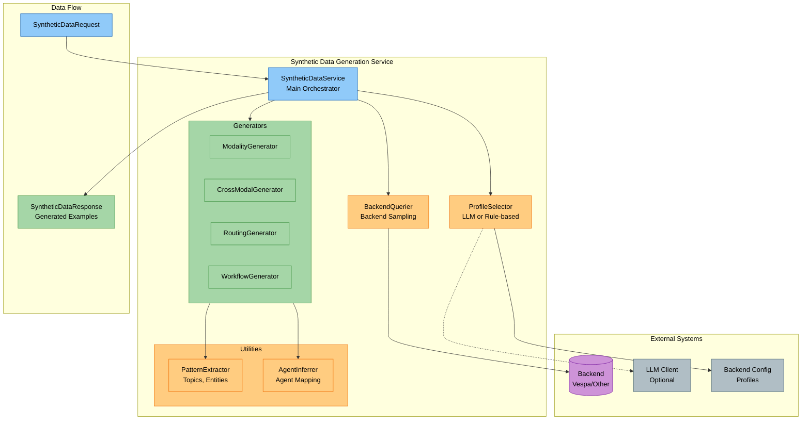
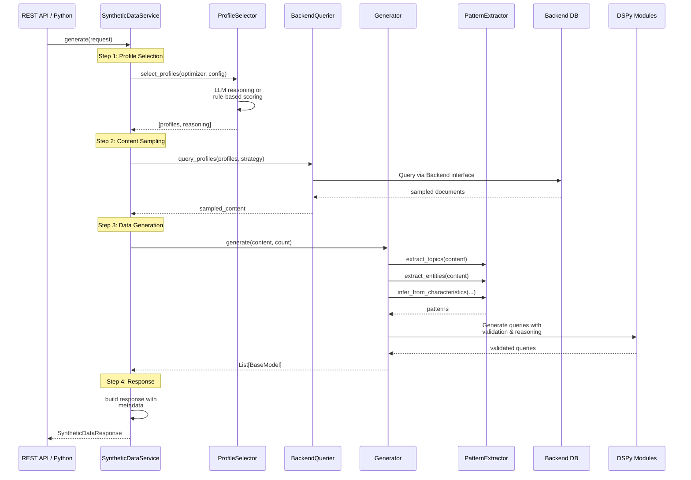

# Synthetic Data Generation System

**Package**: `cogniverse-synthetic` (Core Layer)
**Location**: `libs/synthetic/cogniverse_synthetic`

The synthetic data generation system creates high-quality training examples for all Cogniverse optimizers by sampling real content from backend storage and generating realistic queries using DSPy-driven LLM modules with validation.

## Overview

The system extends DSPy optimization to all routing and orchestration components by automatically generating diverse, realistic training datasets. It uses agent-based profile selection and backend schema introspection to create synthetic examples that match production patterns.

### Supported Optimizers

1. **ModalityOptimizer** - Per-modality routing (VIDEO, DOCUMENT, IMAGE, AUDIO)
2. **CrossModalOptimizer** - Multi-modal fusion decisions
3. **RoutingOptimizer** - Entity-based advanced routing
4. **WorkflowOptimizer** - Multi-agent workflow orchestration
5. **UnifiedOptimizer** - Combined routing and workflow planning

## Architecture

### System Overview



### Generation Pipeline



### Core Components

#### 1. Registry (`registry.py`)
Central configuration mapping optimizers to generators and schemas:

```python
from cogniverse_synthetic.registry import OPTIMIZER_REGISTRY, get_optimizer_config

# Get optimizer configuration
config = get_optimizer_config("cross_modal")
print(config.schema_class)  # FusionHistorySchema
print(config.backend_query_strategy)  # "cross_modal_pairs"
```

#### 2. Schemas (`schemas.py`)
Pydantic models for all optimizer training data:

- `ModalityExampleSchema` - Modality routing examples
- `FusionHistorySchema` - Cross-modal fusion results
- `RoutingExperienceSchema` - Entity-based routing
- `WorkflowExecutionSchema` - Workflow execution patterns
- `SyntheticDataRequest` / `SyntheticDataResponse` - API contracts

#### 3. ProfileSelector (`profile_selector.py`)
Selects optimal backend profiles for data generation:

```python
from cogniverse_synthetic.profile_selector import ProfileSelector

selector = ProfileSelector(llm_client=llm)  # or None for rule-based
profiles, reasoning = await selector.select_profiles(
    optimizer_name="modality",
    optimizer_task="Per-modality routing optimization",
    available_profiles=backend_config["video_processing_profiles"],
    max_profiles=3
)
# Returns: (["video_colpali_smol500_mv_frame", ...], "reasoning...")
```

**Selection Strategies**:

- **LLM-based**: Uses reasoning to match profile characteristics to optimizer needs
- **Rule-based**: Heuristic scoring with diversity selection (fallback)

#### 4. BackendQuerier (`backend_querier.py`)
Samples content from backend storage (Vespa or other) using Backend interface:

```python
from cogniverse_synthetic.backend_querier import BackendQuerier
from cogniverse_core.registries.backend_registry import BackendRegistry
from cogniverse_foundation.config.utils import create_default_config_manager
from cogniverse_core.schemas.filesystem_loader import FilesystemSchemaLoader
from pathlib import Path

# Initialize configuration
config_manager = create_default_config_manager()
schema_loader = FilesystemSchemaLoader(Path("configs/schemas"))

# Get backend from registry (handles instantiation and caching)
backend = BackendRegistry.get_search_backend(
    name="vespa",
    config_manager=config_manager,
    schema_loader=schema_loader
)

# Initialize backend querier with config and field mappings
from cogniverse_foundation.config.unified_config import BackendConfig, FieldMappingConfig

# Load or create backend configuration
backend_config = BackendConfig()  # Uses defaults, or load from config manager
field_mappings = FieldMappingConfig()  # Uses defaults, or load from config manager

querier = BackendQuerier(
    backend=backend,
    backend_config=backend_config,
    field_mappings=field_mappings
)

samples = await querier.query_profiles(
    profile_configs=[{"profile_name": "video_colpali_smol500_mv_frame"}],
    sample_size=200,
    strategy="diverse"  # or "entity_rich", "temporal_recent", etc.
)
```

**Sampling Strategies**:

- `diverse` - Random sampling across all content
- `temporal_recent` - Recent content (time-based)
- `entity_rich` - Content with many named entities
- `multi_modal_sequences` - Content from different modalities
- `by_modality` - Specific modality filtering
- `cross_modal_pairs` - Paired content from different modalities

**Backend Abstraction**: Uses `Backend` interface to support any vector database (Vespa, Pinecone, Weaviate, etc.)

#### 5. Generators (`generators/`)
Four concrete generators implementing the `BaseGenerator` interface:

**ModalityGenerator** (`generators/modality.py`):
```python
# Uses DSPy modules to generate modality-specific queries
# Example DSPy-generated queries:
# "show me TensorFlow videos"
# "find machine learning documents"

# ModalityGenerator requires configuration (created by SyntheticDataService)
# When used directly:
from cogniverse_foundation.config.unified_config import OptimizerGenerationConfig
from cogniverse_synthetic.utils import PatternExtractor, AgentInferrer

optimizer_config = OptimizerGenerationConfig(...)  # With DSPy modules and agent mappings
modality_gen = ModalityGenerator(
    pattern_extractor=PatternExtractor(),
    agent_inferrer=AgentInferrer(),
    optimizer_config=optimizer_config
)
examples = await modality_gen.generate(
    sampled_content=backend_samples,
    target_count=100,
    modality="VIDEO"
)
# Returns: List[ModalityExampleSchema]
```

**CrossModalGenerator** (`generators/cross_modal.py`):
```python
# Generates fusion scenarios:
# Primary: VIDEO results, Secondary: DOCUMENT results
# fusion_context: {"agreement": 0.8, "ambiguity": 0.2, ...}

examples = await cross_modal_gen.generate(
    sampled_content=backend_samples,
    target_count=100
)
# Returns: List[FusionHistorySchema]
```

**RoutingGenerator** (`generators/routing.py`):
```python
# Uses ValidatedEntityQueryGenerator with ChainOfThought and retry logic
# Generates entity-annotated queries guaranteed to contain entities:
# Query: "find TensorFlow object detection tutorial"
# Enhanced: "find TensorFlow(TECHNOLOGY) object detection tutorial"
# entities: [{"text": "TensorFlow", "type": "TECHNOLOGY"}]

# RoutingGenerator requires configuration (created by SyntheticDataService)
# When used directly:
from cogniverse_foundation.config.unified_config import OptimizerGenerationConfig
from cogniverse_synthetic.utils import PatternExtractor, AgentInferrer

optimizer_config = OptimizerGenerationConfig(...)  # With DSPy modules
routing_gen = RoutingGenerator(
    pattern_extractor=PatternExtractor(),
    agent_inferrer=AgentInferrer(),
    optimizer_config=optimizer_config
)
examples = await routing_gen.generate(
    sampled_content=backend_samples,
    target_count=100
)
# Returns: List[RoutingExperienceSchema]
# Each example validated to contain at least one entity (3 retry attempts)
```

**WorkflowGenerator** (`generators/workflow.py`):
```python
# Generates workflow patterns:
# Simple: ["video_search_agent"]
# Complex: ["video_search_agent", "summarizer", "detailed_report"]

examples = await workflow_gen.generate(
    sampled_content=backend_samples,
    target_count=100
)
# Returns: List[WorkflowExecutionSchema]
```

#### 6. Utilities (`utils/`)

**PatternExtractor** (`utils/pattern_extraction.py`):

- Extract topics (bigrams, trigrams)

- Extract entities (capitalized terms)

- Extract temporal patterns (years, dates)

- Extract content types (tutorial, guide, overview)

- Extract relationships (co-occurrence)

**AgentInferrer** (`utils/agent_inference.py`):

- Map modality → agent

- Infer agents from content characteristics

- Generate workflow sequences

- Validate agent sequences

#### 7. DSPy Signatures and Modules

**DSPy Signatures** (`dspy_signatures.py`):

Defines the interface between generators and LLMs for query generation. Signatures guide LLM behavior through field descriptions.

```python
class GenerateEntityQuery(dspy.Signature):
    """Generate search query that MUST include at least one of the provided entities"""

    topics: str = dspy.InputField(
        desc="Comma-separated topics from content"
    )
    entities: str = dspy.InputField(
        desc="Comma-separated named entities - YOUR QUERY MUST MENTION AT LEAST ONE OF THESE"
    )
    entity_types: str = dspy.InputField(
        desc="Comma-separated entity types (TECHNOLOGY, ORGANIZATION, CONCEPT)"
    )

    reasoning: str = dspy.OutputField(
        desc="Brief explanation of which entity/entities you're including and why"
    )
    query: str = dspy.OutputField(
        desc="Natural query that explicitly mentions at least one entity"
    )
```

**Available Signatures**:

- `GenerateModalityQuery` - Generate modality-specific queries
- `GenerateEntityQuery` - Generate entity-rich queries with reasoning
- `InferAgentFromModality` - Infer correct agent for modality/query

**DSPy Modules** (`dspy_modules.py`):

Validated query generators with built-in quality checks and retry logic.

```python
class ValidatedEntityQueryGenerator(dspy.Module):
    """
    Entity query generator with validation.
    Uses ChainOfThought for better quality - LLM reasons about which entities to include.
    Validates output and retries if needed (max 3 attempts).
    """

    def __init__(self, max_retries: int = 3):
        super().__init__()
        self.max_retries = max_retries
        self.generate = dspy.ChainOfThought(GenerateEntityQuery)

    def forward(self, topics: str, entities: str, entity_types: str) -> dspy.Prediction:
        # Retry loop with validation
        for attempt in range(self.max_retries):
            result = self.generate(topics=topics, entities=entities, entity_types=entity_types)

            # Validate: at least one entity must appear in query (case-insensitive)
            query_lower = result.query.lower()
            if any(entity.lower() in query_lower for entity in entity_list):
                return result  # Valid query found!

        # After max retries, raise error (no arbitrary fallbacks)
        raise ValueError(f"Failed to generate valid query after {self.max_retries} attempts")
```

**Key Features**:

- **ChainOfThought**: LLM reasons before generating (better quality)
- **Validation**: Ensures output meets requirements (e.g., entity presence)
- **Retry Logic**: Up to 3 attempts to generate valid output
- **No Fallbacks**: Raises exception if validation fails (no arbitrary defaults)
- **Optimization Ready**: Can be compiled with DSPy optimizers (BootstrapFewShot, MIPRO, etc.)

## Usage

### Python API

```python
from cogniverse_synthetic import SyntheticDataService
from cogniverse_synthetic.schemas import SyntheticDataRequest
from cogniverse_core.registries.backend_registry import BackendRegistry
from cogniverse_foundation.config.utils import create_default_config_manager
from cogniverse_core.schemas.filesystem_loader import FilesystemSchemaLoader
from pathlib import Path

# Initialize configuration
config_manager = create_default_config_manager()
schema_loader = FilesystemSchemaLoader(Path("configs/schemas"))

# Get backend from registry (handles instantiation and caching)
backend = BackendRegistry.get_search_backend(
    name="vespa",
    config_manager=config_manager,
    schema_loader=schema_loader
)

# Initialize service
from cogniverse_foundation.config.unified_config import BackendConfig, SyntheticGeneratorConfig

# Load or create configuration
backend_config = BackendConfig()  # Uses defaults, or load from config manager
generator_config = SyntheticGeneratorConfig()  # Uses defaults, or load from config manager

service = SyntheticDataService(
    backend=backend,                # Backend interface (Vespa, Pinecone, etc.)
    backend_config=backend_config,  # Backend configuration with profiles
    generator_config=generator_config,  # Generator configuration
    llm_client=None,                # Optional LLM client for profile selection (None = rule-based)
)

# Generate training data
request = SyntheticDataRequest(
    optimizer="cross_modal",
    count=100,
    vespa_sample_size=200,      # Number of documents to sample from backend
    strategies=["diverse"],
    max_profiles=3,
    tenant_id="default"
)

response = await service.generate(request)

print(f"Generated {response.count} examples")
print(f"Used profiles: {response.selected_profiles}")
print(f"Reasoning: {response.profile_selection_reasoning}")

# Access generated data
for example in response.data:
    print(example["query"])
```

### REST API

```python
from fastapi import FastAPI
from cogniverse_synthetic import router, configure_service
from cogniverse_core.registries.backend_registry import BackendRegistry
from cogniverse_foundation.config.utils import create_default_config_manager
from cogniverse_core.schemas.filesystem_loader import FilesystemSchemaLoader
from pathlib import Path

app = FastAPI()

# Initialize configuration
config_manager = create_default_config_manager()
schema_loader = FilesystemSchemaLoader(Path("configs/schemas"))

# Get backend from registry
backend = BackendRegistry.get_search_backend(
    name="vespa",
    config_manager=config_manager,
    schema_loader=schema_loader
)

# Configure service with backend and configuration
from cogniverse_foundation.config.unified_config import BackendConfig, SyntheticGeneratorConfig

# Load or create configuration
backend_config_obj = BackendConfig()  # Uses defaults, or load from config manager
generator_config_obj = SyntheticGeneratorConfig()  # Uses defaults, or load from config manager

# Option 1: Use configure_service to set global instance
configure_service(
    backend=backend,
    backend_config=backend_config_obj,
    generator_config=generator_config_obj,
    llm_client=None
)

# Option 2: Or instantiate directly if you need more control
service = SyntheticDataService(
    backend=backend,
    backend_config=backend_config_obj,
    generator_config=generator_config_obj,
    llm_client=None
)

# Mount router
app.include_router(router)
```

**Endpoints**:

**POST /synthetic/generate**
```bash
curl -X POST http://localhost:8000/synthetic/generate \
  -H "Content-Type: application/json" \
  -d '{
    "optimizer": "modality",
    "count": 50,
    "vespa_sample_size": 100,
    "max_profiles": 2
  }'
```

**GET /synthetic/optimizers**
```bash
curl http://localhost:8000/synthetic/optimizers
# Returns: {"modality": "Per-modality routing...", ...}
```

**GET /synthetic/optimizers/{name}**
```bash
curl http://localhost:8000/synthetic/optimizers/cross_modal
# Returns: Detailed optimizer info with schema, generator, etc.
```

**GET /synthetic/health**
```bash
curl http://localhost:8000/synthetic/health
# Returns: {"status": "healthy", "generators": 4, ...}
```

**POST /synthetic/batch/generate**
```bash
curl -X POST "http://localhost:8000/synthetic/batch/generate?optimizer=routing&count_per_batch=100&num_batches=5"
# Generates 500 examples across 5 batches
```

## Integration with Optimizers

### ModalityOptimizer

```python
from cogniverse_agents.routing.modality_optimizer import ModalityOptimizer
from cogniverse_synthetic import SyntheticDataService
from cogniverse_synthetic.schemas import SyntheticDataRequest

# Generate training data
service = SyntheticDataService()
request = SyntheticDataRequest(optimizer="modality", count=200)
response = await service.generate(request)

# Convert to ModalityExample objects
from cogniverse_agents.routing.modality_example import ModalityExample
examples = [ModalityExample(**ex) for ex in response.data]

# Train optimizer (uses async methods)
optimizer = ModalityOptimizer(tenant_id="acme")
await optimizer.optimize_all_modalities(lookback_hours=24, min_confidence=0.7)
```

### CrossModalOptimizer

```python
from cogniverse_agents.routing.cross_modal_optimizer import CrossModalOptimizer
from cogniverse_synthetic import SyntheticDataService
from cogniverse_synthetic.schemas import SyntheticDataRequest, FusionHistorySchema

# Generate fusion training data
service = SyntheticDataService()
request = SyntheticDataRequest(optimizer="cross_modal", count=200)
response = await service.generate(request)

# Convert to FusionHistorySchema objects (from cogniverse_synthetic)
fusion_histories = [FusionHistorySchema(**ex) for ex in response.data]

# Train optimizer (uses internal fusion history)
optimizer = CrossModalOptimizer(tenant_id="acme")
# First, record fusion histories (method not shown, done via predict_fusion_benefit tracking)
optimizer.train_fusion_model()  # Trains on recorded internal history
```

### Advanced Routing

```python
from cogniverse_agents.routing.advanced_optimizer import AdvancedRoutingOptimizer, RoutingExperience
from cogniverse_synthetic import SyntheticDataService
from cogniverse_synthetic.schemas import SyntheticDataRequest

# Generate entity-based routing data
service = SyntheticDataService()
request = SyntheticDataRequest(optimizer="routing", count=200)
response = await service.generate(request)

# Convert to RoutingExperience
experiences = [RoutingExperience(**ex) for ex in response.data]

# Record experiences and optimize
optimizer = AdvancedRoutingOptimizer(tenant_id="default")
for exp in experiences:
    await optimizer.record_routing_experience(
        query=exp.query,
        entities=exp.entities,
        relationships=exp.relationships,
        enhanced_query=exp.enhanced_query,
        chosen_agent=exp.chosen_agent,
        routing_confidence=exp.routing_confidence,
        search_quality=exp.search_quality,
        agent_success=exp.agent_success,
        user_satisfaction=exp.user_satisfaction,
        processing_time=exp.processing_time
    )
result = await optimizer.optimize_routing_policy()  # Uses recorded experiences
```

### Workflow Intelligence

```python
from cogniverse_agents.workflow.intelligence import WorkflowIntelligence
from cogniverse_synthetic import SyntheticDataService
from cogniverse_synthetic.schemas import SyntheticDataRequest

# Generate workflow execution patterns
service = SyntheticDataService()
request = SyntheticDataRequest(optimizer="workflow", count=200)
response = await service.generate(request)

# Convert to WorkflowExecution
from cogniverse_agents.workflow.intelligence import WorkflowExecution
executions = [WorkflowExecution(**ex) for ex in response.data]

# Record workflow executions and optimize
workflow_intel = WorkflowIntelligence(tenant_id="default")
for execution in executions:
    workflow_intel.record_execution(execution)
result = await workflow_intel.optimize_from_ground_truth()  # Uses recorded executions
```

## Configuration

### Backend Configuration

The service accepts a BackendConfig instance with backend profiles:

```python
from cogniverse_foundation.config.unified_config import BackendConfig, BackendProfileConfig

# Create backend config with profiles
backend_config = BackendConfig(
    tenant_id="acme",
    backend_type="vespa",
    url="http://localhost",
    port=8080,
    profiles={
        "video_colpali_smol500_mv_frame": BackendProfileConfig(
            profile_name="video_colpali_smol500_mv_frame",
            type="video",
            schema_name="video_colpali_smol500_mv",
            embedding_model="vidore/colpali-v1.2",
            pipeline_config={"chunk_strategy": "frame"}
        ),
        "video_videoprism_base_mv_chunk_30s": BackendProfileConfig(
            profile_name="video_videoprism_base_mv_chunk_30s",
            type="video",
            schema_name="video_videoprism_base_mv",
            embedding_model="google/videoprism-base",
            pipeline_config={"chunk_strategy": "temporal"}
        )
    }
)

service = SyntheticDataService(backend=backend, backend_config=backend_config)
```

### Profile Selection

**With LLM** (better quality, slower):
```python
from openai import AsyncOpenAI

llm_client = AsyncOpenAI(api_key="...")
service = SyntheticDataService(llm_client=llm_client)
```

**Rule-based** (faster, good quality):
```python
service = SyntheticDataService()  # No llm_client = rule-based
```

## Testing

```bash
# Run all synthetic data tests
uv run pytest tests/routing/unit/synthetic/ -v

# Run specific test file
uv run pytest tests/routing/unit/synthetic/test_service.py -v

# Test generator
uv run pytest tests/routing/unit/synthetic/test_generators_integration.py -v
```

**Test Coverage**:

- 11 base generator tests
- 7 generator integration tests
- 25 registry tests
- 20 schema tests
- 19 service tests
- 14 approval system tests
- 8 synthetic integration tests
- **Total: 104 tests**

## Development

### Adding a New Optimizer

1. **Define Schema** in `schemas.py`:
```python
class NewOptimizerSchema(BaseModel):
    query: str
    # ... optimizer-specific fields
```

2. **Register in** `registry.py`:
```python
OPTIMIZER_REGISTRY["new_optimizer"] = OptimizerConfig(
    name="new_optimizer",
    description="What it does",
    schema_class=NewOptimizerSchema,
    generator_class_name="NewOptimizerGenerator",
    backend_query_strategy="diverse",
    agent_mapping_required=True,
)
```

3. **Create Generator** in `generators/new_optimizer.py`:
```python
from cogniverse_synthetic.generators.base import BaseGenerator

class NewOptimizerGenerator(BaseGenerator):
    async def generate(
        self, sampled_content, target_count, **kwargs
    ) -> List[BaseModel]:
        # Implementation
        return examples
```

4. **Add to Service** in `service.py`:
```python
self.generators = {
    # ... existing
    "NewOptimizerGenerator": NewOptimizerGenerator(),
}
```

5. **Write Tests**:
```python
@pytest.mark.asyncio
async def test_new_optimizer_generator():
    gen = NewOptimizerGenerator()
    examples = await gen.generate(mock_data, 10)
    assert len(examples) == 10
```

## Performance Considerations

- **Batch Size**: Use `batch/generate` endpoint for large datasets
- **Profile Selection**: Rule-based is faster; LLM-based is higher quality
- **Backend Sampling**: Larger `sample_size` = more diverse patterns
- **Caching**: Profile selection reasoning is not cached (stateless)
- **Concurrency**: All generators are async-ready
- **DSPy Optimization**: Compiled modules faster than uncompiled (use `compiled_path` in config)

## Troubleshooting

**Issue**: `ValueError: Unknown optimizer 'xyz'`
- **Fix**: Check `OPTIMIZER_REGISTRY.keys()` for valid names

**Issue**: Empty `sampled_content` from BackendQuerier
- **Fix**: Ensure `Backend` instance is configured and passed to service
- **Note**: Falls back to mock data if no backend provided

**Issue**: Profile selection returns unexpected profiles
- **Fix**: Provide `backend_config` with actual profile definitions
- **Note**: System uses defaults if no config provided

**Issue**: `ValueError: RoutingGenerator requires optimizer_config`
- **Fix**: Provide `OptimizerGenerationConfig` with DSPy modules configuration
- **Note**: Configuration is required - no defaults or fallbacks

**Issue**: `ValueError: Failed to generate query containing entities after 3 attempts`
- **Fix**: Check DSPy LM is configured correctly (use `create_dspy_lm()` and `dspy.context(lm=...)`)
- **Note**: ValidatedEntityQueryGenerator retries 3 times before raising error

**Issue**: Tests fail with import errors
- **Fix**: Reinstall package: `uv pip install -e libs/synthetic`

## Package Location

The synthetic data generation package is part of the Core Layer:

```text
libs/
└── synthetic/                      # cogniverse-synthetic package
    ├── cogniverse_synthetic/
    │   ├── service.py              # Main service orchestrator
    │   ├── api.py                  # FastAPI router
    │   ├── schemas.py              # Pydantic models
    │   ├── registry.py             # Optimizer registry
    │   ├── profile_selector.py     # Profile selection logic
    │   ├── backend_querier.py      # Backend content sampling
    │   ├── dspy_signatures.py      # DSPy signature definitions
    │   ├── dspy_modules.py         # Validated query generators
    │   ├── generators/             # Concrete generators
    │   │   ├── base.py
    │   │   ├── modality.py
    │   │   ├── cross_modal.py
    │   │   ├── routing.py
    │   │   └── workflow.py
    │   ├── utils/                  # Pattern extraction utilities
    │   │   ├── pattern_extraction.py
    │   │   └── agent_inference.py
    │   └── approval/               # Human-in-loop approval system
    │       ├── confidence_extractor.py
    │       └── feedback_handler.py
    └── pyproject.toml

# Tests are located at project root:
tests/
├── synthetic/integration/          # Synthetic package integration tests (1 test file)
└── routing/unit/synthetic/         # Synthetic unit tests (6 test files + conftest.py)
```

## Related Documentation

- [11-Package Architecture](./architecture/overview.md) - Overall system architecture
- [Routing Module](./modules/routing.md) - Query routing module (uses this system)
- [Optimization Module](./modules/optimization.md) - DSPy optimization integration

## API Reference

See `libs/synthetic/cogniverse_synthetic/` for detailed docstrings:

- `service.py` - SyntheticDataService class

- `api.py` - FastAPI router

- `schemas.py` - All Pydantic models

- `registry.py` - Optimizer registry

- `generators/` - All generator implementations
