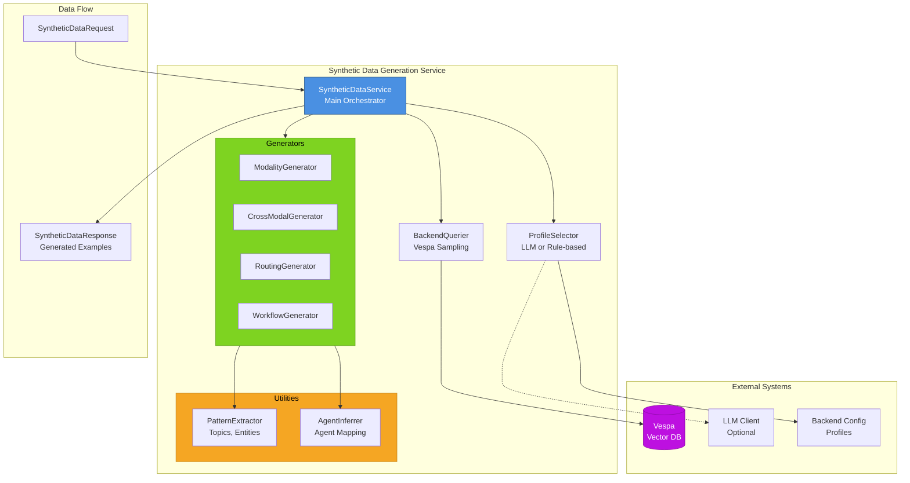
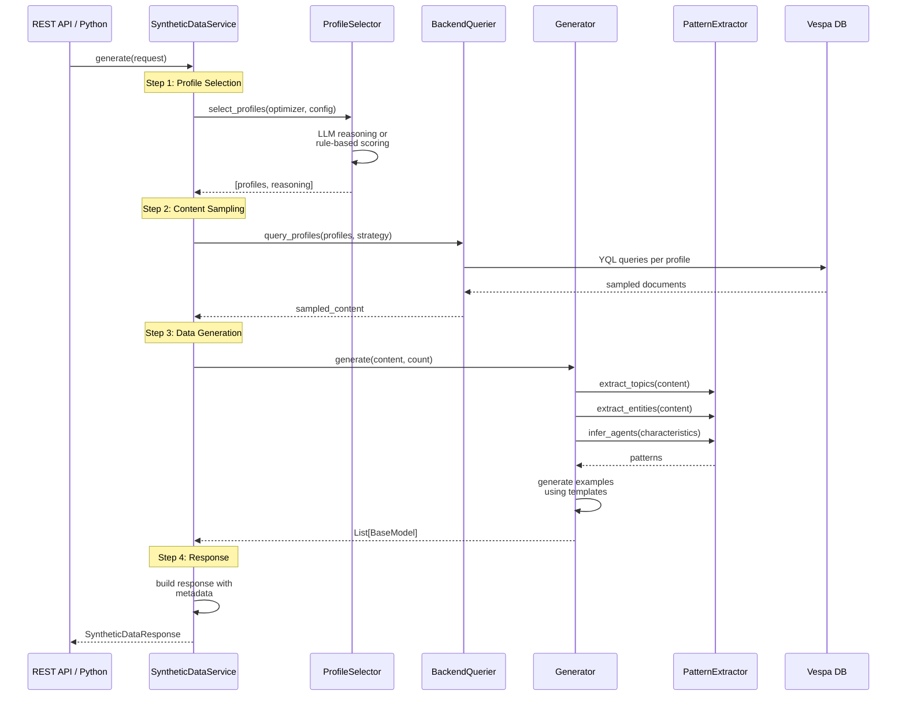

# Synthetic Data Generation System

**Package**: `libs/synthetic` (cogniverse-synthetic)

The synthetic data generation system creates high-quality training examples for all Cogniverse optimizers by sampling real content from Vespa and generating realistic queries and metadata.

## Overview

The system extends DSPy optimization to all routing and orchestration components by automatically generating diverse, realistic training datasets. It uses agent-based profile selection and backend schema introspection to create synthetic examples that match production patterns.

### Supported Optimizers

1. **ModalityOptimizer** - Per-modality routing (VIDEO, DOCUMENT, IMAGE, AUDIO)
2. **CrossModalOptimizer** - Multi-modal fusion decisions
3. **RoutingOptimizer** - Entity-based advanced routing
4. **WorkflowOptimizer** - Multi-agent workflow orchestration
5. **UnifiedOptimizer** - Combined routing and workflow planning

## Architecture

### System Overview



### Generation Pipeline



### Core Components

#### 1. Registry (`registry.py`)
Central configuration mapping optimizers to generators and schemas:

```python
from cogniverse_synthetic import OPTIMIZER_REGISTRY, get_optimizer_config

# Get optimizer configuration
config = get_optimizer_config("cross_modal")
print(config.schema_class)  # FusionHistorySchema
print(config.backend_query_strategy)  # "cross_modal_pairs"
```

#### 2. Schemas (`schemas.py`)
Pydantic models for all optimizer training data:

- `ModalityExampleSchema` - Modality routing examples
- `FusionHistorySchema` - Cross-modal fusion results
- `RoutingExperienceSchema` - Entity-based routing
- `WorkflowExecutionSchema` - Workflow execution patterns
- `SyntheticDataRequest` / `SyntheticDataResponse` - API contracts

#### 3. ProfileSelector (`profile_selector.py`)
Selects optimal backend profiles for data generation:

```python
from cogniverse_synthetic.profile_selector import ProfileSelector

selector = ProfileSelector(llm_client=llm)  # or None for rule-based
profiles, reasoning = await selector.select_profiles(
    optimizer_name="modality",
    optimizer_task="Per-modality routing optimization",
    available_profiles=backend_config["video_processing_profiles"],
    max_profiles=3
)
# Returns: (["video_colpali_smol500_mv_frame", ...], "reasoning...")
```

**Selection Strategies**:
- **LLM-based**: Uses reasoning to match profile characteristics to optimizer needs
- **Rule-based**: Heuristic scoring with diversity selection (fallback)

#### 4. BackendQuerier (`backend_querier.py`)
Samples content from Vespa with multiple strategies:

```python
from cogniverse_synthetic.backend_querier import BackendQuerier

querier = BackendQuerier(vespa_url="http://localhost", vespa_port=8080)
querier.set_vespa_client(vespa_client)

samples = await querier.query_profiles(
    profile_configs=[{"profile_name": "video_colpali_smol500_mv_frame"}],
    sample_size=200,
    strategy="diverse"  # or "entity_rich", "temporal_recent", etc.
)
```

**Sampling Strategies**:
- `diverse` - Random sampling across all content
- `temporal_recent` - Recent content (time-based)
- `entity_rich` - Content with many named entities
- `multi_modal_sequences` - Content from different modalities
- `by_modality` - Specific modality filtering
- `cross_modal_pairs` - Paired content from different modalities

#### 5. Generators (`generators/`)
Four concrete generators implementing the `BaseGenerator` interface:

**ModalityGenerator** (`generators/modality.py`):
```python
# Generates queries like:
# "show me TensorFlow videos"
# "find machine learning documents"

examples = await modality_gen.generate(
    sampled_content=vespa_samples,
    target_count=100,
    modality="VIDEO"
)
# Returns: List[ModalityExampleSchema]
```

**CrossModalGenerator** (`generators/cross_modal.py`):
```python
# Generates fusion scenarios:
# Primary: VIDEO results, Secondary: DOCUMENT results
# fusion_context: {"agreement": 0.8, "ambiguity": 0.2, ...}

examples = await cross_modal_gen.generate(
    sampled_content=vespa_samples,
    target_count=100
)
# Returns: List[FusionHistorySchema]
```

**RoutingGenerator** (`generators/routing.py`):
```python
# Generates entity-annotated queries:
# "TensorFlow(TECHNOLOGY) object detection(TECHNIQUE)"
# entities: [{"text": "TensorFlow", "type": "TECHNOLOGY"}]

examples = await routing_gen.generate(
    sampled_content=vespa_samples,
    target_count=100
)
# Returns: List[RoutingExperienceSchema]
```

**WorkflowGenerator** (`generators/workflow.py`):
```python
# Generates workflow patterns:
# Simple: ["video_search_agent"]
# Complex: ["video_search_agent", "summarizer", "detailed_report"]

examples = await workflow_gen.generate(
    sampled_content=vespa_samples,
    target_count=100
)
# Returns: List[WorkflowExecutionSchema]
```

#### 6. Utilities (`utils/`)

**PatternExtractor** (`utils/pattern_extraction.py`):
- Extract topics (bigrams, trigrams)
- Extract entities (capitalized terms)
- Extract temporal patterns (years, dates)
- Extract content types (tutorial, guide, overview)
- Extract relationships (co-occurrence)

**AgentInferrer** (`utils/agent_inference.py`):
- Map modality → agent
- Infer agents from content characteristics
- Generate workflow sequences
- Validate agent sequences

## Usage

### Python API

```python
from cogniverse_synthetic import SyntheticDataService
from cogniverse_synthetic.schemas import SyntheticDataRequest

# Initialize service
service = SyntheticDataService(
    vespa_client=vespa_client,  # Optional
    backend_config=config,       # Optional
    llm_client=llm_client,       # Optional for profile selection
    vespa_url="http://localhost",
    vespa_port=8080
)

# Generate training data
request = SyntheticDataRequest(
    optimizer="cross_modal",
    count=100,
    vespa_sample_size=200,
    strategies=["diverse"],
    max_profiles=3,
    tenant_id="default"
)

response = await service.generate(request)

print(f"Generated {response.count} examples")
print(f"Used profiles: {response.selected_profiles}")
print(f"Reasoning: {response.profile_selection_reasoning}")

# Access generated data
for example in response.data:
    print(example["query"])
```

### REST API

```python
from fastapi import FastAPI
from cogniverse_synthetic import router, configure_service

app = FastAPI()

# Configure service (optional)
configure_service(
    vespa_client=vespa_client,
    backend_config=config
)

# Mount router
app.include_router(router)
```

**Endpoints**:

**POST /synthetic/generate**
```bash
curl -X POST http://localhost:8000/synthetic/generate \
  -H "Content-Type: application/json" \
  -d '{
    "optimizer": "modality",
    "count": 50,
    "vespa_sample_size": 100,
    "max_profiles": 2
  }'
```

**GET /synthetic/optimizers**
```bash
curl http://localhost:8000/synthetic/optimizers
# Returns: {"modality": "Per-modality routing...", ...}
```

**GET /synthetic/optimizers/{name}**
```bash
curl http://localhost:8000/synthetic/optimizers/cross_modal
# Returns: Detailed optimizer info with schema, generator, etc.
```

**GET /synthetic/health**
```bash
curl http://localhost:8000/synthetic/health
# Returns: {"status": "healthy", "generators": 4, ...}
```

**POST /synthetic/batch/generate**
```bash
curl -X POST "http://localhost:8000/synthetic/batch/generate?optimizer=routing&count_per_batch=100&num_batches=5"
# Generates 500 examples across 5 batches
```

## Integration with Optimizers

### ModalityOptimizer

```python
from src.app.routing.modality_optimizer import ModalityOptimizer
from cogniverse_synthetic import SyntheticDataService
from cogniverse_synthetic.schemas import SyntheticDataRequest

# Generate training data
service = SyntheticDataService()
request = SyntheticDataRequest(optimizer="modality", count=200)
response = await service.generate(request)

# Convert to ModalityExample objects
from src.app.routing.modality_optimizer import ModalityExample
examples = [ModalityExample(**ex) for ex in response.data]

# Train optimizer
optimizer = ModalityOptimizer()
optimizer.compile(trainset=examples)
```

### CrossModalOptimizer

```python
from src.app.routing.cross_modal_optimizer import CrossModalOptimizer
from cogniverse_synthetic import SyntheticDataService
from cogniverse_synthetic.schemas import SyntheticDataRequest

# Generate fusion training data
service = SyntheticDataService()
request = SyntheticDataRequest(optimizer="cross_modal", count=200)
response = await service.generate(request)

# Convert to FusionHistory objects
from src.app.routing.cross_modal_optimizer import FusionHistory
fusion_histories = [FusionHistory(**ex) for ex in response.data]

# Train optimizer
optimizer = CrossModalOptimizer()
optimizer.compile(trainset=fusion_histories)
```

### Advanced Routing

```python
from src.app.routing.advanced_optimizer import AdvancedOptimizer
from cogniverse_synthetic import SyntheticDataService
from cogniverse_synthetic.schemas import SyntheticDataRequest

# Generate entity-based routing data
service = SyntheticDataService()
request = SyntheticDataRequest(optimizer="routing", count=200)
response = await service.generate(request)

# Convert to RoutingExperience
from src.app.routing.advanced_optimizer import RoutingExperience
experiences = [RoutingExperience(**ex) for ex in response.data]

# Train optimizer
optimizer = AdvancedOptimizer()
optimizer.compile(trainset=experiences)
```

### Workflow Intelligence

```python
from src.app.agents.workflow_intelligence import WorkflowIntelligence
from cogniverse_synthetic import SyntheticDataService
from cogniverse_synthetic.schemas import SyntheticDataRequest

# Generate workflow execution patterns
service = SyntheticDataService()
request = SyntheticDataRequest(optimizer="workflow", count=200)
response = await service.generate(request)

# Convert to WorkflowExecution
from src.app.agents.workflow_intelligence import WorkflowExecution
executions = [WorkflowExecution(**ex) for ex in response.data]

# Train workflow optimizer
workflow_intel = WorkflowIntelligence()
workflow_intel.compile(trainset=executions)
```

## Configuration

### Backend Configuration

The service accepts a backend configuration dictionary with video processing profiles:

```python
backend_config = {
    "video_processing_profiles": {
        "video_colpali_smol500_mv_frame": {
            "model": "vidore/colpali-v1.2",
            "embedding_dimension": 128,
            "chunk_strategy": "frame",
            # ... other config
        },
        "video_videoprism_base_mv_chunk_30s": {
            "model": "google/videoprism-base",
            "embedding_dimension": 768,
            "chunk_strategy": "temporal",
            # ... other config
        }
    }
}

service = SyntheticDataService(backend_config=backend_config)
```

### Profile Selection

**With LLM** (better quality, slower):
```python
from openai import AsyncOpenAI

llm_client = AsyncOpenAI(api_key="...")
service = SyntheticDataService(llm_client=llm_client)
```

**Rule-based** (faster, good quality):
```python
service = SyntheticDataService()  # No llm_client = rule-based
```

## Testing

```bash
# Run all synthetic data tests
uv run pytest tests/routing/unit/synthetic/ -v

# Run specific test file
uv run pytest tests/routing/unit/synthetic/test_service.py -v

# Test generator
uv run pytest tests/routing/unit/synthetic/test_generators_integration.py -v
```

**Test Coverage**:
- 11 base generator tests
- 7 generator integration tests
- 23 registry tests
- 22 schema tests
- 19 service tests
- **Total: 82 tests**

## Development

### Adding a New Optimizer

1. **Define Schema** in `schemas.py`:
```python
class NewOptimizerSchema(BaseModel):
    query: str
    # ... optimizer-specific fields
```

2. **Register in** `registry.py`:
```python
OPTIMIZER_REGISTRY["new_optimizer"] = OptimizerConfig(
    name="new_optimizer",
    description="What it does",
    schema_class=NewOptimizerSchema,
    generator_class_name="NewOptimizerGenerator",
    backend_query_strategy="diverse",
    agent_mapping_required=True,
)
```

3. **Create Generator** in `generators/new_optimizer.py`:
```python
from cogniverse_synthetic.generators.base import BaseGenerator

class NewOptimizerGenerator(BaseGenerator):
    async def generate(
        self, sampled_content, target_count, **kwargs
    ) -> List[BaseModel]:
        # Implementation
        return examples
```

4. **Add to Service** in `service.py`:
```python
self.generators = {
    # ... existing
    "NewOptimizerGenerator": NewOptimizerGenerator(),
}
```

5. **Write Tests**:
```python
@pytest.mark.asyncio
async def test_new_optimizer_generator():
    gen = NewOptimizerGenerator()
    examples = await gen.generate(mock_data, 10)
    assert len(examples) == 10
```

## Performance Considerations

- **Batch Size**: Use `batch/generate` endpoint for large datasets
- **Profile Selection**: Rule-based is faster; LLM-based is higher quality
- **Vespa Sampling**: Larger `vespa_sample_size` = more diverse patterns
- **Caching**: Profile selection reasoning is not cached (stateless)
- **Concurrency**: All generators are async-ready

## Troubleshooting

**Issue**: `ValueError: Unknown optimizer 'xyz'`
- **Fix**: Check `OPTIMIZER_REGISTRY.keys()` for valid names

**Issue**: Empty `sampled_content` from BackendQuerier
- **Fix**: Ensure Vespa client is configured with `set_vespa_client()`
- **Note**: Falls back to mock data if no client

**Issue**: Profile selection returns unexpected profiles
- **Fix**: Provide `backend_config` with actual profile definitions
- **Note**: System uses defaults if no config provided

**Issue**: Tests fail with import errors
- **Fix**: Reinstall package: `uv pip install -e libs/synthetic`

## Related Documentation

- [DSPy Optimization Plan](plan/SYNTHETIC_DATA_GENERATION.md) - Original implementation plan
- [Architecture](architecture.md) - Overall system architecture
- [Routing](../src/app/routing/README.md) - Query routing module (uses this system)

## API Reference

See `libs/synthetic/cogniverse_synthetic/` for detailed docstrings:
- `service.py` - SyntheticDataService class
- `api.py` - FastAPI router
- `schemas.py` - All Pydantic models
- `registry.py` - Optimizer registry
- `generators/` - All generator implementations
