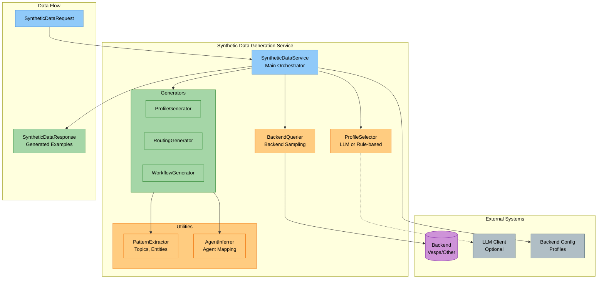
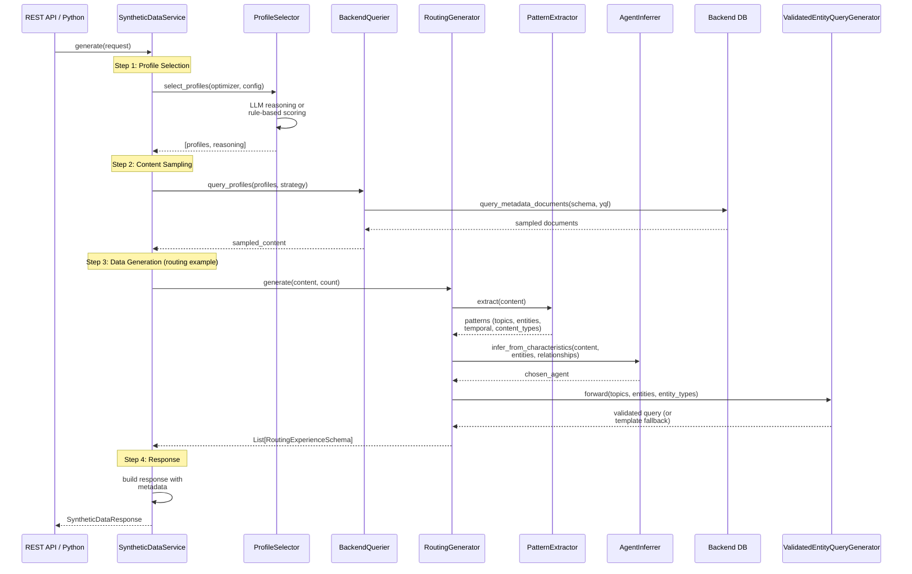

# Synthetic Data Generation System

**Package**: `cogniverse-synthetic` (Core Layer)
**Location**: `libs/synthetic/cogniverse_synthetic`

The synthetic data generation system creates high-quality training examples for all Cogniverse optimizers by sampling real content from backend storage and generating realistic queries using DSPy-driven LLM modules with validation.

## Overview

The system extends DSPy optimization to all routing and orchestration components by automatically generating diverse, realistic training datasets. It uses agent-based profile selection and backend schema introspection to create synthetic examples that match production patterns.

### Supported Optimizers

The `OPTIMIZER_REGISTRY` (`registry.py`) currently registers five optimizer
names. Two of them (`unified`, `cross_modal`) reuse the generator and schema
of another entry rather than shipping a dedicated generator:

1. **profile** (`ProfileGenerator` / `ProfileSelectionExampleSchema`) - Per-query backend profile classification (modality, complexity, intent) for `ProfileSelectionAgent`
2. **routing** (`RoutingGenerator` / `RoutingExperienceSchema`) - Entity-based advanced routing
3. **workflow** (`WorkflowGenerator` / `WorkflowExecutionSchema`) - Multi-agent workflow orchestration
4. **unified** (`WorkflowGenerator` / `WorkflowExecutionSchema`, same as `workflow`) - Combines routing decisions with workflow planning for end-to-end optimization
5. **cross_modal** (`ProfileGenerator` / `ProfileSelectionExampleSchema`, same as `profile`) - Generates queries spanning video + audio + text modalities so multi-vector fusion profiles get exercised together

## Architecture

### System Overview


```mermaid
flowchart TB
    subgraph SyntheticService["<span style='color:#000'>Synthetic Data Generation Service</span>"]
        Service["<span style='color:#000'>SyntheticDataService<br/>Main Orchestrator</span>"]

        Service --> ProfileSelector
        Service --> BackendQuerier
        Service --> Generators

        ProfileSelector["<span style='color:#000'>ProfileSelector<br/>LLM or Rule-based</span>"]
        BackendQuerier["<span style='color:#000'>BackendQuerier<br/>Backend Sampling</span>"]

        subgraph Generators["<span style='color:#000'>Generators</span>"]
            ProfileGen["<span style='color:#000'>ProfileGenerator</span>"]
            RoutingGen["<span style='color:#000'>RoutingGenerator</span>"]
            WorkflowGen["<span style='color:#000'>WorkflowGenerator</span>"]
        end

        subgraph Utilities["<span style='color:#000'>Utilities</span>"]
            PatternExtractor["<span style='color:#000'>PatternExtractor<br/>Topics, Entities</span>"]
            AgentInferrer["<span style='color:#000'>AgentInferrer<br/>Agent Mapping</span>"]
        end

        Generators --> PatternExtractor
        Generators --> AgentInferrer
    end

    subgraph ExternalSystems["<span style='color:#000'>External Systems</span>"]
        Backend[("<span style='color:#000'>Backend<br/>Vespa/Other</span>")]
        LLM["<span style='color:#000'>LLM Client<br/>Optional</span>"]
        BackendConfig["<span style='color:#000'>Backend Config<br/>Profiles</span>"]
    end

    ProfileSelector -.-> LLM
    Service --> BackendConfig
    BackendQuerier --> Backend

    subgraph DataFlow["<span style='color:#000'>Data Flow</span>"]
        Request["<span style='color:#000'>SyntheticDataRequest</span>"] --> Service
        Service --> Response["<span style='color:#000'>SyntheticDataResponse<br/>Generated Examples</span>"]
    end

    style Service fill:#90caf9,stroke:#1565c0,color:#000
    style ProfileSelector fill:#ffcc80,stroke:#ef6c00,color:#000
    style BackendQuerier fill:#ffcc80,stroke:#ef6c00,color:#000
    style Generators fill:#a5d6a7,stroke:#388e3c,color:#000
    style ProfileGen fill:#a5d6a7,stroke:#388e3c,color:#000
    style RoutingGen fill:#a5d6a7,stroke:#388e3c,color:#000
    style WorkflowGen fill:#a5d6a7,stroke:#388e3c,color:#000
    style Utilities fill:#ffcc80,stroke:#ef6c00,color:#000
    style PatternExtractor fill:#ffcc80,stroke:#ef6c00,color:#000
    style AgentInferrer fill:#ffcc80,stroke:#ef6c00,color:#000
    style Backend fill:#ce93d8,stroke:#7b1fa2,color:#000
    style LLM fill:#b0bec5,stroke:#546e7a,color:#000
    style BackendConfig fill:#b0bec5,stroke:#546e7a,color:#000
    style Request fill:#90caf9,stroke:#1565c0,color:#000
    style Response fill:#a5d6a7,stroke:#388e3c,color:#000
```

### Generation Pipeline

Steps 1, 2, and 4 are the same for every optimizer. Step 3 is shown here for
the `routing` optimizer, the only one that exercises `PatternExtractor`,
`AgentInferrer`, and DSPy together — `profile` and `workflow` generate
directly from templates without those collaborators (see "Generators" in
Core Components below).


```mermaid
sequenceDiagram
    participant API as REST API / Python
    participant Service as SyntheticDataService
    participant PS as ProfileSelector
    participant BQ as BackendQuerier
    participant Gen as RoutingGenerator
    participant PE as PatternExtractor
    participant AI as AgentInferrer
    participant Backend as Backend DB
    participant DSPy as ValidatedEntityQueryGenerator

    API->>Service: generate(request)

    Note over Service: Step 1: Profile Selection
    Service->>PS: select_profiles(optimizer, config)
    PS->>PS: LLM reasoning or<br/>rule-based scoring
    PS-->>Service: [profiles, reasoning]

    Note over Service: Step 2: Content Sampling
    Service->>BQ: query_profiles(profiles, strategy)
    BQ->>Backend: query_metadata_documents(schema, yql)
    Backend-->>BQ: sampled documents
    BQ-->>Service: sampled_content

    Note over Service: Step 3: Data Generation (routing example)
    Service->>Gen: generate(content, count)
    Gen->>PE: extract(content)
    PE-->>Gen: patterns (topics, entities,<br/>temporal, content_types)
    Gen->>AI: infer_from_characteristics(content,<br/>entities, relationships)
    AI-->>Gen: chosen_agent
    Gen->>DSPy: forward(topics, entities, entity_types)
    DSPy-->>Gen: validated query (or<br/>template fallback)
    Gen-->>Service: List[RoutingExperienceSchema]

    Note over Service: Step 4: Response
    Service->>Service: build response with<br/>metadata
    Service-->>API: SyntheticDataResponse
```

### Core Components

#### 1. Registry (`registry.py`)
Central configuration mapping optimizers to generators and schemas:

```python
from cogniverse_synthetic.registry import OPTIMIZER_REGISTRY, get_optimizer_config

# Get optimizer configuration
config = get_optimizer_config("profile")
print(config.schema_class)  # ProfileSelectionExampleSchema
print(config.backend_query_strategy)  # "diverse"
```

#### 2. Schemas (`schemas.py`)
Pydantic models for all optimizer training data:

- `ProfileSelectionExampleSchema` - ProfileSelectionAgent training examples
- `RoutingExperienceSchema` - Entity-based routing
- `WorkflowExecutionSchema` - Workflow execution patterns
- `SyntheticDataRequest` / `SyntheticDataResponse` - API contracts

#### 3. ProfileSelector (`profile_selector.py`)
Selects optimal backend profiles for data generation:

```python
from cogniverse_synthetic.profile_selector import ProfileSelector

selector = ProfileSelector(llm_client=llm)  # or None for rule-based
# available_profiles is a Dict[str, Dict] of profile_name -> profile_config;
# BackendConfig.profiles holds BackendProfileConfig objects, so convert first.
profiles, reasoning = await selector.select_profiles(
    optimizer_name="modality",
    optimizer_task="Per-modality routing optimization",
    available_profiles={
        name: p.to_dict() for name, p in backend_config.profiles.items()
    },
    max_profiles=3
)
# Returns: (["video_colpali_smol500_mv_frame", ...], "reasoning...")
```

**Selection Strategies**:

- **LLM-based**: Uses reasoning to match profile characteristics to optimizer needs
- **Rule-based**: Heuristic scoring with diversity selection (fallback)

#### 4. BackendQuerier (`backend_querier.py`)
Samples content from backend storage (Vespa or other) using Backend interface:

```python
from cogniverse_synthetic.backend_querier import BackendQuerier
from cogniverse_core.registries.backend_registry import BackendRegistry
from cogniverse_foundation.config.utils import create_default_config_manager
from cogniverse_core.schemas.filesystem_loader import FilesystemSchemaLoader
from pathlib import Path

# Initialize configuration
config_manager = create_default_config_manager()
schema_loader = FilesystemSchemaLoader(Path("configs/schemas"))

# Get backend from registry (handles instantiation and caching)
backend = BackendRegistry.get_search_backend(
    name="vespa",
    config_manager=config_manager,
    schema_loader=schema_loader
)

# Initialize backend querier with config and field mappings
from cogniverse_foundation.config.unified_config import BackendConfig, FieldMappingConfig

# BackendConfig requires tenant_id
backend_config = BackendConfig(tenant_id="your_org:production")
field_mappings = FieldMappingConfig()  # no required args

querier = BackendQuerier(
    backend=backend,
    backend_config=backend_config,
    field_mappings=field_mappings
)

samples = await querier.query_profiles(
    profile_configs=[{"profile_name": "video_colpali_smol500_mv_frame"}],
    sample_size=200,
    strategy="diverse"  # or "entity_rich", "temporal_recent", etc.
)
```

**Sampling Strategies**:

- `diverse` - Random sampling across all content
- `temporal_recent` - Recent content (time-based)
- `entity_rich` - Content with many named entities
- `multi_modal_sequences` - Content from different modalities

**Backend Abstraction**: Uses `Backend` interface to support any vector database (Vespa, Pinecone, Weaviate, etc.)

#### 5. Generators (`generators/`)
Three concrete generators implementing the `BaseGenerator` interface:

**ProfileGenerator** (`generators/profile.py`):
```python
# Generates ProfileSelectionAgent training examples.
# Each example pairs a query with the best backend profile
# plus modality, complexity, and intent labels.

from cogniverse_synthetic.generators.profile import ProfileGenerator

profile_gen = ProfileGenerator()
examples = await profile_gen.generate(
    sampled_content=backend_samples,
    target_count=100
)
# Returns: List[ProfileSelectionExampleSchema]
```

**RoutingGenerator** (`generators/routing.py`):
```python
# Uses ValidatedEntityQueryGenerator with ChainOfThought and retry logic
# Generates entity-annotated queries guaranteed to contain entities:
# Query: "find TensorFlow object detection tutorial"
# Enhanced: "find TensorFlow(TECHNOLOGY) object detection tutorial"
# entities: [{"text": "TensorFlow", "type": "TECHNOLOGY"}]

# RoutingGenerator requires configuration (created by SyntheticDataService)
# When used directly:
from cogniverse_foundation.config.unified_config import OptimizerGenerationConfig
from cogniverse_synthetic.utils import PatternExtractor, AgentInferrer

optimizer_config = OptimizerGenerationConfig(...)  # With DSPy modules
routing_gen = RoutingGenerator(
    pattern_extractor=PatternExtractor(),
    agent_inferrer=AgentInferrer(),
    optimizer_config=optimizer_config
)
examples = await routing_gen.generate(
    sampled_content=backend_samples,
    target_count=100
)
# Returns: List[RoutingExperienceSchema]
# Each example validated to contain at least one entity (3 retry attempts)
```

**WorkflowGenerator** (`generators/workflow.py`):
```python
# Generates workflow patterns:
# Simple: ["video_search_agent"]
# Complex: ["video_search_agent", "summarizer", "detailed_report"]

examples = await workflow_gen.generate(
    sampled_content=backend_samples,
    target_count=100
)
# Returns: List[WorkflowExecutionSchema]
```

#### 6. Utilities (`utils/`)

**PatternExtractor** (`utils/pattern_extraction.py`):

- Extract topics — bigrams, trigrams (`extract_topics`)

- Extract entities — capitalized terms, CamelCase/technical terms (`extract_entities`)

- Extract temporal patterns — years, recency modifiers (`extract_temporal_patterns`)

- Extract content types — tutorial, guide, overview, etc. (`extract_content_types`)

- Extract relationships — entity co-occurrence (`extract_relationships`)

- `extract(content_samples)` runs all four extractors above and returns the combined `{topics, entities, temporal, content_types}` dict (this is the single call `RoutingGenerator` makes)

**AgentInferrer** (`utils/agent_inference.py`):

Builds its modality→agent and role→agent mappings from the `agents` section
of `config.json` at construction time (no hardcoded agent names).

- Map modality → agent (`infer_from_modality`)

- Infer agent from content characteristics — schema/embedding type, then description keywords (`infer_from_characteristics`)

- Infer agent from a natural-language task description (`get_agent_for_task`)

- Generate a workflow agent sequence for a complexity/modality/task combination (`infer_workflow_sequence`)

- List agents compatible with a modality (`get_compatible_agents`)

- Validate that an agent sequence is well-formed (`validate_agent_sequence`)

#### 7. DSPy Signatures and Modules

**DSPy Signatures** (`dspy_signatures.py`):

Defines the interface between generators and LLMs for query generation. Signatures guide LLM behavior through field descriptions.

```python
class GenerateEntityQuery(dspy.Signature):
    """Generate search query that MUST include at least one of the provided entities"""

    topics: str = dspy.InputField(
        desc="Comma-separated topics from content"
    )
    entities: str = dspy.InputField(
        desc="Comma-separated named entities - YOUR QUERY MUST MENTION AT LEAST ONE OF THESE"
    )
    entity_types: str = dspy.InputField(
        desc="Comma-separated entity types (TECHNOLOGY, ORGANIZATION, CONCEPT)"
    )

    reasoning: str = dspy.OutputField(
        desc="Brief explanation of which entity/entities you're including and why"
    )
    query: str = dspy.OutputField(
        desc="Natural query that explicitly mentions at least one entity"
    )
```

**Available Signatures**:

- `GenerateModalityQuery` - Generate modality-specific queries
- `GenerateEntityQuery` - Generate entity-rich queries with reasoning
- `InferAgentFromModality` - Infer correct agent for modality/query

**DSPy Modules** (`dspy_modules.py`):

Validated query generators with built-in quality checks and retry logic.

```python
class ValidatedEntityQueryGenerator(dspy.Module):
    """
    Entity query generator with validation.
    Uses ChainOfThought for better quality - LLM reasons about which entities to include.
    Validates output and retries if needed (max 3 attempts by default).
    Falls back to a deterministic template query if all retries fail.
    """

    def __init__(self, max_retries: int = 3):
        super().__init__()
        self.max_retries = max_retries
        self.generate = dspy.ChainOfThought(GenerateEntityQuery)

    def forward(self, topics: str, entities: str, entity_types: str) -> dspy.Prediction:
        entity_list = [e.strip() for e in entities.split(",") if e.strip()]
        # Match on individual words (len > 3) so a multi-word entity like
        # "Neural Networks" counts as present if either word appears.
        entity_words = [
            w.lower() for e in entity_list for w in e.split() if len(w) > 3
        ] or [e.lower() for e in entity_list]

        for attempt in range(self.max_retries):
            result = self.generate(topics=topics, entities=entities, entity_types=entity_types)

            if result.query and any(w in result.query.lower() for w in entity_words):
                result._retry_count = attempt
                result._max_retries = self.max_retries
                return result  # Valid query found!

        # Retries exhausted: synthesize a deterministic fallback query so the
        # pipeline still produces output (e.g. an unreliable local LM).
        topic_hint = topics.split(",")[0].strip() if topics else ""
        entity_text = entity_list[0] if entity_list else "content"
        fallback_query = (
            f"find {topic_hint} about {entity_text}" if topic_hint else f"find {entity_text}"
        )
        result = dspy.Prediction(
            query=fallback_query,
            reasoning="Template fallback after validation retries exhausted",
        )
        result._retry_count = self.max_retries
        result._max_retries = self.max_retries
        result._fallback_used = True
        return result
```

**Key Features**:

- **ChainOfThought**: LLM reasons before generating (better quality)
- **Validation**: Ensures output meets requirements (e.g., entity presence)
- **Retry Logic**: Up to `max_retries` attempts (default 3) to generate a query containing at least one entity
- **Template Fallback**: If every retry fails validation (or the LM returns an empty query), synthesizes a deterministic `"find {topic} about {entity}"` query and sets `_fallback_used=True` on the prediction, so `RoutingGenerator` can flag the example's `metadata["_generation_metadata"]["fallback_used"]` for downstream filtering
- **Optimization Ready**: Can be compiled with DSPy optimizers (BootstrapFewShot, MIPRO, etc.)

#### 8. Approval System (`approval/`)

Human-in-the-loop review and feedback loop for low-confidence synthetic
examples. Implements the domain-agnostic `ConfidenceExtractor` and
`FeedbackHandler` interfaces from `cogniverse_core.approval.interfaces`.

**SyntheticDataConfidenceExtractor** (`approval/confidence_extractor.py`):
Scores a generated example 0-1 from DSPy generation signals — DSPy retry
count, entity presence in the query, query length, and reasoning presence —
so low-confidence examples can be routed to human review instead of used
directly for training.

```python
from cogniverse_synthetic.approval.confidence_extractor import (
    SyntheticDataConfidenceExtractor,
)

extractor = SyntheticDataConfidenceExtractor(
    min_query_length=10, max_query_length=200, retry_penalty=0.15
)
confidence = extractor.extract({
    "query": "find TensorFlow tutorial",
    "entities": ["TensorFlow"],
    "reasoning": "Including TensorFlow as the primary entity",
    "_generation_metadata": {"retry_count": 0},
})
# confidence: float in [0, 1]; extractor.get_confidence_breakdown(...) explains the factors
```

**SyntheticDataFeedbackHandler** (`approval/feedback_handler.py`):
Regenerates a rejected example by calling `ValidatedEntityQueryGenerator.forward`
directly, applying any human-supplied `entities`/`topics` corrections from the
`ReviewDecision`. Returns a new `ReviewItem` with
`status=ApprovalStatus.REGENERATED`, or `None` after
`max_regeneration_attempts` failed attempts.

```python
from cogniverse_synthetic.approval.feedback_handler import SyntheticDataFeedbackHandler
from cogniverse_core.approval.interfaces import ReviewDecision

handler = SyntheticDataFeedbackHandler(max_regeneration_attempts=2)
new_item = await handler.process_rejection(
    item,
    ReviewDecision(
        item_id=item.item_id,
        approved=False,
        feedback="entity should be PyTorch, not TensorFlow",
        corrections={"entities": ["PyTorch"]},
    ),
)
```

## Usage

### Python API

```python
from cogniverse_synthetic import SyntheticDataService
from cogniverse_synthetic.schemas import SyntheticDataRequest
from cogniverse_core.registries.backend_registry import BackendRegistry
from cogniverse_foundation.config.utils import create_default_config_manager
from cogniverse_core.schemas.filesystem_loader import FilesystemSchemaLoader
from pathlib import Path

# Initialize configuration
config_manager = create_default_config_manager()
schema_loader = FilesystemSchemaLoader(Path("configs/schemas"))

# Get backend from registry (handles instantiation and caching)
backend = BackendRegistry.get_search_backend(
    name="vespa",
    config_manager=config_manager,
    schema_loader=schema_loader
)

# Initialize service
from cogniverse_foundation.config.unified_config import BackendConfig, SyntheticGeneratorConfig

# Both BackendConfig and SyntheticGeneratorConfig require tenant_id
backend_config = BackendConfig(tenant_id="your_org:production")
generator_config = SyntheticGeneratorConfig(tenant_id="your_org:production")

service = SyntheticDataService(
    backend=backend,                # Backend interface (Vespa, Pinecone, etc.)
    backend_config=backend_config,  # Backend configuration with profiles
    generator_config=generator_config,  # Generator configuration
    llm_client=None,                # Optional LLM client for profile selection (None = rule-based)
)

# Generate training data
request = SyntheticDataRequest(
    optimizer="profile",
    count=100,
    vespa_sample_size=200,      # Number of documents to sample from backend
    strategies=["diverse"],
    max_profiles=3,
    tenant_id="your_org:production"
)

response = await service.generate(request)

print(f"Generated {response.count} examples")
print(f"Used profiles: {response.selected_profiles}")
print(f"Reasoning: {response.profile_selection_reasoning}")

# Access generated data
for example in response.data:
    print(example["query"])
```

### REST API

```python
from fastapi import FastAPI
from cogniverse_synthetic import router, configure_service
from cogniverse_core.registries.backend_registry import BackendRegistry
from cogniverse_foundation.config.utils import create_default_config_manager
from cogniverse_core.schemas.filesystem_loader import FilesystemSchemaLoader
from pathlib import Path

app = FastAPI()

# Initialize configuration
config_manager = create_default_config_manager()
schema_loader = FilesystemSchemaLoader(Path("configs/schemas"))

# Get backend from registry
backend = BackendRegistry.get_search_backend(
    name="vespa",
    config_manager=config_manager,
    schema_loader=schema_loader
)

# Configure service with backend and configuration
from cogniverse_foundation.config.unified_config import BackendConfig, SyntheticGeneratorConfig

# Both BackendConfig and SyntheticGeneratorConfig require tenant_id
backend_config_obj = BackendConfig(tenant_id="your_org:production")
generator_config_obj = SyntheticGeneratorConfig(tenant_id="your_org:production")

# Option 1: Use configure_service to set global instance
configure_service(
    backend=backend,
    backend_config=backend_config_obj,
    generator_config=generator_config_obj,
    llm_client=None
)

# Option 2: Or instantiate directly if you need more control
service = SyntheticDataService(
    backend=backend,
    backend_config=backend_config_obj,
    generator_config=generator_config_obj,
    llm_client=None
)

# Mount router
app.include_router(router)
```

**Endpoints**:

**POST /synthetic/generate**
```bash
curl -X POST http://localhost:8000/synthetic/generate \
  -H "Content-Type: application/json" \
  -d '{
    "optimizer": "profile",
    "count": 50,
    "vespa_sample_size": 100,
    "max_profiles": 2,
    "tenant_id": "your_org:production"
  }'
```

**GET /synthetic/optimizers**
```bash
curl http://localhost:8000/synthetic/optimizers
# Returns: {"profile": "ProfileSelectionAgent optimization...", ...}
```

**GET /synthetic/optimizers/{name}**
```bash
curl http://localhost:8000/synthetic/optimizers/profile
# Returns: Detailed optimizer info with schema, generator, etc.
```

**GET /synthetic/health**
```bash
curl http://localhost:8000/synthetic/health
# Returns: {"status": "healthy", "generators": 3, ...}
```

**POST /synthetic/batch/generate**
```bash
curl -X POST "http://localhost:8000/synthetic/batch/generate?optimizer=routing&count_per_batch=100&num_batches=5&tenant_id=your_org:production"
# Generates 500 examples across 5 batches
```

### CLI

`cogniverse_runtime.optimization_cli` exposes a `synthetic` mode that wraps
`SyntheticDataService` directly (`run_synthetic_generation` in
`optimization_cli.py`), then saves the generated examples as demonstrations
via `ArtifactManager` for later merge into batch optimization jobs:

```bash
uv run python -m cogniverse_runtime.optimization_cli \
  --mode synthetic --tenant-id your_org:production --agents profile,workflow
```

`--agents` is a comma-separated list of optimizer types (defaults to
`simba,profile,workflow` if omitted). `RoutingGenerator`'s DSPy module is
configured from the tenant's LM settings before generation runs, since the
mode executes inside an asyncio task where `dspy.configure` cannot be called.

## Integration with Optimizers

### ProfileSelectionAgent

```python
from cogniverse_synthetic import SyntheticDataService
from cogniverse_synthetic.schemas import SyntheticDataRequest

# Generate training data for ProfileSelectionAgent
service = SyntheticDataService()
request = SyntheticDataRequest(
    optimizer="profile", count=200, tenant_id="your_org:production"
)
response = await service.generate(request)

# Pass examples to run_profile_optimization (cogniverse_runtime.optimization_cli)
# which compiles the ProfileSelectionAgent DSPy module and saves the artifact.
print(f"Generated {response.count} ProfileSelectionExampleSchema examples")
```

### Workflow Intelligence

```python
from cogniverse_agents.workflow.intelligence import WorkflowIntelligence
from cogniverse_synthetic import SyntheticDataService
from cogniverse_synthetic.schemas import SyntheticDataRequest

# Generate workflow execution patterns
service = SyntheticDataService()
request = SyntheticDataRequest(
    optimizer="workflow", count=200, tenant_id="your_org:production"
)
response = await service.generate(request)

# Convert to WorkflowExecution
from cogniverse_sdk.interfaces.workflow_store import WorkflowExecution
executions = [WorkflowExecution(**ex) for ex in response.data]

# WorkflowIntelligence requires a TelemetryProvider — obtain it via TelemetryManager
# (the runtime wires this automatically; call via cogniverse_runtime.optimization_cli
# --mode workflow rather than constructing WorkflowIntelligence directly)
# Example using the optimization CLI:
#   python -m cogniverse_runtime.optimization_cli --mode workflow --tenant-id your_org:production
```

## Configuration

### Backend Configuration

The service accepts a BackendConfig instance with backend profiles:

```python
from cogniverse_foundation.config.unified_config import BackendConfig, BackendProfileConfig

# Create backend config with profiles
backend_config = BackendConfig(
    tenant_id="acme",
    backend_type="vespa",
    url="http://localhost",
    port=8080,
    profiles={
        "video_colpali_smol500_mv_frame": BackendProfileConfig(
            profile_name="video_colpali_smol500_mv_frame",
            type="video",
            schema_name="video_colpali_smol500_mv",
            embedding_model="vidore/colpali-v1.2",
            pipeline_config={"chunk_strategy": "frame"}
        ),
        "video_videoprism_base_mv_chunk_30s": BackendProfileConfig(
            profile_name="video_videoprism_base_mv_chunk_30s",
            type="video",
            schema_name="video_videoprism_base_mv",
            embedding_model="google/videoprism-base",
            pipeline_config={"chunk_strategy": "temporal"}
        )
    }
)

service = SyntheticDataService(backend=backend, backend_config=backend_config)
```

### Profile Selection

**With LLM** (better quality, slower):
```python
from openai import AsyncOpenAI

llm_client = AsyncOpenAI(api_key="...")
service = SyntheticDataService(llm_client=llm_client)
```

**Rule-based** (faster, good quality):
```python
service = SyntheticDataService()  # No llm_client = rule-based
```

## Testing

```bash
# Run all synthetic data tests
uv run pytest tests/routing/unit/synthetic/ -v

# Run specific test file
uv run pytest tests/routing/unit/synthetic/test_service.py -v

# Test generator
uv run pytest tests/routing/unit/synthetic/test_generators_integration.py -v
```

**Test Coverage**:

- Base generator tests (`test_base_generator.py`)
- Generator integration tests (`test_generators_integration.py`)
- Registry tests (`test_registry.py`)
- Schema tests (`test_schemas.py`)
- Service tests (`test_service.py`)
- Approval system tests (`test_approval_system.py`)
- Backend querier tests (`test_backend_querier.py`)

## Development

### Adding a New Optimizer

1. **Define Schema** in `schemas.py`:
```python
class NewOptimizerSchema(BaseModel):
    query: str
    # ... optimizer-specific fields
```

2. **Register in** `registry.py`:
```python
OPTIMIZER_REGISTRY["new_optimizer"] = OptimizerConfig(
    name="new_optimizer",
    description="What it does",
    schema_class=NewOptimizerSchema,
    generator_class_name="NewOptimizerGenerator",
    backend_query_strategy="diverse",
    agent_mapping_required=True,
)
```

3. **Create Generator** in `generators/new_optimizer.py`:
```python
from cogniverse_synthetic.generators.base import BaseGenerator

class NewOptimizerGenerator(BaseGenerator):
    async def generate(
        self, sampled_content, target_count, **kwargs
    ) -> List[BaseModel]:
        # Implementation
        return examples
```

4. **Wire into `_get_generator`** in `service.py` (generators are created lazily,
   dispatched on `optimizer_name`):
```python
elif optimizer_name == "new_optimizer":
    generator = NewOptimizerGenerator()
```

5. **Write Tests**:
```python
@pytest.mark.asyncio
async def test_new_optimizer_generator():
    gen = NewOptimizerGenerator()
    examples = await gen.generate(mock_data, 10)
    assert len(examples) == 10
```

## Performance Considerations

- **Batch Size**: Use `batch/generate` endpoint for large datasets
- **Profile Selection**: Rule-based is faster; LLM-based is higher quality
- **Backend Sampling**: Larger `sample_size` = more diverse patterns
- **Caching**: Profile selection reasoning is not cached (stateless)
- **Concurrency**: All generators are async-ready
- **DSPy Optimization**: Compiled modules faster than uncompiled (use `compiled_path` in config)

## Troubleshooting

**Issue**: `ValueError: Unknown optimizer 'xyz'`
- **Fix**: Check `OPTIMIZER_REGISTRY.keys()` for valid names

**Issue**: Empty `sampled_content` from BackendQuerier
- **Fix**: Ensure `Backend` instance is configured and passed to service
- **Note**: Falls back to mock data if no backend provided

**Issue**: Profile selection returns unexpected profiles
- **Fix**: Provide `backend_config` with actual profile definitions
- **Note**: System uses defaults if no config provided

**Issue**: `ValueError: RoutingGenerator requires optimizer configuration`
- **Fix**: Provide `OptimizerGenerationConfig` with DSPy modules configuration
- **Note**: Configuration is required - no defaults or fallbacks

**Issue**: Generated routing queries don't mention any of the requested entities
- **Fix**: Check DSPy LM is configured correctly (use `create_dspy_lm()` and `dspy.context(lm=...)`); a misconfigured or unreliable LM causes every retry to fail validation
- **Note**: `ValidatedEntityQueryGenerator` does not raise after exhausting `max_retries` — it emits a deterministic `"find {topic} about {entity}"` template query and sets `_fallback_used=True` / `metadata["_generation_metadata"]["fallback_used"]` on the example, so these lower-quality examples can be filtered out downstream instead of crashing generation

**Issue**: Tests fail with import errors
- **Fix**: Reinstall package: `uv pip install -e libs/synthetic`

## Package Location

The synthetic data generation package is part of the Core Layer:

```text
libs/
└── synthetic/                      # cogniverse-synthetic package
    ├── cogniverse_synthetic/
    │   ├── service.py              # Main service orchestrator
    │   ├── api.py                  # FastAPI router
    │   ├── schemas.py              # Pydantic models
    │   ├── registry.py             # Optimizer registry
    │   ├── profile_selector.py     # Profile selection logic
    │   ├── backend_querier.py      # Backend content sampling
    │   ├── dspy_signatures.py      # DSPy signature definitions
    │   ├── dspy_modules.py         # Validated query generators
    │   ├── generators/             # Concrete generators
    │   │   ├── base.py
    │   │   ├── profile.py
    │   │   ├── routing.py
    │   │   └── workflow.py
    │   ├── utils/                  # Pattern extraction utilities
    │   │   ├── pattern_extraction.py
    │   │   └── agent_inference.py
    │   └── approval/               # Human-in-loop approval system
    │       ├── confidence_extractor.py
    │       └── feedback_handler.py
    └── pyproject.toml

# Tests are located at project root:
tests/
├── synthetic/
│   ├── integration/                # Integration tests (test_profile_synthetic_service.py, etc.)
│   └── unit/                       # Unit tests (test_profile_generator.py, etc.)
└── routing/unit/synthetic/         # Routing-focused synthetic unit tests (7 test files + conftest.py)
```

## Related Documentation

- [11-Package Architecture](./architecture/overview.md) - Overall system architecture
- [Routing Module](./modules/routing.md) - Query routing module (uses this system)
- [Optimization Module](./modules/optimization.md) - DSPy optimization integration

## API Reference

See `libs/synthetic/cogniverse_synthetic/` for detailed docstrings:

- `service.py` - SyntheticDataService class

- `api.py` - FastAPI router

- `schemas.py` - All Pydantic models

- `registry.py` - Optimizer registry

- `generators/` - All generator implementations
