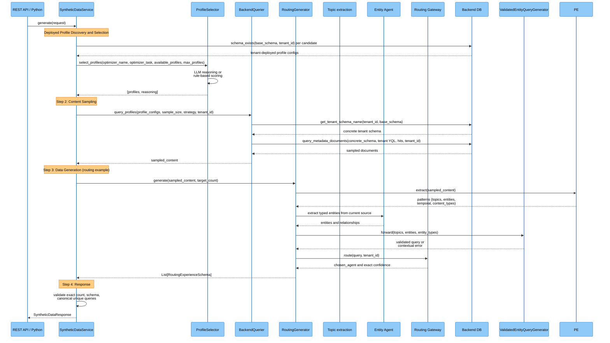

# Synthetic Data Generation System

**Package**: `cogniverse-synthetic` (Implementation Layer)
**Location**: `libs/synthetic/cogniverse_synthetic`

The synthetic data generation system creates training examples for Cogniverse
optimizers by sampling tenant-scoped backend content. Production agent callbacks
supervise entity extraction, query enhancement, profile selection, and routing;
routing query generation also uses a validated DSPy module. Workflow plans are
source-grounded local generation.

## Overview

The service selects from configured backend profiles, samples content through
the backend interface, and emits schema-validated examples for training.

### Supported Optimizers

The `OPTIMIZER_REGISTRY` (`registry.py`) currently registers seven optimizer
names. Two of them (`unified`, `cross_modal`) reuse the generator and schema
of another entry rather than shipping a dedicated generator:

1. **query_enhancement** (`QueryEnhancementGenerator` / `QueryEnhancementExampleSchema`) - Query expansions, synonyms, and reasoning
2. **entity_extraction** (`EntityExtractionGenerator` / `EntityExtractionExampleSchema`) - Typed entities and relationships
3. **profile** (`ProfileGenerator` / `ProfileSelectionExampleSchema`) - Per-query backend profile classification (modality, complexity, canonical intent) for `ProfileSelectionAgent`
4. **routing** (`RoutingGenerator` / `RoutingExperienceSchema`) - Entity-based advanced routing
5. **workflow** (`WorkflowGenerator` / `WorkflowExecutionSchema`) - Multi-agent workflow orchestration
6. **unified** (`WorkflowGenerator` / `WorkflowExecutionSchema`, same as `workflow`) - Combines routing decisions with workflow planning for end-to-end optimization
7. **cross_modal** (`ProfileGenerator` / `ProfileSelectionExampleSchema`, same as `profile`) - Generates profile-selection examples from multi-modal samples

## Architecture

### System Overview


```mermaid
flowchart TB
    subgraph SyntheticService["<span style='color:#000'>Synthetic Data Generation Service</span>"]
        Service["<span style='color:#000'>SyntheticDataService<br/>Main Orchestrator</span>"]

        Service --> ProfileSelector
        Service --> BackendQuerier
        Service --> Generators

        ProfileSelector["<span style='color:#000'>ProfileSelector<br/>LLM or Rule-based</span>"]
        BackendQuerier["<span style='color:#000'>BackendQuerier<br/>Backend Sampling</span>"]

        subgraph Generators["<span style='color:#000'>Generators</span>"]
            QueryEnhancementGen["<span style='color:#000'>QueryEnhancementGenerator</span>"]
            EntityExtractionGen["<span style='color:#000'>EntityExtractionGenerator</span>"]
            ProfileGen["<span style='color:#000'>ProfileGenerator</span>"]
            RoutingGen["<span style='color:#000'>RoutingGenerator</span>"]
            WorkflowGen["<span style='color:#000'>WorkflowGenerator</span>"]
        end

        subgraph Utilities["<span style='color:#000'>Utilities</span>"]
            TopicExtraction["<span style='color:#000'>Topic extraction<br/>Topics, entities</span>"]
            AgentInferrer["<span style='color:#000'>AgentInferrer<br/>Agent Mapping</span>"]
        end

        RoutingGen --> TopicExtraction
        RoutingGen --> AgentInferrer
    end

    subgraph ExternalSystems["<span style='color:#000'>External Systems</span>"]
        Backend[("<span style='color:#000'>Backend<br/>Vespa/Other</span>")]
        LLM["<span style='color:#000'>LLM Client<br/>Optional</span>"]
        BackendConfig["<span style='color:#000'>Backend Config<br/>Profiles</span>"]
    end

    ProfileSelector -.-> LLM
    Service --> BackendConfig
    BackendQuerier --> Backend

    subgraph DataFlow["<span style='color:#000'>Data Flow</span>"]
        Request["<span style='color:#000'>SyntheticDataRequest</span>"] --> Service
        Service --> Response["<span style='color:#000'>SyntheticDataResponse<br/>Generated Examples</span>"]
    end

    style SyntheticService fill:#ce93d8,stroke:#7b1fa2,color:#000
    style Service fill:#ba68c8,stroke:#7b1fa2,color:#000
    style ProfileSelector fill:#ffb74d,stroke:#ef6c00,color:#000
    style BackendQuerier fill:#ffb74d,stroke:#ef6c00,color:#000
    style Generators fill:#a5d6a7,stroke:#388e3c,color:#000
    style QueryEnhancementGen fill:#81c784,stroke:#388e3c,color:#000
    style EntityExtractionGen fill:#81c784,stroke:#388e3c,color:#000
    style ProfileGen fill:#81c784,stroke:#388e3c,color:#000
    style RoutingGen fill:#81c784,stroke:#388e3c,color:#000
    style WorkflowGen fill:#81c784,stroke:#388e3c,color:#000
    style Utilities fill:#ffcc80,stroke:#ef6c00,color:#000
    style TopicExtraction fill:#ffb74d,stroke:#ef6c00,color:#000
    style AgentInferrer fill:#ffb74d,stroke:#ef6c00,color:#000
    style ExternalSystems fill:#90caf9,stroke:#1565c0,color:#000
    style Backend fill:#64b5f6,stroke:#1565c0,color:#000
    style LLM fill:#b0bec5,stroke:#546e7a,color:#000
    style BackendConfig fill:#b0bec5,stroke:#546e7a,color:#000
    style DataFlow fill:#a5d6a7,stroke:#388e3c,color:#000
    style Request fill:#81c784,stroke:#388e3c,color:#000
    style Response fill:#81c784,stroke:#388e3c,color:#000
```

### Generation Pipeline

Steps 1, 2, and 4 are the same for every optimizer. Step 3 is shown here for
the `routing` optimizer, which combines canonical topic extraction, the
production entity extractor, a validated DSPy query module, and the production
routing decision. Workflow generation uses `AgentInferrer`; profile generation
uses its production profile-selection callback (see "Generators" below).


```mermaid
%%{init: {"theme": "base", "themeVariables": {"actorBkg": "#90caf9", "actorBorder": "#1565c0", "actorTextColor": "#000000", "lineColor": "#546e7a", "noteBkgColor": "#ffcc80", "noteBorderColor": "#ef6c00", "noteTextColor": "#000000", "signalTextColor": "#000000"}}}%%
sequenceDiagram
    participant API as REST API / Python
    participant Service as SyntheticDataService
    participant PS as ProfileSelector
    participant BQ as BackendQuerier
    participant Gen as RoutingGenerator
    participant TE as Topic extraction
    participant Entity as Entity Agent
    participant Gateway as Routing Gateway
    participant Backend as Backend DB
    participant DSPy as ValidatedEntityQueryGenerator

    API->>Service: generate(request)

    Note over Service: Deployed Profile Discovery and Selection
    Service->>Backend: schema_exists(base_schema, tenant_id) per candidate
    Backend-->>Service: tenant-deployed profile configs
    Service->>PS: select_profiles(optimizer_name, optimizer_task, available_profiles, max_profiles)
    PS->>PS: LLM reasoning or<br/>rule-based scoring
    PS-->>Service: [profiles, reasoning]

    Note over Service: Step 2: Content Sampling
    Service->>BQ: query_profiles(profile_configs, sample_size, strategy, tenant_id)
    BQ->>Backend: get_tenant_schema_name(tenant_id, base_schema)
    Backend-->>BQ: concrete tenant schema
    BQ->>Backend: query_metadata_documents(concrete_schema, tenant YQL, hits, tenant_id)
    Backend-->>BQ: sampled documents
    BQ-->>Service: sampled_content

    Note over Service: Step 3: Data Generation (routing example)
    Service->>Gen: generate(sampled_content, target_count)
    Gen->>PE: extract(sampled_content)
    PE-->>Gen: patterns (topics, entities,<br/>temporal, content_types)
    Gen->>Entity: extract typed entities from current source
    Entity-->>Gen: entities and relationships
    Gen->>DSPy: forward(topics, entities, entity_types)
    DSPy-->>Gen: validated query or<br/>contextual error
    Gen->>Gateway: route(query, tenant_id)
    Gateway-->>Gen: chosen_agent and exact confidence
    Gen-->>Service: List[RoutingExperienceSchema]

    Note over Service: Step 4: Response
    Service->>Service: validate exact count, schema,<br/>canonical unique queries
    Service-->>API: SyntheticDataResponse
```

### Core Components

#### 1. Registry (`registry.py`)
Central configuration mapping optimizers to generators and schemas:

```python
from cogniverse_synthetic.registry import OPTIMIZER_REGISTRY, get_optimizer_config

# Get optimizer configuration
config = get_optimizer_config("profile")
print(config.schema_class)  # ProfileSelectionExampleSchema
print(config.backend_query_strategy)  # "diverse"
```

#### 2. Schemas (`schemas.py`)
Pydantic models for all optimizer training data:

- `ProfileSelectionExampleSchema` - ProfileSelectionAgent training examples
- `QueryEnhancementExampleSchema` - Query-expansion training examples
- `EntityExtractionExampleSchema` - Typed-entity training examples
- `RoutingExperienceSchema` - Entity-based routing
- `WorkflowExecutionSchema` - Workflow execution patterns
- `SyntheticDataRequest` / `SyntheticDataResponse` - API contracts

Every public model forbids unknown fields. Obsolete request, generated-example,
and response keys fail validation instead of being silently discarded.

`SyntheticDataRequest` requires a canonical tenant ID, `count` in `1..10000`,
`vespa_sample_size` in `1..10000`, and `max_profiles` in `1..10`.
The optional singular `strategy` override must be one of `diverse`,
`temporal_recent`, `entity_rich`, and `multi_modal_sequences`. When it is
omitted, the service uses the optimizer registry value: `entity_rich` for
entity extraction and routing, `multi_modal_sequences` for workflow, unified,
and cross-modal generation, and `diverse` for profile and query enhancement.
Explicit JSON `null` is invalid; omit the field to use the registry value.
`RoutingExperienceSchema.timestamp` and `WorkflowExecutionSchema.timestamp`
default to timezone-aware UTC datetimes.

#### 3. ProfileSelector (`profile_selector.py`)
Selects optimal backend profiles for data generation:

```python
import asyncio

from cogniverse_synthetic.profile_selector import ProfileSelector


async def main() -> None:
    selector = ProfileSelector()  # No LM client selects the rule-based path.
    profiles, reasoning = await selector.select_profiles(
        optimizer_name="profile",
        optimizer_task="Choose a backend profile for each search query",
        available_profiles={
            "video_colpali_smol500_mv_frame": {
                "embedding_type": "multi_vector",
                "pipeline_config": {"chunk_strategy": "frame"},
            },
            "video_xclip_sv_chunk_6s": {
                "embedding_type": "global",
                "pipeline_config": {"chunk_strategy": "temporal"},
            },
        },
        max_profiles=2,
    )
    print(profiles, reasoning)


asyncio.run(main())
```

**Selection Strategies**:

- **LM-based**: Used when a compatible LM client is explicitly configured; invalid output or a transport failure raises
- **Rule-based**: Heuristic scoring with model-family diversity when no LM client is configured

An LM client must implement `async generate(prompt: str) -> str`. Its response
must be one JSON object with a non-empty `selected` list of unique, known
profile names, no more than `max_profiles`, plus non-empty `reasoning`. Unknown
or duplicate names, invalid JSON, empty fields, excess selections, and transport
errors raise; the selector never silently switches to rule-based selection.

#### 4. BackendQuerier (`backend_querier.py`)
Samples content from backend storage (Vespa or other) using Backend interface:

```python
import asyncio

from cogniverse_synthetic.backend_querier import BackendQuerier
from cogniverse_foundation.config.unified_config import (
    BackendConfig,
    BackendProfileConfig,
    FieldMappingConfig,
)
from cogniverse_vespa import VespaBackend

TENANT_ID = "your_org:production"
PROFILE_NAME = "video_colpali_smol500_mv_frame"
backend_config = BackendConfig(
    tenant_id=TENANT_ID,
    profiles={
        PROFILE_NAME: BackendProfileConfig(
            profile_name=PROFILE_NAME,
            schema_name=PROFILE_NAME,
            type="video",
        )
    },
)

querier = BackendQuerier(
    backend=VespaBackend(
        backend_config=backend_config,
        schema_loader=schema_loader,
        config_manager=config_manager,
    ),
    backend_config=backend_config,
    field_mappings=FieldMappingConfig(),
)


async def main() -> None:
    samples = await querier.query_profiles(
        profile_configs=[
            {
                "profile_name": PROFILE_NAME,
                **backend_config.profiles[PROFILE_NAME].to_dict(),
            }
        ],
        sample_size=2,
        strategy="diverse",
        tenant_id=TENANT_ID,
    )
    print(samples)


asyncio.run(main())
```

**Sampling Strategies**:

- `diverse` - Broad unfiltered sampling across the selected profiles
- `temporal_recent` - Content created within the last 90 days, using an exact
  epoch-millisecond cutoff and descending `creation_timestamp` order so the newest
  matching document is returned first
- `entity_rich` - Schema-safe sampling followed by a non-empty check of the
  descriptions and/or transcripts the selected profile's pipeline produces;
  a profile with neither capability is invalid for this strategy. Results are
  paged in descending creation-time order until the requested number of
  qualifying documents is found or the tenant schema is exhausted.
- `multi_modal_sequences` - Content from different modalities

**Backend Abstraction**: Uses the `Backend` interface. `VespaBackend` is the
workspace implementation available today. Keep base schema names in profile
configuration. Before selection, `SyntheticDataService` checks those schemas for
the request tenant and gives selection and generation the same deployed-profile
set. `BackendQuerier` then resolves each selected tenant-specific schema and uses
that concrete name for both the backend query and its YQL source. Schema lookup,
resolution, and query failures propagate instead of being treated as an empty
content set.

`query_profiles(profile_configs, sample_size, strategy="diverse", *,
tenant_id)` distributes the requested sample count across profiles.
`query_by_modality(modality, sample_size, *, tenant_id)` selects configured
profiles whose `type` matches `VIDEO`, `DOCUMENT`, `IMAGE`, or `AUDIO`. Both
public methods require the tenant as a keyword-only argument. Direct real-backend
queries reject unsupported strategies and profiles without a non-empty
`schema_name`; `entity_rich` additionally requires a description-producing or
audio-transcribing pipeline. Backend lookup and query errors propagate.

#### 5. Generators (`generators/`)
Five concrete generators implement the `BaseGenerator` interface.

**QueryEnhancementGenerator** (`generators/query_enhancement.py`) enumerates
unique source-template queries and invokes the production query-enhancement
callback for each one with the query, tenant, and exact sampled source text.
It copies the changed enhanced query, expansion terms, synonyms, and reasoning
exactly, and rejects malformed or mismatched output. `expansion_terms` must be
literal terms drawn from the supplied source text, while synonyms remain
free-form.

**EntityExtractionGenerator** (`generators/entity_extraction.py`) produces
typed entity and relationship examples from sampled content.

**ProfileGenerator** (`generators/profile.py`):
```python
import asyncio

from cogniverse_synthetic.generators.profile import ProfileGenerator


async def main() -> None:
    generator = ProfileGenerator(profile_labeler=production_profile_labeler)
    examples = await generator.generate(
        sampled_content=[{"title": "transformer architecture tutorial"}],
        target_count=1,
        profile_configs={
            "video_colpali_smol500_mv_frame": {
                "type": "video",
                "schema_name": "video_colpali_smol500_mv_frame",
                "embedding_type": "multi_vector",
                "pipeline_config": {"extract_keyframes": True},
            },
            "document_text": {
                "type": "document",
                "schema_name": "document_text",
                "embedding_type": "single_vector",
                "pipeline_config": {},
            },
        },
        tenant_id="acme:production",
    )
    print([example.model_dump() for example in examples])


asyncio.run(main())
```

**RoutingGenerator** (`generators/routing.py`):

Routing examples require the production entity-extraction and routing
callbacks plus an explicit tenant. The generator never replaces either label
with a local heuristic.

```python
import dspy

from cogniverse_foundation.config.unified_config import (
    DSPyModuleConfig,
    OptimizerGenerationConfig,
)
from cogniverse_synthetic.generators.routing import RoutingGenerator


async def generate_routing_examples(lm: dspy.LM):
    optimizer_config = OptimizerGenerationConfig(
        optimizer_type="routing",
        dspy_modules={
            "query_generator": DSPyModuleConfig(
                signature_class=(
                    "cogniverse_synthetic.dspy_signatures.GenerateEntityQuery"
                )
            )
        },
    )
    generator = RoutingGenerator(
        entity_extractor=production_entity_extractor,
        routing_decider=production_routing_decider,
        optimizer_config=optimizer_config,
    )
    with dspy.context(lm=lm):
        return await generator.generate(
            sampled_content=[
                {
                    "topic": "TensorFlow object detection tutorial",
                    "description": "TensorFlow trains a neural network.",
                    "schema_name": "video_colpali_smol500_mv_frame",
                }
            ],
            target_count=1,
            tenant_id="acme:production",
        )
```

The caller supplies a configured DSPy LM to `generate_routing_examples`.
Routing requires `optimizer_config.dspy_modules["query_generator"]`; missing
configuration, empty entity sets, invalid query/reasoning/retry metadata, and
exhausted entity-validation retries raise rather than producing an example.
Enhanced queries annotate matches in one pass against the original query.
When entity names overlap, the longest complete match wins, and annotation
type text inserted into the output is never scanned as another entity.

**WorkflowGenerator** (`generators/workflow.py`):
```python
import asyncio
import json
from pathlib import Path

from cogniverse_foundation.config.unified_config import SyntheticGeneratorConfig
from cogniverse_synthetic.generators.workflow import WorkflowGenerator
from cogniverse_synthetic.utils.agent_inference import AgentInferrer


async def main() -> None:
    raw_config = json.loads(Path("configs/config.json").read_text())
    generator_config = SyntheticGeneratorConfig.from_dict(
        {"tenant_id": "acme:production", **raw_config["synthetic"]}
    )
    agent_inferrer = AgentInferrer(
        agents_config=raw_config["agents"],
        agent_mappings=(
            generator_config.optimizer_configs["modality"].agent_mappings
        ),
    )
    generator = WorkflowGenerator(agent_inferrer=agent_inferrer)
    examples = await generator.generate(
        sampled_content=[
            {
                "topic": "machine learning deployment",
                "schema_name": "video_colpali_smol500_mv_frame",
            }
        ],
        target_count=2,
    )
    print([example.model_dump() for example in examples])


asyncio.run(main())
```

#### 6. Utilities (`utils/`)

**Canonical topic extraction** (`generators/base.py:extract_topic`):

- Extract a grounded topic from the shipped schema text roles
- Reject content hashes and invisible markers
- Apply an optional `max_words` budget when callers need a shorter topic

- Extract entities — capitalized terms, CamelCase/technical terms (`extract_entities`)

- Extract temporal patterns — years, recency modifiers (`extract_temporal_patterns`)

- Extract content types — tutorial, guide, overview, etc. (`extract_content_types`)

- Extract relationships — entity co-occurrence (`extract_relationships`)

- `extract(content_samples)` runs the topic, entity, temporal, and content-type
  extractors and returns `{topics, entities, temporal, content_types}`.
  `RoutingGenerator` calls `extract_relationships(entities)` separately.

For `creation_timestamp`, `extract_temporal_patterns` accepts a timezone-aware
`datetime`, an ISO-8601 string with an explicit offset (including `Z`), or a
numeric Unix value. Numeric magnitudes are interpreted as seconds below `1e11`,
milliseconds from `1e11`, microseconds from `1e14`, and nanoseconds from
`1e17`. Values are normalized to UTC. Naive datetime values and strings are
rejected instead of silently assuming UTC; any present value that cannot be
parsed raises `ValueError`. Valid values are bucketed as `recent`/`latest`
(under 30 days), `from this quarter` (under 90), `from this year` (under 365),
or `from YYYY`.

**AgentInferrer** (`utils/agent_inference.py`):

Builds modality→agent mappings from configured modalities plus search/analysis
capabilities, and role→agent mappings from configured roles or semantic
capabilities. The caller passes the active configuration's top-level `agents`
object explicitly. Missing modalities or required roles raise instead of
selecting an implicit agent.

- Map modality → agent (`infer_from_modality`)

- Infer agent from content characteristics — schema/embedding type, then description keywords (`infer_from_characteristics`)

- Infer agent from a natural-language task description (`get_agent_for_task`)

- Generate a workflow agent sequence for a complexity/modality/task combination (`infer_workflow_sequence`)

- List agents compatible with a modality (`get_compatible_agents`)

- Validate that an agent sequence is well-formed (`validate_agent_sequence`)

#### 7. DSPy Signatures and Modules

**DSPy Signatures** (`dspy_signatures.py`):

Defines the interface between generators and LLMs for query generation. Signatures guide LLM behavior through field descriptions.

**Available Signatures**:

- `GenerateModalityQuery(modality, topics, context) -> query`
- `GenerateEntityQuery(topics, entities, entity_types) -> reasoning, query`
- `InferAgentFromModality(modality, query, available_agents) -> agent_name, reasoning`

**DSPy Modules** (`dspy_modules.py`):

Validated query generators with built-in quality checks and retry logic.

```python
import dspy

from cogniverse_synthetic.dspy_modules import ValidatedEntityQueryGenerator


def generate_entity_query(lm: dspy.LM) -> dspy.Prediction:
    generator = ValidatedEntityQueryGenerator(max_retries=3)
    with dspy.context(lm=lm):
        return generator(
            topics="object detection, neural networks",
            entities=["TensorFlow", "PyTorch"],
            entity_types=["TECHNOLOGY", "TECHNOLOGY"],
        )
```

**Key Features**:

- **ChainOfThought**: LLM reasons before generating (better quality)
- **Validation**: Ensures output meets requirements (e.g., entity presence)
- **Retry Logic**: Up to the explicitly configured `max_retries` attempts to generate a query containing every supplied entity as a complete span
- **Explicit Failure**: If every retry fails validation (including empty LM output), raises with the retry count and attempted entities instead of emitting fabricated training data
- **Optimization Ready**: Can be compiled with DSPy optimizers (BootstrapFewShot, MIPRO, etc.)

#### 8. Approval System (`approval/`)

Human-in-the-loop review and feedback loop for low-confidence synthetic
examples. Implements the domain-agnostic `ConfidenceExtractor` and
`FeedbackHandler` interfaces from `cogniverse_core.approval.interfaces`.

**SyntheticDataConfidenceExtractor** (`approval/confidence_extractor.py`):
Strictly validates the canonical schema, then returns the schema's native
observed confidence. Profile-selection, query-enhancement, entity-extraction,
and generated routing records have no observed confidence, so they return the
explicit `0.0` review sentinel. It does not infer confidence from query length,
entity presence, reasoning text, or retry count.

```python
from cogniverse_synthetic.approval.confidence_extractor import (
    SyntheticDataConfidenceExtractor,
)
from cogniverse_synthetic.schemas import ProfileSelectionExampleSchema

example = ProfileSelectionExampleSchema(
    query="Find a TensorFlow deployment tutorial",
    available_profiles="document_text",
    selected_profile="document_text",
    reasoning="The query requests searchable document text.",
    query_intent="document_search",
    modality="document",
    complexity="simple",
).model_dump()
extractor = SyntheticDataConfidenceExtractor()
assert extractor.extract(example) == 0.0
assert extractor.get_confidence_breakdown(example)["requires_human_review"] is True
```

**SyntheticDataFeedbackHandler** (`approval/feedback_handler.py`):
Regenerates a rejected entity, routing, profile-selection, or query-enhancement
example outside the event-loop thread. The schema-aware DSPy regenerator
receives the complete source record, freeform reviewer instruction, exact
structured corrections, and Pydantic JSON Schema. Each call uses the configured
request deadline. Workflow records instead apply explicit observed-value
corrections. It returns a new `ReviewItem` with
`status=ApprovalStatus.REGENERATED`; unchanged, invalid, timed-out, and
exhausted generations raise a contextual `RuntimeError`.

```python
import dspy

from cogniverse_core.approval.interfaces import ReviewDecision, ReviewItem
from cogniverse_synthetic.approval.feedback_handler import SyntheticDataFeedbackHandler
from cogniverse_synthetic.dspy_modules import ValidatedSyntheticExampleRegenerator


async def regenerate_rejected_item(lm: dspy.LM) -> ReviewItem:
    item = ReviewItem(
        item_id="synthetic-001",
        confidence=0.4,
        data={
            "query": "find TensorFlow tutorials",
            "entities": [{"text": "TensorFlow", "type": "TECHNOLOGY"}],
            "entity_types": "TECHNOLOGY",
            "relationships": [],
        },
    )
    decision = ReviewDecision(
        item_id=item.item_id,
        approved=False,
        feedback="entity should be PyTorch, not TensorFlow",
        corrections={
            "entities": [{"text": "PyTorch", "type": "TECHNOLOGY"}],
            "topics": ["beginner tutorials"],
        },
    )
    generator = ValidatedSyntheticExampleRegenerator(max_retries=3)
    generator.lm = lm
    handler = SyntheticDataFeedbackHandler(
        generator=generator,
        generation_timeout_seconds=120.0,
        max_regeneration_attempts=2,
    )
    return await handler.process_rejection(item, decision)
```

## Usage

### Python API

```python
import asyncio
import json
from pathlib import Path

from cogniverse_foundation.config.unified_config import (
    BackendConfig,
    BackendProfileConfig,
    SyntheticGeneratorConfig,
)
from cogniverse_agents.profile_selection_agent import (
    ProfileSelectionAgent,
    ProfileSelectionDeps,
    ProfileSelectionInput,
)
from cogniverse_synthetic import SyntheticDataService
from cogniverse_synthetic.schemas import SyntheticDataRequest
from cogniverse_vespa import VespaBackend

TENANT_ID = "your_org:production"


def video_generator_config(tenant_id: str) -> SyntheticGeneratorConfig:
    raw_synthetic = json.loads(Path("configs/config.json").read_text())["synthetic"]
    return SyntheticGeneratorConfig.from_dict(
        {"tenant_id": tenant_id, **raw_synthetic}
    )


async def main() -> None:
    profile_name = "video_colpali_smol500_mv_frame"
    backend_config = BackendConfig(
        tenant_id=TENANT_ID,
        profiles={
            profile_name: BackendProfileConfig(
                profile_name=profile_name,
                type="video",
                schema_name=profile_name,
                embedding_type="multi_vector",
                pipeline_config={"extract_keyframes": True},
            )
        },
    )
    backend = VespaBackend(
        backend_config=backend_config,
        schema_loader=schema_loader,
        config_manager=config_manager,
    )
    profile_agent = ProfileSelectionAgent(
        deps=ProfileSelectionDeps(available_profiles=[profile_name])
    )

    async def label_profile(query: str, profiles: list[str], tenant_id: str):
        return await profile_agent.process(
            ProfileSelectionInput(
                query=query,
                available_profiles=profiles,
                tenant_id=tenant_id,
            )
        )

    service = SyntheticDataService(
        backend=backend,
        backend_config=backend_config,
        generator_config=video_generator_config(TENANT_ID),
        agents_config=agents_config,
        profile_labeler=label_profile,
        llm_client=None,  # Rule-based profile selection.
    )
    response = await service.generate(
        SyntheticDataRequest(
            optimizer="profile",
            count=3,
            vespa_sample_size=4,
            strategy="diverse",
            max_profiles=2,
            tenant_id=TENANT_ID,
        )
    )
    print(response.count, response.selected_profiles)
    print([example["query"] for example in response.data])


asyncio.run(main())
```

### REST API

```python
import json
from pathlib import Path

from fastapi import FastAPI

from cogniverse_agents.entity_extraction_agent import (
    EntityExtractionAgent,
    EntityExtractionDeps,
    EntityExtractionInput,
)
from cogniverse_agents.profile_selection_agent import (
    ProfileSelectionAgent,
    ProfileSelectionDeps,
    ProfileSelectionInput,
)
from cogniverse_foundation.config.unified_config import (
    BackendConfig,
    BackendProfileConfig,
    SyntheticGeneratorConfig,
)
from cogniverse_synthetic import router, configure_service
from cogniverse_vespa import VespaBackend

TENANT_ID = "your_org:production"
PROFILE_NAME = "video_colpali_smol500_mv_frame"
raw_synthetic = json.loads(Path("configs/config.json").read_text())["synthetic"]
generator_config = SyntheticGeneratorConfig.from_dict(
    {"tenant_id": TENANT_ID, **raw_synthetic}
)
backend_config = BackendConfig(
    tenant_id=TENANT_ID,
    profiles={
        PROFILE_NAME: BackendProfileConfig(
            profile_name=PROFILE_NAME,
            type="video",
            schema_name=PROFILE_NAME,
            embedding_type="multi_vector",
            pipeline_config={"extract_keyframes": True},
        )
    },
)
backend = VespaBackend(
    backend_config=backend_config,
    schema_loader=schema_loader,
    config_manager=config_manager,
)
entity_agent = EntityExtractionAgent(deps=EntityExtractionDeps())
profile_agent = ProfileSelectionAgent(
    deps=ProfileSelectionDeps(available_profiles=[PROFILE_NAME])
)


async def extract_entities(text: str, tenant_id: str):
    return await entity_agent.process(
        EntityExtractionInput(query=text, tenant_id=tenant_id)
    )


async def label_profile(query: str, profiles: list[str], tenant_id: str):
    return await profile_agent.process(
        ProfileSelectionInput(
            query=query,
            available_profiles=profiles,
            tenant_id=tenant_id,
        )
    )


configure_service(
    backend=backend,
    backend_config=backend_config,
    generator_config=generator_config,
    agents_config=agents_config,
    entity_extractor=extract_entities,
    profile_labeler=label_profile,
    llm_client=None,
)

app = FastAPI()
app.include_router(router)
```

**Endpoints**:

**POST /synthetic/generate**
```bash
curl -X POST http://localhost:8000/synthetic/generate \
  -H "Content-Type: application/json" \
  -d '{
    "optimizer": "profile",
    "count": 50,
    "vespa_sample_size": 100,
    "max_profiles": 2,
    "tenant_id": "your_org:production"
  }'
```

**GET /synthetic/optimizers**
```bash
curl http://localhost:8000/synthetic/optimizers
# Returns: {"profile": "ProfileSelectionAgent optimization...", ...}
```

**GET /synthetic/optimizers/{name}**
```bash
curl http://localhost:8000/synthetic/optimizers/profile
# Returns: Detailed optimizer info with schema, generator, etc.
```

**GET /synthetic/health**
```bash
curl http://localhost:8000/synthetic/health
# Returns: {"status": "healthy", "service": "synthetic-data-generation",
#           "generators": <lazy-initialized count>, "optimizers": 7}
```

**POST /synthetic/batch/generate**
```bash
curl -X POST "http://localhost:8000/synthetic/batch/generate?optimizer=profile&count_per_batch=100&num_batches=5&tenant_id=your_org:production&strategy=temporal_recent"
# Generates one globally unique pool of 500 examples in one service call,
# then reports five contiguous batch partitions
```

The product of `count_per_batch` and `num_batches` must not exceed 10,000.
Duplicate queries are rejected across the complete pool even when volatile
identifiers, timestamps, or metadata differ.

The batch endpoint accepts the same optional singular `strategy` override and
forwards it to the one total-count generation request. Omit the query parameter
to use the selected optimizer's registered strategy.

### CLI

`cogniverse_runtime.optimization_cli` exposes a `synthetic` mode that wraps
`SyntheticDataService` directly (`run_synthetic_generation` in
`optimization_cli.py`), then persists the generated examples as pending review
batches. Approved examples become input to the matching optimizer:

```bash
uv run python -m cogniverse_runtime.optimization_cli \
  --mode synthetic --tenant-id your_org:production \
  --agents query_enhancement,profile,routing,entity_extraction
```

`--agents` is a comma-separated list of optimizer types (defaults to
`query_enhancement,profile,routing,entity_extraction` if omitted). Each type has
an active training-data consumer; unconsumed outputs such as `workflow` are
rejected. `RoutingGenerator`'s DSPy module runs under the tenant's LM, bound
with `dspy.context(lm=...)` around each `generate` call, since the mode executes
inside an asyncio task where `dspy.configure` cannot be called.

## Integration with Optimizers

### ProfileSelectionAgent

```python
import asyncio
import json
from pathlib import Path

from cogniverse_foundation.config.unified_config import SyntheticGeneratorConfig
from cogniverse_synthetic import SyntheticDataService
from cogniverse_synthetic.schemas import SyntheticDataRequest

TENANT_ID = "your_org:production"
raw_synthetic = json.loads(Path("configs/config.json").read_text())["synthetic"]
generator_config = SyntheticGeneratorConfig.from_dict(
    {"tenant_id": TENANT_ID, **raw_synthetic}
)


async def main() -> None:
    service = SyntheticDataService(
        backend=backend,
        backend_config=backend_config,
        generator_config=generator_config,
        agents_config=agents_config,
    )
    response = await service.generate(
        SyntheticDataRequest(
            optimizer="profile", count=3, tenant_id=TENANT_ID
        )
    )
    # Pass response.data to run_profile_optimization in
    # cogniverse_runtime.optimization_cli.
    print(f"Generated {response.count} ProfileSelectionExampleSchema examples")


asyncio.run(main())
```

### Workflow Intelligence

```python
import asyncio
import json
from pathlib import Path

from cogniverse_foundation.config.unified_config import SyntheticGeneratorConfig
from cogniverse_sdk.interfaces.workflow_store import WorkflowExecution
from cogniverse_synthetic import SyntheticDataService
from cogniverse_synthetic.schemas import SyntheticDataRequest

TENANT_ID = "your_org:production"
raw_synthetic = json.loads(Path("configs/config.json").read_text())["synthetic"]
generator_config = SyntheticGeneratorConfig.from_dict(
    {"tenant_id": TENANT_ID, **raw_synthetic}
)


async def main() -> None:
    service = SyntheticDataService(
        backend=backend,
        backend_config=backend_config,
        generator_config=generator_config,
        agents_config=agents_config,
    )
    response = await service.generate(
        SyntheticDataRequest(
            optimizer="workflow", count=3, tenant_id=TENANT_ID
        )
    )
    executions = [WorkflowExecution(**example) for example in response.data]
    print([execution.workflow_id for execution in executions])


asyncio.run(main())
```

`response.data` from the Python API contains aware UTC `datetime` values and
can construct `WorkflowExecution` directly as shown. A JSON round trip changes
the timestamp to text; `WorkflowExecution.from_dict` then requires the exact
field set and canonical UTC ISO-8601 form such as
`2026-08-05T10:30:00+00:00`. It rejects missing or extra fields, non-string or
non-canonical timestamps, and naive timestamps. Feed the resulting records to
`WorkflowIntelligence.record_execution` in the tenant's batch workflow.

## Configuration

### Backend Configuration

The service accepts a `BackendConfig` instance with backend profiles. Every
explicit profile requires a non-empty string `schema_name`; missing, blank, and
non-string values fail before backend access, and `profile_name` is never used
as a substitute.

```python
import json
from pathlib import Path

from cogniverse_foundation.config.unified_config import (
    BackendConfig,
    BackendProfileConfig,
    SyntheticGeneratorConfig,
)
from cogniverse_synthetic import SyntheticDataService

backend_config = BackendConfig(
    tenant_id="acme:production",
    backend_type="vespa",
    url="http://localhost",
    port=8080,
    profiles={
        "video_colpali_smol500_mv_frame": BackendProfileConfig(
            profile_name="video_colpali_smol500_mv_frame",
            type="video",
            schema_name="video_colpali_smol500_mv_frame",
            embedding_model="TomoroAI/tomoro-colqwen3-embed-4b",
            pipeline_config={"chunk_strategy": "frame"},
        ),
        "video_xclip_sv_chunk_6s": BackendProfileConfig(
            profile_name="video_xclip_sv_chunk_6s",
            type="video",
            schema_name="video_xclip_sv_chunk_6s",
            embedding_model="microsoft/xclip-large-patch14",
            pipeline_config={"chunk_strategy": "temporal"},
        ),
    },
)

raw_synthetic = json.loads(Path("configs/config.json").read_text())["synthetic"]
generator_config = SyntheticGeneratorConfig.from_dict(
    {"tenant_id": "acme:production", **raw_synthetic}
)

service = SyntheticDataService(
    backend=backend,
    backend_config=backend_config,
    generator_config=generator_config,
    agents_config=agents_config,
)
```

`BackendConfig` and `SyntheticGeneratorConfig` require `tenant_id` both when
constructed directly and through `from_dict`. `BackendConfig.from_dict` uses
the serialized key `type` for `backend_type` and hydrates nested profile
objects. `SyntheticGeneratorConfig.from_dict` hydrates nested
`OptimizerGenerationConfig` values. `BackendProfileConfig.profile_name`,
`OptimizerGenerationConfig.optimizer_type`, and
`DSPyModuleConfig.signature_class` are required. A routing optimizer
configuration must contain a `query_generator` DSPy module entry. The synthetic
generator configuration has no `compiled_path` field.

### Profile Selection

**With an LM client implementing `async generate(prompt: str) -> str`:**
```python
import json

from cogniverse_synthetic import SyntheticDataService


class ProfileSelectionLMClient:
    async def generate(self, prompt: str) -> str:
        del prompt
        return json.dumps(
            {
                "selected": ["video_colpali_smol500_mv_frame"],
                "reasoning": "Frame-level visual retrieval matches the task.",
            }
        )


service = SyntheticDataService(
    backend=backend,
    backend_config=backend_config,
    generator_config=generator_config,
    agents_config=agents_config,
    llm_client=ProfileSelectionLMClient(),
)
```

**Rule-based** (no LM call):
```python
from cogniverse_synthetic import SyntheticDataService

service = SyntheticDataService(
    backend=backend,
    backend_config=backend_config,
    generator_config=generator_config,
    agents_config=agents_config,
)  # No llm_client means rule-based selection.
```

## Testing

```bash
# Run all synthetic data tests
JAX_PLATFORM_NAME=cpu uv run pytest \
    tests/routing/unit/synthetic/ tests/synthetic/ \
    tests/agents/integration/test_replacement_record_store_real_redis.py \
    tests/runtime/integration/test_backend_querier_real_vespa.py \
    -v --tb=long > /tmp/synthetic-tests.log 2>&1

# Run specific test file
uv run pytest tests/routing/unit/synthetic/test_service.py -v --tb=long \
    > /tmp/synthetic-service-tests.log 2>&1

# Test generator
uv run pytest tests/routing/unit/synthetic/test_generators_integration.py \
    -v --tb=long > /tmp/synthetic-generator-tests.log 2>&1
```

**Test Coverage**:

- Base generator tests (`test_base_generator.py`)
- Generator integration tests (`test_generators_integration.py`)
- Registry tests (`test_registry.py`)
- Schema tests (`test_schemas.py`)
- Service tests (`test_service.py`)
- Approval system tests (`test_approval_system.py`)
- Backend querier tests (`test_backend_querier.py`)

## Development

### Adding a New Optimizer

1. Define a Pydantic output model in `schemas.py`, including concrete field
   constraints and a representative schema example.
2. Add one `OptimizerConfig` entry in `registry.py` with its schema, generator
   class name, sampling strategy, agent-mapping requirement, and defaults.
3. Add a module under `generators/` that implements
   `BaseGenerator.generate(sampled_content, target_count, **kwargs)`; return
   exactly `target_count` validated schema instances and reject invalid inputs
   or boundary output.
4. Export the class from `generators/__init__.py`, import it in `service.py`,
   and add its lazy `_get_generator` dispatch branch.
5. Add exact-output generator tests, service dispatch coverage, schema tests,
   and real-boundary concurrency and failure-path checks when the generator
   calls a shared service or external boundary. Update this guide and the
   package README with the new public surface in the same change.

## Performance Considerations

- **Batch Size**: Use `batch/generate` endpoint for large datasets
- **Profile Selection**: Rule-based selection avoids an LM call; LM-based
  selection uses the configured client's reasoning
- **Backend Sampling**: Larger `sample_size` = more diverse patterns
- **Caching**: Profile selection reasoning is not cached (stateless)
- **Concurrency**: Synchronous backend and routing-LM calls run outside the event-loop thread
- **DSPy Optimization**: Configure each DSPy module by signature and module type;
  the synthetic generator configuration has no `compiled_path` field

## Troubleshooting

**Issue**: `ValueError: Unknown optimizer 'xyz'`
- **Fix**: Check `OPTIMIZER_REGISTRY.keys()` for valid names

**Issue**: Empty `sampled_content` from BackendQuerier
- **Fix**: Ensure a live `Backend` instance is configured, initialized, and
  passed to the service, and that the tenant schema contains documents
- **Note**: A backend is required. Query failures propagate instead of being
  converted into fabricated or partial samples.

**Issue**: Profile selection returns unexpected profiles
- **Fix**: Provide `backend_config` with the exact deployed profile definitions,
  including canonical `type` and non-empty `schema_name` values
- **Note**: A non-empty configured profile map is required. Invalid profiles
  are rejected rather than repaired.

**Issue**: `ValueError: RoutingGenerator requires optimizer configuration`
- **Fix**: Provide `OptimizerGenerationConfig` with DSPy modules configuration
- **Note**: Configuration is required - no defaults or fallbacks

**Issue**: Generated routing queries don't mention any of the requested entities
- **Fix**: Check DSPy LM is configured correctly (use `create_dspy_lm()` and `dspy.context(lm=...)`); a misconfigured or unreliable LM causes every retry to fail validation
- **Note**: `ValidatedEntityQueryGenerator` raises after exhausting `max_retries`; no synthetic example is returned from invalid LM output

**Issue**: Tests fail with import errors
- **Fix**: Reinstall package: `uv pip install -e libs/synthetic`

## Package Location

The synthetic data generation package is part of the Implementation Layer:

```text
libs/
└── synthetic/                      # cogniverse-synthetic package
    ├── README.md                    # Package usage and contracts
    ├── cogniverse_synthetic/
    │   ├── __init__.py              # Public package exports
    │   ├── service.py              # Main service orchestrator
    │   ├── api.py                  # FastAPI router
    │   ├── schemas.py              # Pydantic models
    │   ├── registry.py             # Optimizer registry
    │   ├── profile_selector.py     # Profile selection logic
    │   ├── backend_querier.py      # Backend content sampling
    │   ├── dspy_signatures.py      # DSPy signature definitions
    │   ├── dspy_modules.py         # Validated query generators
    │   ├── generators/             # Concrete generators
    │   │   ├── __init__.py
    │   │   ├── base.py
    │   │   ├── entity_extraction.py
    │   │   ├── profile.py
    │   │   ├── query_enhancement.py
    │   │   ├── routing.py
    │   │   └── workflow.py
    │   ├── utils/                  # Pattern extraction and agent inference
    │   │   ├── __init__.py
    │   │   └── agent_inference.py
    │   └── approval/               # Human-in-loop approval system
    │       ├── __init__.py
    │       ├── confidence_extractor.py
    │       └── feedback_handler.py
    └── pyproject.toml

# Tests are located at project root:
tests/
├── synthetic/
│   ├── integration/                # Integration tests (test_profile_synthetic_service.py, etc.)
│   └── unit/                       # Unit tests (test_profile_generator.py, etc.)
└── routing/unit/synthetic/         # Routing-focused synthetic unit tests (7 test files + conftest.py)
```

## Related Documentation

- [13-Package Architecture](./architecture/overview.md) - Overall system architecture
- [Routing Module](./modules/routing.md) - Query routing module (uses this system)
- [Optimization Module](./modules/optimization.md) - DSPy optimization integration

## Public Python Surface

| Module | Public surface |
|---|---|
| `cogniverse_synthetic` | `OPTIMIZER_REGISTRY`, `OptimizerConfig`, `ProfileSelectionExampleSchema`, `RoutingExperienceSchema`, `WorkflowExecutionSchema`, `SyntheticDataRequest`, `SyntheticDataResponse`, `SyntheticDataService`, `router`, `configure_service` |
| `schemas` | The five optimizer schemas above, `SyntheticDataRequest`, `SyntheticDataResponse`, and `SAMPLING_STRATEGIES` |
| `registry` | `OptimizerConfig`, `OPTIMIZER_REGISTRY`, `get_optimizer_config`, `list_optimizers`, `get_optimizer_schema`, `validate_optimizer_exists` |
| `service` | `SyntheticDataService(backend, backend_config, generator_config, agents_config, llm_client=None, entity_extractor=None, routing_decider=None, query_enhancer=None, profile_labeler=None)`, where `query_enhancer` receives `(query, tenant_id, source_text)` and `backend` is live with a non-empty `backend_config.profiles`; exposes async `generate(request)` and synchronous `get_optimizer_info(name)` / `list_all_optimizers()` |
| `api` | `router`, `get_service`, `configure_service`, and endpoint callables `generate_synthetic_data`, `list_available_optimizers`, `get_optimizer_details`, `health_check`, `generate_batch_synthetic_data` |
| `generators` | `BaseGenerator`, `QueryEnhancementGenerator`, `EntityExtractionGenerator`, `ProfileGenerator`, `RoutingGenerator`, `WorkflowGenerator`; each exposes async `generate`, `validate_inputs`, and `get_generator_info` |
| `profile_selector` | `ProfileSelector(llm_client=None, generator_config=None)` and async `select_profiles(optimizer_name, optimizer_task, available_profiles, max_profiles=3)` |
| `backend_querier` | `BackendQuerier(backend, backend_config, field_mappings)`, async `query_profiles(...)`, and async `query_by_modality(...)` |
| `utils` | `AgentInferrer(agents_config, agent_mappings)` with configuration validation and exact workflow-sequence inference; canonical topic extraction is provided by `cogniverse_synthetic.generators.base.extract_topic(...)` |
| `dspy_signatures` / `dspy_modules` | `GenerateModalityQuery`, `GenerateEntityQuery`, `RegenerateSyntheticExample`, `InferAgentFromModality`, `ValidatedEntityQueryGenerator(max_retries).forward(topics, entities, entity_types)`, and `ValidatedSyntheticExampleRegenerator(max_retries)` |
| `approval` | `SyntheticDataConfidenceExtractor()` with `extract` / `get_confidence_breakdown`; `SyntheticDataFeedbackHandler(generator, generation_timeout_seconds, max_regeneration_attempts=2)` with async `process_rejection` |

`QueryEnhancementExampleSchema` and `EntityExtractionExampleSchema` are public
from `cogniverse_synthetic.schemas` but are not re-exported by the package root.
