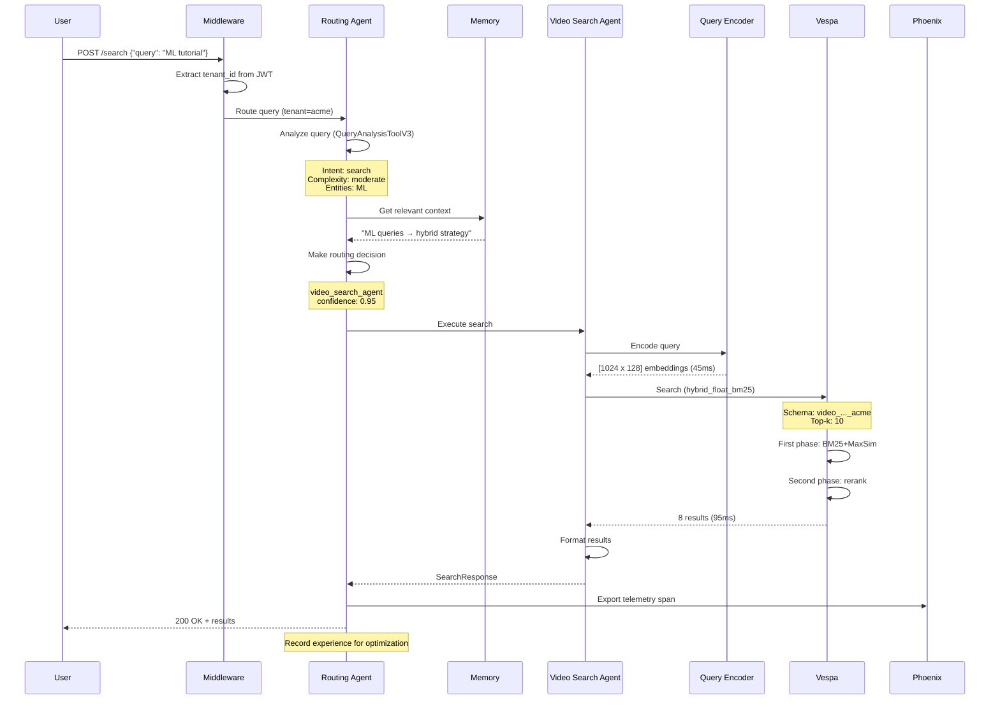
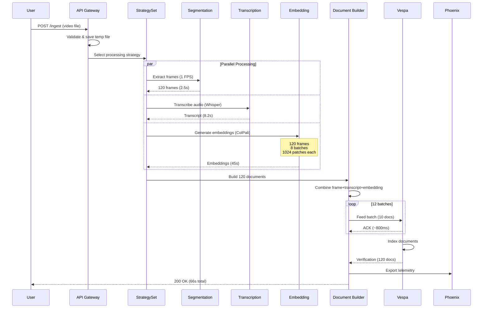
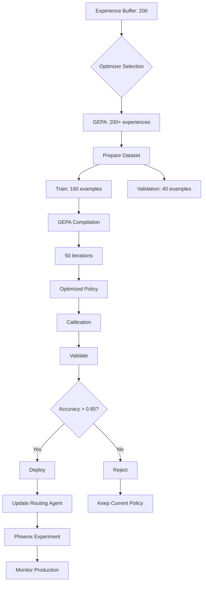

# System Flows & Request Traces

## Overview

This document provides detailed end-to-end request traces for Cogniverse operations, including real examples of multi-agent orchestration, video search queries, ingestion workflows, and optimization cycles.

## Video Search Query Flow

### Complete Request Trace

```
1. User Query → API Gateway
   ├── Method: POST /search
   ├── Headers:
   │   ├── Authorization: Bearer <jwt_token>
   │   └── Content-Type: application/json
   └── Body: {"query": "machine learning tutorial", "top_k": 10}

2. Middleware Layer (tenant extraction)
   ├── Extract tenant_id from JWT → "acme"
   ├── Set request.state.tenant_id = "acme"
   └── Continue to routing layer

3. Multi-Agent Orchestration
   ├── Span: cogniverse.request (root)
   │   ├── tenant.id: acme
   │   ├── query.text: "machine learning tutorial"
   │   └── environment: production
   │
   ├── 3a. Routing Agent (cogniverse.routing)
   │   ├── Query Analysis (QueryAnalysisToolV3)
   │   │   ├── Intent: "search"
   │   │   ├── Complexity: "moderate"
   │   │   ├── Entities: [{"type": "TOPIC", "text": "machine learning"}]
   │   │   ├── Requirements: {"video_search": true}
   │   │   └── Thinking: "User seeks educational video content on ML"
   │   │
   │   ├── Routing Decision (EnhancedRoutingAgent)
   │   │   ├── Chosen Agent: "video_search_agent"
   │   │   ├── Confidence: 0.92
   │   │   ├── Reasoning: "Video search needed for ML tutorial content"
   │   │   └── Workflow: "direct_search"
   │   │
   │   └── Memory Context (MemoryAwareMixin)
   │       ├── Search memory for similar queries
   │       ├── Found: "ML queries work well with hybrid_float_bm25"
   │       └── Boost confidence to 0.95
   │
   ├── 3b. Video Search Agent (video_search.query)
   │   ├── Profile Selection
   │   │   └── Selected: "video_colpali_smol500_mv_frame"
   │   │
   │   ├── Query Encoding (ColPali)
   │   │   ├── Model: vidore/colsmol-500m
   │   │   ├── Input: "machine learning tutorial"
   │   │   ├── Output: [1024 x 128] patch embeddings
   │   │   └── Duration: 45ms
   │   │
   │   ├── Vespa Query Construction
   │   │   ├── Schema: video_colpali_smol500_mv_frame_acme (tenant-specific)
   │   │   ├── Ranking Strategy: hybrid_float_bm25
   │   │   ├── Top-k: 10
   │   │   └── YQL: "SELECT * FROM ... WHERE userQuery()"
   │   │
   │   ├── Vespa Execution (vespa.query)
   │   │   ├── First Phase: hybrid_float_bm25
   │   │   │   ├── BM25 score (30%): text match on "machine learning"
   │   │   │   ├── MaxSim score (70%): patch similarity matching
   │   │   │   └── Candidate retrieval: 100 documents
   │   │   │
   │   │   ├── Second Phase: rerank top 10
   │   │   │   └── Refined MaxSim calculation
   │   │   │
   │   │   ├── Results: 8 videos found
   │   │   └── Latency: 95ms
   │   │
   │   └── Result Formatting
   │       ├── Extract video_id, score, frame_number
   │       ├── Group by video_id (aggregate frame scores)
   │       └── Sort by aggregated score
   │
   └── 3c. Response Assembly
       ├── Format results as SearchResponse
       ├── Add metadata (latency, profile, strategy)
       └── Export telemetry to Phoenix

4. Phoenix Telemetry Export
   ├── Project: cogniverse-acme-video-search
   ├── Root Span: cogniverse.request (200ms total)
   │   ├── Routing: 15ms
   │   ├── Video Search: 140ms
   │   │   ├── Encoding: 45ms
   │   │   └── Vespa Query: 95ms
   │   └── Response: 5ms
   └── Attributes: query, tenant_id, chosen_agent, strategy, results_count

5. Response to User
   └── Status: 200 OK
   └── Body: {
       "results": [
         {
           "video_id": "ml_basics_2024.mp4",
           "score": 0.87,
           "frame_number": 42,
           "content": "Introduction to Machine Learning concepts..."
         },
         ...
       ],
       "count": 8,
       "latency_ms": 200,
       "profile": "video_colpali_smol500_mv_frame",
       "strategy": "hybrid_float_bm25"
     }

6. Experience Recording (Optimization Loop)
   └── Add to experience replay buffer:
       ├── Query: "machine learning tutorial"
       ├── Chosen Agent: "video_search_agent"
       ├── Confidence: 0.95
       ├── Search Quality Score: 0.87 (computed from result relevance)
       ├── Processing Time: 200ms
       └── Reward: 0.78 (quality 0.5 + calibration 0.3 + efficiency 0.2)
```

### Mermaid Sequence Diagram



## Video Ingestion Flow

### Complete Ingestion Trace

```
1. Ingestion Request
   ├── Method: POST /ingest
   ├── Multipart Form:
   │   ├── video: sample.mp4 (25MB)
   │   ├── profile: video_colpali_smol500_mv_frame
   │   └── tenant_id: acme
   └── Headers: X-Tenant-ID: acme

2. Video Upload & Validation
   ├── Save to temporary location
   ├── Validate file format (MP4, AVI, MOV supported)
   ├── Extract metadata:
   │   ├── Duration: 120 seconds
   │   ├── FPS: 30
   │   ├── Resolution: 1920x1080
   │   └── Size: 25,165,824 bytes
   └── Generate video_id: sample_20251004_120000

3. ProcessingStrategySet Selection
   └── Profile: video_colpali_smol500_mv_frame
       ├── Segmentation: FrameSegmentationStrategy (1 FPS)
       ├── Transcription: AudioTranscriptionStrategy (Whisper)
       ├── Description: NoDescriptionStrategy
       └── Embedding: MultiVectorEmbeddingStrategy (ColPali)

4. Parallel Processing Pipeline
   ├── 4a. Frame Extraction (Segmentation)
   │   ├── Extract keyframes at 1 FPS
   │   ├── Total frames: 120
   │   ├── Save to cache: /tmp/frames/sample_*.jpg
   │   └── Duration: 2.5 seconds
   │
   ├── 4b. Audio Transcription (concurrent)
   │   ├── Extract audio track: sample.wav
   │   ├── Model: Whisper-base
   │   ├── Transcribe with timestamps
   │   ├── Result: "In this video, we'll explore machine learning..."
   │   └── Duration: 8.2 seconds
   │
   └── 4c. Embedding Generation (batched)
       ├── Batch size: 16 frames
       ├── Model: ColPali (vidore/colsmol-500m)
       ├── Process 120 frames in 8 batches
       │   ├── Batch 1 (frames 0-15): 1024 patches × 128 dims each
       │   ├── Batch 2 (frames 16-31): 1024 × 128
       │   ├── ... (batches 3-7)
       │   └── Batch 8 (frames 112-119): 1024 × 128
       ├── Total embeddings: 120 frames × 1024 patches × 128 dims
       └── Duration: 45 seconds

5. Document Building
   ├── Create 120 documents (one per frame)
   ├── Each document:
   │   ├── id: sample_20251004_120000_frame_0
   │   ├── source_id: sample_20251004_120000
   │   ├── frame_number: 0
   │   ├── timestamp: 0.0
   │   ├── text: "In this video, we'll explore..." (transcript chunk)
   │   ├── embedding: [1024 × 128] patches
   │   ├── embedding_binary: [hex-encoded hamming]
   │   ├── tenant_id: acme
   │   └── metadata: {fps: 30, resolution: "1920x1080", ...}
   └── Total document size: ~350KB per frame

6. Vespa Feeding
   ├── Target schema: video_colpali_smol500_mv_frame_acme
   ├── Batch feeding (10 docs per batch)
   ├── Batches: 12 batches of 10 docs each
   ├── Progress:
   │   ├── Batch 1 (docs 0-9): 850ms
   │   ├── Batch 2 (docs 10-19): 820ms
   │   ├── ... (batches 3-11)
   │   └── Batch 12 (docs 110-119): 780ms
   └── Total feed duration: 10.2 seconds

7. Verification
   ├── Query Vespa for document count
   ├── Expected: 120 documents
   ├── Actual: 120 documents
   └── Status: SUCCESS

8. Phoenix Telemetry
   └── Export ingestion span:
       ├── Project: cogniverse-acme-ingestion
       ├── Total duration: 66 seconds
       ├── Breakdown:
       │   ├── Frame extraction: 2.5s
       │   ├── Transcription: 8.2s
       │   ├── Embedding: 45s
       │   ├── Vespa feeding: 10.2s
       │   └── Overhead: 0.1s
       └── Attributes: video_id, profile, frame_count, success

9. Response to User
   └── Status: 200 OK
   └── Body: {
       "video_id": "sample_20251004_120000",
       "status": "success",
       "documents_created": 120,
       "processing_time_seconds": 66,
       "profile": "video_colpali_smol500_mv_frame"
     }
```

### Mermaid Diagram



## Multi-Agent Orchestration Flow

### Hierarchical Orchestration Example

```
Query: "Find and summarize ML videos from last week"

1. Composing Agent (Supervisor)
   ├── Receive user query
   ├── Analyze requirements:
   │   ├── Task 1: Find videos (video_search_agent)
   │   ├── Task 2: Summarize results (summarizer_agent)
   │   └── Workflow: Sequential (search → summarize)
   │
   └── Create workflow execution plan

2. Routing Agent (Step 1)
   ├── A2A Message (task):
   │   ├── sender: composing_agent
   │   ├── recipient: routing_agent
   │   ├── message_type: "task"
   │   ├── data: {"action": "analyze", "query": "..."}
   │   └── workflow_id: wf_12345
   │
   ├── Execute query analysis
   ├── Decision: video_search_agent (confidence: 0.94)
   │
   └── A2A Message (result):
       ├── sender: routing_agent
       ├── recipient: composing_agent
       ├── message_type: "result"
       ├── data: {"recommended_agent": "video_search_agent", ...}
       └── parent_message_id: msg_001

3. Video Search Agent (Step 2)
   ├── A2A Message (task):
   │   ├── sender: composing_agent
   │   ├── recipient: video_search_agent
   │   ├── data: {
   │   │   "action": "search",
   │   │   "query": "machine learning",
   │   │   "temporal_filter": {"start": "2025-09-26", "end": "2025-10-03"},
   │   │   "ranking_strategy": "hybrid_float_bm25"
   │   │ }
   │   └── workflow_id: wf_12345
   │
   ├── Execute search (see Video Search Flow above)
   ├── Results: 8 videos found
   │
   └── A2A Message (result):
       ├── data: {"status": "success", "results": [...], "count": 8}
       └── processing_time_ms: 120

4. Summarizer Agent (Step 3)
   ├── A2A Message (task):
   │   ├── sender: composing_agent
   │   ├── recipient: summarizer_agent
   │   ├── data: {
   │   │   "action": "summarize",
   │   │   "documents": <8 video results>,
   │   │   "max_length": 200,
   │   │   "style": "concise"
   │   │ }
   │   └── workflow_id: wf_12345
   │
   ├── Process 8 video results
   ├── Generate summary (LLM):
   │   └── "Found 8 ML tutorials covering supervised learning,
   │        neural networks, and deep learning fundamentals.
   │        Most recent videos focus on practical implementations..."
   │
   └── A2A Message (result):
       ├── data: {"status": "success", "summary": "...", "length": 187}
       └── processing_time_ms: 2500

5. Composing Agent (Aggregation)
   ├── Receive all results
   ├── Aggregate:
   │   ├── Video results: 8 videos
   │   ├── Summary: 187 characters
   │   └── Total workflow time: 2.8 seconds
   │
   └── Return to user:
       {
         "videos": [...],
         "summary": "Found 8 ML tutorials...",
         "workflow_id": "wf_12345",
         "total_time_ms": 2800
       }

6. Phoenix Telemetry
   └── Workflow span tree:
       cogniverse.orchestration (root - 2800ms)
       ├── orchestration.routing_agent (20ms)
       ├── orchestration.video_search_agent (140ms)
       │   ├── video_search.embedding (45ms)
       │   └── video_search.vespa_query (95ms)
       └── orchestration.summarizer_agent (2500ms)
           └── summarizer.llm_generate (2400ms)

7. Experience Recording
   └── Workflow Intelligence:
       ├── Pattern: "find and summarize" → sequential workflow
       ├── Agent sequence: [routing, video_search, summarizer]
       ├── Success: true
       ├── Quality score: 0.89
       └── Learn: This pattern works well for summary requests
```

## Optimization Cycle Flow

### GEPA Optimization Execution

```
Trigger: 200 experiences collected in replay buffer

1. Experience Replay Buffer State
   ├── Total experiences: 200
   ├── Sampling strategy: Uniform random
   ├── Train/validation split: 160/40
   └── Reward distribution:
       ├── Mean: 0.78
       ├── Std: 0.12
       └── Range: [0.45, 0.95]

2. Optimizer Selection
   ├── Experience count: 200
   ├── Decision: GEPA (threshold: 200+)
   └── Rationale: Sufficient data for gradient-based optimization

3. Dataset Preparation
   ├── Convert experiences to DSPy examples
   ├── Format:
   │   └── Example(
   │       query_analysis={
   │         "intent": "search",
   │         "complexity": "moderate",
   │         "entities": [...],
   │         "requirements": {"video_search": true}
   │       },
   │       chosen_agent="video_search_agent",  # ground truth
   │       confidence=0.92
   │     )
   ├── Training set: 160 examples
   └── Validation set: 40 examples

4. GEPA Compilation
   ├── Initialize GEPA optimizer
   ├── Configure:
   │   ├── max_bootstrapped_demos: 4
   │   ├── max_labeled_demos: 8
   │   ├── learning_rate: 0.001
   │   └── max_iterations: 50
   │
   ├── Optimization loop:
   │   ├── Iteration 1: accuracy=0.75, loss=0.234
   │   ├── Iteration 10: accuracy=0.82, loss=0.156
   │   ├── Iteration 20: accuracy=0.87, loss=0.098
   │   ├── Iteration 30: accuracy=0.89, loss=0.067
   │   ├── Iteration 40: accuracy=0.90, loss=0.054
   │   └── Iteration 50: accuracy=0.91, loss=0.047
   │
   └── Converged: accuracy=0.91 (best)

5. Confidence Calibration
   ├── Get predictions on validation set (40 examples)
   ├── Collect (confidence, correct) pairs
   ├── Calibration method: isotonic regression
   ├── Before calibration:
   │   └── ECE (Expected Calibration Error): 0.12
   ├── After calibration:
   │   └── ECE: 0.05
   └── Result: Calibrated classifier

6. Validation
   ├── Baseline policy accuracy: 0.75
   ├── Optimized policy accuracy: 0.91
   ├── Improvement: +21.3%
   ├── Validation threshold: 0.85
   └── Decision: DEPLOY (exceeds threshold)

7. Deployment
   ├── Save optimized policy: outputs/optimized_policy_20251004.json
   ├── Update routing agent with new policy
   ├── Mark deployment timestamp
   └── Clear processed experiences from buffer

8. Phoenix Experiment Tracking
   └── Create experiment: routing-optimization-20251004
       ├── Dataset: 200 experiences
       ├── Optimizer: GEPA
       ├── Metrics:
       │   ├── Accuracy: 0.91 (+21.3%)
       │   ├── Calibration ECE: 0.05 (-58.3%)
       │   ├── Avg confidence: 0.88
       │   └── Training time: 892 seconds
       └── Status: deployed

9. Monitoring
   └── Post-deployment metrics:
       ├── Production accuracy: 0.89 (within 2% of validation)
       ├── Confidence calibration: 0.06 ECE
       └── Avg routing latency: 18ms (no degradation)
```

### Mermaid Diagram



## Performance Metrics

### End-to-End Latencies

| Operation | P50 | P95 | P99 | Components |
|-----------|-----|-----|-----|------------|
| **Video Search Query** | 180ms | 250ms | 320ms | Routing (15ms) + Encoding (45ms) + Vespa (95ms) + Response (5ms) |
| **Video Ingestion** | 55s | 75s | 95s | Frames (2.5s) + Transcription (8s) + Embedding (45s) + Feed (10s) |
| **Multi-Agent Workflow** | 2.5s | 3.5s | 4.8s | Routing (20ms) + Search (140ms) + Summarize (2.5s) |
| **Optimization Cycle** | 850s | 950s | 1100s | GEPA compilation (50 iterations) |

### Component Breakdown

**Query Encoding:**
- ColPali (text → patches): 40-50ms
- VideoPrism (video chunk): 120-150ms
- Text embedding (BM25): <5ms

**Vespa Search:**
- Hybrid (float + BM25): 80-120ms
- Pure vector (float_float): 60-90ms
- Pure text (bm25_only): 20-40ms

**Video Processing:**
- Frame extraction (1 FPS): 2-3s per 100 frames
- Whisper transcription: 6-10s per 60s audio
- ColPali embedding: 35-50s per 100 frames (batch 16)

## Error Handling Examples

### Retry with Exponential Backoff

```
Scenario: Vespa connection timeout

1. Initial request
   ├── Query: "ML tutorial"
   ├── Target: Vespa search
   └── Result: ConnectionTimeout (5000ms)

2. Retry attempt 1
   ├── Backoff: 2^0 = 1 second
   ├── Wait: 1s
   ├── Retry query
   └── Result: ConnectionTimeout (5000ms)

3. Retry attempt 2
   ├── Backoff: 2^1 = 2 seconds
   ├── Wait: 2s
   ├── Retry query
   └── Result: Success (120ms)

4. Return results to user
   └── Total time: 1s + 5s + 2s + 5s + 0.12s = 13.12s
```

### Fallback Strategy

```
Scenario: Primary embedding model unavailable

1. Initial attempt
   ├── Model: ColPali (vidore/colsmol-500m)
   ├── Request: Encode "ML tutorial"
   └── Result: ModelNotLoadedError

2. Fallback decision
   ├── Error: Unrecoverable (model not loaded)
   ├── Fallback strategy: Use alternative encoder
   └── Alternative: BM25 text-only search

3. Execute fallback
   ├── Skip embedding generation
   ├── Use pure text search (bm25_only)
   ├── Search Vespa with text query
   └── Result: 5 results (reduced quality, but functional)

4. Log warning
   └── "ColPali unavailable, fell back to BM25 text search"

5. Return results with metadata
   └── {
       "results": [...],
       "fallback_used": true,
       "fallback_reason": "primary_encoder_unavailable",
       "original_strategy": "hybrid_float_bm25",
       "actual_strategy": "bm25_only"
     }
```

## Related Documentation

- [Architecture Overview](architecture.md) - System architecture
- [Agent Orchestration](agent-orchestration.md) - Multi-agent coordination
- [Optimization System](optimization-system.md) - GEPA/MIPRO/SIMBA
- [Phoenix Integration](phoenix-integration.md) - Telemetry and tracing
- [Multi-Tenant System](multi-tenant-system.md) - Tenant isolation

**Last Updated**: 2025-10-04
