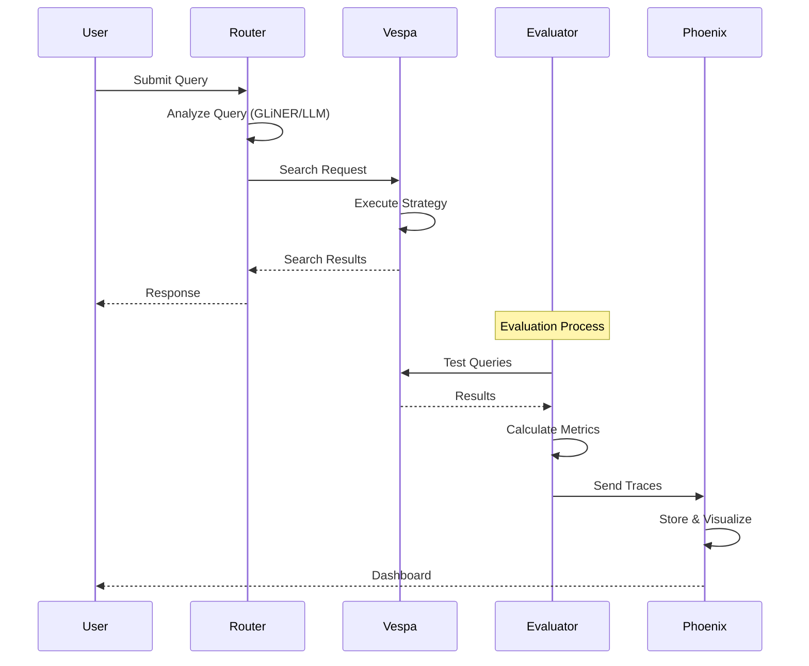
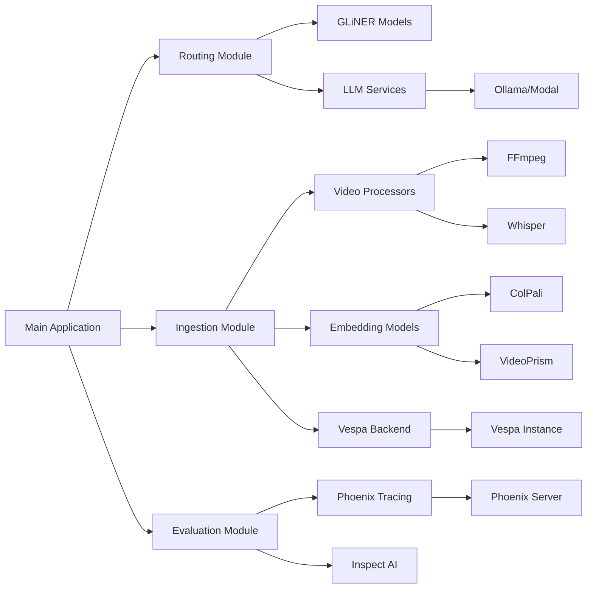
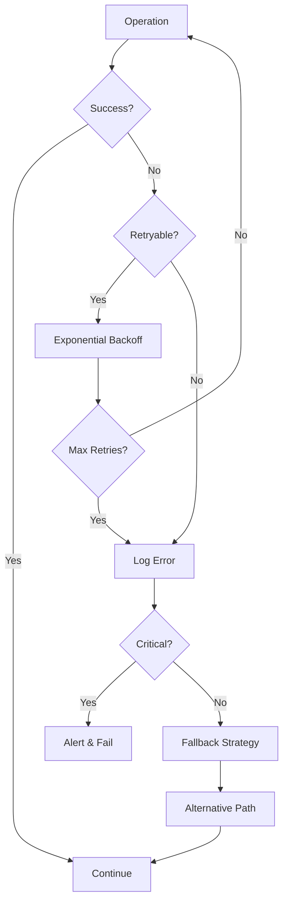

# System Flows and Architecture Diagrams

## Overall System Architecture

```
┌─────────────────────────────────────────────────────────────────┐
│                         User Query                               │
└──────────────────────────┬──────────────────────────────────────┘
                           ↓
┌─────────────────────────────────────────────────────────────────┐
│                    Query Routing Layer                           │
│  ┌──────────────┐  ┌──────────────┐  ┌──────────────┐         │
│  │   GLiNER     │→ │     LLM      │→ │   Keyword    │         │
│  │  (Fast Path) │  │ (Slow Path)  │  │  (Fallback)  │         │
│  └──────────────┘  └──────────────┘  └──────────────┘         │
└──────────────────────────┬──────────────────────────────────────┘
                           ↓
┌─────────────────────────────────────────────────────────────────┐
│                    Search Execution                              │
│  ┌──────────────────────────────────────────────────┐          │
│  │            Vespa Vector Database                  │          │
│  │  ┌──────────┐  ┌──────────┐  ┌──────────┐      │          │
│  │  │  BM25    │  │  Float   │  │  Binary  │      │          │
│  │  │  Text    │  │ Embeddings│ │ Embeddings│     │          │
│  │  └──────────┘  └──────────┘  └──────────┘      │          │
│  └──────────────────────────────────────────────────┘          │
└──────────────────────────┬──────────────────────────────────────┘
                           ↓
┌─────────────────────────────────────────────────────────────────┐
│                    Result Generation                             │
│         Ranking → Reranking → Response Synthesis                │
└─────────────────────────────────────────────────────────────────┘
```


## Module-Specific Diagrams

Detailed flow diagrams for individual modules have been moved to their respective README files:

- **Query Routing Flow**: See `src/app/routing/README.md`
- **Video Ingestion Pipeline**: See `src/app/ingestion/README.md`
- **Vespa Search Strategies**: See `src/backends/vespa/README.md`
- **Evaluation Framework**: See `src/evaluation/README.md`

## Data Processing Architecture

```
┌────────────────────────────────────────────────────────────────┐
│                     Input Layer                                 │
│  ┌──────────┐  ┌──────────┐  ┌──────────┐  ┌──────────┐     │
│  │  Videos  │  │  Images  │  │   PDFs   │  │  Audio   │     │
│  └─────┬────┘  └─────┬────┘  └─────┬────┘  └─────┬────┘     │
└────────┼─────────────┼─────────────┼─────────────┼────────────┘
         ↓             ↓             ↓             ↓
┌────────────────────────────────────────────────────────────────┐
│                  Processing Strategy Layer                      │
│  ┌──────────────────────────────────────────────────────┐     │
│  │         ProcessingStrategySet (Orchestrator)         │     │
│  └──────────────────────────────────────────────────────┘     │
│         ↓                    ↓                    ↓            │
│  ┌──────────┐        ┌──────────┐        ┌──────────┐        │
│  │Segmentation│      │Transcription│     │Description│        │
│  │ Strategy  │       │  Strategy   │     │ Strategy  │        │
│  └──────────┘        └──────────┘        └──────────┘        │
└────────────────────────────────────────────────────────────────┘
                               ↓
┌────────────────────────────────────────────────────────────────┐
│                    Embedding Generation                         │
│  ┌──────────┐  ┌──────────┐  ┌──────────┐  ┌──────────┐     │
│  │ ColPali  │  │ ColQwen  │  │VideoPrism│  │  Custom  │     │
│  └──────────┘  └──────────┘  └──────────┘  └──────────┘     │
└────────────────────────────────────────────────────────────────┘
                               ↓
┌────────────────────────────────────────────────────────────────┐
│                    Document System                              │
│            Universal Document Format (Backend-agnostic)         │
│  ┌──────────────────────────────────────────────────────┐     │
│  │  media_type | embeddings | metadata | temporal_info  │     │
│  └──────────────────────────────────────────────────────┘     │
└────────────────────────────────────────────────────────────────┘
                               ↓
┌────────────────────────────────────────────────────────────────┐
│                    Storage Backend                              │
│  ┌──────────┐  ┌──────────┐  ┌──────────┐  ┌──────────┐     │
│  │  Vespa   │  │  Elastic │  │  Pinecone│  │  Custom  │     │
│  └──────────┘  └──────────┘  └──────────┘  └──────────┘     │
└────────────────────────────────────────────────────────────────┘
```

## Cache System Architecture

```
┌────────────────────────────────────────────────────────────────┐
│                    Cache Manager                                │
│              (Unified Interface & Orchestration)                │
└────────────────────────────────────────────────────────────────┘
                               ↓
┌────────────────────────────────────────────────────────────────┐
│                    Cache Backends                               │
│  ┌──────────────────┐  ┌──────────────────┐                   │
│  │   Filesystem     │  │  Object Storage  │                   │
│  │  ┌──────────┐   │  │  ┌──────────┐   │                   │
│  │  │  Local   │   │  │  │    S3    │   │                   │
│  │  └──────────┘   │  │  └──────────┘   │                   │
│  │  ┌──────────┐   │  │  ┌──────────┐   │                   │
│  │  │Structured│   │  │  │   GCS    │   │                   │
│  │  └──────────┘   │  │  └──────────┘   │                   │
│  └──────────────────┘  └──────────────────┘                   │
└────────────────────────────────────────────────────────────────┘
                               ↓
┌────────────────────────────────────────────────────────────────┐
│                    Cache Operations                             │
│  ┌──────────┐  ┌──────────┐  ┌──────────┐  ┌──────────┐     │
│  │   Get    │  │   Set    │  │  Delete  │  │   TTL    │     │
│  └──────────┘  └──────────┘  └──────────┘  └──────────┘     │
└────────────────────────────────────────────────────────────────┘
```

## Component Interaction Sequence



## Deployment Topology

```
┌─────────────────────────────────────────────────────────────────┐
│                    Production Environment                        │
│                                                                  │
│  ┌──────────────────────────────────────────────────────────┐  │
│  │                    Load Balancer                          │  │
│  └────────────────────────┬─────────────────────────────────┘  │
│                           ↓                                     │
│  ┌──────────────────────────────────────────────────────────┐  │
│  │              Application Instances (2-10)                │  │
│  │  ┌──────────┐  ┌──────────┐  ┌──────────┐             │  │
│  │  │  App #1  │  │  App #2  │  │  App #N  │  ...        │  │
│  │  └──────────┘  └──────────┘  └──────────┘             │  │
│  └──────────────────────────────────────────────────────────┘  │
│                           ↓                                     │
│  ┌──────────────────────────────────────────────────────────┐  │
│  │                 Service Layer                             │  │
│  │  ┌──────────┐  ┌──────────┐  ┌──────────┐             │  │
│  │  │  Vespa   │  │  Phoenix │  │  Ollama  │             │  │
│  │  │ Cluster  │  │  Server  │  │ Inference│             │  │
│  │  │  (3+)    │  │    (1)   │  │   (2+)   │             │  │
│  │  └──────────┘  └──────────┘  └──────────┘             │  │
│  └──────────────────────────────────────────────────────────┘  │
│                           ↓                                     │
│  ┌──────────────────────────────────────────────────────────┐  │
│  │                 Storage Layer                             │  │
│  │  ┌──────────┐  ┌──────────┐  ┌──────────┐             │  │
│  │  │  Model   │  │  Cache   │  │  Data    │             │  │
│  │  │  Store   │  │  Store   │  │  Store   │             │  │
│  │  └──────────┘  └──────────┘  └──────────┘             │  │
│  └──────────────────────────────────────────────────────────┘  │
└─────────────────────────────────────────────────────────────────┘
```

## Module Dependencies



## Performance Flow

```
Request → Router → Backend → Response
   ↓        ↓         ↓         ↓
  <1ms    <50ms    <100ms    <200ms
(keyword) (GLiNER)  (Vespa)   (total)

Ingestion → Processing → Embedding → Storage
    ↓          ↓           ↓          ↓
   1s/video   2s/video   3s/video   <1s
  (extract)  (transcribe) (embed)   (feed)
```

## Error Handling Flow



## Notes

- All performance metrics shown are estimates and should be measured in production
- Mermaid diagrams can be rendered in GitHub, VSCode with extensions, or online tools
- ASCII diagrams are universally viewable but less interactive
- Component boundaries represent logical separation, not necessarily physical deployment