# Pytest Best Practices

---

## Async Testing Configuration

### Threading Issues with Async Tests

Async tests in pytest can encounter threading conflicts when loading ML models. The codebase uses several libraries that spawn background threads:

- **tqdm** (from transformers): Progress bars during model downloads
- **posthog** (from mem0ai): Telemetry/analytics background threads
- **torch**: Multi-threaded tensor operations

These background threads can cause **segmentation faults** during pytest cleanup when combined with async event loops.

### Solution: Single-Threaded Mode

The test suite is configured for single-threaded execution to avoid threading conflicts:

**File: `tests/conftest.py`**
```python
import os

# Configure torch and tokenizers to avoid threading issues
os.environ["TOKENIZERS_PARALLELISM"] = "false"
os.environ["OMP_NUM_THREADS"] = "1"
os.environ["MKL_NUM_THREADS"] = "1"

# Import torch and configure threading before any tests run
try:
    import torch

    torch.set_num_threads(1)
except ImportError:
    pass
```

**File: `pytest.ini`**
```ini
[pytest]
asyncio_mode = auto
asyncio_default_fixture_loop_scope = function
```

### Background Thread Cleanup

The conftest also includes automatic cleanup for background threads:

```python
from tests.utils.async_polling import simulate_processing_delay

def cleanup_background_threads():
    """
    Clean up background threads from tqdm (transformers) and posthog (mem0ai).

    These libraries create daemon threads that can cause segfaults during pytest
    cleanup in async tests. We need to give them time to finish and exit cleanly.
    """
    max_wait = 2.0  # seconds
    start_time = time.time()

    while time.time() - start_time < max_wait:
        background_threads = [
            t
            for t in threading.enumerate()
            if t != threading.current_thread()
            and t.daemon
            and any(name in t.name.lower() for name in ["tqdm", "posthog", "monitor"])
        ]

        if not background_threads:
            break

        # Give threads time to finish their work
        simulate_processing_delay(delay=0.1, description="test processing")

    # Force garbage collection to clean up any remaining references
    gc.collect()
```

---

## Running Tests

### Basic Test Execution

```bash
# Run all tests
JAX_PLATFORM_NAME=cpu uv run pytest

# Run specific test file with 30-minute timeout
JAX_PLATFORM_NAME=cpu timeout 1800 uv run pytest tests/agents/test_routing.py

# Run with verbose output
JAX_PLATFORM_NAME=cpu uv run pytest -xvs
```

### Test Markers

```bash
# Run only unit tests
uv run pytest -m unit

# Run only integration tests
uv run pytest -m integration

# Run fast CI tests (subset for quick feedback)
uv run pytest -m ci_fast

# Skip slow tests
uv run pytest -m "not slow"

# Run tests requiring specific models
uv run pytest -m requires_colpali
uv run pytest -m requires_ollama

# Skip tests requiring Ollama (for CI)
uv run pytest -m "not requires_ollama"
```

### Available Markers

Defined in `pytest.ini`:

```ini
[pytest]
markers =
    unit: Unit tests for individual components
    integration: Integration tests with multiple components
    slow: Slow tests that take significant time
    requires_ollama: Tests that require Ollama to be running
    requires_gliner: Tests that require GLiNER models
    phoenix: Tests requiring Phoenix
    inspect: Tests requiring Inspect AI
    ragas: Tests requiring RAGAS
    asyncio: Async tests
    local_only: Tests that should only run locally (not in CI/CD)
    requires_models: Tests that require actual ML models to be available
    benchmark: Performance benchmarking tests
    ingestion: Tests for ingestion pipeline
    requires_vespa: Tests that require Vespa backend to be running
    requires_docker: Tests that require Docker
    requires_gpu: Tests that require GPU availability
    requires_colpali: Tests that require ColPali models
    requires_videoprism: Tests that require VideoPrism models
    requires_colqwen: Tests that require ColQwen models
    requires_whisper: Tests that require Whisper models
    requires_cv2: Tests that require OpenCV
    requires_ffmpeg: Tests that require FFmpeg
    ci_safe: Tests that are safe to run in CI environment
    ci_fast: Fast, essential tests for CI (subset of most important functionality)
    timeout: Tests with custom timeout values
    e2e: End-to-end integration tests with real services
    system: System-level end-to-end tests with full infrastructure
    telemetry: Tests for telemetry and observability system
```

### The `ci_fast` Marker

The `ci_fast` marker identifies tests run in the CI Fast subset steps across workflows:

```python
@pytest.mark.integration
@pytest.mark.ci_fast
async def test_tenant_schema_creation(vespa_docker):
    """Essential test for CI - verifies tenant schema lifecycle."""
    # This runs in the CI Fast subset steps across workflows
    ...
```

**Guidelines for `ci_fast` tests:**

- Essential functionality that must work

- Complete in under 2 minutes

- No external API calls (Ollama, OpenAI, etc.)

- Can use Docker containers (Vespa, Phoenix)

### Async Test Timeout

Async tests use custom timeouts defined in test files:

```python
@pytest.mark.timeout(TEST_CONFIG["test_timeout"])
async def test_real_query_analysis_with_local_llm(self):
    # Test code here
    pass
```

Default timeouts from `CLAUDE.md`:

- Individual test files: 30 minutes (`timeout 1800`)

- Full test suite: 120 minutes (`timeout 7200`)

---

## Common Issues

### Segmentation Faults in Async Tests

**Symptoms:**
```text
Fatal Python error: Segmentation fault
Thread 0x000000033614f000 (most recent call first):
  File "/path/to/threading.py", line 359 in wait
```

**Cause:** Threading conflict between pytest async event loop and background threads from model loading.

**Solution:** Already handled by `tests/conftest.py` configuration. If you still see segfaults:

1. Check that tests use `@pytest.mark.asyncio` correctly
2. Verify `pytest.ini` has `asyncio_mode = auto`
3. Ensure no manual thread creation in test code

### Model Loading Errors

**Symptoms:**
```text
Fetching 5 files: 100%
[Segfault or hang]
```

**Cause:** Large models (e.g., `vidore/colpali-v1.2`) can cause threading issues.

**Solution:** Use smaller models in tests:

- ✅ Use: `vidore/colsmol-500m` (stable, 500M parameters)

- ❌ Avoid: `vidore/colpali-v1.2` (1.2B parameters, less stable in tests)

### Import Timing Issues

**Symptoms:**
```text
ModuleNotFoundError: No module named 'cogniverse_core'
```

**Cause:** UV workspace not synced or tests run outside virtual environment.

**Solution:** Always use `uv run pytest` which ensures workspace packages are available.

**Example Fix:**
```bash
# ❌ Bad: Direct pytest without uv
pytest tests/agents/

# ✅ Good: Use uv run to activate workspace
uv run pytest tests/agents/
```

**Package Import Patterns:**
```python
# ✅ Good: Absolute imports from workspace packages
from cogniverse_foundation.telemetry.manager import TelemetryManager
from cogniverse_foundation.config.unified_config import SystemConfig
from cogniverse_agents.routing_agent import RoutingAgent
from cogniverse_vespa.backend import VespaBackend

# ❌ Bad: Old src-style imports (deprecated)
from src.agents.routing_agent import RoutingAgent  # ❌ Will fail
```

---

## Package Testing

### Testing Package Imports

**Example Test Patterns - Verify Package Structure:**
```python
# Example: tests/test_imports.py (create this file to verify imports)
import pytest

def test_sdk_package_imports():
    """Verify cogniverse_sdk package imports work"""
    from cogniverse_core.schemas.filesystem_loader import FilesystemSchemaLoader
    from pathlib import Path
    from cogniverse_sdk import SearchResult, Document

    assert FilesystemSchemaLoader is not None
    assert SearchResult is not None
    assert Document is not None

def test_foundation_package_imports():
    """Verify cogniverse_foundation package imports work"""
    from cogniverse_foundation.telemetry.manager import TelemetryManager

    assert TelemetryManager is not None

def test_core_package_imports():
    """Verify cogniverse_core package imports work"""
    from cogniverse_foundation.config.unified_config import SystemConfig
    from cogniverse_core.registries.backend_registry import BackendRegistry

    assert SystemConfig is not None
    assert BackendRegistry is not None

def test_agents_package_imports():
    """Verify cogniverse_agents package imports work"""
    from cogniverse_agents.routing_agent import RoutingAgent
    from cogniverse_agents.video_agent_refactored import VideoSearchAgent

    assert RoutingAgent is not None
    assert VideoSearchAgent is not None

def test_retrieval_package_imports():
    """Verify cogniverse_vespa package imports work"""
    from cogniverse_vespa.backend import VespaBackend
    from cogniverse_vespa.vespa_schema_manager import VespaSchemaManager

    assert VespaBackend is not None
    assert VespaSchemaManager is not None

def test_processing_package_imports():
    """Verify cogniverse_runtime.ingestion package imports work"""
    from cogniverse_runtime.ingestion.pipeline import VideoIngestionPipeline
    from cogniverse_runtime.ingestion.pipeline_builder import VideoIngestionPipelineBuilder

    assert VideoIngestionPipeline is not None
    assert VideoIngestionPipelineBuilder is not None

def test_evaluation_package_imports():
    """Verify cogniverse_evaluation package imports work"""
    from cogniverse_evaluation.core.experiment_tracker import ExperimentTracker
    from cogniverse_evaluation.metrics import calculate_mrr, calculate_ndcg

    assert ExperimentTracker is not None
    assert calculate_mrr is not None
    assert calculate_ndcg is not None
```

### Package Dependency Testing

**Example Test Patterns - Cross-Package Dependencies:**
```python
# Example: tests/test_package_dependencies.py (create this file to verify dependencies)
import pytest
from cogniverse_foundation.telemetry.manager import TelemetryManager
from cogniverse_foundation.config.unified_config import SystemConfig
from cogniverse_agents.routing_agent import RoutingAgent

def test_agents_depends_on_foundation_and_core():
    """Verify agents package can use foundation and core packages"""
    from cogniverse_agents.routing_agent import RoutingDeps
    from cogniverse_foundation.telemetry.config import TelemetryConfig

    # Create dependencies with tenant-specific configuration
    telemetry_config = TelemetryConfig()
    deps = RoutingDeps(
        tenant_id="test",
        telemetry_config=telemetry_config
    )

    # RoutingAgent from agents package should accept RoutingDeps
    agent = RoutingAgent(deps=deps)

    assert agent.tenant_id == "test"
    assert agent.deps == deps

def test_runtime_depends_on_all():
    """Verify runtime package can use all dependencies"""
    from cogniverse_foundation.config.unified_config import SystemConfig
    from cogniverse_agents.routing_agent import RoutingAgent
    from cogniverse_vespa.backend import VespaBackend

    # Runtime should be able to import all packages
    assert RoutingAgent is not None
    assert VespaBackend is not None
    assert SystemConfig is not None

def test_layered_architecture_dependencies():
    """Verify proper layering - lower layers don't import higher layers"""
    # SDK should not import from other packages
    # Foundation can import SDK
    # Core can import SDK and Foundation
    # Agents can import SDK, Foundation, and Core
    # Implementation can import SDK, Foundation, and Core
    # Services can import all
    pass
```

---

## Multi-Tenant Testing

### Tenant Isolation Tests

**Test Tenant-Specific Configuration:**
```python
# tests/test_tenant_isolation.py
import pytest
from cogniverse_foundation.config.unified_config import SystemConfig
from cogniverse_agents.video_agent_refactored import VideoSearchAgent

def test_tenant_config_isolation():
    """Verify each tenant gets isolated configuration"""
    config_a = SystemConfig(tenant_id="acme_corp")
    config_b = SystemConfig(tenant_id="globex_inc")

    assert config_a.tenant_id == "acme_corp"
    assert config_b.tenant_id == "globex_inc"
    assert config_a.tenant_id != config_b.tenant_id

def test_tenant_schema_naming():
    """Verify tenant schemas use correct naming convention"""
    from cogniverse_foundation.config.utils import create_default_config_manager

    config_manager = create_default_config_manager()
    agent = VideoSearchAgent(
        profile="video_colpali_smol500_mv_frame",
        tenant_id="acme_corp",
        config_manager=config_manager
    )

    # Agent's search service should target tenant-specific schema
    # Schema name is stored in the profile configuration
    assert agent.tenant_id == "acme_corp"
    assert agent.profile == "video_colpali_smol500_mv_frame"

def test_tenant_phoenix_project_isolation():
    """Verify Phoenix projects can be registered per-tenant"""
    from cogniverse_foundation.telemetry.manager import TelemetryManager

    # TelemetryManager is a singleton, configure per-tenant projects
    telemetry = TelemetryManager()

    # Register tenant-specific projects
    telemetry.register_project(tenant_id="acme_corp", project_name="acme-project")
    telemetry.register_project(tenant_id="globex_inc", project_name="globex-project")

    # Verify registration succeeded (projects are stored internally)
    # Actual project isolation is enforced when creating spans
    assert telemetry is not None
```

### Multi-Tenant Data Isolation

**Test Cross-Tenant Data Boundaries:**
```python
# tests/integration/test_multi_tenant_isolation.py
import pytest
from cogniverse_foundation.config.unified_config import SystemConfig
from cogniverse_runtime.ingestion.pipeline import VideoIngestionPipeline
from cogniverse_core.registries.backend_registry import BackendRegistry
from cogniverse_vespa.backend import VespaBackend

@pytest.mark.integration
async def test_tenant_data_isolation(sample_video, config_manager, schema_loader):
    """Verify tenants cannot access each other's data"""
    from cogniverse_runtime.ingestion.pipeline import PipelineConfig

    # Create pipeline config for tenant A
    pipeline_config_a = PipelineConfig(
        extract_keyframes=True,
        generate_embeddings=True,
        search_backend="vespa"
    )

    # Ingest video for tenant A
    pipeline_a = VideoIngestionPipeline(
        tenant_id="acme_corp",
        config=pipeline_config_a,
        config_manager=config_manager,
        schema_loader=schema_loader
    )
    result_a = await pipeline_a.process_video(sample_video)
    assert result_a["status"] == "success"

    # Search as tenant B (should get no results from tenant A)
    backend_b = BackendRegistry.get_search_backend(
        name="vespa",
        tenant_id="globex_inc",
        config_manager=config_manager,
        schema_loader=schema_loader
    )

    results = backend_b.search(
        query_dict={
            "query": "test",
            "type": "video",
            "profile": "video_colpali_smol500_mv_frame_globex_inc"
        }
    )

    # Tenant B should not see tenant A's documents
    assert len(results) == 0

@pytest.mark.integration
def test_tenant_memory_isolation(config_manager, schema_loader):
    """Verify tenant memories are isolated"""
    from cogniverse_core.memory.manager import Mem0MemoryManager

    memory_a = Mem0MemoryManager(tenant_id="acme_corp")
    memory_a.initialize(
        backend_host="localhost",
        backend_port=8080,
        config_manager=config_manager,
        schema_loader=schema_loader
    )

    memory_b = Mem0MemoryManager(tenant_id="globex_inc")
    memory_b.initialize(
        backend_host="localhost",
        backend_port=8080,
        config_manager=config_manager,
        schema_loader=schema_loader
    )

    # Add memory for tenant A
    memory_a.add_memory(
        content="Secret message",
        tenant_id="acme_corp",
        agent_name="test_agent"
    )

    # Search as tenant B (should not find tenant A's memory)
    results_b = memory_b.search_memory(
        query="Secret message",
        tenant_id="globex_inc",
        agent_name="test_agent",
        top_k=5
    )

    assert len(results_b) == 0
```

### Tenant-Aware Fixtures

**Example Patterns** (not in conftest.py; create as needed for multi-tenant tests):
```python
import pytest
from cogniverse_foundation.config.unified_config import SystemConfig
from cogniverse_agents.routing_agent import RoutingAgent

@pytest.fixture
def tenant_a_config():
    """Configuration for tenant A (acme_corp)"""
    return SystemConfig(
        tenant_id="acme_corp",
        backend_url="http://localhost",
        backend_port=8080,
    )

@pytest.fixture
def tenant_b_config():
    """Configuration for tenant B (globex_inc)"""
    return SystemConfig(
        tenant_id="globex_inc",
        backend_url="http://localhost",
        backend_port=8080,
    )

@pytest.fixture
def multi_tenant_configs():
    """Multiple tenant configurations for cross-tenant tests"""
    return {
        "acme_corp": SystemConfig(tenant_id="acme_corp"),
        "globex_inc": SystemConfig(tenant_id="globex_inc"),
        "default": SystemConfig(tenant_id="default")
    }

@pytest.fixture
def tenant_agent(tenant_a_config):
    """Create routing agent for tenant A"""
    from cogniverse_agents.routing_agent import RoutingDeps
    from cogniverse_foundation.telemetry.config import TelemetryConfig

    deps = RoutingDeps(
        tenant_id=tenant_a_config.tenant_id,
        telemetry_config=TelemetryConfig()
    )
    return RoutingAgent(deps=deps)

# Use in tests:
def test_with_tenant_fixtures(tenant_a_config, tenant_agent):
    assert tenant_agent.tenant_id == "acme_corp"
```

---

## Test Isolation

### State Cleanup Between Tests

Tests use auto-fixtures to clean up state:

```python
@pytest.fixture(autouse=True, scope="function")
def cleanup_dspy_state():
    """Clean up DSPy state between tests to prevent isolation issues"""
    yield

    # Clean up any DSPy state after each test
    try:
        import dspy

        # Reset ALL DSPy settings attributes to prevent any state pollution
        if hasattr(dspy, "settings"):
            if hasattr(dspy.settings, "lm"):
                dspy.settings.lm = None
            if hasattr(dspy.settings, "adapter"):
                dspy.settings.adapter = None
            if hasattr(dspy.settings, "rm"):
                dspy.settings.rm = None
            if hasattr(dspy.settings, "experimental"):
                dspy.settings.experimental = False

        # Clear any context stack from async tests
        if hasattr(dspy, "_context_stack"):
            if hasattr(dspy._context_stack, "clear"):
                dspy._context_stack.clear()
            elif isinstance(dspy._context_stack, list):
                dspy._context_stack.clear()

    except (ImportError, AttributeError, RuntimeError):
        pass

    cleanup_background_threads()
```

### Best Practices

1. **Always use fixtures** for shared state
2. **Clean up resources** in fixture teardown
3. **Don't rely on test execution order** - tests should be independent
4. **Use unique IDs** for multi-tenant tests (tenant_id, user_id)

---

## Performance

### Test Execution Time

Optimize test performance:

```bash
# Parallel execution (be careful with async tests)
uv run pytest -n auto

# Run fastest tests first
uv run pytest --durations=10

# Profile slow tests
uv run pytest --profile
```

### Model Caching

Models are cached to speed up tests:

```python
# Models cached in _model_cache
_model_cache = {}

def get_or_load_model(model_name, config, logger):
    cache_key = model_name
    if cache_key in _model_cache:
        return _model_cache[cache_key]

    # Load and cache
    model, processor = loader.load_model()
    _model_cache[cache_key] = (model, processor)
    return model, processor
```

---

## Debugging Tests

### Debug Output

```bash
# Show print statements
uv run pytest -s

# Show full error traceback
uv run pytest --tb=long

# Drop into debugger on failure
uv run pytest --pdb
```

### Logging

Enable detailed logging:

```python
import logging
logging.basicConfig(level=logging.DEBUG)

# Or in tests
@pytest.fixture
def debug_logging():
    logging.getLogger().setLevel(logging.DEBUG)
```

---

## CI/CD Considerations

### GitHub Actions Configuration

```yaml
- name: Run Tests
  env:
    JAX_PLATFORM_NAME: cpu
    TOKENIZERS_PARALLELISM: false
    OMP_NUM_THREADS: 1
  run: |
    timeout 7200 uv run pytest --tb=short
```

### Docker Testing

```dockerfile
# Ensure single-threaded mode
ENV TOKENIZERS_PARALLELISM=false
ENV OMP_NUM_THREADS=1
ENV MKL_NUM_THREADS=1

RUN pytest
```

---

## Docker Fixtures for Integration Tests

Integration tests use self-managed Docker containers via pytest fixtures.

### VespaDockerManager

Located in `tests/utils/vespa_docker.py`, manages Vespa containers:

```python
from tests.utils.vespa_docker import VespaDockerManager

@pytest.fixture(scope="module")
def vespa_docker():
    """
    Module-scoped Vespa container.

    Starts Vespa, waits for readiness, yields container info, then cleans up.
    Uses unique ports per module to avoid conflicts.
    """
    manager = VespaDockerManager()

    # Start container with module-specific ports
    container_info = manager.start_container(
        module_name="test_module",  # Used for port generation
        use_module_ports=True       # Generate unique ports based on module name
    )

    # Wait for config server to be ready
    manager.wait_for_config_ready(container_info, timeout=120)

    # Deploy schemas (if needed)
    # manager.deploy_schemas(container_info, tenant_id="test_tenant")

    # Wait for application to be ready (after schema deployment)
    # manager.wait_for_application_ready(container_info, timeout=60)

    yield container_info

    # Cleanup
    manager.stop_container(container_info)

# Usage in tests
@pytest.mark.integration
async def test_vespa_operations(vespa_docker):
    """Test with real Vespa container."""
    http_port = vespa_docker["http_port"]
    base_url = vespa_docker["base_url"]
    # ... test operations using container_info
```

**Key Features:**

- Generates unique ports per module to avoid conflicts

- Container names based on port: `vespa-test-{http_port}`

- Waits for both config server and application readiness

- Automatic schema deployment with tenant support

- Proper cleanup on test completion or failure

- Module-scoped to share container across tests in a file

### Phoenix Docker Fixtures

For telemetry and evaluation tests:

The actual `phoenix_container` fixture is defined in `tests/conftest.py`:

```python
@pytest.fixture(scope="module")
def phoenix_container():
    """
    Start Phoenix Docker container with gRPC support for integration tests.

    Uses non-default ports to avoid conflicts:
    - HTTP: 16006 (instead of 6006)
    - gRPC: 14317 (instead of 4317)

    Sets OTLP_ENDPOINT env var for tests and resets TelemetryManager.
    """
    import subprocess
    import requests
    from cogniverse_foundation.telemetry.manager import TelemetryManager

    original_endpoint = os.environ.get("OTLP_ENDPOINT")
    os.environ["OTLP_ENDPOINT"] = "http://localhost:14317"
    os.environ["TELEMETRY_SYNC_EXPORT"] = "true"
    TelemetryManager.reset()

    container_name = f"phoenix_test_{int(time.time() * 1000)}"

    # Start container with offset ports
    subprocess.run([
        "docker", "run", "-d", "--name", container_name,
        "-p", "16006:6006",   # HTTP port (offset)
        "-p", "14317:4317",   # gRPC port (offset)
        "-e", "PHOENIX_WORKING_DIR=/phoenix",
        "arizephoenix/phoenix:latest"
    ], check=True, capture_output=True, timeout=30)

    # Wait for Phoenix to be ready
    max_wait_time = 60
    start_time = time.time()
    while time.time() - start_time < max_wait_time:
        try:
            response = requests.get("http://localhost:16006", timeout=2)
            if response.status_code == 200:
                break
        except Exception:
            pass
        time.sleep(2)

    yield container_name

    # Cleanup
    subprocess.run(["docker", "stop", container_name], check=False, capture_output=True, timeout=30)
    subprocess.run(["docker", "rm", container_name], check=False, capture_output=True, timeout=10)
```

### Port Management

To avoid port conflicts when running tests in parallel:

Located in `tests/utils/docker_utils.py`:

```python
def generate_unique_ports(
    module_name: str, base_http_port: int = 8100
) -> Tuple[int, int]:
    """
    Generate unique HTTP and config ports based on module name.

    Uses MD5 hash of module name to deterministically assign ports,
    ensuring different test modules never conflict.
    """
    port_hash = int(hashlib.md5(module_name.encode()).hexdigest()[:4], 16)
    http_port = base_http_port + (port_hash % 100)  # Range: base to base+99
    config_port = http_port + 10991  # Standard Vespa config port offset
    return http_port, config_port
```

### CI Disk Space Requirements

Vespa requires disk usage below 75%. In GitHub Actions:

```yaml
- name: Free up disk space for Vespa
  run: |
    # Remove ~30GB of unused packages
    sudo rm -rf /usr/share/dotnet           # .NET SDK
    sudo rm -rf /usr/local/lib/android      # Android SDK
    sudo rm -rf /opt/ghc                    # Haskell
    sudo rm -rf /opt/hostedtoolcache/CodeQL # CodeQL
    sudo docker image prune -af
    df -h  # Verify disk usage

- name: Pre-pull Vespa Docker image
  run: docker pull vespaengine/vespa:latest
```

---

---

## Summary

This guide covers comprehensive testing for Cogniverse multi-agent system:

1. **Async Testing**: Thread-safe configuration for async tests with ML models
2. **SDK Package Testing**: Verify cross-package imports and dependencies
3. **Multi-Tenant Testing**: Ensure tenant isolation at all layers
4. **Test Execution**: Use `uv run pytest` for workspace packages
5. **Performance**: Model caching and parallel execution strategies
6. **CI/CD**: Configuration for automated testing

**Key Testing Principles:**

- Always use `uv run pytest` to activate workspace

- Test tenant isolation at schema, project, and memory levels

- Use fixtures for reusable tenant configurations

- Verify SDK package imports work correctly

- Maintain test independence (no shared state)

- Clean up background threads to avoid segfaults

**Test Organization by Package:**

```mermaid
graph TD
    root["<span style='color:#000'><b>tests/</b></span>"]

    admin["<span style='color:#000'><b>admin/</b><br/>profile & tenant management tests</span>"]
    admin_unit["<span style='color:#000'>unit/</span>"]

    agents["<span style='color:#000'><b>agents/</b><br/>cogniverse_agents tests</span>"]
    agents_unit["<span style='color:#000'>unit/</span>"]
    agents_int["<span style='color:#000'>integration/</span>"]
    agents_e2e["<span style='color:#000'>e2e/</span>"]

    backends["<span style='color:#000'><b>backends/</b><br/>cogniverse_vespa tests</span>"]
    backends_unit["<span style='color:#000'>unit/</span>"]
    backends_int["<span style='color:#000'>integration/</span>"]

    common["<span style='color:#000'><b>common/</b><br/>cogniverse_core.common tests</span>"]
    common_unit["<span style='color:#000'>unit/</span>"]
    common_int["<span style='color:#000'>integration/</span>"]

    dashboard["<span style='color:#000'><b>dashboard/</b><br/>UI integration tests</span>"]

    evaluation["<span style='color:#000'><b>evaluation/</b><br/>cogniverse_evaluation tests</span>"]
    evaluation_unit["<span style='color:#000'>unit/</span>"]
    evaluation_int["<span style='color:#000'>integration/</span>"]

    events["<span style='color:#000'><b>events/</b><br/>event system tests</span>"]
    events_unit["<span style='color:#000'>unit/</span>"]
    events_int["<span style='color:#000'>integration/</span>"]

    finetuning["<span style='color:#000'><b>finetuning/</b><br/>fine-tuning pipeline tests</span>"]
    finetuning_int["<span style='color:#000'>integration/</span>"]

    ingestion["<span style='color:#000'><b>ingestion/</b><br/>cogniverse_runtime.ingestion tests</span>"]
    ingestion_unit["<span style='color:#000'>unit/</span>"]
    ingestion_int["<span style='color:#000'>integration/</span>"]

    memory["<span style='color:#000'><b>memory/</b><br/>memory system tests</span>"]
    memory_unit["<span style='color:#000'>unit/</span>"]
    memory_int["<span style='color:#000'>integration/</span>"]

    routing["<span style='color:#000'><b>routing/</b><br/>routing-specific tests</span>"]
    routing_unit["<span style='color:#000'>unit/</span>"]
    routing_int["<span style='color:#000'>integration/</span>"]

    synthetic["<span style='color:#000'><b>synthetic/</b><br/>synthetic data tests</span>"]
    synthetic_int["<span style='color:#000'>integration/</span>"]

    system["<span style='color:#000'><b>system/</b><br/>end-to-end system tests</span>"]

    telemetry["<span style='color:#000'><b>telemetry/</b><br/>cogniverse_foundation.telemetry tests</span>"]
    telemetry_unit["<span style='color:#000'>unit/</span>"]
    telemetry_int["<span style='color:#000'>integration/</span>"]

    ui["<span style='color:#000'><b>ui/</b><br/>UI tests</span>"]
    ui_int["<span style='color:#000'>integration/</span>"]

    utils["<span style='color:#000'><b>utils/</b><br/>shared test utilities</span>"]

    root --> admin
    root --> agents
    root --> backends
    root --> common
    root --> dashboard
    root --> evaluation
    root --> events
    root --> finetuning
    root --> ingestion
    root --> memory
    root --> routing
    root --> synthetic
    root --> system
    root --> telemetry
    root --> ui
    root --> utils

    admin --> admin_unit

    agents --> agents_unit
    agents --> agents_int
    agents --> agents_e2e

    backends --> backends_unit
    backends --> backends_int

    common --> common_unit
    common --> common_int

    evaluation --> evaluation_unit
    evaluation --> evaluation_int

    events --> events_unit
    events --> events_int

    finetuning --> finetuning_int

    ingestion --> ingestion_unit
    ingestion --> ingestion_int

    memory --> memory_unit
    memory --> memory_int

    routing --> routing_unit
    routing --> routing_int

    synthetic --> synthetic_int

    telemetry --> telemetry_unit
    telemetry --> telemetry_int

    ui --> ui_int

    style root fill:#b0bec5,stroke:#546e7a,color:#000
    style admin fill:#ef9a9a,stroke:#c62828,color:#000
    style agents fill:#ce93d8,stroke:#7b1fa2,color:#000
    style backends fill:#90caf9,stroke:#1565c0,color:#000
    style common fill:#a5d6a7,stroke:#388e3c,color:#000
    style dashboard fill:#ef9a9a,stroke:#c62828,color:#000
    style evaluation fill:#ffcc80,stroke:#ef6c00,color:#000
    style events fill:#fff59d,stroke:#f9a825,color:#000
    style finetuning fill:#fff59d,stroke:#f9a825,color:#000
    style ingestion fill:#ffcc80,stroke:#ef6c00,color:#000
    style memory fill:#90caf9,stroke:#1565c0,color:#000
    style routing fill:#ce93d8,stroke:#7b1fa2,color:#000
    style synthetic fill:#fff59d,stroke:#f9a825,color:#000
    style system fill:#b0bec5,stroke:#546e7a,color:#000
    style telemetry fill:#a5d6a7,stroke:#388e3c,color:#000
    style ui fill:#ef9a9a,stroke:#c62828,color:#000
    style utils fill:#b0bec5,stroke:#546e7a,color:#000
    style admin_unit fill:#e57373,stroke:#c62828,color:#000
    style agents_unit fill:#ba68c8,stroke:#7b1fa2,color:#000
    style agents_int fill:#ba68c8,stroke:#7b1fa2,color:#000
    style agents_e2e fill:#ba68c8,stroke:#7b1fa2,color:#000
    style backends_unit fill:#64b5f6,stroke:#1565c0,color:#000
    style backends_int fill:#64b5f6,stroke:#1565c0,color:#000
    style common_unit fill:#81c784,stroke:#388e3c,color:#000
    style common_int fill:#81c784,stroke:#388e3c,color:#000
    style evaluation_unit fill:#ffb74d,stroke:#ef6c00,color:#000
    style evaluation_int fill:#ffb74d,stroke:#ef6c00,color:#000
    style events_unit fill:#fff176,stroke:#f9a825,color:#000
    style events_int fill:#fff176,stroke:#f9a825,color:#000
    style finetuning_int fill:#fff176,stroke:#f9a825,color:#000
    style ingestion_unit fill:#ffb74d,stroke:#ef6c00,color:#000
    style ingestion_int fill:#ffb74d,stroke:#ef6c00,color:#000
    style memory_unit fill:#64b5f6,stroke:#1565c0,color:#000
    style memory_int fill:#64b5f6,stroke:#1565c0,color:#000
    style routing_unit fill:#ba68c8,stroke:#7b1fa2,color:#000
    style routing_int fill:#ba68c8,stroke:#7b1fa2,color:#000
    style synthetic_int fill:#fff176,stroke:#f9a825,color:#000
    style telemetry_unit fill:#81c784,stroke:#388e3c,color:#000
    style telemetry_int fill:#81c784,stroke:#388e3c,color:#000
    style ui_int fill:#e57373,stroke:#c62828,color:#000
```



**Related Documentation:**

- [Layered Architecture](../architecture/overview.md)

- [Multi-Tenant Architecture](../architecture/multi-tenant.md)

- [Package Development Guide](../development/package-dev.md)

---

## References

- [Pytest Documentation](https://docs.pytest.org/)
- [pytest-asyncio](https://pytest-asyncio.readthedocs.io/)
- [Torch Threading](https://pytorch.org/docs/stable/notes/cpu_threading_torchscript_inference.html)
- [UV Package Manager](https://github.com/astral-sh/uv)
